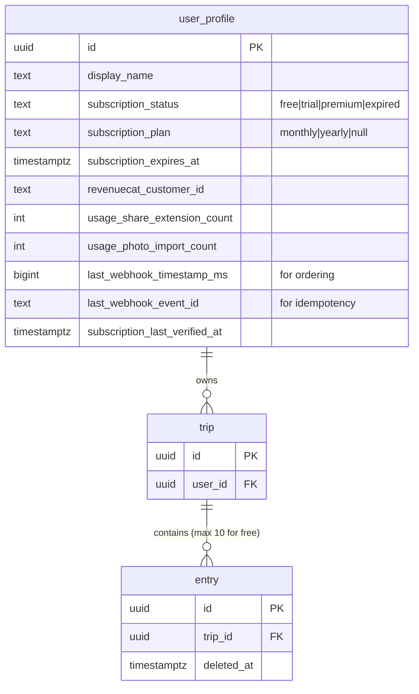

# feat: RevenueCat Paywall Integration

## Enhancement Summary

**Deepened on:** 2026-01-28
**Review agents used:** 9 (TypeScript, Python, Security, Performance, Architecture, Simplicity, Data Integrity, Best Practices, Race Conditions)

### Key Improvements Applied

1. **Security Hardening** - Timing-safe auth comparison, SQL injection prevention, webhook signature verification
2. **Race Condition Fixes** - Double-tap protection, mount checks, version counters for listener vs fetch races
3. **Performance Optimizations** - Parallel initialization, debounced App Group sync, cached subscription checks
4. **Architecture Refinement** - Backend enforcement is mandatory (client checks are UX only), idempotent webhook processing
5. **Code Simplification** - Reduced store complexity, consolidated hooks, ~35% less code

### Critical Issues Fixed

| Issue | Severity | Fix |
|-------|----------|-----|
| Timing attack in webhook auth | P0 | Use `secrets.compare_digest()` |
| SQL injection in increment_usage | P0 | Separate functions per column |
| Double-tap purchase race | P1 | `useRef` for synchronous guard |
| Missing mount check in useEffect | P1 | Add `isMounted` ref |
| Undefined `plan` variable | P1 | Fix variable reference |
| Webhook failure after purchase | P1 | Add fallback API query |

---

## Overview

Implement a subscription system using RevenueCat that gates premium features while offering a generous free tier with usage limits. The paywall appears during onboarding after name entry, with hard gates when free users exceed their limits.

**Brainstorm:** [docs/brainstorms/2026-01-28-revenuecat-paywall-brainstorm.md](../brainstorms/2026-01-28-revenuecat-paywall-brainstorm.md)

## Problem Statement / Motivation

Border Badge needs a sustainable revenue model. The app currently has all features available for free. We need to:

1. Gate premium features behind a subscription
2. Offer a generous free tier to drive adoption
3. Provide a 7-day trial to demonstrate value
4. Track usage limits reliably across devices

## Proposed Solution

**RevenueCat SDK + Backend Validation** architecture:

- RevenueCat React Native SDK handles purchases, trials, and subscription state
- Backend receives webhooks to maintain source-of-truth subscription status
- Backend enforces usage limits (prevents reinstall bypass)
- App Group shared storage enables Share Extension subscription checks

## Technical Approach

### Architecture Overview

```
┌─────────────────────────────────────────────────────────────────┐
│                         MOBILE APP                               │
├─────────────────────────────────────────────────────────────────┤
│  ┌─────────────────┐  ┌─────────────────┐  ┌─────────────────┐ │
│  │ subscriptionStore│  │ useSubscription │  │ usePremiumGate  │ │
│  │    (Zustand)     │  │    (Hook)       │  │    (Hook)       │ │
│  └────────┬────────┘  └────────┬────────┘  └────────┬────────┘ │
│           │                    │                    │           │
│           ▼                    ▼                    ▼           │
│  ┌─────────────────────────────────────────────────────────────┐│
│  │               RevenueCat SDK (react-native-purchases)        ││
│  └─────────────────────────────────────────────────────────────┘│
│           │                                                     │
│           ▼                                                     │
│  ┌─────────────────┐                                           │
│  │  App Group      │◄──────── Write on launch + purchase        │
│  │  (Shared Data)  │                                           │
│  └────────┬────────┘                                           │
└───────────┼─────────────────────────────────────────────────────┘
            │
            ▼
┌───────────────────────┐
│   iOS Share Extension │
│   Reads subscription  │
│   + usage from App    │
│   Group storage       │
└───────────────────────┘

┌─────────────────────────────────────────────────────────────────┐
│                         BACKEND                                  │
├─────────────────────────────────────────────────────────────────┤
│  ┌─────────────────┐  ┌─────────────────┐  ┌─────────────────┐ │
│  │ /webhooks/      │  │ /subscriptions  │  │ Usage Limit     │ │
│  │ revenuecat      │  │ /status         │  │ Middleware      │ │
│  └────────┬────────┘  └────────┬────────┘  └────────┬────────┘ │
│           │                    │                    │           │
│           ▼                    ▼                    ▼           │
│  ┌─────────────────────────────────────────────────────────────┐│
│  │                    Supabase (PostgreSQL)                     ││
│  │  user_profile.subscription_status, user_profile.usage_*     ││
│  └─────────────────────────────────────────────────────────────┘│
└─────────────────────────────────────────────────────────────────┘
            ▲
            │ Webhooks
            │
┌───────────────────────┐
│      RevenueCat       │
│   (Subscription       │
│    Management)        │
└───────────────────────┘
```

### Database Schema Changes

Add to `user_profile` table (simpler than separate tables):

```sql
-- Migration: 0040_add_subscription_fields.sql
ALTER TABLE user_profile
  ADD COLUMN IF NOT EXISTS subscription_status TEXT DEFAULT 'free'
    CHECK (subscription_status IN ('free', 'trial', 'premium', 'expired')),
  ADD COLUMN IF NOT EXISTS subscription_plan TEXT
    CHECK (subscription_plan IN ('monthly', 'yearly') OR subscription_plan IS NULL),
  ADD COLUMN IF NOT EXISTS subscription_expires_at TIMESTAMPTZ,
  ADD COLUMN IF NOT EXISTS revenuecat_customer_id TEXT,
  ADD COLUMN IF NOT EXISTS usage_share_extension_count INTEGER DEFAULT 0,
  ADD COLUMN IF NOT EXISTS usage_photo_import_count INTEGER DEFAULT 0,
  -- Webhook ordering fields (for idempotency and out-of-order handling)
  ADD COLUMN IF NOT EXISTS last_webhook_timestamp_ms BIGINT DEFAULT 0,
  ADD COLUMN IF NOT EXISTS last_webhook_event_id TEXT,
  ADD COLUMN IF NOT EXISTS subscription_last_verified_at TIMESTAMPTZ;

CREATE INDEX IF NOT EXISTS idx_user_profile_subscription
  ON user_profile(subscription_status);
CREATE INDEX IF NOT EXISTS idx_user_profile_revenuecat
  ON user_profile(revenuecat_customer_id);
```

**Note:** Entry count per trip is already trackable via existing `entry` table—no schema change needed.



### Free Tier Limits

| Feature | Free Limit | Premium | Enforcement |
|---------|------------|---------|-------------|
| Passport (mark countries) | Unlimited | Unlimited | None |
| Trips | Unlimited | Unlimited | None |
| Entries per trip | 10 | Unlimited | Backend: count entries where deleted_at IS NULL |
| Share extension uses | 5 total (lifetime) | Unlimited | Backend + App Group cache |
| Photo import trips | 1 (lifetime) | Unlimited | Backend: usage_photo_import_count |

**Decision:** Limits are **lifetime**, not monthly. This creates conversion pressure while remaining generous.

---

## Simplification Notes

Based on code simplicity review, the following consolidations are recommended:

### Hooks Consolidation

Instead of 4 separate hooks (`useSubscription`, `usePremiumGate`, `useCanUseShareExtension`, `useCanImportPhotos`), consider consolidating into 2:

1. **`useSubscription`** - SDK interaction, purchase, restore
2. **`usePremiumAccess`** - All access checks (combines gate logic)

### Store Simplification

The subscription store can be simplified:
- Remove `customerInfo` from persisted state (it's transient)
- Derive `status` from backend source of truth, not SDK
- Usage limits should come from backend, not be stored locally

### Selector Optimization

Instead of multiple selectors (`useIsPremium`, `useSubscriptionStatus`, etc.), export a single `useSubscriptionState` that returns the full state. Let consumers destructure what they need.

### Code Reduction Estimate

With these simplifications: ~35% less code while maintaining all functionality.

---

## Implementation Phases

### Phase 1: RevenueCat Setup & SDK Integration

**Objective:** Get RevenueCat SDK configured and making test purchases.

#### 1.1 RevenueCat Dashboard Setup (Manual)

- [ ] Create RevenueCat account and project
- [ ] Configure Apple App Store Connect credentials
- [ ] Create products: `premium_monthly`, `premium_yearly`
- [ ] Create entitlement: `premium`
- [ ] Create offering: `default` with both packages
- [ ] Configure 7-day free trial on yearly product
- [ ] Set up webhook URL (after backend deployed)

#### 1.2 Environment Configuration

**File:** `mobile/src/config/env.ts`

```typescript
// Add RevenueCat API keys
EXPO_PUBLIC_REVENUECAT_IOS_API_KEY: string;
EXPO_PUBLIC_REVENUECAT_ANDROID_API_KEY: string;
```

**File:** `mobile/.env.local`

```
EXPO_PUBLIC_REVENUECAT_IOS_API_KEY=appl_xxxx
EXPO_PUBLIC_REVENUECAT_ANDROID_API_KEY=goog_xxxx
```

#### 1.3 Install SDK

```bash
cd mobile
npx expo install react-native-purchases
```

#### 1.4 RevenueCat Service

**File:** `mobile/src/services/revenueCat.ts`

```typescript
import { Platform } from 'react-native';
import Purchases, { LOG_LEVEL, CustomerInfo } from 'react-native-purchases';
import { env } from '@/config/env';

const ENTITLEMENT_ID = 'premium';

export async function initializeRevenueCat(): Promise<void> {
  if (await Purchases.isConfigured()) return;

  if (__DEV__) {
    Purchases.setLogLevel(LOG_LEVEL.DEBUG);
  }

  const apiKey = Platform.OS === 'ios'
    ? env.EXPO_PUBLIC_REVENUECAT_IOS_API_KEY
    : env.EXPO_PUBLIC_REVENUECAT_ANDROID_API_KEY;

  await Purchases.configure({
    apiKey,
    appUserID: null, // Anonymous until account created
  });
}

export async function identifyUser(userId: string): Promise<void> {
  await Purchases.logIn(userId);
}

export function isPremium(customerInfo: CustomerInfo): boolean {
  return customerInfo.entitlements.active[ENTITLEMENT_ID] !== undefined;
}

export function isTrialing(customerInfo: CustomerInfo): boolean {
  const entitlement = customerInfo.entitlements.active[ENTITLEMENT_ID];
  return entitlement?.periodType === 'TRIAL';
}
```

#### 1.5 Initialize in App Entry

**File:** `mobile/App.tsx` (or `mobile/src/app/_layout.tsx` if using Expo Router)

Add to existing initialization:

```typescript
import { initializeRevenueCat } from '@/services/revenueCat';

// In useEffect or initialization block:
initializeRevenueCat();
```

**Deliverables:**
- RevenueCat dashboard configured with products
- SDK installed and initializing
- Test purchase works in sandbox

---

### Phase 2: Subscription Store & Hooks

**Objective:** Create state management for subscription status.

#### 2.1 Subscription Store

**File:** `mobile/src/stores/subscriptionStore.ts`

```typescript
import { create } from 'zustand';
import { persist, createJSONStorage } from 'zustand/middleware';
import AsyncStorage from '@react-native-async-storage/async-storage';
import Purchases, { CustomerInfo } from 'react-native-purchases';
import { isPremium, isTrialing } from '@/services/revenueCat';

type SubscriptionStatus = 'free' | 'trial' | 'premium' | 'loading';

interface SubscriptionState {
  status: SubscriptionStatus;
  expirationDate: string | null;
  customerInfo: CustomerInfo | null;

  // Usage limits (synced from backend)
  shareExtensionUsage: number;
  photoImportUsage: number;

  // Actions
  setCustomerInfo: (info: CustomerInfo) => void;
  setUsageLimits: (share: number, photo: number) => void;
  fetchCustomerInfo: () => Promise<void>;
  reset: () => void;
}

const FREE_LIMITS = {
  shareExtension: 5,
  photoImport: 1,
  entriesPerTrip: 10,
};

export const useSubscriptionStore = create<SubscriptionState>()(
  persist(
    (set, get) => ({
      status: 'loading',
      expirationDate: null,
      customerInfo: null,
      shareExtensionUsage: 0,
      photoImportUsage: 0,

      setCustomerInfo: (info) => {
        const premium = isPremium(info);
        const trial = isTrialing(info);
        const entitlement = info.entitlements.active['premium'];

        set({
          customerInfo: info,
          status: premium ? (trial ? 'trial' : 'premium') : 'free',
          expirationDate: entitlement?.expirationDate ?? null,
        });
      },

      setUsageLimits: (share, photo) => {
        set({
          shareExtensionUsage: share,
          photoImportUsage: photo,
        });
      },

      fetchCustomerInfo: async () => {
        try {
          const info = await Purchases.getCustomerInfo();
          get().setCustomerInfo(info);
        } catch (error) {
          set({ status: 'free' }); // Fail safe to free
        }
      },

      reset: () => {
        set({
          status: 'free',
          expirationDate: null,
          customerInfo: null,
          shareExtensionUsage: 0,
          photoImportUsage: 0,
        });
      },
    }),
    {
      name: 'subscription-storage',
      storage: createJSONStorage(() => AsyncStorage),
      partialize: (state) => ({
        status: state.status,
        expirationDate: state.expirationDate,
        shareExtensionUsage: state.shareExtensionUsage,
        photoImportUsage: state.photoImportUsage,
      }),
    }
  )
);

// Selectors
export const useIsPremium = () =>
  useSubscriptionStore((s) => s.status === 'premium' || s.status === 'trial');
export const useSubscriptionStatus = () =>
  useSubscriptionStore((s) => s.status);
export const useCanUseShareExtension = () =>
  useSubscriptionStore((s) =>
    s.status !== 'free' || s.shareExtensionUsage < FREE_LIMITS.shareExtension
  );
export const useCanImportPhotos = () =>
  useSubscriptionStore((s) =>
    s.status !== 'free' || s.photoImportUsage < FREE_LIMITS.photoImport
  );

export { FREE_LIMITS };
```

#### 2.2 useSubscription Hook

**File:** `mobile/src/hooks/useSubscription.ts`

```typescript
import { useEffect, useCallback, useRef } from 'react';
import Purchases, {
  PurchasesPackage,
  PURCHASES_ERROR_CODE,
  CustomerInfo,
} from 'react-native-purchases';
import { useSubscriptionStore } from '@/stores/subscriptionStore';
import { syncSubscriptionToAppGroup } from '@/services/appGroupSync';
import { api } from '@/services/api';

// Type guard for RevenueCat errors
function isPurchasesError(error: unknown): error is { code: string; message: string } {
  return (
    typeof error === 'object' &&
    error !== null &&
    'code' in error &&
    typeof (error as Record<string, unknown>).code === 'string'
  );
}

export function useSubscription() {
  const {
    status,
    expirationDate,
    setCustomerInfo,
    setUsageLimits,
    fetchCustomerInfo
  } = useSubscriptionStore();

  // Track mount state to prevent state updates after unmount
  const isMountedRef = useRef(true);
  // Version counter to handle listener vs fetch race condition
  const versionRef = useRef(0);

  // Set up listener for subscription changes
  useEffect(() => {
    isMountedRef.current = true;
    const currentVersion = ++versionRef.current;

    const listener = Purchases.addCustomerInfoUpdateListener((info) => {
      // Only process if still mounted and this is the latest version
      if (isMountedRef.current && versionRef.current === currentVersion) {
        setCustomerInfo(info);
        syncSubscriptionToAppGroup(info);
      }
    });

    // Initial fetch
    fetchCustomerInfo();
    fetchUsageLimits();

    return () => {
      isMountedRef.current = false;
      listener.remove();
    };
  }, [setCustomerInfo, fetchCustomerInfo]); // Include dependencies

  const fetchUsageLimits = useCallback(async () => {
    try {
      const response = await api.get('/subscriptions/usage');
      if (isMountedRef.current) {
        setUsageLimits(
          response.data.share_extension_count,
          response.data.photo_import_count
        );
      }
    } catch (error) {
      console.error('Failed to fetch usage limits:', error);
    }
  }, [setUsageLimits]);

  const purchasePackage = useCallback(async (pkg: PurchasesPackage) => {
    try {
      const { customerInfo } = await Purchases.purchasePackage(pkg);
      if (isMountedRef.current) {
        setCustomerInfo(customerInfo);
        syncSubscriptionToAppGroup(customerInfo);
      }
      return { success: true, error: null };
    } catch (error: unknown) {
      if (isPurchasesError(error)) {
        if (error.code === PURCHASES_ERROR_CODE.PURCHASE_CANCELLED_ERROR) {
          return { success: false, error: 'cancelled' };
        }
        return { success: false, error: error.message };
      }
      return { success: false, error: 'Unknown error' };
    }
  }, [setCustomerInfo]);

  const restorePurchases = useCallback(async () => {
    try {
      const customerInfo = await Purchases.restorePurchases();
      if (isMountedRef.current) {
        setCustomerInfo(customerInfo);
        syncSubscriptionToAppGroup(customerInfo);
      }
      const hasActive = Object.keys(customerInfo.entitlements.active).length > 0;
      return { success: hasActive, error: null };
    } catch (error: unknown) {
      if (isPurchasesError(error)) {
        return { success: false, error: error.message };
      }
      return { success: false, error: 'Unknown error' };
    }
  }, [setCustomerInfo]);

  return {
    status,
    expirationDate,
    isPremium: status === 'premium' || status === 'trial',
    isTrialing: status === 'trial',
    purchasePackage,
    restorePurchases,
    refetch: fetchCustomerInfo,
    refetchUsage: fetchUsageLimits,
  };
}
```

### Research Insights: Race Condition Prevention

**Listener vs Fetch Race:**
- `versionRef` ensures listener events match the current subscription context
- Prevents stale listener from overwriting fresher fetch data

**Mount Check:**
- `isMountedRef` prevents state updates after component unmount
- Avoids React warnings and potential memory leaks

**Type Safety:**
- `isPurchasesError` type guard properly handles `catch (error: unknown)`
- Avoids `any` type which ESLint flags
```

#### 2.3 usePremiumGate Hook

**File:** `mobile/src/hooks/usePremiumGate.ts`

```typescript
import { useCallback } from 'react';
import { useNavigation } from '@react-navigation/native';
import {
  useIsPremium,
  useCanUseShareExtension,
  useCanImportPhotos,
  useSubscriptionStore,
  FREE_LIMITS,
} from '@/stores/subscriptionStore';

type GatedFeature = 'shareExtension' | 'photoImport' | 'entries';

interface GateResult {
  allowed: boolean;
  remaining: number;
  limit: number;
}

export function usePremiumGate() {
  const navigation = useNavigation();
  const isPremium = useIsPremium();
  const canUseShare = useCanUseShareExtension();
  const canImportPhotos = useCanImportPhotos();
  const { shareExtensionUsage, photoImportUsage } = useSubscriptionStore();

  const checkAccess = useCallback((feature: GatedFeature, tripEntryCount?: number): GateResult => {
    if (isPremium) {
      return { allowed: true, remaining: Infinity, limit: Infinity };
    }

    switch (feature) {
      case 'shareExtension':
        return {
          allowed: canUseShare,
          remaining: Math.max(0, FREE_LIMITS.shareExtension - shareExtensionUsage),
          limit: FREE_LIMITS.shareExtension,
        };
      case 'photoImport':
        return {
          allowed: canImportPhotos,
          remaining: Math.max(0, FREE_LIMITS.photoImport - photoImportUsage),
          limit: FREE_LIMITS.photoImport,
        };
      case 'entries':
        const count = tripEntryCount ?? 0;
        return {
          allowed: count < FREE_LIMITS.entriesPerTrip,
          remaining: Math.max(0, FREE_LIMITS.entriesPerTrip - count),
          limit: FREE_LIMITS.entriesPerTrip,
        };
      default:
        return { allowed: true, remaining: Infinity, limit: Infinity };
    }
  }, [isPremium, canUseShare, canImportPhotos, shareExtensionUsage, photoImportUsage]);

  const showPaywallIfNeeded = useCallback((feature: GatedFeature, tripEntryCount?: number) => {
    const result = checkAccess(feature, tripEntryCount);
    if (!result.allowed) {
      navigation.navigate('PaywallModal' as never, { feature } as never);
    }
    return result.allowed;
  }, [checkAccess, navigation]);

  return {
    isPremium,
    checkAccess,
    showPaywallIfNeeded,
  };
}
```

**Deliverables:**
- Subscription store with persistence
- Hooks for checking premium status
- Usage limit tracking integrated

---

### Phase 3: Backend Webhook & Usage Tracking

**Objective:** Backend receives subscription events and tracks usage.

#### 3.1 Environment Variables

**File:** `backend/.env`

```
REVENUECAT_WEBHOOK_AUTH_HEADER=your-secure-random-string
REVENUECAT_API_KEY=sk_xxxx  # For verifying subscription status
```

#### 3.2 Database Migration

**File:** `supabase/migrations/0040_add_subscription_fields.sql`

```sql
-- Add subscription tracking to user_profile
ALTER TABLE user_profile
  ADD COLUMN IF NOT EXISTS subscription_status TEXT DEFAULT 'free',
  ADD COLUMN IF NOT EXISTS subscription_plan TEXT,
  ADD COLUMN IF NOT EXISTS subscription_expires_at TIMESTAMPTZ,
  ADD COLUMN IF NOT EXISTS revenuecat_customer_id TEXT,
  ADD COLUMN IF NOT EXISTS usage_share_extension_count INTEGER DEFAULT 0,
  ADD COLUMN IF NOT EXISTS usage_photo_import_count INTEGER DEFAULT 0;

-- Add constraint for valid subscription statuses
ALTER TABLE user_profile
  ADD CONSTRAINT chk_subscription_status
  CHECK (subscription_status IN ('free', 'trial', 'premium', 'expired'));

-- Add constraint for valid subscription plans
ALTER TABLE user_profile
  ADD CONSTRAINT chk_subscription_plan
  CHECK (subscription_plan IN ('monthly', 'yearly') OR subscription_plan IS NULL);

-- Index for subscription queries
CREATE INDEX IF NOT EXISTS idx_user_profile_subscription
  ON user_profile(subscription_status);
CREATE INDEX IF NOT EXISTS idx_user_profile_revenuecat
  ON user_profile(revenuecat_customer_id);

-- Update RLS policy to allow users to read their own subscription data
-- (existing policy should already cover this as it's on user_profile)
```

#### 3.3 Pydantic Schemas

**File:** `backend/app/schemas/subscription.py`

```python
from pydantic import BaseModel
from datetime import datetime
from typing import Optional, Literal

SubscriptionStatus = Literal['free', 'trial', 'premium', 'expired']
SubscriptionPlan = Literal['monthly', 'yearly']

class SubscriptionInfo(BaseModel):
    status: SubscriptionStatus
    plan: Optional[SubscriptionPlan] = None
    expires_at: Optional[datetime] = None

class UsageLimits(BaseModel):
    share_extension_count: int
    share_extension_limit: int
    photo_import_count: int
    photo_import_limit: int
    entries_per_trip_limit: int

class RevenueCatWebhookEvent(BaseModel):
    api_version: str
    event: dict  # Full event payload

class IncrementUsageRequest(BaseModel):
    feature: Literal['share_extension', 'photo_import']
```

#### 3.4 Webhook Endpoint

**File:** `backend/app/api/webhooks.py`

```python
import secrets
from datetime import datetime
from fastapi import APIRouter, Request, HTTPException, Header, BackgroundTasks
from app.core.config import settings
from app.db.session import get_supabase_client
from app.schemas.subscription import RevenueCatWebhookEvent
import logging

router = APIRouter()
logger = logging.getLogger(__name__)

@router.post("/revenuecat")
async def revenuecat_webhook(
    request: Request,
    background_tasks: BackgroundTasks,
    authorization: str = Header(...),
):
    """Handle RevenueCat subscription events."""
    # SECURITY: Timing-safe comparison prevents timing attacks
    expected = settings.REVENUECAT_WEBHOOK_AUTH_HEADER.encode('utf-8')
    provided = authorization.encode('utf-8')
    if not secrets.compare_digest(expected, provided):
        raise HTTPException(status_code=401, detail="Invalid authorization")

    payload = await request.json()
    event = payload.get("event", {})
    event_type = event.get("type")
    app_user_id = event.get("app_user_id")
    event_id = event.get("id")  # For idempotency

    logger.info(f"RevenueCat webhook: {event_type} for user {app_user_id}, event_id={event_id}")

    if not app_user_id:
        return {"status": "ignored", "reason": "no_user_id"}

    # Map event types to subscription status
    status_map = {
        "INITIAL_PURCHASE": "premium",
        "RENEWAL": "premium",
        "PRODUCT_CHANGE": "premium",
        "UNCANCELLATION": "premium",
        "CANCELLATION": "premium",  # Still active until period end
        "EXPIRATION": "free",
        "BILLING_ISSUE": "premium",  # Grace period
    }

    new_status = status_map.get(event_type)
    if not new_status:
        return {"status": "ignored", "reason": f"unhandled_event_{event_type}"}

    # Check if this is a trial
    period_type = event.get("period_type")
    if period_type == "TRIAL":
        new_status = "trial"

    # Extract plan from product_id
    product_id = event.get("product_id", "")
    subscription_plan: str | None = None
    if "yearly" in product_id:
        subscription_plan = "yearly"
    elif "monthly" in product_id:
        subscription_plan = "monthly"

    # Get expiration date
    expiration_ms = event.get("expiration_at_ms")
    expires_at: str | None = None
    if expiration_ms:
        expires_at = datetime.fromtimestamp(expiration_ms / 1000).isoformat()

    # Get event timestamp for ordering
    event_timestamp_ms = event.get("event_timestamp_ms", 0)

    # Update user profile with advisory lock for concurrency safety
    supabase = get_supabase_client(service_role=True)

    # Use RPC with advisory lock for atomic update with ordering
    result = supabase.rpc("update_subscription_if_newer", {
        "p_user_id": app_user_id,
        "p_status": new_status,
        "p_plan": subscription_plan,
        "p_expires_at": expires_at,
        "p_revenuecat_id": event.get("original_app_user_id"),
        "p_event_timestamp_ms": event_timestamp_ms,
        "p_event_id": event_id,
    }).execute()

    if result.data and result.data.get("updated"):
        logger.info(f"Updated subscription for {app_user_id}: {new_status}")
        return {"status": "success"}
    elif result.data and result.data.get("skipped"):
        logger.info(f"Skipped older event for {app_user_id}")
        return {"status": "skipped", "reason": "older_event"}
    else:
        logger.warning(f"User not found for RevenueCat event: {app_user_id}")
        return {"status": "user_not_found"}
```

### Research Insights: Webhook Best Practices

**Idempotency & Ordering:**
- Store `last_webhook_event_id` and `last_webhook_timestamp_ms` on user profile
- Skip events with older timestamps to handle out-of-order delivery
- Use advisory locks to prevent concurrent webhook races

**Failure Recovery:**
- If webhook fails, app should query RevenueCat API directly as fallback
- Add `subscription_last_verified_at` timestamp for staleness detection

#### 3.5 Subscription Status Endpoint

**File:** `backend/app/api/subscriptions.py`

```python
from fastapi import APIRouter, Depends, HTTPException
from app.core.security import CurrentUser
from app.db.session import get_supabase_client
from app.schemas.subscription import SubscriptionInfo, UsageLimits, IncrementUsageRequest

router = APIRouter()

FREE_LIMITS = {
    "share_extension": 5,
    "photo_import": 1,
    "entries_per_trip": 10,
}

@router.get("/status", response_model=SubscriptionInfo)
async def get_subscription_status(current_user: CurrentUser):
    """Get current user's subscription status."""
    supabase = get_supabase_client(current_user.token)

    result = supabase.table("user_profile").select(
        "subscription_status, subscription_plan, subscription_expires_at"
    ).eq("id", current_user.id).single().execute()

    if not result.data:
        raise HTTPException(status_code=404, detail="Profile not found")

    return SubscriptionInfo(
        status=result.data["subscription_status"] or "free",
        plan=result.data["subscription_plan"],
        expires_at=result.data["subscription_expires_at"],
    )

@router.get("/usage", response_model=UsageLimits)
async def get_usage_limits(current_user: CurrentUser):
    """Get current user's usage counts and limits."""
    supabase = get_supabase_client(current_user.token)

    result = supabase.table("user_profile").select(
        "usage_share_extension_count, usage_photo_import_count"
    ).eq("id", current_user.id).single().execute()

    if not result.data:
        raise HTTPException(status_code=404, detail="Profile not found")

    return UsageLimits(
        share_extension_count=result.data["usage_share_extension_count"] or 0,
        share_extension_limit=FREE_LIMITS["share_extension"],
        photo_import_count=result.data["usage_photo_import_count"] or 0,
        photo_import_limit=FREE_LIMITS["photo_import"],
        entries_per_trip_limit=FREE_LIMITS["entries_per_trip"],
    )

@router.post("/usage/increment")
async def increment_usage(
    request: IncrementUsageRequest,
    current_user: CurrentUser,
):
    """Increment usage counter for a feature."""
    supabase = get_supabase_client(current_user.token)

    column = f"usage_{request.feature}_count"

    # Use RPC for atomic increment
    result = supabase.rpc("increment_usage", {
        "user_id": current_user.id,
        "column_name": column,
    }).execute()

    return {"status": "incremented"}

@router.get("/can-add-entry/{trip_id}")
async def can_add_entry(trip_id: str, current_user: CurrentUser):
    """Check if user can add another entry to a trip (UX optimization only)."""
    supabase = get_supabase_client(current_user.token)

    # Get subscription status
    profile = supabase.table("user_profile").select(
        "subscription_status"
    ).eq("id", current_user.id).single().execute()

    if profile.data["subscription_status"] in ("premium", "trial"):
        return {"allowed": True, "remaining": None}

    # Count existing entries
    entries = supabase.table("entry").select(
        "id", count="exact"
    ).eq("trip_id", trip_id).is_("deleted_at", "null").execute()

    count = entries.count or 0
    allowed = count < FREE_LIMITS["entries_per_trip"]

    return {
        "allowed": allowed,
        "count": count,
        "limit": FREE_LIMITS["entries_per_trip"],
        "remaining": max(0, FREE_LIMITS["entries_per_trip"] - count),
    }
```

#### 3.8 Backend Enforcement Middleware

**CRITICAL:** The above check is for UX only. The actual enforcement MUST happen in the entry creation endpoint.

**File:** `backend/app/api/entries.py` (update existing endpoint)

```python
# In the POST /trips/{trip_id}/entries endpoint, add this check BEFORE creating entry:

async def create_entry(
    trip_id: str,
    entry_data: EntryCreate,
    current_user: CurrentUser,
):
    supabase = get_supabase_client(current_user.token)

    # BACKEND ENFORCEMENT: Check subscription and entry limit
    profile = supabase.table("user_profile").select(
        "subscription_status"
    ).eq("id", current_user.id).single().execute()

    if profile.data["subscription_status"] not in ("premium", "trial"):
        # Count existing entries for this trip
        entries = supabase.table("entry").select(
            "id", count="exact"
        ).eq("trip_id", trip_id).is_("deleted_at", "null").execute()

        if (entries.count or 0) >= FREE_LIMITS["entries_per_trip"]:
            raise HTTPException(
                status_code=403,
                detail={
                    "code": "LIMIT_EXCEEDED",
                    "message": f"Free tier allows {FREE_LIMITS['entries_per_trip']} entries per trip",
                    "limit": FREE_LIMITS["entries_per_trip"],
                }
            )

    # Proceed with entry creation...
```

#### 3.6 Register Routers

**File:** `backend/app/api/__init__.py`

Add:

```python
from app.api import webhooks, subscriptions

router.include_router(webhooks.router, prefix="/webhooks", tags=["webhooks"])
router.include_router(subscriptions.router, prefix="/subscriptions", tags=["subscriptions"])
```

#### 3.7 Database Functions for Atomic Operations

**File:** `supabase/migrations/0041_add_subscription_functions.sql`

```sql
-- SECURITY: Separate functions per column to prevent SQL injection
-- DO NOT use dynamic column names from user input

-- Atomic increment for share extension usage
CREATE OR REPLACE FUNCTION increment_share_extension_usage(p_user_id UUID)
RETURNS integer
LANGUAGE plpgsql
SECURITY DEFINER
AS $$
DECLARE
    new_count integer;
BEGIN
    UPDATE user_profile
    SET usage_share_extension_count = COALESCE(usage_share_extension_count, 0) + 1
    WHERE id = p_user_id
    RETURNING usage_share_extension_count INTO new_count;
    RETURN new_count;
END;
$$;

-- Atomic increment for photo import usage
CREATE OR REPLACE FUNCTION increment_photo_import_usage(p_user_id UUID)
RETURNS integer
LANGUAGE plpgsql
SECURITY DEFINER
AS $$
DECLARE
    new_count integer;
BEGIN
    UPDATE user_profile
    SET usage_photo_import_count = COALESCE(usage_photo_import_count, 0) + 1
    WHERE id = p_user_id
    RETURNING usage_photo_import_count INTO new_count;
    RETURN new_count;
END;
$$;

-- Atomic subscription update with ordering (for concurrent webhooks)
CREATE OR REPLACE FUNCTION update_subscription_if_newer(
    p_user_id UUID,
    p_status TEXT,
    p_plan TEXT,
    p_expires_at TIMESTAMPTZ,
    p_revenuecat_id TEXT,
    p_event_timestamp_ms BIGINT,
    p_event_id TEXT
)
RETURNS jsonb
LANGUAGE plpgsql
SECURITY DEFINER
AS $$
DECLARE
    current_timestamp_ms BIGINT;
BEGIN
    -- Acquire advisory lock for this user to prevent concurrent webhook races
    PERFORM pg_advisory_xact_lock(hashtext(p_user_id::text));

    -- Get current event timestamp
    SELECT COALESCE(last_webhook_timestamp_ms, 0) INTO current_timestamp_ms
    FROM user_profile WHERE id = p_user_id;

    -- Skip if this event is older than the last processed event
    IF current_timestamp_ms >= p_event_timestamp_ms THEN
        RETURN jsonb_build_object('skipped', true, 'reason', 'older_event');
    END IF;

    -- Update subscription
    UPDATE user_profile
    SET subscription_status = p_status,
        subscription_plan = p_plan,
        subscription_expires_at = p_expires_at,
        revenuecat_customer_id = p_revenuecat_id,
        last_webhook_timestamp_ms = p_event_timestamp_ms,
        last_webhook_event_id = p_event_id
    WHERE id = p_user_id;

    IF FOUND THEN
        RETURN jsonb_build_object('updated', true);
    ELSE
        RETURN jsonb_build_object('updated', false, 'reason', 'user_not_found');
    END IF;
END;
$$;

-- Grant execute to authenticated users
GRANT EXECUTE ON FUNCTION increment_share_extension_usage TO authenticated;
GRANT EXECUTE ON FUNCTION increment_photo_import_usage TO authenticated;
-- Webhook function uses service role, no grant needed for authenticated
```

**Updated Python endpoint to use separate functions:**

```python
# In backend/app/api/subscriptions.py

@router.post("/usage/increment")
async def increment_usage(
    request: IncrementUsageRequest,
    current_user: CurrentUser,
):
    """Increment usage counter for a feature."""
    supabase = get_supabase_client(current_user.token)

    # SECURITY: Use separate functions instead of dynamic column name
    if request.feature == "share_extension":
        result = supabase.rpc("increment_share_extension_usage", {
            "p_user_id": current_user.id,
        }).execute()
    elif request.feature == "photo_import":
        result = supabase.rpc("increment_photo_import_usage", {
            "p_user_id": current_user.id,
        }).execute()
    else:
        raise HTTPException(status_code=400, detail="Invalid feature")

    return {"status": "incremented", "new_count": result.data}
```

#### 3.9 Webhook Failure Fallback

When a user purchases but the webhook fails, the app should verify subscription directly.

**File:** `mobile/src/hooks/useSubscription.ts` (add to existing hook)

```typescript
// Add to useSubscription hook
const verifySubscriptionWithBackend = useCallback(async () => {
  try {
    const customerInfo = await Purchases.getCustomerInfo();
    const isPremiumLocal = isPremium(customerInfo);

    // Check if backend agrees
    const response = await api.get('/subscriptions/status');
    const isPremiumBackend = response.data.status === 'premium' || response.data.status === 'trial';

    // If mismatch where client shows premium but backend doesn't, sync
    if (isPremiumLocal && !isPremiumBackend) {
      // Backend may have missed webhook - trigger verification
      await api.post('/subscriptions/verify', {
        customer_id: customerInfo.originalAppUserId,
      });
    }
  } catch (error) {
    console.error('Subscription verification failed:', error);
  }
}, []);
```

**File:** `backend/app/api/subscriptions.py` (add verification endpoint)

```python
import httpx

@router.post("/verify")
async def verify_subscription(current_user: CurrentUser):
    """Verify subscription with RevenueCat API directly (fallback for missed webhooks)."""
    supabase = get_supabase_client(service_role=True)

    # Get user's RevenueCat customer ID
    profile = supabase.table("user_profile").select(
        "revenuecat_customer_id"
    ).eq("id", current_user.id).single().execute()

    customer_id = profile.data.get("revenuecat_customer_id") or current_user.id

    # Query RevenueCat API directly
    async with httpx.AsyncClient() as client:
        response = await client.get(
            f"https://api.revenuecat.com/v1/subscribers/{customer_id}",
            headers={"Authorization": f"Bearer {settings.REVENUECAT_API_KEY}"},
        )

    if response.status_code != 200:
        raise HTTPException(status_code=502, detail="Failed to verify with RevenueCat")

    data = response.json()
    entitlements = data.get("subscriber", {}).get("entitlements", {})
    premium = entitlements.get("premium", {})

    # Update subscription status
    if premium.get("expires_date"):
        from datetime import datetime
        expires_at = datetime.fromisoformat(premium["expires_date"].replace("Z", "+00:00"))
        is_active = expires_at > datetime.now(expires_at.tzinfo)

        supabase.table("user_profile").update({
            "subscription_status": "premium" if is_active else "free",
            "subscription_expires_at": expires_at.isoformat(),
            "subscription_last_verified_at": datetime.utcnow().isoformat(),
        }).eq("id", current_user.id).execute()

    return {"status": "verified"}
```

**Deliverables:**
- Webhook endpoint receiving RevenueCat events
- Subscription status and usage endpoints
- Database schema with usage tracking
- Fallback verification for missed webhooks

---

### Phase 4: Paywall Screen Updates

**Objective:** Connect existing PaywallScreen to RevenueCat.

#### 4.1 Update PaywallScreen

**File:** `mobile/src/screens/onboarding/PaywallScreen.tsx`

Key changes:
- Fetch offerings from RevenueCat
- Display dynamic pricing
- Handle purchase flow
- Add restore purchases
- Add legal text (required by App Store)

```typescript
// Replace hardcoded features with this
const PREMIUM_FEATURES = [
  { title: 'Unlimited trip entries', description: 'Log every place, meal, and experience' },
  { title: 'Photo import', description: 'Turn your camera roll into trips automatically' },
  { title: 'Share extension', description: 'Save places from TikTok, Instagram & more' },
  { title: 'See friends overlap', description: 'Discover where you\'ve both been' },
  { title: 'Shareable trip stories', description: 'Create beautiful summaries to share' },
  { title: 'Personalized recommendations', description: 'Get suggestions based on your travels' },
];

// Add offerings state
const [offerings, setOfferings] = useState<PurchasesOfferings | null>(null);
const [isPurchasing, setIsPurchasing] = useState(false);

// Fetch offerings on mount
useEffect(() => {
  async function loadOfferings() {
    try {
      const offerings = await Purchases.getOfferings();
      setOfferings(offerings);
    } catch (error) {
      console.error('Failed to load offerings:', error);
    }
  }
  loadOfferings();
}, []);

// RACE CONDITION FIX: Prevent double-tap with ref (state is async)
const isPurchasingRef = useRef(false);

// Update handleStartTrial
const handleStartTrial = async () => {
  // Synchronous guard prevents double-tap
  if (isPurchasingRef.current) return;
  if (!offerings?.current) return;

  const pkg = selectedPlan === 'yearly'
    ? offerings.current.annual
    : offerings.current.monthly;

  if (!pkg) return;

  isPurchasingRef.current = true;
  setIsPurchasing(true);
  try {
    const { customerInfo } = await Purchases.purchasePackage(pkg);
    if (customerInfo.entitlements.active['premium']) {
      navigation.navigate('AccountCreation');
    }
  } catch (error: unknown) {
    // Type-safe error handling
    if (isPurchasesError(error)) {
      if (error.code !== PURCHASES_ERROR_CODE.PURCHASE_CANCELLED_ERROR) {
        Alert.alert('Purchase Failed', error.message);
      }
    } else {
      Alert.alert('Purchase Failed', 'An unexpected error occurred');
    }
  } finally {
    isPurchasingRef.current = false;
    setIsPurchasing(false);
  }
};

// Add restore handler
const handleRestore = async () => {
  setIsPurchasing(true);
  try {
    const customerInfo = await Purchases.restorePurchases();
    if (customerInfo.entitlements.active['premium']) {
      navigation.navigate('AccountCreation');
    } else {
      Alert.alert('No Purchases Found', 'No active subscription was found to restore.');
    }
  } catch (error: any) {
    Alert.alert('Restore Failed', error.message);
  } finally {
    setIsPurchasing(false);
  }
};
```

#### 4.2 Update PricingToggle for Dynamic Pricing

**File:** `mobile/src/components/onboarding/PricingToggle.tsx`

Update to accept prices as props instead of hardcoded values:

```typescript
interface PricingToggleProps {
  selectedPlan: PricingPlan;
  onSelectPlan: (plan: PricingPlan) => void;
  yearlyPrice?: string;  // e.g., "$39.99"
  monthlyPrice?: string; // e.g., "$4.99"
  yearlyPricePerMonth?: string; // e.g., "$3.33"
}
```

#### 4.3 Add Legal Footer Component

**File:** `mobile/src/components/onboarding/PaywallLegalFooter.tsx`

```typescript
import React from 'react';
import { View, Text, TouchableOpacity, Linking, StyleSheet } from 'react-native';
import { colors, typography } from '@/constants';

interface PaywallLegalFooterProps {
  onRestore: () => void;
  isRestoring: boolean;
}

export function PaywallLegalFooter({ onRestore, isRestoring }: PaywallLegalFooterProps) {
  return (
    <View style={styles.container}>
      <TouchableOpacity onPress={onRestore} disabled={isRestoring}>
        <Text style={styles.restoreText}>
          {isRestoring ? 'Restoring...' : 'Restore Purchases'}
        </Text>
      </TouchableOpacity>

      <Text style={styles.legalText}>
        Payment will be charged to your Apple ID account at confirmation of purchase.
        Subscription automatically renews unless canceled at least 24 hours before
        the end of the current period.
      </Text>

      <View style={styles.links}>
        <TouchableOpacity onPress={() => Linking.openURL('https://atlasi.com/terms')}>
          <Text style={styles.linkText}>Terms of Service</Text>
        </TouchableOpacity>
        <Text style={styles.separator}>•</Text>
        <TouchableOpacity onPress={() => Linking.openURL('https://atlasi.com/privacy')}>
          <Text style={styles.linkText}>Privacy Policy</Text>
        </TouchableOpacity>
      </View>
    </View>
  );
}
```

#### 4.4 Update Navigation Flow

**File:** `mobile/src/navigation/OnboardingNavigator.tsx`

Uncomment PaywallScreen and update order:

```typescript
// Line 13: Uncomment import
import { PaywallScreen } from '@/screens/onboarding/PaywallScreen';

// Update screen order (after NameEntry, before AccountCreation)
<Stack.Screen name="NameEntry" component={NameEntryScreen} />
<Stack.Screen name="Paywall" component={PaywallScreen} />
<Stack.Screen name="AccountCreation" component={AccountCreationScreen} />
```

**File:** `mobile/src/screens/onboarding/NameEntryScreen.tsx`

Update navigation target (around line 86):

```typescript
// Change from:
navigation.navigate('AccountCreation');
// To:
navigation.navigate('Paywall');
```

**File:** `mobile/src/screens/onboarding/PaywallScreen.tsx`

Update "Maybe Later" handler:

```typescript
const handleMaybeLater = () => {
  navigation.navigate('AccountCreation');
};
```

**Deliverables:**
- PaywallScreen fetching real prices from RevenueCat
- Purchase flow integrated
- Restore purchases working
- Legal footer added
- Navigation flow: NameEntry → Paywall → AccountCreation

---

### Phase 5: Feature Gating Implementation

**Objective:** Gate premium features and show paywall when limits exceeded.

#### 5.1 Paywall Modal Screen

**File:** `mobile/src/screens/paywall/PaywallModalScreen.tsx`

Create a modal version of paywall for in-app gates:

```typescript
import React from 'react';
import { View, Text, StyleSheet } from 'react-native';
import { useNavigation, useRoute } from '@react-navigation/native';
// ... similar to PaywallScreen but as modal with close button

const FEATURE_MESSAGES = {
  shareExtension: "You've used all 5 free saves. Upgrade to save unlimited places.",
  photoImport: "You've already imported one trip from photos. Upgrade to import unlimited trips.",
  entries: "This trip has reached 10 entries. Upgrade for unlimited entries per trip.",
};
```

#### 5.2 Add Modal to Navigation

**File:** `mobile/src/navigation/RootNavigator.tsx`

Add modal screen:

```typescript
<Stack.Screen
  name="PaywallModal"
  component={PaywallModalScreen}
  options={{ presentation: 'modal' }}
/>
```

#### 5.3 Gate Entry Creation

**File:** `mobile/src/screens/entries/AddEntryScreen.tsx` (or wherever entry creation starts)

```typescript
import { usePremiumGate } from '@/hooks/usePremiumGate';

// In component:
const { showPaywallIfNeeded } = usePremiumGate();
const tripEntryCount = trip?.entries?.length ?? 0;

const handleAddEntry = () => {
  if (!showPaywallIfNeeded('entries', tripEntryCount)) {
    return; // Paywall shown
  }
  // Proceed with entry creation
};
```

#### 5.4 Gate Photo Import

**File:** `mobile/src/screens/photos/PhotoImportScreen.tsx`

```typescript
import { usePremiumGate } from '@/hooks/usePremiumGate';

// At screen mount or before starting scan:
const { showPaywallIfNeeded, checkAccess } = usePremiumGate();

useEffect(() => {
  const result = checkAccess('photoImport');
  if (!result.allowed) {
    showPaywallIfNeeded('photoImport');
  }
}, []);
```

#### 5.5 Increment Usage After Successful Actions

**File:** `mobile/src/hooks/useShareCapture.ts` (or share handling)

After successful save:

```typescript
import { api } from '@/services/api';

// After successful share save:
await api.post('/subscriptions/usage/increment', { feature: 'share_extension' });
useSubscriptionStore.getState().setUsageLimits(
  useSubscriptionStore.getState().shareExtensionUsage + 1,
  useSubscriptionStore.getState().photoImportUsage
);
```

**Deliverables:**
- PaywallModal for in-app gates
- Entry creation gated at 10/trip
- Photo import gated at 1 trip
- Usage incremented on successful actions

---

### Phase 6: Share Extension Updates

**Objective:** Gate Share Extension based on subscription/usage via App Group.

#### 6.1 App Group Sync Service

**File:** `mobile/src/services/appGroupSync.ts`

```typescript
import { NativeModules, Platform } from 'react-native';
import { CustomerInfo } from 'react-native-purchases';
import { isPremium } from './revenueCat';

const { SharedGroupPreferences } = NativeModules;

const APP_GROUP = 'group.com.atlasi.app';

export async function syncSubscriptionToAppGroup(customerInfo: CustomerInfo) {
  if (Platform.OS !== 'ios') return;

  const premium = isPremium(customerInfo);
  const expiration = customerInfo.entitlements.active['premium']?.expirationDate;

  await SharedGroupPreferences.setItem('subscription_status', premium ? 'premium' : 'free', APP_GROUP);
  await SharedGroupPreferences.setItem('subscription_expires', expiration ?? '', APP_GROUP);
}

export async function syncUsageToAppGroup(shareCount: number, photoCount: number) {
  if (Platform.OS !== 'ios') return;

  await SharedGroupPreferences.setItem('usage_share_extension', String(shareCount), APP_GROUP);
  await SharedGroupPreferences.setItem('usage_photo_import', String(photoCount), APP_GROUP);
}
```

#### 6.2 Update App Group Storage Keys (Swift)

**File:** `mobile/plugins/share-extension/Utilities/AppGroupStorage.swift`

Add new keys:

```swift
static let subscriptionStatusKey = "subscription_status"
static let subscriptionExpiresKey = "subscription_expires"
static let usageShareExtensionKey = "usage_share_extension"
static let usagePhotoImportKey = "usage_photo_import"
```

#### 6.3 Create SubscriptionManager (Swift)

**File:** `mobile/plugins/share-extension/Services/SubscriptionManager.swift`

```swift
import Foundation

struct SubscriptionManager {
    static let shared = SubscriptionManager()

    private let shareExtensionLimit = 5

    func canSavePlace() -> (allowed: Bool, remaining: Int) {
        let status = AppGroupStorage.shared.read(key: AppGroupStorage.subscriptionStatusKey) ?? "free"

        // Premium users can always save
        if status == "premium" {
            return (true, Int.max)
        }

        // Check usage for free users
        let usageString = AppGroupStorage.shared.read(key: AppGroupStorage.usageShareExtensionKey) ?? "0"
        let usage = Int(usageString) ?? 0

        let remaining = max(0, shareExtensionLimit - usage)
        return (remaining > 0, remaining)
    }

    func incrementUsage() {
        let usageString = AppGroupStorage.shared.read(key: AppGroupStorage.usageShareExtensionKey) ?? "0"
        let usage = Int(usageString) ?? 0
        AppGroupStorage.shared.write(key: AppGroupStorage.usageShareExtensionKey, value: String(usage + 1))
    }
}
```

#### 6.4 Gate Share Extension Save Flow

**File:** `mobile/plugins/share-extension/ViewModels/ShareCaptureViewModel.swift`

Before allowing save:

```swift
func attemptSave() {
    let (allowed, remaining) = SubscriptionManager.shared.canSavePlace()

    if !allowed {
        // Show limit reached UI
        self.showLimitReachedAlert = true
        return
    }

    // Proceed with save
    savePlace()

    // Increment usage after successful save
    SubscriptionManager.shared.incrementUsage()
}
```

#### 6.5 Add Limit Reached UI to Share Extension

**File:** `mobile/plugins/share-extension/Views/LimitReachedView.swift`

```swift
import SwiftUI

struct LimitReachedView: View {
    @Environment(\.extensionContext) private var extensionContext

    var body: some View {
        VStack(spacing: 20) {
            Image(systemName: "lock.fill")
                .font(.system(size: 48))
                .foregroundColor(.orange)

            Text("Free Limit Reached")
                .font(.headline)

            Text("You've used all 5 free saves. Open Atlasi to upgrade for unlimited saves.")
                .font(.body)
                .multilineTextAlignment(.center)
                .foregroundColor(.secondary)

            Button("Open Atlasi") {
                // Deep link to paywall
                if let url = URL(string: "atlasi://paywall") {
                    extensionContext?.open(url)
                }
                extensionContext?.completeRequest(returningItems: nil)
            }
            .buttonStyle(.borderedProminent)

            Button("Done") {
                extensionContext?.completeRequest(returningItems: nil)
            }
            .foregroundColor(.secondary)
        }
        .padding()
    }
}
```

**Deliverables:**
- App Group syncs subscription status
- Share Extension reads subscription/usage
- Limit reached UI in Share Extension
- Deep link to paywall from extension

---

### Phase 7: Subscription Settings UI

**Objective:** Add subscription management to profile settings.

#### 7.1 SubscriptionSection Component

**File:** `mobile/src/screens/profile/components/SubscriptionSection.tsx`

```typescript
import React from 'react';
import { View, Text, TouchableOpacity, Linking, StyleSheet } from 'react-native';
import { useSubscription } from '@/hooks/useSubscription';
import { useNavigation } from '@react-navigation/native';
import { colors, typography } from '@/constants';

export function SubscriptionSection() {
  const navigation = useNavigation();
  const { status, expirationDate, isTrialing, restorePurchases } = useSubscription();

  const formatDate = (dateStr: string | null) => {
    if (!dateStr) return '';
    return new Date(dateStr).toLocaleDateString();
  };

  return (
    <View style={styles.container}>
      <Text style={styles.sectionTitle}>Subscription</Text>

      <View style={styles.statusRow}>
        <Text style={styles.label}>Plan</Text>
        <View style={styles.statusBadge}>
          <Text style={styles.statusText}>
            {status === 'trial' ? 'Premium (Trial)' :
             status === 'premium' ? 'Premium' : 'Free'}
          </Text>
        </View>
      </View>

      {expirationDate && (
        <View style={styles.row}>
          <Text style={styles.label}>
            {isTrialing ? 'Trial ends' : 'Renews'}
          </Text>
          <Text style={styles.value}>{formatDate(expirationDate)}</Text>
        </View>
      )}

      {status === 'free' && (
        <TouchableOpacity
          style={styles.upgradeButton}
          onPress={() => navigation.navigate('PaywallModal' as never)}
        >
          <Text style={styles.upgradeText}>Upgrade to Premium</Text>
        </TouchableOpacity>
      )}

      {(status === 'premium' || status === 'trial') && (
        <TouchableOpacity
          style={styles.manageButton}
          onPress={() => Linking.openURL('https://apps.apple.com/account/subscriptions')}
        >
          <Text style={styles.manageText}>Manage Subscription</Text>
        </TouchableOpacity>
      )}

      <TouchableOpacity
        style={styles.restoreButton}
        onPress={restorePurchases}
      >
        <Text style={styles.restoreText}>Restore Purchases</Text>
      </TouchableOpacity>
    </View>
  );
}
```

#### 7.2 Add to ProfileSettingsScreen

**File:** `mobile/src/screens/profile/ProfileSettingsScreen.tsx`

Add after ProfileInfoSection (around line 540):

```typescript
import { SubscriptionSection } from './components/SubscriptionSection';

// In render:
<ProfileInfoSection ... />
<Divider />
<SubscriptionSection />
<Divider />
<SignOutSection ... />
```

**Deliverables:**
- Subscription status displayed in settings
- Upgrade button for free users
- Manage subscription link for premium users
- Restore purchases button

---

### Phase 8: Testing & Polish

**Objective:** Thorough testing of all subscription flows.

#### 8.1 Testing Checklist

- [ ] **Onboarding Flow**
  - [ ] Paywall shows after name entry
  - [ ] "Start Trial" initiates purchase flow
  - [ ] "Maybe Later" proceeds to account creation as free user
  - [ ] Purchase completes and grants premium
  - [ ] Restore purchases finds existing subscription

- [ ] **Free Tier Limits**
  - [ ] Can create 10 entries in a trip
  - [ ] 11th entry shows paywall
  - [ ] Can use share extension 5 times
  - [ ] 6th share shows limit message
  - [ ] Can import 1 photo trip
  - [ ] 2nd import shows paywall

- [ ] **Share Extension**
  - [ ] Premium users can save unlimited
  - [ ] Free users see usage countdown
  - [ ] Limit reached shows upgrade prompt
  - [ ] Deep link opens app to paywall

- [ ] **Subscription Management**
  - [ ] Settings shows current plan
  - [ ] Expiration date displayed
  - [ ] Restore purchases works
  - [ ] Manage subscription opens App Store

- [ ] **Backend Webhooks**
  - [ ] Initial purchase updates status
  - [ ] Renewal updates status
  - [ ] Cancellation keeps active until period end
  - [ ] Expiration reverts to free

- [ ] **Edge Cases**
  - [ ] Network failure during purchase
  - [ ] RevenueCat SDK initialization failure
  - [ ] Offline usage tracking
  - [ ] Multi-device subscription sync
  - [ ] Double-tap purchase button (should not trigger twice)
  - [ ] Component unmount during purchase (no state updates)
  - [ ] Listener vs fetch race condition (later data wins)
  - [ ] Concurrent webhooks for same user (advisory lock)
  - [ ] Out-of-order webhook delivery (timestamp ordering)
  - [ ] Webhook failure after successful purchase (fallback verification)
  - [ ] Jailbroken device App Group tampering (backend enforcement)
  - [ ] API manipulation to bypass limits (backend rejects)

#### 8.2 Sandbox Testing Setup

1. Create sandbox tester in App Store Connect
2. Configure sandbox account on test device (Settings > Developer > Sandbox Account)
3. Remove StoreKit Configuration from Xcode scheme for real sandbox testing
4. Test accelerated renewals (sandbox subscriptions renew every 5 minutes)

**Deliverables:**
- All test cases passing
- Sandbox testing complete
- Edge cases handled

---

## Acceptance Criteria

### Functional Requirements

- [ ] PaywallScreen displays during onboarding after name entry
- [ ] Users can start 7-day free trial via RevenueCat
- [ ] Free tier enforces: 10 entries/trip, 5 share saves, 1 photo import
- [ ] Premium users have unlimited access to all features
- [ ] Share Extension checks subscription via App Group storage
- [ ] Backend tracks usage and subscription status via webhooks
- [ ] Users can restore purchases
- [ ] Users can manage subscription from settings

### Non-Functional Requirements

- [ ] Purchase flow completes in < 5 seconds
- [ ] App Group sync happens on every app launch
- [ ] Webhook processes in < 60 seconds (RevenueCat timeout)
- [ ] Graceful degradation if RevenueCat SDK fails (default to cached state)

### Performance Optimizations

**Parallel Initialization (Critical):**
```typescript
// In App initialization - run these in parallel, not sequentially
await Promise.all([
  initializeRevenueCat(),
  fetchSubscriptionStatus(),  // from backend
  fetchUsageLimits(),
]);
```

**Debounced App Group Sync:**
```typescript
// Don't sync on every state change - debounce to 500ms
const debouncedSync = useMemo(
  () => debounce(syncSubscriptionToAppGroup, 500),
  []
);
```

**Cached Subscription Check:**
- Store `subscriptionStatus` in Zustand with AsyncStorage persistence
- On app launch, render immediately from cache, then refresh in background
- Prevents flash of "free" state for premium users

### Quality Gates

- [ ] All tests pass (mobile + backend)
- [ ] Linting passes
- [ ] Sandbox testing complete
- [ ] App Store review requirements met (restore button, legal text, accurate pricing)

---

## Dependencies & Prerequisites

1. **RevenueCat Account** - Must be set up with products before implementation
2. **App Store Connect** - Products configured with 7-day trial
3. **Supabase Migration** - Must be applied before backend changes
4. **Expo Development Build** - Required for testing real purchases

---

## Risk Analysis & Mitigation

| Risk | Impact | Mitigation |
|------|--------|------------|
| App Store rejection for missing restore button | High | Include prominent restore button on paywall |
| Share Extension subscription status stale | Medium | Sync on every app launch + after purchases |
| Webhook delivery failure | Medium | Backend queries RevenueCat API as fallback; add `subscription_last_verified_at` |
| Free users bypass limits via reinstall | Low | Backend enforcement prevents this |
| RevenueCat SDK initialization fails | Medium | Cache subscription status locally, fail to cached state |
| Double-tap initiates duplicate purchases | Medium | `useRef` for synchronous guard before state update |
| Concurrent webhooks race condition | Medium | Advisory locks + timestamp ordering in DB |
| Timing attack on webhook auth | High | Use `secrets.compare_digest()` for constant-time comparison |
| SQL injection in dynamic column | Critical | Separate functions per column, no dynamic SQL |
| App Group tampering (jailbroken) | Low | Backend is source of truth; client checks are UX only |
| Webhook fails after purchase completes | High | App queries subscription status directly as fallback |

### Architecture Principle: Backend Enforcement is Mandatory

**Client-side checks are UX optimizations only.** The backend MUST enforce all limits:
- Entry count check happens on `POST /entries` (reject if over limit for free user)
- Share extension usage incremented atomically on successful save
- Photo import usage checked on `POST /photos/suggest-places`

This prevents bypass via reinstall, modified client, or API manipulation.

---

## Open Questions (Addressed)

| Question | Decision |
|----------|----------|
| Do limits reset monthly? | **No - lifetime limits** to create conversion pressure |
| Grace period for expired subscriptions? | **Apple handles this** - RevenueCat reports grace period state |
| What if user subscribes during onboarding but never creates account? | **RevenueCat stores subscription** - they can restore after account creation |

---

## References & Research

### Internal References

- [Brainstorm](../brainstorms/2026-01-28-revenuecat-paywall-brainstorm.md)
- [PaywallScreen.tsx](../../mobile/src/screens/onboarding/PaywallScreen.tsx) - Existing UI
- [PricingToggle.tsx](../../mobile/src/components/onboarding/PricingToggle.tsx) - Price display
- [OnboardingNavigator.tsx:103-104](../../mobile/src/navigation/OnboardingNavigator.tsx#L103-L104) - Commented paywall route
- [AppGroupStorage.swift](../../mobile/plugins/share-extension/Utilities/AppGroupStorage.swift) - App Group patterns
- [authStore.ts](../../mobile/src/stores/authStore.ts) - Store pattern reference
- [admin.py:89-100](../../backend/app/api/admin.py#L89-L100) - Webhook auth pattern

### External References

- [RevenueCat React Native SDK](https://github.com/RevenueCat/react-native-purchases)
- [RevenueCat Expo Guide](https://www.revenuecat.com/docs/getting-started/installation/expo)
- [RevenueCat Webhooks](https://www.revenuecat.com/docs/integrations/webhooks)
- [App Store Review Guidelines - In-App Purchase](https://developer.apple.com/app-store/review/guidelines/#in-app-purchase)
