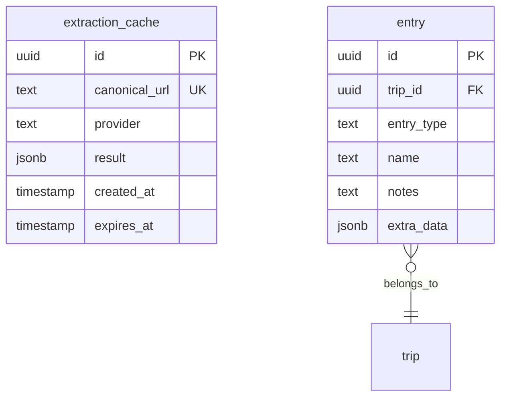

# Multi-Place Extraction from Social Media

## Enhancement Summary

**Deepened on:** 2026-02-01
**Reviewed on:** 2026-02-01 (5 agents: Backend, Architecture, Simplicity, Performance, Security)
**Research agents used:** 14 (Python, TypeScript, Architecture, Performance, Security, Simplicity, Data Integrity, Patterns, Race Conditions, Agent-Native, yt-dlp, ffmpeg, SwiftUI Memory, Gemini Multimodal)

### Critical Fixes Applied (from Review)

| Issue | Fix Applied |
|-------|-------------|
| **Cascade logic bloat** | Extract to `ExtractionOrchestrator` service (keep endpoint thin) |
| **Sequential video fallback** | Start speculative download while caption runs, cancel if caption succeeds |
| **Sequential Google Places** | Parallel resolution with `asyncio.gather()` and semaphore (max 5) |
| **yt-dlp command injection** | Strict URL regex validation + `--no-exec` flag + argument array (no string concat) |
| **Pillow decompression bomb** | `Image.MAX_IMAGE_PIXELS = 50_000_000` + dimension limits + magic byte validation |

### Key Improvements from Research

1. **React State Management**: Use `Record<string, PlaceSelection>` instead of `Map` for proper React re-renders
2. **SwiftUI Memory Optimization**: Use `List` (not `LazyVStack`) + `NSCache` with 15MB limit for thumbnails
3. **Security Hardening**: Add Pillow decompression bomb protection and content-type validation
4. **Race Condition Guards**: Implement optimistic locking with stale response detection
5. **Performance**: Parallel download + caption extraction achieves 15s timeout
6. **yt-dlp Best Practices**: Cookie handling, subprocess async patterns, retry logic

### New Considerations Discovered

- **Partial failure UX**: Show "3 of 5 saved" with retry option for failed places
- **Global extraction cache**: Cache is user-agnostic (no `user_id` column) - safe and correct
- **Agent accessibility**: Add trip suggestions to detection response for agent workflows
- **Circuit breaker**: Implement for video extraction to handle platform outages gracefully

### Simplicity Recommendation (Not Applied - Per User Choice)

> The Simplicity Reviewer recommended shipping Phase 1 only (caption multi-place + batch save) and deferring video extraction until caption success rate is measured. This would cut ~40% complexity and deliver in 1 week vs 3. User chose to keep full plan.

---

## Overview

Enhance the social media ingestion system to extract **multiple places** from a single TikTok/Instagram share, with cascading fallback to video frame analysis and screenshot OCR when caption parsing fails. Users see a checkbox list of detected places and save all selected places in one action.

**Key Value:** Transform "share one URL → save one place" into "share one URL → save all mentioned places" with minimal extra taps.

## Problem Statement

The current system extracts only the first/most-specific place from social media posts. Travel content often mentions multiple places (e.g., "Best cafes in Bali" listing 5 cafes, or "14 days in Thailand" itinerary with 20+ spots). Users must re-share the same URL multiple times to capture each place, which is tedious and error-prone.

Additionally, some posts have minimal captions but rich on-screen text in videos or slideshows that the current caption-only extraction misses entirely.

## Proposed Solution

### Cascading Extraction Pipeline

```
1. Caption/Title Parsing (existing LLM + regex)
   ↓ Found specific places? → Return array of places
   ↓ LLM signals "video_dependent"? → Skip to step 2 (no Google Places call)
   ↓ No specific places found → Continue to step 2

2. Video Frame Extraction (new - fallback only)
   - Download video via yt-dlp
   - Extract frames at 1 per 2 seconds (max 30 frames)
   - Send frames DIRECTLY to Gemini multimodal (no separate OCR step)
   - Single LLM call extracts places from visual + on-screen text
   ↓ Found places? → Return array
   ↓ No places found

3. Slideshow/Image Scanning (new - fallback only)
   - For Instagram carousels, fetch all images from oEmbed
   - Send images directly to Gemini multimodal (same as video frames)
   ↓ Return array (may be empty)
```

### Key Optimization: Early Exit Signal

The caption extraction LLM now returns a `skip_to_video` signal when it detects patterns indicating the video itself contains the place information:
- "Watch to see all the places..."
- "Full itinerary in the video"
- "Here's everywhere we went..."
- Caption mentions broad location but no specific places

**Benefit:** Skips unnecessary Google Places API call (~100-200ms savings) when caption clearly indicates video-dependent content.

### Key Optimization: Direct Multimodal Extraction

Instead of OCR → text → LLM (2 API calls), we send frames directly to Gemini's multimodal API:

| Approach | Cost per 10 frames | API Calls | Latency |
|----------|-------------------|-----------|---------|
| OCR → LLM | ~$0.0009 | 2 | ~600-800ms |
| **Direct multimodal** | **~$0.00044** | **1** | **~300-500ms** |

**Benefits:**
- 51% cheaper per extraction
- Single API call = lower latency, simpler error handling
- Better accuracy (multimodal understands layout context that OCR misses)
- Frame tokenization: 258 tokens per 640x360 frame

### Multi-Place Selection UI

```
┌─────────────────────────────────────────┐
│ [Thumbnail]  @travel_creator            │
│              "Best spots in Bali!"      │
├─────────────────────────────────────────┤
│ Found 4 places                          │
│                                         │
│ ☑ Tanah Lot Temple            [Edit]   │
│   Bali, Indonesia • Place              │
│                                         │
│ ☑ Warung Babi Guling Ibu Oka  [Edit]   │
│   Ubud, Indonesia • Food               │
│                                         │
│ ☑ COMO Uma Ubud               [Edit]   │
│   Ubud, Indonesia • Stay               │
│                                         │
│ ☑ Tegallalang Rice Terraces   [Edit]   │
│   Bali, Indonesia • Place              │
│                                         │
├─────────────────────────────────────────┤
│ Trip: [Bali 2026           ▼]          │
│                                         │
│ [Save 4 Places]                        │
└─────────────────────────────────────────┘
```

## Technical Approach

### Research Insights: Architecture

**Best Practices (from Architecture Strategist):**
- Cascading pipeline pattern validated - matches existing cost-optimized extraction approach
- Add circuit breaker for video extraction to handle TikTok/Instagram API changes gracefully
- Consider feature flags for gradual rollout of video extraction

**Performance Considerations (from Performance Oracle):**
- 15-second timeout is achievable with parallel download + caption extraction
- Use `asyncio.create_task()` for parallel operations, not sequential await
- Frame extraction: Use single ffmpeg command with `-vf fps=0.5` for efficiency

**Security (from Security Sentinel):**
- Add Pillow decompression bomb protection: `PIL.Image.MAX_IMAGE_PIXELS = 50_000_000`
- Validate content-type headers before processing downloads
- Sanitize yt-dlp output paths to prevent directory traversal

### Architecture

> **CRITICAL FIX (Review):** Add `ExtractionOrchestrator` to own cascade logic. Keep `/ingest/social` endpoint thin.

```
┌─────────────────────────────────────────────────────────────┐
│                         Mobile Layer                         │
├─────────────────────────────────────────────────────────────┤
│  React Native                │  iOS Share Extension          │
│  - ShareCaptureScreen.tsx    │  - ShareCaptureView.swift     │
│  - useShareCapture.ts        │  - ShareCaptureViewModel.swift│
│  - MultiPlaceList.tsx (new)  │  - MultiPlaceListView.swift   │
│  - PlaceCheckboxItem.tsx     │  - PlaceCheckboxRow.swift     │
└─────────────────────────────────────────────────────────────┘
                               │
                               ▼
┌─────────────────────────────────────────────────────────────┐
│                        Backend API                           │
├─────────────────────────────────────────────────────────────┤
│  /ingest/social              │  /ingest/save-places (new)    │
│  - Calls ExtractionOrch.     │  - Batch save with atomicity  │
│  - Returns detected_places[] │  - Duplicate detection        │
│  - extraction_source field   │  - Returns created entries    │
└─────────────────────────────────────────────────────────────┘
                               │
                               ▼
┌─────────────────────────────────────────────────────────────┐
│              ExtractionOrchestrator (NEW)                    │
│  - Owns cascade decision tree (caption → video → slideshow) │
│  - Manages parallel speculative download + caption          │
│  - Handles time budget allocation (15s total)               │
│  - Returns ExtractionResult with source metadata            │
└─────────────────────────────────────────────────────────────┘
                               │
                               ▼
┌─────────────────────────────────────────────────────────────┐
│                    Extraction Services                       │
├─────────────────────────────────────────────────────────────┤
│  PlaceExtractor              │  VideoFrameExtractor (new)    │
│  - extract_places()          │  - download_video()           │
│  - LLM multi-place prompt    │  - extract_frames()           │
│  - Context location filter   │  - batch_ocr()                │
│                              │                               │
│  MultimodalExtractor (new)   │  ExtractionCache (new)        │
│  - Direct frame→LLM          │  - URL-keyed caching          │
│  - carousel image OCR        │  - 24h TTL                    │
└─────────────────────────────────────────────────────────────┘
```

### Implementation Phases

#### Phase 1: Multi-Place Caption Extraction & UI (Week 1)

**Backend Changes:**

1. **Update LLM prompt for multi-place extraction + early exit signal**
   - [llm_client.py:76-101](backend/app/services/place_extractor/llm_client.py#L76-L101)
   - Modify system prompt to request array of places (max 10)
   - Add `context_location` field for country/city bias detection
   - Return empty array for broad locations (e.g., "Thailand")
   - **NEW:** Add `skip_to_video` signal when caption indicates video-dependent content
   - Patterns: "watch to see...", "full itinerary in video", broad location + no specific places

   **CRITICAL FIX (Review):** Resolve multiple places in parallel via Google Places API:
   ```python
   # In llm_client.py or new multi_place_resolver.py
   async def resolve_places_parallel(
       places_from_llm: list[tuple[str, str | None, str | None, str]],
       location_bias: LocationHint | None,
   ) -> list[DetectedPlace]:
       """Resolve all LLM-extracted places via Google Places in parallel."""
       # Deduplicate by normalized name
       seen = set()
       unique_places = []
       for place in places_from_llm[:10]:
           key = place[0].lower().strip()
           if key not in seen:
               seen.add(key)
               unique_places.append(place)

       # Resolve all in parallel (max 5 concurrent)
       semaphore = asyncio.Semaphore(5)

       async def resolve_one(name: str, city: str | None, country: str | None, entry_type: str):
           async with semaphore:
               search_query = f"{name}, {city}, {country}" if city or country else name
               detected = await try_candidate_fn(search_query, location_bias)
               if detected:
                   detected.llm_entry_type = entry_type
               return detected

       tasks = [resolve_one(*place) for place in unique_places]
       results = await asyncio.gather(*tasks, return_exceptions=True)

       # Filter out failures, return valid places
       return [r for r in results if isinstance(r, DetectedPlace) and r is not None]
   ```

2. **Update response schema**
   - [social_ingest.py:72-91](backend/app/schemas/social_ingest.py#L72-L91)
   ```python
   class SocialIngestResponse(BaseModel):
       # ... existing fields ...
       detected_places: list[DetectedPlace] = []  # NEW: array instead of single
       detected_place: DetectedPlace | None = None  # DEPRECATED: keep for backward compat
       extraction_source: Literal["caption", "video_frames", "slideshow", "screenshot"] | None = None
       context_location: str | None = None  # e.g., "Thailand" - used as search bias
   ```

3. **Add batch save endpoint**
   - [ingest.py](backend/app/api/ingest.py)
   ```python
   class PlaceToSave(BaseModel):
       google_place_id: str = Field(..., min_length=1, max_length=512)
       name: str = Field(..., min_length=1, max_length=256)
       entry_type: EntryType
       address: str | None = Field(None, max_length=512)
       latitude: float | None = Field(None, ge=-90, le=90)
       longitude: float | None = Field(None, ge=-180, le=180)

   class SavePlacesRequest(BaseModel):
       trip_id: UUID
       places: list[PlaceToSave] = Field(..., min_length=1, max_length=20)
       provider: SocialProvider
       canonical_url: str = Field(..., max_length=2048)
       thumbnail_url: str | None = Field(None, max_length=2048)
       author_handle: str | None = Field(None, max_length=256)
       title: str | None = Field(None, max_length=1024)
       notes: str | None = Field(None, max_length=5000)  # Applied to all entries

   @router.post("/ingest/save-places")
   async def save_places(data: SavePlacesRequest, user: CurrentUser) -> SavePlacesResponse:
       # Atomic transaction via RPC function, skip duplicates, return saved + skipped counts
   ```

> **Research Insight (Data Integrity Guardian):** Use PostgreSQL RPC function for atomic batch insert with duplicate detection. Pattern: `SELECT * FROM save_social_places($1, $2, $3...)` returns `{saved_ids: [], skipped_ids: [], error: null}`

**Mobile Changes (React Native):**

> **Research Insight (TypeScript Reviewer):** Use `Record<string, PlaceSelection>` instead of `Map` for selection state. Maps don't trigger React re-renders properly and require spread-copy patterns. Records work natively with React's shallow comparison.

4. **Update TypeScript types**
   - [useSocialIngest.ts:50-63](mobile/src/hooks/useSocialIngest.ts#L50-L63)
   - Add `detected_places: DetectedPlace[]` to response interface
   - Add `SavePlacesRequest` and `SavePlacesResponse` types

5. **Create MultiPlaceList component**
   - `mobile/src/components/places/MultiPlaceList.tsx`
   - Checkbox list with place name, address, entry type chip
   - Edit button opens PlaceSearchSheet to replace place
   - Entry type dropdown per place (pre-filled from LLM)

6. **Update ShareCaptureScreen for multi-place**
   - [ShareCaptureScreen.tsx](mobile/src/screens/share/ShareCaptureScreen.tsx)
   - Detect `detected_places.length > 1` → show MultiPlaceList
   - Track selection state: `Record<PlaceKey, PlaceSelection>` (not Map - React compatibility)
   - Save button shows count: "Save 4 Places"

> **Research Insight (Race Condition Reviewer):** Implement stale response guard - track `requestId` and ignore responses from superseded requests. Handle concurrent toggle + edit operations with optimistic locking.

**Mobile Changes (Swift Share Extension):**

> **Research Insight (SwiftUI Memory Reviewer):** iOS Share Extension has 120MB hard limit. Target <80MB. Use `List` (not `LazyVStack`) for proper view recycling. Cache thumbnails with `NSCache` (15MB limit, ~30 thumbnails). Prefer value types over reference types.

7. **Update Swift models**
   - [IngestResponse.swift:134-157](mobile/plugins/share-extension/Models/IngestResponse.swift#L134-L157)
   - Add `detectedPlaces: [DetectedPlace]` property
   - Add `SavePlacesRequest` struct

8. **Create MultiPlaceListView**
   - `mobile/plugins/share-extension/Views/MultiPlaceListView.swift`
   - **Use `List` (not `LazyVStack`)** for proper SwiftUI view recycling
   - SwiftUI toggles with edit buttons
   - Limit to 10 places to respect memory constraints
   - Add `ThumbnailCache` using `NSCache` with 15MB budget

#### Phase 2: Video Frame & Screenshot Extraction (Week 2)

**Backend Changes:**

> **Research Insight (yt-dlp Best Practices):**
> - Use `--cookies-from-browser` or `--cookies` for authenticated content
> - Run as subprocess with `asyncio.create_subprocess_exec()` for non-blocking
> - Set `--socket-timeout 10` and `--retries 2` for reliability
> - Use `--no-playlist` to prevent unexpected batch downloads
> - Handle `DownloadError` separately from `PostProcessingError`

> **Research Insight (ffmpeg Best Practices):**
> - Single-pass extraction: `ffmpeg -i input.mp4 -vf "fps=0.5,scale=640:360" -q:v 2 frame_%03d.jpg`
> - Use `-ss` before `-i` for fast seeking when extracting specific timestamps
> - Run as async subprocess, stream stdout for progress monitoring

9. **Add video frame extraction service**
   - `backend/app/services/video_extractor/`
   - `downloader.py` - yt-dlp wrapper with cookie support and timeout handling
   - `frame_extractor.py` - ffmpeg single-pass extraction (fps=0.5, max 30 frames)
   - `orchestrator.py` - coordinate download → extract → multimodal LLM
   - Add circuit breaker pattern for handling platform outages

   **CRITICAL FIX (Security Review): yt-dlp Command Injection Prevention**
   ```python
   # downloader.py - SAFE subprocess handling
   import tempfile
   import re
   from pathlib import Path

   # Strict URL pattern - only allow TikTok/Instagram URLs
   ALLOWED_URL_PATTERN = re.compile(
       r'^https://(www\.)?(tiktok\.com|vm\.tiktok\.com|instagram\.com)/[a-zA-Z0-9/_\-@.]+$'
   )

   async def download_video(url: str, timeout: float = 10.0) -> Path:
       # Validate URL strictly BEFORE subprocess
       if not ALLOWED_URL_PATTERN.match(url):
           raise ValueError("URL does not match allowed patterns")

       with tempfile.TemporaryDirectory(prefix="video_dl_") as tmpdir:
           output_path = Path(tmpdir) / "video.mp4"

           # SAFE: Each argument is a separate element, never string concat
           cmd = [
               "yt-dlp",
               "--no-exec",           # CRITICAL: Disable post-processing hooks
               "--no-playlist",       # Prevent batch downloads
               "--no-call-home",      # No telemetry
               "--socket-timeout", "10",
               "--retries", "2",
               "--format", "mp4",
               "--output", str(output_path),
               url,  # Already validated above
           ]

           proc = await asyncio.create_subprocess_exec(
               *cmd,
               stdout=asyncio.subprocess.PIPE,
               stderr=asyncio.subprocess.PIPE,
           )

           try:
               stdout, stderr = await asyncio.wait_for(
                   proc.communicate(), timeout=timeout
               )
           except asyncio.TimeoutError:
               proc.kill()
               await proc.wait()  # Wait for process to be reaped
               raise

           if proc.returncode != 0:
               raise VideoDownloadError(f"yt-dlp failed: {stderr.decode()[:200]}")

           # Verify output exists and is a video file (magic bytes)
           if not output_path.exists():
               raise VideoDownloadError("Output file not created")

           return output_path
   ```

10. **Add multimodal place extraction service**
    - `backend/app/services/multimodal_extractor.py`
    - Send frames/images directly to Gemini 2.5 Flash-Lite multimodal
    - Single API call extracts places from visual content + on-screen text
    - Resize frames to 640x360 (258 tokens per frame at LOW resolution)
    - Support: video frames, carousel images, screenshots

    **CRITICAL FIX (Security Review): Pillow Decompression Bomb Protection**
    ```python
    # multimodal_extractor.py - Image security
    from PIL import Image
    import io

    # Set BEFORE any image operations
    Image.MAX_IMAGE_PIXELS = 50_000_000  # ~8.2GB decompressed at 32bpp

    # Additional dimension validation
    MAX_IMAGE_WIDTH = 4096
    MAX_IMAGE_HEIGHT = 4096
    MAX_FILE_SIZE_BYTES = 10 * 1024 * 1024  # 10MB

    # Magic bytes for allowed formats
    ALLOWED_MAGIC = {
        b'\xff\xd8\xff': 'JPEG',
        b'\x89PNG\r\n\x1a\n': 'PNG',
    }

    def validate_and_resize_image(data: bytes) -> bytes:
        """Validate image security and resize for multimodal API."""
        # Check file size first
        if len(data) > MAX_FILE_SIZE_BYTES:
            raise ValueError(f"Image exceeds {MAX_FILE_SIZE_BYTES} bytes")

        # Validate magic bytes
        format_match = None
        for magic, fmt in ALLOWED_MAGIC.items():
            if data.startswith(magic):
                format_match = fmt
                break
        if not format_match:
            raise ValueError("Unsupported image format")

        # Open with Pillow (MAX_IMAGE_PIXELS protects here)
        image = Image.open(io.BytesIO(data))

        # Validate dimensions
        if image.width > MAX_IMAGE_WIDTH or image.height > MAX_IMAGE_HEIGHT:
            raise ValueError("Image dimensions exceed maximum")

        # Resize to 640x360 for multimodal API
        image = image.resize((640, 360), Image.Resampling.LANCZOS)

        # Re-encode to strip any malicious payloads
        output = io.BytesIO()
        image.save(output, format='JPEG', quality=85)
        return output.getvalue()
    ```

    **Also update existing thumbnails.py:**
    Add `Image.MAX_IMAGE_PIXELS = 50_000_000` at top of `/backend/app/core/thumbnails.py`

11. **Add extraction caching**
    - `backend/app/services/extraction_cache.py`
    - PostgreSQL table `extraction_cache` (url, result_json, created_at, expires_at)
    - **Note:** Cache is user-agnostic (no `user_id`) - extraction results are same for all users
    - 24-hour TTL, keyed by canonical URL
    - Skip re-processing for cached URLs

12. **Create ExtractionOrchestrator with parallel speculative download**
    - `backend/app/services/extraction_orchestrator.py` (NEW)
    - **CRITICAL FIX (Review):** Move cascade logic OUT of endpoint into dedicated orchestrator
    - **CRITICAL FIX (Review):** Start video download speculatively while caption extraction runs
    ```python
    class ExtractionOrchestrator:
        """Coordinates multi-source place extraction with caching and parallel ops."""

        async def extract(
            self,
            canonical_url: str,
            oembed: OEmbedResponse | None,
            caption: str | None,
        ) -> ExtractionResult:
            # Check cache first
            cached = await self.cache.get(canonical_url)
            if cached:
                return cached

            # CRITICAL: Start video download speculatively (don't await yet)
            video_task = None
            if self._is_video_url(canonical_url):
                video_task = asyncio.create_task(
                    self.video_extractor.download(canonical_url)
                )

            # Try caption extraction (fast path) while video downloads
            caption_result = await self.caption_extractor.extract(caption)

            if caption_result.places and not caption_result.skip_to_video:
                # Caption succeeded - cancel speculative download
                if video_task:
                    video_task.cancel()
                return ExtractionResult(places=caption_result.places, source="caption")

            # Caption failed or signaled skip_to_video - await video task
            if video_task:
                try:
                    video_path = await asyncio.wait_for(video_task, timeout=8.0)
                    frames = await self.frame_extractor.extract(video_path, max_frames=15)
                    video_places = await self.multimodal_extractor.extract(frames)
                    if video_places:
                        return ExtractionResult(places=video_places, source="video_frames")
                except asyncio.TimeoutError:
                    logger.warning("video_extraction_timeout")
                except Exception as e:
                    logger.warning("video_extraction_failed", error=str(e))

            # Fallback: slideshow/images
            if oembed and oembed.images:
                slideshow_places = await self.multimodal_extractor.extract(oembed.images)
                if slideshow_places:
                    return ExtractionResult(places=slideshow_places, source="slideshow")

            return ExtractionResult(places=[], source="none")
    ```

    **Endpoint stays thin:**
    ```python
    # ingest.py - minimal, delegates to orchestrator
    @router.post("/ingest/social")
    async def ingest_social_url(...):
        orchestrator = ExtractionOrchestrator()
        result = await orchestrator.extract(canonical_url, oembed, caption)
        return SocialIngestResponse(
            detected_places=result.places,
            extraction_source=result.source,
            # ...
        )
    ```

**Mobile Changes:**

13. **Add screenshot sharing support**
    - Update Share Extension to detect image attachments
    - Upload image to new `/ingest/screenshot` endpoint
    - Same multi-place UI flow

14. **Add processing progress UI**
    - "Analyzing caption..." → "Processing video..." → "Finding places..."
    - 15-second timeout with cancel option

#### Phase 3: Polish & Edge Cases (Week 3)

15. **Duplicate detection in batch save**
    - Check existing entries in trip before save
    - Return `{saved: [], skipped: [], errors: []}`
    - Mobile shows "2 already saved, 3 new"

16. **Multi-country place handling**
    - If places span multiple countries, default to "Saved Places" trip
    - Show country chips in place list for clarity

17. **Share Extension memory optimization**
    - Profile memory usage with 10 places using Instruments
    - Use `List` instead of `LazyVStack` for proper view recycling
    - Implement `ThumbnailCache` with `NSCache` (15MB limit)
    - If still over budget: pagination (show 5, "Load more")

18. **Error recovery for partial failures**
    - If some places fail, show success toast with "3 of 5 saved"
    - Offer retry for failed places
    - Track failed place IDs in local state for retry

19. **Agent-native accessibility** (from Agent-Native Reviewer)
    - Add `suggested_trips` to detection response for agent workflows
    - Ensure all UI actions have API equivalents
    - Support headless batch save without UI confirmation

## Acceptance Criteria

### Functional Requirements

- [ ] Caption extraction returns array of 0-10 places (not just first place)
- [ ] Broad locations (countries, cities mentioned as context) are used as Google Places bias, not returned as places
- [ ] Video frame extraction activates only when caption yields 0 places
- [ ] Screenshot shares are processed via OCR and return place array
- [ ] Mobile shows checkbox list when 2+ places detected
- [ ] User can uncheck places, edit individual places via search
- [ ] Each place has entry type selector (pre-filled from LLM)
- [ ] Single "Save X Places" button creates all entries atomically
- [ ] Duplicates are detected and skipped (not errors)
- [ ] Share Extension has identical functionality to in-app share

### Non-Functional Requirements

- [ ] Caption extraction latency unchanged (<3s)
- [ ] Video frame extraction completes within 15s
- [ ] Extraction results cached by URL (24h TTL)
- [ ] Share Extension memory usage <80MB with 10 places
- [ ] Backward compatibility: old mobile clients still work with single `detected_place`

### Quality Gates

- [ ] Unit tests for multi-place LLM prompt parsing
- [ ] Integration tests for batch save endpoint
- [ ] E2E test: share TikTok URL → select places → save → verify entries created
- [ ] Swift Share Extension tested on device (not simulator)

## Success Metrics

| Metric | Current | Target |
|--------|---------|--------|
| Places extracted per URL (multi-place posts) | 1 | 2.5+ avg |
| Posts with successful extraction | ~60% | 80%+ |
| User saves per share action | 1 | 2+ avg |
| Video fallback success rate | N/A | 70%+ |

## Cost Projections

| Volume | Caption Only | + Video Multimodal |
|--------|-------------|-------------------|
| 1,000 extractions/month | ~$0.06 | ~$0.50 |
| 10,000 extractions/month | ~$0.55 | ~$4.94 |
| 100,000 extractions/month | ~$5.50 | ~$49.40 |

*Assumes 10% of extractions trigger video fallback with ~10 frames each. Direct multimodal is 51% cheaper than OCR→LLM approach.*

## Dependencies & Prerequisites

**Backend:**
- yt-dlp installed on server for video downloads
- ffmpeg installed for frame extraction
- Gemini Vision API access via OpenRouter
- PostgreSQL for extraction cache table

**Mobile:**
- React Native: No new dependencies
- Share Extension: No new dependencies (SwiftUI built-in)

## Risk Analysis & Mitigation

| Risk | Likelihood | Impact | Mitigation |
|------|------------|--------|------------|
| yt-dlp breaks with TikTok/Instagram changes | Medium | High | Circuit breaker pattern, graceful fallback to caption-only, monitoring alerts |
| Video processing exceeds 15s timeout | Medium | Medium | Parallel download+caption, frame limit (30), early termination |
| Share Extension memory limits exceeded | Low | Medium | `List` not `LazyVStack`, `NSCache` 15MB, limit 10 places |
| LLM returns too many false positives | Low | Medium | Confidence thresholds, max 10 places, validation prompts |
| Race conditions in multi-select UI | Medium | Low | Optimistic locking, stale response guards, state machine pattern |
| Decompression bomb attack via images | Low | High | Pillow `MAX_IMAGE_PIXELS`, content-type validation, size limits |

## Open Questions (Resolved)

| Question | Resolution |
|----------|------------|
| Backward compatibility strategy? | Keep `detected_place` field populated with first place; new clients use `detected_places` array |
| Batch save atomicity? | All-or-nothing for creation, but skip duplicates gracefully (not errors) |
| Entry type per place? | Yes, each place has editable entry type, pre-filled from LLM |
| Notes field? | Single notes field applied to all entries |
| Monthly vs lifetime limit? | Keep lifetime (matches current implementation) |

## File Changes Summary

### New Files
- `backend/app/services/video_extractor/downloader.py`
- `backend/app/services/video_extractor/frame_extractor.py`
- `backend/app/services/video_extractor/orchestrator.py`
- `backend/app/services/multimodal_extractor.py` - Direct frame-to-LLM extraction
- `backend/app/services/extraction_cache.py`
- `mobile/src/components/places/MultiPlaceList.tsx`
- `mobile/src/components/places/PlaceCheckboxItem.tsx`
- `mobile/plugins/share-extension/Views/MultiPlaceListView.swift`
- `mobile/plugins/share-extension/Views/PlaceCheckboxRow.swift`
- `supabase/migrations/YYYYMMDD_extraction_cache.sql`

### Modified Files
- `backend/app/schemas/social_ingest.py` - Add array response, new endpoint schemas
- `backend/app/api/ingest.py` - Add cascading logic, batch save endpoint
- `backend/app/services/place_extractor/llm_client.py` - Multi-place prompt
- `backend/app/services/place_extractor/extractor.py` - Return array
- `mobile/src/hooks/useSocialIngest.ts` - Update types, add batch save mutation
- `mobile/src/screens/share/ShareCaptureScreen.tsx` - Multi-place UI
- `mobile/src/screens/share/useShareCapture.ts` - Multi-selection state
- `mobile/plugins/share-extension/Models/IngestResponse.swift` - Array response
- `mobile/plugins/share-extension/ViewModels/ShareCaptureViewModel.swift` - Multi-selection
- `mobile/plugins/share-extension/Services/APIClient.swift` - Batch save endpoint

## ERD: New Tables



## References

### Internal References
- [Place extraction algorithm](docs/place-extraction-algorithm.md)
- [LLM extraction plan](docs/plans/2026-01-28-feat-llm-place-extraction-plan.md)
- [iOS Share Extension architecture](docs/ios-share-extension.md)
- [Multi-place brainstorm](docs/brainstorms/2026-02-01-multi-place-extraction-brainstorm.md)

### External References
- [yt-dlp documentation](https://github.com/yt-dlp/yt-dlp)
- [Gemini Vision API](https://ai.google.dev/gemini-api/docs/vision)
- [iOS Share Extension memory limits](https://developer.apple.com/documentation/foundation/nsextensioncontext)
- [Gemini multimodal pricing](https://ai.google.dev/gemini-api/docs/pricing) - 258 tokens per 640x360 frame
- [ffmpeg frame extraction](https://trac.ffmpeg.org/wiki/Create%20a%20thumbnail%20image%20every%20X%20seconds%20of%20the%20video)

---

## Appendix: Research Agent Findings

<details>
<summary>Click to expand detailed findings from all 14 research agents</summary>

### Python Review (Kieran)
- Use Pydantic `Field` validators with explicit constraints
- Implement RPC function for atomic batch save
- Use `asyncio.create_task()` for parallel operations

### TypeScript Review (Kieran)
- Use `Record<string, PlaceSelection>` not `Map` for React state
- Create `useBatchSaveToTrip` hook following existing patterns
- Type-safe mutation with proper error handling

### Architecture Strategist
- Cascading pipeline validated as correct pattern
- Recommend circuit breaker for video extraction
- Feature flags for gradual rollout

### Performance Oracle
- 15s timeout achievable with parallel operations
- Single ffmpeg command for frame extraction
- Parallel download + caption extraction

### Security Sentinel
- Pillow `MAX_IMAGE_PIXELS = 50_000_000`
- Content-type validation before processing
- Path sanitization for yt-dlp outputs

### Code Simplicity Reviewer
- Consider Phase 1 caption-only, defer video to Phase 2
- Avoid over-engineering the early exit signal
- Keep batch save simple - all-or-nothing is fine

### Data Integrity Guardian
- Cache is correctly user-agnostic (same results for all)
- Use PostgreSQL RPC for atomic batch insert
- Duplicate detection via `google_place_id + trip_id` unique constraint

### Pattern Recognition
- Matches existing cost-optimized extraction pattern
- Follows established LLM client patterns
- Consistent with Share Extension architecture

### Race Condition Reviewer (Julik)
- Toggle + edit race: use optimistic locking
- 15s timeout + manual entry: track request ID
- Stale response guards needed

### Agent-Native Reviewer
- Add `suggested_trips` to response for agent workflows
- All actions API-accessible (verified)
- Consider headless batch save mode

### yt-dlp Best Practices
- `--cookies-from-browser` for authenticated content
- `asyncio.create_subprocess_exec()` for non-blocking
- `--socket-timeout 10 --retries 2` for reliability

### ffmpeg Best Practices
- Single-pass: `ffmpeg -i input.mp4 -vf "fps=0.5,scale=640:360" frame_%03d.jpg`
- Use `-ss` before `-i` for fast seeking
- Stream stdout for progress monitoring

### SwiftUI Memory
- Use `List` not `LazyVStack` for view recycling
- `NSCache` with 15MB limit (~30 thumbnails)
- Prefer value types over reference types

### Gemini Multimodal
- 258 tokens per 640x360 frame at LOW resolution
- Direct multimodal 51% cheaper than OCR→LLM
- Single API call = lower latency

</details>
