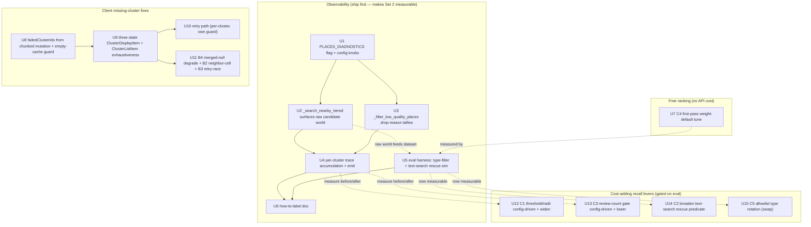
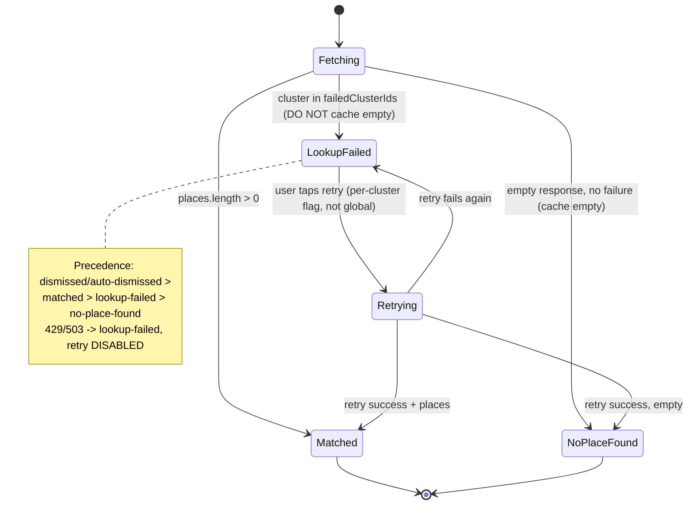
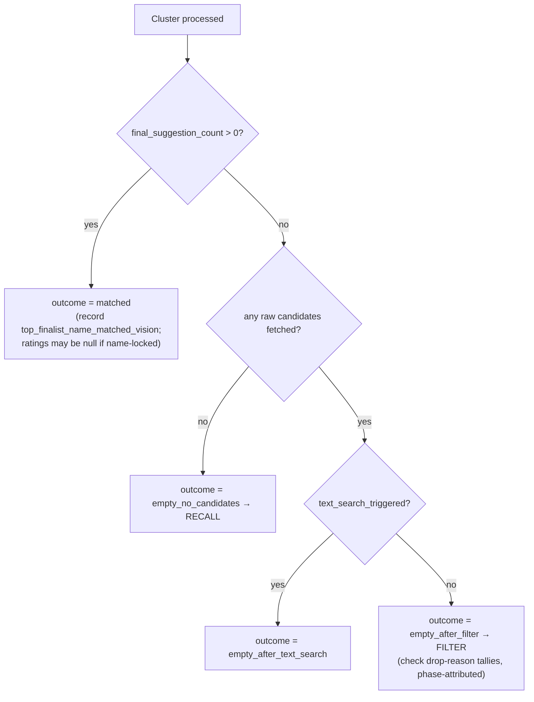

# fix: Photo Match Quality Remediation

## Summary

Remediate the two reported photo-import quality problems end to end:

1. **~50% of photo clusters never match a real place** — a recall + ranking ceiling in the backend place matcher.
2. **Some photo clusters silently disappear** from the mobile Suggestions screen — client-side drop bugs that conflate transient failures with real no-matches.

The work lands in dependency order: first an **observability layer** (per-cluster diagnostic traces behind a flag + an extended eval harness + a labeling how-to), so the cost-adding recall levers can be **measured rather than guessed**; then a **free ranking tune**; then the **client missing-cluster fixes** with an honest three-state model (matched / no-place-found / lookup-failed→retry); and finally the **cost-adding recall levers**, each gated behind the eval dataset.

The diagnostic doc (`docs/photo-match-quality-diagnostic.md`) is the origin and supplies the verified cause analysis (C1–C7 recall/ranking, B1–B6 client drops) and the Set 1 (free) / Set 2 (cost-adding) split. This plan executes both sets, with Set 2 sequenced after observability and held to the ranking eval gate (`top1=1.0 mrr=1.0`).

---

## Problem Frame

The place matcher pipeline (`backend/app/services/place_matcher/`, mixin-composed: `SearchMixin`, `RankingMixin`, `ClusterProcessingMixin`) processes one GPS photo cluster at a time: tiered Nearby search → quality filter → optional Text Search rescue → first-pass distance ranking → top-3 finalists → enrichment + re-gate + backfill + re-rank. It **always returns one `ClusterSuggestion` per cluster** (`places: []` when empty), so the missing-cluster bug is provably client-side.

Two ceilings cause the ~50% match rate (ranked by code-analysis confidence, **not** measured impact — that is what the observability layer produces):

- **Recall ceiling (C1 + C5/C6):** tiered search stops once `MIN_QUALITY_RESULTS_BEFORE_STOP = 5` quality places accumulate; with 20–80 m indoor GPS drift the actually-visited venue can sit one tier out and never gets fetched. The threshold and radii are hardcoded in `constants.py`. Separately, the 50-type `includedTypes` allowlist (at the API max) and the sparse-density radii profile leave marginal recall gaps.
- **Ranking ceiling (C4 + C3):** the cost-saving `WIDE_FIELD_MASK` strips `rating`/`userRatingCount`, so first-pass finalist selection is distance-dominated (distance + dwell + vision + name-match). A closer wrong place can consume a top-3 slot, and enrichment only re-ranks *within* the 3 finalists — a correct place that never reached the top 3 is unrecoverable.
- **SIGNAL class (C2, partially addressed):** the diagnostic's takeaway names the recall ceiling as **C1 + C2**, where C2 = "no vision signal → GPS-only matching." Indoor shots, food close-ups, dark nightlife, and non-Latin signage without romanization produce no business name → text-search rescue never fires → the cluster degrades to GPS-only and inherits every C1/C4 weakness. **If the client sends no vision images for a cluster, there is zero vision context at all.** This plan broadens the rescue *predicate* (U14) and surfaces SIGNAL-class clusters in the trace (`had_images`, `outcome`), but a genuinely vision-blind cluster has no romanized name to rescue on — so SIGNAL is *measured* here and *partially* mitigated, not fully solved. U16 carries the diagnostic's open question (does the client reliably send vision images?) so the eval doesn't surface an un-actionable bucket.

On the client, every non-dismissed cluster *should* render a card, but several paths silently drop them: transient API/chunk failures render as photos-only "No place found" (indistinguishable from a real empty — **B1**), a merged-suggestion null path drops a whole card (**B4**), venue-split centroid drift defeats the cache (**B2**), and a stale-request race discards the active candidate's results (**B3**).

The instrument that turns confidence rankings into measured numbers — a real labeled dataset — does not exist yet. The eval harness (`backend/scripts/eval_place_matcher.py`) already has a `--pipeline` mode (`candidate_recall` vs `e2e_top1` vs `avg_nearby_calls`); it lacks (a) a real dataset and (b) simulation of two of the four cost levers.

---

## Scope Boundaries

### In scope

- Backend per-cluster diagnostic traces behind a `PLACES_DIAGNOSTICS` flag, dumping the **full raw candidate world** per cluster (every place at every radius, pre-filter) plus filter-drop tallies, vision signals, finalists, and an outcome classification.
- Extending the eval harness `--pipeline` mode to simulate `includedTypes` type-filtering (C5) and text-search rescue (C2) so all four Set-2 levers are gate-measurable.
- A labeling how-to doc (`backend/docs/how-to-label-place-matcher-dataset.md`).
- Free first-pass ranking tune via existing config weight defaults (C4).
- Cost-adding recall levers, each measured before/after: config-driven + raised search threshold/radii (C1); config-driven + lowered review-count gate (C3); broadened text-search rescue predicate (C2); higher-value type rotation in the allowlist (C5, a **swap** — the list is at the 50-type API max).
- Mobile three-state cluster model (matched / no-place-found / lookup-failed) with retry of only the failed clusters, plus the B2/B3/B4 point fixes and the empty-cache-poisoning correctness fix.

### Deferred to Follow-Up Work

- Producing the *actual* labeled dataset from a real import is a **user action** the how-to doc enables; this plan ships the instrument, not the captured data. The Set-2 levers' default-value changes are written to be measured against that dataset once it exists — the plan delivers the levers as config-gated, eval-validated changes, but final default tuning depends on the real data.
- A visible UI affordance for B6 auto-dismiss ("these photos were already saved") — diagnostic recommends an affordance, not a code fix; out of this plan's bug-fix scope.
- Applying migration `0057_persistent_place_cache.sql` (a pre-existing user action that affects Set-2 cost absorption, not correctness).

### Out of scope

- Re-architecting clustering (geohash + union-find merge was a deliberate prior decision).
- Re-chasing already-landed work on this branch: vision name-match dominance, enrichment-skip, ≥5-candidate accumulation, single-word names, low-confidence text-search-on-empty, the `MIN_REVIEW_COUNT` re-gate (all shipped — see origin and `places-cost-reduction` memory).
- The 50-images/request vision cap (verified non-finding; never fires at `CHUNK_SIZE=15`).

---

## Key Technical Decisions

**KTD1 — The diagnostic trace dumps the full raw candidate world, AND backfills finalist ratings onto it.**
For the eval's `candidate_recall` metric to mean anything, the dataset's `places[]` must be the complete candidate world per cluster (the `--pipeline` mode treats `places[]` as the whole world). A finalists-only trace makes recall unmeasurable. Consequence: `_search_nearby_tiered` must surface richer per-radius data (raw results per radius, radii searched, stopped-early), changing its return shape. This is the upstream keystone for the whole observability layer.

**Critical correction (feasibility review, confidence 100):** `WIDE_FIELD_MASK` (`constants.py:362-372`) strips `rating`/`userRatingCount`, so the raw candidates carry **null ratings**. This splits the two eval metrics:
- `candidate_recall` (`eval_place_matcher.py:348-350`) checks only `expected_place_id ∈ {p.id}` — **clean on null-rated candidates.**
- `e2e_top1` (`eval_place_matcher.py:353-360`) runs `_rank_by_distance`, which reads `rating`/`userRatingCount` (`_matcher_ranking.py:154-155`). On null-rated candidates the review/rating/fame terms collapse to zero, so it measures the **first-pass** ranking, not the production post-enrichment re-rank. The captured dataset and the fully-rated sample dataset would then measure *different pipelines under the same metric name* — corrupting the C4/U7/U12/U13 ranking measurement.

Therefore the trace must **backfill the enrichment ratings** (which U4 already captures per finalist) onto the matching entries in `raw_candidates`, and U6 must instruct the labeler to fetch `rating`/`userRatingCount` from Google Maps for any non-finalist candidate that needs to be ranking-evaluated. Without this, `e2e_top1` on captured data is rating-blind. *(Resolves flow-analysis C5/I7 + feasibility Finding 1, confirmed with user that the trace dumps the full world.)*

**KTD2 — A single mutable per-cluster diagnostic dict, accumulated across all four passes, emitted once.**
The trace fields span search → text-search → first-pass → enrich. `text_search_triggered`/`text_search_hit`, `outcome`, and finalist data cannot be reconstructed from a single end-of-function read of local state. Accumulate a per-cluster dict mutated across passes, emit once at the end of `find_places_for_clusters`. *(Resolves I2.)*

**KTD3 — `outcome` classifies *empty* clusters only; RANKING failures are post-labeling.**
The four outcomes (`matched` / `empty_after_filter` / `empty_no_candidates` / `empty_after_text_search`) separate the empty failure classes. A "matched-but-wrong-top" (RANKING) failure is **not** knowable at trace time (no label yet) — it is derived in the eval after labeling. The trace records a `top_finalist_name_matched_vision` boolean and accepts null finalist ratings for name-match-locked / enrichment-skipped clusters (still `matched`). Document this honestly so null ratings aren't misread as a data bug. *(Resolves I1.)*

**KTD4 — New recall tunables follow the existing pydantic `Settings` pattern; `constants.py` defaults stay as fallbacks.**
The 7 ranking weights are already env-overridable `Field`s in `config.py`; `MIN_QUALITY_RESULTS_BEFORE_STOP`, radii, and `MIN_REVIEW_COUNT` are hardcoded in `constants.py`. Migrate them into `Settings` (read via `self._settings`), keeping the `constants.py` values as the `default=`. `PLACES_DIAGNOSTICS` is one more `Settings` boolean under the existing `# Feature flags` block (mirrors `llm_place_extraction_enabled`).

**KTD5 — C4 (free ranking) ships as config weight-default changes only, validated by `--pipeline`.**
First-pass signals are distance/dwell/vision/name-match (rating/reviews are zero pre-enrichment). The free win is tuning `places_rank_*_weight` defaults so correct places stay in the top 3 — no code-path change. Held to `top1=1.0 mrr=1.0` on the sample dataset and improved `e2e_top1` on `--pipeline`.

**KTD6 — The lookup-failed signal originates at the failure site as a `failedClusterIds` set; the three-state model is driven by that set, not by the global loading flag.**
`fetchSuggestions` currently swallows errors and returns `undefined`; the chunked mutation resolves successfully even when a chunk throws. Neither emits which clusters failed. The chunked mutation must emit `failedClusterIds` (every cluster in every chunk that threw), threaded into `useClusterItems`. This is the keystone for the client three-state model — without it, lookup-failed cannot be distinguished from no-place-found. *(Resolves B1 — the client transient-failure conflation.)*

**KTD7 — Retry is a dedicated per-cluster path with its own in-flight guard and a per-cluster "retrying" state, never the global `fetchingSuggestions` flag.**
Reusing the global flag would re-hide every healthy photos-only card during retry (it gates `useClusterItems` rendering). Retry takes an explicit failed-id list, bypasses candidate-level caching but respects the SQLite cache (so chunk-1 successes aren't re-bought), and has its own race guard independent of the candidate-stale guard. *(Resolves B1/B3 — the client retry + stale-race silent drops; I5 is the retry-vs-fetch race noted in flow analysis.)*

**KTD8 — A lookup-failed cluster must never be cached as empty.**
The current cache guard keys off `failed_cluster_count` (per-cluster *timeouts*), not *chunk* failures — so a failed chunk's clusters get cached as `[]` for 24h (`EMPTY_SUGGESTION_TTL_MS`). Exclude failed-chunk clusters from the empty-cache write, in both `fetchSuggestions` and `fetchForClusters`. *(Resolves the B1 cache-poisoning facet; free correctness fix independent of the UI.)*

**KTD9 — B2 fix queries neighboring geohash cells; it does not coarsen the key.**
`GEOHASH_PRECISION = 7` (~153 m cells, shared by clustering and the cache location-key fallback). Coarsening the fallback key would risk serving a *different nearby venue's* cached places — a silent quality regression contradicting the whole effort. Instead, on a fallback miss, query the 8 neighbor cells and pick nearest-centroid. *(Resolves I4.)*

**KTD10 — Quota/rate-limit failures (429/503) map to lookup-failed but with retry disabled + the existing time-gated message; network/timeout/unknown map to lookup-failed with retry enabled.**
An immediate retry button is misleading for daily-quota exhaustion. *(Resolves M3.)*

**Contradiction to resolve (testing review):** `useSuggestPlacesChunked` currently **re-throws** `QuotaExhaustedError`/`RateLimitError` (429/503) at `usePhotoImport.ts:182-191`, rejecting the whole mutation — so the `failedClusterIds` set (KTD6) is never populated for the quota case, and those clusters would silently vanish again (re-introducing B1 for exactly the case KTD10 claims to fix). **Resolution:** the chunked mutation must, on a fatal 429/503, record all remaining (un-responded) cluster IDs into `failedClusterIds` with a `retryDisabled` marker *before* surfacing the fatal error — so the three-state model still tags them `lookup-failed` (retry disabled) rather than dropping them. U8 owns this; U9/U10 consume the `retryDisabled` flag.

---

## High-Level Technical Design

### Dependency / sequencing graph

### Three-state cluster model (client)

### Diagnostic trace outcome classification (backend, empty clusters)

---

## Implementation Units

> Bug-fix posture (CLAUDE.md): every B-path client fix and every behavior-changing backend fix starts with a **failing test that reproduces the bug**, then the fix. Backend stays `pytest` + `ruff` green; mobile stays `npm test` + `lint` + `format:check` green.

### U1. `PLACES_DIAGNOSTICS` feature flag + recall config knobs

**Goal:** Add the diagnostics feature flag and migrate the hardcoded recall tunables into `Settings`, so later units can read them via `self._settings`.

**Requirements:** Enables Part C (diagnostics) and KTD4; prerequisite for U2, U3, U4, U12, U13.

**Dependencies:** none.

**Files:**
- `backend/app/core/config.py` (add `Field`s)
- `backend/tests/test_config.py` or nearest config test (assert defaults + env override)

**Approach:** Add `places_diagnostics: bool = Field(default=False, ...)` under `# Feature flags` (mirror `llm_place_extraction_enabled`). Add `places_min_quality_results_before_stop: int = Field(default=5, ge=1, le=20)`, `places_min_review_count: int = Field(default=5, ge=0, le=50)`, and a radii-override knob (decide shape in U12 — likely a max-radius cap or an extra outer tier, kept simple; default preserves current `DENSITY_SEARCH_RADII`). Keep `constants.py` values as the `default=`. Do **not** yet wire them into the mixins (U2/U12/U13 do that) — this unit only declares them.

**Patterns to follow:** `places_rank_*_weight` and `multimodal_max_resolved_places` `Field` definitions in `config.py:93-159`; `case_sensitive=False` so `PLACES_DIAGNOSTICS` maps to `places_diagnostics`.

**Test scenarios:**
- Happy path: `Settings()` defaults — `places_diagnostics is False`, `places_min_quality_results_before_stop == 5`, `places_min_review_count == 5`.
- Edge: env var `PLACES_DIAGNOSTICS=true` → flag True; `PLACES_MIN_REVIEW_COUNT=3` → 3.
- Edge: out-of-range value (`places_min_review_count=-1`) raises validation error (`ge=0`).

**Verification:** New `Field`s present with correct bounds; env overrides resolve; existing config tests still pass.

---

### U2. `_search_nearby_tiered` surfaces the raw candidate world + per-radius metadata

**Goal:** Make the tiered search return enough for the trace to dump the full pre-filter candidate world and per-radius counts (KTD1). Wire `MIN_QUALITY_RESULTS_BEFORE_STOP` to the U1 config knob.

**Requirements:** Keystone for U4; KTD1, KTD4. Without this, `candidate_recall` is unmeasurable.

**Dependencies:** U1.

**Files:**
- `backend/app/services/place_matcher/_matcher_search.py` (`_search_nearby_tiered`, ~82-147)
- `backend/app/services/place_matcher/_matcher_cluster_processing.py` (caller unpack at ~74-82)
- `backend/scripts/eval_place_matcher.py` (caller unpack at ~339-344)
- `backend/tests/services/test_place_matcher.py` — **two groups**: the 5 call sites in `TestTieredSearchRadiusReuse` (~1318-1418, 4 destructures + 1 bare call) AND the 9 `_search_nearby_tiered` monkeypatch mocks in the cluster-processing groups (at ~2050, 2113, 2211, 2268, 2339, 2773, 2821, 2879, 2953). All 14 call sites (these + the 2 production/script callers above) must migrate to the new return shape.

**Approach:** Change the return to also surface, when diagnostics is active (or always, cheaply): `radii_searched` (the `searched_radii` set already tracked), `raw_count_per_radius` (count of *raw* `_execute_search` results per radius, captured before `absorb`'s filter), the raw places per radius (for the full-world dump), `stopped_early` (`largest_radius_used < max configured radius`), and `density`. Prefer a small dataclass/typed dict return over a growing tuple. Read the stop threshold from `self._settings.places_min_quality_results_before_stop` (default preserves 5). Keep the hot-path allocation minimal when diagnostics is off (don't retain raw places unless flagged), but always return the cheap scalars (counts/radii/density/stopped_early).

**Patterns to follow:** existing `absorb` closure and `searched_radii` tracking; the eval harness already monkeypatches the module symbol (`eval_place_matcher.py:290-292`) — keep that path working (config default must equal the constant).

**Test scenarios:**
- Happy path: a search that stops at tier 1 → `stopped_early is True`, `radii_searched == {15}`, `raw_count_per_radius[15]` equals the mock's raw count.
- Edge: stop threshold raised via config → search reaches an outer radius it previously skipped; assert the outer radius appears in `radii_searched`.
- Edge: `raw_count_per_radius` keys match `radii_searched`; `largest_radius_used` consistent with `stopped_early`.
- Edge: diagnostics off → return still carries scalars; raw-places payload omitted/empty (no extra retention).
- Integration: monkeypatched `MIN_QUALITY_RESULTS_BEFORE_STOP` path in the eval harness still resolves (config default == constant).
- **Migration (regression guard):** all 5 `TestTieredSearchRadiusReuse` call sites, all 9 cluster-processing mocks, AND the eval-harness caller unpack (`eval_place_matcher.py:339-344`) updated to the new return type; existing `radii_seen`/`radius_used` assertions keep their *meaning* (tier-reuse / `[1:]`-slice regression guards preserved, not weakened to compile). The eval-harness unpack is a script (not pytest-covered) — migrate it explicitly or U5's `--pipeline` runs silently break.

---

### U3. `_filter_low_quality_places` returns phase-attributable drop-reason tallies

**Goal:** Aggregate the four existing `logger.debug` drop reasons (`non_tourist`, `closed`, `no_name`, `low_reviews`) into counts, attributed to the calling phase.

**Requirements:** Feeds U4 FILTER classification + drop tallies; KTD3.

**Dependencies:** U1.

**Files:**
- `backend/app/services/place_matcher/_matcher_search.py` (`_filter_low_quality_places`, ~468-550; 3 call sites: `absorb` ~121, text-search ~139, enrich re-gate ~293)
- `backend/tests/services/test_place_matcher.py` (`TestQualityFiltering` ~1005, `TestQualityFilterRatingGate` ~2580)

**Approach:** Return `(filtered, drop_counts)` (or accept a mutable tally dict) and update all 3 call sites. Encode the wide-pass caveat: the review gate only fires where `userRatingCount` is present, so `low_reviews` is structurally 0 in the search phase and only nonzero in the enrichment re-gate. The trace must label tallies by phase so "low_reviews: 0" isn't misread as "reviews never filter." Keep the existing `logger.debug` lines.

**Patterns to follow:** the four `continue` branches at ~516/521/526/538; the `has_rating_count` guard at ~499/532.

**Test scenarios:**
- Happy path: a mix of one non-tourist, one closed, one no-name, three valid → `drop_counts == {non_tourist:1, closed:1, no_name:1, low_reviews:0}`, filtered length 3.
- Edge: search phase (no `userRatingCount`) → `low_reviews == 0` even with a 1-review place present.
- Edge: enrich phase (ratings present) → a 2-review non-institutional place increments `low_reviews`.
- Integration: all 3 call sites accept the new return shape without behavior change to the filtered list.

---

### U4. Per-cluster diagnostic trace accumulation + single emit

**Goal:** Behind `PLACES_DIAGNOSTICS`, emit one structured JSON trace per cluster with the full Part-C field set and the KTD3 outcome classification, including the full raw candidate world.

**Requirements:** Part C; KTD1, KTD2, KTD3. The dataset-feeding instrument.

**Dependencies:** U1, U2, U3.

**Files:**
- `backend/app/services/place_matcher/_matcher_cluster_processing.py` (`find_places_for_clusters`, ~24-334)
- `backend/tests/services/test_place_matcher.py` (new `TestDiagnosticsTrace` class; model on `TestFindPlacesForClustersPartialFailures` ~667)

**Approach (KTD2):** Build a per-cluster mutable diagnostic dict, mutated across the four passes (search → text → first-pass → enrich), emitted once near the final per-cluster build (~320). Fields: `cluster_id`, `centroid` (with explicit precision for manual Maps lookup — KTD/M4), `photo_count`, `density`, `radii_searched`, `stopped_early`, `largest_radius_used`, `raw_count_per_radius`, `raw_candidates` (full Google-Places-shaped dicts per cluster — the eval `places[]` world, KTD1), `quality_count_after_filter`, `drop_counts` (phase-attributed, U3), `vision` (`had_images`, `category`, `business_name_candidates`, `confidence`, `text_search_triggered`, `text_search_hit`), `finalists` (top-3 name/place_id/distance_m/rating/review_count, ratings nullable), `top_finalist_name_matched_vision`, `final_suggestion_count`, `outcome` (per KTD3 flowchart). Emit format: structured `logger.info`/JSON line gated on the flag; zero overhead when off.

**Rating backfill (KTD1 fix):** after enrichment, merge the live `rating`/`userRatingCount` captured for finalists back onto the matching `raw_candidates` entries (by `place_id`), so the dumped world a labeler folds into the eval dataset carries ratings for at least the finalists. Non-finalist candidates stay null-rated; U6 instructs manual rating-labeling for any that need ranking evaluation. This keeps `e2e_top1` from measuring a rating-blind pipeline.

**Patterns to follow:** the four passes (search ~61-106, vision ~108-114, text ~129-199, first-pass ~211-258, enrich ~260-326); name-match-lock at ~243-256 (null-rating, still `matched`); enrichment-failed fallback at ~267-269/312.

**Test scenarios:**
- Happy path: one cluster with a matched place + `PLACES_DIAGNOSTICS=true` → exactly one trace, `outcome == "matched"`, `raw_candidates` non-empty, `final_suggestion_count > 0`.
- Outcome: `empty_no_candidates` — mock `_execute_search` → `[]` → `outcome == "empty_no_candidates"`, `raw_candidates == []`.
- Outcome: `empty_after_filter` — raw candidates all non-tourist → `outcome == "empty_after_filter"`, `drop_counts.non_tourist > 0`.
- Outcome: `empty_after_text_search` — empty Nearby, text-search fires, still empty → `outcome == "empty_after_text_search"`, `vision.text_search_triggered is True`.
- Edge (KTD3): name-match-locked cluster → `outcome == "matched"`, finalist `rating is None`, `top_finalist_name_matched_vision is True` (asserts null ratings are not a bug).
- Edge (KTD3 negative): matched cluster whose top finalist does NOT match vision → `outcome == "matched"`, `top_finalist_name_matched_vision is False` (proves the boolean discriminates, not hardcoded True).
- Edge (KTD1 backfill): a matched cluster's finalist appears in `raw_candidates` with non-null `rating`/`userRatingCount` after the enrichment merge.
- Edge (phase attribution): trace `drop_counts` distinguishes search-phase `low_reviews == 0` (with a 1-review place present) from enrich-phase `low_reviews > 0` — per-phase labels survive into the trace.
- Edge: `raw_count_per_radius` keys match `radii_searched`; `stopped_early` consistent.
- Edge: flag off → no trace emitted, no `raw_candidates` retained.
- Integration: a 2-cluster call emits exactly 2 traces.

**Execution note:** Start with a failing test asserting trace presence + outcome for one empty cluster before wiring emission.

---

### U5. Extend `--pipeline` eval to simulate type-filtering (C5) and text-search rescue (C2)

**Goal:** Make all four Set-2 levers gate-measurable before/after, per user decision. Today `evaluate_pipeline` ignores `includedTypes` and never runs text-search rescue.

**Requirements:** Part D measurability; prerequisite for measuring U14 (C2) and U15 (C5).

**Dependencies:** U2 (raw-world dataset shape). Independent of U3/U4 logically but shares the trace schema.

**Files:**
- `backend/scripts/eval_place_matcher.py` (`evaluate_pipeline` ~275-372, `fake_execute_search` ~309-336; and the `_search_nearby_tiered` caller unpack ~339-344 per U2)
- `backend/tests/scripts/` (eval harness tests — existing dir; `backend/tests/services/scripts/` does not exist)
- `backend/docs/place_matcher_eval_dataset.sample.json` (extend sample rows if needed to exercise the new sims)

**Approach:** In `fake_execute_search`, optionally filter the in-radius candidate set by `SEARCHABLE_PLACE_TYPES` ∩ place `types` (C5 simulation) — gated by a `--simulate-type-filter` flag so existing runs are unaffected. Every sample place already carries `types` (e.g. `["restaurant","ramen_restaurant","food"]`), so C5 is a clean filter.

**C2 sim is bigger than a filter toggle (feasibility review):** `fake_execute_search` is purely geometric and already returns all in-radius places, so the expected place is normally never "missed" by Nearby — there is nothing to rescue in the current sample world. The C2 sim therefore requires (a) new sample rows where the expected place sits **outside all search radii** (Nearby genuinely misses it) but carries `detected_text`/`displayName` that a text query can match, AND (b) a name-matching rescue step (`text query matches vision detected_text against displayName`), not just a radius filter. Scope U5 accordingly — this is a small name-match simulation, not a flag on the existing geometric path. Report `candidate_recall` / `e2e_top1` / `avg_nearby_calls`, plus `avg_text_search_calls` when rescue sim is on. Preserve `--stop-threshold`, `--vision-mode`, `--no-search` behavior.

**`--stop-threshold` override must move from module-global to Settings (feasibility, conf 100):** today `evaluate_pipeline` overrides the threshold by reassigning the module global `matcher_search_module.MIN_QUALITY_RESULTS_BEFORE_STOP` (~290-292, restored ~362). Once U2/U12 make `_search_nearby_tiered` read `self._settings.places_min_quality_results_before_stop`, that monkeypatch becomes a **silent no-op** — the function reads Settings (still default 5) regardless of `--stop-threshold`, breaking U2's "stop threshold raised via config" scenario AND U12's `--stop-threshold` before/after measurement (the C1 gate). U5 must update the override to set `matcher._settings.places_min_quality_results_before_stop = stop_threshold` (or construct the matcher with an overridden `Settings`) and restore it in `finally`. This is part of U5's scope, not an afterthought.

**Patterns to follow:** existing `fake_execute_search` radius/distance/cap logic; `--stop-threshold` monkeypatch + `finally` restore (~290-292/362); `DEFAULT_SEARCH_RANGES`.

**Test scenarios:**
- Happy path: `--pipeline` without the new flags → identical metrics to today (no regression).
- C5 sim: a sample where the expected place's `types` don't intersect the allowlist → with `--simulate-type-filter`, `candidate_recall` drops; after a (simulated) allowlist that includes the type, recall recovers.
- C2 sim: a *new* sample where the expected place sits outside all radii but matches a text query by name → `--simulate-text-rescue` lifts `candidate_recall` and increments `avg_text_search_calls`; without the flag the place stays missed.
- Cost invariance: `--simulate-type-filter` leaves `avg_nearby_calls` unchanged vs baseline (it filters results, not calls); both `--simulate-*` flags on together → metrics additive, not double-counted.
- Threshold override (feasibility fix): with U2's Settings-driven threshold in place, `--stop-threshold 1` actually changes `candidate_recall`/`avg_nearby_calls` (proves the override targets `matcher._settings`, not the now-inert module global).
- Edge: dataset row with the full raw-world shape from U2/U4 parses and yields non-error metrics.

---

### U6. How-to-label doc

**Goal:** Ship `backend/docs/how-to-label-place-matcher-dataset.md` so one real import with diagnostics on yields an eval dataset with minimal manual effort.

**Requirements:** Part D; closes the diagnostics→dataset handoff.

**Dependencies:** U4 (trace fields), U5 (what the dataset must support).

**Files:**
- `backend/docs/how-to-label-place-matcher-dataset.md` (new)

**Approach:** Step-by-step: (1) set `PLACES_DIAGNOSTICS=true`, run a real import; (2) collect the per-cluster JSON traces; (3) for each cluster add `expected_place_id` (Google place_id found via Maps from the trace `centroid` — specify exact precision) **or** `expected: none`; (4) fold traces (which carry `raw_candidates` as the `places[]` world, with finalist ratings backfilled per KTD1) + labels into `place_matcher_eval_dataset.sample.json`'s schema; (5) run `eval_place_matcher.py --dataset <file> --pipeline` (+ the new `--simulate-*` flags) and interpret: low `candidate_recall` ⇒ fix C1/C5; high recall but low `e2e_top1` ⇒ fix C3/C4. ~15–30 clusters. Note the dev-env poetry-path gotcha.

**Two manual steps the doc MUST spell out (feasibility review):**
- **Ratings for ranking eval:** `raw_candidates` carry null ratings except backfilled finalists (wide field mask strips them). For any non-finalist candidate the labeler wants ranking-evaluated, fetch `rating`/`userRatingCount` from Google Maps and add them to that `places[]` entry — otherwise `e2e_top1` ranks rating-blind and is not comparable to production.
- **Empty clusters and C1:** an `empty_no_candidates` cluster has `raw_candidates: []`, so it cannot test "would C1 have fetched the right place" from the trace alone (the place was never in the captured world). To validate C1 on these, the labeler must **manually add the expected place's full record** (lat/lng + types + ratings, found via Maps) into that cluster's `places[]` so a widened radius can reach it. Without this injection, C1 — the diagnostic's most-probable recall contributor — is validated only on synthetic samples + the U5 sim, never on the real empties it targets. State this limitation explicitly.

**Patterns to follow:** the existing dataset schema docstring (`eval_place_matcher.py:10-35`); the Part D outline in the origin doc.

**Test scenarios:** `Test expectation: none — documentation only.`

**Decision gate the doc must define (adversarial ADV-4):** the cheapest, most important number the first labeled pass produces is the **`expected: none` fraction** — how much of the ~50% is legitimately place-less (food close-ups, a beach, a friend's apartment) vs an addressable matcher miss. The doc must instruct the labeler to report this fraction first, and the plan treats it as a gate: only commit the Set-2 cost levers (U12–U15) proportional to the addressable-empty share. If a large fraction is legitimate empties, raising radii buys nothing on those clusters and the System-Wide Impact cost math shifts — the levers should be scoped down, not shipped on the assumption the whole 50% is recoverable.

**Verification:** Doc walks a reader from a fresh import to interpreted `--pipeline` numbers without missing a step; the `raw_candidates`→`places[]` mapping is explicit; the `expected: none` fraction is reported before any cost-lever commitment.

---

### U7. C4 — free first-pass ranking weight-default tune

**Goal:** Adjust `places_rank_*_weight` defaults so more correct places stay in the top-3 finalists using already-fetched signals (distance/dwell/vision/name-match), with no new API calls.

**Requirements:** Set 1 free win; KTD5. Held to `top1=1.0 mrr=1.0`.

**Dependencies:** U5 (to measure `e2e_top1` improvement); ideally after a real dataset exists, but the change ships as defaults validated on the sample dataset.

**Files:**
- `backend/app/core/config.py` (`places_rank_*_weight` defaults)
- `backend/tests/services/test_place_matcher.py` (`TestEnhancedRanking` ~1630, `TestVisionRanking` ~1730, `TestNameMatchRanking` ~2374)

**Approach:** Run `eval_place_matcher.py` weight search (`--optimize-for top1`) and `--pipeline` to find defaults that raise `e2e_top1` without dropping `top1`/`mrr` below 1.0 on the sample dataset. Adjust only defaults (env still overrides). Keep `NAME_MATCH_BONUS=9.0` dominance intact. Document chosen defaults + the eval numbers in `docs/photo-import.md`.

**Ship conservatively until the real dataset exists (adversarial ADV-6):** U7 changes production ranking *defaults* (global, every import) and is the only quality lever with no cost gate, yet its only validation is the synthetic gate R5 calls "a floor not a verdict." A tune that helps name-matched synthetics while regressing real non-name-matched clusters would ship invisibly. So bias U7 toward a **conservative, tie-break-leaning change** — improve first-pass ordering for the cases the synthetic gate can actually discriminate (the non-name-matched edge below), avoid large reweightings that only the real dataset could validate. Larger reweights wait for the real dataset alongside U12–U15 (R1).

**Patterns to follow:** the `sort_key` term structure in `_matcher_ranking.py:209-264`; the `_weight()` `getattr` helper.

**Test scenarios:**
- Happy path: existing `TestEnhancedRanking`/`TestVisionRanking`/`TestNameMatchRanking` regression suites still pass with new defaults (note: this is partly tautological if defaults are tuned *to* these tests — the discriminating case below is the real guard, keep it load-bearing).
- Gate: `eval_place_matcher.py --no-search` holds `top1=1.000 top3=1.000 mrr=1.000` on the 9-sample dataset.
- Improvement: `--pipeline` `e2e_top1` is ≥ the pre-change value (record both).
- Edge (load-bearing): a synthetic case where a closer wrong place previously beat a *non-name-matched* correct place on first-pass (distance/dwell/vision only) → correct place now reaches the top-3 finalists. Use a non-name-matched case so `NAME_MATCH_BONUS=9.0` dominance doesn't pin the result regardless of the weights being tuned.

---

### U8. Chunked mutation emits `failedClusterIds` + empty-cache-poisoning guard

**Goal:** Surface which clusters failed (KTD6) and stop caching failed-chunk clusters as empty (KTD8).

**Requirements:** Keystone for Area 4; B1; free correctness fix.

**Dependencies:** none (client-only).

**Files:**
- `mobile/src/hooks/usePhotoImport.ts` (`useSuggestPlacesChunked`, ~106-216; chunk catch ~178-197; progress shape ~17-22)
- `mobile/src/screens/photos/usePlaceSuggestions.ts` (empty-cache guard ~257-269; `fetchForClusters` guard ~374-376)
- `mobile/src/__tests__/hooks/usePhotoImport.test.ts` (new)
- `mobile/src/__tests__/services/photoImport/` (cache-guard test)

**Approach:** Store `failedClusterIds: Set<string>` in a **dedicated `useState` alongside `partialResults`** (line ~108) — NOT on `progress`. (Feasibility, conf 75: the mutation's `onError` fires `setProgress(null)` at ~219, and on a thrown `mutateAsync` there is no resolved `result` object either — so IDs recorded onto `progress` or the result are wiped before `useClusterItems` can read them, re-introducing B1 for the 429/503 case. `partialResults` is a separate state not reset by `onError`, so mirror that.) In the non-fatal chunk catch path (~178-197), record the chunk's cluster IDs into that state. **Fatal-error path (KTD10 resolution):** 429/503 (`QuotaExhaustedError`/`RateLimitError`) are re-thrown at ~182-191 — before re-throwing, record all remaining un-responded cluster IDs into `failedClusterIds` with a `retryDisabled` marker, so the three-state model tags them `lookup-failed` (retry disabled) instead of dropping them. In both empty-cache write sites, exclude any cluster in `failedClusterIds` from the `[]` cache write — the existing guard only checks `failed_cluster_count` (per-cluster timeouts), missing chunk failures.

**`fetchForClusters` asymmetry (testing review):** `fetchForClusters` (`usePlaceSuggestions.ts:362-415`) uses a raw `api.post` and has **no chunk concept** — it only sees `result.failed_cluster_count` and a thrown error for the whole call. "The same guard" there means: on a thrown error, exclude all requested clusters from the empty cache (treat as lookup-failed); on `failed_cluster_count > 0`, exclude the timed-out clusters. Clarify this in the unit — it is not the chunk-exclusion logic.

**Patterns to follow:** existing `failedChunkCount`/`failedClusterCount` tracking; the `respondedClusterIds.has(...) || failed_cluster_count === 0` guard.

**Test scenarios:**
- Happy path: chunk-1 succeeds, chunk-2 throws (non-fatal) → `failedClusterIds` contains exactly chunk-2's cluster IDs.
- Cache (KTD8): chunk-2 fails → `cacheSuggestions` is NOT called with chunk-2 IDs (assert no empty write); chunk-1 successes are cached normally.
- Fatal (KTD10): chunk-2 throws a 429 → the un-responded clusters land in `failedClusterIds` with `retryDisabled`, none silently vanish, none cached empty.
- Edge: `failed_cluster_count > 0` (per-cluster timeout, no chunk throw) → those clusters also excluded from empty cache.
- `fetchForClusters` repro: a transiently-failed split cluster is NOT written to cache as `[]` (failing test first against `usePlaceSuggestions.ts`, which has no tests today).

**Execution note:** Two failing tests first — "chunk-2 throws → its clusters are cached as empty" (reproduces B1 at the chunked site) AND "`fetchForClusters` caches a failed split cluster as empty" (reproduces B1 at the manual-split site) — then fix both.

---

### U9. Three-state `ClusterDisplayItem` + `ClusterListItem` exhaustiveness

**Goal:** Introduce the `lookup-failed` terminal state through the display union and rendering, distinct from `no-place-found`, driven by `failedClusterIds`.

**Requirements:** B1/B5 fix direction; KTD6, KTD10.

**Dependencies:** U8.

**Files:**
- `mobile/src/screens/photos/photoImportHelpers.ts` (`ClusterDisplayItem` union ~12-15)
- `mobile/src/screens/photos/useClusterItems.ts` (suggestionsMap ~43-64, grouping ~85-103, emit ~110-136, photos-only withhold ~138-146)
- `mobile/src/screens/photos/components/ClusterListItem.tsx` (type branches ~61/94/126; add exhaustiveness `never` guard)
- `mobile/src/screens/photos/components/SuggestionsPhase.tsx` (keyExtractor/getItemType ~92-99)
- A new sibling card component `mobile/src/screens/photos/components/LookupFailedCard.tsx` (a distinct file, NOT a new state on `PlaceSuggestionCard.tsx` — keeps the existing card focused on rendering a matched place and gives `ClusterListItem`'s new type-branch a single clear import; B4's degrade path in U11 reuses the existing `suggestion`/`photos-only` cards, not this one)
- `mobile/src/__tests__/screens/useClusterItems.test.ts` (new); `mobile/src/__tests__/components/photos/LookupFailedCard.test.tsx` (new) for the card

**Approach:** Extend the union with a `lookup-failed` member (carrying the cluster + a `retryDisabled` flag for 429/503 per KTD10). In `useClusterItems`, assign state from `failedClusterIds`: a cluster in the set → `lookup-failed` (do **not** fall to photos-only); empty response & not failed → `no-place-found`; places present → matched. Enforce precedence: dismissed/auto-dismissed > matched > lookup-failed > no-place-found (I6) — verify the `dismissedClusterIdsInternal` filter (~86/111) runs before state assignment so auto-dismiss wins. Add an exhaustiveness `never` check in `ClusterListItem` so future union members fail compile instead of falling through to `PhotoClusterCard`.

**Reconciliation invariant (adversarial ADV-5):** the three-state assignment is only exhaustive over clusters that were either in a successful response OR in `failedClusterIds`. A cluster that the mutation never enumerated at all (dropped during chunk assembly, omitted from `uncachedClusters` by a mapping bug, or a partial-batch edge) would hit "empty response & not failed → no-place-found" **without an empty response ever arriving** — a confident "no place found" for a never-attempted cluster, which is B1 in a new disguise. Add an invariant: the set of rendered clusters equals (input clusters − dismissed); any cluster lacking BOTH a response AND a `failedClusterIds` entry routes to `lookup-failed` (retry-enabled), never `no-place-found`.

**Patterns to follow:** the existing 3-member union; `groupKeyFor`; the photos-only withhold-on-`fetchingSuggestions` branch (this state replaces the conflation, not the global flag).

**Test scenarios:**
- Happy path: cluster in `failedClusterIds` → emitted as `lookup-failed`, not `photos-only`.
- Distinct states: real empty response (no failure) → `no-place-found` (and cached); failed cluster → `lookup-failed` (not cached). Proves the two empty-looking states diverge.
- Precedence (I6): auto-dismissed cluster that also "failed" → not rendered at all (dismiss wins).
- 429/503 (KTD10): lookup-failed card carries `retryDisabled=true` with the time-gated message.
- Reconciliation (ADV-5): a cluster present in the input but absent from BOTH the response and `failedClusterIds` → renders as `lookup-failed` (retry-enabled), NEVER `no-place-found`; rendered-cluster set equals (input − dismissed).
- Exhaustiveness: a synthetic new union member fails the `never` check at compile (guard test).

**Execution note:** Failing test first — "failed cluster renders as photos-only" (reproduces B1 at the render layer), then fix.

---

### U10. Retry path for lookup-failed clusters

**Goal:** Retry re-fetches only the failed clusters, with a per-cluster retrying state and its own in-flight guard (KTD7).

**Requirements:** B1 fix completion; KTD7, KTD10; M1.

**Dependencies:** U8, U9.

**Files:**
- `mobile/src/screens/photos/usePlaceSuggestions.ts` (new retry path modeled on `fetchForClusters` ~362-415; stale guard ~113-116)
- `mobile/src/screens/photos/useWorkflowNavigation.ts` (wire retry without reusing global `fetchingSuggestions`)
- `mobile/src/screens/photos/useClusterItems.ts` (per-cluster retrying flag)
- card component (retry affordance)
- `mobile/src/__tests__/screens/usePlaceSuggestions.test.ts` (new)

**Approach:** A dedicated retry function takes an explicit failed-cluster-ID list, bypasses candidate-level caching (`fetchedCandidatesRef`) but respects the SQLite cache so chunk-1 successes aren't re-bought, and uses a per-cluster "retrying" flag (not the global flag, which would re-hide healthy photos-only cards — C4). Own in-flight guard prevents double-fire and the retry-vs-active-fetch race (I5, distinct from the candidate-stale guard). Partial results: per-cluster — some succeed (→ matched/no-place-found, cached), some fail again (→ stay lookup-failed, retry again). No retry cap; ensure the Alert is removed on this path (M1) so users don't get both a card and a modal.

**Patterns to follow:** `fetchForClusters` (explicit-cluster fetch that bypasses candidate caching); `isStaleRequest` (but a separate retry guard).

**Test scenarios:**
- Scope: retry payload contains exactly the failed subset (assert chunk-1 successes are NOT re-requested).
- C4: during retry, existing `no-place-found` cards do not disappear (global flag untouched).
- Partial: retry where one cluster matches and one fails again → first → matched (cached), second → lookup-failed (not cached).
- Race (I5): retry fires while the same candidate's fetch is in flight → guard prevents a double `cacheSuggestions` write.
- Retry-again: a re-failed cluster can be retried once more (no cap, fresh request).
- retryDisabled no-op (KTD10): invoking retry on a 429/503-disabled cluster does NOT fire a suggest-places API call (proves the disable isn't cosmetic).
- M1: no Alert shown on the lookup-failed/retry path.
- **End-to-end integration (the keystone client flow — no single seam owns it):** host the test where `useClusterItems` is actually composed — `PhotoImportScreen.tsx` (NOT `usePhotoImportWorkflow.test.tsx`; `usePhotoImportWorkflow` composes `usePlaceSuggestions`/`useWorkflowNavigation` but does **not** compose `useClusterItems`, so the render path the test must exercise doesn't flow through it). A `PhotoImportScreen` integration test (or a dedicated `usePlaceSuggestions`+`useClusterItems` composition test): chunk-2 fails → cluster renders `lookup-failed` (not cached empty) → user taps retry → retry succeeds with places → cluster re-renders `matched` and is now cached; healthy `no-place-found` cards never disappeared during retry (C4). Proves U8's `failedClusterIds` actually reaches U9's `useClusterItems` and U10's retry clears `lookup-failed`→`matched`.

**Execution note:** Failing test first — "retry re-fetches all uncached clusters" (the naive-reentry bug), then implement the scoped path.

---

### U11. B4 merged-null degrade + B2 neighbor-cell cache + B3 retry-race

**Goal:** Point-fix the remaining silent-drop paths.

**Requirements:** B2, B3, B4.

**Dependencies:** U9 (display union), U10 (retry guard for B3).

**Files:**
- `mobile/src/screens/photos/photoImportHelpers.ts` (`createMergedSuggestion` null path ~79-83) and `useClusterItems.ts` (merged push ~132-135) — B4
- `mobile/src/services/photoImport/photoCacheDbSuggestions.ts` (`getCachedSuggestions` location_key fallback ~161-247; `clusterLocationKey` ~23-25) — B2
- `mobile/src/services/photoImport/photoClustering.ts` (`GEOHASH_PRECISION` = 7, ~16; venue-split `__venue_N` ~361-373) — B2 reference
- `mobile/src/screens/photos/usePlaceSuggestions.ts` (stale guard ~176-181/282-289) — B3
- Tests: `__tests__/screens/photoImportHelpers` (B4), `__tests__/services/photoImport/photoCacheDbSuggestions.test.ts` (B2, new), `usePlaceSuggestions.test.ts` (B3)

**Approach:**
- **B4:** when the primary cluster is missing from the suggestion map, degrade to individual cards instead of returning `null` (which silently drops the whole merged card). Keep the dev `console.error` for diagnosis.
- **B2 (KTD9):** on a location_key fallback miss, query the 8 neighbor geohash-7 cells and pick the nearest-centroid cached entry — do **not** coarsen the key (would risk serving a different venue's cache). `GEOHASH_PRECISION=7` confirmed (~153 m, comment accurate).
- **B3:** ensure the stale guard does not discard results for what becomes the active candidate; coordinate with U10's retry guard so a candidate-switch followed by re-entry recovers rather than leaving clusters empty.

**Patterns to follow:** Tier-1/Tier-2 cache lookup structure (~178-244); `ngeohash` neighbor support; `createMergedSuggestion`'s existing place-merge logic.

**Test scenarios:**
- B4: a merged card whose primary cluster is dismissed mid-merge → degrades to individual `suggestion`/`photos-only` cards, no vanish.
- B2 hit: re-import shifts a split centroid across a geohash-7 boundary → neighbor-cell lookup still hits the correct cached entry.
- B2 guard (KTD9): neighbor lookup does NOT serve a *different* venue's cache when a distinct venue occupies a neighbor cell (nearest-centroid tiebreak; assert wrong-venue not returned).
- B3 (pin the discard, not the render): assert the *active* candidate's results are NOT discarded when `currentCandidateIdRef.current` equals the request's candidate id at resolution time — i.e. the guard compares against the live ref, not a stale closure. Pin the discard directly; do **not** rely on a downstream-render assertion that could pass via a SQLite cache re-read masking the bug.

**Execution note:** Each sub-fix starts with its failing reproducing test (CLAUDE.md).

---

### U12. C1 — config-driven + widened search threshold/radii

**Goal:** Raise recall by letting the visited venue one tier out get fetched. Make the stop threshold and radii config-driven (U1) and widen them.

**Requirements:** Set 2 (cost-adding); measured before/after; C1.

**Dependencies:** U1, U2, U4 (trace to measure), U5 (gate).

**Files:**
- `backend/app/services/place_matcher/_matcher_search.py` (radii/threshold reads)
- `backend/app/services/place_matcher/constants.py` (`DENSITY_SEARCH_RADII`, `MIN_QUALITY_RESULTS_BEFORE_STOP` as defaults)
- `backend/tests/services/test_place_matcher.py` (`TestTieredSearchRadiusReuse`)

**Approach:** Read threshold/radii from `self._settings` (defaults preserve current). Decide the widening shape from the eval: either raise `MIN_QUALITY_RESULTS_BEFORE_STOP` modestly or add an outer tier (and restore the 15 m tier for sparse, C6). Cost: ~+1 Nearby (Pro-tier) call per affected cluster, partly absorbed by the persistent cache once 0057 is applied. Size at ~50–100 clusters/import.

**Test scenarios:**
- **Unit (config wiring — not eval-only):** a pytest mirroring `test_dense_accumulates_across_tiers_until_min_candidates` but driving `places_min_quality_results_before_stop` from `Settings` → `_search_nearby_tiered` reaches an outer radius it previously stopped before. Proves the knob is actually wired (the eval gate would pass a hardcoded fallback ignoring the env override).
- Recall: a synthetic cluster where the expected place sits one tier out → with widened config it is fetched; `candidate_recall` rises on `--pipeline` (`--stop-threshold` before/after).
- Cost: `avg_nearby_calls` increase quantified and recorded.
- Gate: `--no-search` holds `top1=1.0 mrr=1.0`.
- Sparse (C6): a venue at 30–80 m in a sparse profile is now reachable.

**Execution note:** Measure on `--pipeline` before/after; record numbers in `docs/photo-import.md`.

---

### U13. C3 — config-driven review-count gate (default lowered only after eval)

**Goal:** Make `MIN_REVIEW_COUNT` config-driven (U1). The config plumbing ships unconditionally; the default-value change (5→3) ships **only after** the eval shows it helps without regressing the gate — see Approach. (The unit always lands the knob; the default change is the gated part.)

**Requirements:** Set 2 (~no cost); C3.

**Dependencies:** U1, U4, U5.

**Files:**
- `backend/app/services/place_matcher/_matcher_search.py` (review gate ~530-541 reads `self._settings.places_min_review_count`)
- `backend/app/services/place_matcher/constants.py` (`MIN_REVIEW_COUNT` default)
- `backend/tests/services/test_place_matcher.py` (`TestQualityFilterRatingGate`, `TestFinalistEnrichment`)

**Approach:** Replace the hardcoded `MIN_REVIEW_COUNT` read with the config knob (default 5). Lower default to 3 only after the eval shows it helps `e2e_top1`/recall without regressing the gate. Recall the C3 correction: the gate only re-applies to enriched finalists, then backfills — so this is a ranking-degradation fix, not a zero-result fix.

**Test scenarios:**
- Happy path: a 3-review non-institutional place passes with default 3, fails with 5.
- Gate: `--no-search` holds `top1=1.0 mrr=1.0`.
- Edge: institutional-type exemption still bypasses the gate regardless of value.
- Ranking (backfill path, not filter-only): with `places_min_review_count=3` the 3-review finalist survives the **post-enrichment re-gate** AND ranks above the backfilled place; with `=5` it is dropped and the backfill takes its slot. Must exercise the enrich→re-gate→backfill path (`_matcher_cluster_processing.py:293-312`), not just `_filter_low_quality_places` — name the asserted ordering so the scenario can't pass vacuously as a pure filter test.

---

### U14. C2 — broaden the text-search rescue predicate

**Goal:** Fire text-search rescue more often (on empty/low-confidence Nearby even without a vision business name), tightly gated — it's the most expensive lever (Enterprise-tier).

**Requirements:** Set 2 (highest cost); C2; KTD — gate tightly.

**Dependencies:** U1, U4, U5 (now measurable via the rescue sim).

**Files:**
- `backend/app/services/place_matcher/_matcher_cluster_processing.py` (rescue gating ~153-191; `confidence_ok`/`has_business_name` predicate ~160-167; suppression-on-name-match ~175-186)
- `backend/tests/services/test_place_matcher.py` (text-search rescue tests)

**Approach:** Broaden the predicate so rescue can fire on empty Nearby even without `has_business_name`, behind a config flag/threshold so it stays opt-in and tightly bounded. Keep the suppression-when-Nearby-already-name-matches discipline. Size hard at 50–100 clusters/import — flag this as the first lever to cut if cost/cluster regresses. Measure with U5's `--simulate-text-rescue` (`avg_text_search_calls`) and a real-world A/B.

**Test scenarios:**
- Trigger (paired flag-off/on, primary assertion): broaden-flag OFF + empty Nearby + no business name → `_execute_text_search` is **never awaited**; flag ON → awaited exactly once. (The "previously did not" must be an assertion, not a comment — otherwise a test mocking text-search to return a place passes even if the predicate never broadened.)
- `vision_result is None` (predicate structure): empty Nearby, `vision_result is None`, flag ON → the unit must specify and assert whether rescue fires. The current gate short-circuits on `vision_result is not None` (~160), so firing here requires the broadened branch to live *before* that short-circuit — this scenario forces that placement decision.
- Suppression: Nearby already name-matches `candidates[0]` → rescue still suppressed (cost discipline preserved).
- Cost: `avg_text_search_calls` quantified on the rescue sim; gated off → zero text-search calls.
- Gate: ranking eval unaffected.

**Execution note:** Default the broadened trigger OFF until the real-world A/B justifies the cost.

---

### U15. C5 — rotate higher-value types into the allowlist (swap)

**Goal:** Recover recall for venues whose only type sits outside the 50-type allowlist, by swapping in higher-value types (the list is at the API max — this is a swap, not an add).

**Requirements:** Set 2 (marginal cost); C5.

**Dependencies:** U5 (type-filter sim makes this measurable).

**Files:**
- `backend/app/services/place_matcher/constants.py` (`SEARCHABLE_PLACE_TYPES` ~167-226)
- `backend/tests/services/test_place_matcher.py` (allowlist/recall tests)

**Approach:** Identify low-value types to remove and higher-value Table-A types to add (candidates from the diagnostic: `comedy_club`, `funfair`, `bookstore`, `antique_shop`; note `place_of_worship`/`viewpoint` are NOT Table A — already handled via concrete subtypes). Verify each candidate is a valid `includedTypes` Table-A type against live docs. The `_SEARCHABLE_TYPE_SET_HASH` cache key auto-updates. Measure with U5's `--simulate-type-filter`.

**Test scenarios:**
- Recall: a sample whose expected place's only type was previously excluded → after the swap, `candidate_recall` recovers on `--simulate-type-filter`.
- Regression: the swapped-out types were genuinely low-value (no labeled sample regresses).
- Invariant: list length stays ≤ 50; hash updates.

---

### U16. SIGNAL-class investigation — vision-image coverage per cluster

**Goal:** Resolve the diagnostic's open question — does the client reliably send vision images for every cluster? — so the SIGNAL bucket the diagnostics trace surfaces (`had_images=false` / no name) is actionable, not just observed. *(Resolves the adversarial SIGNAL-class gap: C2 = SIGNAL is measured by U4 but otherwise unmitigated.)*

**Requirements:** Carries forward the origin's deferred open question (`prepareVisionImagesBounded` / `mapClusterToApiPayload` check); makes the trace's SIGNAL outcome lead somewhere.

**Dependencies:** U4 (the trace's `vision.had_images` / outcome is the measurement input). Investigation-first — its findings decide whether a follow-up lever is warranted.

**Files:**
- `mobile/src/screens/photos/` / `mobile/src/services/photoImport/` — `prepareVisionImagesBounded`, `getVisionImagesForCluster`, `mapClusterToApiPayload` (find exact paths; `prepareVisionImagesBounded` silently returns `[]` for any cluster whose image lookup yields nothing)
- `backend/app/schemas/photos.py` (the vision-image request shape)

**Approach:** This is a scoped investigation, not a blind fix. (1) From a real diagnostics import, measure what fraction of clusters land in SIGNAL (`had_images=false` OR had images but no romanized name). (2) On the client, determine whether `prepareVisionImagesBounded` is dropping images that *exist* (a coverage bug — fixable) vs clusters that genuinely have no usable photo (a real limit). (3) If coverage is the problem, that becomes a concrete follow-up unit. (4) If SIGNAL is dominated by genuinely vision-blind clusters, document that the matcher correctly degrades to GPS-only there and scope a SIGNAL lever (or its absence) explicitly — so the eval's SIGNAL bucket has a defined disposition rather than reading as an un-actionable failure.

**Patterns to follow:** the diagnostic's Part-A C2 analysis and its open question; U4's `vision` trace fields as the measurement input.

**Test scenarios:** `Test expectation: none initially — investigation. If step 2 finds a coverage bug, that follow-up unit carries failing-test-first reproduction (CLAUDE.md).`

**Verification:** The SIGNAL fraction is quantified from a real import; each SIGNAL sub-cause (coverage bug vs genuine no-vision) has a documented disposition (fix, follow-up, or accepted-limit).

---

## Alternatives Considered

**Dual-radius diff capture vs. offline sim + manual backfill (adversarial ADV-7).** The plan's dataset-capture architecture is: one diagnostics import at current settings → offline `--pipeline` simulation (U5) + manual Google-Maps backfill (ratings for non-finalists, full records for empty clusters, U6). An alternative is to capture the candidate world **twice in the same diagnostics run** — once at current radii/threshold/allowlist and once at the proposed-widened values (both gated behind `PLACES_DIAGNOSTICS`, off in production) — and emit both worlds per cluster. That would measure C1/C5/C6 on **real Google responses** (correct ratings included, no manual injection, no geometric-sim circularity), turning U5's sims and U6's manual steps from load-bearing into spot-checks.

- **Why the chosen approach (sim + backfill):** lower one-time complexity, reuses the eval harness's existing `--pipeline` sim mode, and doesn't double Nearby cost during the diagnostic run. The manual backfill is bounded (~15–30 clusters) and the how-to doc scopes it.
- **Why dual-capture is worth revisiting:** it removes the two weakest links the deepening passes surfaced (rating-blind `e2e_top1`, and C1 being un-measurable on real empties without manual injection). The cost is doubled Nearby calls in a single user-run diagnostic import (trivial vs. the production cost-lever multiplier). If the first labeled pass shows the manual backfill is error-prone or C1 stays un-validated, **switch to dual-capture** — it is the higher-fidelity instrument. Recorded here so the choice is deliberate, not path-dependent on the harness already having a sim mode.

---

## System-Wide Impact

- **Cost/quality coupling:** Set-2 levers add Google Places calls multiplied by ~50–100 clusters/import. C2 is Enterprise-tier and the highest risk; default it off. The persistent cache (migration 0057) absorbs repeat cost only once applied.
- **External contract surface:** new `PLACES_DIAGNOSTICS` env flag and several `PLACES_*` config env vars (consumed by the backend; documented in env setup). The diagnostics trace is a new log/observability output.
- **Mobile UX:** a new visible terminal state (lookup-failed + retry) changes what users see on partial failures — net improvement (no more silent "No place found" on transient errors).
- **No DB schema changes** in this plan. Migration 0057 is a pre-existing user action, not introduced here.

---

## Risks & Dependencies

- **R1 — Real dataset is a user action; cost-lever defaults are hard-gated on it.** Set-2 default tuning depends on the labeled dataset the how-to enables, which is a user action with no committed timeline. **Hard gate (adversarial ADV-1): no Set-2 default-VALUE change ships absent the real dataset.** If the dataset never materializes, U12–U15 deliver *config plumbing only* with unchanged defaults (threshold stays 5, review gate stays 5, rescue stays off, allowlist unchanged) — they do not silently ship tuned against the 9-sample synthetic gate, which R5 calls a floor not a verdict. The synthetic sims (U5) and the gate validate the *plumbing* and catch gross regressions; they do not authorize a production default change. This keeps the plan from doing exactly what the "measure before you spend" scope decision was meant to prevent. Consequence if the dataset never ships: the client fixes (U8–U11), observability (U1–U6), and the conservative U7 ranking tune still land and are independently valuable; the recall-lever default changes simply wait.
- **R2 — Diagnostics trace payload size.** `raw_candidates` per cluster × dozens of clusters can be large. Mitigation: gate retention behind the flag; emit as structured lines; off by default.
- **R3 — B2 neighbor-cell lookup serving wrong-venue cache.** Mitigation: nearest-centroid tiebreak + explicit guard test (KTD9); never coarsen the key.
- **R4 — Retry race re-buying Google calls.** Mitigation: scoped failed-id list + SQLite-cache respect + own in-flight guard (KTD7); assert payload subset in tests.
- **R5 — The synthetic eval gate is a gross-regression guard, not a real-world proxy.** Every ranking-touching unit (U7, U12, U13) keeps `top1=1.0 mrr=1.0` on the 9-sample dataset — but this is weak: the samples are hand-authored "easy wins" where the expected place is nearest-to-centroid and usually name-matched, so `NAME_MATCH_BONUS=9.0` pins them at #1 almost regardless of weight changes. A weight change that regresses real non-name-matched cases can hold 1.0 on the synthetics. The gate catches gross regressions on *rated* data; it does **not** prove a change helped real-world recall/ranking. Real validation depends on the captured dataset (R1) — and that dataset's `e2e_top1` is only trustworthy once finalist ratings are backfilled (KTD1) and empty-cluster expected places are injected (U6). Treat the gate as a floor, not the verdict.
- **Dependency on prior branch state:** vision name-match, enrichment-skip, candidate accumulation, review-gate re-application already landed — do not re-implement (origin + `places-cost-reduction` memory).

---

## Sources & Research

- **Origin:** `docs/photo-match-quality-diagnostic.md` — verified cause analysis (C1–C7, B1–B6), Part C diagnostics design, Part D dataset workflow, Set 1/Set 2 split.
- **Branch changelog:** `places-cost-reduction` working memory — what already landed on `less-nearby` (PR #109); the config-knob split (weights are `Settings`; threshold/radii/review-count hardcoded); the 50-type allowlist ceiling; the eval baseline.
- **Scale lens:** `photo-import-scale` memory — size every per-cluster lever at ~50–100 clusters/import.
- **Maintained reference:** `docs/photo-import.md` — mixin layout, ranking weights, search tiers, eval modes.
- **Flow analysis (this plan):** surfaced KTD1 (full-world trace), KTD6 (`failedClusterIds` keystone), KTD7 (dedicated retry path), KTD8 (empty-cache poisoning), KTD9 (neighbor-cell B2), the C2/C5 measurability gap (→ U5), and the `ClusterListItem` exhaustiveness need.
- **Deepening passes (this plan):** a feasibility review corrected KTD1 (the wide field mask strips ratings, so `e2e_top1` on raw candidates measures a rating-blind pipeline — hence the U4 rating-backfill and U6 manual-rating steps), surfaced that `empty_no_candidates` clusters need manual expected-place injection to test C1 (U6), and reframed R5 (synthetic gate is a floor, not a verdict). A testing review surfaced the U8↔KTD10 429/503 contradiction, the U2 12-call-site return-shape migration, the B3 discard-pin, the config-wiring pytest for U12, and the end-to-end client integration test (U10).
- No external research was load-bearing — this is internal codebase work with strong, recently-touched local patterns; the eval harness is the measurement instrument.
