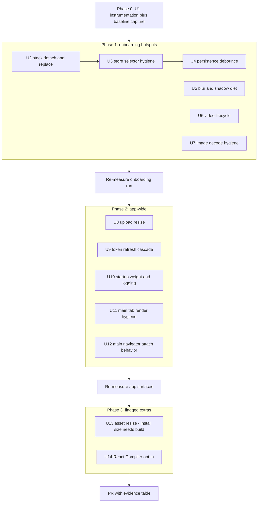
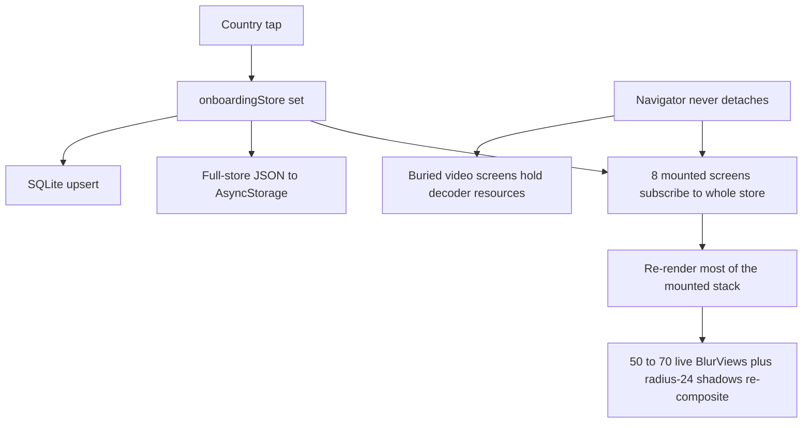

# Atlasi App-Wide Performance Pass - Plan

## Goal Capsule

- **Objective:** Make Atlasi measurably faster and cooler-running app-wide, with onboarding as the flagship improvement, without removing or visibly degrading any animation.
- **Authority hierarchy:** This plan > audit findings cited in it > implementer judgment on details the plan leaves open. Emerson's on-device thermal check is the final acceptance gate; the plan's instrumentation metrics justify the PR.
- **Execution profile:** Work on the existing `speed-perf` branch; open a PR against `main`; never merge. JS/asset-only changes by default (EAS-Update shippable); the only store-build-gated benefit is U13's install-size reduction, which lands as a separately-flagged commit.
- **Stop conditions:** Stop and surface instead of guessing if (a) a fix requires removing an animation or visibly changing the glass aesthetic beyond the blur substitutions specified in U5, (b) `react-native-screen-transitions` cannot support the detach behavior U2 needs and the fallback also fails, or (c) any change requires a new paid tool or service.
- **Tail ownership:** Implementer runs the Verification Contract, captures before/after metrics, opens the PR with the evidence table, and stops. Emerson does on-device testing and merge.

---

## Product Contract

### Summary

An evidence-ranked performance pass over the Atlasi mobile app: first a dev-gated frame-drop measurement harness and baseline, then fixes ordered by audited severity — onboarding stack mounting and store-subscription hygiene, blur/shadow diet in country cards, video and image decode lifecycle, persistence churn, token-refresh cascade, startup weight, and main-tab render hygiene — closing with optional build-flagged asset resizing and React Compiler enablement.

### Problem Frame

By the end of Atlasi's ~14-screen onboarding flow the phone is visibly hot and the UI lags. A prior fix (April 2026: `enableFreeze(true)` + `freezeOnBlur: true`) targeted the right symptom but never engaged: the onboarding navigator is a custom `react-native-screen-transitions` blank-stack whose screens never reach the INACTIVE state that triggers react-freeze, so every screen stays mounted and live. Audit of the current code found the heat is the compound of several sustained costs, each individually plausible-looking:

- Eight mounted onboarding screens subscribe to the entire Zustand onboarding store, so every country tap re-renders most of the stack — O(taps × mounted screens) reconciliation.
- Each country card renders 4 `BlurView`s plus a radius-24 shadow; grids keep ~50–70 live `UIVisualEffectView`s sampling every frame, and the user visits 6 grids.
- Every tap also serializes the full store to AsyncStorage and writes SQLite.
- Full-screen looping video decodes for the entire dwell time of video screens; the slider creates 3 simultaneous players.
- 1024×1024 stamp images are decoded uncapped through RN `Image` (no downsampling) on the progress summary.

The same patterns recur app-wide: blur-heavy cards in Dreams/Passport-Explore, full-resolution photo decodes in entry grids, full-res uploads, an hourly token-refresh cascade that re-renders the app root, 253 unstripped console statements, a 2.2 MB geo library on the boot path, and main navigators built on the same never-freezing blank-stack. No profiling data existed before this plan; the audits above are static-analysis evidence, and U1 adds the runtime measurement to rank and verify fixes.

### Requirements

**Measurement and evidence**

- R1. A dev-gated frame-drop instrumentation harness measures UI-thread and JS-thread frame health and produces repeatable per-run summaries, so every fix in this plan has before/after numbers from the same scripted runs.
- R2. A baseline is captured before any fix lands, and the PR includes a before/after evidence table per phase.

**Onboarding**

- R3. Onboarding screens below the top of the stack stop doing work: they are detached, frozen, or replaced so that store updates and animations on buried screens cost nothing.
- R4. No onboarding screen subscribes to the whole Zustand store; each subscribes only to the fields it renders.
- R5. Country-tap persistence is debounced/batched so a selection session does not perform one full-store AsyncStorage write plus one SQLite write per tap.
- R6. Country selection grids render without per-card live blur stacks; the glass look is preserved via translucent fills or pre-baked treatments.
- R7. Only the visible video player is active at a time; looping videos still loop while their screen is focused.
- R8. Stamp and country images decode at (or near) display size — no uncapped 1024² decodes through RN `Image`.

**App-wide**

- R9. Hourly token refresh no longer causes an app-wide re-render, premium-gate flicker, or redundant network calls.
- R10. Boot path stops parsing `@rapideditor/country-coder` before first frame; production bundles strip console output; hot-path logging migrates to the existing `__DEV__`-gated logger.
- R11. Main-tab list hygiene: taps in Dreams no longer re-render all visible cards; inline-closure props stop defeating `React.memo` on card components; `useReducedMotion` stops registering per-card native listeners.
- R12. Media uploads are resized client-side before upload; remote images render through `expo-image` with explicit sizing in grid/thumbnail contexts.

**Identity and delivery constraints**

- R13. No animation is removed and no animation's perceived character changes; allowed adjustments are lifecycle (cancel/pause when not visible), thread placement, node count under equivalent visuals, and easing/duration only where imperceptible.
- R14. All changes ship OTA via EAS Update by default; changes that require a new native build are isolated in clearly-flagged commits and listed in the PR description.
- R15. Delivery is a PR from `speed-perf` to `main`; the agent never merges, force-pushes, or rewrites history.

### Scope Boundaries

- Backend/API latency is out of scope except where a mobile fetch pattern causes device-side load (none found blocking; token-refresh network calls are covered by R9).
- The iOS Share Extension (Swift) is out of scope — no perf findings implicate it.
- No navigation-library migration: `react-native-screen-transitions` stays; the plan fixes mounting behavior within it (see KTD1 and its fallback).
- The animated splash video and the app's video-led onboarding identity stay; only lifecycle and encode size change.

#### Deferred to Follow-Up Work

- FlatList → FlashList conversions for Dreams/Passport-Explore (JS-only, OTA-safe, already installed) — a good follow-up once this pass establishes baselines, but not needed to fix the audited hotspots.
- Removing `mobile/dist/` (107 MB of stale export output) and `.DS_Store` files from the repo — repo hygiene, not runtime perf.
- Trimming font families/weights loaded at boot (visual-identity decision Emerson should make deliberately).
- Wiring React Query `focusManager` to AppState (foreground refetch is currently not wired at all; adding it is a behavior change, not a perf fix).
- Supabase Storage transform endpoints for server-side resized image variants (backend work; client-side resize in U8 addresses the acute cost).

---

## Planning Contract

### Key Technical Decisions

- KTD1. **Fix screen mounting inside `react-native-screen-transitions`, not by migrating off it.** The library's blank-stack keeps `activityState = 1` for all screens because no screen sets `detachPreviousScreen`, so react-freeze never engages (verified in library source: `active-screens-limit.ts`, `adjusted-screen.tsx`). First approach: set `detachPreviousScreen` on screens that don't need to stay live and convert strictly-linear onboarding steps to `replace` navigation. Fallback if the library's detach path proves broken in practice: convert the onboarding navigator to `@react-navigation/native-stack` with `freezeOnBlur` while re-implementing only the onboarding transitions with the library's animation primitives. Migration of the whole app's navigation is explicitly out.
- KTD2. **Measurement is in-code and dev-gated, with no new runtime dependency.** Reanimated `useFrameCallback` for UI-thread frame gaps + a `requestAnimationFrame` loop for JS-thread gaps, logging per-run summaries (frames, drops >17 ms, hard drops >34 ms, longest stall). `@shopify/react-native-performance` is archived/deprecated — do not add it. Xcode Instruments (free) validates thermal/CPU on a local release build but is not part of the shipped code. PostHog (already installed) may carry summary metrics later; not required for this pass.
- KTD3. **Blur diet by substitution, not removal.** In repeated list cells (country cards, entry grid cards), replace decorative `BlurView`s with translucent solid fills that match the sampled appearance; keep at most one blur per card only if the glass identity demands it, and keep blur for one-off chrome (headers, sheets, celebration overlay). Never animate blur `intensity`; cross-fade opacity over a static blur instead. Blur-over-static-content may also be pre-baked into assets.
- KTD4. **Standardize hot-path image rendering on `expo-image`.** RN `Image` decodes full bitmaps with no downsampling; `expo-image` (`allowDownscaling` default true) decodes to container size. Convert the audited hot paths (stamps on progress summary, entry grids/galleries, country hero, trip cover). `recyclingKey` in recycled cells; `cachePolicy="memory-disk"` for repeatedly-rendered thumbnails.
- KTD5. **Stay on Reanimated ~4.1.1.** 4.1 has an open perf regression with many mounted animated views (#8250), but 4.4 regressed iOS layout animations (#9591). Reduce animated-node count and add lifecycle cleanup instead of upgrading. Do not write new `InteractionManager` code (deprecated; RN 0.82 warns) — use `requestIdleCallback`/`requestAnimationFrame`/navigation `transitionEnd`.
- KTD6. **Persistence churn fixed at the store layer.** Debounce the Zustand `persist` writes (custom debounced storage adapter or `partialize` + debounce) and batch SQLite country writes; per-tap UI state updates stay synchronous so the UI feel is unchanged.
- KTD7. **React Compiler is a final, individually-verified unit.** Opt-in via `experiments: { reactCompiler: true }` (Babel-only → OTA-safe; RC quality on SDK 54). Run `npx react-compiler-healthcheck` first; land it as its own commit after manual fixes are measured so its effect is attributable and revertible.
- KTD8. **Token refresh becomes a minimal-path event.** `TOKEN_REFRESHED` must not be handled like a fresh sign-in: keep the stored-token update, drop the RevenueCat re-identify/`loading` status flip, PostHog re-identify, onboarding-completion re-read, and usage-limit refetch; avoid replacing the `session` object identity where equivalent (or stop subscribing to `session` at the app root — R9/U3).

### High-Level Technical Design

The whole pass follows one loop: instrument → baseline → fix in severity order → re-measure → record. Phases group the units so each phase produces a comparable metrics snapshot.

Why the onboarding flow melts phones — the compounding structure U2–U5 dismantles:

### Assumptions

- `react-native-screen-transitions` v3.2.0's `detachPreviousScreen` option behaves as its source suggests (raises the freeze/detach state for buried screens). This is verified as the first task of U2; KTD1 names the fallback if it does not.
- Translucent fills can match the current blur-over-photo appearance closely enough at the intensities used (30–45). U5 keeps a side-by-side screenshot comparison in the PR for Emerson's judgment.
- Simulator/dev-build frame metrics are valid *relative* evidence (same build type before/after). Absolute thermal validation is Emerson's on-device check; Instruments on a local release build is available if numbers look ambiguous.

### Risks & Dependencies

- **`react-native-screen-transitions` is third-party and version-pinned (v3.2.0).** The U2/U12 detach approach rests on library behavior derived from reading its source, not its documented API. Mitigation: U2 verifies the behavior first with a render-count probe before converting the flow; KTD1 names the native-stack fallback; U12 is allowed to defer to follow-up rather than block the PR. Residual risk: a future library upgrade could change detach semantics — the U2 render-count test doubles as a regression tripwire.
- **React Compiler × Reanimated interplay is lightly traveled.** Compiler is RC-quality on SDK 54 and auto-memoization can change effect/worklet timing assumptions. Mitigation: U14 runs last, lands as its own commit, is gated on healthcheck + full suite + metric runs + manual animation pass, and is droppable without affecting the plan's exit criterion.
- **Blur substitution is a visual judgment call.** Translucent fills approximate, not reproduce, live blur. Mitigation: U5 ships side-by-side screenshots; Emerson is the acceptance gate; the name-pane blur can stay if fidelity demands it. Rollback is per-component.
- **Upload resize touches data users care about.** An orientation or quality regression would degrade every photo a user uploads. Mitigation: U8 is test-first (orientation, pass-through, failure paths) and keeps the existing 10 MB backstop; the resize bound is chosen conservatively (~2048 px long edge) relative to current display sizes.
- **Persistence debouncing risks losing selections if flush points are wrong.** A crash or force-quit inside the debounce window could drop the last taps. Mitigation: U4's flush-on-background AppState hook plus round-trip rehydration tests; the window is short (~500 ms).
- **OTA rollout mechanics:** `runtimeVersion.policy: 'appVersion'` means updates only reach binaries with a matching `version`. All default-path changes here are OTA-safe (JS/TS, styles, bundled assets, Babel flags per Expo's documented boundary). The U10 Babel transform applies to any bundle published via `eas update`, so the console-strip effect reaches OTA recipients immediately; only U13's install-size benefit waits for the next store build. The PR must not bump `version` in `app.config.js`, or the OTA path to current TestFlight users breaks.
- **Dependency additions are minimal and flagged:** `babel-plugin-transform-remove-console` (U10) and optionally `eslint-plugin-react-compiler` (U14), both free/MIT, build-time only, no licensing or cost implications. No runtime dependencies are added.
- **Measurement validity:** dev-build simulator metrics understate release performance and cannot measure heat. Mitigation is honesty, not tooling: metrics are used relatively (same build type before/after), the PR labels them as such, and thermal ground truth is explicitly Emerson's on-device step.

### Sources & Research

- Onboarding audit and app-wide audit: static-analysis findings with file:line evidence, produced for this plan (July 2026); key claims re-verifiable at the cited paths.
- Prior art in-repo: April 2026 freeze fix (`mobile/App.tsx`, `mobile/src/navigation/OnboardingNavigator.tsx`), re-render conventions from past plans (exported Zustand selector functions, memoized derived Sets, Record-over-Map).
- Reanimated performance guide and `withRepeat`/`cancelAnimation` docs — docs.swmansion.com; regression issues #8250, #9591 (github.com/software-mansion/react-native-reanimated).
- React Navigation native-stack `freezeOnBlur` docs; bottom-tabs `lazy` default true — reactnavigation.org.
- Expo SDK 54: React Compiler guide (docs.expo.dev/guides/react-compiler), expo-image v54 props, EAS Update OTA boundary (docs.expo.dev/eas-update) — JS/TS, styles, bundled assets, Babel flags are OTA-safe; native deps/plugins/permissions need a build. App uses `runtimeVersion.policy: 'appVersion'`.
- TanStack Query v5 render optimizations (tracked queries default; rest-destructuring disables them); RN focus refetch requires manual `focusManager` wiring — tanstack.com.
- Zustand v5 `useShallow` and selector guidance — zustand.docs.pmnd.rs.
- FlashList v2 is JS-only, new-arch-only, already installed at 2.0.2 — shopify.engineering/flashlist-v2.
- `@shopify/react-native-performance` archived Nov 2025; Flipper dead; `InteractionManager` deprecated.

---

## Implementation Units

Unit index:

| U-ID | Title | Key files | Depends on |
|---|---|---|---|
| U1 | Frame instrumentation + baseline | `mobile/src/utils/perf/` (new), `mobile/App.tsx` | — |
| U2 | Onboarding stack detach/replace | `mobile/src/navigation/OnboardingNavigator.tsx`, onboarding screens | U1 |
| U3 | Store subscription hygiene | 10 onboarding screens, `mobile/App.tsx`, `mobile/src/navigation/RootNavigator.tsx`, hooks | U1 |
| U4 | Onboarding persistence debounce | `mobile/src/stores/onboardingStore.ts` | U1 |
| U5 | Card blur/shadow diet | `mobile/src/components/ui/CountryCard.tsx`, `mobile/src/components/entries/EntryGridCard.tsx` | U1 |
| U6 | Video player lifecycle | `mobile/src/screens/onboarding/OnboardingSliderScreen.tsx`, `WelcomeCarouselScreen.tsx`, `ContinentIntroScreen.tsx` | U1 |
| U7 | Image decode hygiene | `mobile/src/screens/onboarding/ProgressSummaryScreen.tsx`, entry components, `CountryHero.tsx` | U1 |
| U8 | Client-side upload resize | `mobile/src/services/mediaUpload.ts`, `mobile/src/hooks/useClusterPhotoUpload.ts` | U1 |
| U9 | Token-refresh cascade | `mobile/src/hooks/useAuthSession.ts` | U3 |
| U10 | Startup weight + logging | `mobile/src/services/photoImport/index.ts`, `mobile/babel.config.js`, hot-path files | U1 |
| U11 | Main-tab render hygiene | `mobile/src/screens/DreamsScreen.tsx`, `mobile/src/screens/trips/TripsListScreen.tsx`, trip/country detail screens, `mobile/src/hooks/useReducedMotion.ts`, `mobile/src/hooks/usePassportData.ts`, `mobile/src/hooks/useNavigationPersistence.ts`, `mobile/src/hooks/useAppStateTracking.ts` | U1 |
| U12 | Main navigator attach behavior | `mobile/src/navigation/RootNavigator.tsx`, `mobile/src/navigation/PassportNavigator.tsx` | U2 |
| U13 | Bundled asset resize (build-flagged for install size) | `mobile/assets/stamps/processed/`, `mobile/assets/country-images/processed/`, video re-encodes | U7 |
| U14 | React Compiler opt-in | `mobile/app.config.js` | U2–U12 |

### U1. Frame instrumentation and baseline capture

- **Goal:** Repeatable dropped-frame metrics for scripted runs, so every later unit has before/after numbers.
- **Requirements:** R1, R2
- **Dependencies:** none
- **Files:** `mobile/src/utils/perf/frameMetrics.ts` (new), `mobile/src/utils/perf/PerfOverlay.tsx` (new, optional on-screen readout), `mobile/src/utils/perf/__tests__/frameMetrics.test.ts` (new), wiring in `mobile/App.tsx` behind a dev flag
- **Approach:** Reanimated `useFrameCallback` accumulates UI-thread inter-frame gaps; a `requestAnimationFrame` loop does the same for the JS thread. A start/stop API scopes a "run" (e.g., onboarding start → paywall) and logs a summary: total frames, drops >17 ms, hard drops >34 ms, longest stall, run duration. Gated so release behavior is untouched (dev flag; tree-shakeable export). Capture the baseline on the current commit for two scripted runs — (a) full onboarding flow with ~30 country taps, (b) main-tab tour: passport scroll, Dreams taps, trip open — and record the numbers in the PR description before any fix commit.
- **Execution note:** Baseline before any fix — this is the measurement-first posture for the whole plan.
- **Patterns to follow:** hook extraction style (`usePassportAnimations.ts`), `utils/logger.ts` dev gating.
- **Test scenarios:**
  - Gap accumulator: given synthetic frame timestamps 16/16/40/16 ms, reports 1 drop and 1 hard drop with longest stall 40 ms.
  - Run scoping: metrics reset between start/stop cycles; stopping without starting is a no-op.
  - Dev gating: with the flag off, no frame callback or rAF loop is registered.
- **Verification:** Jest tests pass; baseline numbers for both scripted runs recorded (they become the PR evidence table's "before" column).

### U2. Onboarding stack stops accumulating live screens

- **Goal:** Buried onboarding screens do no work: freeze/detach engages, and strictly-linear steps replace rather than stack.
- **Requirements:** R3, R13
- **Dependencies:** U1
- **Files:** `mobile/src/navigation/OnboardingNavigator.tsx`, `mobile/src/screens/onboarding/ContinentIntroScreen.tsx`, `mobile/src/screens/onboarding/ContinentCountryGridScreen.tsx`, other onboarding screens' navigation calls as needed, `mobile/src/__tests__/navigation/onboardingStack.test.tsx` (new)
- **Approach:** First verify KTD1's assumption in the installed library version: set `detachPreviousScreen` on a screen and confirm buried screens reach the frozen/inactive state (react-freeze engaged). Then apply: `detachPreviousScreen` where back-navigation must survive, `replace` for forward-only steps, and fix the `push('ContinentIntro')` duplicate accumulation on "No" answers. Transitions must look identical — the library's animation config is untouched. If the library cannot detach (KTD1 fallback), swap the onboarding navigator to native-stack with `freezeOnBlur` and port the onboarding interpolators.
- **Test scenarios:**
  - A component on screen N-2 with a store subscription does not re-render when the store changes while screen N is on top (render-count probe with @testing-library/react-native).
  - Answering "No" on five continent intros does not grow the stack by five (assert route count).
  - Back navigation still works where the flow allows it (grid → intro).
- **Verification:** Render-count test passes; scripted onboarding run shows reduced JS-thread drops vs baseline; transitions visually unchanged in simulator recording.

### U3. Store subscription hygiene

- **Goal:** Components subscribe only to fields they render; store churn stops fanning out.
- **Requirements:** R4, R9 (partial), R13
- **Dependencies:** U1
- **Files:** `mobile/src/screens/onboarding/ContinentCountryGridScreen.tsx`, `MotivationScreen.tsx`, `HomeCountryScreen.tsx`, `DreamDestinationScreen.tsx`, `ContinentIntroScreen.tsx`, `AntarcticaPromptScreen.tsx`, `NameEntryScreen.tsx`, `ProgressSummaryScreen.tsx`, `AccountCreationScreen.tsx`, `PaywallScreen.tsx`; app-wide: `mobile/App.tsx`, `mobile/src/navigation/RootNavigator.tsx`, `mobile/src/hooks/usePremiumGate.ts`, `useSubscription.ts`, `useAuth.ts`, `useUserCountries.ts`, `useClipboardListener.ts`, `mobile/src/screens/profile/ProfileSettingsScreen.tsx`; tests in `mobile/src/__tests__/stores/`
- **Approach:** Replace whole-store destructures (`useOnboardingStore()`, `useAuthStore()`) with per-field selectors; the store already exports selector functions (`onboardingStore.ts`) — extend that pattern. Use `useShallow` only where a component genuinely needs an object/array slice. Follow the house conventions: exported selector functions, memoized derived Sets, Record-over-Map.
- **Test scenarios:**
  - A screen using the new selectors does not re-render when an unrelated store field changes (render-count probe per converted screen; at minimum the grid, motivation, and account-creation screens).
  - Selector returning an array slice is wrapped in `useShallow` and is referentially stable across unrelated updates.
  - Behavior unchanged: toggling a country still updates the grid badge and progress counts.
- **Verification:** Jest render-count tests pass; combined with U2, tap-driven re-renders in the onboarding run drop to the visible screen only.

### U4. Onboarding persistence stops writing per tap

- **Goal:** A country-selection session batches its persistence instead of full-store JSON + SQLite writes on every tap.
- **Requirements:** R5
- **Dependencies:** U1
- **Files:** `mobile/src/stores/onboardingStore.ts`, `mobile/src/__tests__/stores/onboardingStore.test.ts`
- **Approach:** Wrap the persist storage in a debounced adapter (~500 ms trailing write, flush on app-background via AppState and on flow completion) and batch the SQLite sync the same way. UI state updates remain synchronous. Guard against data loss: flush points must cover backgrounding mid-selection.
- **Test scenarios:**
  - 10 rapid toggles produce 1 AsyncStorage write after the debounce window (fake timers).
  - Backgrounding flushes a pending write immediately.
  - Store rehydration after flush reproduces the selected-country set exactly (round-trip test).
  - SQLite sync receives the batched final state, not 10 intermediate states.
- **Verification:** Jest tests pass; onboarding-run JS-thread stalls during rapid tapping reduced vs baseline.

### U5. Card blur/shadow diet

- **Goal:** Repeated list cells stop compositing live blur stacks and expensive shadows, with the glass look preserved.
- **Requirements:** R6, R13
- **Dependencies:** U1
- **Files:** `mobile/src/components/ui/CountryCard.tsx`, `mobile/src/components/entries/EntryGridCard.tsx`, snapshot/screenshot fixtures under `mobile/src/__tests__/components/`
- **Approach:** Per KTD3: replace the 4 per-card `BlurView`s with translucent fills matched to the current sampled appearance (the flag badge and action buttons are prime candidates; keep at most one blur — the name pane — if needed for identity). Reduce `shadowRadius: 24` to a cheaper static treatment on the container. One-off chrome blurs (headers, sheets, `CelebrationOverlay`) are untouched. Produce side-by-side before/after screenshots for the PR so Emerson can judge fidelity.
- **Test scenarios:**
  - CountryCard renders zero (or one, if the name pane keeps it) BlurView instances (component introspection test).
  - Visited/wishlist button interactions behave identically (existing interaction tests still pass).
  - Test expectation for visual fidelity: screenshot pair in the PR — automated pixel-diff is not required; Emerson judges.
- **Verification:** Grid scroll segment of the onboarding run shows reduced UI-thread drops; screenshots attached to PR.

### U6. Video player lifecycle

- **Goal:** One active decoder at a time; loops preserved while focused.
- **Requirements:** R7, R13
- **Dependencies:** U1
- **Files:** `mobile/src/screens/onboarding/OnboardingSliderScreen.tsx`, `mobile/src/screens/onboarding/WelcomeCarouselScreen.tsx`, `mobile/src/screens/onboarding/ContinentIntroScreen.tsx`
- **Approach:** Slider: create players lazily (active slide ± none; release on slide-away) instead of 3 up-front. Keep the existing pause-on-blur handlers; with U2's detach the buried players' JS trees unmount, releasing resources. Do not change loop behavior or autoplay on the focused screen. Re-encoding oversized sources (1080×1430 Atlantis welcome loop, 544×720 continent loops at 1.7–3.6 MB) to display-sized, lower-bitrate variants belongs to U13's asset pass; this unit is lifecycle-only.
- **Test scenarios:**
  - On slide 1, exactly one player instance exists; swiping to slide 2 releases slide 1's player (mock `expo-video`, assert create/release calls).
  - Blur/focus still pauses/resumes the active player (existing behavior preserved).
- **Verification:** Slider dwell segment shows reduced sustained CPU (relative frame metrics + no regression in transitions).

### U7. Image decode hygiene

- **Goal:** Hot paths decode images at display size instead of full resolution.
- **Requirements:** R8, R12 (render half)
- **Dependencies:** U1
- **Files:** `mobile/src/screens/onboarding/ProgressSummaryScreen.tsx`, `mobile/src/screens/onboarding/AntarcticaPromptScreen.tsx`, `mobile/src/components/entries/EntryGridCard.tsx`, `mobile/src/components/entries/EntryCard.tsx`, `mobile/src/components/media/EntryMediaGallery.tsx`, `mobile/src/components/country/CountryHero.tsx`, trip cover in `mobile/src/screens/trips/TripDetailScreen.tsx`, `mobile/src/components/onboarding/CelebrationOverlay.tsx`
- **Approach:** Convert RN `Image` to `expo-image` in the listed hot paths (KTD4): `contentFit`, explicit dimensions, `recyclingKey` in recycled cells, `cachePolicy="memory-disk"` for repeated thumbnails (stamps, entry grids). Rendered output must be pixel-equivalent — same sizing/cropping behavior. The uncapped stamp render on ProgressSummary stays uncapped visually but decodes at display size via downscaling.
- **Test scenarios:**
  - Each converted component renders `expo-image` with an explicit size or measurable container (component tests).
  - Entry grid cell prefers `thumbnail_url` and falls back to `url` exactly as before (existing logic preserved).
  - ProgressSummary with 60 visited countries renders all 60 stamps (no visual cap introduced).
- **Verification:** ProgressSummary mount segment shows reduced JS stalls/memory vs baseline; entry-grid scroll after a photo import no longer spikes.

### U8. Client-side upload resize

- **Goal:** Uploads stop shipping full-resolution originals when a bounded size suffices.
- **Requirements:** R12 (upload half)
- **Dependencies:** U1
- **Files:** `mobile/src/services/mediaUpload.ts`, `mobile/src/hooks/useClusterPhotoUpload.ts`, tests alongside in `mobile/src/__tests__/`
- **Approach:** Resize/compress via already-installed `expo-image-manipulator` before upload (bounded long edge — pick a limit consistent with current display needs, e.g. ~2048 px, decided at implementation with Emerson's storage expectations in mind; preserve EXIF orientation). Apply to both the manual media picker path and the cluster photo-import path; keep the existing 10 MB guard as a backstop. Evaluate at photo-import scale: hundreds of photos, 50–100 clusters — resize must be sequential/bounded-concurrency so it doesn't itself become a CPU spike.
- **Execution note:** Write the resize-path tests first — this touches upload correctness, and CLAUDE.md's bug-workflow discipline applies to behavior-adjacent changes.
- **Test scenarios:**
  - A mocked 4000×3000 source is manipulated to the bounded size before the upload call; a source already under the bound is passed through untouched.
  - Orientation metadata survives (mock manipulator result assertions).
  - Cluster upload processes N photos with bounded concurrency (no unbounded Promise.all fan-out).
  - Upload failure paths unchanged (retry/error behavior identical).
- **Verification:** Jest tests pass; upload of a large photo set no longer saturates CPU in the frame metrics during the import flow.

### U9. Token-refresh cascade

- **Goal:** Hourly `TOKEN_REFRESHED` updates tokens and nothing else.
- **Requirements:** R9
- **Dependencies:** U3
- **Files:** `mobile/src/hooks/useAuthSession.ts`, `mobile/src/__tests__/hooks/useAuthSession.test.ts`
- **Approach:** Per KTD8: branch `TOKEN_REFRESHED` from sign-in handling — update stored tokens; skip RevenueCat re-identify (and its `'loading'` status flip), PostHog identify, ad-SDK user id, onboarding-completion read, and usage-limits fetch. Keep full handling for `SIGNED_IN`/`SIGNED_OUT`. With U3, the app root no longer subscribes to `session`, so identity churn stops re-rendering the tree.
- **Test scenarios:**
  - `TOKEN_REFRESHED` event: tokens stored; RevenueCat/PostHog/usage-limit calls NOT made (mock assertions); subscription status never flips to `loading`.
  - `SIGNED_IN` event: full cascade still runs.
  - Premium gate hook does not re-render on a token refresh (render-count probe).
- **Verification:** Jest tests pass; simulated token refresh produces zero app-level re-renders in the probe.

### U10. Startup weight and production logging

- **Goal:** Boot path sheds the 2.2 MB geo library and release bundles stop paying for console logging.
- **Requirements:** R10
- **Dependencies:** U1
- **Files:** `mobile/src/services/photoImport/index.ts`, `mobile/src/hooks/useAppStateTracking.ts`, `mobile/babel.config.js`, hot-path log sites (`mobile/src/hooks/useEntries.ts`, `mobile/src/hooks/useClusterPhotoUpload.ts`, `mobile/src/screens/photos/usePlaceSuggestions.ts`, `mobile/src/services/shareQueue.ts`)
- **Approach:** Break the barrel: make `useAppStateTracking` import the specific functions it needs (dynamic `import()` where the existing lazy scheme in `photoBackgroundSync.ts` intends it) so `@rapideditor/country-coder` parses only when photo matching actually runs. Add `babel-plugin-transform-remove-console` (dev dependency — flagging per the no-new-deps constraint: free, MIT, build-time only) for production env, preserving `console.error/warn`. Migrate the audited hot-path `console.log`s (object-payload logs in mutation/upload loops) to `utils/logger.ts`.
- **Test scenarios:**
  - Importing `useAppStateTracking` does not evaluate `country-coder` (module-graph test: jest.mock spy on the module, assert not loaded at import time).
  - Photo-matching path still resolves country data correctly after the import restructure (existing photo-import tests still pass).
  - Test expectation for the Babel change: none — config-only; verified by inspecting a production bundle for absence of `console.log` during PR verification.
- **Verification:** Boot segment of the app-tour run improves; `npx expo export` production bundle contains no `console.log` call sites in app code.

### U11. Main-tab render hygiene

- **Goal:** Taps and navigation in the main tabs stop re-rendering blur-heavy card sets and leaking per-card native listeners.
- **Requirements:** R11
- **Dependencies:** U1
- **Files:** `mobile/src/screens/DreamsScreen.tsx`, `mobile/src/screens/trips/TripsListScreen.tsx`, `mobile/src/screens/trips/TripDetailScreen.tsx`, `mobile/src/screens/country/CountryDetailScreen.tsx`, `mobile/src/hooks/useReducedMotion.ts`, `mobile/src/hooks/useNavigationPersistence.ts`, `mobile/src/hooks/useAppStateTracking.ts`, `mobile/src/hooks/usePassportData.ts`
- **Approach:** Dreams: move `animatingCards` out of `renderItem`'s dependency chain (per-card animation state via ref/store keyed by id) and pass stable callbacks so `CountryCard`'s memo holds. Trips/CountryDetail: replace inline `onPress` closures with stable per-id callbacks. `useReducedMotion`: single module-level cached value + one `AccessibilityInfo` listener shared via subscription, replacing per-instance async round-trips. Nav persistence: debounce state writes (~1 s). Foreground burst: stagger the 6+ jobs in `useAppStateTracking` over idle callbacks so resume doesn't spike. Fix the O(n²) stats recompute in `usePassportData` (build a Set first) and make `passportShareContext` lazy.
- **Test scenarios:**
  - Dreams: tapping one card re-renders only that card (render-count probe on visible siblings).
  - TripsList: `TripCard` memo holds across parent re-renders (probe).
  - `useReducedMotion`: two components mounting register one native listener total; value updates propagate to both (mock AccessibilityInfo).
  - Nav persistence: rapid navigation produces one debounced write (fake timers).
  - `usePassportData` stats identical pre/post refactor for a fixture of 227 countries (golden-value test).
- **Verification:** Main-tab tour run shows reduced drops on Dreams taps and tab switches vs baseline.

### U12. Main navigator attach behavior

- **Goal:** Heavy main screens (passport grid with ~200 image cards) stop staying attached and unfrozen beneath pushed screens.
- **Requirements:** R3 (app-wide extension), R13
- **Dependencies:** U2 (reuses its verified detach approach)
- **Files:** `mobile/src/navigation/RootNavigator.tsx`, `mobile/src/navigation/PassportNavigator.tsx`
- **Approach:** Apply the U2-proven `detachPreviousScreen` treatment to the blank-stack navigators used by Root/Passport so PassportHome detaches under CountryDetail/PhotoImport/ShareCapture. Investigate the duplicate Trips stack (nested in PassportNavigator and as its own tab) and dedupe if confirmed mounted twice. This unit is deliberately after U2: same mechanism, second application, lower novelty. If U2 fell back to native-stack, evaluate the same fallback here but do not block the PR on it — flag as follow-up instead if risk is high.
- **Test scenarios:**
  - With CountryDetail pushed, a store update does not re-render PassportHome content (render-count probe).
  - Back navigation from pushed screens restores the passport grid state (scroll position tolerance acceptable; no crash/blank).
- **Verification:** App-tour run: pushing/popping CountryDetail over the grid shows reduced UI-thread work; navigation feels unchanged.

### U13. Bundled asset resize

- **Goal:** Stop shipping and decoding 2–4× oversized images and videos.
- **Requirements:** R8 (source-size half), R14
- **Dependencies:** U7
- **Files:** `mobile/assets/stamps/processed/` (227 files), `mobile/assets/country-images/processed/` (227 files), `mobile/assets/country-images/continents/*.mp4`, `mobile/assets/country-images/wonders-world/Atlantis.mp4`, `mobile/assets/onboarding-videos/`, removal of audited dead assets (~41 MB unused videos, 4 legacy stamp PNGs), `mobile/src/assets/stampImages.ts` if paths change
- **Approach:** Regenerate stamps at 512² and country cards at ≤800 px long edge (scripted with the already-present `sharp` devDependency; keep webp). Re-encode the welcome/continent videos to display-size dimensions and lower bitrate, preserving look. Delete only assets the audit verified unreferenced (re-verify with a grep before deleting each). Runtime decode wins ship OTA (bundled assets are OTA-updatable); the install-size win lands at the next store build — both facts noted in the PR. Keep the regeneration script in `mobile/scripts/` for repeatability.
- **Test scenarios:**
  - All 227 stamp and 227 country images still resolve (existing `stampImages.ts`/country-image mapping tests, or a new exhaustive require-resolution test).
  - Dimension assertion: a spot-check script confirms max dimensions in each processed directory.
  - Test expectation for video re-encodes: none — visual judgment via PR screen recordings.
- **Verification:** Asset directories shrink (report before/after MB in PR); grid scroll decode cost drops in frame metrics; no missing-image regressions in test suite.

### U14. React Compiler opt-in

- **Goal:** Auto-memoization across the app, attributable and revertible.
- **Requirements:** R14 (OTA-safe), R11 (reinforces)
- **Dependencies:** U2–U12 (last, so its effect is isolated)
- **Files:** `mobile/app.config.js` (`experiments: { reactCompiler: true }`), possibly `mobile/package.json` (eslint-plugin-react-compiler as devDependency — flagged: free, MIT)
- **Approach:** Per KTD7: run `npx react-compiler-healthcheck`; fix or annotate incompatible components if few; enable the flag; run the full test suite and both scripted metric runs; manually exercise Reanimated-driven screens (transitions, celebration overlay) for behavioral drift. Land as its own commit with its own before/after numbers. If healthcheck or metrics show problems, drop the unit and record why in the PR — it is a stretch unit, not a dependency of the plan's success.
- **Test scenarios:**
  - Full existing Jest suite passes with the compiler enabled.
  - Both scripted metric runs show no regression (improvement expected but not required).
  - Test expectation for visual behavior: manual pass over animated screens in simulator; noted in PR.
- **Verification:** Suite green + metrics table row for the compiler commit; revert path is a one-line config change.

---

## Verification Contract

| Gate | Command / method | Applies to |
|---|---|---|
| Lint | `cd mobile && npm run lint` (0 errors) | every commit |
| Format | `cd mobile && npm run format:check` | every commit |
| Unit tests | `cd mobile && npm test` (all pass; includes new render-count and behavior tests) | every commit |
| Frame metrics | U1 harness: scripted onboarding run + main-tab tour, same simulator + dev-build type as baseline | after each phase; final table in PR |
| Exit criterion | Onboarding run: ≥50% reduction in hard drops (>34 ms) and a reduced total-drop count vs baseline; main-tab tour: no surface regresses | PR readiness |
| Visual identity | Side-by-side screenshots (U5) and screen recordings of transitions/celebrations (U2, U6, U14) attached to PR | PR readiness |
| Production bundle | `npx expo export` — verify no `console.log` in app code, bundle builds clean | after U10 |
| Thermal ground truth | Emerson's on-device run (optionally Instruments Time Profiler/Energy Log on a local `npx expo run:ios --configuration Release` build if numbers are ambiguous) | post-PR, by Emerson |

Backend is untouched; backend gates do not apply.

## Definition of Done

- All units U1–U12 implemented and individually verified, or explicitly recorded in the PR as deferred with a reason; U13–U14 attempted and either landed (each as its own flagged commit) or documented as dropped with evidence.
- The frame-metrics exit criterion is met and the PR description contains the full before/after evidence table plus screenshots/recordings for visual-identity judgment.
- No animation removed; transitions, loops, celebration effects, and the video-led onboarding feel are intact per the recordings.
- `npm run lint`, `npm run format:check`, and `npm test` pass on the final branch state.
- Every commit on `speed-perf` is scoped and conventional (`perf:` prefix); the store-build-gated change (install-size portion of U13) is an isolated commit called out in the PR body, and dev-dependency additions (OTA-compatible, build-time only) are likewise called out.
- No dead experiment code: abandoned approaches from the run are removed from the diff.
- PR is open from `speed-perf` to `main` and NOT merged; on-device thermal validation is explicitly listed in the PR as Emerson's step.
