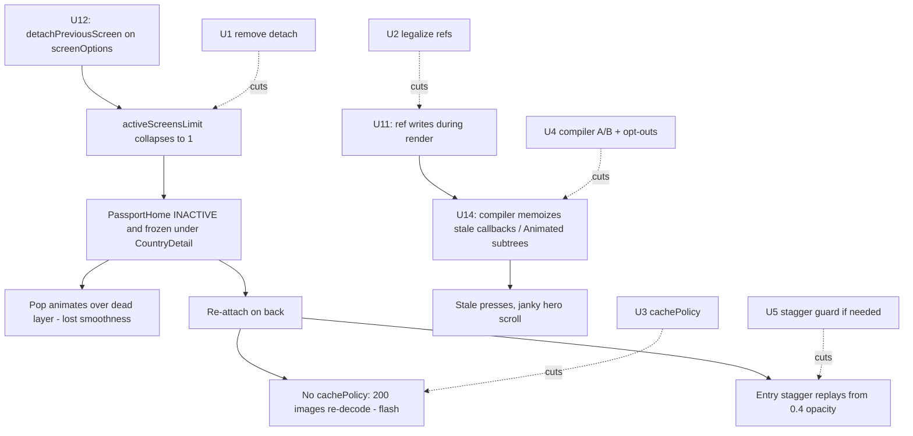

# Perf-Pass Regression Fix - Navigation Flicker and Lost Transitions

## Goal Capsule

- **Objective:** Restore the pre-perf-pass navigation polish — smooth passport ⇄ CountryDetail push/pop with no flicker — while keeping every perf win that doesn't harm animation. Fix-forward, not revert-first (Emerson's explicit choice, 2026-07-12).
- **Authority hierarchy:** This plan > the three diff-analysis findings cited in it > implementer judgment. Emerson's on-device transition check is the final acceptance gate.
- **Execution profile:** Work on `speed-perf`. The working tree carries uncommitted photo-match work that must not be touched or committed: `backend/`, `mobile/src/screens/photos/`, `mobile/src/services/photoImport/`, `mobile/src/hooks/usePhotoTrips.ts`, the photo-related test dirs under `mobile/src/__tests__/`, **and an uncommitted `buildNumber: '3' → '4'` hunk in `mobile/app.config.js`** — a file U4 also edits; see U4's execution note. Each unit lands as its own conventional commit.
- **Stop conditions:** Stop and surface if (a) removing `detachPreviousScreen` does not restore the pop animation on-device, (b) the React Compiler still causes animation drift after the ref-write fixes and targeted opt-outs, or (c) any fix requires changing a transition preset/interpolator.
- **Tail ownership:** Implementer runs the Verification Contract and records evidence; Emerson does the on-device pass and judges.

---

## Product Contract

### Summary

The app-wide performance pass (origin plan above; commits `f4b91936..2ff8aef8`) violated its own hard constraint R13 ("no animation's perceived character changes"): going passport → CountryDetail → back now flickers and the pop animation is gone. Diff analysis of all 14 perf units identified one direct cause (origin U12's screen detach), two compounding hazards (origin U11's render-phase ref writes × origin U14's React Compiler; missing image `cachePolicy` on the passport path), and exonerated the rest. This plan fixes the confirmed regressions surgically and sweeps the remaining surfaces for latent ones.

**U-ID convention:** bare `U`-numbers in the Problem Frame and Risks refer to the **origin plan's** units (U1–U14, disambiguated by commit hash where cited); this plan's own units are U1–U6, defined under Implementation Units.

### Problem Frame

User-confirmed facts (2026-07-12): symptom observed on a **dev build on a physical device**; degradation is **transitions only** (static card visuals from U5's blur substitution are acceptable); remedy posture is **fix forward**; scope is a **full perf-pass audit** with the passport→detail flicker as the flagship.

Root-cause chain (verified against `react-native-screen-transitions` v3.2.1 source):

1. U12 (`3112ad98`) added `freezeOnBlur: true` + `detachPreviousScreen: true` to the navigator-wide `screenOptions` of both blank-stack navigators (`mobile/src/navigation/PassportNavigator.tsx`, `mobile/src/navigation/RootNavigator.tsx`).
2. Because `detachPreviousScreen` sits on the **top** route's descriptor, the library's `calculateActiveScreensLimit` (`active-screens-limit.ts`) breaks on the first route → `activeScreensLimit = 1` (was 2).
3. `adjusted-screen.tsx` then drives the screen directly beneath the top to `activityState = INACTIVE` as the push completes; with global `enableFreeze(true)` (`mobile/App.tsx`) the passport grid is frozen/detached under CountryDetail.
4. On pop, the underlying screen must co-animate (scale 0.95→1, translateX) for `SlideWithScalePreset`/`SharedCountryPreset` to read as smooth — but it's frozen, so the top screen slides away over a dead layer.
5. On re-attach, the ~200-card grid re-mounts native views; `StampCard`/`CountryCard` (and `CountryHero`) specify no `cachePolicy`, so images re-decode asynchronously (empty-then-fill flash), and the entry-stagger animation (rows seeded at opacity 0.4 in `usePassportAnimations.ts`) can replay.
6. Amplifiers: U11 (`fcf95d6a`) introduced render-phase ref mutation (`handleXRef.current = handleX` during render) in four screens — an explicit Rules of React violation — and U14 (`fba6c5fb`) enabled React Compiler, which assumes rule-following code and can memoize stale callbacks or over-cache legacy `Animated.Value`-driven subtrees (CountryDetail hero scroll). Zero `'use no memo'` opt-outs exist.

Why tests stayed green: `mainStackDetach.test.tsx` asserts only that the config flags are set (react-freeze activity is unobservable in Jest); U14's healthcheck verifies compilability, not runtime animation correctness — its own commit body deferred the manual animation pass.

Exonerated for this symptom (all origin-plan units): origin U5 (static-only, user-accepted), origin U7 (didn't touch passport cards; added no `transition` fades), origin U8/U8-fix (upload path only), origin U3 (selectors reduce re-renders; consumers are off the card hot path), origin U13 (at most static softness — checked in the sweep). The `SharedCountryPreset`'s shared-element morph (`sharedBoundTag`) was never wired on either screen — pre-existing, not a regression.

### Requirements

- R1. Passport → CountryDetail push and pop co-animate as before the perf pass: the underlying screen animates during the pop; no blank/stale underlayer; no flash of skeleton, image re-decode, or entry-stagger replay on return.
- R2. Dismissing PaywallModal/Auth over Main co-animates the same way (same U12 mechanism on RootNavigator).
- R3. The render-phase ref-write pattern introduced by U11 is made Rules-of-React-legal in all four screens, with no loss of the memo-stability wins it bought.
- R4. React Compiler remains enabled only if the on-device animation pass is clean after R3; otherwise targeted `'use no memo'` opt-outs on the affected screens — a silent full revert of U14 is not an outcome, a documented drop is acceptable.
- R5. Passport-path images (`StampCard`, `CountryCard`, `CountryHero`) survive legitimate remounts (tab reset, double-tap) without visible re-decode.
- R6. Perf wins from the **origin plan** that don't harm animation are retained untouched: onboarding detach (origin U2), store selectors (origin U3), persistence debounce (origin U4), blur diet (origin U5), video lifecycle (origin U6), image hygiene (origin U7), upload resize (origin U8), token refresh (origin U9), startup (origin U10), origin U11's render hygiene (minus the ref pattern), asset resize (origin U13).
- R7. Every remaining perf-pass surface gets an explicit on-device animation check (the full-audit sweep), and any newly found regression is recorded — fixed here if small, or filed as follow-up with a cause hypothesis.

### Scope Boundaries

- No navigation-library migration and no changes to transition presets/interpolators.
- U5's visual substitution stays as shipped (user judged static visuals acceptable).
- Backend untouched; uncommitted photo-match work in the tree is out of bounds.

#### Deferred to Follow-Up Work

- Wiring the dormant shared-element morph (`SharedCountryImage`/`sharedBoundTag`) between grid card and CountryHero — pre-existing gap, would be a polish *upgrade*, not a regression fix.
- Re-introducing buried-screen detach for stacks deeper than 2 (e.g., detail → photo import → gallery) via per-screen options rather than navigator-wide — only worthwhile with a scoping approach that never detaches the screen directly under an animating pop.
- If onboarding back-nav (grid → intro) shows the same jank in the sweep: file a separate follow-up applying the same detach-removal treatment to `OnboardingNavigator.tsx` — this plan's U1 deliberately leaves that navigator untouched (onboarding is forward-mostly and no symptom is reported).

---

## Planning Contract

### Key Technical Decisions

- KTD1. **Remove `detachPreviousScreen`, keep `freezeOnBlur` and global `enableFreeze`.** The detach flag is what collapses the active-screen window to 1; `freezeOnBlur` alone never engaged on these stacks (per origin U2's own findings) and is harmless to retain, while `enableFreeze(true)` is required by U6's video lifecycle. On a 2-deep hot path there are no "buried" screens, so U12's intended win is structurally unobtainable here — removing it is fix-forward, not retreat. The origin plan pre-authorized this: U12 was "allowed to defer to follow-up rather than block the PR."
- KTD2. **Fix the illegal pattern before judging the compiler.** U11's `ref.current = fn` during render is wrong with or without React Compiler; legalize it first (effect-based sync or a memoized per-id callback map), then A/B the compiler on-device. Attribution order matters: opt-outs added before the pattern fix would mask the real defect.
- KTD3. **`cachePolicy="memory-disk"` on the passport image path, mirroring U7.** U7 already applied exactly this to EntryCard/EntryGridCard/TripDetail cover; StampCard, CountryCard, and CountryHero were left out and they are precisely the images on the reported path. CountryHero also gets a stable `recyclingKey` (country code).
- KTD4. **On-device recordings are the verification medium for transitions.** Jest cannot observe react-freeze/activityState or animation smoothness (that's how this shipped green). Config-level tests are updated to pin the *new* intended config; behavioral proof is scripted on-device runs + recordings, reusing the origin plan's U1 frame-metrics harness to confirm perf didn't materially regress from un-detaching.

### High-Level Technical Design

The regression chain and where each unit cuts it:

### Assumptions

- Removing `detachPreviousScreen` restores `activeScreensLimit = 2` and the pre-U12 co-animation (mechanism verified in library source; behavior confirmed on-device in U1's verification).
- The memory cost of keeping PassportHome attached under CountryDetail is the pre-perf-pass status quo and acceptable; frame metrics in U6 confirm no material perf give-back.
- The compiler-related jank on CountryDetail is attributable via a one-line `experiments.reactCompiler` toggle (U14 was designed to be individually revertible).

### Risks & Dependencies

- **Perf give-back:** un-detaching restores the grid's under-detail liveness (the thing origin U12 targeted). Mitigation: origin U11's render hygiene and origin U5's blur diet already removed most of the per-frame cost that made this expensive; this plan's U6 re-runs the frame metrics to quantify the give-back, and the deferred per-screen detach approach exists if it matters.
- **Compiler ambiguity:** if jank persists with the compiler off, the cause is elsewhere (likely the detach, already fixed by then) — the A/B in U4 runs *after* U1+U2 precisely so the compiler is judged on residual behavior only.
- **Test asymmetry:** the fix flips `mainStackDetach.test.tsx` assertions; keeping a config-pinning test is deliberate (tripwire against re-adding the flag), but it must assert the new intent, not just be deleted.
- **Device dependency:** final acceptance requires Emerson's physical device; simulator recordings are supporting evidence only.

### Sources & Research

- Three diff analyses over the perf-pass commits (2026-07-12, this session): navigation/detach mechanism (verified against `react-native-screen-transitions` v3.2.1 `active-screens-limit.ts`, `adjusted-screen.tsx`, `stack-view.native.tsx`), memoization/compiler hazards, and visual/asset changes.
- Origin plan: `docs/plans/2026-07-03-001-perf-app-wide-performance-pass-plan.md` (R13 no-animation-change constraint; U12's own risk flag and defer-authorization; KTD7's compiler-attribution posture).
- React Compiler docs: refs must not be read/written during render; compiler assumes Rules of React compliance.

---

## Implementation Units

| U-ID | Title | Key files | Depends on |
|---|---|---|---|
| U1 | Remove main-stack detach | `mobile/src/navigation/PassportNavigator.tsx`, `mobile/src/navigation/RootNavigator.tsx`, `mobile/src/__tests__/navigation/mainStackDetach.test.tsx` | — |
| U2 | Legalize render-phase ref writes | 4 screens (below) | — |
| U3 | Passport-path image cache hardening | `StampCard.tsx`, `CountryCard.tsx`, `CountryHero.tsx` | — |
| U4 | Compiler attribution and guardrails | `mobile/app.config.js`, affected screens | U1, U2 |
| U5 | Entrance-stagger replay guard (conditional) | `mobile/src/hooks/usePassportAnimations.ts` | U1 |
| U6 | Full-audit sweep and evidence | all perf-pass surfaces | U1–U4 |

### U1. Remove `detachPreviousScreen` from the main-stack navigators

- **Goal:** PassportHome stays attached and co-animates beneath CountryDetail (and Main beneath PaywallModal/Auth); the pop transition and flicker-free return are restored.
- **Requirements:** R1, R2
- **Dependencies:** none
- **Files:** `mobile/src/navigation/PassportNavigator.tsx` (screenOptions, ~line 48-49), `mobile/src/navigation/RootNavigator.tsx` (screenOptions, ~line 56), `mobile/src/__tests__/navigation/mainStackDetach.test.tsx`
- **Approach:** Delete `detachPreviousScreen: true` from both navigators' `screenOptions`; keep `freezeOnBlur: true` and `enableFreeze(true)` (KTD1). Leave `OnboardingNavigator.tsx` untouched (U2-origin detach stays; see Scope Boundaries). Rewrite the config test to pin the new intent: `detachPreviousScreen` absent/false on both main navigators, `freezeOnBlur` retained, with a comment explaining *why* detach must not return (activeScreensLimit collapse breaks pop co-animation on 2-deep stacks).
- **Test scenarios:**
  - Config test: PassportNavigator and RootNavigator screenOptions have no `detachPreviousScreen`; `freezeOnBlur` still true.
  - Config test: OnboardingNavigator retains its detach config (guard against over-broad removal).
- **Verification:** On-device: passport → CountryDetail → back shows the underlying grid scaling/translating during the pop and no flash on return. Recording captured for the PR.

### U2. Legalize the render-phase ref-write pattern

- **Goal:** The stable-callback pattern from U11 keeps its memo wins without mutating refs during render.
- **Requirements:** R3
- **Dependencies:** none
- **Files:** `mobile/src/screens/country/CountryDetailScreen.tsx` (~line 149), `mobile/src/screens/DreamsScreen.tsx` (~lines 382-384), `mobile/src/screens/trips/TripsListScreen.tsx` (~line 178), `mobile/src/screens/trips/TripDetailScreen.tsx` (~line 154), plus their existing tests
- **Approach:** Replace each `handleXRef.current = handleX` render-phase assignment with an effect-based sync (`useEffect(() => { ref.current = fn; })`), or restructure to a memoized per-id callback map keyed off stable deps — whichever reads cleaner per screen. The per-id stable-callback identity that keeps child memos holding must be preserved.
- **Test scenarios:**
  - Stale-callback regression: after a prop/state change alters the handler, pressing a card/trip invokes the *latest* handler (per screen).
  - Existing U11 memo-hold probes still pass (child does not re-render on unrelated parent re-render).
- **Verification:** Jest green; no behavior change on-device.

### U3. Passport-path image cache hardening

- **Goal:** Remounts of the passport grid and country hero paint from memory cache instead of visibly re-decoding.
- **Requirements:** R5
- **Dependencies:** none
- **Files:** `mobile/src/components/ui/StampCard.tsx` (~line 55), `mobile/src/components/ui/CountryCard.tsx` (~line 195), `mobile/src/components/country/CountryHero.tsx` (~line 48), component tests alongside
- **Approach:** Add `cachePolicy="memory-disk"` to all three `expo-image` usages (mirroring what U7 did for entry cards, KTD3); add `recyclingKey` (country code) to CountryHero. No sizing/contentFit changes.
- **Test scenarios:**
  - Each component renders expo-image with `cachePolicy="memory-disk"` (prop introspection, matching U7's test style).
  - CountryHero passes a stable `recyclingKey` derived from the country code.
- **Verification:** On-device: tab double-tap reset and re-entry repaint the grid without empty-then-fill flash.

### U4. React Compiler attribution and guardrails

- **Goal:** Keep the compiler's wins with proof it no longer degrades animation; opt out surgically where it does.
- **Requirements:** R4
- **Dependencies:** U1, U2
- **Files:** `mobile/app.config.js`, potentially `'use no memo'` directives in `CountryDetailScreen.tsx`, `PassportScreen.tsx`, `DreamsScreen.tsx`, `mobile/src/components/passport/AnimatedCardWrapper.tsx`
- **Approach:** With U1+U2 landed, run the on-device animation pass twice: compiler on vs off (one-line `experiments.reactCompiler` toggle — dev-build restart, not a store build). If off/on are indistinguishable, keep it enabled and record that. If drift remains with it on, add `'use no memo'` only to the screens driving legacy `Animated.Value` styles during render (CountryDetail hero scroll is the prime candidate) and re-test. Only if opt-outs can't stabilize it: disable the flag in its own commit with the evidence, per origin KTD7's "droppable stretch unit" framing.
- **Execution note:** This unit is judgment-by-measurement — the deliverable is the recorded A/B observation plus whichever config change it justifies. Commit hygiene: `mobile/app.config.js` carries an unrelated uncommitted `buildNumber: '3' → '4'` hunk (out-of-bounds photo-match work) — stage only the `experiments.reactCompiler` hunk (`git add -p`) and leave the buildNumber change untouched in the working tree.
- **Test scenarios:** Test expectation: none beyond the existing suite — the compiler is a build-time transform invisible to Jest; evidence is the recorded A/B.
- **Verification:** A/B observations recorded in the PR; final config committed with rationale.

### U5. Entrance-stagger replay guard (conditional)

- **Goal:** Rows already shown don't replay the 0.4→1 entrance fade when the grid is restored.
- **Requirements:** R1 (residual), R7
- **Dependencies:** U1 (verify first — U1 likely removes the remount that causes the replay)
- **Files:** `mobile/src/hooks/usePassportAnimations.ts`, its tests
- **Approach:** Only if the sweep still shows a replay on legitimate remounts (double-tap reset is expected to re-run entrance — that's a fresh visit; the target is *back-navigation* restores): persist the animated-row bookkeeping outside the component (module-level map keyed by screen instance/country set) so restored rows seed at value 1. Skip the unit entirely if U1 eliminates the symptom — record the skip.
- **Test scenarios (if implemented):**
  - Rows marked animated seed at 1, not 0.4, when the hook re-initializes with the persisted set.
  - Fresh visits (new key) still stagger from 0.4.
- **Verification:** No replay on back-navigation in the on-device pass.

### U6. Full-audit sweep and evidence

- **Goal:** Every perf-pass surface gets an explicit animation/quality check; the PR carries proof the regression is fixed and perf held.
- **Requirements:** R6, R7
- **Dependencies:** U1–U4 (U5 if triggered)
- **Files:** no production code expected; PR description, recordings, frame-metrics output
- **Approach:** On-device sweep of each perf-unit surface: onboarding forward+back transitions (U2), country-tap responsiveness (U3/U4), card look at rest and in motion (U5, already user-accepted), welcome/slider video behavior (U6), entry grids and galleries (U7), photo-import upload flow smoke (U8), overnight/hourly token refresh non-flicker (U9), cold-start feel (U10), Dreams taps and trip open (U11), paywall/auth dismissal (U1's R2 surface), asset crispness on the 3× device — stamps and hero art from U13's downscale (flag softness if visible, don't fix here). Re-run the origin plan's two scripted frame-metric runs to quantify any perf give-back from U1. Anything newly found: fix inline if it's a one-liner, otherwise record as follow-up with a cause hypothesis.
- **Test scenarios:** Test expectation: none — this is a verification unit; automated gates are the standard lint/format/test suite.
- **Verification:** Sweep checklist + recordings + before/after frame metrics attached to the PR; `cd mobile && npm run lint && npm run format:check && npm test` all green.

---

## Verification Contract

| Gate | Command / method | Applies to |
|---|---|---|
| Lint / format / unit tests | `cd mobile && npm run lint && npm run format:check && npm test` | every commit |
| Pop co-animation | On-device recording: passport → CountryDetail → back; paywall dismiss | U1, PR readiness |
| Compiler A/B | On-device pass with `reactCompiler` toggled, after U1+U2 | U4 |
| Frame metrics | Origin plan's U1 harness, both scripted runs, same build type as its baselines | U6 |
| Full-surface sweep | Checklist over all 14 perf-unit surfaces | U6, PR readiness |
| Final acceptance | Emerson's on-device judgment of transition polish | post-PR |

Backend untouched; backend gates do not apply.

## Definition of Done

- U1–U4 landed as individual conventional commits (`fix:`/`perf:` scoped); U5 implemented or explicitly recorded as not-needed with the sweep evidence.
- Passport ⇄ CountryDetail and paywall/auth dismissal co-animate on-device with no flicker; recordings attached.
- React Compiler state (enabled, opted-out screens, or disabled) is committed with recorded A/B rationale — no silent outcome.
- Frame metrics show the perf pass's wins substantially retained (no return to baseline drop counts).
- Full-audit sweep checklist completed; new findings fixed or filed with hypotheses.
- All mobile gates green; uncommitted photo-match files untouched.
