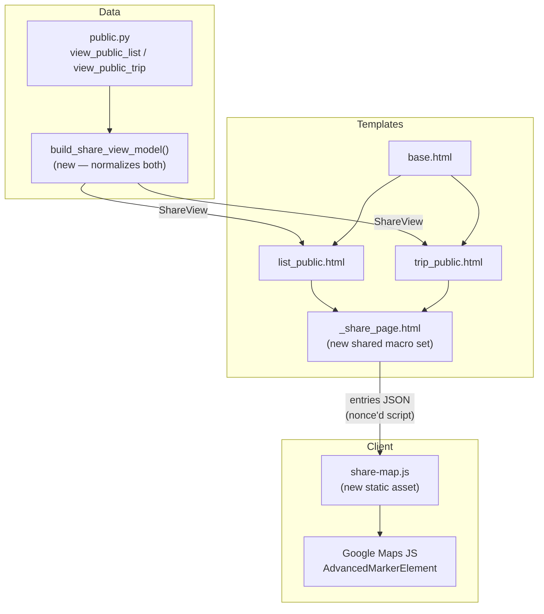
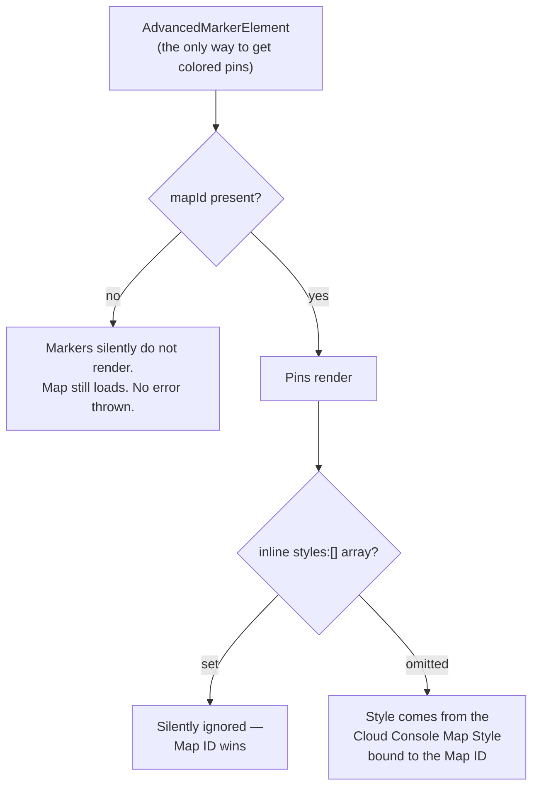

# feat: Editorial redesign of public share pages with mapped custom pins

## Summary

Replace the public trip page (`/t/{slug}`) and public list page (`/l/{slug}`) with the **2a editorial layout** from the approved design mock: full-bleed hero, dark byline bar, sticky category filters, alternating numbered image/text rows, an interactive Google Map with custom colored pins, and a gold CTA band.

Two things make this more than a template swap:

1. **The trip page cannot currently map anything.** `PublicTripEntry` carries no coordinates, even though the endpoint already reads `lat`/`lng` to build its outbound links. The schema and constructor must be extended before the trip map can render a single pin.
2. **Custom pins force a Google Cloud Console dependency.** Advanced Markers require a Map ID, and a Map ID makes the inline JSON `styles` array a no-op. The map's palette must be configured in the Cloud Console as a Map Style bound to that Map ID — it cannot ship in this repo.

The design system is already aligned: the mock's fonts (Playfair Display, Open Sans, Dawning of a New Day) and its entire palette (`#172A3A`, `#FDF6ED`, `#FFC636`, `#C1543E`, and the `#D2E4F1`/`#F3DAD1`/`#FBE7B4` tints) are the existing tokens in `backend/app/static/css/src/variables.css`. This is a structural rebuild, not a rebrand.

---

## Problem Frame

The public share page is the app's only organic-growth surface — it is what a user sends to a friend, and the friend's first impression of Atlasi. Today both public pages render the same generic 3-column card grid: a hero image, a floating glass info card, and cards with a photo, a title, and a note. It reads like a CRUD listing, not like something worth sending.

The redesign (approved: **turn 2a**, the editorial direction) makes the page feel like a travel magazine spread — and, critically, adds a **map**, which is the single most useful missing affordance on a page whose entire content is places. A shared list of 30 Istanbul spots is far more valuable when you can see them clustered across the city, color-coded by what they are.

**Scope:** the two public server-rendered pages only. Not the mobile app, not the landing page.

---

## Product Contract

### Requirements

| ID | Requirement |
|---|---|
| R1 | Both `/t/{slug}` and `/l/{slug}` render the 2a editorial layout: sticky nav, full-bleed hero, byline bar, sticky filters, alternating entry rows, map section, gold CTA, footer. |
| R2 | Entry imagery shows the entry's real photo when one exists; falls back to the mock's tinted category-icon tile when it does not. |
| R3 | The map renders one custom pin per entry that has coordinates, colored by entry category and numbered to match the feed. |
| R4 | Entry categories are color-coded consistently across the tint tiles, the category chips, the map pins, and the map legend. |
| R5 | All four entry types (`place`, `food`, `stay`, `experience`) have a distinct color. The mock omits `stay`; it gets one. |
| R6 | Category filters let a visitor narrow the feed to one type, client-side, with counts. |
| R7 | The byline shows who shared the list/trip and how many countries they have visited. |
| R8 | Entries without coordinates still render in the feed; they are simply absent from the map. |
| R9 | The existing outbound affiliate-redirect behavior on entry clicks is preserved. |
| R10 | The Content-Security-Policy admits Google Maps without weakening `style-src` to `'unsafe-inline'`. (`script-src` must gain `'unsafe-eval'` — unavoidable; see KTD11.) |
| R11 | The byline shows the sharer's avatar when `avatar_url` exists, and falls back to name-only when it does not. |
| R12 | The full feed renders — no cap, no pagination — however long the collection is. |
| R13 | **No image is served at a larger resolution than it is displayed at.** In particular the hero cover and any entry photo lacking a thumbnail — both of which currently ship full-size originals. |
| R14 | Below-the-fold entry images do not block first paint; the hero is prioritized and everything below it defers. |
| R15 | The page's SEO surface is preserved and improved: crawlable entry content in the initial HTML, valid structured data on both pages, and no regression to indexability. |

### Acceptance Examples

| ID | Example |
|---|---|
| AE1 | A list of 30 Istanbul places renders 30 numbered alternating rows; entries 01, 03, 05… have the image left, 02, 04, 06… have it right. |
| AE2 | Clicking "Food · 12" reduces the feed to the 12 food entries, updates the count readout to "12 of 30 places", and leaves the map pins unchanged. |
| AE3 | An entry with a `media_urls[0]` photo shows that photo; an entry with neither a photo nor a `place_photo_url` shows a tinted tile with the category icon. |
| AE4 | A food entry's pin is Adobe Brick `#C1543E` on the map and its chip is the rose tint — the same color language in both places. |
| AE5 | A trip whose entries have no `place` rows (hence no coordinates) renders the feed normally and hides the map section entirely rather than showing an empty world map. |
| AE6 | With `google_maps_browser_api_key` unset (e.g. local dev, CI), the page renders fully and the map section is omitted — no console errors, no broken iframe. |
| AE7 | A sharer with an `avatar_url` shows the image in the byline; one without shows the name alone (no letter-avatar placeholder, no broken image). |
| AE8 | A 50-entry list renders all 50 rows, and the total image bytes fetched on first paint is a small fraction of the page's total — not tens of megabytes. |
| AE9 | An entry whose media record has no `thumbnail_path` still renders a *display-sized* image, not the multi-megabyte original. |
| AE10 | Disabling JavaScript still shows every entry's title, note, place name, and photo in the HTML source (crawlers see the full content). |

---

## High-Level Technical Design

The two pages share ~90% of their markup. Today they are two near-duplicate templates that have already drifted (the list page has JSON-LD; the trip page does not). The redesign is the moment to collapse the shared structure into one macro-driven partial rather than duplicating the new, much larger layout twice.



The key move is a **normalizing view model**. `PublicListView` and `PublicTripView` have different field names for the same concepts (`name`/`name`, `description`/`date_range`, `created_at`/`created_at`, list has `country_name`, trip has `country_name` + `country_code`). Rather than teaching the template to branch on which type it got, both endpoints build one `ShareView` and the template renders that. This is what keeps the two pages from drifting again.

**Category color mapping** — a single source of truth, defined once in Python, consumed by the template (tints, chips) and serialized to JS (pins, legend):

| Type | Tile / chip tint | Ink | Pin fill | Token |
|---|---|---|---|---|
| `place` | `#D2E4F1` | `#2f6690` | `#2f6690` | `--color-tint-blue` |
| `food` | `#F3DAD1` | `#C1543E` | `#C1543E` | `--color-tint-rose` |
| `experience` | `#FBE7B4` | `#a97b12` | `#a97b12` | `--color-tint-butter` |
| `stay` | `#DAE3D6` | `#547A5F` | `#547A5F` | `--color-tint-sage` |

The `stay` row is the plan's one deliberate addition to the mock, which only styles three types. Moss Green / sage is already in the token set and is the only brand color not otherwise spoken for.

### The map, precisely

This is where the plan's real risk lives, and where a naive implementation silently produces a map with no pins.



Consequences, stated plainly so they are not discovered during implementation:

- **A Map ID is mandatory.** Not optional, not a nice-to-have. Without it, `AdvancedMarkerElement` does not render and the failure is silent. Guard at runtime with `map.getMapCapabilities().isAdvancedMarkersAvailable`.
- **The map's visual style is therefore not in this repo.** It is configured in the Google Cloud Console and referenced by ID. Shipping the palette as a JSON `styles` array alongside a `mapId` produces a console warning and is *silently ignored*. The good news: the Cloud Console style editor has an **Import JSON** option, so a palette authored as a JSON array can be pasted in rather than rebuilt by hand — and cloud-based styling is **free** on the Maps JavaScript API.
- **Two API keys, not one.** The existing `google_places_api_key` is server-side and must stay IP-restricted. The map needs a *separate*, browser-exposed key restricted by HTTP referrer to our domains and scoped to the Maps JavaScript API only. These cannot be the same key: the server-side APIs *reject* referrer-restricted keys outright.
- **The CSP cost is real, and it is `'unsafe-eval'`, not `'unsafe-inline'`.** Google's own recommended *strict* CSP for Maps includes `'unsafe-eval'`, `'strict-dynamic'`, and `blob:` in `script-src`, plus `worker-src blob:`. We keep the nonce and avoid `'unsafe-inline'` in `style-src` (Maps propagates our nonce to the elements it injects), but `'unsafe-eval'` is unavoidable — Maps will not initialize without it. See KTD11 for how we contain the blast radius.
- **Missing `googleapis.com` in the CSP is a hard rejection, not a blocked resource.** Since Q2 2023 the API refuses to serve requests whose CSP does not name `googleapis.com`.

Sources: [Advanced Markers](https://developers.google.com/maps/documentation/javascript/advanced-markers/start) · [Maps CSP](https://developers.google.com/maps/documentation/javascript/content-security-policy) · [Cloud-based map styling](https://developers.google.com/maps/documentation/javascript/cloud-customization) · [Import JSON to a cloud style](https://developers.google.com/maps/documentation/javascript/cloud-customization/json)

---

## Key Technical Decisions

**KTD1 — One shared template partial, two thin page templates.**
The 2a layout is large (hero + byline + filters + feed + map + legend + list + CTA). Duplicating it across `list_public.html` and `trip_public.html` guarantees drift; the two current templates have already drifted. Introduce `_share_page.html` with Jinja macros, and reduce the page templates to: build context → call macros → supply page-specific JSON-LD. Rationale: the pages are the same product surface with different nouns.

**KTD2 — Normalize to a `ShareView` in Python, not in Jinja.**
Alternative was `` branching in the template. Rejected: it pushes model differences into the presentation layer and makes the map's entry-JSON serialization branch too. A `build_share_view_model()` that both endpoints call keeps the template dumb.

**KTD3 — Category styling defined once in Python, exported to both CSS and JS.**
A `CATEGORY_STYLES` dict in `app/core/share_view.py` is the single source of truth. The template reads it for tints/chips; it is `tojson`-serialized into the nonce'd bootstrap script for the pins and legend. Rationale: four types × four surfaces (tile, chip, pin, legend) is exactly where color drift happens.

**KTD4 — Map degrades to omitted, never to broken.**
If `google_maps_browser_api_key` or `google_maps_map_id` is unset, or no entry in the collection has coordinates, the map section does not render at all. Rationale: local dev and CI have no key; a half-initialized map that throws in the console on the app's primary growth surface is worse than no map. This makes AE5/AE6 first-class, not error handling bolted on.

**KTD5 — External JS file, not inline.**
The map logic is ~100 lines. Ship it as `backend/app/static/js/share-map.js` (the repo's first static JS file — there is currently no `static/js/`), loaded with `defer`. Only the *data* is inline, in a nonce'd `<script type="application/json">`. Rationale: keeps the CSP surface to `'self'` for our own code, keeps the template readable, and makes the JS cacheable.

**KTD6 — Pins are numbered and match the feed.**
`PinElement` supports a `glyph`. Use the entry's ordinal so the map and the numbered editorial rows cross-reference. Rationale: this is the affordance that makes the map genuinely useful rather than decorative, and it is nearly free.

**KTD7 — The page is slow because of image *bytes*, not because of missing lazy-loading. Fix the bytes.**
Worth stating precisely, because the intuitive fix is the wrong one: `loading="lazy"` is **already present** on entry images (`list_public.html:107`, `trip_public.html:63`). Adding lazy-loading would change nothing. The actual causes, both confirmed in the code:

1. **`extract_media_urls` falls back to the full-resolution original when a media record has no `thumbnail_path`** (`app/core/media.py:35-41`). Thumbnails are only generated server-side when the client didn't supply one (`app/api/media.py:180`), so coverage is uneven — and every uncovered entry ships a multi-megabyte phone photo into a ~400px frame.
2. **The hero `cover_image_url` is never resized at all.** It is passed straight through (`public.py:251`, `384`) and rendered full-bleed. It is the LCP element on every share page, and it is a raw original.

Neither is fixed by deferring the load; a lazily-loaded 8 MB image is still an 8 MB image the moment it scrolls in — and on a page the visitor immediately starts scrolling, that is nearly at once. Serve correctly-sized images (KTD8) and *then* defer the below-fold ones (KTD9). Doing this in the wrong order produces a page that still feels slow and a team that concludes lazy-loading "didn't work."

**KTD8 — Resize at the URL, via Supabase image transformation — no migration, no backfill.**
Supabase Storage serves on-the-fly transforms (`/render/image/public/...?width=&quality=`). Add a `media_url(path, width)` helper in `app/core/media.py` and use it for the hero, the entry frames, and the avatar. This fixes both the missing-thumbnail fallback *and* the unresized hero at the point of rendering, without touching the upload pipeline, backfilling thumbnails, or migrating storage. Alternatives considered: (a) backfill thumbnails for every existing media row — slow, and still leaves the hero unresized; (b) generate more sizes at upload time — doesn't help the millions of already-uploaded originals. The transform URL is strictly less work and covers past and future uploads alike. Confirm transformations are enabled on the project before relying on it; if they are not, fall back to (b) plus a hero-specific thumbnail.

**KTD9 — Prioritize the hero, defer everything else; keep the full feed (no cap).**
Per the user's call, the feed is uncapped even at 50+ entries. That makes byte-discipline load-bearing rather than optional:
- Hero: `fetchpriority="high"`, **not** lazy (it is the LCP element — lazy-loading it actively hurts).
- Entry images: keep `loading="lazy"`, add `decoding="async"`, and add **explicit `width`/`height`** so the browser reserves layout space. Missing intrinsic dimensions on a 50-row alternating feed is a CLS disaster, and today's templates supply none.
- Map: instantiate on scroll-into-view (already in U7) — it is below the entire feed and should cost nothing until reached.
This preserves R12 (no cap) while making the long scroll cheap.

**KTD10 — Lazy-load bytes, never content. SEO depends on it.**
The feed stays **server-rendered in full** — every entry's title, note, place name, and image `src` is present in the initial HTML (AE10). Only the *fetching* of below-fold images is deferred, by the browser, natively. Explicitly rejected: JS-driven infinite scroll or client-side entry rendering, which would speed up first paint while hiding the page's entire content from crawlers. These pages exist to be indexed and shared; content-level lazy-loading would trade the page's whole purpose for a metric.

**KTD11 — Scope the `'unsafe-eval'` CSP relaxation to the two share routes, not site-wide.**
Maps requires `'unsafe-eval'` in `script-src`. Today `SecurityHeadersMiddleware` sets one CSP for every response, so the naive change weakens the policy on the landing, contact, legal, and *all API* responses to satisfy two pages. Instead, make the middleware emit the Maps-relaxed policy only for the share routes and keep the current strict policy everywhere else. Rationale: `'unsafe-eval'` is the meaningful security give in this plan; confining it to two read-only public pages that render no user-authored HTML is a materially smaller surface than the whole app. Alternative considered — accept it site-wide for simplicity — rejected as needlessly broad given the middleware already has the request in hand.

**KTD12 — The byline is in scope, and it costs a query.**
"Shared by Maya · 31 countries visited" requires data neither endpoint fetches today: the owner (`list.owner_id` / `trip.user_id`) → `user_profile.display_name` + `avatar_url`, plus a `user_countries WHERE status='visited'` count. This is one additional Supabase call per page render. **This breaks every existing public-page test** (see Risks). Accepted because the byline is the social-proof element that makes the page feel shared-by-a-person rather than generated — it is the point of the redesign. Fetched in a single combined call where possible to keep it to one extra round-trip.

---

## Scope Boundaries

### In scope
- `backend/app/templates/list_public.html`, `trip_public.html`, and a new shared partial
- `backend/app/api/public.py` — both public view endpoints
- `backend/app/schemas/` — trip entry coordinates, new share view model
- `backend/app/static/css/src/pages/list.css` — rewritten for the editorial layout
- `backend/app/static/css/src/responsive.css` — the 768px list/trip block
- `backend/app/main.py` — CSP
- `backend/app/core/config.py` — two new settings
- New: `backend/app/static/js/share-map.js`, `backend/app/core/share_view.py`
- Tests for all of the above

### Deferred to Follow-Up Work
- **Marker clustering.** At 30 pins in one city the map is legible without it. If lists grow to hundreds of entries, revisit `googlemaps/markerclusterer`.
- **Click-a-pin-to-scroll-to-the-entry** (and the reverse). A natural next step now that pins and rows share ordinals, but not required for the redesign to land.
- **Multi-photo galleries.** `extract_media_urls` already returns *every* uploaded photo, but the templates render only `media_urls[0]` — today and in this plan. A magazine layout could use the rest; that is its own design question.
- **Sharing the editorial layout with the landing page.** Out of scope; landing was recently reworked and is uncommitted.

### Out of scope
- The mobile app (`mobile/`)
- The landing, legal, and contact pages
- Editing shared `components.css` rules that other pages depend on (see Risk R2)

---

## Implementation Units

### U1. Add coordinates to the trip entry schema

**Goal:** Make the trip page capable of having a map at all. Today it is not.

**Requirements:** R3, R8

**Dependencies:** none — do this first; the trip map is blocked on it.

**Files:**
- `backend/app/schemas/public.py` — add `latitude: float | None`, `longitude: float | None` to `PublicTripEntry`
- `backend/app/api/public.py` — pass `latitude=lat, longitude=lng` in the `PublicTripEntry(...)` construction (~line 362); the endpoint already reads `lat`/`lng` at ~line 339 to build the maps URL, so no query change is needed
- `backend/tests/test_public_endpoints.py`

**Approach:** Purely additive. `PublicListEntry` already has `latitude`/`longitude` and the list endpoint already populates them — this brings the trip entry to parity. The `select` in the trip query already fetches `lat, lng`; they are read and then dropped on the floor.

**Test scenarios:**
- A trip entry whose place has `lat`/`lng` exposes them on the view model.
- A trip entry with no `place` row yields `latitude is None`, `longitude is None` (not a `KeyError`).
- A trip entry whose place exists but has null coordinates yields `None` for both.

**Verification:** `PublicTripEntry` and `PublicListEntry` expose the same coordinate fields; existing trip tests still pass.

---

### U2. Category styling + share view model

**Goal:** One source of truth for category colors and one normalized shape both pages render.

**Requirements:** R4, R5

**Dependencies:** U1

**Files:**
- `backend/app/core/share_view.py` (new) — `CATEGORY_STYLES` and `build_share_view_model()`
- `backend/app/schemas/share.py` (new) — `ShareView`, `ShareEntry`, `ShareAuthor`
- `backend/tests/test_share_view.py` (new)

**Approach:** `CATEGORY_STYLES` maps each of the four `EntryType` values to `{tint, ink, pin, label, icon}`. `build_share_view_model()` takes either a `PublicListView` or a `PublicTripView` plus the author data and returns a `ShareView` with: title, subtitle (list `description` / trip `date_range`), country, cover image, share date, author, entry count, and an ordered list of `ShareEntry` (ordinal, title, type, category style, note, place name, photo URL or `None`, coordinates or `None`, redirect URL).

Deriving the ordinal here — not in the template — is what lets the map pins and the feed rows share numbering without the template computing it twice.

**Patterns to follow:** The existing `_extract_place_photo_url` / `extract_media_urls` helpers in `app/core/` — same module-level, pure-function, unit-tested style.

**Test scenarios:**
- Every `EntryType` member has an entry in `CATEGORY_STYLES` (guards against a new type being added without a color — parameterize over the enum so this fails loudly).
- A `PublicListView` and a `PublicTripView` with equivalent content produce equivalent `ShareView`s.
- Photo precedence: `media_urls[0]` wins over `place_photo_url`; `place_photo_url` is used when `media_urls` is empty; `None` when neither.
- Ordinals are 1-based, contiguous, and stable in feed order.
- An unknown/legacy entry type falls back to `place` styling rather than raising.

**Verification:** `poetry run pytest tests/test_share_view.py` passes; the model is importable by both endpoints.

---

### U3. Maps configuration and CSP

**Goal:** Let Google Maps load at all, confining the required CSP relaxation to the two share routes.

**Requirements:** R10

**Dependencies:** none (parallel with U1/U2)

**Files:**
- `backend/app/core/config.py` — `google_maps_browser_api_key: str = Field(default="", repr=False)` and `google_maps_map_id: str = ""`
- `backend/app/main.py` — CSP in `SecurityHeadersMiddleware.dispatch` (~lines 178-186)
- `backend/.env.example`
- `backend/tests/test_public_endpoints.py` — CSP assertions

**Approach:** Per KTD11, `SecurityHeadersMiddleware.dispatch` gains a branch: share routes (`/l/{slug}`, `/t/{slug}`) get a Maps-compatible policy; every other response keeps today's stricter one unchanged.

Google's recommended **strict** (nonce-based) Maps policy — this is the target, not an allowlist fallback:

```
script-src  'nonce-{nonce}' 'strict-dynamic' https: 'unsafe-eval' blob:;
img-src     'self' https://*.googleapis.com https://*.gstatic.com *.google.com *.googleusercontent.com https://*.supabase.co data:;
frame-src   *.google.com;
connect-src 'self' https://*.googleapis.com *.google.com https://*.gstatic.com data: blob:;
font-src    https://fonts.gstatic.com;
style-src   'nonce-{nonce}' https://fonts.googleapis.com;
worker-src  blob:;
```

Three things here are non-obvious and each fails at runtime rather than at build:

- **`'unsafe-eval'` is required.** Maps does not initialize without it. This is the security give (KTD11 confines it to these two routes).
- **`worker-src blob:` and `blob:` in `script-src`/`connect-src`** — Maps spins up blob workers. This directive does not exist in the current CSP at all.
- **`googleapis.com` must appear in `connect-src`/`img-src`.** Since Q2 2023 Maps *hard-rejects* requests from pages whose CSP omits it — this is an API-level refusal, not a browser-blocked resource.

`style-src` keeps the nonce and gains **no** `'unsafe-inline'`: the Maps bootstrap loader reads the page's first `script[nonce]` and propagates it to the elements it injects. Preserve the existing `https://*.supabase.co` in `img-src` — entry photos are served from there and would otherwise break.

`google_maps_browser_api_key` is a **new, separate** key from the server-side `google_places_api_key`: HTTP-referrer-restricted to our domains, API-restricted to the Maps JavaScript API. Documented in `.env.example` with that warning — the two keys are not interchangeable in either direction (the server-side APIs reject referrer-restricted keys outright).

**Execution note:** A CSP violation is invisible to the test suite — it surfaces only as a console error in a real browser. After this unit, load a share page in a browser and confirm a clean console before moving on.

**Test scenarios:**
- The CSP header on `/l/{slug}` and `/t/{slug}` contains `'unsafe-eval'`, `blob:`, `worker-src blob:`, and `*.googleapis.com` in both `connect-src` and `img-src`.
- The CSP header on `/`, `/privacy`, `/contact`, and an API route does **not** contain `'unsafe-eval'` (this is the KTD11 containment guard — the whole point of the branch).
- `style-src` contains `'nonce-` and does **not** contain `'unsafe-inline'` on every route (the property we are protecting).
- `img-src` still contains `https://*.supabase.co` (photo regression guard).
- Settings default to empty strings when the env vars are absent, so CI and local dev work unchanged.

**Verification:** Security-header tests pass; a browser console on a share page shows zero CSP violations; the landing page's CSP is byte-for-byte unchanged.

---

### U4. Owner byline data

**Goal:** "Shared by Maya · 31 countries visited".

**Requirements:** R7

**Dependencies:** U2

**Files:**
- `backend/app/api/public.py` — a `_fetch_share_author(owner_id)` helper, called from both endpoints
- `backend/app/schemas/share.py` — `ShareAuthor`
- `backend/tests/conftest.py` — **fixture update (see below)**
- `backend/tests/test_public_endpoints.py` — **every public-page test needs its mock updated**

**Approach:** Fetch `user_profile.display_name` + `avatar_url` for `list.owner_id` / `trip.user_id`, and count `user_countries` rows with `status='visited'`. Both are cheap indexed lookups (`idx_user_countries_user_status` already exists).

**Avatar (R11):** render the avatar image when `avatar_url` is present; when it is absent, render the name alone — no letter-avatar, no placeholder circle. (The current `trip_public.html:41` letter-avatar is dropped.) The avatar is served through the resized-URL helper from U6a at its display size, not full-resolution.

**This unit is where the existing tests break, and it is not incidental.** `tests/conftest.py`'s `mock_supabase_client` drives responses with `mock.get.side_effect = [rows_1, rows_2]` — a *fixed-length list* matched positionally to the endpoint's `.get()` calls. Adding a third query makes every existing public-page test raise `StopIteration`. Two options; take the second:

1. Append a third element to every test's `side_effect` list — brittle, and the next added query breaks it all again.
2. **Convert the mock from `side_effect`-list to a table-keyed side-effect function** that dispatches on the table name passed to `.get()`. Tests then declare *what data exists*, not *in what order it is fetched*. This is strictly more robust and stops this class of breakage recurring.

**Execution note:** Do the conftest refactor **first**, and confirm the existing public-page suite still passes green *before* adding the author query. That separates "the mock refactor is correct" from "the new query is correct" — otherwise a failure at the end is ambiguous between the two.

**Test scenarios:**
- A list whose owner has a `display_name` renders it in the byline.
- An owner with no `user_profile` row renders the page without a byline rather than 500-ing.
- An owner with zero visited countries renders the name without the "· N countries visited" clause (not "0 countries visited").
- The visited count excludes wishlist rows (seed one of each `user_country_status` and assert the count is 1).
- Regression: all pre-existing public-page tests pass against the refactored fixture.

**Verification:** Full `poetry run pytest tests/test_public_endpoints.py` green, including the previously-passing tests, with no `StopIteration`.

---

### U4b. Right-sized image URLs (the actual fix for the slow page)

**Goal:** Stop serving multi-megabyte originals into small frames. This is the single highest-impact change in the plan for perceived speed, and it is independent of the redesign.

**Requirements:** R13

**Dependencies:** none — this can land first, and is worth landing first. It improves the *current* pages immediately, before any redesign ships.

**Files:**
- `backend/app/core/media.py` — a `media_url(path, *, width, quality=80)` helper alongside the existing `build_media_url`
- `backend/app/api/public.py` — route `cover_image_url` and the avatar through it
- `backend/app/core/share_view.py` — entry photo URLs carry their display width
- `backend/tests/test_media.py`

**Approach:** Supabase Storage exposes on-the-fly image transformation at `/storage/v1/render/image/public/...?width=N&quality=Q` (vs. today's `/object/public/...`). Add `media_url()` producing the render URL; leave `build_media_url()` in place for non-display uses.

**Confirmed working on this project** (verified against a real stored cover, `bmcohizquzzmpeidzvbk`): the endpoint returns `200` with an `x-transformations: width:800,resizing_type:fill,quality:80` header. Measured on a 464 KB cover:

| Request | Result |
|---|---|
| `/object/public/...` (today) | 464 KB JPEG |
| `/render/image/public/...?width=800&quality=80` | 160 KB JPEG (−65%) |
| same, with a browser `Accept: image/webp` | **102 KB WebP (−78%)** |
| hero: `?width=1600&quality=80`, WebP | 200 KB |

Three things this establishes:

1. **Compression is the mechanism, and it needs no upload-pipeline change, no backfill, and no migration.** It applies to every image already in storage, including the multi-megabyte originals that have no thumbnail.
2. **WebP is automatic and free** — Supabase content-negotiates on the browser's `Accept` header. No code beyond using the render URL.
3. **The default `resizing_type` is `fill`, which _crops_.** Choose deliberately per surface rather than inheriting it: `fill` (crop-to-fit) is right for the fixed 4:3 entry frames; pass `resize=contain` where the subject must not be cut (measured: 97 KB at 800px).

Apply at three sizes:
- **Hero cover** — 1600px, quality 80. Today: unresized full original, and it is the LCP element (`public.py:251`, `384`).
- **Entry frame** — 800px (matches the existing `THUMBNAIL_MAX_DIMENSION`; the 4:3 frame is ~500px on a 1200px canvas). This is the path that rescues entries whose media row has no `thumbnail_path` and currently falls back to the raw original (`media.py:35-41`).
- **Avatar** — 96px.

Also emit `srcset` at 1x/2x for the entry frames so retina screens get 2x without every screen paying for it. The transform makes additional widths free to request.

`_extract_place_photo_url` (Google Places photos) is a different host and unaffected — Google serves those pre-sized.

**Remaining check:** the CSP's existing `img-src https://*.supabase.co` covers the `/render/image/` path (same host), so no CSP change is expected — confirm in the browser rather than assuming.

**Execution note:** Measure before and after on a real, image-heavy list — total image bytes on load, and LCP. The user's report is "very slow"; this unit should be the one that visibly fixes it, and the number is the proof. If the before/after doesn't move, the diagnosis in KTD7 is wrong and the cause is elsewhere — stop and re-diagnose rather than proceeding on assumption.

**Test scenarios:**
- `media_url(path, width=800)` returns a `/render/image/public/` URL carrying `width=800`.
- The rendered hero `` src carries a width parameter (regression guard for the unresized-LCP bug).
- An entry whose media record has **no** `thumbnail_path` and a `.jpg` original still yields a width-constrained URL, not the bare original (AE9 — the specific bug).
- HEIC without a thumbnail is still skipped entirely (preserve existing `extract_media_urls` behavior — do not regress it).
- `build_media_url` behavior is unchanged for any existing non-display caller.

**Verification:** On a seeded image-heavy list, total image bytes on first load drop by an order of magnitude and LCP improves measurably.

---

### U5. The shared editorial template

**Goal:** The 2a layout, rendering real data, on both pages.

**Requirements:** R1, R2, R6, R8, R9, R11, R12, R14

**Dependencies:** U2, U4, U4b

**Files:**
- `backend/app/templates/_share_page.html` (new) — macros for hero, byline, filters, feed, map section, CTA
- `backend/app/templates/list_public.html` — reduced to context + JSON-LD + macro calls
- `backend/app/templates/trip_public.html` — same
- `backend/tests/test_public_endpoints.py`

**Approach:** Follow the mock's 2a structure section by section. Notable mappings from mock to real data:

- **Hero** — cover image, country + entry count + share date eyebrow, title, subtitle. The existing `.hero-bg-fallback` handles a missing cover.
- **Byline bar** — navy band, `ShareAuthor` (U4).
- **Filters** — buttons with per-type counts; `data-filter` attributes drive client-side filtering. Only render filters for types actually present in this collection (a list with no stays should not offer a "Stays · 0" button).
- **Feed** — alternating rows via `loop.index0 % 2`. Ordinal, title, place name, note as a serif pull-quote. Image frame renders the photo when present, else the tinted category tile with its icon (R2 / AE3).
- **Entry links** — preserve `redirect_url` → sanitized `link` → Google Maps fallback precedence exactly as today (R9). This is affiliate revenue; do not regress it.
- **Map section** — rendered only when the map is configured *and* at least one entry has coordinates (KTD4).

**Image loading discipline (R14, KTD9)** — the feed is uncapped (R12), so this is what keeps a 50-row page fast:
- Hero: `fetchpriority="high"`, **no** `loading="lazy"` (it is the LCP element; lazy-loading it makes LCP *worse*).
- Entry images: `loading="lazy"` + `decoding="async"` + **explicit `width` and `height`**. The current templates supply no intrinsic dimensions; on a 50-row feed that is a significant CLS problem, and the fix is free.
- The feed itself is fully server-rendered — only image *bytes* defer, never content (KTD10).

**The `entry-card` test collision:** `test_public_trip_with_many_entries` asserts `response.text.count("entry-card") == 25`. The new markup has no `.entry-card`. Per the repo's bug-fix convention, **update this test deliberately** to assert against the new structure (count the editorial row class), rather than preserving a dead class name to satisfy a stale assertion. Note it in the commit.

**Icons:** the mock's category glyphs are inline SVG paths for place/food/experience. These are geometric line icons, not an icon library, and are covered by the "custom-designed" allowance in the project's no-icons rule — but they are *new UI iconography*, so confirm with the user before adding the `stay` glyph rather than inventing one.

**Test scenarios:**
- Both pages return 200 and contain their entry titles (preserve existing content assertions).
- 25 entries produce 25 editorial rows.
- Odd-indexed rows carry the image-right modifier class; even-indexed carry image-left.
- An entry with a photo renders an ``; one without renders the tint tile with the category icon and no ``.
- An entry with a `redirect_url` is wrapped in an anchor pointing at it (affiliate regression guard).
- A collection with zero entries renders the empty state and no map.
- The JSON-LD block on the list page still parses as valid JSON (it moves; it must not break).
- The list page's inline JSON-LD carries the CSP nonce — it does **not** today (`list_public.html:7`), which is a latent CSP bug this rewrite should fix.

**Verification:** Both pages render the full 2a layout against seeded data; existing content tests pass.

---

### U5b. SEO surface

**Goal:** These two pages are the app's organic-discovery surface. The redesign is the moment to fix what is missing and avoid regressing what works.

**Requirements:** R15

**Dependencies:** U5

**Files:**
- `backend/app/core/seo.py` — a `build_share_structured_data()` alongside the existing `build_landing_structured_data`
- `backend/app/templates/_share_page.html` — emit it
- `backend/tests/test_seo.py`

**Approach:** What exists today: `build_list_seo` / `build_trip_seo` produce OG/Twitter tags and a canonical URL (`seo.py:178`, `203`), and `base.html` renders them. That part works — preserve it.

What is missing or broken:
- **The trip page has no structured data at all.** The list page has hand-rolled `ItemList` + `BreadcrumbList` JSON-LD inline in the template (`list_public.html:7-42`); the trip page has none. Move both to a shared `build_share_structured_data()` so the two pages emit equivalent, consistent JSON-LD.
- **The list page's JSON-LD carries no CSP nonce** (`list_public.html:7`). It survives only because the nonce test targets `/` alone. Fix while restructuring.
- **`ItemList` items are name-only.** Now that entries carry coordinates, category, notes, and photos, the items can be richer (`Place` with `geo`, an image, a description) — a materially better result in search than a bare list of strings.
- **Image alt text** — the existing templates do write descriptive alts; preserve that in the new markup rather than dropping it during the rewrite.
- **Heading hierarchy** — the editorial layout has one `<h1>` (the title) and `<h2>` per entry. Keep it well-formed; do not use headings for the numeric ordinals.

**The SEO argument for the no-cap decision (R12):** an uncapped, fully server-rendered feed means every entry's text is in the initial HTML and indexable. This is also why KTD10 forbids JS-rendered content — infinite scroll would hide the page's entire substance from crawlers.

**Test scenarios:**
- Both `/l/{slug}` and `/t/{slug}` emit a JSON-LD block that parses as valid JSON.
- Both emit `ItemList` with one item per entry, and `BreadcrumbList`.
- The JSON-LD `<script>` carries the CSP nonce on **both** pages (the current list-page bug).
- The canonical URL, `og:title`, `og:description`, and `og:image` are unchanged from today's behavior (regression guard on the working part).
- An entry with coordinates contributes `geo` to its structured-data item; one without omits `geo` rather than emitting nulls.
- Extend the existing nonce test to cover `/l/` and `/t/`, not just `/` — the gap that let this bug persist.

**Verification:** Both pages validate in Google's Rich Results Test; existing `test_seo.py` passes unchanged.

---

### U6. Editorial CSS

**Goal:** Style the layout without breaking the four other pages that share `components.css`.

**Requirements:** R1, R4

**Dependencies:** U5

**Files:**
- `backend/app/static/css/src/pages/list.css` — rewritten
- `backend/app/static/css/src/responsive.css` — the 768px list/trip block
- `backend/app/static/css/styles.css`, `styles.min.css` — regenerated, committed

**Approach:** All new rules are scoped under a page-level class (e.g. `.share-page`) so they cannot leak. Three traps, all confirmed in the current CSS:

1. **`.features-grid` is defined in `pages/list.css:104` but used by `landing.html`.** Rewriting list.css naively deletes it and breaks the landing page's feature grid. Move it to `landing.css` (where it belongs) as part of this unit, or preserve it. `.features` (list.css:99) is genuinely unused and can go.
2. **`components.css` is shared by every template.** The mock's CTA band is gold; the existing `.cta-section` is navy and is used by both public pages only — but `.cta-button`, `.header`, `.logo`, and all `.footer-*` are used by *all eight* templates. Override them under `.share-page`, never edit them in place.
3. **`body.has-hero` rules in `landing.css` already apply to the public pages** (both pass `has_hero: True`, and landing.css is concatenated *after* list.css, so it wins on shared selectors). Any header styling for the share page must account for this existing cross-contamination — scope by `.share-page`, and verify the header on both a share page and the landing page after the change.

The token set already covers the mock: `--color-tint-blue/rose/butter/sage`, `--color-accent-blue/butter`, the three font families. No new tokens are expected; if the mock needs a value that isn't a token, add it to `variables.css` rather than hardcoding a hex in page CSS.

**Execution note:** This is styling with no behavioral surface — unit tests prove nothing. Verify by loading both pages plus landing, legal, and contact in a browser at 1440px, 768px, and 375px and confirming nothing regressed on the pages you did *not* intend to touch.

**Test expectation:** none — pure styling. Regression risk is covered by visual verification of the four sibling pages, per the execution note.

**Verification:** `node scripts/build-css.js` regenerates cleanly; generated CSS is committed; landing/legal/contact are visually unchanged.

---

### U7. The map: custom pins

**Goal:** An interactive map with colored, numbered pins, a legend, and the place list.

**Requirements:** R3, R4, R5, R8

**Dependencies:** U3, U5, U6

**Files:**
- `backend/app/static/js/share-map.js` (new — first file in a new `static/js/` directory)
- `backend/app/templates/_share_page.html` — map section, legend, place list, nonce'd data script
- `backend/tests/test_public_endpoints.py`

**Approach:** The template emits entry data as a nonce'd `<script type="application/json">` block (coordinates, ordinal, title, category, pin color) plus the map config. `share-map.js` loads with `defer`, reads that JSON, and:

1. Uses the **inline bootstrap loader** + `importLibrary("maps")` / `importLibrary("marker")` — not the legacy `<script src="...&callback=initMap">` tag. The bootstrap loader's promise *rejects* on load failure, where the callback form fails silently; it also copies the page nonce onto the script element it injects, which is what makes the strict CSP work.
2. Constructs the map **with the `mapId`** — mandatory; without it, every pin below silently never appears.
3. Registers a `mapcapabilities_changed` listener asserting `map.getMapCapabilities().isAdvancedMarkersAvailable`. If false, the Map ID is missing or misconfigured — log it loudly rather than shipping a pinless map that looks merely empty.
4. Builds one `AdvancedMarkerElement` per entry with coordinates, using a `PinElement` whose `background`/`borderColor` come from the category's pin color and whose `glyph` is the entry ordinal (KTD6).
5. Fits bounds to the pins.
6. Sets **no** `styles` array. The palette comes from the Cloud Console Map Style bound to the Map ID; passing `styles` alongside `mapId` is silently ignored (console warning only). Do not add one.
7. Instantiates the `Map` **once**, lazily on scroll-into-view. Billing is per map *load*, not per pin, so a 50-pin map costs the same as a 1-pin map — but a map that initializes for every crawler hit burns free-tier quota for nothing.

Legend and the two-column place list below the map are server-rendered from the same `CATEGORY_STYLES` — no JS needed.

**Prerequisite (human, not code):** a Map ID must be created in the Google Cloud Console (platform: JavaScript; type: **Vector**), associated with a **published** Map Style, and set as `google_maps_map_id`. The brand palette can be pasted into the style editor via its **Import JSON** option rather than rebuilt by hand. **The map cannot show custom pins until this exists.** Two traps here: an *unpublished* style looks exactly like a broken Map ID, and `DEMO_MAP_ID` works in dev but must never ship.

**Execution note:** Verify pins render in a real browser before considering this done. The signature failure mode — map loads, tiles fine, zero pins, no console error — is exactly what a missing or mistyped `mapId` produces, and no server-side test detects it. The capability listener in step 3 is what converts that silence into a signal.

**Test scenarios:**
- The map section is absent when `google_maps_browser_api_key` is unset (AE6).
- The map section is absent when no entry in the collection has coordinates (AE5).
- The map section is present when both the key and at least one coordinate exist.
- The serialized entry JSON includes only entries with coordinates, each with its ordinal and its category's pin color.
- The emitted data script carries the CSP nonce.
- The browser-exposed key in the page source is `google_maps_browser_api_key` and is **not** `google_places_api_key` (security regression guard — assert the server key never appears in rendered HTML).
- The legend lists exactly the categories present in the collection.

**Verification:** On a real trip and a real list: pins appear, are correctly colored per category, are numbered to match the feed rows, and the map is styled per the Cloud Console. Console is clean.

---

## Verification Contract

```bash
cd backend
poetry run pytest                     # all tests, including the refactored fixture
poetry run ruff check .
poetry run ruff format --check .
node scripts/build-css.js             # then commit the regenerated CSS
```

Manual, and not optional — the highest-risk defects in this plan are all invisible to the test suite:

1. A real `/t/{slug}` and `/l/{slug}` at 1440px, 768px, 375px.
2. **Pins actually render, colored and numbered.** (Missing `mapId` = silent zero-pin map.)
3. **Browser console is clean.** (CSP violations, incl. `worker-src`, only appear at runtime.)
4. Landing, legal, and contact pages are visually unchanged. (Shared `components.css` / `.features-grid`.)
5. Entry clicks still go through the affiliate redirect.
6. **Performance, measured — not eyeballed.** On a real image-heavy list (ideally the one that prompted "very slow"), record *before and after*: total image bytes transferred on load, LCP, and CLS. U4b is the unit that should move these; if it doesn't, the KTD7 diagnosis is wrong and warrants a fresh look rather than piling on more fixes.
7. **View source with JS disabled** — every entry's title, note, and place name is present (AE10). This is the SEO guarantee, and it is trivially easy to regress.

---

## Definition of Done

- Both public pages render the 2a editorial layout, with real photos and icon fallbacks.
- Both pages show a map with correctly colored, numbered custom pins, plus legend and place list.
- All four entry types are color-coded consistently across tiles, chips, pins, and legend.
- Category filters work client-side with accurate counts.
- The byline shows the sharer, their visited-country count, and their avatar when they have one.
- The full feed renders uncapped, and a 50-entry page is still fast.
- **No image is served larger than it is displayed** — the hero and thumbnail-less entry photos in particular.
- Below-fold images defer; the hero is prioritized; images carry intrinsic dimensions (no CLS).
- Both pages emit valid structured data, and all entry content is present in the server-rendered HTML.
- Pages degrade gracefully with no Maps key, no Map ID, or no coordinates.
- CSP admits Maps on the two share routes with **no** `'unsafe-inline'` in `style-src`; `'unsafe-eval'` is confined to those routes and absent everywhere else.
- The affiliate redirect path is unchanged.
- Full backend suite, ruff check, and ruff format pass; generated CSS is committed.
- Landing, legal, and contact pages are visually unregressed.

---

## Risks & Dependencies

| ID | Risk | Mitigation |
|---|---|---|
| **R1** | **Missing Map ID → pins silently never render.** The map loads, tiles look fine, no console error, zero pins. The single most likely way this ships broken. | Treat the Cloud Console Map ID as a hard prerequisite of U7, not a config detail. Verify pins in a browser as the unit's exit criterion. |
| **R2** | **Rewriting `list.css` breaks the landing page.** `.features-grid` is defined there but consumed by `landing.html`; `landing.css` also concatenates *after* `list.css` and its `body.has-hero` rules already bleed onto the public pages. | U6 explicitly relocates `.features-grid` and scopes all new rules under `.share-page`. Visual check of landing/legal/contact is in the Verification Contract. |
| **R3** | **The byline query breaks every public-page test.** `conftest`'s mock is a positional `side_effect` list; a third `.get()` raises `StopIteration` across the suite. | U4 refactors the fixture to table-keyed dispatch *first*, proving the suite green before the new query lands. |
| **R4** | **The `stay` type has no design.** The mock styles only place/food/experience; `EntryType` has four members. Unhandled, stays render unstyled or crash a dict lookup. | R5 makes it explicit: sage/Moss Green, from the existing tokens. U2's parameterized test over `EntryType` fails loudly if a future type is added without a color. |
| **R5** | **Exposing the server-side Places key on a public page.** The obvious shortcut — reuse `google_places_api_key` — leaks a server credential into HTML. | U3 mandates a separate referrer-restricted browser key. U7 asserts the server key never appears in rendered output. |
| **R6** | **`'unsafe-eval'` in `script-src`.** Maps will not initialize without it; this genuinely weakens the CSP. Applied site-wide, it would cover the landing page and all API responses. | KTD11 confines it to the two share routes; U3 tests assert it is *absent* on `/`, `/privacy`, `/contact`, and API routes. `style-src` keeps its nonce and never gains `'unsafe-inline'`. |
| **R7** | **Maps cost.** The old universal $200/month credit **no longer exists** — billing is now ~10,000 free loads/month per SKU, then roughly $7 per 1,000 Dynamic Map loads. A runaway or per-crawler-hit map init burns the tier fast. | Billing is per map *load*, not per pin. U7 instantiates the map once, lazily on scroll-into-view (crawlers and bounces cost nothing). Public pages are already cached (`max-age=300`). **Set a Cloud billing budget alert on the key.** At ~10k share-page views/month the cost is $0. |
| **R8** | `test_public_trip_with_many_entries` hard-codes `count("entry-card") == 25`. | U5 updates it deliberately against the new markup rather than preserving a dead class name. |
| **R9** | **Fixing the wrong performance problem.** `loading="lazy"` is already on the entry images; adding "lazy loading" would change nothing and burn the credibility of the fix. The real cause is full-size originals (missing-thumbnail fallback + an unresized hero). | KTD7 states the diagnosis explicitly. U4b's execution note requires a before/after byte + LCP measurement, and says to stop and re-diagnose if the number doesn't move. |
| **R10** | **The redesign makes the page slower, not faster.** The editorial layout has one large image per row and no cap (R12) — strictly more image area than today's compact grid. Without U4b it would *regress* the very thing the user complained about. | U4b is dependency-ordered **before** U5 and can ship independently, improving the current pages first. Do not land the new layout on top of unresized images. |
| **R11** | ~~Supabase image transformations may not be enabled.~~ **Resolved — verified working** (464 KB → 102 KB WebP on a real stored cover). No fallback needed. | Residual: the default `resizing_type` is `fill`, which **crops**. Applied blindly to a non-4:3 source it silently cuts the subject. U4b specifies `fill` for the fixed entry frames and `resize=contain` elsewhere. |

**External dependency:** a Google Cloud Console Map ID + Map Style, and a browser-restricted Maps JavaScript API key. **U7 is blocked without both.**

---

## Open Questions

1. **The `stay` glyph artwork.** The color is settled (sage / Moss Green `#547A5F`). The *icon* itself still needs a visual sign-off when drawn — a bed or house line icon matching the mock's 1.4-stroke geometric style. Per the project's no-icons-without-approval rule, show it before committing it.

### Resolved

- **Byline avatar** — show `avatar_url` when present, name-only when absent. No letter-avatar placeholder. (R11 / AE7)
- **Feed length** — no cap, no pagination; the full feed renders however long it is. (R12) This makes the image-byte discipline in U4b/KTD9 load-bearing rather than optional, and it is the right call for SEO (KTD10).
- **`stay` color** — sage / Moss Green (`--color-tint-sage` / `#547A5F`), the one brand color not otherwise spoken for. (R5)
- **Supabase image transformations** — **confirmed enabled and working** on this project. Measured 464 KB → 102 KB (WebP, 800px). No plan fallback needed; U4b proceeds as written. Default `resizing_type` is `fill` (crops) — choose per surface.

---

## Sources & Research

- **Design mock:** `docs/example/Atlasi Share Page.dc.html` — turn 2a (editorial). Turn 1a (card grid) was the rejected alternative. `docs/example/support.js` renders the mock's `<sc-for>` templating for browser preview.
- [Advanced Markers — Google](https://developers.google.com/maps/documentation/javascript/advanced-markers/start) — "Advanced markers requires a map ID. If the map ID is missing, advanced markers cannot load." Silent failure. Drives R1 and the U7 capability guard.
- [Migrate to advanced markers](https://developers.google.com/maps/documentation/javascript/advanced-markers/migration) — `google.maps.Marker` was deprecated 2024-02-21 (v3.56). Still functional, no sunset announced, but receives fixes only for major regressions. Confirms `AdvancedMarkerElement` is the right target.
- [PinElement customization](https://developers.google.com/maps/documentation/javascript/advanced-markers/basic-customization) — `background`, `borderColor`, `glyphColor`, `glyph`, `scale`. The `glyph` is what makes numbered *and* colored pins possible (KTD6).
- [Load the Maps JavaScript API](https://developers.google.com/maps/documentation/javascript/load-maps-js-api) — the inline bootstrap loader rejects on failure (the legacy `callback=` form fails silently) and propagates the page nonce to the script it injects. Drives U7's loader choice.
- [Maps JS CSP — Google](https://developers.google.com/maps/documentation/javascript/content-security-policy) — the official **strict** nonce policy. `style-src` keeps its nonce and needs no `'unsafe-inline'`; but `script-src` **does** require `'unsafe-eval' 'strict-dynamic' blob:`, plus `worker-src blob:`. Since Q2 2023 a CSP omitting `googleapis.com` is *hard-rejected* by the API. Drives U3 and KTD11.
- [Cloud-based map styling — Google](https://developers.google.com/maps/documentation/javascript/cloud-customization) — a `styles` array cannot be set when a `mapId` is present; styling moves to the Cloud Console. Cloud styling is free on the JS API. Drives U7's console prerequisite.
- [Import JSON into a cloud map style](https://developers.google.com/maps/documentation/javascript/cloud-customization/json) — an existing JSON style array can be pasted into the Cloud Console editor, so palette work is not lost to the Map ID requirement.
- [API security best practices](https://developers.google.com/maps/api-security-best-practices) — never share a key between client and server; the server-side APIs reject referrer-restricted keys outright. Drives the two-key requirement (R5).
- [Maps pricing](https://developers.google.com/maps/billing-and-pricing/pricing) — the universal $200/month credit is **retired**; the model is now ~10k free calls/month per SKU, then ~$7 per 1,000 Dynamic Map loads. Billing is per map load, not per pin. Drives R7 and U7's lazy init.
- **Existing code:** `backend/app/api/public.py` (both endpoints), `backend/app/main.py:145-186` (CSP), `backend/tests/conftest.py:73` (the positional mock), `backend/app/static/css/src/variables.css` (the palette already matches the mock).
