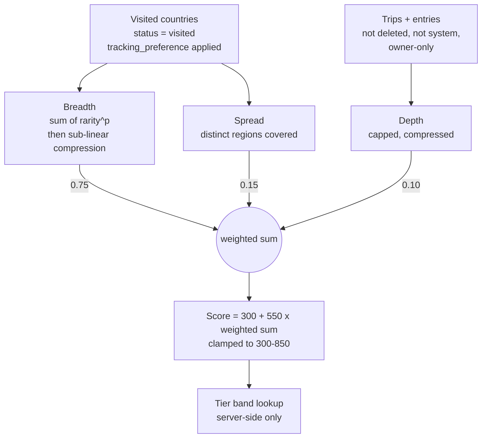
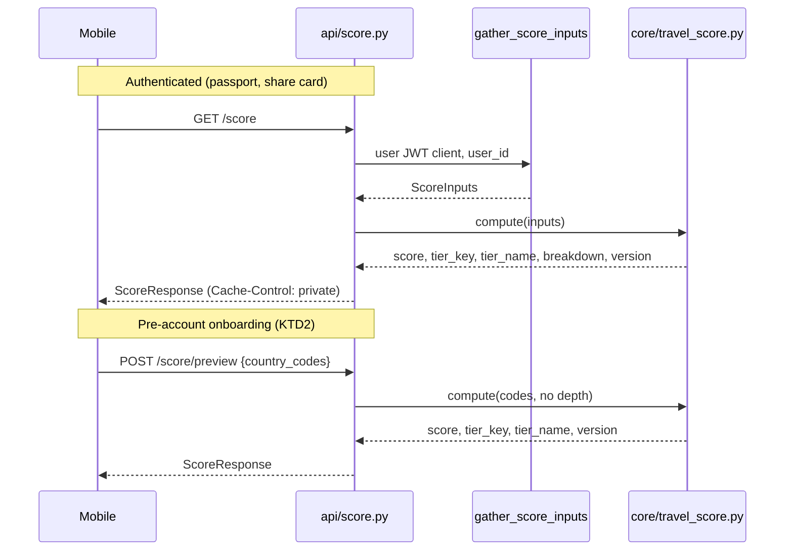

# Travel Score - Plan

## Goal Capsule

- **Objective:** Ship one authoritative, versioned Travel Score (300–850) per user, derived from visited countries weighted convexly by rarity, rendered on the passport screen, exportable as a share card, published at an opt-in public URL with a score-bearing preview image, and explained in a public methodology post.
- **Authority hierarchy:** This plan > repo conventions in `CLAUDE.md` > implementer judgment.
- **Execution profile:** Backend-first. The scoring function is a pure, test-first unit with golden values; every surface reads from it. No surface computes its own score. Calibration (U11) lands before any user-facing surface.
- **Prerequisite:** U1 and U16 ship as their own PR, merged and applied, before any other unit begins. U1 repairs a live production hazard whose severity is independent of this feature.
- **Stop conditions:** Stop and surface if (a) migration `0057_persistent_place_cache.sql` is unapplied, (b) the live rarity distribution is flat at 5, meaning the seed has already been re-run, or (c) calibration cannot meet the R34 discrimination targets without changing the model shape.
- **Tail ownership:** The implementer owns branch, tests, and PR. Tier icon art is an external dependency owned by Emerson and gates U14 only.

---

## Product Contract

### Summary

Introduce a single Travel Score (300–850) plus a tier name, computed server-side from visited countries weighted convexly by per-country rarity, with trips and entries as a light modifier. Replace the existing country-count tier ladder, remove the unsourced traveler percentile, and repair the reference-data hazards the scoring model would otherwise inherit. Deliver the score to the passport screen, a share image, an opt-in public page with a generated preview image, and a methodology post.

### Problem Frame

Border Badge already computes travel-status signals, but they are scattered and partly indefensible. Per-country rarity exists twice — `country.rarity_score` in Postgres and `COUNTRY_RARITY` in `mobile/src/constants/countryRarity.ts`. The two are currently identical, but nothing guards them, and the seed file can silently reset the database copy. Tier names live only on the client in `mobile/src/utils/travelTier.ts`. A traveler percentile ships on exported share cards and on the onboarding progress summary from `estimateTravelerPercentile`, a hardcoded step function with no source behind it.

The existing tier ladder is badly distributed against the app's own users. Its thresholds are 5, 15, 30, 50, 80, 120, 160, and above, so nearly every user sits in the bottom two bands while the top five are unreachable, and nobody experiences movement. Pew Research (ATP Wave 124, December 2023, n=3,576) reports roughly 89% of Americans have visited fewer than ten countries — useful external context, but a US general-population figure, not a measurement of this user base. U16 measures the real in-app distribution before the bands are cut.

Underneath sits a live hazard. `supabase/seed/countries.sql` opens with `TRUNCATE TABLE country CASCADE`, and both `user_countries` and `trip` hold foreign keys to `country`. `TRUNCATE ... CASCADE` truncates dependent tables regardless of their `ON DELETE` action, so running that seed against production destroys user travel data and chains into `entry`, `place`, `media_files`, and `trip_tags`. The insert omits `id`, so a re-run mints fresh UUIDs and invalidates every stored `country_id`. The rarity data is also incomplete: six seeded countries (`BL`, `DZ`, `GI`, `GP`, `IM`, `MQ`) carry no explicit assignment and inherit `DEFAULT 5`, while twelve codes named in `0021_add_rarity_scores.sql` (`BQ`, `CW`, `GS`, `MP`, `NC`, `NU`, `PN`, `SH`, `SJ`, `SX`, `TK`, `WF`) match no `country` row and have always been silent no-ops.

A single score fixes the visible problems at once — provided it discriminates. That is the load-bearing design constraint, and R34 states it as a testable target rather than an aspiration.

### Requirements

**Scoring model**

- R1. The score is an integer in the range 300–850 inclusive, matching the FICO range so the credit-score framing is legible without explanation.
- R2. Visited countries weighted convexly by `country.rarity_score` dominate the score; trips and entries contribute a light, capped modifier.
- R3. The score uses sub-linear compression of accumulated weighted rarity so early countries move the number materially and later countries move it less.
- R4. Only `user_countries.status = 'visited'` contributes. Wishlist rows never affect the score.
- R5. The depth modifier counts only trips and entries that are not soft-deleted, not on a system trip, and owned by the user rather than visible through an approved tag.
- R6. When a user's `tracking_preference` narrows the recognized country set, both the score and its denominator are computed over that narrowed set, so the score and the visible stamped count agree.
- R7. Every score response carries the model version that produced it.
- R8. A user with zero visited countries and zero qualifying depth receives exactly the floor score, without error.
- R9. The authenticated path, the public path, and the pre-account preview path all compute through one shared implementation, so no two surfaces can disagree.
- R34. The model meets stated discrimination targets, verified by test: at equal country count a high-rarity set scores materially above a common set; the median non-test user lands near the middle of the range; and one additional visited country moves a median user by at least a stated minimum.
- R35. The denominator and the rarity checksum are frozen versioned constants, not derived from the live table per request, so adding a country is additive rather than silently lowering every existing user's score.
- R36. Retired model versions stay computable. The scoring module holds an additive registry of versioned constant sets; a retune adds a version rather than replacing one.

**Tiers**

- R10. Tier is a function of the score, not of the country count.
- R11. Tier bands are unequal in width and distributed so the majority of real users can move between tiers, with the top band genuinely rare.
- R12. The server owns the tier vocabulary and returns a stable tier key and display name. The client maps the tier key to local presentation assets and never derives band membership.
- R42. Every surface publishing a tier names the reference population the bands were calibrated against — Border Badge users at the stated model version, not a general population.

**Surfaces**

- R13. The passport screen shows the score, tier, and a component-level breakdown using user-facing labels.
- R14. The score is exportable as a share image through the existing share-card system, and the exported image carries the model version so a screenshot stays self-identifying after a retune.
- R15. A user can publish their score to a public URL and revoke it afterward, through an in-app flow.
- R16. The public score page's preview image renders the actual score and tier.
- R17. The scoring methodology is published as a blog post stating the model version, the full per-country rarity assignments, the weighting, the band cutoffs with their reference population, and the known limitations.
- R37. The pre-account onboarding surface shows a score and tier computed server-side from submitted country codes with no depth component, carrying the model version. Onboarding always advances: if the request fails, the score and tier are hidden rather than shown as a placeholder value.
- R38. The passport surface shows the distance to the next tier and that tier's name.
- R39. Every score-bearing artifact carries Border Badge attribution and one acquisition affordance. These are fixed server-side additions, not user data, and are therefore outside R20's allowlist restriction.
- R40. Publish, revoke, and share-export actions emit analytics events, so the growth premise has an observable signal.

**Public exposure and privacy**

- R18. The public score page and its preview image are `noindex, noarchive` — via a meta tag on the page and an `X-Robots-Tag` header on both — and are excluded from `sitemap.xml`. `robots.txt` must not disallow the route; Facebook, Slack, and LinkedIn honor it, and disallowing would kill the shared preview.
- R19. The score slug is generated with a cryptographic random source at no fewer than 128 bits and is not derived from any user attribute. Republishing after revocation mints a new slug.
- R20. The public page and preview image expose only score, tier, confirmed display name, total visited-country count, model version, and the R39 attribution. The visited-country list, per-country stamps or maps, avatars or any profile image, `home_country_code`, trip names, dates, photos, and any recency or current-location signal are forbidden on both surfaces.
- R41. The component breakdown is authenticated-only. The public page and preview image render no per-component value, because the published weights make a depth component invertible into a user's trip volume and a spread component into their region coverage.
- R21. Publishing requires an explicit confirmation showing the exact display name that will become public, with the option to change it first. The server enforces this: the publish request echoes the display name the client showed, and a mismatch or omission is rejected. `handle_new_user()` defaults `display_name` to the email local-part, so an unenforced confirmation leaks an email prefix.
- R22. Publishing adds no anon-readable RLS policy to `user_profile`. Public reads go through the service-role client with an explicit column allowlist.
- R23. Revocation and account deletion return 404 with `Cache-Control: no-store`, and take effect immediately — no server-side cache may serve a revoked score. Public responses cap at `max-age=300` with no `s-maxage` and no `immutable`. The revoke UI discloses that already-shared links and social previews may persist in third-party caches.
- R24. The preview image route renders from fixed server-side constants, fetches no remote images, and carries a rate limit stricter than the page route.
- R25. The privacy policy documents public score pages, what they expose, and how to revoke them.

**Reference-data integrity**

- R26. `supabase/seed/countries.sql` is idempotent and non-destructive: no `TRUNCATE`, upsert keyed on `code`, never assigns or reassigns `country.id`, and carries `rarity_score` in the same upsert.
- R27. No reference-data operation deletes or truncates rows in `user_countries`, `trip`, or `entry`. Any retained reset path aborts when dependent user rows exist.
- R28. `country.rarity_score` loses its silent `DEFAULT 5` and gains a validity range constraint, so an insert without a rarity value errors rather than scoring plausibly.
- R43. Every `country` row carries an explicit rarity value before the default is dropped. Codes named in `0021_add_rarity_scores.sql` that match no `country` row are reported rather than silently ignored.
- R29. The model version incorporates a checksum over the rarity table, so a rarity edit without a version bump fails CI.
- R30. Each new migration is metadata-only where possible and idempotent under re-application, and asserts its prerequisite migration's objects exist before making changes.
- R31. Aggregates that read across users exclude profiles where `is_test = true`. Single-user reads do not apply this filter.

**Integrity of published claims**

- R32. The app publishes no traveler percentile until a sourced one exists. `estimateTravelerPercentile` and both of its render sites are removed.
- R33. Published numbers are traceable to shipped constants. The methodology post's model version, weights, rarity assignments, and band cutoffs are asserted against the scoring module by test, not by prose.

### Key Decisions

- Countries and rarity carry the score; trips and entries are a light modifier (session-settled: user-approved — chosen over weighting logged trip and entry depth heavily: new users have few logged entries, and a depth-heavy score reads as broken on day one). Governs R2, R5.
- The unsourced traveler percentile is removed rather than kept or recalibrated (session-settled: user-directed — chosen over leaving it live or recalibrating it to Pew now: publishing a methodology post about rigor while shipping an unsourced percentile on share cards is the first contradiction a critic finds). Governs R32.
- National score baselines are a follow-up research track, not a launch dependency (session-settled: user-directed — chosen over shipping a percentile at launch: the score itself is the product). Governs R1, R13.
- Both the share image and the public score page ship in this plan (session-settled: user-directed — chosen over an image-only v1: accepts the slug migration and preview-image work in exchange for a linkable artifact). Governs R14, R15, R16.
- Tier icons are custom art supplied by Emerson rather than reused Ionicons (session-settled: user-directed — chosen over remapping the eight existing Ionicons: the tier ladder is the identity of the feature and `CLAUDE.md` requires custom iconography to be approved). Governs R12; gates U14 only.

### Scope Boundaries

#### Deferred to Follow-Up Work

- **National score baselines.** Estimate a typical score per country from Pew ATP Wave 124's 24-country buckets plus further obtainable survey data; ship only where the data supports it, labelled an estimate.
- **Leaderboards and friend comparison.** Requires cross-user reads and a consent model that does not exist.
- **Score history and deltas over time.** Requires persisting scores. R38's distance-to-next-tier delivers the movement signal without history.
- **A migration ledger table.** The repo has no record of which migrations were applied. R30's pre-flight assertion works around it.
- **Unifying `COUNTRY_RARITY` into the countries API and mobile SQLite.** U1 adds a consistency guard instead.

#### Outside this product's identity

- Verification of claimed countries. Border Badge is self-reported by design, and the methodology post says so.
- Ranking users against each other inside the app. The score compares a person to a published model.

### Outstanding Questions

- **Indexability is a product decision (deferred, not blocking).** R18 defaults to `noindex` and sitemap exclusion, because a sitemap of score pages is a machine-readable roster of the user base and search caches make revocation cosmetic. That forfeits SEO from score pages; the methodology post carries that goal instead. Reversing it requires a separate opt-in and a privacy-policy change, and is not an implementer's call.
- **What publish rate would make this feature a success (deferred).** R40 instruments the actions; no target is set. Every stop condition in this plan is technical, so there is currently no defined outcome that would justify reversing the public-surface investment.

### Sources

- `supabase/seed/countries.sql:17` — `TRUNCATE TABLE country CASCADE`, with an insert that omits `id`.
- `supabase/migrations/0001_init_schema.sql:62,74` — `user_countries.country_id` (`ON DELETE CASCADE`) and `trip.country_id` (`ON DELETE RESTRICT`) both reference `country`.
- `supabase/migrations/0021_add_rarity_scores.sql` — the 1–10 scale, 233 assignments, of which 12 match no `country` row.
- `mobile/src/constants/trackingPreferences.ts` — the preset-to-recognition-type mapping that exists only on the client.
- `backend/app/core/thumbnails.py` and `backend/requirements.txt` — Pillow 11.3.0 already pinned and running in production.
- `backend/tests/test_blog_content.py` — the blog gates a new post must satisfy.
- Pew Research Center, ATP Wave 124 (6 Dec 2023), n=3,576 — US distribution of countries visited. External context only; the "average American has visited 4 countries" claim has no traceable primary source and must not be cited.
- FICO score ranges and version history — precedent for unequal-width bands at meaningful thresholds, and for keeping retired versions computable rather than retiring them.
- NomadMania published component weights — precedent for declaring weights as editorial judgment.

---

## Planning Contract

### Key Technical Decisions

- KTD1. **One scoring implementation and one input-gathering function.** Pure scoring lives in `backend/app/core/travel_score.py` with no I/O, mirroring the `core/share_view.py` + `api/public.py` split. Inputs come from a single shared gatherer used by every path, with soft-delete, system-trip, and owner-only filters expressed explicitly in the query rather than inherited from RLS. Without it the paths diverge silently: the authenticated route reads under the user's JWT where RLS legitimately returns approved-tag trips, while the public route reads under service role where it does not, and unit tests of the pure core cannot catch the difference. (session-settled: user-approved — chosen over duplicating the formula client-side: the two rarity sources are identical today but wholly unguarded, and a client formula copy would be a second unguarded mirror.) Governs R1, R2, R3, R9.
- KTD2. **Onboarding scores through a preview endpoint, not a client formula.** `ProgressSummaryScreen` runs before `AccountCreationScreen`, so there is no session and no server-side `user_countries` row. Follow the `backend/app/api/classification.py` precedent: accept country codes in the request body under `OptionalUser`. Governs R9, R37.
- KTD3. **Compute on read; cache the computation, never the slug resolution.** The score is not persisted. The public page and preview image are crawler-facing with no CDN in front, so they wrap the computation in a process-local TTL cache — but the slug-to-user resolution is looked up uncached on every request, so a revoked slug 404s immediately rather than serving from cache for the TTL. Cache keys are the full rendered tuple, never score alone: two users sharing a score must never share a cached artifact. Governs R23.
- KTD4. **The model version is in the payload from day one, covers the rarity table, and never retires.** The version is composite: formula constants plus a checksum over the rarity assignments. Retired versions stay in an additive registry so a v1 share card in someone's camera roll names a model that still exists in code and the methodology post's v1 section keeps a live counterpart. Governs R7, R29, R36.
- KTD5. **The server owns the tier vocabulary; the client owns the glyph.** The response carries a stable tier key and display name. `mobile/src/utils/travelTier.ts` becomes a tier-key-to-asset map with a neutral fallback, and its band thresholds are deleted. There is no React Query persistence in `mobile/src`, so a mirrored band table has no offline consumer, and a shipped binary cannot be redeployed in lockstep with a retuned server. Governs R10, R11, R12.
- KTD6. **Rarity stays a hand-curated tier scale, re-validated for cardinal use.** Arrivals data is not comparable across countries — reporting bases differ, arrivals count trips not people, microstates distort per-capita normalization, and non-reporting countries would score as maximally rare by accident. But the existing values were authored to *rank* countries within one user's set, and the score *sums* them, which is a different job. U16 validates them against the R34 discrimination targets before U2 depends on them. Governs R2, R34.
- KTD7. **Preview images via Pillow, already in production.** `pillow==11.3.0` is pinned in `backend/requirements.txt` and runs today in `backend/app/core/thumbnails.py`, so this is not a new dependency and carries no Railway risk. The only new deploy artifact is the committed font file. Governs R16.
- KTD8. **Public score pages are opt-in, opaque, and revocable.** No page exists until the user publishes. The slug is cryptographically random rather than name-derived — the `generate_trip_share_slug` pattern builds a name-derived basename with a 32-bit suffix, which would put a real name in a public URL, correlate the score page with the user's trip pages, and collide more often than trip names because many users share a display name. Governs R15, R19.
- KTD9. **The seed is repaired before the model depends on it.** `supabase/seed/countries.sql` is rewritten as a non-destructive upsert keyed on `code`. Folding rarity into a still-truncating seed was rejected: it would make a catastrophic operation look safe. The hazard is user-data destruction, not rarity loss. Governs R26, R27.
- KTD10. **Convex rarity weighting.** Each country contributes `rarity ** p` rather than `rarity` itself. Linear summing fails the feature's central claim: with linear weights a 23-country Western Europe run and an 11-country rare-destination run score within a few points of each other, so rarity does nothing the country count does not already do. Convex weighting is what makes "eleven weird ones beat twenty-three easy ones" true. Governs R2, R34.

### High-Level Technical Design

**Score composition.** Three components, weighted so countries and rarity dominate.

Directional guidance, not implementation specification. Each visited country contributes `rarity ** p` with `p` starting at `2`. `RawBreadth` is the sum of those weights; the denominator is the same sum over the recognized set, **frozen as a versioned constant** per R35. Breadth normalizes as `(RawBreadth / Denominator) ** k` with `k` starting at `0.25`. Spread is distinct regions covered over total regions. Depth is a compressed, capped function of qualifying trip and entry counts.

`p` and `k` are the calibration knobs in U11; the component weights are not. The starting values are not arbitrary — they were checked against the shipped rarity table and satisfy R34's central target:

| Itinerary | Score |
|---|---|
| 1 common country | 378 |
| 5 common countries | 417 |
| 23-country Western Europe run | 482 |
| 11 rare countries | 513 |

Under linear weighting those last two land at 478 and 510 — effectively tied, which is the failure mode R34 exists to prevent.

**Request paths.** All three gather through one function per KTD1.

**Public surface.** `GET /s/{slug}` renders under the strict default CSP — `SHARE_ROUTE_PREFIXES` in `backend/app/main.py` covers only `/l/` and `/t/`, so inline `style=` attributes are impossible and per-value colors must be CSS classes. `GET /s/{slug}/og.png` renders through Pillow. Both resolve the slug uncached, then read through the KTD3 cache, and both serve `noindex` per R18.

### Assumptions

- Migration `0057_persistent_place_cache.sql` is applied, or is applied before `0058`. Project memory records it as possibly unapplied, and migrations are applied by hand through the Supabase dashboard.
- The live `country.rarity_score` values match `0021`. U1 verifies this; a flat distribution at 5 is a stop condition.
- Tier icon art will be supplied. Every surface ships with the U4 fallback until U14 lands.

### Sequencing

**PR 1 (prerequisite):** U1, U16 — reference-data repair, rarity validation, and the `is_test` sitemap fix. Merged and applied before anything else begins.

**PR 2 (score core and app surfaces):** U2 → U3 → U11 → U5 → U4 → U6 → U7.

**PR 3 (public surfaces):** U8 → U9 → U10 → U15 → U13, then U12 last. A blocker in Pillow, the migration, or CSP work cannot hold up the in-app score.

U14 lands whenever art arrives.

---

## System-Wide Impact

**Caching, three layers.** HTTP: `GET /score` is per-user and must be `private` — `public` on an authenticated endpoint authorizes any shared cache to serve one user's score to another. The public routes are `public` with a modest `max-age`, a strong opaque ETag over the full rendered tuple, and real `If-None-Match` handling. Process-local: the public routes cache computed scores and rendered bytes keyed on user id, tier, display name, and model version — never on score alone, and never wrapping the slug lookup. React Query: the score is keyed on session id at `STALE_TIMES.PROFILE`, and country, trip, and entry mutations must all invalidate it. *If handled wrong:* one user's card renders another user's name, a revoked page keeps serving, or the passport card goes stale immediately after the action the feature is judged on.

**Auth boundary.** Public routes read with the service-role client and bypass RLS; the authenticated route reads under the user's JWT. Both go through the KTD1 gatherer with filters stated explicitly. *If handled wrong:* the public page shows a different score than the app, and the methodology post is false on one surface.

**Published-artifact coupling.** The blog post, the preview image, exported share cards, and the mobile binary all encode model output that outlives the deploy producing it. The version registry (R36) keeps every published number reconcilable. *If handled wrong:* a retune changes numbers users already shared with nothing to reconcile them against, and the U12 parity test fails on an unrelated change.

**Reference data.** The model reads a table one existing script can destroy along with all user travel data, and whose values were authored for a different purpose. *If handled wrong:* the feature's foundation disappears, or the score fails to discriminate and the published methodology is indefensible.

**Public surface inventory.** The `/s/` prefix sits under the strict default CSP, needs rate limits, needs `robots.txt` and sitemap handling, must not inherit `view_public_trip`'s uncapped serial redirect loop, and renders a user-controlled `display_name` into HTML, OG attributes, JSON-LD, and a PNG.

---

## Implementation Units

| U-ID | Title | Key files | Depends on |
|---|---|---|---|
| U1 | Repair the seed; guard and complete rarity | `supabase/seed/countries.sql`, `supabase/migrations/0058_rarity_integrity.sql` | — |
| U16 | Validate rarity for cardinal use | `backend/scripts/rarity_report.py` | U1 |
| U2 | Core scoring function | `backend/app/core/travel_score.py` | U16 |
| U3 | Score inputs + API endpoints | `backend/app/api/score.py`, `backend/app/core/score_inputs.py` | U2 |
| U11 | Calibrate against real data | `backend/app/core/travel_score.py` | U3 |
| U5 | Remove unsourced percentile | `mobile/src/constants/countryRarity.ts` | — |
| U4 | Retire the client band table | `mobile/src/utils/travelTier.ts` | U3, U5 |
| U6 | Score hooks + passport card | `mobile/src/hooks/useTravelScore.ts`, `TravelStatusCard.tsx` | U4, U11 |
| U7 | Score share-card variant | `mobile/src/components/share/variants/ScoreVariant.tsx` | U6 |
| U8 | Public score slug: schema + minting | `supabase/migrations/0059_add_score_share_slug.sql` | U3 |
| U9 | Public score page | `backend/app/api/public.py`, `templates/score.html` | U8 |
| U10 | Preview image | `backend/app/core/score_image.py` | U9 |
| U15 | Mobile publish and revoke flow | `mobile/src/screens/score/` | U8 |
| U13 | Robots and sitemap for `/s/` | `backend/app/api/public.py` | U9 |
| U14 | Tier icon assets | `mobile/src/utils/travelTier.ts`, asset files | U4 |
| U12 | Methodology blog post | `backend/app/content/blog/how-the-travel-score-works.md` | U11, U9 |

Rows are in recommended execution order; U-IDs are stable and never renumbered.

### U1. Repair the seed; guard and complete rarity

**Goal:** Make reference-data operations non-destructive, give every country an explicit rarity, and make the applied state verifiable.

**Requirements:** R26, R27, R28, R43, R31

**Dependencies:** none

**Files:**
- `supabase/seed/countries.sql` (rewrite as non-destructive upsert carrying `rarity_score`)
- `supabase/migrations/0058_rarity_integrity.sql` (create — backfill the six unassigned codes, drop `DEFAULT 5`, add the range constraint)
- `backend/tests/test_rarity_consistency.py` (create — static, credential-free)
- `backend/scripts/rarity_check.py` (create — operator script reading the live table)
- `backend/app/api/public.py` (sitemap `is_test` filter)
- `mobile/src/constants/countryRarity.ts` (annotate as a mirror)

**Approach:**
1. Rewrite the seed as an idempotent upsert keyed on `code` that never assigns or reassigns `id` and carries `rarity_score` in the same statement. Remove `TRUNCATE` entirely per KTD9.
2. Backfill explicit rarity for the six seeded codes with no assignment — `BL`, `DZ`, `GI`, `GP`, `IM`, `MQ` — **before** dropping `DEFAULT 5`, then drop the default and add a range constraint per R28.
3. Report, do not silently ignore, the twelve codes in `0021` matching no `country` row (`BQ`, `CW`, `GS`, `MP`, `NC`, `NU`, `PN`, `SH`, `SJ`, `SX`, `TK`, `WF`). Decide per code whether it should exist in `country` or be dropped from the rarity source.
4. **Split verification by credential need.** The static parity test compares the rewritten seed, `COUNTRY_RARITY`, and the committed checksum constant — no database, runs in CI, following `backend/tests/test_limits_consistency.py`. A separate operator script reads the live table using env-supplied credentials and is run by hand. Do not put a service-role key into CI: it bypasses every RLS policy in the product.
5. Fix the pre-existing sitemap leak here rather than in U13 — `sitemap_xml` enumerates every list and non-null-slug trip with no `is_test` filter, so seed accounts reach Google today, and that fix should not wait on the score feature. There is no foreign key between the content tables and `user_profile`, so PostgREST cannot embed the filter; use the two-query shape from `_fetch_share_author` — read test-account user ids once, then exclude them in Python.

**Execution note:** Run the operator script against the live database before anything else. A flat rarity distribution at 5 means the seed has already been re-run; that is a stop condition, and rarity must be restored before U16 or U2 mean anything.

**Test scenarios:**
- Running the revised seed twice against a database holding user data leaves `user_countries`, `trip`, and `entry` counts unchanged and the `code`-to-`id` mapping identical.
- All 227 rows carry an explicit rarity after the backfill; none relies on a default.
- Inserting a country without a rarity value raises.
- A rarity value outside the valid range is rejected.
- The twelve non-matching `0021` codes are reported by name.
- `COUNTRY_RARITY` and the seed agree on every code; a hand-edited value in either fails.
- The checksum matches the committed constant.
- The static parity test passes with no database credentials available.
- `sitemap.xml` excludes lists and trips belonging to `is_test = true` profiles; a normal user's still appear.

**Verification:** `poetry run pytest tests/test_rarity_consistency.py` passes with no DB credentials; the operator script reports a distribution matching `0021`.

### U16. Validate rarity for cardinal use

**Goal:** Establish that the rarity values can carry a summed, published weight, and measure the real user distribution the bands will be cut against.

**Requirements:** R34, R2

**Dependencies:** U1

**Files:**
- `backend/scripts/rarity_report.py` (create — operator script)
- `docs/travel-score-calibration.md` (create — the recorded measurement)

**Approach:**
1. Measure the actual distribution of visited-country counts across non-test users. The Problem Frame's claim about band distribution currently rests on a US general-population survey; this replaces it with a measurement of the people who will actually see scores.
2. Evaluate the rarity values against the R34 discrimination target using representative itineraries drawn from real user data — a common-destination set and a rare-destination set at equal country count. Confirm the convex weighting separates them.
3. Where values fail to discriminate, propose revisions to specific countries with a recorded rationale. This is the provenance U12 publishes.
4. Record the measurement in `docs/travel-score-calibration.md`. U11 and U12 both read from it.

**Execution note:** This is measurement and judgment, not implementation. It gates U2 because U2's golden values encode assumptions about what the rarity table can do.

**Test scenarios:** `Test expectation: none — this unit produces a measurement document and optional data revisions, not behavior.` Any rarity value changed here is covered by U1's existing parity and checksum tests.

**Verification:** `docs/travel-score-calibration.md` exists, states the measured user distribution, and shows the rare-versus-common separation at equal country count.

### U2. Core scoring function

**Goal:** A pure, deterministic, versioned scoring function that every surface calls.

**Requirements:** R1, R2, R3, R4, R5, R6, R8, R29, R35, R36

**Dependencies:** U16

**Files:**
- `backend/app/core/travel_score.py` (create)
- `backend/tests/test_travel_score.py` (create)

**Approach:**
1. One entry point taking the visited set with rarity values, region membership, and depth counts; returning score, tier key, tier name, per-component breakdown, and model version.
2. Implement convex weighting per KTD10 and the compression in the High-Level Technical Design. Keep `p`, `k`, the depth cap, and the band cutoffs as named constants so U11 can calibrate without touching the component weights.
3. Freeze the denominator as a versioned constant per R35 rather than summing the live table, so adding a country is additive.
4. Structure constants as an additive version registry per R36: a retune adds an entry, never replaces one, and every retired version stays computable.
5. Own the tier band table here per KTD5.
6. No I/O. Callers supply fetched data. Clamp to 300–850 last.

**Patterns to follow:** `backend/app/core/share_view.py` for a pure core module. `backend/app/api/classification.py` for existing rarity-based derivation.

**Execution note:** Implement test-first with golden values. Pin the R34 discrimination case as a test before writing the implementation — it is the requirement most likely to be lost during tuning.

**Test scenarios:**
- Zero visited countries **and zero depth** returns exactly 300.
- Zero visited countries with non-zero qualifying depth returns a pinned value above 300.
- The full recognized set **with depth at its cap** returns exactly 850.
- The full recognized set with zero depth returns the pinned breadth-plus-spread value, so the depth share of the range is asserted rather than assumed.
- Eleven high-rarity countries score above twenty-three common ones — the R34 target.
- Adding one country to a median-sized set moves the score by at least the R34 minimum.
- Wishlist-status countries passed in are ignored.
- A narrowed `tracking_preference` set narrows the denominator too, so the score is not depressed against a 227-country baseline.
- Every score from 300 to 850 maps to exactly one tier; boundary values pinned.
- Deterministic across input ordering.
- The model version changes when the rarity checksum changes; a retired version stays computable from the registry.

**Verification:** `poetry run pytest tests/test_travel_score.py` passes with golden values derived independently of the implementation.

### U3. Score inputs and API endpoints

**Goal:** Gather inputs once; serve the score to authenticated users and to pre-account onboarding.

**Requirements:** R1, R5, R6, R7, R8, R9, R31, R37

**Dependencies:** U2

**Files:**
- `backend/app/core/score_inputs.py` (create)
- `backend/app/core/tracking_presets.py` (create — the ported preset mapping)
- `backend/app/api/score.py` (create)
- `backend/app/schemas/score.py` (create)
- `backend/app/api/__init__.py` (register router)
- `backend/tests/api/test_score.py` (create)
- `backend/tests/test_tracking_presets_parity.py` (create)

**Approach:**
1. Build one `gather_score_inputs` used by every path, with soft-delete, system-trip, and owner-only filters explicit in the query rather than inherited from RLS, per KTD1.
2. **Port the tracking-preference mapping to the backend.** R6 is currently unimplementable server-side: the preset-to-recognition-type lists exist only in `mobile/src/constants/trackingPreferences.ts`, and the backend carries just the bare enum. Filter the `country` read on `country.recognition`, compute the denominator over that same narrowed set, and guard the two copies with a parity test following `backend/tests/test_limits_consistency.py`. `POST /score/preview` uses the full set, since no profile exists yet.
3. `GET /score` under `CurrentUser`, fetching concurrently with `asyncio.gather` per `_fetch_share_author`. Set `Cache-Control: private, max-age=300` — never `public` on a per-user endpoint.
4. `POST /score/preview` under `OptionalUser` per KTD2, with a length cap on the submitted list.
5. Short-circuit the empty-visited-set path before building any filter — `in_list([])` in `backend/app/db/postgrest.py` raises.
6. `@limiter.limit("60/minute")` per repo convention.

**Test scenarios:**
- `GET /score` returns score, tier key, tier name, breakdown, and model version.
- `GET /score` sets `Cache-Control: private` and never `public`.
- Zero visited countries returns the floor without reaching `in_list`.
- Unauthenticated `GET /score` returns 401.
- The service-role and user-token paths produce identical `ScoreInputs` for the same fixture user.
- A user with an approved `trip_tags` row on another user's trip has unchanged depth — RLS legitimately returns that trip under the user's JWT, so the filter must be in the query.
- A soft-deleted trip lowers depth; the system trip contributes nothing; a wishlist-only user scores the floor.
- A `classic` tracking preference narrows both the scored set and the denominator, and the backend preset lists match the mobile constants.
- `is_test` filtering is absent from the single-user read.
- `POST /score/preview` returns a score with no session; an empty list returns the floor; unknown codes are ignored; an oversized list is rejected by the cap.
- `POST /score/preview` cannot return another user's stored score.
- The rate limiter rejects the 61st request in a minute.

**Verification:** `poetry run pytest tests/api/test_score.py tests/test_tracking_presets_parity.py` passes. Patch target is `app.api.score.get_supabase_client`.

### U11. Calibrate against real data

**Goal:** Tune `p`, `k`, the depth cap, and the band cutoffs so the score discriminates and uses its range.

**Requirements:** R3, R11, R31, R34

**Dependencies:** U3

**Files:**
- `backend/app/core/travel_score.py` (add the calibrated version to the registry)
- `backend/tests/test_travel_score.py` (update golden values)
- `docs/travel-score-calibration.md` (record the result)

**Approach:**
1. Compute the score distribution across real non-test users using the U16 measurement.
2. Tune `p`, `k`, the depth cap, and the band cutoffs against **three** targets, not one: no tier holds more than 40% of users; the median user's score falls near the middle of 300–850; and one additional country moves a median user by at least the stated minimum. Tier concentration alone is satisfiable while every user sits in the bottom fifth of the range.
3. Re-confirm the R34 discrimination case survives tuning.
4. Add the calibrated constants as a **new registry version** per R36 rather than overwriting.
5. Record the reference population — these bands are cut against Border Badge users, not a general population, and R42 requires every tier-publishing surface to say so.

**Execution note:** Measurement, not redesign. Change only the named knobs. If the targets cannot be met without changing the model shape, that is a stop condition.

**Test scenarios:**
- Golden values updated; the U2 boundary and discrimination cases still pass.
- Floor and ceiling still return exactly 300 and 850.
- No tier exceeds 40% of the real distribution.
- The median real-user score falls within the stated mid-range window.
- The single-country delta meets the stated minimum at the median.
- Calibration adds a registry version; the prior version stays computable.

**Verification:** `poetry run pytest` passes; `docs/travel-score-calibration.md` records the distribution and the reference population.

### U5. Remove the unsourced percentile

**Goal:** Delete `estimateTravelerPercentile` and both render sites.

**Requirements:** R32

**Dependencies:** none

**Files:**
- `mobile/src/constants/countryRarity.ts` (delete the function)
- `mobile/src/components/share/variants/StatsVariant.tsx` (remove the `TOP n% TRAVELER` badge)
- `mobile/src/screens/onboarding/ProgressSummaryScreen.tsx` (remove the "Top n% traveler" subtitle)
- `mobile/src/__tests__/` (update affected tests)

**Approach:** Remove the function and both call sites together so no caller points at a deleted export. This lands before U4 because both units edit `ProgressSummaryScreen.tsx` and its tests, and removing code first avoids a merge collision inside the tier rewrite.

**Test scenarios:**
- `StatsVariant` renders without the percentile badge and no undefined-value artifacts.
- `ProgressSummaryScreen` renders without the percentile subtitle.
- A repo-wide search for `estimateTravelerPercentile` returns nothing.
- Affected snapshot tests are updated deliberately, not regenerated blindly.

**Verification:** `npm test` and `npx tsc --noEmit` pass.

### U4. Retire the client band table

**Goal:** Make the server the sole owner of the tier vocabulary, and define the fallback presentation.

**Requirements:** R10, R11, R12

**Dependencies:** U3, U5

**Files:**
- `mobile/src/utils/travelTier.ts` (rewrite as a tier-key-to-asset map)
- `mobile/src/components/onboarding/TravelTierBadge.tsx` (consumes `getTravelStatus`)
- `mobile/src/components/share/types.ts` (declares `TravelTier` in `OnboardingShareContext`)
- `mobile/src/components/passport/TravelStatusCard.tsx`
- `mobile/src/hooks/usePassportData.ts` (produces the field only)
- `mobile/src/__tests__/hooks/usePassportData.stats.test.tsx` (imports `getTravelStatus`)
- `mobile/src/__tests__/utils/travelTier.test.ts` (rewrite)

**Approach:**
1. Delete `TRAVEL_STATUS_TIERS` and its thresholds. The module becomes a presentation map from the server's tier key to local assets, with a neutral fallback for an unknown key so an older binary degrades gracefully.
2. **Define the neutral fallback here, once.** It is the shipping state on every surface until U14 lands, and three renderers need it. Specify a single geometric badge built from existing brand tokens — a filled circle in `colors.mossGreen` carrying the tier's initial in Oswald bold on `colors.cloudWhite`, sized to the slot the real art will occupy. U9 reproduces it in CSS and U10 draws it in Pillow at the same proportions, so all three degrade identically and U14 is a drop-in swap.
3. Update every consumer of the deleted API. `TravelTierBadge.tsx`, `share/types.ts`, and the passport stats test all reference it and will fail `npx tsc --noEmit` — a separate CI job that is easy to miss locally.

**Test scenarios:**
- Every tier key the server can return has a client asset entry.
- An unknown tier key renders the neutral fallback rather than crashing or blanking.
- `TravelStatusCard` renders the tier from the score response, not a country count.
- A repo-wide search for the removed threshold API returns nothing.
- `npx tsc --noEmit` passes.

**Verification:** `npm test` and `npx tsc --noEmit` pass.

### U6. Score hooks and passport card

**Goal:** Surface the score, tier, breakdown, and next-tier distance on the passport screen, and supply the onboarding preview.

**Requirements:** R13, R37, R38, R40

**Dependencies:** U4, U11

**Files:**
- `mobile/src/hooks/useTravelScore.ts` (create)
- `mobile/src/hooks/useTravelScorePreview.ts` (create)
- `mobile/src/components/passport/TravelStatusCard.tsx`
- `mobile/src/screens/onboarding/ProgressSummaryScreen.tsx`
- `mobile/src/hooks/useUserCountries.ts`, `useTrips.ts`, `useEntries.ts` (invalidation)
- `mobile/src/__tests__/hooks/useTravelScore.test.tsx` (create)

**Approach:**
1. Authenticated hook keyed on session id at `STALE_TIMES.PROFILE`. Add the score key to the invalidation sets of country, trip, **and** entry mutations — depth comes from trips and entries, so country invalidation alone leaves the card stale after the actions that change it.
2. Preview hook posting onboarding country codes to `/score/preview`. `ProgressSummaryScreen` has no session and cannot use the authenticated hook. Render the stamp grid and Continue affordance immediately with score and tier in a skeleton state; on failure or timeout hide score and tier entirely rather than showing a placeholder. Onboarding always advances (R37).
3. **Resolve the card's competing metaphors.** `TravelStatusCard` today carries a tier name, a stamped/total count, and a world-percentage progress bar. Adding a score plus breakdown would leave two progress metaphors moving at different rates. Remove the world-percentage bar, replace it with position within 300–850, make the score the dominant element with the tier beneath it, and fold the stamped count into the breakdown's Countries row.
4. **Specify the breakdown.** Three labeled rows with user-facing names — "Countries", "Regions", "Trips & entries" — each with a thin proportional bar in `colors.adobeBrick` on a muted track and the contribution in points, ordered by weight. Pin the label strings here; U12 uses the same words.
5. Show distance to the next tier and its name per R38, derived from the current score and the server tier — no persisted history needed.
6. **Pin the floor-state copy** in this unit rather than leaving it to the implementer: a one-line caption framing the score as an opening position plus the next concrete action. This is the state with the widest audience.
7. Use the shared `Text` component so the card inherits the small-screen type scale; on small screens collapse the breakdown to one combined bar with the components as a caption, keeping the score at full size.
8. Emit the analytics event required by R40 on share-export.

**Patterns to follow:** `mobile/src/hooks/useProfile.ts`. React Compiler is enabled — never assign to a ref during render; use `useStableCallback`.

**Test scenarios:**
- The hook returns score, tier, and breakdown from a mocked response.
- Marking a country visited, creating or deleting a trip, and creating or deleting an entry each invalidate the score query.
- The card renders a loading state rather than a zero while pending.
- A cold start with no network renders the error-tolerant empty state — there is no React Query persistence, so nothing is cached.
- A user with zero countries sees the floor score, the lowest tier, and the exact pinned caption copy.
- Distance to next tier is correct at a band boundary and at the top band.
- Onboarding preview: pending renders a skeleton; failure hides score and tier while Continue stays enabled; offline behaves the same.
- The onboarding share card built from a failed preview omits the score rather than showing a placeholder.
- Small-screen layout collapses the breakdown without shrinking the score.
- The card does not call `usePremiumGate` and adds no `GatedFeature` member.

**Verification:** `npm test` passes; the passport screen and onboarding summary behave correctly on device, including airplane mode.

### U7. Score share-card variant

**Goal:** Make the score exportable through the existing share-card system.

**Requirements:** R14, R39, R40

**Dependencies:** U6

**Files:**
- `mobile/src/components/share/variants/ScoreVariant.tsx` (create)
- `mobile/src/components/share/OnboardingShareCard.tsx` (add the `score` case to the variant switch)
- `mobile/src/components/share/types.ts` (extend the `OnboardingShareVariant` union)
- `mobile/src/components/share/OnboardingShareOverlay.tsx` (add to `CARD_VARIANTS` pagination)
- `mobile/src/services/analytics.ts`
- `mobile/src/__tests__/components/ScoreVariant.test.tsx` (create)

**Approach:** Add a variant alongside `StampsVariant`, `StatsVariant`, and `MapVariant`. Registration happens in `OnboardingShareCard.tsx`, which holds the variant switch — `ShareCardOverlay.tsx` renders a `MilestoneContext` and has no switch. Reuse the existing capture path: fixed 375×667 scaled by transform, captured at `{ format: 'png', quality: 0.95, width: 1080, height: 1920, result: 'tmpfile' }`. Always use the `Share` wrapper at `mobile/src/utils/share.ts`, never React Native's directly.

**Layout:** tier art or the U4 fallback as the top-third anchor; the score beneath it in Oswald bold at display size as the single dominant element; the tier name below in Open Sans SemiBold uppercase with letter spacing; the country count as a small labeled stat above the existing logo-and-tagline footer; the model version in the footer at 8pt in `withAlpha(colors.midnightNavy, 0.5)` — present on inspection, invisible at feed scale. Border Badge attribution per R39 is the existing footer.

**Test scenarios:**
- Renders score, tier name, country count, model version, and attribution at the fixed dimensions.
- The longest tier name and a maximum-width score neither overflow nor wrap.
- The floor score renders without artifacts.
- The neutral fallback renders when tier art is absent.
- Capture uses the established options; the result goes to the `Share` wrapper.
- The share analytics event fires once per share and carries no score slug.

**Verification:** `npm test` passes; a captured card is inspected on device at full resolution.

### U8. Public score slug: schema and minting

**Goal:** An opt-in, opaque, revocable public identifier with enforced display-name confirmation.

**Requirements:** R15, R19, R21, R22, R30

**Dependencies:** U3

**Files:**
- `supabase/migrations/0059_add_score_share_slug.sql` (create)
- `backend/app/api/score.py` (publish and revoke routes)
- `backend/app/schemas/score.py`
- `backend/tests/api/test_score_share.py` (create)

**Approach:**
1. Open with a pre-flight assertion that both `0057` and `0058` objects exist, aborting otherwise. There is no migration ledger, and a merged file is not an applied schema.
2. Add a nullable `TEXT` column with **no default** — a default would rewrite the table and pre-mint a public slug for every existing user, violating the opt-in. One partial unique index over non-null slugs. Every statement idempotent; the dashboard paste workflow makes double-application real.
3. **Add no anon-readable SELECT policy on `user_profile`.** The `0008` pattern of `USING (share_slug IS NOT NULL)` applied here would expose the whole row to any anon-key client — including `unsubscribe_token`, a single-factor one-click email opt-out, plus subscription state and `home_country_code`. The public route uses service role and needs no policy.
4. Mint with `secrets.token_urlsafe(16)` (128 bits) per R19, using the atomic `slug is.null`-guarded PATCH from `backend/app/api/trips.py`. On unique-constraint violation, retry with a fresh slug up to a bounded count, then fail with a generic error that does not leak the constraint name.
5. **Enforce R21 server-side.** The publish request body echoes the display name the client showed; the server compares it to the stored `user_profile.display_name` and rejects a mismatch or omission. It never writes the field — name changes go through the existing profile route. Without this the control is client-only, and any older binary or direct call exposes the email-prefix default.
6. Rate-limit the mutating publish and revoke routes.

**Execution note:** Confirm `0057` and `0058` are applied before applying this. Record post-apply verification output in the PR.

**Test scenarios:**
- Applying `0059` twice: the second run is a clean no-op.
- The column is nullable with no default; all existing profiles hold NULL after apply.
- The index is partial over non-null slugs; many NULLs coexist.
- An anon-key select on `user_profile` for a published slug returns zero rows.
- `0059` introduces no new SELECT policy, asserted against the policy catalog.
- The slug is 128-bit random, matches the expected charset and length, and contains no substring of the display name.
- Publishing twice returns the same slug; two concurrent publishes yield exactly one.
- A simulated unique violation retries and produces a distinct slug with no constraint name in the error.
- Publishing with a mismatched or absent echoed display name is rejected; the stored name is never modified.
- Revoking clears the slug; republishing mints a different one.
- A user cannot publish or revoke another user's slug.
- The pre-flight assertion fails cleanly when `0058` is absent.

**Verification:** `poetry run pytest tests/api/test_score_share.py` passes; the migration applies cleanly twice against a schema copy.

### U9. Public score page

**Goal:** Render the score at an opt-in public URL.

**Requirements:** R15, R18, R20, R22, R23, R25, R39, R41, R42

**Dependencies:** U8

**Files:**
- `backend/app/api/public.py` (add `/s/{slug}`)
- `backend/app/templates/score.html` (create)
- `backend/app/static/css/src/pages/score.css` (create)
- `backend/scripts/build-css.js` (register the stylesheet)
- `backend/app/core/seo.py` (score SEO builder)
- `backend/app/templates/privacy.html` (document public score pages per R25)
- `backend/tests/test_public_score_page.py` (create)

**Approach:**
1. Add the route alongside `/l/{slug}` and `/t/{slug}`, reading through the service-role client with an explicit column allowlist. **Resolve the slug uncached on every request**, then read the computed score through the KTD3 cache keyed on user id and model version — caching the slug lookup would keep serving a revoked page for the TTL and silently defeat R23.
2. **Content spec.** Render, in order: tier art or the U4 fallback, the score, the tier name, the confirmed display name, the visited-country count, the R42 reference-population line, Border Badge attribution with a "get your own score" call to action per R39, and a link to the methodology post. **Render no component breakdown** (R41) and **no avatar or profile image of any kind** (R20) — `avatar_url` must not appear in the column allowlist, the view model, or the template context.
3. Serve `noindex, noarchive` via meta tag and `X-Robots-Tag` per R18. Cap `Cache-Control` at `max-age=300` with no `s-maxage` or `immutable`; the 404 path sends `no-store`. Apply a rate limit; this is the most expensive public route and must not be left unlimited.
4. This route falls under the **strict** default CSP. Inline `style=` attributes are impossible because a nonce cannot apply to an attribute, so per-value colors must be CSS classes. Any inline `<style>` or `<script>` carries `nonce="{{ request.state.csp_nonce }}"`, including the JSON-LD block. Add a tripwire test pinning `/s/` to the default CSP, so nobody "fixes" a styling bug by adding it to `SHARE_ROUTE_PREFIXES` and grants `unsafe-eval` to a page rendering user-controlled text.
5. Jinja's HTML autoescape does not make a string JSON-safe. Serialize JSON-LD through a JSON encoder with `<` escaped, or a display name containing a closing script tag breaks out of the block.
6. Scope every CSS rule under a page-level class. `components.css` is shared by all templates and `landing.css` is concatenated after `list.css` with `body.has-hero` rules that already bleed onto public pages. Register `pages/score.css` in `CSS_FILES` **before `responsive.css`, which must stay last**, then build and commit both `styles.css` and `styles.min.css`.
7. Do not copy the uncapped serial per-entry redirect loop from `view_public_trip`.

**Test scenarios:**
- A valid slug renders 200 with the correct score and tier.
- A revoked slug 404s **immediately after revocation with a primed cache**, with `Cache-Control: no-store`.
- An unknown slug and a deleted account both 404.
- An `is_test` profile cannot render a page.
- `/s/` receives the default CSP, not the Maps CSP (tripwire).
- Zero CSP violations in a real browser, nonce present on every inline block including JSON-LD.
- A display name containing a closing script tag renders escaped in HTML, OG attributes, and JSON-LD.
- The response and template context contain no `avatar_url`, no `unsubscribe_token`, no `home_country_code`, no country names or codes, no trip data, and no per-component value.
- The reference-population line and the acquisition call to action are present.
- `Cache-Control` is capped at `max-age=300` with no `s-maxage`.
- Tier assets absent: the page renders the U4 fallback.

**Verification:** `poetry run pytest tests/test_public_score_page.py` passes. Load in a real browser at `http://localhost:<port>` — **never `127.0.0.1`** — and confirm zero CSP violations. There is no JavaScript test harness in `backend/`, so the browser pass is the only gate for client-side behavior.

### U10. Preview image

**Goal:** Make the public page's social preview show the actual score.

**Requirements:** R16, R18, R23, R24, R39

**Dependencies:** U9

**Files:**
- `backend/app/core/score_image.py` (create)
- `backend/app/api/public.py` (add `/s/{slug}/og.png`)
- `backend/app/static/fonts/` (commit the font file)
- `backend/tests/test_score_image.py` (create)

**Approach:**
1. Render a fixed-dimension PNG from score, tier, and confirmed display name per KTD7, including Border Badge attribution per R39 and the U4 fallback proportions when tier art is absent. All dimensions, text, and font sizes come from server constants — **no query parameter may influence output**. Render no component breakdown (R41).
2. **Key the cache and ETag on the full rendered tuple** — user id, score, tier key, display name, model version — never on score and version alone. Two users whose scores collide on the same integer would otherwise be served the same PNG, putting one person's name on another's card in every unfurl, and a conditional request would cement it in scraper caches.
3. Resolve the slug uncached, as U9 does, so a revoked slug 404s before any conditional-request short-circuit.
4. Fetch no remote images. Compositing an avatar would make an unauthenticated route an outbound-fetch and image-decompression sink — and R20 forbids the avatar regardless.
5. Rate-limit stricter than the page route per R24. Load the font once at module import. Truncate the display name to a fixed length and strip control and bidirectional characters before drawing. Serve `X-Robots-Tag: noindex` per R18.
6. **Pillow is already available.** `pillow==11.3.0` is pinned in `backend/requirements.txt` and runs in production via `backend/app/core/thumbnails.py`, so no dependency work is needed. The only new deploy artifact is the committed font file — pick a licence-compatible one and record the licence.

**Test scenarios:**
- Returns a valid PNG with expected dimensions and content type.
- The rendered image contains the score, asserted against a golden image or deterministic hash.
- **Two users with identical scores and different display names receive different bytes and different ETags.**
- The ETag changes when score, tier, display name, or model version changes, including when the change comes from a rarity edit.
- A conditional request with a matching ETag returns 304.
- The ETag is opaque and does not contain the literal score.
- No query parameter alters dimensions, text, or font size.
- Rendering issues zero outbound HTTP requests.
- A 400-character name and a right-to-left name render clipped, not overflowing and not raising.
- A revoked slug, a deleted account, and an `is_test` profile all 404 before any cache or conditional short-circuit.
- Rendering does not depend on a system-installed font.

**Verification:** `poetry run pytest tests/test_score_image.py` passes. Validate the live URL through a social-preview debugger and confirm the score is legible at feed thumbnail size.

### U15. Mobile publish and revoke flow

**Goal:** Give the user a way to reach, share, and revoke the public score page.

**Requirements:** R15, R21, R23, R39, R40

**Dependencies:** U8

**Files:**
- `mobile/src/screens/score/` (publish flow screens)
- `mobile/src/hooks/useScoreShare.ts` (create)
- `mobile/src/components/passport/TravelStatusCard.tsx` (entry point)
- `mobile/src/navigation/types.ts` (route params)
- `mobile/src/services/analytics.ts`
- `mobile/src/__tests__/screens/ScorePublish.test.tsx` (create)

**Approach:**
1. Entry point on the score card leading to a publish sheet.
2. The sheet renders the **exact** `display_name` that will become public, with an inline edit that routes through the existing profile update path, then echoes the confirmed name to the publish endpoint per R21. Without this the user learns their public name is their email prefix after publishing.
3. Published state shows the live URL with copy and share actions.
4. Revoke action carries the R23 disclosure that already-shared links and social previews may persist in third-party caches.
5. Specify loading, in-flight, failure, and already-published states for each action.
6. Emit publish and revoke analytics events per R40.

**Test scenarios:**
- The publish sheet renders the exact stored display name; editing it updates the profile before publishing.
- Publishing returns a URL and moves the UI to the published state.
- Copy and share actions produce the correct URL.
- Revoke returns the UI to the unpublished state and shows the cache-persistence disclosure.
- Republishing after revoking surfaces the new URL, not the old one.
- Network failure on publish leaves the UI unpublished with a retry, not in an indeterminate state.
- An already-published user entering the flow sees the published state, not a second publish prompt.
- Publish and revoke analytics events fire exactly once each.

**Verification:** `npm test` and `npx tsc --noEmit` pass; the flow is exercised end to end on device including revocation.

### U13. Robots and sitemap for `/s/`

**Goal:** Register the new route correctly.

**Requirements:** R18

**Dependencies:** U9

**Files:**
- `backend/app/api/public.py`
- `backend/tests/test_public_score_page.py` (extend)

**Approach:** Exclude `/s/` from `sitemap.xml` entirely per R18 — a sitemap of score pages enumerates the user base. Do **not** add `Disallow: /s/` to `robots.txt`; social preview scrapers honor it and the shared preview would stop working. The `is_test` sitemap leak fix moved to U1, since it is a pre-existing issue that should not wait on this feature.

**Test scenarios:**
- `sitemap.xml` contains no `/s/` URL.
- `robots.txt` contains no `Disallow: /s/`.
- A social preview scraper user-agent can still fetch `/s/{slug}` and its preview image.

**Verification:** `poetry run pytest tests/test_public_score_page.py` passes.

### U14. Tier icon assets

**Goal:** Replace the neutral fallback with supplied tier art.

**Requirements:** R12

**Dependencies:** U4

**Files:**
- `mobile/src/utils/travelTier.ts` (asset map)
- Mobile asset files, public-page assets, and the preview-image asset

**Approach:** Integrate the supplied art against the stable tier keys from U4. **Three renderers consume it** with different requirements — React Native at multiple densities, CSS on the public page, and Pillow compositing in the preview image — so state the required format, dimensions, and count per surface before requesting art. Do not substitute Ionicons or any other icon set; `CLAUDE.md` requires custom iconography to be approved, which is why this unit exists.

**Execution note:** The only unit gated on the external art dependency. Everything else ships with the U4 fallback.

**Test scenarios:**
- Every tier key resolves to a supplied asset on all three surfaces.
- Assets render at the required densities without distortion on the passport card, the share card, the public page, and the preview image.
- A tier key with a missing asset still falls back rather than crashing.

**Verification:** `npm test` passes; every tier is inspected on device and in the rendered preview image.

### U12. Methodology blog post

**Goal:** Publish the scoring methodology as a citable, defensible artifact.

**Requirements:** R17, R33, R42

**Dependencies:** U11, U9

**Files:**
- `backend/app/content/blog/how-the-travel-score-works.md` (create)
- `backend/tests/test_blog_content.py` (extend with a constants-parity test)

**Approach:**
1. Create the post at `backend/app/content/blog/<slug>.md`. The filename stem is the slug. Frontmatter is validated with `extra="forbid"`. Use `category: guides`.
2. **Satisfy the existing content gates**, which `backend/tests/test_blog_content.py` enforces over every post: 3–5 `faqs` entries (question 5–200 chars, answer 20–1200), a `description` of 50–160 characters, a `seo_title` short enough that `"<headline> - Atlasi"` fits 62 characters, at least two body links to sibling `/blog/` posts, no H1 in the body, no placeholder links, and no JSON fence.
3. The renderer escapes raw HTML, so no inline styles or scripts survive. Tables must be markdown; a chart must be a committed image.
4. **Publish the full per-country rarity assignments**, not just the scale. The growth bet is that people argue about the model, and what travelers actually argue about is whether Japan is a 4 and Bhutan a 9. A description of the method with the assignments withheld gives nobody anything to dispute. Generate the table from the same source the R29 checksum covers so it cannot drift.
5. Structure as **versioned sections** so v1 constants remain when v2 lands, matching the R36 registry. The parity test iterates the registry, so every published section keeps a live code counterpart.
6. **Name the reference population** per R42 — the bands are cut against Border Badge users at the stated version, not a general population. Without this the tier names are the same unsourced population claim R32 removed, in a different container.
7. **State the limitations honestly.** Rarity is editorial judgment, not derived measurement — declare it, following NomadMania's precedent, and cite the U16 validation as its provenance. Travel is self-reported and unverified. Guinness retired its "most traveled person" category for lack of an objective standard, which frames a published methodology as the answer to a known unsolved problem rather than a claim of precision.
8. **Do not cite the "average American has visited 4 countries" figure.** It has no traceable primary source and is the easiest claim in the piece to debunk. Cite Pew ATP Wave 124 directly where population context helps, labelled as US general population.
9. **Make no historical-reproducibility claim.** `user_countries` has no `deleted_at`, so un-marking a country is a hard delete and no past score can be reconstructed.
10. Note the future direction: once the user base is large enough, observed visit frequency becomes a better rarity signal than editorial tiers, and the current scale is a cold-start prior.

**Test scenarios:**
- The post parses under strict validation and satisfies every existing gate: FAQ count and lengths, description length, `seo_title` budget, two sibling links, no H1, no placeholder links, no JSON fence.
- Every published constant — model version, weights, `p`, `k`, band cutoffs, and the rarity assignments — is asserted against the scoring module's registry.
- The parity test iterates all registry versions, so a v1 section still validates after v2 lands.
- The reference population is named.
- The post contains no "4 countries" figure and no historical-reproducibility claim.
- Renders in a browser with zero CSP violations.

**Verification:** `poetry run pytest tests/test_blog_content.py` passes; the post is read end to end in a browser.

---

## Verification Contract

| Gate | Command | Applies to |
|---|---|---|
| Backend lint | `cd backend && poetry run ruff check .` | U1–U3, U8–U13, U16 |
| Backend format | `cd backend && poetry run ruff format --check .` | U1–U3, U8–U13, U16 |
| Backend tests | `cd backend && poetry run pytest` | U1–U3, U8–U13 |
| Mobile lint | `cd mobile && npm run lint` | U1, U4–U7, U14, U15 |
| Mobile format | `cd mobile && npm run format:check` | U1, U4–U7, U14, U15 |
| Mobile tests | `cd mobile && npm test` | U4–U7, U14, U15 |
| Type check | `cd mobile && npx tsc --noEmit` | U4–U7, U14, U15 |
| CSS build | `cd backend && node scripts/build-css.js`, then commit both `styles.css` and `styles.min.css` | U9 |
| Migration apply | Apply each new migration twice against a schema copy; record post-apply verification output in the PR | U1, U8 |
| Live rarity check | Run `backend/scripts/rarity_check.py` by hand with env credentials — never in CI | U1 |
| Browser pass | Load `/s/{slug}` and the blog post at `http://localhost:<port>`, confirm zero CSP violations | U9, U12 |
| Social preview | Validate the preview image through a debugger at thumbnail size | U10 |

If `poetry` is not on PATH, fall back to `/Library/Frameworks/Python.framework/Versions/3.12/bin/poetry`.

CI runs backend lint, format, and pytest; mobile lint, format, and test; `npx tsc --noEmit` as a separate job; and SwiftLint. The type-check job is easy to miss locally. No CI job may require database credentials.

---

## Definition of Done

**Global**

- Every gate in the Verification Contract passes.
- `supabase/seed/countries.sql` cannot destroy user data; running it twice against a database with user rows changes nothing.
- Every `country` row carries an explicit rarity; the default is gone; the twelve non-matching `0021` codes are resolved or reported.
- The model meets all three R34 discrimination targets, asserted by test.
- One tier vocabulary exists, owned by the server; the client holds no band thresholds.
- `estimateTravelerPercentile` does not exist anywhere in the repo.
- Every score response carries the model version; retired versions stay computable.
- Migrations `0058` and `0059` are applied to the live database with recorded evidence.
- No anon-readable RLS policy exists on `user_profile`.
- Both compiled CSS files are committed.
- The privacy policy documents public score pages.
- Abandoned experimental code from calibration is removed from the diff.

**Per unit**

- U1: the seed is non-destructive and idempotent; all 227 rows carry explicit rarity; the static parity test runs without credentials; test accounts are out of the sitemap.
- U16: the calibration document records the measured user distribution and the rare-versus-common separation.
- U2: golden values pin floor, ceiling, depth share, and the R34 discrimination case.
- U3: one gatherer serves every path; `Cache-Control` is `private`; the tracking-preference mapping exists server-side with a parity test.
- U11: all three calibration targets met; constants added as a new registry version.
- U5: both render sites clean; the function deleted.
- U4: no band thresholds on the client; the neutral fallback is defined once and reused by three renderers.
- U6: the card updates after country, trip, and entry mutations; onboarding advances on preview failure; floor copy is pinned and asserted.
- U7: the exported card carries the model version and attribution.
- U8: minting is opaque and idempotent; display-name confirmation is enforced server-side; no new RLS policy.
- U9: zero CSP violations; no avatar, no breakdown, no forbidden field; revocation 404s immediately with a primed cache.
- U10: two users with the same score receive different images; 304 on matching ETag; no outbound requests.
- U15: publish, copy, share, and revoke all work on device; the disclosure is present.
- U13: no `/s/` in the sitemap; no `Disallow: /s/` in robots.
- U14: every tier key resolves to supplied art on all three surfaces.
- U12: every published constant asserted against the registry; per-country assignments published; reference population named.

---

## Risks and Dependencies

- **The seed is a live production hazard today.** Independent of this feature, running `supabase/seed/countries.sql` against production truncates `user_countries` and `trip`, chaining into `entry`, `place`, `media_files`, and `trip_tags`. U1 ships as its own PR ahead of everything else.
- **Rarity may already be flat.** If a prior seed run reset `rarity_score` to 5 across the table, every golden value and calibration would be wrong and the blog post would publish incorrect constants. U1's operator check is the detector and a stop condition.
- **The rarity values may not survive U16.** They were authored to rank countries within one user's set, not to be summed and published. If they cannot meet the R34 targets, the scale needs revision before U2 — which is why U16 gates it.
- **Migration `0057` may be unapplied.** `0058` and `0059` both assert their prerequisites, but a failure blocks the chain.
- **Calibration needs production data access.** U11 and U16 both read the live user distribution through operator scripts following the `backend/scripts/backfill_subscriptions.py` precedent. No CI job may carry those credentials.
- **The process-local cache is per-worker.** If Railway runs more than one uvicorn worker, two scrapes of the same slug can land on different workers with different cache ages, so the public page's lag behind the app is wider than a single TTL suggests.
- **Percentile flattery, deferred but not gone.** The user base is self-selected travelers. When national baselines land, most users will rank in the top decile, and a number that flatters nearly everyone stops carrying information.
- **Tier icon art gates U14** and must satisfy three renderers with different format requirements.
- **The preview-image font is an unresolved external input.** No font exists under `backend/app/static/` today, and Pillow requires a licence-compatible file.
- **`tracking_preference` is commented out of onboarding** under the launch simplification, so most users hold the default. R6 still applies, but the path is lightly exercised in production.
