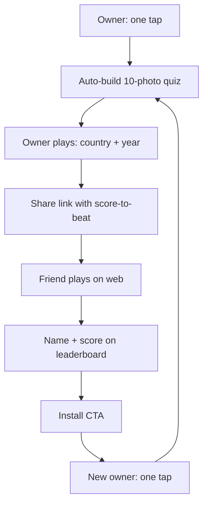
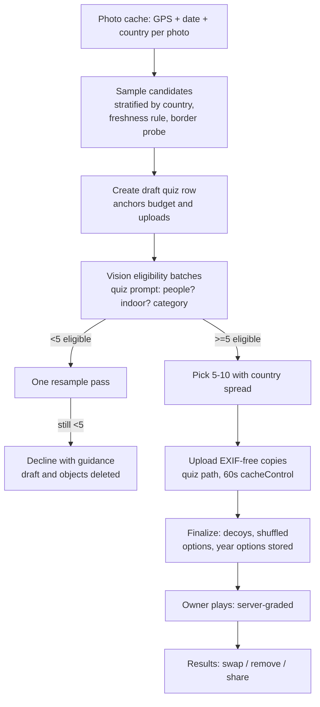
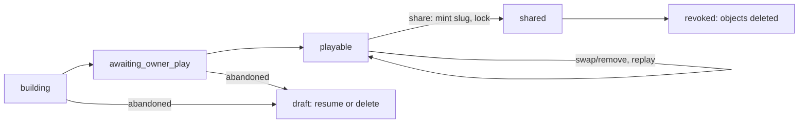
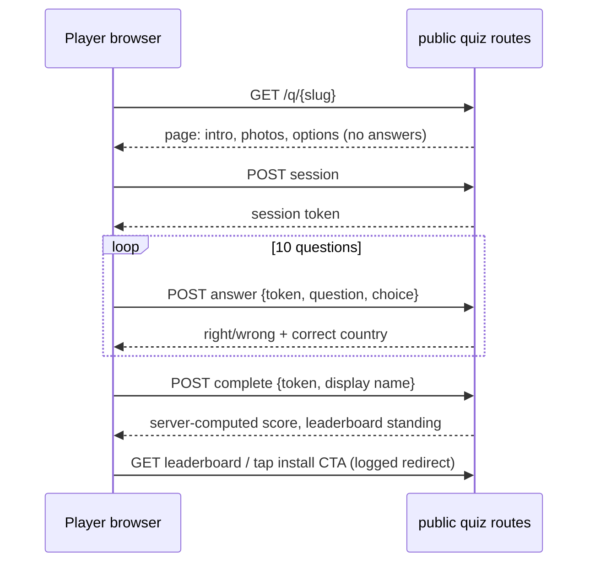

# Travel Photo Quiz - Plan

## Goal Capsule

- **Objective:** Ship the travel photo quiz challenge loop — one-tap, auto-built 10-photo "guess the country" quizzes that the owner plays first and shares as a score-to-beat on a public web page — including repeatable multi-quiz creation, per-quiz leaderboards, and revocation.
- **Product authority:** This Product Contract. Decisions annotated `session-settled` were made by the user during the 2026-08-08 brainstorm dialogue and the 2026-08-09 planning session.
- **Product Contract preservation:** changed — added R17 and its Key Decision (repeatable multi-quiz creation, user-directed 2026-08-09); the GPS-to-country dependency note was corrected against the codebase; the three deferred planning questions are resolved in the Planning Contract (KTD5, KTD6, KTD9). All other requirements and IDs are unchanged.
- **Stop conditions:** If the photo cache cannot supply per-photo country codes on real devices, or the quiz vision prompt cannot reliably reject people/indoor shots in evaluation, stop and surface it — both undermine R2/R3 and the product's publish-unseen posture. A substantive product-scope change beyond this contract goes back to the user, not into the diff.
- **Open blockers:** None.

---

## Product Contract

### Summary

One tap turns a user's camera roll into a 10-photo multiple-choice quiz about which countries the photos were taken in. The owner plays it first, then shares it as a challenge with their score to beat; friends play on a public web page without installing, post their name and score to the quiz's leaderboard, and are pitched to install and make their own. Creation is repeatable — each quiz is independent, with its own photos, link, and leaderboard. The implementation builds on the existing photo-import cache, vision pipeline, and public share-page infrastructure; play is server-graded, and quiz photos are quiz-owned storage copies hard-deleted on revoke.

### Problem Frame

Border Badge is approaching launch with no acquisition loop: the app's photos, trips, and share pages all serve existing users. Quiz links are a proven viral mechanic — the recipient plays without installing, then needs the app to make their own — and GeoGuessr has trained a large audience to enjoy exactly this game. The ingredients (geotagged photos, a vision pipeline, public share-page infrastructure) already exist in the product; what's missing is the game that turns them into a reason to send a link.

### Key Decisions

- **Challenge loop as the single shape.** The owner plays their own quiz first and shares it as a score-to-beat; the friend quiz and self quiz ship as one flow, not two features. (session-settled: user-approved — chosen over separate friend-quiz/self-quiz surfaces and over browser-side recipient creation: one funnel, strongest share message.) Governs R4, R6, F1.
- **Viral acquisition is the goal.** Success is recipients who play and then install to make their own; the sender experience serves the loop. (session-settled: user-approved — chosen over engagement or retention framing.) Governs R12, R16 and Success Criteria.
- **Multiple-choice country guessing.** One tap from four options per photo. (session-settled: user-directed — chosen over pin-drop and tap-the-country map mechanics: one-tap speed and a legible X/10 score.) Governs R10.
- **Fully automatic generation, no review step.** (session-settled: user-directed — chosen over auto-pick-with-review with the publish-unseen tradeoff in view: friction kills the share moment.) Governs R1; R5 is the deliberate soft safety net.
- **Camera roll is the photo source.** (session-settled: user-approved — chosen over trip-photos-only: a fresh installee can build a quiz in a minute, which is what closes the loop.) Governs R1, R7.
- **Classifier-enforced eligibility gate.** Scenery, landmarks, and building exteriors only; no faces, no indoor shots. (session-settled: user-directed.) Governs R2.
- **Owner's score-to-beat is the same country questions players get.** Recognizing the country from a single photo of your own past is genuinely hard — misremembering your own trips is the self-quiz moment — so the owner's score is a fair, real score, not an automatic 10/10. (session-settled: user-directed — chosen over a year-based memory score and a players-only leaderboard.) Governs R4.
- **Name + public leaderboard score loop.** Players post a display name and score visible on the page and to the owner. (session-settled: user-approved — chosen over owner-only visibility and over no post-back: the leaderboard itself drives re-shares.) Governs R11, R12, R14.
- **Fully free.** No `FREE_LIMITS` entry, no premium gate anywhere in the loop. (session-settled: user-approved — metering a viral loop defeats its purpose.) Governs R8.
- **Opaque random slugs, revocable.** Personal photos warrant unguessable URLs, so the quiz does not reuse the name-derived slug pattern used by trip and list shares. Governs R9, R15.
- **Repeatable multi-quiz creation.** Owners can keep making and sharing quizzes; each creation builds an independent quiz with its own photo set, slug, score-to-beat, and leaderboard. (session-settled: user-directed — chosen over a single active quiz per owner: the share loop should be repeatable, not one-shot.) Governs R17.

<!-- ce-section: work-relationships -->
### How This Work Fits Together

This plan owns the travel photo quiz end to end: creation, owner play, the public quiz page, the leaderboard, and loop closure after install. The surrounding items are current understanding, not a committed roadmap.

- Can proceed independently of `docs/plans/2026-08-08-001-feat-travel-score-plan.md` (Travel Score).
  - Shares its share-card variant and server-side preview-image patterns, and its public-page CSP, slug-minting, and robots/sitemap groundwork.
  - Both plans mint Supabase migrations; the score plan reserves `0058`–`0059`. Quiz migrations take the next unused number at implementation time.
  - Privacy postures differ by design: the score page forbids photos and per-country data on public surfaces; the quiz publishes photos deliberately, under its own consent decisions above.
- A future friends/social layer (`instructions/prd/prd-friends-and-social.md`; dormant `enableLeaderboards` flag in `mobile/src/config/features.ts`) may later absorb quiz leaderboards. Still to decide; not scope here.

### Actors

- A1. **Owner** — an authenticated app user who creates quizzes from their camera roll, plays each first, and shares them.
- A2. **Player** — a link recipient on the mobile web, with no account; identified only by a self-chosen display name.

### Requirements

**Quiz creation and owner play (in-app)**

- R1. One tap builds a quiz of 10 eligible camera-roll photos spanning the owner's travels, with as much country spread as the library allows; there is no manual curation step.
- R2. Only geotagged photos classified as scenery, landmark, or building exterior are eligible; photos containing people/faces or indoor scenes are excluded.
- R3. Every quiz photo carries country ground truth resolved from its GPS; a photo without a confident country is ineligible.
- R4. Immediately after generation the owner plays their own quiz: the same 10 country questions players will get, plus one "which year was this?" memory question per photo. The country score seeds the leaderboard as the score-to-beat; the memory score is shown only to the owner.
- R5. On the post-play results screen the owner can swap or remove any photo before sharing.
- R6. Sharing produces a challenge-framed link carrying the owner's score-to-beat, plus a results-card image sized for messages and stories.
- R7. Creation works for a brand-new account with zero trips; photo-library permission is the only prerequisite.
- R8. Creating, sharing, and playing quizzes are unlimited on the free tier.
- R17. Creation is repeatable: each quiz is independent, with its own photo set, slug, score-to-beat, and leaderboard, and repeat creations prefer photos not used in the owner's recent quizzes.

**Public quiz page and score loop (web)**

- R9. A quiz lives at an opaque random, revocable slug and is playable on mobile web with no account or install.
- R10. Play is 10 photos, each a four-option "which country?" multiple choice with plausible decoy countries, immediate right/wrong feedback per photo, and a final X/10 score.
- R11. A player enters a display name; the name and score post to the quiz's leaderboard.
- R12. The player's results view shows their score against the owner's score-to-beat, the leaderboard, and an install call-to-action to make their own quiz.
- R13. The shared link unfurls with a challenge-framed preview image in messaging apps.
- R14. The owner sees each of their quizzes' leaderboards in-app.

**Lifecycle and loop closure**

- R15. The owner can revoke or delete a quiz; the public page and its photos become inaccessible.
- R16. The install call-to-action leads a new user into quiz creation with minimal setup after install.

### Key Flows

- F1. **Create and challenge.** **Trigger:** owner taps create. **Steps:** request photo permission if needed; select eligible candidates; build the 10-photo quiz; owner plays country + year questions; results screen with swap/remove; share sheet with link and results card. **Covers R1–R8.**
- F2. **Play.** **Trigger:** player opens the link. **Steps:** challenge intro naming the owner and score-to-beat; 10 country questions with per-photo feedback; display-name entry; results with leaderboard and install call-to-action. **Covers R9–R13.**
- F3. **Loop closure.** **Trigger:** player taps the install call-to-action. **Steps:** install; onboarding routes toward quiz creation; the new owner builds and shares their own quiz. **Covers R7, R16.**
- F4. **Revoke.** **Trigger:** owner revokes or deletes a quiz. **Steps:** public page and photo URLs stop resolving; leaderboard data is no longer served. **Covers R15.**

### Acceptance Examples

- AE1. **Covers R2.** Given a scenic photo with a recognizable person in frame, when candidates are evaluated, then the photo is excluded.
- AE2. **Covers R1, R7.** Given a camera roll yielding only 6 eligible photos, when the owner creates a quiz, then a 6-photo quiz is built; below 5 eligible photos, creation is declined with an explanation of what's needed.
- AE3. **Covers R4.** Given the owner finishes playing, then the leaderboard shows only their country score; the year/memory result appears only in their own results view.
- AE4. **Covers R11.** Given a player replays the same quiz under the same name, then the leaderboard keeps that name's best score.
- AE5. **Covers R15.** Given a revoked quiz, when its link is visited, then a gone page renders with no photos, names, or scores, and the quiz's photo URLs stop resolving.

### Success Criteria

- The loop funnel is instrumented end to end: quizzes created → shared → first play → players per quiz → install-CTA taps (installs where attribution allows).
- A fresh install can reach a shareable quiz in under ~2 minutes; a player finishes a quiz in under ~1 minute.

### Scope Boundaries

Deferred for later:

- Browser-side quiz creation for recipients — install stays the conversion point.
- Map mechanics (pin drop, tap-the-country, distance scoring) and any "km off" flavor.
- Retention mechanics: push notifications ("your score was beaten"), streaks, weekly or per-trip auto-quizzes.
- Themed or trip-scoped quizzes.
- Integration with the future friends/social leaderboards — quiz leaderboards stay per-quiz and display-name-based.
- Universal links / deferred deep linking and install attribution (KTD10 accepts CTA taps as the funnel proxy).
- Turnstile or CAPTCHA on leaderboard submission — the escalation path if abuse appears, not v1 (KTD9).

### Dependencies / Assumptions

- The current vision classifier emits 8 place-type categories and has no person/face detection and no indoor/outdoor axis (`backend/app/services/photo_vision/constants.py`, verified 2026-08-08). R2's gate requires a quiz-specific classification prompt (KTD3).
- GPS-to-country resolution already exists on mobile: the photo-import cache (`mobile/src/services/photoImport/photoCacheDb.ts`) stores per-photo country codes resolved offline via `@rapideditor/country-coder` (`mobile/src/services/photoImport/countryCoder.ts`, verified 2026-08-09). The remaining R3 work is a border/no-fix exclusion rule and the ISO-code-to-`country`-table mapping, not a new resolver.
- The media storage bucket is public (`supabase/migrations/0006_storage_bucket.sql`), so publishing a quiz photo means a publicly readable URL, and R15's revocation must actually remove the objects (KTD5).
- Assumption: quizzes of 5–10 photos are allowed when the eligible pool is thin; below 5, creation is declined with guidance (AE2).
- Assumption: photo-permission denial shows an explanatory state; the quiz cannot exist without library access.
- Assumption: App Store install attribution is imprecise; install-CTA taps serve as the proxy metric in Success Criteria.

### Outstanding Questions

Resolve before planning: none. The three questions previously deferred to planning — storage shape and deletion on revoke, decoy and year-option generation, leaderboard abuse handling — are resolved as KTD5, KTD6, and KTD9.

### Sources / Research

- `docs/photo-import.md` — import pipeline, GPS clustering, vision classification entry points.
- `backend/app/services/photo_vision/constants.py` and `classifier.py` — classifier prompt, JSON response format, cost/concurrency envelope (the KTD3 pattern source).
- `mobile/src/services/photoImport/photoCacheDb.ts`, `countryCoder.ts`, `photoScanService.ts` — SQLite photo cache with per-photo GPS, creation time, and country code (the KTD1 foundation).
- `backend/app/api/public.py`, `backend/app/templates/_share_page.html`, `backend/app/static/js/share-map.js` — public routes, share-page macros, and the nonce'd static-JS + JSON data island pattern under strict CSP.
- `backend/app/api/media.py` (`delete_media`) and `backend/app/core/media.py` — media upload flow, public URL shapes, and the service-role storage deletion mechanics; note `delete_media`'s swallow-and-proceed ordering is deliberately not followed (U10).
- `backend/app/api/profile.py` (`delete_account`) — the account-deletion path U10 extends; it documents that storage objects are not deleted today.
- `supabase/migrations/0057_persistent_place_cache.sql` — backend-only table pattern: RLS enabled, no user policies, service-role access (KTD9's leaderboard shape).
- `supabase/migrations/0008_trip_sharing.sql` and `backend/app/api/trips.py` — existing slug generation and revocation pattern; the quiz deliberately departs from name-derived slugs.
- `backend/app/services/turnstile.py` — bot-protection precedent, the KTD9 escalation path.
- `backend/app/templates/base.html` — smart-app-banner meta tag already present on public pages (KTD10).
- `docs/plans/2026-08-08-001-feat-travel-score-plan.md` — Pillow preview-image approach, opaque-slug minting, robots/sitemap handling, and share-card variant patterns to reuse; its R20 privacy rule is scoped to score surfaces and deliberately not adopted here.
- `mobile/src/components/share/OnboardingShareCard.tsx` — share-card variant switch the results card extends.
- `backend/app/api/subscriptions.py` — `FREE_LIMITS`, from which the quiz is deliberately absent (R8); `backend/tests/test_limits_consistency.py` enforces three-file consistency, so being free means touching none of them.
- External research (2026-08-09): offline reverse geocoding landscape (Shapely + Natural Earth 10m, `geo-intel-offline`, `reverse_geocoder`) — superseded for v1 by the existing client-side resolver, recorded as the rejected alternative in KTD1.

---

## Planning Contract

### Key Technical Decisions

- KTD1. **Candidate selection and country ground truth are client-side, from the existing photo cache.** The photo-import pipeline already scans the camera roll into SQLite (`mobile/src/services/photoImport/photoCacheDb.ts`) with per-photo GPS, creation time, and a country code resolved offline through the lazy country-coder accessor. The quiz builder samples candidates from this cache (refreshing via the existing background-sync path, never a fresh full scan) and sends resolved countries with the creation request. (session-settled: user-approved — chosen over a new backend reverse-geocoding service; Shapely + Natural Earth 10m point-in-polygon was the researched alternative and remains the fallback if server-side verification is ever needed.) Governs R1, R3, R7.
- KTD2. **Border and no-fix exclusion instead of a confidence score.** country-coder is deterministic point-in-polygon with no confidence signal. A photo is ineligible when the coder returns null (ocean, no fix), when its code does not map onto the app's 227-row `country` table, or when a 4-point probe at ~±0.02° around the coordinate resolves to more than one country (border-ambiguous — GPS drift there would make the "correct" answer wrong, which is a share-killer). Directional guidance: the probe is the cheap mechanism; the implementer may substitute an equivalent border-distance heuristic. Governs R3.
- KTD3. **Eligibility gate is a quiz-specific vision prompt in the existing `photo_vision` package.** A new quiz prompt and strict JSON response format (people/faces present; indoor/outdoor; scenery/landmark/building-exterior category) live alongside the shared classifier constants — the tuned photo-import prompt is not modified (in-flight branches touch it). The call path reuses the existing OpenRouter model, concurrency semaphore, 768px thumbnail convention, and ≤50-images-per-request envelope. Sampling budget: candidates stratified by country from the cache, one batch of up to 50, one resample pass of ~20 from unclassified countries when fewer than 5 are eligible, hard budget ~70 images per creation (≈$0.006 at current pricing). Eligibility batches carry the draft quiz id and the server counts classified images per draft, rejecting past the budget — a per-creation cap without a creation anchor is a client convention, which this cap must not be. A global daily classification circuit breaker (env-configured) caps aggregate spend on this free surface, since per-account limits are farmable across free signups. (user-approved in planning synthesis.) Governs R1, R2.
- KTD4. **Server-graded play.** Question payloads carry photos and four options but never ground truth; each answer is a small POST graded server-side, returning right/wrong plus the correct country; the final score is computed server-side from the recorded answers. Anonymous players get a per-run session token when play starts, so a refresh resumes the run and a revoked quiz fails mid-run into the gone state. The owner's in-app play grades through the same mechanism under their JWT. (session-settled: user-approved — chosen over client-side grading with the answer key in the page source: view-source cheating would hollow out the leaderboard the loop depends on.) Governs R4, R10, R11.
- KTD5. **Quiz photos are quiz-owned storage copies at a user-anonymous path, hard-deleted on revoke.** The quiz row is created first (`building` state); a quiz-specific upload endpoint then mints service-role signed upload URLs for `quiz/{quiz_id}/{random}` in the public `media` bucket. No owner-UUID path segment — the existing `{user_id}/…` convention would hand every player the owner's stable auth id, linking "independent" quizzes to each other and to trip shares. No `media_files` rows — the existing upload flow requires a trip or entry and attaches a thumbnail lifecycle the quiz does not own; display sizes serve through the existing render transform instead. Every object uploads with an explicit `cacheControl` of 60 seconds — the bucket default is ~1 hour at Supabase's CDN, which would serve deleted photos long after revoke. Published copies must carry no EXIF — GPS EXIF would leak both the answer and the photo's location. Quiz page responses use `max-age=60` and `no-store` on gone/404. Revocation invariant, stated honestly: origin stops resolving immediately; CDN edges are bounded by the 60-second object TTL. (session-settled: user-approved — chosen over a new private bucket with signed URLs: matches existing infrastructure, and opaque paths plus hard deletion meet AE5.) Governs R9, R15.
- KTD6. **Decoys and year options are generated server-side at creation and stored per question.** Three decoy countries per photo are picked from the correct country's region neighbors in the `country` reference table (falling back to a wider pool when a region is thin), deduplicated within the quiz; the stored options guarantee the owner and every player answer identical questions (R4). Year options are four years bracketing the photo's capture year. The four options are shuffled once at creation and stored as an ordered array with a server-only correct index — order is then stable across owner and players and never leaks the answer by position in the page source. Governs R4, R10.
- KTD7. **Quiz lifecycle: `building → awaiting_owner_play → playable → shared → revoked`.** The quiz locks at share. Swap and remove exist only pre-share (R5): a swap requires the owner to answer the replacement photo's country and year questions so the score-to-beat stays a real score; a remove drops the question and the score-to-beat displays as X of N. The first completed owner play seeds the score-to-beat permanently; owner replays are practice and never re-seed. Every transition is a conditional write against the expected prior state (zero rows updated means conflict), so share cannot race a swap and a double-submitted completion cannot re-seed. The score-to-beat is stored as a (correct, total) pair captured together; a remove deletes that question's owner answers and recomputes the pair. Revocation is two-phase: `revoked_at` gates all public serving immediately, and a separate objects-deleted timestamp is set only after storage deletion verifies the prefix empty (U10). A creation or first play abandoned mid-way leaves a resumable draft visible in My Quizzes; drafts are deletable. (user-approved in planning synthesis.) Governs R4, R5, R6, R17.
- KTD8. **Slug minting: `secrets.token_hex(16)`, resolved uncached.** 128-bit lowercase hex satisfies the public route slug pattern (`^[a-z0-9-]+$`), unlike `token_urlsafe`'s base64url alphabet. The slug is minted at share time with a bounded retry on unique violation, and slug resolution is never cached, so a revoked quiz 404s immediately (score-plan precedent). Governs R9, R15.
- KTD9. **Leaderboard: backend-only tables, service-role writes, best-score-per-name with visible attempt counts.** The tables follow the backend-only migration pattern (RLS enabled, no user policies; all access through API-level authorization). A leaderboard entry requires a completed graded session — the score is server-computed, never client-reported. A session completes at most once: the display name binds at first completion and repeat completion calls return the original result idempotently, so one perfect session cannot mint entries under many names. The leaderboard is a read-time aggregation over completed sessions — best score and attempt count per canonicalized name (trimmed, case-folded, Unicode-normalized) — never a cached best-score column; a per-quiz cap on distinct names gives flooding a ceiling. The owner can hide any entry from their app (flagged, never served) — the remedy short of revoking the quiz. Display names use the existing 2–50 char rule and are escaped at every render sink (HTML, JSON island, OG, PNG). All public quiz routes are rate-limited; Turnstile is not in v1 (friction on a viral loop) but the contact-form precedent is the ready escalation. Conflict note on the settled best-score rule (AE4): immediate per-question feedback makes repeat 10/10s trivial, and answer-harvesting through an abandoned anonymous session posts as a fresh name with attempt count 1 — so attempt counts are honest signal, not a guarantee. U12's started-versus-completed counters make harvest patterns visible; if a measurable share of quizzes accumulate non-owner 10/10 first-attempt entries, switching to first-attempt-counts is the pre-identified fallback — a product change to take back to the user. Governs R11, R12, R14.
- KTD10. **Loop closure is generic, not attributed.** The public results view's install CTA is a logged App Store redirect route, alongside the smart-app-banner already emitted by the base template. Post-install, a "make your first quiz" step is offered to all new users after paywall completion through the existing post-signup navigation. No universal links or attribution SDK in v1 — associated domains force a native rebuild, and the contract already accepts CTA taps as the funnel proxy. (session-settled: user-approved.) Governs R12, R16.
- KTD11. **The unfurl preview is a generated challenge card containing no quiz photo.** A Pillow-rendered OG image (owner display name, score-to-beat, challenge framing, Atlasi branding) follows the score plan's preview-image constraints. Messaging apps cache unfurl images on their own CDNs indefinitely, so a real photo in the unfurl would outlive revocation. (session-settled: user-approved — chosen over a photo-bearing unfurl: accepts lower click-through for real revocability.) Governs R13, R15.
- KTD12. **Freshness across quizzes.** Candidate sampling deprioritizes photos already used in the owner's existing quizzes (tracked by asset id in the local cache), so repeat creations produce fresh sets when the library allows. (session-settled: user-directed — part of the multi-quiz decision.) Governs R17.

### High-Level Technical Design

Directional guidance, not implementation specification.

**Creation pipeline.** Everything before upload runs on-device against the existing cache; the vision gate and quiz assembly are backend calls.

**Lifecycle.**

**Player session (web).** The page ships photos and options in a JSON data island; ground truth never leaves the server.

### Assumptions

- Migration numbers are assigned at implementation time: the score plan reserves `0058`–`0059`, and project memory records `0057` as possibly unapplied in production; quiz migrations assert their prerequisites and take the next unused numbers.
- The existing client-side resize path strips EXIF from uploaded copies; U4 verifies this and adds an explicit strip if not.
- The `country` reference table carries region data usable for decoy selection; if not, a small static region map ships with the backend.
- `app_store_url` and `apple_app_id` settings used by existing share pages are populated in production.

### Sequencing

**PR 1 (backend foundation):** U1 → U2 → U3. Schema, vision gate, quiz API with grading.

**PR 2 (mobile creation and owner play):** U4 → U5 → U6. Ships behind the absence of any entry point until U11 if needed; nothing here requires a native rebuild.

**PR 3 (public web):** U7 → U8 → U9 → U10. Page, grading/leaderboard API, unfurl image, revocation end-to-end.

**PR 4 (surfaces and loop):** U11 → U12. My Quizzes, onboarding step, funnel instrumentation.

The public web PR depends only on PR 1 plus at least one real shared quiz to test against.

---

## System-Wide Impact

**Cost on a free, unlimited feature.** Each creation spends up to ~70 vision classifications (≈$0.006). Unlimited free creation plus an LLM call per candidate is a scriptable cost surface: the eligibility endpoint and quiz creation are rate-limited per user (creation ~10/hour) and the per-creation image budget is a server-enforced cap, not a client convention. *If handled wrong:* a hot viral loop or a hostile script turns the acquisition feature into an unbounded OpenRouter bill.

**Public surface inventory.** A new `/q/` prefix joins `/t/` and `/l/`: strict default CSP with nonce'd static JS, per-route rate limits, exclusion from `sitemap.xml`, and `Disallow: /q/` deliberately absent from `robots.txt` (unfurl scrapers must fetch the page; opacity comes from the slug, matching the score plan's stance). Unlike `/t/` and `/l/`, every `/q/` response also emits `noindex` (meta robots and `X-Robots-Tag`) — quiz links are meant to spread to group chats and forums, and sitemap exclusion alone would not stop a publicly posted link from being crawled and its personal photos landing in search caches; unfurl scrapers read OG tags and are unaffected. User-controlled display names render into HTML, JSON data islands, OG attributes, and a PNG — escaped at every one of those sinks.

**Privacy and storage lifecycle.** This feature deliberately publishes personal photos at public URLs. The protections are: classifier gate (no people/indoor), EXIF stripping, opaque slugs and user-anonymous storage paths (KTD5), owner swap/remove before share, short object `cacheControl`, and verified hard deletion on revoke. Pre-revoke, anyone holding a photo URL can fetch it — the accepted posture of the public bucket. Revoke also completes server-side: player display names are nulled (aggregate counters remain for the funnel), so no third-party data outlives the quiz. Account deletion must be at least as strong as revoke — the existing `delete_account` path leaves storage objects behind, which is unacceptable for photos that were deliberately broadcast on a shared page, so it gains a pre-delete quiz storage sweep (U10). Revoke copy must disclose that unfurl previews cached by messaging apps may persist (mirrors the score plan's disclosure).

**Auth boundary.** Public quiz routes read and write with the service-role client and API-level checks (backend-only tables, no RLS policies); in-app quiz routes authorize by `user_id` under the owner's JWT-derived identity. The leaderboard is written only by the server from graded sessions.

**Branding.** Public pages brand as Atlasi (existing templates/CSS), not Border Badge.

**In-flight branch collisions.** `less-nearby` and `speed-perf` carry photo-pipeline changes. Quiz vision work is additive (new constants/functions, no edits to the shared prompt or matcher), and quiz mobile code lives in new modules, so merges stay clean.

---

## Implementation Units

| U-ID | Title | Key files | Depends on |
|---|---|---|---|
| U1 | Quiz schema migration | `supabase/migrations/` (next unused number) | — |
| U2 | Vision eligibility gate | `backend/app/services/photo_vision/`, `backend/app/api/quiz.py` | U1 |
| U3 | Quiz API: create, play, grade, share, revoke | `backend/app/api/quiz.py`, `backend/app/schemas/quiz.py` | U1 |
| U4 | Candidate selection and creation flow (mobile) | `mobile/src/services/quiz/`, `mobile/src/hooks/useQuizzes.ts` | U2, U3 |
| U5 | Owner play and results screens | `mobile/src/screens/quiz/` | U4 |
| U6 | Challenge results-card share variant | `mobile/src/components/share/variants/QuizChallengeVariant.tsx` | U5 |
| U7 | Public quiz page and game JS | `backend/app/api/public.py`, `backend/app/templates/quiz.html`, `backend/app/static/js/quiz-play.js` | U3 |
| U8 | Public grading and leaderboard API | `backend/app/api/public.py` | U3 |
| U9 | Challenge unfurl image | `backend/app/core/quiz_image.py` | U7 |
| U10 | Revocation end-to-end | `backend/app/api/quiz.py`, `mobile/src/screens/quiz/` | U3, U7, U8 |
| U11 | My Quizzes and in-app leaderboards | `mobile/src/screens/quiz/MyQuizzesScreen.tsx` | U5 |
| U12 | Loop closure and funnel instrumentation | `mobile/src/hooks/usePostSignupNavigation.ts`, `backend/app/api/public.py` | U7, U11 |

Rows are in recommended execution order; U-IDs are stable and never renumbered.

### U1. Quiz schema migration

**Goal:** Persist quizzes, their questions, and play sessions with the backend-only access pattern.

**Requirements:** R9, R11, R14, R15, R17

**Dependencies:** —

**Files:**
- `supabase/migrations/` — one new migration, number taken at implementation time (score plan reserves `0058`–`0059`)

**Approach:**
1. Four tables: a quiz table (owner id, state per KTD7, nullable unique slug, score-to-beat stored as a correct+total pair, timestamps, `revoked_at`, `objects_deleted_at`), a question table (quiz id, position, storage path, shuffled options array with server-only correct index per KTD6, capture year, year options), a play-session table (opaque token, quiz id, display name, server-computed score, completed-at, hidden flag for the KTD9 owner-hide), and an answers table with `UNIQUE (session_id, question_id)` — the DB-enforced form of "each question grades at most once". The leaderboard is derived at read time per KTD9, never stored.
2. State is text with a CHECK constraint, not a Postgres enum — enums fight the hand-paste `DO $migration$` idempotency pattern, and a CHECK drops and re-adds cleanly if a state is added later.
3. FKs pinned: questions, sessions, and answers cascade from their quiz; the quiz-to-owner FK may cascade only because account deletion gains the U10 pre-delete storage sweep that fails loudly first.
4. Follow the newest migration conventions: `DO $migration$` wrapper, header comment, idempotent statements, `SET search_path` hygiene. RLS enabled with **no user policies** on all four tables (backend-only pattern per `0057`); all reads and writes go through the API with service role.
5. No name-derived anything: the slug column holds only KTD8 tokens; a partial unique index over non-null slugs.

**Execution note:** Confirm prerequisite migrations are applied before applying this one; record post-apply verification output in the PR.

**Test scenarios:**
- Applying the migration twice is a clean no-op.
- An anon-key select on each quiz table returns zero rows (no user policies exist).
- The slug unique index is partial; many NULL slugs coexist.
- The state column rejects values outside the KTD7 lifecycle.
- A second answer row for the same session and question violates the unique constraint.
- The score-to-beat pair columns are set and cleared together.

**Verification:** Migration applies cleanly twice against a schema copy; policy catalog assertions run in backend tests.

### U2. Vision eligibility gate

**Goal:** Classify candidate photos for quiz eligibility without touching the tuned import prompt.

**Requirements:** R2

**Dependencies:** U1

**Files:**
- `backend/app/services/photo_vision/quiz_constants.py` (create — quiz prompt + strict JSON response format)
- `backend/app/services/photo_vision/quiz_classifier.py` (create, or extend `classifier.py` additively)
- `backend/app/api/quiz.py` (create — eligibility endpoint, authenticated)
- `backend/app/schemas/quiz.py` (create — request/response models with image-count and payload caps mirroring `schemas/photos.py`)
- `backend/tests/api/test_quiz_eligibility.py` (create)

**Approach:**
1. New prompt asks per image: people or faces present; indoor or outdoor; category among scenery / landmark / building exterior / other. Eligible = no people, outdoor, category in the allowed three. Strict JSON schema response format like the existing classifier; parse defensively, treat parse failure or missing image as ineligible (fail-closed — the gate protects publish-unseen).
2. Reuse the existing OpenRouter call path, `MAX_CONCURRENT_VISION_REQUESTS` semaphore, timeout, and cost conventions. Cap images per request at the existing 50-image envelope. Enforce the KTD3 per-creation budget server-side: batches carry the draft quiz id, classified-image counts accumulate on the draft, and requests past the budget are rejected. A global daily classification circuit breaker (env-configured) halts classification when the aggregate cap is hit.
3. Rate-limit the endpoint (creation-scale, not import-scale) with a comment stating the cost logic, mirroring the existing vision endpoint.

**Test scenarios:**
- Covers AE1: a mocked response marking people-present yields ineligible.
- Indoor yields ineligible; outdoor scenery/landmark/building-exterior yield eligible.
- Malformed model JSON or a missing per-image result marks that image ineligible, not the whole batch failed.
- Requests over the image cap or payload cap are rejected with a validation error.
- OpenRouter timeout returns a retryable error distinct from "ineligible".
- A batch that would push a draft past the per-creation budget is rejected; a new draft starts a fresh budget.
- When the global daily cap is reached, classification returns a service-limit error, not "ineligible".
- The shared import prompt and response format are untouched (import classifier tests still pass unchanged).

**Verification:** `cd backend && poetry run pytest tests/api/test_quiz_eligibility.py` passes; existing photo-vision tests pass unmodified.

### U3. Quiz API: create, play, grade, share, revoke

**Goal:** The authenticated quiz lifecycle — creation with stored questions, server-graded owner play, share-time locking, revoke.

**Requirements:** R1, R3, R4, R5, R6, R8, R15, R17

**Dependencies:** U1

**Files:**
- `backend/app/api/quiz.py` (routes; register in `backend/app/api/__init__.py` with a JSON prefix)
- `backend/app/schemas/quiz.py`
- `backend/tests/api/test_quiz_api.py` (create)

**Approach:**
1. Creation is three steps per KTD5: a draft endpoint creates the `building` row and returns the quiz id; an upload endpoint mints service-role signed upload URLs for the quiz path with 60-second `cacheControl` (no `media_files` rows); a finalize endpoint takes the uploaded paths with client-resolved countries and capture years, validates 5–10 photos and each country against the `country` table, stores shuffled options and year options per KTD6, and transitions to `awaiting_owner_play`.
2. Owner play: question payloads without ground truth; per-answer grading endpoint shared with the public path's logic (one grading implementation); completing all country questions seeds the score-to-beat once (KTD7); year answers grade into an owner-only memory score.
3. Pre-share mutation: swap (new photo + forced answer of its questions) and remove (drop question, recompute the score pair) — both rejected with a conflict error once state is `shared`.
4. Share: mint slug per KTD8, transition to `shared`, return the public URL. All transitions and the seed are conditional writes per KTD7; share additionally asserts the owner-answers-to-questions bijection before minting.
5. Revoke and draft-delete endpoints (object deletion wired in U10).
6. All endpoints authorize by owner `user_id` via `CurrentUser`; no `FREE_LIMITS` involvement anywhere (the consistency test would fail on a one-sided add — being free means touching none of the three files).

**Test scenarios:**
- Creating with 5, 10 photos succeeds; 4 or 11 is rejected with the AE2 guidance shape.
- Covers AE3: completing owner play seeds score-to-beat; the memory score appears only in the owner results payload, never in public-facing fields.
- Question payloads contain no correct-country or year ground truth.
- Grading a correct and an incorrect answer returns right/wrong plus the correct country; the final score matches the recorded answers.
- Replaying after seeding does not change the score-to-beat.
- Swap pre-share requires answering the new question before share is allowed; remove rescales question count and score-to-beat denominator.
- Swap or remove after share returns a conflict error.
- Concurrent share and swap requests: exactly one succeeds, the other conflicts (conditional-write guard).
- A double-submitted owner completion seeds the score-to-beat once.
- Finalize with a storage path outside the draft's own quiz prefix is rejected.
- Share with an unanswered question (post-swap) is rejected until the owner answers it.
- Sharing mints a 32-char lowercase-hex slug; sharing twice returns the same slug; a simulated unique violation retries with a fresh slug.
- Decoys are three distinct countries, none equal to the correct answer, all present in the `country` table.
- A second quiz for the same owner coexists with the first, each with independent slug, score, and questions (R17).
- One owner cannot read, share, or revoke another owner's quiz.

**Verification:** `cd backend && poetry run pytest tests/api/test_quiz_api.py` passes.

### U4. Candidate selection and creation flow (mobile)

**Goal:** One tap from the create entry point to a built quiz awaiting owner play.

**Requirements:** R1, R2, R3, R7, R17

**Dependencies:** U2, U3

**Files:**
- `mobile/src/services/quiz/candidateSelection.ts` (create — sampling, freshness, border probe)
- `mobile/src/services/quiz/quizCreation.ts` (create — orchestration: draft → eligibility → pick → upload → finalize)
- `mobile/src/hooks/useQuizzes.ts` (create — queries + creation mutation, `useTrips.ts` conventions: module-level query key, `STALE_TIMES.USER_DATA`, scoped invalidation)
- `mobile/src/screens/quiz/QuizCreationScreen.tsx` (create — progress, decline, permission states)
- `mobile/src/navigation/RootNavigator.tsx` and navigation types (register screens)
- `mobile/src/__tests__/services/quiz/candidateSelection.test.ts`, `mobile/src/__tests__/hooks/useQuizzes.test.ts` (create)

**Approach:**
1. Candidates come from the existing SQLite photo cache (refresh via the existing background-sync path when stale; never a fresh full scan). Filter: has GPS, has country code, country maps to the reference table, passes the KTD2 border probe via the lazy country-coder accessor — never a top-level import (it is deliberately kept off the boot path).
2. Stratify sampling by country, deprioritize asset ids used in existing quizzes (KTD12), cap the first vision batch at 50 and one resample at ~20 (KTD3).
3. Eligibility thumbnails follow the existing 768px/JPEG conventions; final picks upload through the quiz upload endpoint's signed URLs (KTD5 — not the trip/entry media flow), resized by the existing client pipeline. Verify uploaded copies carry no EXIF GPS; add an explicit strip if the resize path preserves metadata. A thin-library decline deletes the draft and any uploaded objects; an explicit abandon keeps a resumable draft (KTD7).
4. States the screen must render: permission denied (Settings link), limited-access hint ("allow more photos") vs genuinely thin library (AE2 guidance), scanning/classifying progress (one tap hides many seconds of work — show progress, not a spinner freeze), classifier/network failure with retry (fail distinct from "not enough eligible photos"), partial upload retry/abandon leaving a resumable draft (KTD7).
5. React Compiler rules apply: no ref writes in render; `useStableCallback` where stable identity is needed.

**Execution note:** The false-negative decline is the loop-killer — test the resample path with a library that is rich but front-loaded with people shots.

**Test scenarios:**
- Covers AE2: 6 eligible photos build a 6-photo quiz; 4 eligible declines with guidance naming what's needed.
- Sampling spreads across countries when the library allows, and repeats no asset id from an existing quiz until the fresh pool is exhausted (R17/KTD12).
- Border-probe: a coordinate whose probe resolves two countries is excluded; a null country-coder result is excluded.
- First batch yields 3 eligible, resample finds 4 more: quiz builds with 7; both batches respect the image caps.
- Permission denied renders the explanatory state; limited access renders the "allow more" branch.
- Vision endpoint failure surfaces retry, not the thin-library decline.
- Abandoning mid-creation leaves a resumable draft; resuming does not re-upload completed photos.

**Verification:** `cd mobile && npm test` and `npx tsc --noEmit` pass; the creation flow is exercised on device against a real library.

### U5. Owner play and results screens

**Goal:** The owner plays their quiz (country + year), sees results, and can swap, remove, or share.

**Requirements:** R4, R5, R6

**Dependencies:** U4

**Files:**
- `mobile/src/screens/quiz/QuizPlayScreen.tsx`, `QuizResultsScreen.tsx` (create)
- `mobile/src/hooks/useQuizzes.ts` (play/grade/share mutations)
- `mobile/src/__tests__/screens/QuizPlay.test.tsx` (create)

**Approach:**
1. Play renders each photo with four country options, grades per answer through the U3 endpoint, shows immediate right/wrong plus the correct answer, then the year question for the same photo. Killing the app mid-play resumes from the last graded question (KTD7 draft behavior).
2. Results show country score (the score-to-beat) prominently and the memory/year score as owner-only, with per-photo review.
3. Swap opens a picker over remaining eligible candidates (reuse U4 selection with the used-photo exclusion); answering the new photo's questions is forced before returning. Remove rescales the displayed target to X of N. Both disabled once shared.
4. Share composes the message with link and score-to-beat and presents the share sheet through the existing `Share` wrapper — never React Native's directly — alongside the U6 results card.
5. No emojis or new icons anywhere in the UI without explicit approval (existing system icons only).

**Test scenarios:**
- Answering all country questions surfaces the seeded score-to-beat; year results render only in the owner view (AE3).
- Immediate feedback shows the correct country on a wrong answer.
- Mid-play kill and relaunch resumes at the next ungraded question.
- Swap forces the new question before share becomes available; remove updates the X-of-N display.
- After sharing, swap and remove affordances are gone.
- Share invokes the share sheet with a URL containing the minted slug.

**Verification:** `cd mobile && npm test` passes; full owner loop exercised on device.

### U6. Challenge results-card share variant

**Goal:** A story/message-sized results card for the share moment.

**Requirements:** R6

**Dependencies:** U5

**Files:**
- `mobile/src/components/share/variants/QuizChallengeVariant.tsx` (create)
- `mobile/src/components/share/types.ts`, `OnboardingShareCard.tsx` (extend the variant union and switch)
- `mobile/src/__tests__/components/QuizChallengeVariant.test.tsx` (create)

**Approach:** Follow the existing variant pattern: fixed card dimensions from share constants, captured via the established view-shot options, shared through the `Share` wrapper. Content: challenge framing, owner score-to-beat as the dominant element, Atlasi/Border Badge footer per existing cards. No quiz photos on the card — it is always the public share artifact, challenge-framed like the KTD11 unfurl. Card renders from quiz data already in the results screen.

**Test scenarios:**
- Renders score-to-beat and attribution at fixed dimensions without overflow at the longest display name.
- Capture uses the established options; the result goes to the `Share` wrapper.
- A 5-photo quiz renders the X-of-5 framing correctly.

**Verification:** `cd mobile && npm test` passes; captured card inspected on device.

### U7. Public quiz page and game JS

**Goal:** The playable quiz page at `/q/{slug}` on mobile web.

**Requirements:** R9, R10, R12, R13

**Dependencies:** U3

**Files:**
- `backend/app/api/public.py` (add `GET /q/{slug}`)
- `backend/app/templates/quiz.html` (create; import shared macros where they fit)
- `backend/app/static/js/quiz-play.js` (create)
- `backend/app/static/css/src/pages/quiz.css` (create; register in `backend/scripts/build-css.js`, rebuild and commit `styles.css` + `styles.min.css`)
- `backend/tests/test_public_quiz_page.py` (create)

**Approach:**
1. Route follows the existing public pattern: slug validated by the shared path regex, service-role read, **slug resolved uncached on every request**, rate limited. `shared` state only; anything else 404s. Cache headers per KTD5 (`max-age=60`; `no-store` on 404/gone).
2. Page data (photo URLs, four options per question, owner name, score-to-beat, question count) ships in a JSON data island; `quiz-play.js` loads with `defer` and the CSP nonce — the strict default CSP applies, so no inline handlers, no inline styles; per-state styling via classes. Ground truth is never in the page.
3. Game flow per the HTD sequence: intro naming the owner and score-to-beat → session start → per-question answer POSTs with immediate feedback → name entry → results with leaderboard and install CTA. Refresh mid-run resumes via the session token persisted in `sessionStorage`.
4. OG/Twitter meta point at the U9 image; smart-app-banner comes from the base template. Every `/q/` response emits `noindex` via both the meta robots tag and `X-Robots-Tag` (unfurl scrapers read OG tags and are unaffected). Exclude `/q/` from `sitemap.xml`; do **not** add a robots disallow (unfurl scrapers must fetch; opacity comes from the slug — score-plan stance).
5. Do not copy the per-entry redirect loop from the trip share page; the quiz page needs none of it.

**Test scenarios:**
- A shared quiz renders 200 with intro, owner name, and score-to-beat; the page source contains no correct-country data.
- A `playable` (unshared), unknown, or revoked slug 404s; revoked serves the gone page with `no-store` and no photos, names, or scores (AE5).
- `Cache-Control` on 200 is capped at `max-age=60`.
- The page carries the default strict CSP (tripwire test), and every script tag is nonce'd.
- The 200 response carries `noindex` in both the meta tag and the `X-Robots-Tag` header.
- A display name containing markup renders escaped in HTML and in the JSON data island.
- `sitemap.xml` contains no `/q/` URL; `robots.txt` has no `/q/` disallow.

**Verification:** `cd backend && poetry run pytest tests/test_public_quiz_page.py` passes; page loaded at `http://localhost:<port>` (never `127.0.0.1`) with zero CSP violations — there is no JS test harness in `backend/`, so the browser pass is the gate for game behavior.

### U8. Public grading and leaderboard API

**Goal:** Anonymous session, per-answer grading, completion with display name, leaderboard read.

**Requirements:** R10, R11, R12

**Dependencies:** U3

**Files:**
- `backend/app/api/public.py` (JSON endpoints under `/q/{slug}/`)
- `backend/app/schemas/quiz.py` (public request/response models)
- `backend/tests/test_public_quiz_api.py` (create)

**Approach:**
1. Session start mints an opaque token bound to the quiz; answers grade through the same implementation as owner play (U3); completion computes the score server-side from recorded answers and accepts the display name (existing 2–50 char rule, trimmed; reject empty after trim). Completion is single-shot and idempotent per KTD9: the name binds at first completion and repeat calls return the original result.
2. Best-score-per-name with attempt count per KTD9, keyed on the canonicalized name (trim, case-fold, Unicode NFKC) so trivial variants collapse (AE4). A per-quiz cap on distinct names (~100) returns a clear board-full state instead of unbounded growth.
3. An owner-authenticated hide endpoint flags a session row so it is never served (KTD9).
4. Rate limits on every endpoint, tightest on session creation; leaderboard reads are capped (top N plus the player's own standing).
5. Revoked quiz: every endpoint 404s, including mid-session grading — the page JS surfaces the "challenge removed" terminal state.
6. Answers for already-graded questions or out-of-range indexes are rejected; a session grades each question at most once (DB-enforced by U1's unique constraint).

**Test scenarios:**
- A full session: 10 answers graded, completion returns the server-computed score, name posts to the leaderboard.
- Covers AE4: same name replays — leaderboard keeps the best score, attempt count increments.
- Replaying the completion call on an already-completed session with a different name returns the original result and creates no second entry.
- Name variants differing only in case, whitespace, or Unicode normalization collapse to one leaderboard key.
- A hidden entry is absent from the public leaderboard; hiding requires the quiz owner's auth.
- The distinct-name cap returns a board-full response, not an error; existing names still update through it.
- A tampered client-reported score is impossible: completion ignores any client score field, asserted by schema.
- Double-grading one question is rejected; the computed score is unaffected.
- Names are trimmed, length-enforced (2–50), and stored raw but escaped at render; an empty or whitespace name is rejected.
- Grading against a revoked quiz 404s mid-session.
- Session tokens are unguessable-length opaque strings; a token from one quiz cannot grade another.
- Rate limits fire on session-creation abuse.

**Verification:** `cd backend && poetry run pytest tests/test_public_quiz_api.py` passes.

### U9. Challenge unfurl image

**Goal:** The link unfurls as a challenge card in messaging apps.

**Requirements:** R13

**Dependencies:** U7

**Files:**
- `backend/app/core/quiz_image.py` (create)
- `backend/app/api/public.py` (add `GET /q/{slug}/og.png`)
- `backend/app/static/fonts/` (font file — shared with the score plan's preview unit if it lands first)
- `backend/tests/test_quiz_image.py` (create)

**Approach:** Pillow-rendered fixed-dimension PNG per KTD11: owner display name, score-to-beat challenge framing, Atlasi branding — **no quiz photo**. Follow the score plan's preview-image constraints wholesale: no query-parameter influence on output, ETag keyed on the full rendered tuple (quiz id, owner name, score-to-beat), slug resolved uncached so revocation 404s before any conditional short-circuit, stricter rate limit than the page, display name truncated and control/bidi-stripped before drawing, no outbound fetches, font loaded once at import, `X-Robots-Tag: noindex`.

**Test scenarios:**
- Returns a valid PNG at expected dimensions with the score-to-beat rendered.
- The image bytes contain no quiz photo content (card is fully synthetic).
- Two quizzes with the same score-to-beat but different owner names produce different bytes and ETags.
- Revoked slug 404s before any ETag short-circuit.
- A 400-char or right-to-left display name renders clipped without raising.
- No query parameter alters output; rendering makes zero outbound requests.

**Verification:** `cd backend && poetry run pytest tests/test_quiz_image.py` passes; live URL checked in a social-preview debugger at thumbnail size.

### U10. Revocation end-to-end

**Goal:** Revoke makes the page, API, and photos genuinely inaccessible.

**Requirements:** R15

**Dependencies:** U3, U7, U8

**Files:**
- `backend/app/api/quiz.py` (revoke completes: state transition + storage deletion)
- `mobile/src/screens/quiz/` (revoke action + disclosure)
- `backend/tests/api/test_quiz_revoke.py` (create)

**Approach:**
1. Two-phase revoke per KTD7: set `revoked_at` first — every public surface gates on it, so serving stops before any deletion begins. Then list the `quiz/{quiz_id}/` storage prefix and delete what is actually there (not just stored paths), re-list to verify empty, and only then set `objects_deleted_at`.
2. `delete_media` is an anti-precedent for ordering — it swallows storage failures and deletes the DB row anyway; only its 404-tolerance and URL mechanics carry over. The reconciliation query (revoked with objects-deleted unset) is the loud retry surface: logged, and retried on the next owner action or a periodic sweep. The quiz never claims fully revoked while objects remain.
3. Revoke nulls player display names on session rows, keeping aggregate counters — AE5's promise completed server-side; no third-party data outlives the quiz.
4. Account deletion extends: `delete_account` in `backend/app/api/profile.py` runs the same sweep for every owned quiz before the auth-admin delete, and fails loudly if it cannot — today it leaves storage objects behind, which must not hold for photos that were deliberately broadcast.
5. The mobile revoke action carries the disclosure that already-delivered unfurl previews cached by messaging apps may persist, and that photo edges expire within the object TTL (KTD5).
6. Deleting a draft (never shared) removes rows and empties its prefix the same way.

**Test scenarios:**
- Covers AE5: after revoke, the page is gone, leaderboard endpoints 404, and every photo storage path returns not-found at origin.
- Revoke with a primed page cache: the next request 404s (slug resolution is uncached).
- A mocked partial storage failure leaves the quiz unserved (`revoked_at` set) **and** discoverable by the reconciliation query; the retry completes deletion and sets `objects_deleted_at`.
- A revoked quiz's DB state contains no player display names; aggregate counters survive.
- Account deletion with a shared quiz empties the quiz prefix before the user is removed; a storage failure aborts account deletion loudly.
- Draft deletion removes uploaded objects and empties the prefix.
- A player session mid-run at revoke time gets 404 on its next grade call.

**Verification:** `cd backend && poetry run pytest tests/api/test_quiz_revoke.py` passes; revoke exercised on device against a real shared quiz, then the photo URL fetched from a browser.

### U11. My Quizzes and in-app leaderboards

**Goal:** The owner's management surface: every quiz, its state, its leaderboard.

**Requirements:** R14, R17

**Dependencies:** U5

**Files:**
- `mobile/src/screens/quiz/MyQuizzesScreen.tsx`, `QuizLeaderboardScreen.tsx` (create)
- `mobile/src/hooks/useQuizzes.ts` (list + leaderboard queries)
- Entry points: profile screen row and post-creation navigation
- `mobile/src/__tests__/screens/MyQuizzes.test.tsx` (create)

**Approach:** List all quizzes with state (draft / ready to share / shared / revoked), resume for drafts, share and revoke actions, and per-quiz leaderboard (names, best scores, attempt counts per KTD9, owner's score-to-beat pinned, hide action per entry). Create-another entry point lives here (R17). If FlashList is used, per-row state follows the recycling rules (`useRecyclingState`); no cell-height animation.

**Test scenarios:**
- Covers AE4's owner view: the leaderboard shows best score per name with attempt counts.
- Each state renders its correct actions (draft → resume/delete; playable → share; shared → view leaderboard/revoke; revoked → no public actions).
- Creating a second quiz appears alongside the first with independent data (R17).
- Leaderboard query invalidates after the owner shares or revokes.
- Hiding an entry removes it from the public leaderboard and marks it hidden in the owner view.

**Verification:** `cd mobile && npm test` passes.

### U12. Loop closure and funnel instrumentation

**Goal:** The install CTA converts, and the funnel is measurable end to end.

**Requirements:** R12, R16; Success Criteria

**Dependencies:** U7, U11

**Files:**
- `backend/app/api/public.py` (logged App Store redirect route under `/q/{slug}/`)
- `backend/app/templates/quiz.html` (CTA wiring)
- `mobile/src/hooks/usePostSignupNavigation.ts` and onboarding integration ("make your first quiz" step after paywall completion)
- `mobile/src/services/analytics.ts` (creation/share/revoke events)
- `backend/tests/test_public_quiz_api.py` (extend)

**Approach:**
1. The results-view CTA hits a redirect route that logs the tap (the funnel's proxy metric per the contract assumption) and 302s to the App Store URL from settings; the smart-app-banner covers the browser chrome path.
2. Server-side funnel events: page view, session started, session completed, CTA tap — recorded per quiz (counters or an events table added in U1's migration). Mobile analytics: quiz created, shared, revoked. Started-versus-completed per quiz is also the harvest-pattern signal KTD9 names — keep both counters queryable together.
3. Post-install: a "make your first quiz" offer for all new users after paywall completion, routed through the existing post-signup navigation without disturbing the settled onboarding order (account before paywall). Skippable; no attribution claimed (KTD10).
4. The ~2-minute install-to-shareable-quiz criterion is measured from these events.

**Test scenarios:**
- The CTA route logs a tap and redirects to the configured App Store URL; an unknown or revoked slug 404s instead of redirecting.
- Funnel counters increment once per session for view/start/complete.
- New-user post-paywall flow surfaces the quiz offer and routes into creation on accept, home on skip.
- Existing-user upgrade path (not a fresh signup) does not see the new-user offer.

**Verification:** `cd backend && poetry run pytest` and `cd mobile && npm test` pass; the full loop (share → play on a second device → install CTA → fresh install → create) walked once manually.

---

## Verification Contract

| Gate | Command | Applies to |
|---|---|---|
| Backend lint | `cd backend && poetry run ruff check .` | U1–U3, U7–U10, U12 |
| Backend format | `cd backend && poetry run ruff format --check .` | U1–U3, U7–U10, U12 |
| Backend tests | `cd backend && poetry run pytest` | U1–U3, U7–U10, U12 |
| Mobile lint | `cd mobile && npm run lint` | U4–U6, U11, U12 |
| Mobile format | `cd mobile && npm run format:check` | U4–U6, U11, U12 |
| Mobile tests | `cd mobile && npm test` | U4–U6, U11, U12 |
| Type check | `cd mobile && npx tsc --noEmit` | U4–U6, U11, U12 |
| CSS build | `cd backend && node scripts/build-css.js`, commit `styles.css` + `styles.min.css` | U7 |
| Migration apply | Apply twice against a schema copy; record verification output in the PR | U1 |
| Browser pass | Load `/q/{slug}` at `http://localhost:<port>` (never `127.0.0.1`), play a full run, zero CSP violations | U7, U8 |
| Social preview | Validate the unfurl through a preview debugger at thumbnail size | U9 |
| On-device pass | Create → play → share → revoke on a real device with a real photo library | U4, U5, U10 |

If `poetry` is not on PATH, fall back to `/Library/Frameworks/Python.framework/Versions/3.12/bin/poetry`. CI runs backend lint/format/pytest, mobile lint/format/test, `npx tsc --noEmit` as a separate job, and SwiftLint; no CI job may require database or OpenRouter credentials — vision tests mock the model call.

---

## Definition of Done

**Global**

- Every gate in the Verification Contract passes.
- No ground truth (correct country or year) is ever present in a public page, question payload, or client bundle.
- No `FREE_LIMITS` entry, no `usePremiumGate` call, and `test_limits_consistency.py` passes untouched.
- Published quiz photo copies carry no EXIF GPS, verified by test.
- Revoking a quiz makes the page, the API, and every photo URL inaccessible at origin, verified end to end; a revoked quiz's DB state holds no player display names.
- Account deletion empties every owned quiz's storage prefix before the user is removed.
- Quiz photo URLs contain no owner identifier; every `/q/` response emits `noindex`.
- All public quiz routes are rate-limited, excluded from the sitemap, and carry the strict default CSP.
- The shared photo-import vision prompt, response format, and matcher are byte-identical to before this work.
- Funnel events exist for every Success Criteria stage.
- Abandoned-attempt and experimental code is removed from the diff.

**Per unit**

- U1: idempotent migration; zero anon-readable rows; lifecycle states enforced; answer uniqueness DB-enforced.
- U2: fail-closed gate; import classifier untouched; budget anchored to the draft and enforced server-side.
- U3: one grading implementation; score-to-beat seeds once under concurrency; lock-at-share enforced; multi-quiz independence proven.
- U4: false-negative decline path tested with the resample; drafts resumable; EXIF verified.
- U5: swap forces the new answer; year score owner-only; resume mid-play works.
- U6: card captures and shares through the existing wrapper at fixed dimensions.
- U7: zero CSP violations; no answers in page source; gone page clean of photos/names/scores.
- U8: server-computed scores only; completion single-shot; canonicalized best-per-name with attempts; revoked 404 mid-session.
- U9: synthetic card only, no photo; revocation beats the ETag cache.
- U10: storage prefix verified empty; partial failure loud and reconcilable; account deletion covered; no player names retained.
- U11: every lifecycle state has its correct actions; second quiz independent.
- U12: CTA taps logged; new-user offer routes into creation without disturbing onboarding order.

---

## Risks and Dependencies

- **Classifier misses are public.** Fully-automatic generation publishes photos the owner never reviewed pre-play (settled tradeoff); a face or bedroom the model misses becomes a public URL. Mitigations: fail-closed gate (U2), owner sees every photo during forced first play, swap/remove before share (R5), hard revoke (U10). Residual risk is accepted by the Product Contract.
- **False-negative declines kill the loop.** A rich library declined because the first batch was people-heavy is the worst failure of the creation UX; the resample pass and its test scenario exist for this. If real-world decline rates are high, raise the budget before touching the prompt.
- **Vision spend on a free feature.** ~$0.006/creation is negligible per user but unbounded in aggregate; rate limits and the server-side budget cap are the guard. Watch OpenRouter spend after launch.
- **Migration numbering race.** The score plan reserves `0058`–`0059`, `0057` may be unapplied in production, and migrations are applied by hand. Quiz migrations take the next unused number at implementation and assert prerequisites.
- **In-flight branches.** `less-nearby` and `speed-perf` touch the photo pipeline; quiz vision changes are additive-only to keep merges clean.
- **Caches outlive origin deletion.** Unfurl previews: accepted and mitigated by KTD11 (no photos in unfurls) and the revoke disclosure. Photo objects: bounded by the 60-second `cacheControl` (KTD5) — during U10, verify the production Supabase plan's invalidate-on-delete behavior and shrink the TTL if the bound doesn't hold in practice.
- **iCloud-only originals.** Full-quality assets may need download at upload time; the existing resolution path handles it, but creation latency on a cold library is a real UX risk — the progress UI (U4) is the mitigation.
- **country-coder vs the 227-row table.** Territory codes may not map one-to-one; unmapped codes make photos ineligible (KTD2), which silently shrinks some libraries (e.g. heavy travel in dependent territories). Acceptable for v1; log unmapped codes to size the gap.
- **Best-score-per-name convergence.** Immediate feedback makes repeat 10/10s trivial (KTD9 conflict note); attempt counts are the v1 mitigation, first-attempt-counts the fallback product change.
- **Two-minute loop criterion.** The fresh-install path runs through the full onboarding and paywall before quiz creation; if measured times blow the budget, the fix is onboarding sequencing (a product decision), not quiz code.
