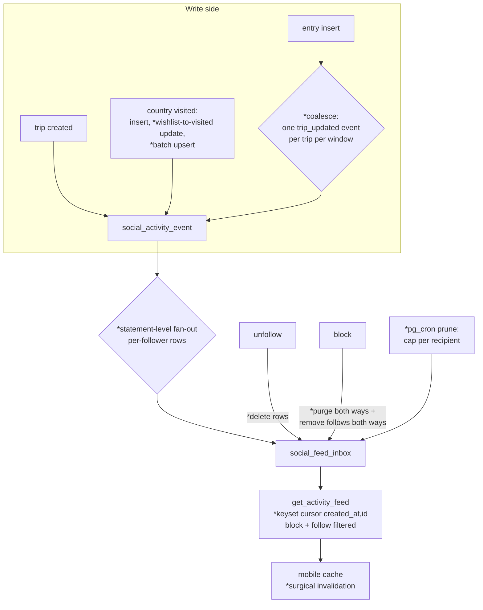
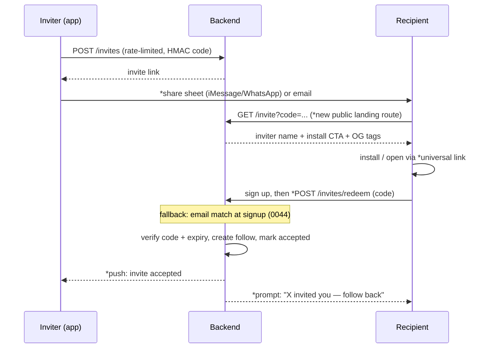
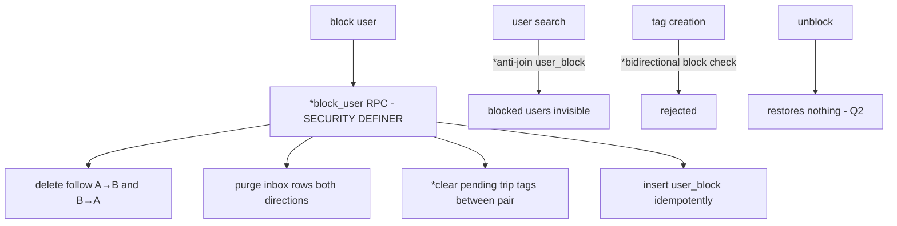

# Social Layer Merge & Hardening - Plan

## Goal Capsule

- **Objective:** Bring `feature/friends-social-phase-1` up to date with `origin/main`, then fix the correctness, performance, smoothness, and growth-loop defects found in the deep review so the social layer is a sound foundation for future features.
- **Authority hierarchy:** User's confirmed scope > this plan > repo conventions (CLAUDE.md, STYLEGUIDE.md). Where a unit conflicts with post-merge reality, the Requirements win over the unit's file list.
- **Execution profile:** Work on `feature/friends-social-phase-1` directly. One commit (or small commit series) per implementation unit, in dependency order. U1 (the merge) must land and be green before any other unit starts.
- **Stop conditions:** Stop and surface to the user if (a) the merge reveals a semantic conflict between main's features and social flows that requires product judgment, (b) a migration would rewrite or delete production data beyond the defects named here, or (c) evidence shows a Key Technical Decision below cannot work.
- **Tail ownership:** The executor owns commits and the final push/PR of this branch toward `main`. Database migrations are applied to production via the Supabase dashboard by the user — new migration files land in the repo, and Operational Notes lists the apply steps.

---

## Product Contract

### Summary

Merge current `main` (505 commits, including the app-wide perf pass and public share-map work) into the social branch, then execute a review-driven hardening pass over the social layer: fix data-integrity and block/consent defects, make the feed correct and scalable, complete the invite growth loop end to end, wire universal links and share attribution, and make the mobile social surfaces feel instant.

### Problem Frame

The social branch (58 commits, ~26.7k lines) was built while `main` moved 505 commits ahead. The deep review found the social code is architecturally sound (aggregated `/social/home` call, event-table + inbox fan-out, optimistic follow button) but carries defects that undermine its two jobs. As a product foundation: an invited user with a pending trip tag cannot sign up at all; unfollow and block leave stale or leaking feed state; a core flow (wishlist country promoted to visited) never produces a feed event. As a growth engine: the invite email links to a route that does not exist, so the only engineered viral loop dead-ends at its conversion moment; shared milestone cards carry no link back to the app; nothing opens the app from a shared URL. These are cheap to fix now and expensive after more features pin the schema and cache shapes.

### Requirements

**Merge and stability**

- R1. The branch contains all of `origin/main` with no regressions to main-side features (share pages incl. map/KML, photo import, perf pass, delete account) and no regressions to social features.
- R2. Social endpoints stay behind `ENABLE_SOCIAL_FEATURES` after the merge, including the trip-tags router; both test suites pass.

**Correctness and integrity**

- R3. Signup never fails because of social data. An invited user with pending invites or trip tags completes signup and gets attributed.
- R4. The feed shows exactly what it should: no stale items after unfollow or block; a `country_visited` event fires for every path to visited (insert, wishlist→visited update, batch upsert); no lost or duplicated pages at timestamp ties; follow backfill counts only visible items.
- R5. Blocking severs both directions everywhere: follows removed both ways, inbox purged both ways, search and pending trip tags exclude blocked users, and new fan-out cannot reach a blocked user. Unblock restores nothing.
- R6. Unblocking is reachable in the UI (blocked-users list linked from profile settings).
- R7. A tagged user can withdraw consent: decline before approval and remove their own tag after approval.
- R8. Push tokens follow the signed-in user: sign-out unregisters the device token; one user can hold multiple device tokens; a device token belongs to at most one user.

**Growth loops**

- R9. The invite loop works end to end: invite created → link deliverable by share sheet and email → link lands on a working invite page with inviter context and install CTA → recipient signs up → attribution succeeds by invite-code redemption (email match as fallback) → inviter and invitee are connected and the inviter is notified. Expired invites do not attribute; no-op invites are not marked accepted.
- R10. Shared URLs open the app when it is installed (universal links for `/u/`, `/t/`, `/l/`, `/invite`), and shared content always carries a link plus a `?ref=` attribution parameter that public pages record.
- R11. Retention pushes exist for the highest-pull events: you were tagged, and your invite was accepted.

**Performance and smoothness**

- R12. Feed fan-out survives real usage: a photo-import trip with hundreds of entries produces a bounded number of feed events and bounded fan-out work; the inbox is pruned; feed p95 stays under 500ms and follow p95 under 200ms (targets carried from `plans/feat-friends-social-phase-1-revised.md`).
- R13. Social interactions feel instant: visible counts and follow state update optimistically, follow/unfollow does not refetch every loaded feed page, search results do not flicker, and all social lists paginate fully (no hard cap at 20).
- R14. Social screens have error states with retry, skeleton loading, and smooth list rendering (FlashList where repo standard, `expo-image` with recycling keys).

**Abuse and testing**

- R15. Rate limits key on the authenticated user where auth exists, and every social mutation endpoint has a limit.
- R16. The SQL layer (feed RPCs, fan-out triggers, signup invite processing, block enforcement, RLS) is covered by tests that run against a real Postgres.

### Scope Boundaries

**Deferred to Follow-Up Work**

- Net-new viral features: contact import, suggested follows, passport-grid OG image for profile shares, feed digests. (Session-settled exclusion; see KTD2.)
- Clipboard-token deferred deep-link attribution for the App-Store-detour install path. Invite-code redemption (R9) covers attribution without it; revisit if unattributed installs matter later.
- Redis-backed rate-limit storage and any queue infrastructure beyond Postgres. Flagged in Operational Notes; in-process limits are acceptable while the backend runs a single worker.
- Hybrid fan-out with a follower-count threshold and Supabase Realtime (Broadcast) push feeds. Adopt when follower counts warrant; the coalescing and pruning in U5 are the prerequisites either way.
- The 16 pending ad-tracking review todos in `todos/` (facebook SDK, TikTok, ad events). Excluded from this plan except where the same defect class touches social code (the shared-httpx-client fix in U5).
- Comments, likes, DMs, private accounts — Phase 2 features named in `plans/feat-friends-social-phase-1-revised.md`.

**Non-goals**

- No rewrite of the fan-out architecture to fan-in-on-read (see KTD3).
- No third-party attribution SDK (Branch/AppsFlyer) — see KTD6.

### Open Questions

All are deferred (non-blocking); each has a default the plan implements, cheap to redirect until its unit lands.

- Q1 (U6): When several users invited the same email, all of them auto-connect at signup today. Default: keep, and document. Alternative: only the most recent inviter.
- Q2 (U2): Unblock restores nothing — purged follows and feed items stay gone. Default: keep as intended semantics (industry norm).
- Q3 (U3): Tag withdrawal after approval (R7). Default: allow — matches the consent-based product identity in CLAUDE.md.

---

## Planning Contract

### Key Technical Decisions

- KTD1. **Merge, don't rebase; review ran pre-merge.** Merge `origin/main` into the branch as a merge commit; the 58 branch commits are published history. Review findings were gathered on the pre-merge branch because the social files are new on this branch and untouched on main. (session-settled: user-approved — chosen over merging before planning: social files don't conflict, so pre-merge review holds and the merge becomes the plan's first verifiable unit.)
- KTD2. **Virality scope is hardening existing loops.** The plan completes and instruments the loops that exist (invite, share pages, share cards, notifications); net-new viral features are deferred. (session-settled: user-approved — chosen over expanding scope to new viral features: fixing a broken loop beats adding another one.)
- KTD3. **Keep fan-out-on-write (event table + per-recipient inbox); fix it rather than replace it.** The shape matches the standard design for this scale and the branch's own p95 targets. The defects are integrity (no unfollow/block cleanup) and write amplification (per-entry, per-row triggers) — solved by cleanup triggers, per-trip coalescing, statement-level batching, and pruning (U2, U5), not by switching to fan-in-on-read. External research: hybrid read/write split only pays at celebrity-scale follower counts.
- KTD4. **Block and consent semantics live in SQL.** Both-way follow removal, inbox purges, and search/tag exclusion are enforced by SECURITY DEFINER RPCs and triggers so every current and future endpoint inherits them; Python endpoints call them instead of re-implementing checks per route. The review found per-endpoint Python enforcement already missed search and tag creation.
- KTD5. **Feed pagination standardizes on compound keyset cursors `(created_at, id)`.** The RPCs gain a `p_before_id` tuple comparison and return a stable `activity_id`; profile feed and home feed use identical cursor semantics. Offset pagination remains only for bounded management lists (blocked users, invites). Followers/following move to paged infinite queries.
- KTD6. **Invite attribution = signed invite-code redemption first, email match as fallback; no attribution SDK.** The HMAC code already exists (`backend/app/core/invite_signer.py`) but is never redeemed; a redemption endpoint fixes attribution for Apple private-relay signups, which defeat email matching. Deterministic install-time attribution is structurally impossible post-ATT, so an SDK buys little; the deferred clipboard-token approach is the escape hatch if needed.
- KTD7. **Universal links served first-party.** Backend serves `/.well-known/apple-app-site-association`; `app.config.js` gains `associatedDomains` (iOS) and `intentFilters` (Android); React Navigation `linking.config` maps `/u/`, `/t/`, `/l/`, `/invite`. No third-party link service.
- KTD8. **Structural refactors inside social modules are in scope.** Shared query-key module, dead-surface deletion, service-role explicitness, feed-card renderer registry. (session-settled: user-approved — chosen over surgical fixes only: this layer pins future features.)
- KTD9. **Rate limiting keys on user id when authenticated, IP otherwise.** slowapi `key_func` swap in `backend/app/main.py`; per-route limits stay declarative. Shared storage is an ops follow-up, not a code blocker.
- KTD10. **Service-role access becomes explicit-only.** `get_supabase_client()` with no token raises; call sites that need admin access use `get_service_supabase_client()`. Kills the silent-RLS-bypass default that already produced the block-delete no-op class of bug. Post-merge blast radius is repo-wide, not social-only: ~90 tokenless call sites across routers and service modules (photo import, share pages, affiliate links), plus two explicit `user_token=None` calls in `backend/app/api/subscriptions.py` and `webhooks.py`. U5 executes this as a mechanical repo-wide migration after the merge, never before.
- KTD11. **Push tokens key on `(user_id, token)`.** Multi-device users keep all devices; registering a token deletes any other user's claim to it; sign-out unregisters. Fixes cross-user delivery on shared devices.
- KTD12. **SQL-layer tests run against a real Postgres via the Supabase CLI local stack.** A separate pytest marker (`sql`) targets a local `supabase start` database and exercises migrations, RPCs, and triggers directly. Mock-based HTTP tests stay for endpoint logic; the SQL suite covers the layer where most social logic actually lives.
- KTD13. **One feed-schema migration owns all the DDL churn.** A single migration converts `social_activity_type` from a Postgres enum to TEXT + CHECK (sidesteps `ALTER TYPE ... ADD VALUE` transaction restrictions and future enum churn), adds `trip_id` (FK, cascade) and `payload JSONB` to `social_activity_event`, widens the type-vs-source CHECK, and rewrites both feed RPCs once — adding `activity_id` to the row set and `p_before_id` to the parameters. U4 and U5 both consume this migration; without it each would rewrite the same RPC signatures serially, and the next activity type would rewrite them again.
- KTD14. **Branch social migrations renumber after the merge.** Main and the branch both created migrations 0032–0057 with different content, including semantically overlapping RLS and `search_path` fixes. The branch's social migrations renumber to follow main's highest applied number, and the overlapping definitions are diff-audited so the surviving function/policy bodies carry both sides' fixes (U12).

### High-Level Technical Design

**Feed pipeline (target state).** Changes from today marked with `*`:

**Invite loop (target state).** Steps that are today MISSING or WEAK marked with `*`:

**Block semantics (target state).** One SECURITY DEFINER RPC owns the whole effect set:

### Sequencing

U1 first, alone; U12 (migration reconciliation) immediately after and before any SQL work. Then three parallel tracks: integrity (U2 → U3; U4 → U5), growth (U6 → U7), mobile (U8 → U9). U10 follows U2 and U6. U11 accretes tests as each unit lands and closes the pass.

---

## System-Wide Impact

- **Migration history:** main and branch migration sequences diverged (KTD14); nothing SQL-touching may land before U12 reconciles them. New files number after main's highest applied migration.
- **Persisted mobile cache:** the React Query persister (`atlasi-query-cache`, `buster: 'v1'` in `mobile/App.tsx`) rehydrates old-shape feed pages across app updates. U4 bumps the buster to `v2`; U9's renderer registry must default-skip unknown `activity_type` values.
- **Wire compatibility:** shipped app builds are from main with social flags off — they make no social calls, so the cursor, `activity_id`, and `trip_updated` changes are non-breaking today. The compat obligation starts with the first shipped social build: from then on, unknown-activity-type tolerance (U9) is the standing rule. Do not build dual-format handling beyond that.
- **Delete-account seam (from main):** all social tables cascade from `auth.users`, and no SECURITY DEFINER function holds dangling user refs — safe by FK. The exception is `pending_invite`, keyed by email, not FK: invites addressed to a deleted user's email survive, and a later re-signup of that email must be treated as a fresh consent decision (U6), never auto-trusted by U2's cleanup.
- **Service-role default:** KTD10's explicit-only change touches every router and service module post-merge (~90 call sites incl. photo import and share pages) — it is a repo-wide sweep with the full backend suite as its guard, not a social-local edit.
- **Deep-link handling:** `mobile/App.tsx` has manual `Linking` handlers (auth-callback, share extension) and persisted navigation state; U7's `linking.config` must filter those URLs out and define cold-start precedence, or auth callbacks double-navigate.

---

## Implementation Units

| U-ID | Title | Key files | Depends on |
|---|---|---|---|
| U1 | Merge origin/main and stabilize | 34 conflicted files; `backend/app/api/__init__.py`, `public.py`, `seo.py` | — |
| U12 | Migration reconciliation | `supabase/migrations/` (renumber + diff-audit) | U1 |
| U2 | SQL integrity migration | new `supabase/migrations/`, `backend/app/api/blocks.py` | U12 |
| U3 | Block/consent enforcement across endpoints | `users.py`, `trip_tags.py`, `trips.py`, `api/__init__.py` | U2 |
| U4 | Feed schema + compound cursors | new migration (KTD13), `feed.py`, `social.py`, `schemas/feed.py`, `App.tsx` (buster) | U12 |
| U5 | Fan-out scale + backend efficiency | new migration, `main.py`, `edge_functions.py`, `db/session.py`, `users.py` | U2, U4 |
| U6 | Invite loop completion | `public.py`, `invites.py`, templates, `useInvites.ts` | U1 |
| U7 | Universal links + share attribution | `app.config.js`, `App.tsx`, `base.html`, `seo.py`, share components | U6 |
| U8 | Mobile cache discipline | `useFollows.ts`, `useBlocks.ts`, `useTripTags.ts`, `useUserSearch.ts`, new `queryKeys.ts` | U1 |
| U9 | Mobile UI smoothness | friends screens/components, `useFollows.ts`, `package.json` (expo-image) | U4, U8 |
| U10 | Notifications expansion | `notifications.py`, new migration, send paths, auth hooks | U2, U6 |
| U11 | SQL-layer + mobile test hardening | `backend/tests/sql/` (new), `mobile/src/__tests__/` | U2–U10 |

### U1. Merge origin/main and stabilize

- **Goal:** The branch contains all of main; both apps build, both test suites pass, feature flags still gate social.
- **Requirements:** R1, R2.
- **Files:** The 34 conflicted files from `git merge-tree` — hotspots: `mobile/src/navigation/{MainTabNavigator,RootNavigator,TripsNavigator,types}.tsx`, `mobile/src/hooks/{index,useAuth,useAppleAuth,useGoogleAuth,useTrips}.ts`, `backend/app/api/{__init__,public,trips}.py`, `backend/app/core/seo.py`, `mobile/App.tsx`, `mobile/package.json` + lock, `backend/app/static/css/*`, `backend/scripts/build-css.js`, `backend/tests/test_public_endpoints.py`, `mobile/jest.setup.js`, onboarding + trips screens, `CLAUDE.md`, both `.env.example` files.
- **Approach:**
  1. `git merge origin/main` on the branch; resolve conflicts file by file.
  2. `backend/app/api/__init__.py`: keep main's new routers (photos, subscriptions, webhooks, welcome, blog, ad_events) AND the social flag block. Verify `get_token_from_request` still exists in post-merge `app/api/utils.py` (main rewrote it; social routes import it).
  3. `backend/app/api/public.py` + `seo.py`: three-way union — branch adds `/u/{username}`; main adds map/KML, unsubscribe, contact, blog. Keep both feature sets.
  4. Auth hooks: main's `useAuth` rewrite (+181 lines, new `useAuthSession`) is the base; re-apply the branch's social additions (push-token registration on sign-in) on top.
  5. CSS: do not hand-merge `styles.css`/`styles.min.css`; take either side, then regenerate with `node scripts/build-css.js` after merging `src/` and commit the outputs.
  6. `mobile/package.json`: union dependencies; regenerate the lockfile with `npm install`.
  7. Re-verify the custom Supabase client (`db.count`, `db.rpc`, `in_list`) against main's `db/session.py` changes.
- **Execution note:** This unit is proof-by-test-suite: green suites and a manual smoke of navigation (Passport → Friends tab with flags on, share pages with map) are the exit, not code review of every hunk.
- **Test scenarios:**
  - Full backend suite passes, including `test_feature_flags.py` (social routers absent when flag off) and main's delete-account and public-endpoint tests against the merged schema.
  - Full mobile suite passes; `npm run lint` and format check pass.
  - With both social flags on: Friends tab renders, feed loads, follow works. With backend flag off: social endpoints 404.
  - Public trip page renders map and KML link (main feature) and `/u/{username}` renders (branch feature).
- **Verification:** Suites green; smoke pass done; merge commit pushed.

### U12. Migration reconciliation

- **Goal:** One coherent migration history; SQL work has a safe base.
- **Requirements:** R1 (schema half), KTD14.
- **Files:** `supabase/migrations/` (branch social files renumbered); no schema content changes beyond the diff-audit outcomes.
- **Approach:**
  1. Renumber the branch's social migrations (0032–0062 branch-side) to follow main's highest migration number, preserving relative order.
  2. Diff-audit overlapping surfaces: main's RLS-perf rewrite and `search_path` fixes vs the branch's social RLS policies and SECURITY DEFINER functions; where both sides redefine the same function or policy, author a reconciled definition carrying both fixes.
  3. Re-author the 0044 signup-trigger fix target: `handle_new_user` must be patched as it exists post-merge (main renamed a column it may read).
  4. Record the prod drift-check queries (Operational Notes) and run them against production before any new migration is applied.
- **Test scenarios:**
  - `supabase start` on the merged migration set applies cleanly from zero.
  - Reconciled functions carry `SET search_path` (main's fix) and the branch's social behavior (spot-check `is_blocked_bidirectional`, `handle_new_user`, trip soft-delete).
- **Verification:** Fresh local stack up; backend suite green against it; drift-check queries documented and run.

### U2. SQL integrity migration

- **Goal:** The signup-breaking and feed-integrity defects are fixed at the database layer.
- **Requirements:** R3, R4, R5 (data layer), Q2 default.
- **Files:** New migration(s) in `supabase/migrations/`; `backend/app/api/blocks.py`; `backend/tests/test_blocks.py`.
- **Approach:**
  1. Fix `process_pending_invites_for_user`: insert `'pending'` lowercase into `trip_tags.status`; stop marking invites `accepted` when the referenced trip is deleted or nulled.
  2. Make signup un-abortable structurally: wrap the invite-processing call in `handle_new_user` in an exception handler that logs and continues, with per-invite handling inside the loop so one bad invite cannot drop the rest. The enum fix alone leaves the bug class alive.
  3. One-time repairs for damage already in prod: (a) purge orphaned `social_feed_inbox` rows whose (recipient, actor) pair has no live follow or is a blocked pair — past unfollows and the 0061 cleanup both left orphans; (b) re-run invite processing for existing users whose email matches still-pending invites (people who signed up before their invite, or whose processing aborted). Do not touch invites already `accepted`.
  4. Add `AFTER DELETE ON user_follow` trigger deleting that follower's inbox rows for the unfollowed author.
  5. Create a `block_user_full` SECURITY DEFINER RPC (with `SET search_path`): removes follows both directions, purges inbox both directions, clears pending trip tags between the pair (Q3-adjacent), inserts `user_block` idempotently (no check-then-insert race). `blocks.py` calls it instead of running JWT-scoped deletes that RLS silently no-ops. Unblock restores nothing (Q2). The RPC must not assume an invite row implies a live user (email-keyed invites survive account deletion).
  6. Add an `AFTER UPDATE` trigger on `user_countries` creating `country_visited` events on wishlist→visited transitions, `ON CONFLICT DO NOTHING` against the partial unique index (mirrors the 0058 entry-restore pattern); covers PATCH and batch-upsert paths. Then re-run the existing `backfill_social_feed()` to close historical gaps — it is idempotent against the unique index. It stamps events with `uc.created_at`, so long-wishlisted countries land deep in the feed rather than at the top; acceptable, note it in the migration comment.
  7. Verify before writing: the existing backfill already filters deleted trips/entries — the remaining gap to confirm and fix is the non-visited `uc.status` filter and the 50-row budget interaction.
  8. Audit branch SECURITY DEFINER functions (incl. `is_blocked_bidirectional`) for missing `SET search_path` beyond what U12 reconciled; fix in the same migration.
- **Patterns to follow:** Migration style of `0055_social_feed_inbox.sql`; the 0058 restore-trigger pattern.
- **Test scenarios (SQL suite, landed properly in U11 but written with this unit):**
  - Signup with a pending trip-tag invite succeeds and creates a `pending` tag (regression for the enum bug).
  - Signup succeeds even when invite processing raises (poisoned invite row) — the un-abortable guarantee.
  - Unfollow removes exactly that author's rows from the unfollower's inbox; re-follow backfills again.
  - The one-time purge deletes orphaned inbox rows and leaves valid ones (fixture: rows with and without live follows).
  - Block removes both follow directions and both inbox directions; blocked-side JWT cannot bypass; unblock restores nothing.
  - Wishlist→visited via UPDATE and via batch upsert each produce one `country_visited` event; visited→wishlist→visited does not duplicate.
  - Backfill of a user with 60 events where 20 belong to deleted trips delivers the newest 50 visible events.
- **Verification:** New migration applies cleanly on a fresh local `supabase start` stack; scenarios pass; existing backend suite green; orphan-count verification query returns zero post-purge.

### U3. Block/consent enforcement across endpoints

- **Goal:** Every social read/write path honors blocks; consent is two-way.
- **Requirements:** R5 (API layer), R7, R2 (trip-tags flag gap).
- **Files:** `backend/app/api/users.py`, `trip_tags.py`, `trips.py`, `api/__init__.py`; new search RPC migration; `backend/tests/test_users.py`, `test_trip_tags_pending.py`.
- **Approach:**
  1. Move user search into an RPC with a `user_block` anti-join (both directions); same for `lookup-by-email`'s block branch. Drop the false "constant-time" claim; keep response-shape parity for found/not-found.
  2. Tag creation (`add_trip_tag` and the tag path in `trips.py`): bidirectional block check + target-existence check; move notification send to a background task after the insert succeeds; batch-insert multi-tag lists.
  3. `get_pending_trip_tags` filters blocked users.
  4. Tag withdrawal (Q3 default): tagged user may decline a pending tag or delete their own approved tag; keep optimistic-locking semantics for approve/decline.
  5. Move the `trip_tags` router inside the social flag block in `api/__init__.py`; restrict dev auto-enable so `ENV=development` alone cannot expose social routes in a deployed environment (require explicit flag).
- **Test scenarios:**
  - Search and email lookup never return a user who blocked the caller or whom the caller blocked.
  - A blocked user tagging their blocker gets a 4xx; no notification is sent when an insert fails.
  - Tagged user withdraws an approved tag: tag deleted, trip disappears from their profile, owner's tag list updates.
  - With `ENABLE_SOCIAL_FEATURES=false` and `ENV=development`, trip-tags and social endpoints 404 unless the flag is explicitly on.
- **Verification:** Backend suite green; new scenarios covered.

### U4. Feed schema + compound cursors

- **Goal:** One migration carries all feed DDL churn (KTD13); pagination is lossless and stable; every feed item has a stable id.
- **Requirements:** R4 (pagination), R13 (stable keys), KTD13.
- **Files:** New migration updating `social_activity_event` + `get_activity_feed`/`get_user_activity_feed`; `backend/app/api/feed.py`, `social.py`; `backend/app/schemas/feed.py`; `mobile/App.tsx` (persister buster); `backend/tests/test_feed.py`.
- **Approach:**
  1. The KTD13 migration: convert `social_activity_type` enum → TEXT + CHECK; add `trip_id UUID` (FK to trip, cascade) and `payload JSONB` to `social_activity_event`; widen the type-vs-source CHECK to admit a trip arm; rewrite both RPCs once — `p_before_id` parameter with tuple comparison `(created_at, id) < (p_before, p_before_id)`, and `id` returned as `activity_id`.
  2. Wire `before_id` through `_parse_cursor`/`_build_cursor` in `feed.py` and `social.py` (today parsed then discarded).
  3. Unify profile-feed and home-feed cursor semantics (both paginate on the same tuple shape).
  4. Type `user_id` path params as `UUID`; stop forwarding raw PostgREST error text in `_handle_http_error` responses (generic detail, log the specifics).
  5. Bump the React Query persister `buster` to `v2` in `mobile/App.tsx` so rehydrated caches don't carry old-shape pages (System-Wide Impact).
- **Test scenarios:**
  - 30 events sharing one timestamp paginate across pages with no loss or duplication (page size 20).
  - Cursor round-trip: `next_cursor` from page N returns page N+1 exactly.
  - Existing enum values survive the TEXT conversion; an insert with an unknown type string fails the CHECK.
  - Garbage `user_id` returns 422, not a database-error 500.
- **Verification:** Backend suite green; SQL pagination scenarios pass on local stack; app cold-starts clean with the new buster.

### U5. Fan-out scale + backend efficiency

- **Goal:** Write amplification is bounded; hot endpoints stop doing serial or per-request work.
- **Requirements:** R12, R15, KTD10-adjacent hygiene.
- **Files:** New migration (coalescing + pruning); `backend/app/main.py`; `backend/app/core/edge_functions.py`; `backend/app/db/session.py`; `backend/app/api/users.py`, `follows.py`; repo-wide service-role call sites (KTD10); tests.
- **Approach:**
  1. Coalesce entry events on the U4 schema: retire `entry_added` emission and upsert one `trip_updated` event per trip per window, keyed on a stored `event_day date` column with a partial unique index (`date_trunc` is not IMMUTABLE, so an expression index will fail). The coalescing upsert must refresh the matching inbox rows' `created_at` and fan out to followers gained mid-window — feed ordering reads inbox timestamps, not event timestamps. Keep existing `entry_added` rows (old data ages out via pruning; renderers stay tolerant per U9). Statement-level triggers where per-row fan-out remains.
  2. Prune with pg_cron in batched loops (`DELETE ... WHERE id IN (SELECT ... LIMIT ~5-10k)`, frequent schedule): cap `social_feed_inbox` rows per recipient (e.g., newest 500) and max age, and separately delete `social_activity_event` rows with zero inbox references. A single unbatched sweep is the failure path (long locks, WAL bloat). U2's unfollow/block cleanup owns targeted deletion; pruning owns age/volume decay — keep the boundary.
  3. Rate limiting (KTD9): `key_func` prefers authenticated user id; add limits to tag approve/decline; document `storage_uri` for multi-worker deployments.
  4. `edge_functions.py` uses the shared pooled httpx client from `db/session.py`.
  5. `check-username` collapses to one RPC checking base + candidates in a single query; `lookup-by-email` tail queries run under `asyncio.gather`; followers/following profile+counts queries gather too.
  6. KTD10 sweep: migrate all tokenless `get_supabase_client()` call sites (~90 post-merge, spanning routers and service modules) plus the two explicit `user_token=None` sites (`subscriptions.py`, `webhooks.py`) to `get_service_supabase_client()`; then make `get_supabase_client()` raise without a token. Mechanical, post-merge, guarded by the full backend suite.
- **Test scenarios:**
  - Creating 100 entries on one trip with 10 followers produces ≤ a handful of events and ≤ 10× that inbox rows (not 1000).
  - Feed shows one coalesced trip-update card, not 100 entry cards (product behavior change, intended — feed spam fix).
  - Two users behind one IP have independent follow rate limits.
  - No call site constructs `httpx.AsyncClient` per request (grep-level check + existing todo 004 class).
- **Verification:** Backend suite green; SQL scenarios pass; p95 spot-check of `/social/home` and follow on seeded data (seed script) meets R12 targets locally.

### U6. Invite loop completion

- **Goal:** The invite loop converts: working landing page, code redemption, closed feedback loop.
- **Requirements:** R9, R3, Q1 default.
- **Files:** `backend/app/api/public.py` (+ template in `backend/app/templates/`), `backend/app/api/invites.py`, `backend/app/core/invite_signer.py`, migration updating 0044; `mobile/src/hooks/useInvites.ts`, `mobile/src/components/friends/UserSearchBar.tsx`, `mobile/src/components/trips/TravelFriendsSection.tsx`; backend + mobile tests.
- **Approach:**
  1. `GET /invite?code=` public landing page: verify signature, show inviter display name + avatar, install CTA (`app_store_url`), OG tags; invalid/expired codes get a graceful page, never a 404.
  2. `POST /invites/redeem` (authenticated): verify code + expiry (`verify_invite_code`, today dead code), create the follow, mark accepted, push-notify the inviter — deterministic attribution that survives Apple private relay. Email match at signup (0044) stays as fallback; 0044 gains an age cutoff consistent with code expiry.
  3. Mobile: after signup or first launch from an invite link, call redeem with the code carried through the deep link (U7 wires the routing); show a "〈inviter〉 invited you — follow back" prompt using the accepted-invite data.
  4. Share-sheet delivery: the invite creation flow surfaces the invite link in the native share sheet; email via Resend stays optional, and a missing `RESEND_API_KEY` no longer silently swallows the only delivery path.
  5. Keep all-inviters auto-connect (Q1 default), documented in the endpoint docstring.
  6. Deleted-account seam: invites are email-keyed, so an invite addressed to a since-deleted account's email survives; a re-signup of that email is a fresh consent decision — attribution applies, but nothing from the deleted account's history is assumed (System-Wide Impact).
- **Test scenarios:**
  - Valid code renders landing with inviter name; expired/invalid code renders the graceful page.
  - Redeem: creates follow, marks invite accepted exactly once (idempotent on retry), notifies inviter; expired code redeems nothing.
  - Signup via private-relay email with a valid code still attributes (redemption path).
  - Invite created with Resend unconfigured still yields a shareable link (no silent drop).
- **Verification:** Backend + mobile suites green; manual loop walk: create invite → open link in browser → landing renders.

### U7. Universal links + share attribution

- **Goal:** Shared URLs open the app; every share carries a link and attribution.
- **Requirements:** R10.
- **Files:** `mobile/app.config.js`, `mobile/App.tsx` (linking config); backend AASA route (`backend/app/main.py` or `public.py`), `backend/app/templates/base.html`, `backend/app/core/seo.py`; `mobile/src/components/share/ShareCardOverlay.tsx`, `OnboardingShareOverlay.tsx`, `mobile/src/screens/profile/ProfileSettingsScreen.tsx`, `mobile/src/screens/trips/TripDetailScreen.tsx`.
- **Approach:**
  1. Serve `/.well-known/apple-app-site-association` (JSON, no redirect) covering `/u/*`, `/t/*`, `/l/*`, `/invite`; add `associatedDomains` to `app.config.js` and Android `intentFilters` for the same paths.
  2. React Navigation `linking.config.screens`: map those paths to UserProfile, trip detail, list, and an invite-redemption handler. Add a `linking.filter` excluding the auth-callback and share-extension URLs so the existing manual handlers in `App.tsx` keep exclusive ownership of them, and define cold-start precedence: a universal-link initial URL wins over restored navigation state (which otherwise suppresses linking's initial-URL handling).
  2b. Sequence with U6: the `/invite` path ships in the AASA list only once U6's landing route is live — an AASA path without a web fallback breaks the no-app case (hence the U6 dependency).
  3. Add `apple-itunes-app` smart-banner meta to `base.html`.
  4. Share payloads: `Share.share({ message: text + url })` alongside the image on both share overlays; append `?ref=<username>` to all app-generated share URLs (profile, trip, list, invite); public routes parse and log `ref` (structured log now, analytics table deferred).
- **Execution note:** Universal links cannot be fully proven in simulator/tests; verify config shape by unit test and AASA by HTTP test, and list on-device verification in Operational Notes.
- **Test scenarios:**
  - AASA endpoint returns valid JSON with the four path patterns, content-type `application/json`, no redirect.
  - Linking config resolves `/u/alex`, `/t/slug`, `/invite?code=x` to the right screens (React Navigation `getStateFromPath` unit tests).
  - Share overlay payload contains both image and URL with `ref` param.
  - Public trip page request with `?ref=` logs the referrer and still renders.
- **Verification:** Suites green; AASA reachable on the deployed backend (Operational Notes).

### U8. Mobile cache discipline

- **Goal:** Mutations update exactly the caches users see; no invalidation storms; no dead surfaces.
- **Requirements:** R13, R8 (sign-out half), R5 (cache half).
- **Files:** `mobile/src/hooks/useFollows.ts`, `useBlocks.ts`, `useTripTags.ts`, `useUserSearch.ts`, `useAuth.ts`; new `mobile/src/hooks/queryKeys.ts`; delete `mobile/src/screens/friends/FeedScreen.tsx`, `mobile/src/hooks/useFeed.ts`, `mobile/src/components/friends/FriendsRankingStats.tsx`, `useFriendsRanking`; `mobile/src/components/friends/FollowButton.tsx`; hook tests.
- **Approach:**
  1. Shared `queryKeys.ts` module exporting all social keys; replace string-literal keys across hooks, including the inline social-home prefetch key/queryFn built in `App.tsx`.
  2. Follow/unfollow: drop `['feed']`/`['social-home']` invalidation from `onSettled`; in `onMutate`, surgically `setQueryData` the visible caches — profile (`['user', username, 'profile']`: `is_following`, counts) and social-home page 1 (`follow_stats`) — with cancel/snapshot/rollback per the TanStack pattern; delete the unconsumed `STATS_KEY` plumbing; FollowButton drops its local optimistic state (cache is the single source).
  3. Block: purge `['social-home']`, `['user-feed', userId]`, and the username-keyed profile; `removeQueries` for the blocked user's content (guards the persisted-cache resurrection path).
  4. Tag accept/decline: decrement `pending_tag_count` in social-home cache (badge accuracy).
  5. Search: `placeholderData: keepPreviousData`, spinner keyed on `isFetching` only; delete the `displayUsers` mirror state.
  6. Sign-out calls `unregisterPushNotifications()` before the Supabase sign-out (pairs with U10's server change).
  7. Delete the dead feed surface (FeedScreen/useFeed/FriendsRankingStats/useFriendsRanking, plus `mobile/src/__tests__/hooks/useFeed.test.tsx`) — FriendsScreen's social-home feed is the one feed.
- **Test scenarios:**
  - Follow from search: profile count and social-home stats update instantly; no refetch of feed pages fires (assert query fetch counts).
  - Failed follow rolls back both caches and shows the social error alert.
  - Block removes the user's items from social-home cache immediately, cold-start persistence included (persisted-client test).
  - Accepting a pending tag decrements the badge without a refetch.
  - Sign-out triggers token unregister exactly once.
- **Verification:** Mobile suite green (including updated hook tests); manual: follow 5 users rapidly from search — no feed flicker or content jumping.

### U9. Mobile UI smoothness

- **Goal:** Social screens feel polished: full pagination, skeletons, retry, smooth lists, reachable unblock.
- **Requirements:** R6, R13, R14.
- **Files:** `mobile/src/screens/friends/{FollowersListScreen,FollowingListScreen,BlockedUsersScreen,FriendsScreen,UserProfileScreen}.tsx`, `mobile/src/components/friends/{FeedCard,UserAvatar,UserSearchBar}.tsx`, `mobile/src/hooks/useFollows.ts`, `mobile/src/screens/profile/ProfileSettingsScreen.tsx`, `mobile/package.json` (add `expo-image`); component/screen tests.
- **Approach:**
  1. Followers/following: convert hooks to `useInfiniteQuery` with offset pages and `onEndReached`; remove the 20-item cap.
  2. Add "Blocked travelers" row in ProfileSettings (behind `features.enableSocial`) navigating to BlockedUsersScreen.
  3. FlashList for FollowersList/FollowingList/BlockedUsers; keyExtractor uses `activity_id` (from U4) on feed lists; per-item state respects `useRecyclingState` (repo gotcha).
  4. Adopt `expo-image` for FeedCard media and UserAvatar: `recyclingKey`, `cachePolicy="memory-disk"`, short transition; prefetch detail images for visible feed items.
  5. Skeleton loaders for FriendsScreen stats + feed and UserProfile (replace spinner-only states); error branches with retry buttons on FriendsScreen/UserProfile/lists; distinguish flag-off 404 with a friendly "social is unavailable" state.
  6. Search dropdown: `Pressable` rows, `keyboardShouldPersistTaps="handled"` on outer lists, remove the 200ms blur timeout race.
  7. Feed card renderer: extract a `feedItemConfig` registry (type → icon/color/verb) so new activity types are additive, with unknown types default-skipped — this is the standing wire-compat rule once social builds ship (System-Wide Impact); adopt `useAnimatedPress` on social cards/buttons (main perf-pass pattern).
- **Test scenarios:**
  - A user with 45 followers scrolls through all 45 (pagination pages of 20).
  - Blocked-users screen reachable from settings; unblocking updates the list.
  - Feed renders `trip_updated` (new coalesced type from U5) via the registry without touching FeedCard internals.
  - Error state with retry renders when social-home fails; retry refetches.
  - keyExtractor stability: pull-to-refresh with new items prepended does not remount existing cards (key = `activity_id`).
- **Verification:** Mobile suite green; manual scroll pass on seeded data (8 test users) — no blank cells, no wrong-image flashes, no spinner flicker in search.

### U10. Notifications expansion

- **Goal:** Push delivery is correct per device and fires on the highest-pull events.
- **Requirements:** R8, R11.
- **Files:** New migration (push_token unique on `(user_id, token)`); `backend/app/api/notifications.py`, `trip_tags.py`, `invites.py`; `mobile/src/services` notification registration; tests.
- **Approach:**
  1. Re-key `push_token` on `(user_id, token)` in the constraint-safe order: dedupe existing rows (keep newest per token), add the new unique constraints, deploy the backend that upserts on the new key and transfers token ownership in one transaction, and only then drop the old `user_id` unique constraint — dropping it first breaks the current upsert (`on_conflict="user_id"`) with a 42P10.
  2. Send paths fetch all tokens per user; unregister deletes by token.
  3. Add "you were tagged" push at tag creation (after-insert background task, blocked-pair aware via U3).
  4. Add "your invite was accepted" push on redemption acceptance (with U6).
- **Test scenarios:**
  - Two devices registered for one user both receive a follow push (send-path fetches both tokens).
  - Device token re-registered by user B stops delivering user A's pushes.
  - Tag creation sends to the tagged user exactly once; no push when the insert fails or the pair is blocked.
- **Verification:** Backend suite green; manual push smoke via Expo push tool on a dev build.

### U11. SQL-layer + mobile test hardening

- **Goal:** The layers where social logic actually lives are under test.
- **Requirements:** R16, R2.
- **Files:** New `backend/tests/sql/` suite + pytest marker/config; `mobile/src/__tests__/components/FollowButton.test.tsx`, `UserSearchBar.test.tsx`; `mobile/src/__tests__/hooks/useInvites.test.tsx`, `useUserFeed.test.tsx`; a FriendsScreen screen test.
- **Approach:**
  1. Backend: pytest suite (marker `sql`, skipped unless `SUPABASE_DB_URL` points at a local `supabase start` stack) connecting via asyncpg/psycopg; migrations applied by the CLI; tests cover the U2 scenarios, feed RPC pagination (U4), fan-out coalescing (U5), block RPC (U2/U3), and RLS policies (JWT-role simulation via `set_config` claims).
  2. CI wiring: document the local command; CI job addition is optional follow-up if the repo has no Postgres service container yet.
  3. Mobile: component tests for FollowButton (optimistic transitions, rollback) and UserSearchBar (debounce, invite fallback, keepPreviousData); hook tests for `useInvites`/`useUserFeed`; one FriendsScreen render test (parity with other tabs).
- **Test scenarios:** The suite is the scenario set — the named U2/U4/U5 SQL scenarios plus the mobile component behaviors above.
- **Verification:** `poetry run pytest -m sql` passes against a fresh local stack; full default suites stay green and unaffected when the stack is absent.

---

## Verification Contract

| Gate | Command | Applies to |
|---|---|---|
| Backend lint | `poetry run ruff check .` (in `backend/`) | every unit touching backend |
| Backend format | `poetry run ruff format --check .` | same |
| Backend tests | `poetry run pytest` | every unit touching backend |
| SQL-layer tests | `supabase start` then `poetry run pytest -m sql` | U12, U2, U4, U5, U10, U11 |
| Mobile lint | `npm run lint` (in `mobile/`) | every unit touching mobile |
| Mobile format | `npm run format:check` | same |
| Mobile tests | `npm test` | every unit touching mobile |
| CSS build | `node scripts/build-css.js` + commit outputs | U1, U6, U7 (public page changes) |
| Perf targets | seeded local p95: `/social/home` < 500ms, follow < 200ms | U5 exit |

If `poetry` is not on PATH, use `/Library/Frameworks/Python.framework/Versions/3.12/bin/poetry`.

---

## Definition of Done

- U1 merge landed; both suites green; no main-side or social feature regressed (R1, R2).
- U12 reconciled the migration history: fresh local stack applies from zero; prod drift-check documented.
- All P1-class defects fixed: invited signup works, unfollow/block clean the feed, search honors blocks, wishlist→visited events fire, invite link lands on a working page, follower lists paginate, unblock is reachable, sign-out releases the push token.
- Every unit's Verification met, including the R12 perf spot-check and the manual smoke passes named in U1, U8, U9.
- All new migrations applied cleanly to a fresh local stack, listed for production apply in Operational Notes.
- No dead social surfaces remain (FeedScreen/useFeed/FriendsRankingStats removed); no stray experimental code from abandoned approaches in the diff.
- Pre-commit gates (lint, format, tests, CSS build) pass on the final state of the branch.

---

## Operational Notes

- **Migrations to production:** apply the new `supabase/migrations/` files via the Supabase dashboard/CLI in order after U12, U2, U4, U5, U10 land. Before applying anything, run the drift-check gate against prod (0057 may be unapplied): `SELECT proname, proconfig FROM pg_proc WHERE proname IN ('is_blocked_bidirectional','get_friends_ranking','soft_delete_trip')` (applied ⇒ `proconfig` carries `search_path=public`); `SELECT to_regclass('public.push_token')`; confirm triggers `enforce_no_follow_when_blocked` and `trg_entry_restore_event` exist. Reconcile before applying if any check fails.
- **Universal links need provisioning:** `associatedDomains` requires the Associated Domains entitlement (Apple team) and the AASA served over HTTPS on the production web domain; on-device verification (TestFlight build, tap a `/u/` link from Messages) is the real test. Android requires `assetlinks.json` if App Links verification is wanted later.
- **Rate limiting:** in-memory limits are per-worker; when the backend scales past one worker, set slowapi `storage_uri` to a shared store (Redis). Deferred, noted in Scope Boundaries.
- **pg_cron:** confirm the extension is enabled on the Supabase project before the U5 pruning job.
- **Resend:** invite email remains optional; the share-sheet path (U6) is the primary delivery. Configure `RESEND_API_KEY` when email delivery is wanted.

---

## Sources & Research

- Branch intent and targets: `plans/feat-friends-social-phase-1-revised.md` (p95 targets, query-on-demand rationale, Phase 2 deferrals), `plans/friends-activity-feed.md` (feed follow-ups — verify implemented state during U9).
- Merge inventory: `git merge-tree --write-tree origin/main HEAD` — 34 conflicted files, 111 hunks (U1 file list).
- Review findings grounding the units: backend review (fan-out, cursors, rate limits, service-role default), mobile review (invalidation storm, capped lists, dead surfaces, expo-image), virality loop map (invite 404, deep links, share cards), flow analysis (block/unfollow integrity, push-token leak, wishlist transition, delete-account seam).
- External grounding (2026): TanStack optimistic-update pattern (cancel/snapshot/rollback) and TkDodo on concurrent optimistic updates; Sequin on keyset-vs-offset Postgres pagination; Shopify FlashList v2; expo-image caching guidance; Branch/LinkTrace/Airbridge on post-ATT deferred deep-link limits (basis for KTD6); Supabase Realtime per-subscriber RLS cost (basis for deferring realtime feeds); Partiful's no-install-invitee mechanic and Strava's share-image loop (basis for the deferred OG follow-up).
