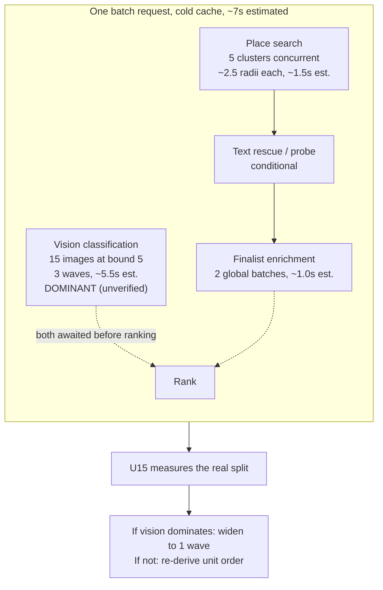
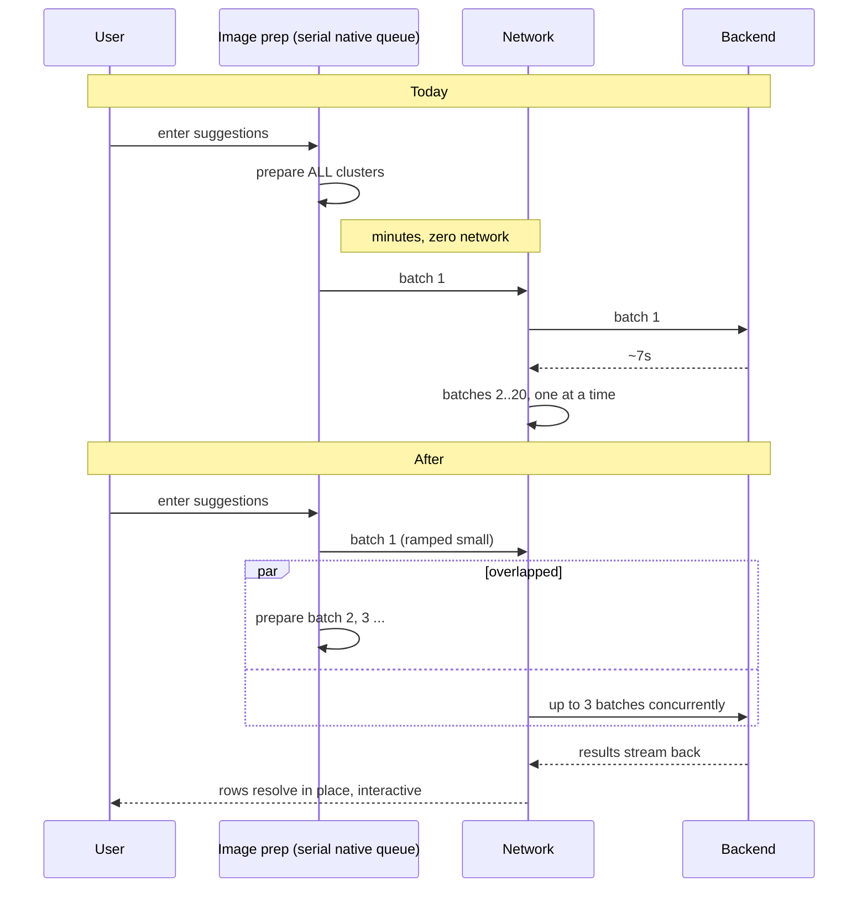
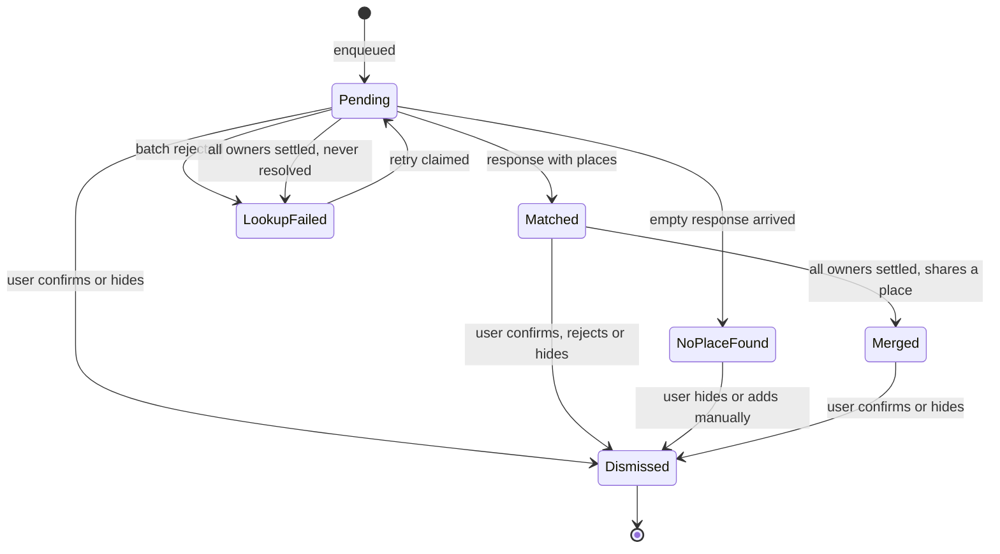
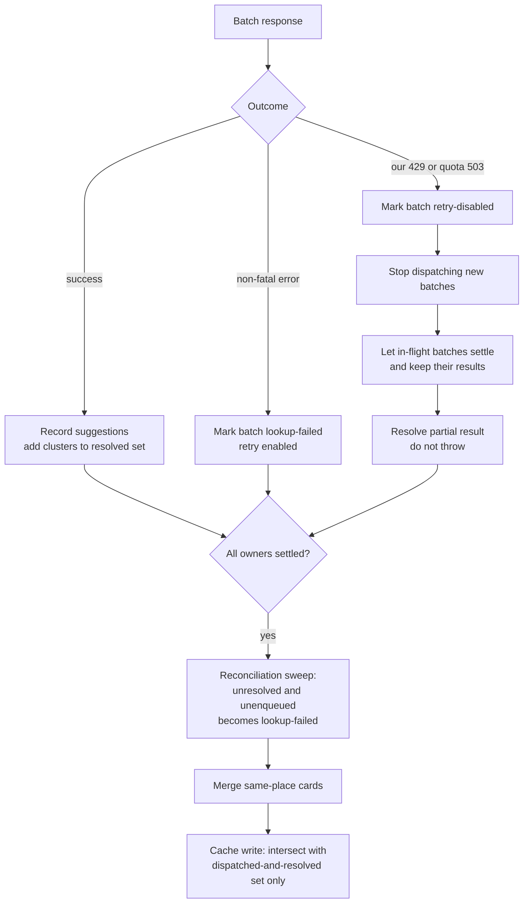

# Photo Match Progressive Loading and Speed - Plan

## Goal Capsule

- **Objective:** Make photo-import place matching honest about what it is doing, materially faster, and usable while it is still running.
- **Scope anchor:** The place-matching stage only — from trip selection to every location reaching a terminal state. The photo library scan and the media-upload mechanics are untouched.
- **Authority hierarchy:** Requirements (R-IDs) win on product behavior. Key Technical Decisions (KTD-IDs) win on mechanism within those requirements. Implementation Units override neither.
- **Release shape:** One release. Every unit ships together, so no intermediate state reaches users. Landing order still matters for correctness gates and reviewability.
- **Execution profile:** Units land in the order given by the Unit Index, which is not U-ID order. Four hard gates: U15 before any measurement; U3 before any concurrency; U7 before U6; U13 and U14 before U8.
- **Stop conditions:** Stop and surface a blocker if measured peak request rate exceeds the project's Google Places per-method quota, if the top-ranked place per cluster differs from pre-plan `main`, or if a unit requires changing ranking weights.
- **Tail ownership:** Standalone `ce-work` owns branch, review, commit, and PR.

---

## Product Contract

### Summary

Fix the defect that makes an in-progress match look like a total failure, remove the dead time before the first network call, cut the dominant backend latency term, dispatch batches concurrently behind a bounded and entitlement-enforcing backend, and let people act on locations that have already resolved while the rest are still matching.

### Problem Frame

Opening an already-imported trip runs the `skipToSuggestions` path. That path starts a suggestion fetch without ever setting the screen's loading flag. With that flag false, `mobile/src/screens/photos/useClusterItems.ts` classifies every not-yet-resolved cluster through its reconciliation branch into the terminal `lookup-failed` state, and `mobile/src/screens/photos/components/SuggestionsPhase.tsx` renders neither a progress header nor an empty-state spinner. The screen shows a wall of "Couldn't check this location" cards while the fetch is healthy and still running. Tapping Retry on those cards fires a second paid lookup for a cluster already on the wire.

Underneath that, the pipeline is serial in four compounding ways. Analysis images for every uncached cluster are prepared before the first network request is issued, on a native queue that is serial regardless of how many workers the JavaScript side runs. Batches of five clusters are then posted strictly one at a time. Inside each request, vision classification pushes fifteen images through a concurrency cap of five, costing three sequential waves. Each cluster's place search walks up to three radii sequentially.

Two conditions make this riskier than a pure latency change. The area has a history of concurrency regressions — several prior commits exist solely to fix stale caches, races, and double-taps in these same hooks, and none of those regressions was caught by the existing suites. And the endpoint fronts two metered paid APIs with no server-side entitlement check at all, so raising throughput without closing that gap widens a spend exposure rather than just a speed one.

### Requirements

**Loading truth and error honesty**

- R1. Every code path that starts a suggestion fetch reports that a fetch is in progress for its whole duration, including early returns, and a fetch is reported as settled only when every concurrent owner has settled.
- R2. A cluster is shown as `lookup-failed` only when its lookup actually failed or dispatch for it has settled without a response. A cluster still being matched is never shown as failed.
- R3. A cluster is shown as "no place found" only when an empty response actually arrived for it, and it is shown as soon as that response arrives.
- R4. When our own rate limiter rejects a request, the client is told how long to wait.

**Speed**

- R5. On-device analysis-image preparation overlaps with network dispatch instead of completing first.
- R6. Suggestion batches are dispatched concurrently rather than one at a time.
- R7. Redundant per-photo image decoding is removed from preparation.
- R8. Outbound Google Places calls reuse pooled connections across requests, over a connection pool sized for the resulting concurrency.
- R19. Vision classification for a batch completes in a single concurrency wave rather than several.
- R24. The first batch is smaller than subsequent batches, so the first suggestion appears sooner.

**Progressive interaction**

- R9. A location that has resolved is confirmable, dismissible, and editable while other locations are still matching.
- R10. Every location that has not yet resolved is visible as a pending row. Pending means enqueued for dispatch and unresolved — not merely in flight.
- R11. A row keeps its position for the whole session. Resolving never reorders the list and never removes a row.
- R12. Retry is not offered on a pending row.
- R23. Clusters that resolve to the same place are merged into one card only after every owner has settled, never progressively.
- R28. Row state changes are announced once at the list header, not per row.

**Resilience and recovery**

- R13. A Google rate-limit response is retried with backoff at every Google call site — nearby search, text search, popularity probe, and finalist enrichment — rather than failing a batch or silently dropping ranking inputs.
- R14. Concurrent backend fan-out to Google is bounded across the whole process, with a per-request share so one caller cannot hold every slot.
- R15. All failed locations can be retried in one action, and dispatch pauses when the app backgrounds and resumes when it returns.

**Data integrity**

- R20. A suggestion cache row is written for a cluster only on positive evidence that a response for that cluster arrived.
- R21. Concurrent writers to the photo cache database are serialized so no two transactions are open on the shared handle at once.
- R22. The top-ranked place for a cluster is unchanged relative to pre-plan `main`, at every concurrency level tested.

**Cost, entitlement, and abuse**

- R16. A free user's single lifetime photo import is counted durably when the first batch of locations returns successfully.
- R17. A trip that has already consumed that import stays completable on re-entry, on any device, at every gate that guards entry to matching.
- R25. The suggest-places endpoint enforces the photo-import entitlement server-side before issuing any paid call.
- R26. Per-user limits are weighted by cost drivers — clusters and vision images — not by request count alone.

**Measurement and privacy**

- R18. Time to first visible suggestion, total wall-clock matching time, cache-hit composition, rate-limit retry attempts, vision-null rate, and backend phase durations are all recorded and remain meaningful under concurrent dispatch.
- R27. No coordinate, cluster id, geohash, or place id appears in an always-on log line or in any analytics event.

### Scope Boundaries

- Ranking weights, the search tier profile, and the matching algorithm are unchanged. This plan does not intend to change which place wins — but that is an outcome to be **verified against pre-plan `main`**, not assumed. R22 exists because dropped enrichment inputs can change ranking silently.
- The photo library scan phase keeps its existing progress UI and background-resume behavior.
- The confirm-time media upload mechanics are unchanged. U13 does route the confirm-time photo-cache writes through the serialized write path.
- Free-tier limits are unchanged in value. **Their enforcement changes materially:** the counter becomes durable and the endpoint begins enforcing it server-side, so users who imported repeatedly under an unenforced counter will be gated for the first time. U10 carries a grandfather pass for that.

#### Deferred to Follow-Up Work

- Migrating `manipulateAsync` off its deprecation. The deprecated call is a thin shim over the new API doing identical native work.
- Adopting `experimental_streamedQuery`. It is queries-only, its flat reduce-into-one-value model fights the per-cluster failure state this screen tracks, and the installed version predates its reducer fix.
- On-demand dispatch. Buying lookups as the user scrolls would cut both time and spend, and would dissolve several risks concurrency forces this plan to absorb — but it is a different product shape than "act on early results," and client-driven dispatch is settled (KTD1). U11 instruments what fraction of clusters are ever scrolled to before the user leaves, so the idea can be revisited against a real number.

### Open Questions

- **Deferred — the project's Google Places per-method quota.** Google publishes no numeric limit for Places API (New); limits are per method per project and must be read from the Cloud console. Compare against the measured peak request rate from U15, expressed in requests per minute per method.
- **Deferred — the free allowance's unit.** With partial imports becoming normal, "one trip" may be the wrong unit for the free tier; "N locations matched" is the alternative. Not resolved here because it changes the product's pricing surface, not this plan's mechanics.

---

## Planning Contract

### Key Technical Decisions

- KTD1. **Keep dispatch client-driven.** Parallelize the existing batch loop and overlap preparation rather than moving matching to a server-side job the client polls. The client already receives and paints partial results per batch. (session-settled: user-directed — chosen over a server-side background job with polling: the existing partial-result design already delivers progressive rendering without new infrastructure.) Consequence to carry: pool sizing, ranking drift, entitlement enforcement, and the controller/claim-set/lifecycle machinery are all costs a centralized job would have avoided. Each is mitigated explicitly below; the accumulated maintenance surface is the standing cost of the decision.

- KTD2. **Harden the backend against rate pressure before adding any.** A Google 429 raised inside the search path is retried only on timeout today, so it propagates and fails all five clusters in the batch. Raising concurrency first would convert rate pressure into permanent failure cards. U3 lands before U6, U7, and U12.

- KTD3. **Repair the loading flag's reconciliation role and delete its withholding role.** The flag has two couplings in `useClusterItems.ts`, not one. The reconciliation branch — once dispatch settles, an unresolved and unclaimed cluster becomes `lookup-failed` — stays. The separate gate that withholds *all* no-place-found rows until the whole fetch finishes goes: an empty response is a terminal, honest result and must render immediately, or R3, R10, and R11 are violated at once.

- KTD13. **Replace the loading boolean with a dispatch-generation token.** After U2 the flag has six independent owners, each with its own bracket. Two owners can overlap — a manual split or a bulk retry alongside main dispatch — and the first to finish flips the flag false, firing the reconciliation sweep against the other owner's in-flight clusters. That is this plan's headline defect reintroduced at a larger blast radius. Model "settled" as all owners settled, and treat paused as not settled.

- KTD4. **Keep the reconciliation sweep.** Backend per-cluster timeouts return a count, not ids, so a timed-out cluster comes back with neither a suggestion nor a failure entry. The sweep is the only thing that rescues it.

- KTD5. **Emit every row in canonical cluster order, for the whole session.** Appending failed and no-place-found rows after matched ones makes rows teleport once results stream. Emit all states in cluster order so a resolving row changes appearance in place.

- KTD22. **Suppress same-place merging until every owner has settled.** Merging is the one existing list behavior that *removes* a row: when a second cluster resolves to a place a first already claimed, its row disappears into a merged card, and if the user already confirmed the first card the second arrives for a place just saved. Rows never moving (R11) is the more valuable guarantee than progressive merging. One predictable collapse at settle is acceptable; rows vanishing mid-scroll is not.

- KTD6. **Replace the fatal re-throw with a partial result, and pair it with an allow-list cache write.** The current fatal path marks "this batch plus everything after it" using the loop index as a dispatch frontier, which concurrency destroys. Mark only the rejected batch, stop dispatching, let in-flight batches land, and resolve partially. Safe only together with KTD14.

- KTD14. **The suggestion cache write becomes an allow-list keyed on clusters actually dispatched and resolved.** Today's filter is a deny-list with an escape hatch that admits everything when the failure count is zero. That escape is a proxy for "full coverage" which concurrency and partial resolution both invalidate: never-dispatched clusters would be written as empty and cached for 24 hours, indistinguishable from a genuine no-place-found. The hole is already reachable through the abort path, and pausing dispatch on background makes it routine.

- KTD7. **Two distinct cluster sets, not one.** An *enqueued* set — every cluster the controller has accepted, resolved or not — drives pending rows (R10). A narrower *in-flight* set drives retry deduplication and the KTD14 allow-list. Conflating them was the original error: sourcing pending rows from the in-flight set would render only the clusters in the three live batches, leaving the screen mostly empty on a large trip, which is the reported defect.

- KTD15. **Extract a dispatch controller and leave policy in the suggestions hook.** The chunked mutation uses none of React Query's affordances — no query key, no cache, no retry, no dedup — and after U6 it acquires a worker pool, an abort-controller map, out-of-order accounting, and a partial-resolution path that makes its error handler dead code. Meanwhile the claim sets must be visible to all three fetch paths. Extract chunking, claiming, abort, progress, and failure attribution into a plain controller; leave cache discipline, entitlement, analytics, and stale-guarding in the suggestions hook. This also collapses three near-duplicate copies of the same prepare-post-partition-cache sequence.

- KTD21. **The controller is a module-level singleton with a subscriber registry.** A per-hook instance cannot be reached by the app-root lifecycle hook, dies on navigation, and loses its abort map — and navigating away is exactly what progressive interaction encourages. The existing photo-scan service is the established precedent for background-resumable photo work in this repo: service singleton owns the state machine, one app-root hook resumes it.

- KTD8. **Serialize photo-cache writes with an app-level mutex.** Keeping the suggestion cache as a single terminal write is necessary but not sufficient. The SQLite transaction helper takes no lock on the shared handle: when two transactions overlap, the second `BEGIN` fails and its rollback aborts the *first* writer's uncommitted work, and bare writes issued during an open transaction are enrolled in it and destroyed with it. One collision corrupts both writers. The exclusive-transaction alternative is rejected — it opens a separate connection and makes other concurrent writes abort with a lock error, trading silent corruption for a new error class with no handling.

- KTD9. **Bound backend fan-out at module scope with a per-request share, and cap burst at the edge.** The two existing semaphores run as **sequential phases**, not nested: enrichment executes at the top level of the cluster-processing flow after the per-cluster gather completes, outside any semaphore block. Peak outbound Places concurrency is therefore 5 per request and roughly 15 at client concurrency 3. A module-level bound is still warranted to cap cross-request fan-out, placed around the outbound call only so cache hits and single-flight waiters consume no global slot, and capped per request so one caller cannot starve others. Separately cap burst at the route, because the limiter's fixed window permits roughly double the nominal rate across a boundary.

- KTD20. **Give the places path its own connection pool rather than adopting the shared app client.** The shared client backs every Supabase REST call in the application; moving photo-import fan-out onto it puts it in contention with the app's database path, and its keepalive budget sits below a single import's steady-state usage. A long-lived, explicitly sized private client satisfies R8 with none of that contention, and removes two derived problems: the endpoint's timeout would otherwise be inherited from the shared client and silently widen the per-cluster budget, and pool-exhaustion errors would otherwise match the search retry predicate, so pool pressure would trigger retries that generate more pool pressure.

- KTD17. **Make concurrency and cost limits settings-driven; leave the request-rate limit a module constant.** The concurrency bound and the cost-weighted caps need runtime tuning — the exit criteria require measuring at several values, and the dial-down lever is the rollback path. The plain request-rate limit is not tuned per environment, and 49 of the app's 53 limited routes use hardcoded literals, so it uses the existing module-constant shape.

- KTD23. **Server-side entitlement enforcement is authoritative; the device marker is a fast path.** Making the usage counter durable is meaningless while the endpoint enforces nothing, and the endpoint fronts two metered paid APIs. The endpoint checks the caller's entitlement before any paid call, and the consumed trip is recorded server-side alongside the counter so the R17 exemption has the same lifetime as the charge. The on-device marker exists only to avoid a paywall flash during the async read, and it is namespaced per user so one account cannot inherit another's exemption.

- KTD10. **Overlap preparation with dispatch; do not add preparation workers.** Expo's async function queue is serial at the native layer, so the existing preparation concurrency delivers no real parallelism and raising it would only deepen a queue shared with other native modules. The win is pipelining preparation against the network and deleting the redundant decode.

- KTD16. **Vision concurrency is the first speed lever, on current estimates — and U15 tests that.** Vision appears to be roughly 5.5 seconds of a 7 second request while place search is roughly 1.5, which would make a single-wave batch classification a larger win than client concurrency delivers, at zero additional API calls. **These figures are estimates; nothing in the repo measures them today.** U15 lands the phase-duration instrumentation first, and U12 carries a stop condition: if measured vision wait is not materially above measured search time, re-derive the unit order before widening the bound. The vision and Places bounds are coupled — cutting the vision wait shortens the window the search phase hides behind.

- KTD11. **Count the free import on first successful batch, and exempt an already-counted trip on re-entry.** Progressive interaction encourages acting on early results and leaving; without the exemption, returning to finish would hit the paywall with unmatched locations that can never be looked up. (session-settled: user-directed — chosen over counting at the end of the whole fetch, and over counting early with no exemption: progressive results make partial imports normal, so the import must stay completable.)

- KTD18. **Disclose the charge before it lands, and grandfather users who imported under the unenforced counter.** Counting on the first batch means a free user can spend their lifetime import by glancing at a trip, so a one-time confirmation names the trip before the first dispatch. Separately, the counter is local-only today and is overwritten by a server value that is never incremented, so durable counting converts an unenforced limit into a real one — existing users are seeded from their import history rather than gated retroactively.

- KTD12. **Take on bulk recovery and lifecycle-aware dispatch.** Concurrency multiplies the blast radius of a single backgrounding or network blip. (session-settled: user-directed — chosen over bulk retry alone, and over per-row retry only: at higher concurrency one interruption otherwise produces a screenful of individually-retryable rows.)

- KTD19. **Resume dispatch through the existing app-root lifecycle hook.** The app already has an app-root subscriber that performs foreground resume for the photo scan phase with deliberate frame staggering. A screen-local listener would be a fifth independent subscriber, would resume a burst of concurrent dispatch in one frame, and would die on navigation.

### Assumptions

- The measured peak request rate fits within the project's Google Places per-method quota. Unverified — see Open Questions.
- The deployment stays a single uvicorn process with one replica. **Both** the rate-limiter store and the module-level concurrency bounds are per-process, so a worker or replica change multiplies the effective request limit *and* the outbound fan-out to metered APIs. Replica count is on the release watch list.

### High-Level Technical Design

**Where the time is estimated to go.** The dominant term is believed to be vision, not place search — which is why KTD16 sequences it early, and why U15 measures it before U12 acts on it.

**Today versus after.** Preparation and network are fully serialized today; the win is overlapping them, then overlapping batches.

**Per-cluster display state.** Pending is new and covers every enqueued cluster, not only in-flight ones. Merging happens once, after settle.

**Rate-limit outcome routing.** This replaces the loop-index frontier, which has no meaning once batches overlap. The allow-list gate is the KTD14 protection.

---

## System-Wide Impact

**The shared HTTP pool stays untouched.** KTD20 keeps photo-import fan-out off the client that backs every Supabase REST call, the vision client, social ingest, media, thumbnails, and ad events. Today that pool is configured for 100 connections with a 20-connection keepalive budget, and photo import holds roughly 10 per in-flight request — comfortably inside it. The contention risk arises only after U12 widens the vision fan-out and U6 multiplies requests; sizing the private places pool from that post-U12 figure is what keeps the database path clear.

**Pool exhaustion would present as latency, not error.** A scalar timeout applies to the pool wait as well as connect, read, and write, and the resulting exception type is the one the search path retries on. The private client gives the pool wait its own timeout and excludes it from the retry predicate.

**The rate limiter is shared across 53 routes.** 49 use hardcoded literals; there are no settings-driven and no composite limits anywhere. KTD17 keeps the new burst cap in the module-constant shape and puts only the cost-weighted caps in settings.

**Entitlement moves from client-only to server-enforced.** The subscription store still syncs usage to the iOS App Group; the endpoint becomes the enforcement point, and the consumed-trip record joins the usage row. The usage and subscription columns are locked to the service role, since they are currently writable by any client holding its own token.

**Analytics field meanings are preserved but populations shift.** The completion event moves across the error boundary in U6: a rate-limit scenario that previously only emitted an error event now also emits completion, with a lower suggestion count and a failure count that never appeared in that population. Separately, the once-per-lifetime ad-conversion signal is re-anchored in U11 because progressive interaction makes whole-candidate completion rarer.

**Logging becomes a privacy surface.** Two always-on log lines currently print ~1m user centroids in the same request whose entry log carries the user id, and cluster ids are geohash-derived. R27 and U11 gate both.

**The display-item union is well guarded.** Adding a `pending` variant produces exactly two compile errors — the exhaustiveness binding in the item renderer and the key extractor — both of which force attention. Do not silence the key-extractor error with an empty-string default; it compiles and produces duplicate keys.

---

## Implementation Units

### Unit Index

Landing order is the table order. U-IDs are stable and are not renumbered. Everything ships in one release.

| # | U-ID | Title | Key files | Depends on |
|---|---|---|---|---|
| 1 | U15 | Phase-duration and dispatch instrumentation | `_matcher_cluster_processing.py`, `classifier.py`, `analytics.ts` | — |
| 2 | U17 | Backend dependency pin reconciliation | `backend/requirements.txt` | — |
| 3 | U1 | Repro tests for the loading-state defect | `PhotoImportScreen.retry.test.tsx`, `useClusterItems.test.ts` | — |
| 4 | U2 | Honest loading state, generation token, canonical order | `useAutoStartWorkflow.ts`, `usePhotoImportWorkflow.ts`, `useClusterItems.ts` | U1 |
| 5 | U3 | Retry Google 429s at all four call sites | `_matcher_search.py`, `_matcher_cluster_processing.py` | — |
| 6 | U4 | Private places HTTP client, timeouts, Retry-After | `api/photos.py`, `main.py`, `core/http_client.py` | U17 |
| 7 | U12 | Single-wave vision classification | `photo_vision/classifier.py`, `core/config.py` | U3, U15 |
| 8 | U5 | Pipeline prep, cached dimensions, ramp first batch | `usePlaceSuggestions.ts`, `visionPhoto.ts`, `photoCacheDb.ts` | U2 |
| 9 | U13 | Serialized photo-cache write path | `photoCacheDb.ts`, `photoCacheDbSuggestions.ts`, `useEntryCreation.ts` | — |
| 10 | U14 | Extract the dispatch controller | new controller module, `usePhotoImport.ts`, `usePlaceSuggestions.ts` | U5, U13 |
| 11 | U8 | Pending state, pending card, stable order, deferred merge | `useClusterItems.ts`, `ClusterListItem.tsx`, new card | U13, U14 |
| 12 | U7 | Bound and configure backend concurrency and burst | `place_matcher/constants.py`, `core/config.py`, `api/photos.py` | U3, U12 |
| 13 | U16 | Server-side entitlement enforcement and cost-weighted limits | `api/photos.py`, `api/subscriptions.py`, new migration | U7 |
| 14 | U6 | Concurrent dispatch, abort, failure attribution | dispatch controller, `usePlaceSuggestions.ts` | U7, U14 |
| 15 | U9 | Bulk retry and lifecycle-aware dispatch | `useAppStateTracking.ts`, dispatch controller, `SuggestionsPhase.tsx` | U8, U14 |
| 16 | U10 | Client entitlement counting, exemption, disclosure | `useWorkflowNavigation.ts`, `useAutoStartWorkflow.ts`, `SuggestionsPhase.tsx` | U16 |
| 17 | U11 | Concurrency-aware telemetry and ad-signal re-anchor | `analytics.ts`, dispatch controller, `useWorkflowAnalytics.ts` | U6, U12, U15 |

---

### U15. Phase-duration and dispatch instrumentation

**Goal:** Make the plan's own numbers measurable before any unit acts on them.

**Requirements:** R18, R27

**Dependencies:** none

**Files:**
- `backend/app/services/place_matcher/_matcher_cluster_processing.py`
- `backend/app/services/place_matcher/_matcher_search.py`
- `backend/app/services/photo_vision/classifier.py`
- `mobile/src/services/analytics.ts`
- `mobile/src/screens/photos/usePlaceSuggestions.ts`

**Approach:**

1. Emit the four backend phase durations separately — search, vision wait, enrichment, backfill. There is no timing instrumentation on this path today, and the case for U12's ordering stands or falls on that split.
2. Emit cache composition per request: L1 hits, L2 hits, and outbound Google calls. A latency number without its cache-hit rate is uninterpretable, and the persistent cache warms between benchmark runs.
3. Emit the peak concurrent outbound call count and the request rate per method, so the quota comparison in the Definition of Done has real numbers in matching units.
4. Emit client-side time to first suggestion and true wall-clock elapsed as new analytics fields, leaving the existing per-batch duration and percentile fields computing exactly as they do now.
5. Apply the R27 rule from the start: all new fields are per-request or per-batch aggregates. No coordinate, cluster id, geohash, or place id enters an always-on log line or an analytics event. Demote the two unconditional coordinate log lines in the cluster-processing and search modules to the existing diagnostics gate.
6. Register new analytics methods in the photo-import mock factories across the affected suites; a missing registration fails those suites.

**Execution note:** Lands first. Without it the plan cannot take a baseline, and U3 removes the earliest signal that concurrency is too high.

**Test scenarios:**
- Each of the four backend phase durations is reported separately for a multi-cluster request.
- Cache composition counts are emitted and sum to the number of lookups attempted.
- Peak concurrent outbound calls and per-method request rate are reported.
- Time to first suggestion is recorded when the first batch resolves.
- Existing duration and percentile fields keep their current computation.
- No coordinate, cluster id, or place id appears in default-level log output or in any emitted analytics event.

**Verification:** A baseline run on a benchmark trip produces the full phase split, and the vision-versus-search comparison KTD16 depends on is readable from it.

---

### U17. Backend dependency pin reconciliation

**Goal:** Make the deploy artifact match the running environment before anything depends on library behavior.

**Requirements:** none directly — a prerequisite for U4

**Dependencies:** none

**Files:**
- `backend/requirements.txt`

**Approach:**

1. Reconcile the pinned versions against the running virtualenv. The drift is broader than the rate-limiter packages: roughly three dozen pinned packages differ.
2. Land it as its own change so an unrelated breakage surfacing here does not block the vision work, which is the plan's largest latency win.

**Test scenarios:** `poetry run pytest` passes against the reconciled pins with no behavior change.

**Verification:** The pinned set and the running environment agree.

---

### U1. Repro tests for the loading-state defect

**Goal:** Prove the reported failure before changing behavior.

**Requirements:** R1, R2, R3

**Dependencies:** none

**Files:**
- `mobile/src/__tests__/screens/photos/PhotoImportScreen.retry.test.tsx`
- `mobile/src/__tests__/screens/photos/useClusterItems.test.ts`

**Approach:**

1. Use the existing `useComposition` harness in the retry suite. It wires the real suggestions hook and the real cluster-items hook with a test-driven loading boolean, which is exactly the seam that reproduces this defect.
2. Drive the composition with the loading flag left false while the request is still pending, mirroring the autoStart path.
3. Write the assertions against the **intended** behavior so they fail on current `main`. Do not encode the bug as expected — those tests would pass now and have to be deleted by U2.

Do not add the repro to the workflow suite; it never reads the loading flag and would pass either way.

**Execution note:** U1 and U2 form a single commit boundary. These tests are red by design.

**Patterns to follow:** `renderHook`/`act`/`waitFor` inside a query provider with retries disabled; the four mandatory mock factories used by every photo-import suite; no fake timers anywhere in this area.

**Test scenarios:**
- With a fetch in flight, unresolved clusters are withheld rather than classified `lookup-failed`.
- A cluster that received an empty response is classified as no-place-found immediately, not withheld until the fetch ends.
- After dispatch settles, a cluster that was never enumerated is classified `lookup-failed` with retry enabled.
- Fix the stale comments claiming the batch size is 15; it has been 5 since the earlier remediation.

**Verification:** The new tests fail on current `main` for the stated reasons, not for setup errors.

---

### U2. Honest loading state, generation token, and canonical order

**Goal:** Report a fetch as in progress for its whole duration on every path, make "settled" mean all owners settled, and stop rows from moving.

**Requirements:** R1, R2, R3, R11

**Dependencies:** U1

**Files:**
- `mobile/src/screens/photos/useAutoStartWorkflow.ts`
- `mobile/src/screens/photos/usePhotoImportWorkflow.ts`
- `mobile/src/screens/photos/useWorkflowNavigation.ts`
- `mobile/src/screens/photos/useClusterItems.ts`
- `mobile/src/screens/photos/usePlaceSuggestions.ts`
- `mobile/src/screens/photos/components/SuggestionsPhase.tsx`

**Approach:**

1. Replace the single loading boolean with an owner-count or generation token per KTD13. Six call sites will own it after this unit, and two can overlap; a plain boolean lets the first finisher fire the reconciliation sweep against another owner's in-flight clusters.
2. Thread the new state into the autoStart hook, which currently receives nothing. Bracket its async body so the owner is always released — this path has early returns for unmounted, premium gate before fetch, premium gate after fetch, and the scan fallbacks. A stranded owner would permanently withhold every terminal row.
3. Apply the same treatment to the manual-split path, and give its fetch the candidate-stale guard the other two paths already have.
4. Delete the withholding coupling per KTD3: no-place-found rows render as soon as their empty response arrives. Keep the reconciliation coupling.
5. Move canonical-order emission here per KTD5, rather than leaving it to U8. It is independent of the pending variant and of concurrency, and it is what makes rows stop moving.
6. Do not tear down the real spinner early. The autoStart path currently leaves its loading phase before awaiting the fetch, so the one working spinner disappears exactly when the dead time starts.
7. Bring the progress header forward so the spinner carries a count.

**Test scenarios:**
- The U1 assertions pass: unresolved clusters are withheld, resolved ones render.
- The owner is released after each early-return branch of the autoStart path, and after a thrown fetch.
- Two overlapping owners: the first to finish does not trigger the reconciliation sweep; the sweep fires only when both have settled.
- A no-place-found row renders while other clusters are still pending.
- Items render in canonical cluster order regardless of state mix; a row that becomes no-place-found does not move to the end.
- A split fetch resolving after a candidate switch does not append into the new candidate's suggestions.

**Verification:** Opening an already-imported trip shows a progress indicator with a count throughout, never shows a failed card for a location still being matched, and no row changes position as results arrive.

---

### U3. Retry Google 429s at all four call sites

**Goal:** Stop a Google rate-limit response from failing a batch or silently dropping ranking inputs.

**Requirements:** R13, R22

**Dependencies:** none

**Files:**
- `backend/app/services/place_matcher/_matcher_search.py`
- `backend/app/services/place_matcher/_matcher_cluster_processing.py`
- `backend/tests/`

**Approach:**

1. There are **four** Google call sites: tiered nearby search, text search, the popularity probe, and finalist enrichment. Only the first carries a retry decorator today, and it retries on timeout alone. Extend backoff-with-jitter coverage to all four. Google's guidance is 0.1s initial, doubling, 5s ceiling; jitter is not in their guidance but synchronized retries across concurrent clusters are exactly the pattern the guidance warns about.
2. Text search and the popularity probe currently swallow a rate-limit error into an empty result with a log line. A vision-detected business name whose text search is throttled falls back to distance-ranked results, a different place wins, and no failed cluster is recorded — invisible to every guardrail.
3. Finalist enrichment returns nothing on any non-success, dropping rating and review count from ranking. Two of seven ranking weights vanish silently.
4. Treat a dropped ranking input as a countable signal rather than an absence, at all sites.
5. State the budget split explicitly: retry backoff and the per-cluster timeout are one budget. Name how much of the budget retries may consume.
6. Add a process-wide rate-limit circuit breaker: track upstream 429s in a shared window and short-circuit new outbound attempts for a cooldown once the rate crosses a threshold, returning the retry-disabled outcome the client already routes. Without it, sustained throttling turns every concurrent cluster into an independent 3× multiplier.
7. Note the co-waiter hazard in the shared-lookup layer: when a cluster's timeout cancels the owner of an in-flight shared lookup, waiters inherit the cancellation. Backoff makes owners more likely to be cancelled, so waiters should re-elect an owner or degrade to a cache miss.

Do not change the semaphore-outside-timeout ordering; that placement is deliberate so queued clusters do not burn their budget waiting for a slot.

**Execution note:** Resilience prerequisite. Must land before U6, U7, and U12.

**Test scenarios:**
- A 429 on the first search radius retries with backoff and then succeeds.
- A 429 that persists past the retry budget fails only its own cluster; siblings still return suggestions.
- A 429 on text search retries rather than silently returning no rescue results.
- A 429 on the popularity probe retries rather than silently returning nothing.
- A 429 on finalist enrichment retries rather than silently returning no rating.
- A persistent drop at any site is recorded as a dropped-ranking-input signal.
- Retry delays include jitter, so two clusters rate-limited at the same instant do not retry in lockstep.
- Sustained upstream 429 trips the circuit breaker and produces fewer total outbound calls than attempts × clusters.
- Retry backoff cannot consume more than the stated share of the per-cluster budget.
- Cancelling a shared-lookup owner does not fail its co-waiters.

**Verification:** `poetry run pytest` passes, including tests that a 429 at each of the four sites neither fails a batch nor silently changes ranking inputs.

---

### U4. Private places HTTP client, timeouts, and an accurate Retry-After

**Goal:** Reuse connections without touching the app's database path, and make our rate-limit response tell the truth.

**Requirements:** R4, R8

**Dependencies:** U17

**Files:**
- `backend/app/api/photos.py`
- `backend/app/main.py`
- `backend/app/core/http_client.py`

**Approach:**

1. Replace the per-request client with a long-lived, lifespan-managed **private** places client per KTD20, with its own explicitly sized connection limits and keepalive budget derived from the post-U12 fan-out. Do not adopt the shared app client; that would put photo-import fan-out in contention with every Supabase call and would inherit a timeout that silently widens the per-cluster budget U3 and U7 size against.
2. Give the pool wait its own timeout, separate from the read timeout, and exclude the pool-exhaustion error from the search retry predicate. It currently subclasses the timeout type the search path retries on, so pool pressure would trigger retries that generate more pool pressure.
3. Send a `Retry-After` derived from the limiter's configured window length, rounded up. The exception carries no retry-after attribute, which is why the header is never sent and the client always falls back to a fixed 60 seconds. Deriving from the configured constant avoids reading library internals and the version coupling that comes with it; note in the response that it is an upper bound rather than the exact reset.
4. Do not enable the limiter's built-in header injection; in the installed version it raises on handlers returning models, which would break nearly every route.
5. Leave the endpoint's upstream-Google 429 path alone — it is a different condition from our own limiter's 429. Correct the endpoint docstring, which still claims 10 requests per minute against a decorator set to 40, and correct the stale comment asserting that cost is bounded per cluster (U16 makes that true; today it is not).

**Test scenarios:**
- The endpoint uses one long-lived private client rather than creating one per request.
- The shared app client's connection budget is unaffected by photo-import load.
- Google calls honor the places timeout, not a shared default.
- Pool exhaustion surfaces as its own condition and does not trigger search retries.
- A rate-limited response carries a `Retry-After` derived from the configured window.
- The client-side parser reads that header instead of falling back to its default.

**Verification:** `poetry run pytest` and `poetry run ruff check .` pass; a rate-limited request returns a non-null `Retry-After`; connection reuse is observable across consecutive requests.

---

### U12. Single-wave vision classification

**Goal:** Remove the dominant latency term — if measurement confirms it is dominant.

**Requirements:** R19

**Dependencies:** U3, U15

**Files:**
- `backend/app/services/photo_vision/classifier.py`
- `backend/app/core/config.py`
- `backend/.env.example`

**Approach:**

1. **Gate on U15's measurement first.** If the measured vision wait is not materially above the measured search time, stop and re-derive the unit order rather than widening the bound. KTD16's ordering claim is an estimate until this check passes.
2. Widen the per-request vision bound so a full batch classifies in one wave instead of several. This costs no additional API calls and no additional spend — the same work, differently scheduled.
3. Bound it process-wide as well as per request, with a per-request share, following the shape U7 applies to the places path.
4. Make the bound a settings field with the current value as its default, documented in `backend/.env.example` alongside the existing places variables.
5. Record vision-null outcomes. A classification that times out currently returns nothing and the cluster silently loses its business-name and landmark signals, falling back to distance-ranked results. Under added concurrency this rate can rise while no failure is recorded anywhere.

**Test scenarios:**
- A batch of five clusters with three images each classifies in one concurrency wave.
- The process-wide bound holds across concurrent requests, and no single request holds every slot.
- The bound reads from settings and falls back to the previous constant.
- A vision timeout is recorded as a null-classification outcome rather than passing silently.
- Ranking still functions when vision returns nothing for a cluster.

**Verification:** `poetry run pytest` passes; measured batch time drops by roughly the vision wave reduction with no change in call count and no rise in vision-null rate.

---

### U5. Pipeline preparation, cached dimensions, ramp the first batch

**Goal:** Remove the dead time before the first network request and get the first suggestion on screen sooner.

**Requirements:** R5, R7, R24

**Dependencies:** U2

**Files:**
- `mobile/src/screens/photos/usePlaceSuggestions.ts`
- `mobile/src/services/photoImport/visionPhoto.ts`
- `mobile/src/services/photoImport/photoCacheDb.ts`

**Approach:**

1. Move preparation to per batch so batch one is prepared and dispatched while batch two is being prepared, instead of preparing every uncached cluster first.
2. Eliminate the redundant decode by **persisting photo width and height on the cache**. Neither shortcut works: cached photos carry no dimensions today, and the suggestions path reads from that cache rather than from live library assets; and unconditionally passing a resize action is not a no-op below the cap — it upscales smaller images, inflating the payload toward the reject threshold and producing a null result. Add the two columns via the existing column-migration helper, populate them during the scan, and fall back to the current probe only for rows predating the migration.
3. Ramp the first batch: dispatch a smaller first batch, then full-size batches thereafter. First-suggestion latency is otherwise gated by a full batch's preparation plus a full batch's round trip, which sits right on the target.
4. Release each batch's encoded payload once its request has been issued.
5. Do not raise the preparation worker count. The native queue is serial, so more workers deliver no parallelism and would deepen a queue shared with other modules.

**Execution note:** Measure at three points — baseline, after this unit and U12, and after U6 — so concurrency is not credited with this unit's win.

**Test scenarios:**
- The first network request is issued before preparation for later batches has completed.
- The first batch is smaller than subsequent batches.
- Only in-flight batches' payloads are retained; earlier batches' payloads are released after dispatch.
- A photo whose dimensions are cached is not probed or decoded a second time.
- A photo already under the size cap is not upscaled.
- A cached row predating the migration falls back to the probe and still produces a valid payload.
- A preparation failure for one cluster does not reject the pipeline; that cluster's batch still dispatches.

**Verification:** Time to first suggestion drops measurably against the U2 baseline, before any concurrency is introduced.

---

### U13. Serialized photo-cache write path

**Goal:** Make concurrent writers to the on-device cache safe before progressive interaction makes them routine.

**Requirements:** R21

**Dependencies:** none

**Files:**
- `mobile/src/services/photoImport/photoCacheDb.ts`
- `mobile/src/services/photoImport/photoCacheDbSuggestions.ts`
- `mobile/src/screens/photos/useEntryCreation.ts`
- `mobile/src/__tests__/services/photoImport/photoCacheDb.test.ts`

**Approach:**

1. The transaction helper takes no lock on the shared connection handle. When two transactions overlap, the second `BEGIN` fails and its rollback aborts the first writer's uncommitted work, and bare writes issued while a transaction is open are enrolled in it and destroyed with it. One collision corrupts both writers.
2. Route every photo-cache writer through a single app-level async mutex, applied inside every exported write function — transactional and bare alike — so no writer can bypass it. The exclusive-transaction alternative is rejected per KTD8: it opens a separate connection and makes other concurrent writes abort with a lock error, which the codebase has no handling for.
3. The overlapping set is the full writer inventory, deliberately: suggestion writes from three call sites, the confirm-time processed-cluster and saved-photo writes, and split persistence.
4. The user-visible failure this prevents: a confirmed entry that exists on the server while its cluster reappears on re-entry, because the processed-cluster row was rolled back by an unrelated writer.

**Execution note:** Must land before U8, whose premise is that confirming happens while dispatch runs.

**Test scenarios:**
- Two concurrent transactional writers both commit; neither aborts the other.
- A confirm issued during an in-flight suggestion-cache write leaves its processed-cluster and saved-photo rows committed.
- A bare write issued during an open transaction is not lost when an unrelated writer rolls back.
- A tripwire asserts no two transactional writers are open on the shared handle simultaneously.
- Writer ordering under contention does not deadlock.

**Verification:** `npm test` passes including the tripwire; a stress test confirming during dispatch shows no lost processed-cluster rows.

---

### U14. Extract the dispatch controller

**Goal:** Give chunking, claiming, abort, progress, and failure attribution one owner shared by all three fetch paths.

**Requirements:** R6, R10, R12, R20

**Dependencies:** U5, U13

**Files:**
- `mobile/src/services/photoImport/suggestionDispatch.ts` (new)
- `mobile/src/hooks/usePhotoImport.ts`
- `mobile/src/screens/photos/usePlaceSuggestions.ts`
- `mobile/src/screens/photos/useClusterItems.ts`
- `mobile/src/screens/photos/photoImportTypes.ts`
- `mobile/src/screens/photos/PhotoImportScreen.tsx`
- `mobile/src/screens/photos/usePhotoImportWorkflow.ts`
- `mobile/src/__tests__/services/photoImport/suggestionDispatch.test.ts` (new)
- `docs/photo-import.md`

**Approach:**

1. Extract a **module-level singleton** controller with a subscriber registry per KTD21, mirroring the existing photo-scan service. A per-hook instance cannot be reached by the app-root lifecycle hook, dies on navigation, and loses its abort map.
2. The controller owns chunking, both cluster sets, abort, progress accounting, and failure attribution. Policy stays in the suggestions hook: cache read and write discipline, entitlement, analytics, and candidate-stale guarding.
3. Expose **two sets** per KTD7 — enqueued and in-flight — plus the dispatched-and-resolved set that U6's allow-list cache write consumes.
4. Route all three fetch paths through it: main dispatch, manual split, and retry. They are currently three near-duplicate copies of the same prepare-post-partition-cache sequence.
5. Provide an adapter surface covering what today's consumers read — pending state, partial results, resolved data, progress, failed ids, and reset — so the cluster-items hook, the shared prop type, the screen, and the workflow hook change only their source, not their semantics. The mutation's return value is threaded through a shared type into four modules; "retire the mutation" is not a three-file change without this.
6. Retire the chunked mutation rather than growing it. It uses none of React Query's affordances, and its error handler becomes dead code once U6 resolves partially.
7. This also fixes the retry callback's churning identity, which currently depends on the mutation's state container because there is no controller object to depend on.
8. Update `docs/photo-import.md`, which documents chunking as living in the suggestions hook — the documented model and the code have already diverged along this seam. Cover the pending display state and the new settings fields.

**Execution note:** Record characterization tests **before** the extraction — the exact dispatch call sequence, claim-set transitions, and cache-write set for a fixed input against pre-refactor code — and assert equality after. "Existing suites pass unmodified" is not a sufficient oracle here: every prior concurrency regression in this area was fixed by a later commit rather than caught by those suites.

**Test scenarios:**
- Characterization: dispatch sequence, claim-set transitions, and cache-write set are identical before and after the extraction for a fixed input.
- All three fetch paths dispatch through the controller.
- The enqueued set contains every accepted cluster; the in-flight set contains only those with a request outstanding.
- A cluster claimed by main dispatch is not claimed again by retry or split.
- The controller reports a dispatched-and-resolved set that excludes never-dispatched clusters.
- The controller survives navigation away and back with its state intact.
- The retry callback identity is stable across progress updates.

**Verification:** Characterization tests and existing suites pass; `npm run lint` and `npm test` pass.

---

### U8. Pending state, pending card, stable order, and deferred merge

**Goal:** Show every unresolved location as a pending row that resolves in place, and let resolved locations be acted on immediately.

**Requirements:** R9, R10, R11, R12, R23, R28, R2

**Dependencies:** U13, U14

**Files:**
- `mobile/src/screens/photos/useClusterItems.ts`
- `mobile/src/screens/photos/components/ClusterListItem.tsx`
- `mobile/src/screens/photos/components/PendingClusterCard.tsx` (new)
- `mobile/src/screens/photos/components/PlaceSuggestionCard.tsx`
- `mobile/src/screens/photos/components/index.ts`
- `mobile/src/screens/photos/components/SuggestionsPhase.tsx`
- `mobile/src/screens/photos/photoImportHelpers.ts`
- `mobile/src/__tests__/screens/photos/useClusterItems.test.ts`
- `mobile/src/__tests__/screens/photos/PhotoImportScreen.retry.test.tsx`

**Approach:**

1. Add a `pending` display-item variant carrying its cluster, sourced from the controller's **enqueued** set minus resolved minus dismissed. Sourcing it from the in-flight set would render only the clusters in the live batches — roughly fifteen of a hundred — leaving the screen mostly empty, which is the reported defect.
2. Keep the reconciliation sweep, keyed on all owners settled.
3. Specify the pending card fully: title in the vocabulary the failed card already uses for its retrying state, subtitle carrying the cluster's photo count and date so the row stays identifiable, a small activity indicator in the actions slot, and **no action buttons** — a pending row's only interactions are swipe-to-skip and opening the photo. Build it on the failed-card layout with the shared suggestion-card styles; the cluster's photos are already local, so a photoless skeleton would be a downgrade.
4. Suppress same-place merging until every owner has settled per KTD22, then collapse once. Progressive merging removes rows mid-scroll and can produce a card for a place the user just saved.
5. Add the branch to the item-type switch and the key extractor. Do not silence the key-extractor type error with an empty-string default — it compiles and produces duplicate keys.
6. Give the pending type its own recycling pool via the existing item-type callback, and convert the alternatives-viewed tracking on the suggestion card to recycling-keyed state; it is currently a plain ref and leaks provenance across recycled cells.
7. Announce state changes at the header only per R28: give the progress header a progress role and a polite live region matching the scan banner's existing phrasing, give the pending card a label naming its state and photo count, and mark individual rows non-announcing so a hundred simultaneous resolutions cannot flood the reader.
8. Replace the now-unreachable fetching branch of the list's empty state with a message for the zero-cluster case, so a candidate whose clusters were all dismissed shows an explanation rather than blank space.
9. Reconcile the two progress sources: the header's counts and the pending rows must agree.
10. Do not animate the card's height.

**Execution note:** Two test hazards. The existing mid-fetch withhold assertion is the intended tripwire and must be rewritten, not deleted. The `byCluster` helper in the retry suite falls through to reading a cluster id, so it will silently match pending rows and produce failures pointing at the wrong state.

**Test scenarios:**
- Every enqueued, unresolved cluster renders as `pending`, including clusters in batches not yet dispatched.
- A pending cluster receiving places becomes matched without changing list position.
- A pending cluster receiving an empty response becomes no-place-found without changing position.
- A pending cluster whose batch fails becomes `lookup-failed` without changing position.
- After all owners settle, a cluster that never resolved becomes `lookup-failed` with retry enabled.
- Two clusters resolving to the same place render as separate cards until settle, then merge once.
- A cluster confirmed before settle does not later merge into another card.
- A pending row exposes no action buttons.
- A cluster dismissed while pending leaves the list and does not reappear when its batch resolves.
- Confirming a resolved cluster works while other clusters are still pending.
- The progress header count matches the number of non-pending rows.
- The header carries a progress role and live region; individual rows do not announce.
- Recycled cells do not carry alternatives-viewed state across rows.
- A candidate with zero renderable clusters shows an explanatory empty state, not blank space.

**Verification:** On a large trip, every location appears immediately as a pending row, rows fill in place, nothing reorders or disappears before settle, and resolved cards are confirmable while matching continues.

---

### U7. Bound and configure backend concurrency and burst

**Goal:** Give the backend a real ceiling before the client is allowed to push against it.

**Requirements:** R14, R4

**Dependencies:** U3, U12

**Files:**
- `backend/app/services/place_matcher/constants.py`
- `backend/app/services/place_matcher/_matcher_cluster_processing.py`
- `backend/app/services/place_matcher/_matcher_search.py`
- `backend/app/core/config.py`
- `backend/app/api/photos.py`
- `backend/.env.example`

**Approach:**

1. Add a module-level bound shared by all requests, keeping the per-request semaphores for their per-request fairness role. Size it from the corrected arithmetic in KTD9: the search and enrichment semaphores run as sequential phases, so peak outbound Places concurrency is 5 per request and roughly 15 at client concurrency 3.
2. Place the module bound **inside** the fetch path, around the outbound call only. Wrapping the cached lookup instead would make single-flight waiters and pure cache hits consume global slots while doing no network work — throttling exactly the requests that cost nothing.
3. Cap each request's share of the module bound so one caller cannot hold every slot, and give slot acquisition its own short wait ceiling charged before the per-cluster timeout starts, so a starved cluster fails fast and retryable rather than consuming its whole budget queuing.
4. Add single-flight to the finalist enrichment path, which has none today. Concurrent batches containing clusters at the same venue each buy the same place details independently.
5. Make the enrichment cache write atomic rather than a read-merge-write. The current merge assumes serialized writers, so two concurrent writers can drop each other's fields.
6. Make the concurrency bound a settings field with the constant value as its default, documented in `backend/.env.example` alongside the existing timeout variables.
7. Add a per-second burst cap alongside the existing per-minute limit, using the module-constant shape per KTD17. The limiter's fixed window otherwise permits roughly double the nominal rate across a boundary.
8. Record at both the limiter construction site **and** the module-bound construction site that these are per-process, so a worker or replica change multiplies the effective request limit and the outbound fan-out together.
9. Raise the places bound in step with the vision bound from U12 — cutting the vision wait shortens the window the search phase hides behind.

**Execution note:** Must land before U6. Everything here is inert without concurrency, so moving it earlier costs nothing; landing U6 first would put unbounded fan-out to a metered API on `main`.

**Test scenarios:**
- Concurrent requests share the module-level bound; outbound fan-out does not scale linearly with request count.
- One large request cannot hold every global slot while a second request's clusters make progress.
- A cluster that cannot acquire a slot within the wait ceiling fails fast and retryable rather than timing out.
- A pure cache hit does not consume a global slot.
- Two concurrent requests for the same venue's details issue one paid lookup, not two.
- Concurrent enrichment cache writes do not drop each other's fields.
- The concurrency setting reads from configuration and falls back to the previous constant.
- A burst exceeding the per-second cap is rejected while sustained traffic under the per-minute limit is not.

**Verification:** `poetry run pytest`, `poetry run ruff check .`, and `poetry run ruff format --check .` pass; a load test at the planned client concurrency shows bounded outbound call counts.

---

### U16. Server-side entitlement enforcement and cost-weighted limits

**Goal:** Make the free-tier limit real and stop one account from driving disproportionate spend.

**Requirements:** R25, R26, R17

**Dependencies:** U7

**Files:**
- `backend/app/api/photos.py`
- `backend/app/api/subscriptions.py`
- `backend/app/schemas/photos.py`
- `supabase/migrations/` (new migration)
- `backend/tests/`

**Approach:**

1. Enforce the photo-import entitlement inside the suggest-places endpoint before any paid call: read the caller's subscription status and usage count, and reject a non-premium caller who has consumed their lifetime import unless the request's trip is the one already counted. The endpoint currently reads the user for authentication only and consults no entitlement.
2. Record the consumed trip server-side alongside the usage counter, so the R17 exemption has the same lifetime as the charge and survives reinstall or a device change.
3. Make the per-user limit cost-weighted per R26: a rolling per-minute budget on clusters and on vision images, decremented by each request's actual counts, enforced alongside the existing request-count limits. The current ceiling counts requests while the schema permits 100 clusters per request against a client that sends 5 — so an account can drive thousands of metered calls per minute inside the limit.
4. Lower the per-request cluster ceiling toward a small multiple of the client's real batch size. Nothing legitimate uses the headroom.
5. Add a migration revoking client update on the subscription and usage columns of the profile table, or a trigger rejecting non-service-role changes to them, leaving the existing increment RPC as the only write path. Those columns are currently writable by any client holding its own token, which would let a user reset the counter this plan is making durable.
6. Follow the existing entry-creation precedent, which enforces its limit at the endpoint with a database backstop rather than trusting the client.

**Execution note:** This is the unit that makes durable counting meaningful. Without it, U10 hardens a control the server does not enforce.

**Test scenarios:**
- A non-premium caller who has consumed the import is rejected before any Google or vision call is issued.
- A non-premium caller re-entering the recorded consumed trip is allowed.
- A premium caller is unaffected.
- A request exceeding the rolling cluster budget is rejected even when under the request-count limit.
- A request exceeding the vision-image budget is rejected.
- A request above the lowered per-request cluster ceiling is rejected rather than truncated.
- A direct client update of the usage or subscription columns is rejected.
- The increment RPC still succeeds under the service role.

**Verification:** `poetry run pytest` passes; a scripted client cannot exceed the cost budget or consume a second free import.

---

### U6. Concurrent dispatch, abort, and honest failure attribution

**Goal:** Send several batches at once without misattributing failures, regressing progress, or poisoning the cache.

**Requirements:** R6, R2, R20

**Dependencies:** U7, U14

**Files:**
- `mobile/src/services/photoImport/suggestionDispatch.ts`
- `mobile/src/screens/photos/usePlaceSuggestions.ts`
- `mobile/src/__tests__/hooks/usePhotoImport.test.tsx`
- `mobile/src/__tests__/screens/photos/usePlaceSuggestions.test.tsx`
- `mobile/src/__tests__/screens/photos/PhotoImportScreen.retry.test.tsx`
- `mobile/src/__tests__/screens/photos/usePhotoImportWorkflow.test.tsx`

**Approach:**

1. Replace the sequential loop with a bounded worker pool. Default concurrency 3, derived rather than picked: steady-state batch time is the larger of per-batch preparation and per-batch network time divided by concurrency, so the knee sits where those two meet. Express the relationship in code so the number can be re-derived when U15's measurements land.
2. Give each batch a real abort controller. The current flag is checked only between iterations, which works solely because dispatch is sequential.
3. Rework fatal-error attribution per KTD6: mark only the rejected batch, stop dispatching new batches, let in-flight batches settle and keep their results, and resolve with a partial result rather than throwing.
4. Make the cache write an allow-list per KTD14, keyed on the controller's dispatched-and-resolved set. Delete the zero-failure escape hatch — it is a proxy for full coverage that partial resolution invalidates. Without this, never-dispatched clusters are written as empty and cached for 24 hours.
5. Make the candidate-fetched marker coverage-aware. It currently marks a candidate fetched on any resolution, so after a partial result a same-session re-entry skips the fetch entirely and the undispatched clusters never get looked up.
6. Make the completion counter monotonic **within a dispatch generation**, and scope a retry to a new generation with its own denominator, so the header can read "retrying N of M" without the counter regressing.
7. Fix the progress denominator, which counts only uncached clusters while the list renders all of them.
8. Keep batch size at 5 for non-first batches. It was deliberately lowered from 15 because a request timeout fails the whole batch.

**Execution note:** Roughly fifteen assertions across four suites break by design, most encoding sequential ordering — existing tests chain mock resolutions in call order and must key on the request body instead. Budget the rewrite rather than treating the failures as regressions.

**Test scenarios:**
- Three batches are in flight simultaneously; all results are collected.
- Batches resolving out of order all land, and the counter never decreases within a generation.
- A rate-limit rejection marks only that batch retry-disabled; succeeded batches keep their suggestions.
- After a rate-limit rejection, no new batches dispatch and in-flight batches still contribute results.
- A partial result with a zero failure count writes **no** cache rows for never-dispatched clusters.
- An aborted fetch writes no cache rows for undispatched clusters.
- Same-session re-entry after a partial result re-fetches the uncovered clusters rather than short-circuiting.
- A non-fatal error marks only that batch's clusters failed, retry enabled.
- Aborting mid-fetch cancels in-flight requests rather than waiting for them.
- The progress denominator counts all clusters shown.

**Verification:** `npm test` passes with rewritten suites; wall-clock matching time drops against the U5+U12 measurement point by at least the margin in the exit criteria, with no increase in failed-cluster count and no change in top-ranked place per cluster.

---

### U9. Bulk retry and lifecycle-aware dispatch

**Goal:** Recover from an interruption in one action, and stop wasting requests while the app is backgrounded.

**Requirements:** R15

**Dependencies:** U8, U14

**Files:**
- `mobile/src/hooks/useAppStateTracking.ts`
- `mobile/src/services/photoImport/suggestionDispatch.ts`
- `mobile/src/screens/photos/components/SuggestionsPhase.tsx`
- `mobile/src/screens/photos/usePlaceSuggestions.ts`

**Approach:**

1. Make the progress header a **persistent status row** rather than a fetch-only one. While dispatching it keeps the spinner-and-count treatment; while paused it shows a static label and holds the bar's fill; on settle with unfinished locations it stays, naming the count that could not be checked and carrying the retry-all control; on settle with everything resolved it disappears. Today the header vanishes the moment the last owner settles — exactly when a partial-stop needs explaining.
2. Place the retry-all control in that status row, covering every retry-eligible failed cluster and excluding retry-disabled ones. It appears only once dispatch has settled and at least one retry-enabled failure exists, and it is replaced by the in-progress header while a bulk retry runs.
3. Dispatch bulk retry through the controller's bounded pool per KTD7 and KTD15, not as a burst. A fifty-cluster bulk retry would otherwise fire ten batches at once into a fixed-window limiter.
4. Account for re-preparation cost: released payloads must be rebuilt, and preparation is single-threaded at the native layer, so a large bulk retry spends real time before any request leaves. Surface that in the status row rather than as an unexplained pause.
5. Wire pause and resume through the existing app-root lifecycle hook per KTD19, alongside the scan phase's foreground resume, using its frame staggering so resume does not dispatch every pending batch in one frame.
6. Treat paused as not settled, so the reconciliation sweep does not fire against undispatched clusters while backgrounded.
7. Define navigation-away behavior explicitly: in-flight batches are allowed to settle into the cache, and the coverage-aware candidate marker re-dispatches uncovered clusters on return.

**Test scenarios:**
- Retry-all re-fetches every retry-enabled failed cluster in one action.
- Retry-all skips retry-disabled clusters and clusters still claimed by main dispatch.
- Retry-all dispatches through the bounded pool rather than all at once.
- The status row persists after a rate-limit stop and names the unfinished count.
- The status row shows a paused label with no spinner while dispatch is paused.
- Backgrounding pauses dispatch of undispatched batches; returning resumes them without dispatching everything in one frame.
- While paused, the reconciliation sweep does not fire.
- Navigating away mid-dispatch lets in-flight batches settle into the cache; returning re-dispatches the uncovered clusters.

**Verification:** Backgrounding mid-import and returning resumes cleanly; a burst of failures clears with one tap without tripping the rate limit.

---

### U10. Client entitlement counting, exemption, and disclosure

**Goal:** Charge the free import honestly and visibly, and keep a partly-matched trip completable everywhere.

**Requirements:** R16, R17

**Dependencies:** U16

**Files:**
- `mobile/src/screens/photos/usePlaceSuggestions.ts`
- `mobile/src/screens/photos/useWorkflowNavigation.ts`
- `mobile/src/screens/photos/useAutoStartWorkflow.ts`
- `mobile/src/screens/photos/components/SuggestionsPhase.tsx`
- `mobile/src/services/photoImport/photoCacheDbSuggestions.ts`
- `mobile/src/hooks/useSubscriptionApi.ts`

**Approach:**

1. Show a one-time confirmation naming the trip before the first dispatch for a free user with the import unconsumed, per KTD18. Counting on the first batch otherwise means a user spends their lifetime import by glancing at a trip and learns it only from a past-tense message later.
2. Move the usage increment to the first successful batch, claiming synchronously before any await so concurrent batches resolving in the same tick cannot double-count. The existing retry in-flight guard is the precedent for claim-before-await.
3. Wire the increment through the existing server endpoint, which has no call sites today, so the count survives the usage refetch that currently overwrites it.
4. Honor the exemption at **every** gate. The gate is checked in six places, and three upstream gates return before the suggestions hook is ever reached — an exemption implemented only there is dead code for exactly the scenario it exists to fix. The scan-resume gate is deliberately out of scope per the scope boundary.
5. Read the exemption from the server record, with a per-user-namespaced on-device key as a fast path to avoid a paywall flash during the async read. Namespacing matters: candidate ids are deterministic per device, so an un-namespaced marker lets a second free account inherit the first's exemption.
6. Make the exemption read fail open. A read error must not lock a paying-intent user out of a trip they already consumed.
7. Suppress the free-limit banner on an exempt candidate. It is driven by a plain store read today, so a returning user would see "Free Limit Reached" above the very list they are being allowed to finish.
8. Carry a one-time grandfather pass: seed the server counter from existing import history so users who imported repeatedly under the unenforced counter are not gated retroactively.

**Execution note:** Verify re-entry **without unmounting** as well as on a fresh mount. The candidate-fetched marker makes a fresh-mount test pass while same-session re-entry fails.

**Test scenarios:**
- A free user with the import unconsumed sees the confirmation before any dispatch; declining dispatches nothing and charges nothing.
- Usage increments once when the first batch succeeds, not after the whole fetch.
- Concurrent batches resolving together increment once.
- The increment persists across a usage refetch.
- Re-entering an exempt candidate passes all gate sites and fetches remaining uncached clusters.
- Re-entering an exempt candidate in the same session, without unmount, also re-fetches.
- Re-entering an exempt candidate after the local cache is destroyed entirely still succeeds.
- A second free account on the same device does not inherit the first's exemption.
- An exempt candidate shows no free-limit banner; a different never-imported candidate as an exhausted free user still does.
- A failed exemption read fails open rather than gating.
- A fetch failing on its first batch does not consume the import.
- A user with prior import history is not gated by the grandfather pass.

**Verification:** A free user can leave a partly-matched trip, reinstall the app, return, and finish it; a second distinct trip is still gated.

---

### U11. Concurrency-aware telemetry and ad-signal re-anchor

**Goal:** Complete the measurement surface and stop progressive interaction from suppressing an acquisition signal.

**Requirements:** R18, R27

**Dependencies:** U6, U12, U15

**Files:**
- `mobile/src/services/analytics.ts`
- `mobile/src/services/photoImport/suggestionDispatch.ts`
- `mobile/src/screens/photos/useWorkflowAnalytics.ts`
- the photo-import test suites carrying analytics mock factories

**Approach:**

1. Add the concurrency-specific fields U15 could not supply: in-flight batch occupancy over time, per-generation retry counts, and the settled-versus-enqueued split at exit.
2. Emit the fraction of clusters ever scrolled into view before the user leaves. This is the number that would justify or kill the on-demand-dispatch idea recorded under Deferred work.
3. Re-anchor the once-per-lifetime photo-import ad-conversion event to the first-confirmation-plus-departure signal the review flow in this same screen already uses, keeping the existing lifetime dedupe. Its current trigger requires every cluster to be confirmed, rejected, or hidden, which progressive interaction makes markedly rarer.
4. Capture the pre-change weekly conversion-event volume as the baseline before this ships, and state the percentage drop over what window would trigger a further change, and who reads it.
5. Annotate the completion event's population change: after U6 a rate-limit scenario emits completion as well as an error, with a lower suggestion count and a failure count that never appeared in that population.
6. Route anything that must be visible outside development through analytics. The shared logger wraps every level behind a development check, and production builds strip console calls except errors and warnings.
7. Hold the R27 rule: no coordinate, cluster id, geohash, or place id in any new field.

**Test scenarios:**
- Batch occupancy and per-generation retry counts are recorded.
- Scrolled-into-view fraction is recorded per import.
- The ad-conversion event fires on first confirmation plus departure, once per lifetime.
- The event does not fire twice for a user who returns to the same trip.
- Existing duration and percentile fields keep their current computation.
- No coordinate, cluster id, or place id appears in any emitted event.

**Verification:** A dashboard query over the new fields distinguishes the three measurement points; conversion-event volume is comparable against the captured baseline.

---

## Verification Contract

| Gate | Command | Applies to |
|---|---|---|
| Mobile lint | `cd mobile && npm run lint` | U1, U2, U5, U6, U8, U9, U10, U11, U13, U14, U15 |
| Mobile format | `cd mobile && npm run format:check` | same as above |
| Mobile tests | `cd mobile && npm test` | same as above, plus U4 |
| Backend lint | `cd backend && poetry run ruff check .` | U3, U4, U7, U11, U12, U15, U16, U17 |
| Backend format | `cd backend && poetry run ruff format --check .` | same as above |
| Backend tests | `cd backend && poetry run pytest` | same as above |

If `poetry` is not resolvable on PATH, invoke it at `/Library/Frameworks/Python.framework/Versions/3.12/bin/poetry`.

### Performance measurement

Take measurements at **three points**: baseline (after U15, before any speed unit), after U5 and U12, and after U6. Most of the wall-clock win comes from the first two; measuring only endpoints would credit concurrency with their gain.

**Cache control is mandatory.** The persistent place cache means a trip yields exactly one cold run, so three trips cannot supply nine cold datasets. Either clear the persistent place-cache rows and the on-device suggestion cache for the benchmark trips between runs, or use nine distinct cold trips. State which is being used. A run is admissible only when its L2 hit rate is below a named threshold, and every latency number is reported with its cache composition.

**Ranking baseline.** Capture the top-ranked place per cluster on pre-plan `main` for the benchmark trips **before U3 lands**. The existing evaluator script produces per-cluster outcomes and can supply it. Comparing concurrency levels within already-changed code cannot detect a regression the changes themselves introduced.

**Exit criteria**, on trips of roughly 100 uncached clusters and on at least one trip at the largest realistic size:

| Criterion | Target |
|---|---|
| Time to first suggestion | Under 10s from entering the suggestions phase |
| Total wall-clock matching time | At least 50% below baseline |
| Concurrency's own contribution | At least 30% below the U5+U12 measurement point |
| Absolute wall-clock, largest trip | Stated and accepted before release, not merely relative |
| Failed-cluster count | No higher at the chosen concurrency than at concurrency 1 |
| Top-ranked place per cluster | Identical to pre-plan `main` at every concurrency level tested |
| Vision-null rate | No higher at the chosen concurrency than at concurrency 1 |
| Batch time ratio | Below 1.3× the concurrency-1 batch time |
| Peak request rate per method | Below the project's Google Places quota, compared in requests per minute |

**If concurrency does not clear its own contribution criterion, ship the client concurrency default at 1** and keep every other unit. The code ships either way; the default is the lever.

**Stop rule.** Batch time ratio is the general signal and works without visibility into Google's quota. Ordered leading indicators: rate-limit retry count, then batch time ratio, then pool wait time, then vision-null rate. Failed-cluster count is lagging and coarse — a gate, not a signal.

**Manual verification:** Open an already-imported trip from the trip detail screen. Confirm a progress indicator with a count appears immediately, a pending row renders for **every** location, rows resolve in place without reordering or disappearing, same-place cards merge only once matching completes, resolved cards are confirmable while others are still matching, and no location shows a failed card while its lookup is still running. Repeat on a trip containing two locations at the same venue.

---

## Definition of Done

**Global**

- All Verification Contract gates pass and all nine exit criteria are evaluated at the three measurement points, with the relative and ranking criteria met at the final point.
- No location can be shown as failed while its lookup is in flight, on any of the three fetch paths.
- Every enqueued location renders as a pending row, not only those in flight.
- No row moves or disappears before all owners settle.
- Retry never issues a request for a cluster already claimed by another path.
- No cache row is ever written for a cluster that was not dispatched and resolved.
- No two transactions are open on the shared cache handle simultaneously.
- The endpoint rejects an over-entitlement request before issuing any paid call.
- No coordinate, cluster id, or place id appears in an always-on log line or analytics event.
- The Google Places project quota has been read and compared against the measured peak request rate in requests per minute.
- Abandoned experimental code from concurrency tuning is removed rather than left in the diff.
- `docs/photo-import.md` reflects the dispatch controller, the pending state, and the new settings.

**Per unit**

- U15: the vision-versus-search phase split is measurable, and no new field carries a coordinate.
- U17: pinned versions match the running environment.
- U1: repro tests fail on current `main` for the stated reasons.
- U2: the owner is released after every early-return branch, overlapping owners do not trigger the sweep early, and no row moves.
- U3: a 429 at each of the four call sites neither fails a batch nor silently changes ranking inputs.
- U4: the places path has its own sized pool and a real `Retry-After`.
- U12: a batch classifies in one vision wave, gated on U15's measurement.
- U5: the first request is issued before later batches are prepared, and no photo is decoded twice.
- U13: concurrent writers both commit; the tripwire holds.
- U14: characterization tests pass identically before and after the extraction.
- U8: every enqueued location has a row; merging happens once, at settle.
- U7: outbound fan-out is bounded process-wide with a per-request share.
- U16: an over-entitlement caller is rejected before any paid call, and the usage columns are not client-writable.
- U6: out-of-order completion is handled and no undispatched cluster reaches the cache.
- U9: one action clears a burst of failures; backgrounding pauses without firing the sweep.
- U10: a partly-matched trip is completable after a reinstall, and no free user is charged without disclosure.
- U11: the ad-conversion event fires on first confirmation, with a captured baseline.

---

## Risks and Dependencies

- **The Google Places quota is unknown.** Google publishes no numeric per-minute limit for Places API (New); limits are per method per project. *Mitigation:* U15 measures the actual peak request rate in matching units, and the concurrency bound is settings-driven so it can be lowered without a deploy.
- **The plan's latency estimates are unmeasured.** The vision-first ordering rests on a phase split nothing measures today. *Mitigation:* U15 lands first and U12 carries a stop condition that re-derives the order if the estimate is wrong.
- **Concurrency can change which place wins.** Four Google call sites can drop ranking inputs on a 429, producing no failed cluster. *Mitigation:* U3 covers all four, and R22 gates on top-place stability against pre-plan `main`.
- **The refactor is load-bearing and the existing suites are weak.** Five later units depend on the controller, and every prior concurrency regression in this area was fixed by a later commit rather than caught by tests. *Mitigation:* characterization tests before extraction, not "existing suites pass."
- **U3 removes the primary leading indicator.** Once 429s retry silently, nothing surfaces rate pressure. *Mitigation:* U15 lands the retry counter first.
- **Durable counting makes an unenforced limit real.** Existing free users who imported repeatedly would be gated for the first time. *Mitigation:* the grandfather pass in U10 and gate-hit rate on the release watch list.
- **The ad-conversion signal changes shape.** *Mitigation:* U11 re-anchors it and captures a baseline rather than deferring to observation.
- **Per-process assumptions are load-bearing twice.** Both the rate limiter and the module-level bounds are per-process. A worker or replica change multiplies the effective request limit and the outbound fan-out together. *Mitigation:* recorded at both construction sites and on the release watch list.
- **Existing test suites encode sequential dispatch.** Roughly fifteen assertions across four files break by design in U6, plus two hazards in U8. Planned rewrites, not regressions.
- **A known upstream image-manipulation regression exists.** Community reports describe a large iOS slowdown since an earlier SDK, still open. Inputs here are smaller than the reported reproduction, but it explains any inexplicably slow resize.

---

## Operational and Rollout Notes

- **One release.** All seventeen units ship together. Landing order is for correctness gates and reviewability, not staged delivery.
- **The mobile side ships over the air.** No native packages are added and no plugin configuration changes; the lifecycle work uses a React Native core API already in use at app root. The whole mobile change set is deliverable by EAS Update without a store build.
- **Backend deploys before the client reaches users.** The backend units are backward compatible with the current sequential client, but the client concurrency change must not arrive before the bounds and entitlement enforcement are live.
- **The dial-down lever is an environment variable.** Because the concurrency bound and cost caps are settings-driven, a spend or latency surprise is corrected by lowering a value and restarting, without reverting code. Verify the lever works before release.
- **Client concurrency rolls back independently.** Ship the default such that it can be reduced to 1 over the air, restoring sequential dispatch while keeping every other improvement.
- **Watch on release:** rate-limit retry count, cache composition, vision-null rate, failed-cluster count, pool wait time, photo-import gate-hit and paywall-view rate, free-import consumption, conversion-event volume against its captured baseline, and the deployed replica count.

---

## Sources and Research

- `docs/photo-match-quality-diagnostic.md` — the B5 fragility this plan honors: never couple "is this a real no-match?" to a global loading flag.
- `docs/photo-import.md` — pipeline architecture and the persistent place cache. Its description of where chunking lives is already out of date; U14 corrects it.
- `docs/plans/2026-07-03-001-perf-app-wide-performance-pass-plan.md` — the prior perf pass did no work on the suggestions fetch. Two of its rules apply: no new interaction-manager scheduling, and bulk photo work stays bounded rather than unbounded fan-out.
- Google Maps Platform usage and billing — the rate limit is per API method per project, with no numeric value published for Places API (New).
- Google Maps Platform web-service best practices — exponential backoff at 0.1s initial, doubling, 5s ceiling, and the warning that synchronized request volume resembles a denial-of-service pattern.
- Google Maps Platform March 2025 pricing change — the existing two-mask design already matches the recommended tier split; no 2026 change affects the methods used here.
- `limits` strategy documentation — fixed-window permits burst across window boundaries, which the composite per-second cap in U7 addresses.
- Expo module core, async function definition — the shared async queue is serial, which is why preparation worker count is not a lever.
- Expo image manipulator native module — base64 output is layered on an unconditional file write, and resize scales in both directions, which is why U5 persists dimensions rather than resizing unconditionally.
- expo-sqlite transaction helper source — the transaction wrapper takes no lock on the shared handle and the exclusive variant opens a separate connection that aborts concurrent writes; this is the basis for KTD8 and U13.
- The repo's entry-creation limit enforcement — the precedent U16 follows for enforcing an entitlement at the endpoint with a database backstop.
- TanStack Query — no streaming mutation API exists in any version, which is why KTD15 extracts a plain controller.
