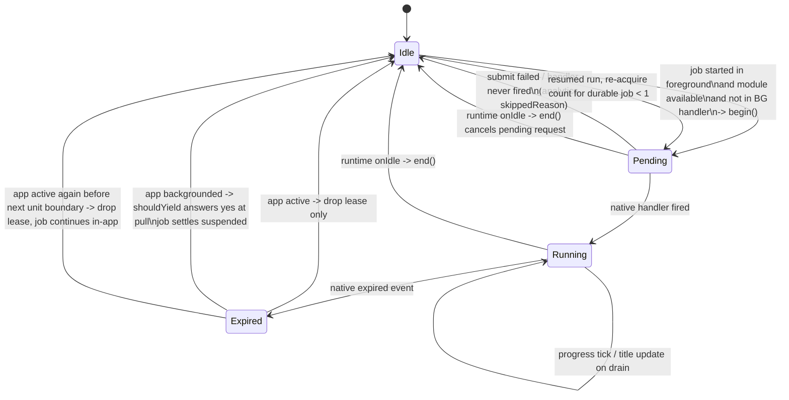
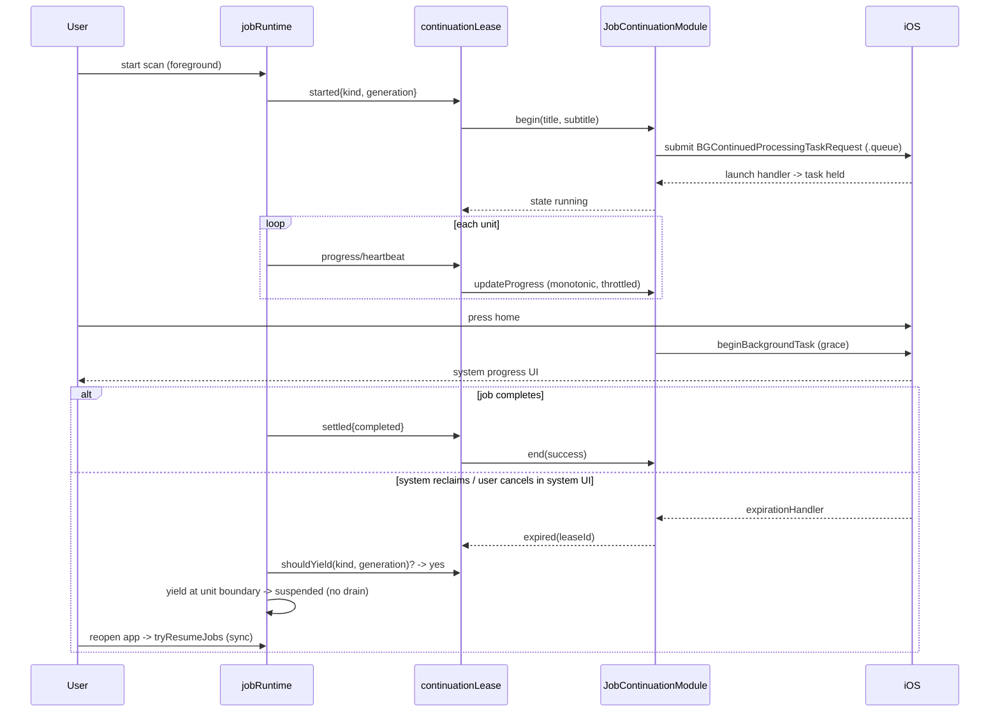

# Continue Library Jobs After Backgrounding - Plan

## Goal Capsule

- **Objective:** When a user starts a trip photo scan or a Guess Where build and then leaves the app (home, app switch, lock), the job keeps making progress instead of freezing until they come back, and the user can see that progress and cancel it from the system.
- **Means:** A local Swift Expo module that holds an iOS 26 `BGContinuedProcessingTask` lease for the running job, with a `UIApplication` background-task grace window beneath it, driven from the existing job runtime (KTD1, KTD2, KTD3).
- **Authority hierarchy:** This plan's Product Contract Rs win on behavior; KTDs win on mechanism within their cited Rs; `docs/plans/2026-08-23-001-feat-consolidate-photo-import-experience-plan.md` ("Execution status") is the authority on the current runtime shape; Apple's BackgroundTasks documentation is the authority on the native API (Sources).
- **Stop conditions:** Stop and surface if (a) on-device verification in U6 shows `BGContinuedProcessingTask` cannot be registered at launch or submitted from the app at all, (b) the EAS build image cannot compile iOS 26 symbols, or (c) any change requires aborting an in-flight job step (KTD3 forbids it).
- **Execution profile:** iOS-only native change plus TypeScript runtime work. Jest covers every TypeScript unit; Swift is verified by compile plus the on-device checklist in U6. Ships in a new `eas build` (the bundle must stay OTA-safe for binaries without the module, KTD10).
- **Tail ownership:** The implementer runs the mobile pre-commit checks (Verification Contract) and leaves the on-device checklist for Emerson to run on an iOS 26 device before the build is promoted.

---

## Product Contract

### Summary

Make an in-flight trip scan or Guess Where build keep running after the user backgrounds the app, on iOS, for both job kinds, by acquiring a continued-processing lease when the job starts and releasing it when the runtime goes idle. Keep the existing opportunistic `BGProcessingTask` and foreground auto-resume as the layers underneath. Relax the "continues when closed" copy only while a lease is actually held. No backend changes.

### Problem Frame

The April 2026 plan moved scan ownership out of the screen so a scan survives in-app navigation and auto-resumes on the next foreground. The August consolidation put both job kinds on one checkpointed runtime and registered an iOS `BGProcessingTask` (`mobile/src/services/jobs/backgroundJobTask.ts`). That task is opportunistic: iOS runs it overnight on charge, may never run it, and the user cannot trigger it. The moment the user presses home, JS freezes and the job stops until they return. For a 10k-photo library or a quiz build with several 90-second classification calls, that means the user must babysit the screen. The copy ban on "background" / "while the app is closed" (`mobile/src/constants/scanCopy.ts`) exists because nothing today can honor that promise.

iOS 26 added `BGContinuedProcessingTask`: a user-initiated, foreground-submitted task that the system keeps alive while the app reports progress, shows in a system progress UI with a cancel control, and can run for minutes. No Expo or React Native package wraps it as of August 2026, so the app needs its own native module. Older iOS only offers a roughly 30-second `beginBackgroundTask` grace window.

### Requirements

**Continuation behavior**

- R1. When a library job (trip scan or quiz build) is running and the user backgrounds the app on iOS 26 or later, the job continues to run under a system continued-processing task until it completes, the system ends it, or the user cancels it.
- R2. On iOS earlier than 26, backgrounding with a running job keeps the process alive for the system's grace window and then lets iOS freeze the app; the job resumes from its last checkpoint on the next foreground exactly as it does today.
- R3. A continued-processing lease is acquired only from the foreground and only for a job the user started or the app resumed on foreground; the opportunistic `BGProcessingTask` path never acquires one.
- R4. The system progress UI shows a job-specific title and a progress value that never decreases within a single job run; when a queued job takes over the lease, progress restarts for the new job.
- R5. A lease is held per runtime, not per job: when a queued job starts after the first settles, the same lease continues with an updated title.
- R6. Cancelling from the in-app banner or screen ends the lease immediately; cancelling from the system UI or a system reclaim stops the job at the next unit boundary with its checkpoint intact.
- R7. A job stopped by a lease expiration resumes on the next foreground through the existing resume path, and may re-acquire a lease at most once per job run.
- R8. Force-quit is out of scope for continuation: the job resumes on next launch from its checkpoint (already shipped).

**Runtime safety**

- R9. No code path aborts an in-flight job step because of a lease event; stopping happens only at unit boundaries through the runtime's yield seam.
- R10. A job that was suspended or frozen while backgrounded is never reported as stuck on the next foreground solely because time passed while the app was not active; the existing per-kind staleness thresholds (60 min scan, 30 min quiz, measured from the last checkpoint) still apply to a suspended job.
- R11. The JS bundle stays safe to publish over the air onto binaries that do not contain the native module: the module is optional at require time and every driver path is a no-op when it is absent.
- R12. Android behavior is unchanged.

**User-facing copy and measurement**

- R13. Copy that says the job keeps going after the user leaves the app renders only while a lease is running; the locked vocabulary and the banned phrases in `scanCopy` otherwise stay as they are.
- R14. Lease acquisition, handler latency, expiration, and resume outcomes are reported to analytics with the tier (`continued`, `grace`, `none`) so the reliability of each tier is measurable from the first build.

### Key Decisions

- **Backgrounded, not force-quit, is the target.** No iOS API survives a swipe-kill; the existing resume-on-launch covers it. Governs R8.
- **iOS-only.** Android stays on the existing WorkManager/opportunistic path; a foreground service is deferred. Governs R12.
- **The reliable tier is iOS 26+.** Older iOS gets the grace window only; the plan does not claim more for those devices. Governs R1, R2.

### Success Criteria

- On an iOS 26 device, a trip scan started in the foreground and then backgrounded for five minutes shows progress in the system UI and has advanced when the app is reopened (U6 checklist).
- On an iOS 26 device, cancelling from the system UI leaves the banner in a resumable state and the next foreground resumes the job without a "stuck" or "something went wrong" message.
- `npm test`, `npm run lint`, `npm run format:check`, and `npx tsc --noEmit` pass in `mobile/`.
- Analytics shows `lease_begin` / `lease_expired` / `lease_ended` events with tiers after the first TestFlight build.

### Scope Boundaries

- Out of scope: Android foreground service; Live Activities of our own; any change to clustering, place matching, quiz selection, or backend endpoints.
- Out of scope: making the trip-scan extraction pass internally checkpointed (it stays one unit; see Deferred).
- Out of scope: a new user-facing "paused" job phase; a suspended job keeps the `running` slice and resumes on foreground.

#### Deferred to Follow-Up Work

- **Page-cursor checkpoint inside the trip-scan extraction pass** (`mobile/src/services/photoImport/photoScanSteps.ts`): would let the scan and the quiz `setup` stage yield mid-pass. Not needed for continuation because a continued task runs until done, and the grace window does not suspend (KTD3).
- **Android foreground service** for the same behavior.
- **Retire the legacy `scan_in_progress` dual-write** (`jobDurableFlag.ts`) — one release after this build ships, per the consolidation plan.
- **`PersistentScanBanner` rename** to a jobs-level component (cosmetic, from the consolidation plan).
- **Distinguishing system-UI cancel from system reclaim** once Apple exposes it (FB21890081).

### Outstanding Questions

- Deferred (resolve on device in U6): does iOS 26 end a continued task whose progress stays flat for 60-90 s (quiz classification unit)? The synthetic progress in KTD6 is the mitigation; if it is insufficient, the fallback is a subtitle heartbeat.
- Deferred (resolve on device in U6): does the continued task keep running while the device is locked? Forum reports say it can stall; nothing in this plan depends on the answer, but the copy in U5 must not over-promise if it stalls.
- Deferred (resolve at build time in U6): is the EAS default iOS image for SDK 54 an Xcode 26 image? If not, pin `build.*.ios.image` in `mobile/eas.json`.

### Sources

- `docs/plans/2026-04-26-001-feat-background-photo-scan-plan.md` — in-app continuation and auto-resume; scoped OS-level execution out.
- `docs/plans/2026-08-23-001-feat-consolidate-photo-import-experience-plan.md` ("Execution status") — current runtime, PR5 `BGProcessingTask`, why the copy ban survived, legacy dual-write.
- Apple: `BGContinuedProcessingTaskRequest`, `BGContinuedProcessingTask`, "Performing long-running tasks on iOS and iPadOS", WWDC25 session 227 — https://developer.apple.com/documentation/backgroundtasks/bgcontinuedprocessingtaskrequest, https://developer.apple.com/videos/play/wwdc2025/227/
- Apple Developer Forums (DTS-answered): registration timing and once-per-process rule https://developer.apple.com/forums/thread/807370; wildcard identifiers do not match a single handler https://developer.apple.com/forums/thread/799126; progress update rate and indistinguishable expiration https://developer.apple.com/forums/thread/805088; locked-device and progress-composition reliability reports https://developer.apple.com/forums/thread/807957, https://developer.apple.com/forums/thread/809182
- Apple: `UIApplication.beginBackgroundTask(withName:expirationHandler:)` — https://developer.apple.com/documentation/uikit/uiapplication/beginbackgroundtask(withname:expirationhandler:)
- Expo: Module API (`OnAppEntersBackground`, `Events`, `requireOptionalNativeModule`), AppDelegate subscribers, local-module autolinking — https://docs.expo.dev/modules/module-api/, https://docs.expo.dev/modules/appdelegate-subscribers/
- `expo-background-task` scope (opportunistic only) — https://docs.expo.dev/versions/latest/sdk/background-task/

---

## Planning Contract

### Key Technical Decisions

- KTD1. **Build a local Expo module `mobile/modules/job-continuation/` (Swift, iOS only) instead of adopting a library.** No RN/Expo package wraps `BGContinuedProcessingTask` as of August 2026; `expo-background-task` is opportunistic only and `react-native-background-actions` falls back to the same 30 s window on iOS. The existing `mobile/modules/photo-tagger/` is the precedent for layout, autolinking, `requireOptionalNativeModule`, and `#available` guards. Governs R1, R2, R11.
- KTD2. **One static task identifier, registered at launch in an `ExpoAppDelegateSubscriber`, submitted with `.queue`.** Wildcard identifiers do not match a single registered handler, and registering the same identifier twice crashes, so per-job identifiers are out. Registration at `didFinishLaunching` is correct under both readings of Apple's timing rule. The identifier is added to `BGTaskSchedulerPermittedIdentifiers` through `ios.infoPlist` in `mobile/app.config.js`; the `expo-background-task` plugin appends to that array rather than overwriting it (verified in its plugin source), so no custom config plugin is needed. `UIBackgroundModes: processing` is already present from that plugin. Governs R1, R3.
- KTD3. **A lease event never aborts a step; it only requests a yield at the next unit boundary, and the grace-window expiry does not even do that.** Both pipelines treat `signal.aborted` as a user cancel and write a terminal checkpoint, so an abort on expiry would mark the job done. A continued-task expiration makes the driver answer "yes" to the runtime's pull-based `shouldYield(kind, generation)` for the run it leased — evaluated at pull time, and only while the app is still not active; if the app is back in the foreground before the next unit boundary, the driver drops the lease and answers no, so the job keeps running in-app instead of stranding as `suspended` with nothing to resume it. When it does yield, the runtime settles `suspended` with the breadcrumb kept. Grace-window expiry on iOS < 26 only ends the `UIBackgroundTask` assertion and lets iOS freeze the process — the trip scan is one unit, so a yield could not stop it anyway, and a frozen process that survives continues exactly where it was. An expiration that arrives while the app is active just drops the lease. One consequence of freezing instead of suspending: wall-clock budgets inside a unit keep running while frozen, so the quiz hunt's 90 s soft deadline (`quizHuntLoop.ts`) must count active time only (U2). Governs R2, R6, R9.
- KTD4. **Lease scope is the runtime, held across queue drain; re-acquire at most once per durable job after an expiration.** A second job draining while backgrounded cannot submit its own request (foreground-only), so the lease must outlive the first job and have its title updated. Cancel-from-system-UI and system reclaim are indistinguishable; one re-acquire keeps a thermal reclaim recoverable without re-showing the system UI indefinitely to a user who cancelled there. The re-acquire counter is keyed on `kind` alone: a resumed run always gets a new generation, and `runStart` rewrites the durable record's `startedAt` on every start, so neither is a stable identity. At most one job per kind runs at a time, so `kind` plus the reset rules is sufficient. It lives in driver memory, increments on a `resumed:true` start that follows an expiration, and resets on any non-resumed start or non-suspended settle for that kind. Governs R5, R7.
- KTD5. **Harden the resume path that this feature makes load-bearing.** `detectStuckJobs` ignores jobs that are not `isJobRunning` and the heartbeat is stamped on foreground before detection; staleness is measured from a persisted `lastCheckpointAt` rather than `startedAt`; `tryResumeJobs` runs synchronously in the foreground branch of `useAppStateTracking` instead of six frames into a cancellable stagger; `cancelJob`, `markJobFailed`, and `resetAllForUserChange` emit a synchronous `settled` lifecycle event so the lease ends before the in-flight 90 s unit notices the abort; `drainQueue` is skipped when the settling outcome is `suspended` (the next foreground `tryResumeJobs` starts the `waiting` job), and the runtime emits `idle` after every drain attempt — including one whose queued start failed — so the driver ends the lease on a fact the runtime owns rather than inferring it. Governs R6, R10.
- KTD6. **Feed the system a monotonic synthetic progress, not the raw store percentage.** Quiz stages restart at 0 and report 0 while `total` is unknown; scan segmentation emits nothing for minutes. The driver maps job kind + sub-phase + percentage onto stage-weighted, never-decreasing units and ticks on `heartbeat`; native throttles updates to at most 4/s (Apple DTS: 2-10/s). Governs R4.
- KTD7. **The driver is a JS module (`mobile/src/services/jobs/continuationLease.ts`) wired next to `registerBackgroundJobTask()` in `App.tsx`'s `useAppInitialization`, attached through one runtime driver-registry seam.** The runtime exposes `registerJobDriver({onStarted, onSettled, onIdle, shouldYield})`; several drivers may register and the loop yields when any driver says so. `onStarted` carries `{kind, generation, resumed, foregroundAtCall}`, `onSettled` carries `{kind, generation, outcome}`, and `shouldYield(kind, generation)` is pulled by the loop between units — so a driver never needs to clear a flag, and a stale request cannot match a new run. Generations become one process-monotonic counter that `resetAllForUserChange` does not reset. `backgroundJobTask.ts` adopts the same seam in place of `setYieldProvider`. Subscribing to store phase transitions instead would miss the synchronous cancel case (KTD5). Governs R3, R5, R6, R9.
- KTD8. **Capture foreground-ness at `startJob` call time, and treat `inactive` as foreground.** `startJob` awaits a SQLite write before the lifecycle event fires, and the Photos permission prompt puts AppState at `inactive` right after start; deciding on the post-write AppState would skip the lease for legitimate starts. Native `begin()` starts the `UIBackgroundTask` immediately if the application state is already `.background`. Governs R3.
- KTD9. **Copy ban stays; add one tier-gated hint.** A new `SCAN_COPY` function renders only while the lease state is `running` (not merely when the capability exists), is registered in the test's `allStrings()`, and avoids the literal banned words. Governs R13.
- KTD10. **Optional native module, lazy everywhere.** `requireOptionalNativeModule` on the JS side, `capabilities()` as the single feature probe, and no static import from the runtime — the same contract `backgroundJobTask.ts` follows for `expo-task-manager`. Governs R11.
- KTD11. **Analytics events** `lease_begin` (tier, kind, resumed, lowPowerMode, backgroundRefreshStatus, skippedReason), `lease_handler_fired` (latencyMs), `lease_expired` (tier, appState, elapsedMs, percentage), `lease_ended` (outcome), `job_continuation_capabilities` once per app launch with the `capabilities()` result (so "is the feature live on this build" is answerable without starting a job), plus `trip_scan_resumed` to mirror the existing `quiz_build_resumed`. Governs R14.
- KTD12. **Kill switch: `enableJobContinuationLease` in `mobile/src/config/features.ts`.** Same single-boolean pattern as `enablePhotoTagging`; `registerContinuationLease()` is a no-op when false. Because the driver is JS, flipping it ships over the air without a native build. Trigger: `lease_expired{tier:'continued'}` exceeding 30% of `lease_begin{tier:'continued'}` in the first 48 h after a build promotes, evaluated only once at least 20 `lease_begin{tier:'continued'}` have arrived from devices other than the checklist device, and read together with the `elapsedMs` distribution — `lease_expired` includes system-UI cancels, so the ratio is a review trigger, not an automatic flip. Any tester report of the system progress UI misbehaving is also a trigger. Governs R1, R14.
- KTD13. **Lease events carry a `leaseId`; the driver ignores events for any other lease and treats `expired` as idempotent.** Native events can arrive after a thaw, after the driver has already begun a new lease, or twice (continued expiry followed by grace expiry); a state check alone cannot tell them apart. `begin()` resolves the `leaseId`; `stateChanged`/`expired` echo it. Governs R6, R7.

### High-Level Technical Design

Component topology — who talks to whom:

```mermaid
flowchart TB
  subgraph JS
    RT[jobRuntime / jobRuntimeState<br/>driver registry: onStarted/onSettled/onIdle,<br/>pull shouldYield(kind, generation)]
    DRV[continuationLease.ts<br/>driver: acquire / progress / release]
    PRG[continuationProgress.ts<br/>monotonic synthetic progress]
    BGT[backgroundJobTask.ts<br/>BGProcessingTask handler]
    AST[useAppStateTracking<br/>foreground: tryResumeJobs sync]
    COPY[scanCopy + PersistentScanBanner<br/>tier-gated hint]
  end
  subgraph Native["modules/job-continuation (Swift)"]
    MOD[JobContinuationModule<br/>begin/updateProgress/updateTitle/end/capabilities<br/>OnAppEntersBackground -> UIBackgroundTask]
    SUB[AppDelegate subscriber<br/>registers static BG identifier at launch]
    TASK[BGContinuedProcessingTask<br/>iOS 26+]
  end
  RT -- onStarted/onSettled/onIdle --> DRV
  DRV -- progress --> PRG --> MOD
  DRV -- begin/updateTitle/end --> MOD
  MOD -- stateChanged/expired (leaseId) --> DRV
  RT -. pulls shouldYield .-> DRV
  RT -. pulls shouldYield .-> BGT
  SUB --> TASK
  MOD --> TASK
  AST --> RT
  DRV -- lease state --> COPY
```

Lease lifecycle — the state machine the driver owns:



Sequence — the main iOS 26 path:



### Assumptions

- The job kinds and their step granularity stay as they are on this branch; no new job kind lands before this ships.
- Apple's DTS statement that continued-processing identifiers are exempt from the launch-time registration rule is not relied upon; KTD2 registers at launch regardless.

### Implementation Constraints

- Swift in `mobile/modules/job-continuation/` is the source of truth; `mobile/ios/` is gitignored and regenerated.
- Every Jest test that touches `@services/jobs` must mock the module the way `backgroundJobTask.test.ts` and `useAppStateTracking.test.ts` already do; never import native modules at module scope in runtime code.
- Use `console.error`/`console.warn` for lease failures that must survive production stripping.
- File size standard: no source file over 500 lines; the driver, the progress mapper, and the native module each stay separate.

---

## Implementation Units

### U1. Runtime driver registry: lifecycle events and pull-based yield

**Goal:** Give drivers a synchronous view of job starts, settles, and idle, and a yield seam keyed to the run they observed.

**Requirements:** R3, R5, R6, R9 (KTD3, KTD5, KTD7, KTD8)

**Dependencies:** none

**Files:**
- `mobile/src/services/jobs/jobRuntimeState.ts` (modify: replace the single `yieldProvider` slot with a driver registry — `registerJobDriver(driver)` returning a remover; `shouldYieldNow(kind, generation)` asks every driver; process-monotonic `nextGeneration()`)
- `mobile/src/services/jobs/jobRuntime.ts` (modify: take generations from `nextGeneration()` so `resetAllForUserChange` never reuses one; re-check `slot.controller` after the durable write in `runStart` and release without emitting `onStarted` if a cancel landed during the write; emit `onStarted` after the write with `foregroundAtCall` captured at `startJob` entry; emit `onSettled` from `runJob`'s finally and synchronously from `cancelJob`, `markJobFailed`, `resetAllForUserChange`, terminal per generation; skip `drainQueue` on `suspended`; emit `onIdle` after each drain attempt when nothing is running or waiting)
- `mobile/src/services/jobs/backgroundJobTask.ts` (modify: register as a driver whose `shouldYield` returns `executingInBackground && expired`; export `isExecutingInBackgroundHandler()`)
- `mobile/src/services/jobs/index.ts` (modify: re-exports)
- `mobile/src/__tests__/services/jobs/jobRuntime.test.ts` (modify)
- `mobile/src/__tests__/services/jobs/backgroundJobTask.test.ts` (modify: mock the registry exports)

**Approach:**
1. A driver is `{onStarted?, onSettled?, onIdle?, onHeartbeat?, shouldYield?}`; the loop calls `shouldYieldNow(kind, generation)` between units and yields if any driver answers yes. No driver ever clears a flag.
2. `onStarted` carries `{kind, generation, resumed, foregroundAtCall}`; `onSettled` carries `{kind, generation, outcome}`; `onHeartbeat` carries `{kind, generation}` and fires from both `ctx.heartbeat()` and `ctx.emit()`; `onIdle` carries nothing.
3. `onSettled` is terminal for a generation: a later settle for the same generation is dropped, and a `runStart` whose controller was replaced during the durable write releases the slot without `onStarted` (the cancel already emitted the settle).
4. `resetAllForUserChange` sets a module-level reset-in-flight promise that `startJob` awaits before `runStart`, so a start issued mid-reset begins only after the reset resolves. It emits `onSettled` per running kind and then `onIdle`, since it always leaves nothing running or waiting.
5. `drainQueue` after a `suspended` outcome leaves the queued job `waiting`; U2's foreground resume drains it (this needs a small runtime export to peek at or drain the module-private queue).

**Patterns to follow:** `jobRuntimeState.ts` header comment on the leaf/driver split; `__resetJobRuntimeStateForTesting` and `__resetRuntimeForTesting` reset conventions; `makeDescriptor` helper in `jobRuntime.test.ts`.

**Test scenarios:**
- A started job emits `onStarted` once with the generation the slot holds, and `resumed:true` when started through the resumed path.
- A driver whose `shouldYield` answers yes for the current `(kind, generation)` makes the loop settle `suspended` at the next unit boundary; a driver answering yes only for a stale generation is ignored and the job completes.
- The `backgroundJobTask` driver behaves exactly like the previous `setYieldProvider` seam (existing 'background-task yield seam' tests pass with the same observable behavior).
- `cancelJob` emits `onSettled {outcome:'cancelled'}` synchronously before the in-flight step resolves, and no second settle fires for that generation when the step later returns.
- `cancelJob` during the durable write emits exactly one `onSettled` and no `onStarted`, and the slot is released.
- `markJobFailed` and `resetAllForUserChange` each emit `onSettled` for every running kind; `resetAllForUserChange` then emits `onIdle`; after it, the next start's generation is greater than every earlier one.
- A `startJob` issued while `resetAllForUserChange` is in flight begins only after the reset resolves.
- A driver receives `onHeartbeat` for the running generation on every `ctx.heartbeat()` and `ctx.emit()`, and never for a stale generation.
- With a job queued behind a running one: the first settling `completed` starts the second and emits `onStarted`; settling `suspended` leaves the second `waiting` and emits no `onStarted`.
- `onIdle` fires after the last job settles with an empty queue, and also when the queued start fails on its durable write.
- `isExecutingInBackgroundHandler()` is true only inside the BG-task handler.

**Verification:** All jobs tests pass; `shouldYieldNow` is never true with no registered driver; no import of `continuationLease` or any native module from runtime files.

### U2. Resume-path hardening

**Goal:** Make suspended and frozen jobs resume reliably instead of being failed as stuck or stale.

**Requirements:** R2, R7, R10 (KTD5)

**Dependencies:** U1

**Files:**
- `mobile/src/services/jobs/jobResume.ts` (modify: `detectStuckJobs` skips kinds that are not `isJobRunning`; staleness reads `lastCheckpointAt`, falling back to `startedAt` for legacy records; `tryResumeJobs` also drains a `waiting` job)
- `mobile/src/services/jobs/jobDurableFlag.ts` (modify: persist `lastCheckpointAt` in `saveDurableCheckpoint`; read it back in `readDurableJob`; keep the legacy dual-write untouched)
- `mobile/src/services/jobs/jobRuntime.ts` (modify: stamp `lastProgressAt` for running kinds on a new `markForegroundReturn()` called before stuck detection)
- `mobile/src/hooks/useAppStateTracking.ts` (modify: call `markForegroundReturn()` then `tryResumeJobs()` synchronously in the foreground branch, before the rAF stagger; keep `detectStuckJobs` in the stagger)
- `mobile/src/services/quiz/quizHuntLoop.ts` and `mobile/src/services/quiz/quizPoolSetup.ts` (modify: the 90 s hunt soft deadline compares against an executing-time accumulator owned by the hunt — a 1 s ticker that adds at most 2 s per tick, so a frozen gap contributes one capped tick while a backgrounded-but-running leased build keeps counting — in place of `Date.now() - huntStartedAt`; the runtime never reaches into quiz state)
- `mobile/src/services/analytics.ts` (modify: `tripScanResumed`, resume-gate-hit event)
- `mobile/src/__tests__/services/jobs/jobResume.test.ts` (modify)
- `mobile/src/__tests__/services/jobs/jobDurableFlag.test.ts` (modify)
- `mobile/src/__tests__/hooks/useAppStateTracking.test.ts` (modify: the wholesale `@services/jobs` mock gains `markForegroundReturn`)
- `mobile/src/__tests__/services/quiz/quizHuntLoop.test.ts` (modify or create)

**Approach:**
1. Stuck detection only considers kinds whose slice is `running` AND `isJobRunning(kind)` is true; a suspended job (running slice, not running) is left for resume.
2. Staleness uses the most recent of `lastCheckpointAt` and `startedAt`; thresholds stay 60/30 min.
3. The foreground branch resumes synchronously so the effect cleanup cannot cancel it; the `'inactive'`/`'background'` distinction already in the file is preserved.
4. Resume of a `waiting` job reuses `startJob` with the stored options and `resumed:true`.
5. The hunt deadline: a frozen-then-thawed process (KTD3) must not finalize at the minimum photo count because frozen minutes counted, while a leased build executing in the background keeps counting (the deadline caps classification spend, not user wait). The in-flight classify's 90 s `QUIZ_ELIGIBILITY_TIMEOUT_MS` firing on thaw is tolerated by the existing `MAX_CONSECUTIVE_FAILED_PASSES`.

**Patterns to follow:** existing gate table and parameterized tests in `jobResume.test.ts`; the `TODO(post-runtime-release)` comments in `jobDurableFlag.ts` stay.

**Test scenarios:**
- A job with a `running` slice, a 6-minute-old heartbeat, and `isJobRunning` false is not marked stuck, and `tryResumeJobs` resumes it.
- A job with a `running` slice and `isJobRunning` true with a 6-minute-old heartbeat is still marked stuck (existing behavior).
- A record started 40 minutes ago with `lastCheckpointAt` 2 minutes ago is not stale for the quiz (30 min threshold); a record with no `lastCheckpointAt` falls back to `startedAt`.
- `saveDurableCheckpoint` writes `lastCheckpointAt`; legacy records without it still parse.
- On `background → active`, `tryResumeJobs` is called before any rAF callback; a second foreground within the same frame does not cancel the first call.
- A `waiting` job with a cleared peer is started on foreground with `resumed:true`.
- `markForegroundReturn()` stamps `lastProgressAt` for every running kind so `detectStuckJobs` after it returns `[]`.
- Hunt loop with `finalizableCount >= QUIZ_MIN_PHOTOS` and a 3-minute frozen gap but under 90 s of executing time does not finalize; the same with 90 s of executing time does; a build executing 90 s while AppState is `background` also finalizes.

**Verification:** jobs, quiz-hunt, and app-state tests pass; a manual simulator check that backgrounding 6 minutes mid-quiz no longer shows "stopped making progress" on return.

### U3. Native module `job-continuation`

**Goal:** Expose `BGContinuedProcessingTask` (iOS 26+) and the `UIBackgroundTask` grace window to JS through a small, optional local Expo module.

**Requirements:** R1, R2, R4, R11 (KTD1, KTD2, KTD6, KTD10)

**Dependencies:** none (can proceed in parallel with U1/U2)

**Files:**
- `mobile/modules/job-continuation/expo-module.config.json` (create: `platforms: ["apple"]`, `apple.modules`, `apple.appDelegateSubscribers`)
- `mobile/modules/job-continuation/ios/JobContinuation.podspec` (create; mirror `PhotoTagger.podspec`, platform 15.1)
- `mobile/modules/job-continuation/ios/JobContinuationModule.swift` (create: `Name`, `Function("capabilities")`, `AsyncFunction("begin")`, `Function("updateProgress")`, `Function("updateTitle")`, `AsyncFunction("end")`, `Events("stateChanged", "expired")`, `OnAppEntersBackground`, `OnAppEntersForeground`, `OnDestroy`)
- `mobile/modules/job-continuation/ios/JobContinuationAppDelegateSubscriber.swift` (create: registers the static identifier's launch handler at `didFinishLaunching` under `#available(iOS 26, *)`, hands the task to a shared holder)
- `mobile/modules/job-continuation/ios/ContinuedTaskHolder.swift` (create: single static identifier, current task, pending flag, throttled `Progress` updates, expiration → event)
- `mobile/modules/job-continuation/index.ts` (create: `requireOptionalNativeModule`, `Platform.OS === 'ios'` guard, typed no-op surface, `isJobContinuationAvailable()`)
- `mobile/modules/job-continuation/src/JobContinuation.types.ts` (create)
- `mobile/app.config.js` (modify: `ios.infoPlist.BGTaskSchedulerPermittedIdentifiers: ['com.atlasi.app.continued-processing']`)
- `mobile/src/__tests__/modules/jobContinuation.test.ts` (create: absent-module contract)

**Approach:**
1. `capabilities()` returns `{continuedProcessing: boolean, graceWindow: true}`; `continuedProcessing` is true only on iOS 26+ with the identifier permitted.
2. `begin({title, subtitle})`: generate the `leaseId` natively before submitting so a `stateChanged` event can never race the resolved promise; if iOS 26+ and no task is pending or running, submit a `BGContinuedProcessingTaskRequest` with `.queue` and `.default` resources; resolve `{leaseId, state:'pending'}`, or `{leaseId, state:'grace-only', reason}` when submit throws. If the application state is already `.background`, start the `UIBackgroundTask` immediately.
3. The launch handler stores the task, sets the expiration handler, emits `stateChanged {leaseId, state:'running'}`. If it fires with no active lease (JS reloaded, or `end()` raced it), it completes the task immediately.
4. `updateProgress(completed, total)` sets `totalUnitCount` then `completedUnitCount`, coalesced to at most 4 updates per second, and only ever increasing.
5. `OnAppEntersBackground` while a lease is active starts a named `UIBackgroundTask`; its expiration handler ends the assertion and emits `expired {leaseId, tier:'grace'}` only when no continued task is running. `OnAppEntersForeground` ends the assertion.
6. The continued task's expiration handler emits `expired {leaseId, tier:'continued'}`, then completes the task (`success:false`) — all expirations are treated the same.
7. `end(success)`: cancels a pending request if the handler never fired, completes the task if running, ends any `UIBackgroundTask`. `OnDestroy` does the same so a dev reload never leaves an orphaned task.
8. One identifier, registered once per process; `begin` while a task is running resolves `'already-running'` with the current `leaseId` (the driver serializes end-before-begin across sign-out).

**Technical design (directional):** the module keeps three native states — `idle`, `pending`, `running` — and a grace-assertion flag orthogonal to them; JS mirrors the native state from `stateChanged` events rather than guessing.

**Patterns to follow:** `mobile/modules/photo-tagger/` for layout, podspec, `#available` guards, and the JS optional wrapper; `node_modules/expo-background-task/ios/BackgroundTaskAppDelegate.swift` for the subscriber shape; `docs/quiz-photo-pretagging-plan.md` on shipping a module inert.

**Execution note:** Swift cannot be unit-tested here; prefer a compile check of the pod (`xcodebuild` against `ios/Pods/Pods.xcodeproj`, as done for `PhotoTagger`) plus the U6 device checklist. Keep the JS surface the only thing Jest proves.

**Test scenarios:**
- With the native module absent (jest-expo default), `isJobContinuationAvailable()` is false, `capabilities()` returns `{continuedProcessing:false, graceWindow:false}`, and `begin`/`updateProgress`/`updateTitle`/`end` resolve without throwing.
- On Android (`Platform.OS` mocked), the wrapper never calls `requireOptionalNativeModule`.
- Event subscription helpers return a remover and do not throw when the module is absent.

**Verification:** a local `npx expo prebuild --clean` produces an `Info.plist` containing both `com.expo.modules.backgroundtask.processing` and `com.atlasi.app.continued-processing` under `BGTaskSchedulerPermittedIdentifiers` and `processing` under `UIBackgroundModes` (the authoritative check is the built artifact's plist in U6, since EAS prebuilds remotely); the pod compiles under Xcode 26; Jest module test passes.

### U4. Continuation lease driver and synthetic progress

**Goal:** Acquire, feed, and release the lease from runtime lifecycle events, and turn lease expirations into run-scoped yield requests.

**Requirements:** R1, R3, R4, R5, R6, R7, R11, R14 (KTD3, KTD4, KTD6, KTD7, KTD8, KTD10, KTD11, KTD12, KTD13)

**Dependencies:** U1, U3

**Files:**
- `mobile/src/services/jobs/continuationLease.ts` (create: `registerContinuationLease()` registering one runtime driver; lease state with current `leaseId`; expiry handling; re-acquire counter keyed on durable job identity; `shouldYield(kind, generation)` answering yes only for the leased run after an expiration while backgrounded)
- `mobile/src/services/jobs/continuationProgress.ts` (create: pure mapper from `{kind, phase, percentage, heartbeatCount}` to monotonic `{completed, total}`; stage weights per kind)
- `mobile/src/services/jobs/continuationTitles.ts` (create: title/subtitle per kind and phase, sourced from `SCAN_COPY` vocabulary)
- `mobile/src/config/features.ts` (modify: `enableJobContinuationLease`)
- `mobile/src/services/analytics.ts` (modify: lease events from KTD11)
- `mobile/App.tsx` (modify: call `registerContinuationLease()` right after `registerBackgroundJobTask()`; it fires `job_continuation_capabilities` once)
- `mobile/src/__tests__/services/jobs/continuationLease.test.ts` (create)
- `mobile/src/__tests__/services/jobs/continuationProgress.test.ts` (create)

**Approach:**
1. `registerContinuationLease()` returns immediately when `enableJobContinuationLease` is false or the module is unavailable (KTD12, KTD10).
2. On `onStarted`: skip (with `skippedReason`) when `isExecutingInBackgroundHandler()` is true, when `foregroundAtCall` is false, or when this kind's re-acquire counter is already 1 (KTD4); otherwise `begin()` with the kind's title, store the returned `leaseId`, and record the tier.
3. On a second `onStarted` while a lease is held (queue drain or overlap), call `updateTitle` instead of `begin`; the mapper restarts at 0 for the new job (R4).
4. On store progress or `onHeartbeat` for the leased kind, push the mapped monotonic progress; reset the mapper on a new generation.
5. On `expired`: ignore if the `leaseId` is not current or the lease is already expired; if `AppState` is active, drop the lease only; otherwise mark the leased `(kind, generation)` as expired. `shouldYield(kind, generation)` answers yes only when that run is marked AND `AppState.currentState` is not `active` at pull time; if the app is active again at pull time, drop the lease and answer no (KTD3). Record analytics once. Stop pushing progress.
6. On `onIdle`: `end(success)` where success is true when the last settle was `completed`; clear state. `onSettled` alone never ends the lease. Sign-out reaches this through the `onIdle` that `resetAllForUserChange` emits (U1); `end()` is awaited before any later `begin()`.
7. The mapper assigns each kind's sub-phases fixed cumulative weights (e.g. scan: counting → scanning → geocoding/segmenting → done; quiz: setup → scanning → checking → building → uploading → trips) and ticks a small amount per heartbeat inside a phase with unknown total, never exceeding the phase ceiling.

**Patterns to follow:** `backgroundJobTask.ts` for lazy wiring and the "no-op on binaries without the module" stance; `features.ts` flag comments; `quizBuildJob.publish()` for how quiz progress is shaped; `useStableCallback` if any React surface subscribes.

**Test scenarios:**
- Flag false → `registerContinuationLease()` registers no driver and touches no native call.
- Foreground start with the module available and tier `continued` → `begin` called once with the kind's title; `lease_begin` tracked with `tier:'continued'`.
- Start inside the BG-task handler → no `begin`, `lease_begin` tracked with `skippedReason:'bg-handler'`.
- Start with `foregroundAtCall:false` → no `begin`; start with AppState `inactive` at call → `begin`.
- Module absent → every lifecycle event is a no-op and nothing throws.
- Queue drain: second `onStarted` while held → `updateTitle` called, not `begin`; `onSettled` of the first job does not `end()`; `onIdle` does.
- `expired` while AppState `background` → `shouldYield(kind, leasedGeneration)` returns true and `shouldYield` for any other generation stays false; `expired` while `active` → `shouldYield` stays false, lease cleared.
- `expired` while `background`, then AppState becomes `active` before the runtime pulls → `shouldYield` for the leased generation returns false, the lease is dropped, and the job completes in-app.
- `expired` carrying a previous `leaseId` after a new `begin` → ignored; two `expired` events for the same lease → one yield request and one `lease_expired` event.
- After an expiration, the resumed run (`resumed:true`, new generation, a rewritten durable `startedAt`) acquires a lease once; a second expiration and resume of that kind yields no third `begin`; a fresh non-resumed start of the same kind resets the counter.
- Queue drain: after `updateTitle` for the second job, the next pushed progress is lower than the first job's final value (mapper restarted), and it is monotonic from there.
- Sign-out: `onSettled` then `onIdle` from the reset path → `end()` awaited before a subsequent `begin()` is issued.
- `onSettled {cancelled}` delivered synchronously followed by `onIdle` → `end(false)` called before the in-flight step resolves.
- `continuationProgress`: percentage going 40 → 0 on a quiz stage change yields a non-decreasing `completed`; heartbeats inside `scanning` (total 0) advance `completed` but never past the phase ceiling; scan `complete` maps to `completed === total`.
- `continuationProgress`: a new generation resets the mapper to 0.
- Progress pushes are coalesced (a burst of 50 emits in 100 ms results in at most a handful of `updateProgress` calls given fake timers).

**Verification:** lease tests pass with fake timers (`doNotFake: ['setImmediate']`); `App.tsx` registration is lazy and does not touch native at import; `npx tsc --noEmit` clean.

### U5. Tier-gated copy and banner hint

**Goal:** Tell the user they can leave the app only while a lease is actually running, without breaking the locked vocabulary.

**Requirements:** R13 (KTD9)

**Dependencies:** U4

**Files:**
- `mobile/src/constants/scanCopy.ts` (modify: `leaveHintWhileLeased(kind)`; no banned words)
- `mobile/src/__tests__/constants/scanCopy.test.ts` (modify: register the new strings in `allStrings()`; assert the hint is absent from `resumeHint`; keep the ban list unchanged)
- `mobile/src/components/photos/PersistentScanBanner.tsx` (modify: render the hint only when the driver's lease state is `running`)
- `mobile/src/stores/continuationLeaseStore.ts` (create: a separate, non-persisted zustand store holding `idle | pending | running | expired` — not `libraryJobStore`, which `resetLibraryJobStore()` wipes on cancel and sign-out mid-`end()`)
- `mobile/src/hooks/useContinuationLeaseState.ts` (create: selector hook over that store)
- `mobile/src/services/jobs/continuationLease.ts` (modify: publish lease state to the store)
- `mobile/src/__tests__/components/photos/PersistentScanBanner.test.tsx` (modify or create)

**Approach:**
1. The hint uses the existing "leave" vocabulary (screen-level "top of the screen" phrase stays) and says the job keeps going for a while after the user leaves and shows progress at the top of their screen; it never says "background" or "while the app is closed".
2. The banner subscribes to the lease state; `pending` and `expired` render today's copy.
3. Decide final wording only after the U6 lock-screen check so the hint does not over-promise on a locked device.

**Patterns to follow:** `SCAN_COPY` function-per-string shape and the byte-locked labels; `PersistentScanBanner` `useMemo` over `selectActiveJob`.

**Test scenarios:**
- Every new string passes the banned-phrase scan and the `allStrings()` enumeration includes it.
- Banner with lease state `running` shows the hint; with `idle`, `pending`, or `expired` it shows today's copy.
- `resumeHint` still matches `/pauses/` and `/picks up where it left off/`.

**Verification:** `scanCopy.test.ts` and banner tests pass; provenance test for retired literals still passes.

### U6. Build readiness, on-device checklist, and docs

**Goal:** Get the module into a real build, verify the behaviors this plan depends on, and record the new runtime layer in the docs.

**Requirements:** R1, R2, R4, R14 (KTD2, KTD6)

**Dependencies:** U3, U4, U5

**Files:**
- `mobile/eas.json` (modify only if needed: pin `build.preview.ios.image` / `build.production.ios.image` to an Xcode 26 image)
- `mobile/app.config.js` (modify if needed: `ios.buildNumber` — currently hardcoded `'1'`; sanity-check it against App Store Connect before the build)
- `docs/photo-import.md` (modify: add a "Library job runtime and continuation" section naming the three layers — continued task, grace window, opportunistic `BGProcessingTask` — and the resume gates)
- `docs/plans/2026-08-23-1325-on-device-continuation-checklist.md` (create: the checklist below, in the style of `docs/plans/2026-07-12-001-on-device-sweep-checklist.md`)
- `mobile/src/services/jobs/jobResume.ts` and `mobile/src/services/jobs/jobTypes.ts` (modify: header comments that say there is no OS-level background execution / `shouldYield` is always false become false with this work — rewrite them)
- `CLAUDE.md` (modify: add a one-line pointer to the continuation section)
- `docs/analytics.md` (modify: add the lease events)

**Approach:**
1. Build with the `preview` profile first (internal distribution, no App Store Connect build number consumed); confirm it compiles `BGContinuedProcessingTask`, pinning the image if the default is older than Xcode 26; only then build `production`.
2. Inspect `Info.plist` inside the downloaded build artifact (not the local prebuild) for both permitted identifiers and `UIBackgroundModes: processing`.
3. Within minutes of TestFlight install, confirm `job_continuation_capabilities` arrives in PostHog with `continuedProcessing: true` on an iOS 26 device.
4. Checklist items (iOS 26 device, then iOS 18 device if available): scan start → home → system UI shows title/progress → reopen after 5 min, progress advanced, no stuck alert; quiz build with a long classify unit under flat progress → does the task survive 90 s; lock the device mid-scan → does progress continue; cancel from system UI → reopen → job resumes once, second cancel does not re-show the UI; in-app cancel ends the system UI immediately; queued scan behind quiz while backgrounded → title changes; sign-out mid-lease; Low Power Mode; force-quit → next launch resumes; iOS 18: home → ~30 s later frozen → reopen resumes without stuck alert; iOS 18: backgrounded 3 min mid-hunt does not finalize at the minimum photo count; thaw-time network timeout produces at most one failed pass.
5. Record each outcome in the checklist and feed the two deferred questions back into U5 wording and KTD6 ticks if needed.

**Execution note:** This unit is packaging and runtime verification; smoke on device is the proof, not unit coverage.

**Test scenarios:** Test expectation: none -- packaging, documentation, and device verification; behavior is proven by U1-U5 tests and the checklist outcomes.

**Verification:** A TestFlight build containing the module; every checklist item has a recorded outcome; docs reviewed in the PR.

---

## Verification Contract

| Gate | Command (run in `mobile/`) | Applies to |
|---|---|---|
| Lint | `npm run lint` | all units |
| Format | `npm run format:check` | all units |
| Types | `npx tsc --noEmit` | all units |
| Unit tests | `npm test` (Node 20 locally before pushing; `doNotFake: ['setImmediate']` for fake timers) | U1-U5 |
| Native compile | `npx expo prebuild --clean` then build the `JobContinuation` pod target under Xcode 26 | U3 |
| Info.plist | inspect the `Info.plist` inside the downloaded EAS build artifact for both permitted identifiers and `UIBackgroundModes` (local prebuild is a pre-check only) | U3, U6 |
| Launch probe | `job_continuation_capabilities` event with `continuedProcessing: true` from an iOS 26 TestFlight install | U6 |
| Device | checklist in U6 on an iOS 26 device | U6 |

Swift changes additionally run `swiftlint lint --strict` only if the module is placed under a linted path; the share-extension lint command is scoped to `mobile/plugins/share-extension/` and does not cover `mobile/modules/`.

---

## Definition of Done

**Global**
- All Verification Contract gates pass.
- Publishing the JS bundle to the current TestFlight binary (without the module) changes no behavior: lease driver is inert, resume path improvements from U2 still apply.
- A new `eas build` contains the module and the permitted identifier; the U6 checklist is filled in.
- No abandoned experiment code remains (for example, a `suspendJob` abort path, a `requestYield` map, or an unused config plugin).
- `docs/photo-import.md`, `docs/analytics.md`, and `CLAUDE.md` updated.
- **Go/No-Go for promotion past the internal TestFlight group:** (a) the U6 checklist is fully recorded, (b) `lease_begin`, `lease_expired`, and `lease_ended` have each been observed with `tier:'continued'`, (c) the KTD12 ratio, under its minimum-sample and cancel-aware reading, does not fire in the first 24 h. Emerson owns the check.

**Per unit**
- U1: lifecycle events and run-scoped yields covered by tests; `setYieldProvider` removed or reduced to a test shim.
- U2: suspended/frozen jobs resume without stuck/stale false positives; sync foreground resume.
- U3: module autolinks, compiles, and is absent-safe in Jest.
- U4: lease state machine tests pass, analytics events emitted with tiers.
- U5: hint gated on `running`; copy tests green.
- U6: checklist outcomes recorded; open questions resolved or re-filed.

---

## Risks & Dependencies

- **Continued-task reliability on iOS 26.0-26.x.** Forum reports include locked-device stalls, slower CPU in background, and device-model inconsistency. Mitigation: the plan never removes the layers beneath it; analytics (R14) shows actual tier reliability; copy is gated on a running lease; the KTD12 kill switch turns the driver off over the air.
- **Flat progress may expire the task.** Mitigation: KTD6 synthetic progress; fallback of subtitle heartbeat if U6 shows expiry.
- **EAS image without the iOS 26 SDK** would fail to compile the module. Mitigation: U6 confirms or pins the image before the build.
- **Second `BGTaskScheduler` registrant** (`expo-background-task`) in the same process. Mitigation: distinct static identifier; the new module never touches `expo-background-task`'s expiration listener.
- **Quiz classification units of 50-90 s** cannot be shortened; on iOS < 26 the grace window ends mid-unit and the process freezes. Mitigation: KTD3 does not suspend on grace expiry; draft state is saved per upload already.
- **OTA hazard.** A static import of the module would brick older binaries at launch. Mitigation: KTD10, enforced by the absent-module test.
- **Accepted degradation.** An expiration that arrives while the app is active drops the lease (KTD3); that run has no path to a new lease until its next `onStarted`, so its next backgrounding falls to the grace tier. The re-acquire counter is in-memory, so a cold relaunch resets the once-per-kind cap.

### Rollout sequence

1. **OTA first.** U1, U2, U4, U5, and U3's TypeScript surface (`modules/job-continuation/index.ts`, types, absent-module test) ship over the air onto the current TestFlight binary via `npm run update:production` (its `verify:production` grep still applies); only U3's Swift files and the `app.config.js` change wait for step 2. The driver is inert without the module, so this validates the resume-path hardening in production with no native risk and exercises the module-absent no-op path (the KTD12 flag itself is first exercised on the native build).
2. **Then the native build.** U3 ships in a `preview`-profile `eas build` (pin the image if needed), goes through U6, and only then a `production` build. `runtimeVersion.policy: 'appVersion'` and an unchanged `version` mean both binaries share the OTA channel — which is exactly why KTD10 must hold.
3. **Rollback** is the KTD12 flag over the air; no native rollback is needed because the module does nothing until the driver calls it.

---

## System-Wide Impact

- Every library job start now emits driver lifecycle events; any future driver (Android foreground service) plugs into the same seam.
- `useAppStateTracking`'s foreground branch gains a synchronous resume call; its test mocks `@services/jobs` wholesale and must grow `markForegroundReturn`; `backgroundJobTask.test.ts` mocks the runtime narrowly and must grow the registry exports.
- `jobDurableFlag` records gain `lastCheckpointAt`; legacy records remain readable. A `suspended` settle keeps the breadcrumb, so `scan_in_progress='true'` now persists across a lease expiry — a rollback bundle would resume the scan from scratch without the checkpoint. The "retire dual-write" follow-up should know continuation extended its lifetime.
- Lease UI state lives in its own store (U5) because `resetLibraryJobStore()` is called from cancel and sign-out paths.
- `resetAllForUserChange` is `void`-called from the hook and awaits per-kind `clearDurableJob`; the synchronous settle emission and the driver's end-before-begin (U1 step 4, U4 step 7) sit on top of that pre-existing interleaving.
- Stale runtime header comments (`jobResume.ts`, `jobTypes.ts`) are corrected in U6.
- The analytics schema grows by the KTD11 events (PostHog, mobile only).
