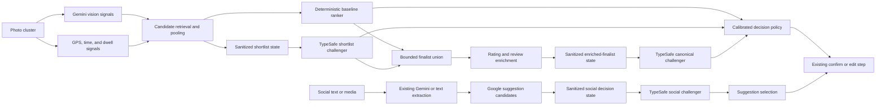
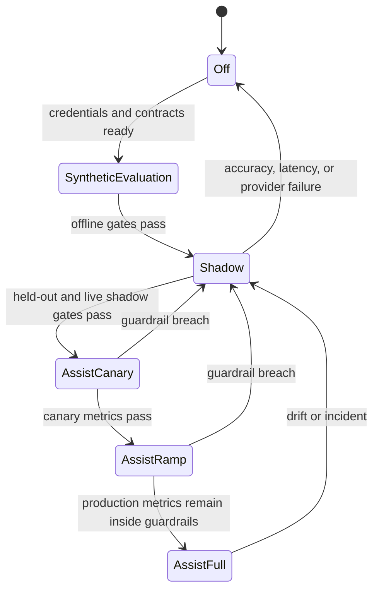
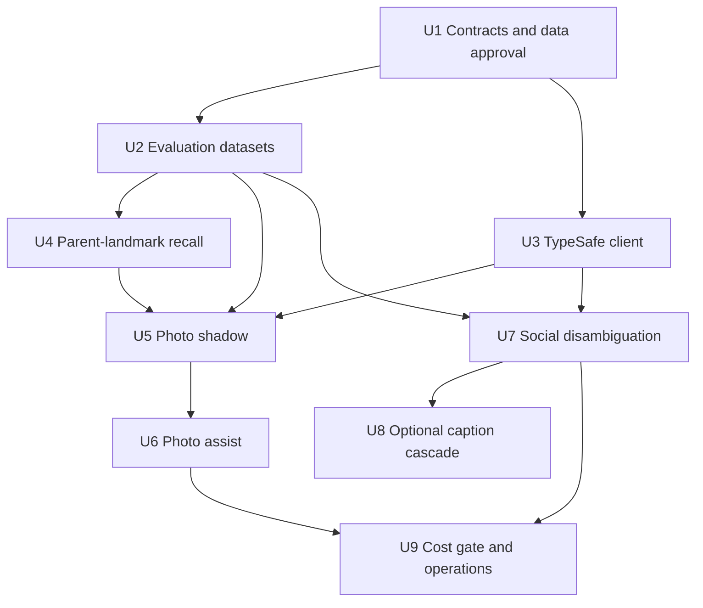

# TypeSafe-Assisted Canonical Place Selection

## Goal Capsule

- **Objective:** Increase the percentage of imported photo clusters and social posts that resolve to the place a traveler would recognize as the destination, especially large landmarks and archaeological sites whose GPS area contains many smaller points of interest.
- **Means:** Improve candidate recall and add a TypeSafe System One decision layer that judges the complete candidate set using evidence from the whole photo cluster or social post. Keep Gemini for visual understanding and free-form extraction.
- **Primary examples:** Photos throughout the Louvre should resolve to **Louvre Museum**, not a wing, shop, entrance, or nearby pin. Photos throughout the Tulum archaeological site should resolve to **Tulum Ruins**, not whichever internal feature is closest to one coordinate.
- **Authority:** The user request, the confirmed scope discussion on 2026-09-16, the current repository implementation, and the prior photo-matching investigations listed in Sources.
- **Stop conditions:** Do not enable TypeSafe decisions for users until a real labeled evaluation demonstrates an accuracy gain without a candidate-recall regression. Do not send Google Places content to TypeSafe until the intended payload has passed a Google Maps Platform terms review. Do not send user content until TypeSafe's retention and data-processing terms are acceptable.
- **Execution profile:** Build the measurement baseline first, add the integration in shadow mode, and enable each workflow independently only after its acceptance gates pass. Implementation is test-first where behavior changes.

## Product Contract

### Summary

The implementation will make canonical destination selection a cluster-level decision rather than a nearest-coordinate lookup. Candidate retrieval will be expanded so parent landmarks and destination-scale places are present to be judged. TypeSafe will adjudicate those candidates only if it adds measurable accuracy beyond the strengthened deterministic control and clears the contract gates.

### Problem Frame

The photo importer already combines GPS clusters, Google Places candidates, visual classification, distance, ratings, review counts, fame, and deterministic ranking. Its remaining failures are not one problem:

1. **Recall failures:** the correct parent destination never enters the candidate set.
2. **Specificity failures:** an internal feature, entrance, shop, wing, or nearby business beats the parent destination.
3. **Ranking failures:** raw GPS proximity outweighs stronger evidence that the photo cluster represents a well-known destination.
4. **Cluster-consistency failures:** photos from one visit are divided among adjacent places even though the collection should represent one destination.
5. **Confidence failures:** the system returns a confident-looking choice when the candidate set is weak or ambiguous.

The social ingest flow has a related but narrower issue. It generates place names with Gemini, queries Google Autocomplete, and generally resolves the first suggestion. When several Google candidates share a name or sit near one another, the surrounding caption, media evidence, and trip context are not used to select among them.

TypeSafe's Jev model can answer fixed `Choice`, `Score`, and `Noul` questions over structured text or JSON state. It cannot inspect an image or invent a place that is absent from the supplied choices. It is therefore a possible adjudicator, not a replacement for the current vision or candidate-generation models.

### Actors

- **A1 — Traveler importing photos:** expects a visit to resolve to the recognizable destination and can confirm or edit the suggestion.
- **A2 — Traveler sharing a TikTok or Instagram post:** expects the post's intended place or places to resolve correctly from caption and media evidence.
- **A3 — Operator:** needs accuracy, latency, cost, provider health, and fallback behavior to be measurable and independently controllable by workflow.

### Requirements

#### Canonical place behavior

- **R1:** Select the place that best represents the complete visit or post, not automatically the candidate closest to a single GPS coordinate.
- **R2:** Prefer a recognizable parent destination over an internal or incidental child point of interest when the cluster evidence represents the parent. Examples include Louvre Museum over a Louvre wing and Tulum Ruins over an internal structure.
- **R3:** Preserve a child place when the evidence specifically identifies it and it is a meaningful destination in its own right. Parent preference must not flatten a clearly photographed restaurant, hotel, exhibit, or separate attraction into a surrounding landmark.
- **R4:** Make one decision for the full photo cluster using its GPS spread, dwell time, timestamps, visual categories, detected text, business-name candidates, and the candidate evidence gathered across the cluster.
- **R5:** Treat distance as one signal. A small distance advantage must not overcome strong landmark identity, cluster coverage, category agreement, prominence, or name evidence.
- **R6:** Use rating and review count as prominence and reliability signals, not as proof of identity. High popularity must not cause a famous neighbor to absorb unrelated photos.
- **R7:** Represent uncertainty explicitly. The decision layer must be able to choose `none of these` when the right destination is missing or the supplied evidence is insufficient.

#### Candidate recall and canonicalization

- **R8:** Ensure destination-scale parent landmarks can enter the candidate set even when their centroid is farther from the cluster center than an internal point of interest.
- **R9:** Pool and deduplicate candidates found from cluster-center search, representative-photo coordinates, text search, detected names, and broader landmark-oriented search before final adjudication.
- **R10:** Attach parent/child and containment evidence when an authoritative source exposes it. Where no explicit hierarchy exists, derive only bounded features such as geographic containment, shared normalized name, type compatibility, and candidate scale; do not assert an invented hierarchy as fact.
- **R11:** Preserve the existing wider-search and rescue paths when no candidate is convincing. TypeSafe must never reduce recall by terminating search earlier than the current baseline until an independently evaluated follow-up proves that behavior safe.

#### TypeSafe's role

- **R12:** Use TypeSafe only for fixed-choice or fixed-criterion decisions over candidates and features supplied by Atlasi. Keep Gemini for images, video frames, carousel media, OCR interpretation, and free-form place-name generation.
- **R13:** Ask TypeSafe to return a candidate choice plus the complete probability distribution, including `none of these`, rather than accepting an uncalibrated confidence label.
- **R14:** Use separate decision questions for distinct concepts: whole-cluster fit, canonical destination fit, overly-specific child risk, and evidence sufficiency. Do not collapse every concept into one opaque score.
- **R15:** Calibrate thresholds on Atlasi's labeled data. TypeSafe confidence is model uncertainty over the supplied choices, not the probability that the real-world answer is correct.
- **R16:** Preserve the current deterministic matcher as the fallback and baseline. A TypeSafe timeout, rate limit, malformed response, or provider outage must not prevent a place suggestion.

#### Social ingest

- **R17:** Use the post title, bounded caption context, extracted candidate name, platform metadata, and Google suggestion set to disambiguate social-place candidates before fetching final place details.
- **R18:** Keep Gemini as the fallback when deterministic extraction cannot produce a complete candidate list, when a post contains multiple places, or when visual media is required.
- **R19:** Allow a later caption-only cascade to use TypeSafe as a verifier for cheaply over-generated text candidates, but ship that path only if it reduces Gemini calls without reducing multi-place recall.

#### User experience and safety

- **R20:** Keep the existing confirm/edit step. Neither TypeSafe nor the deterministic matcher may silently convert an uncertain suggestion into a saved place.
- **R21:** Do not expose TypeSafe-specific scores as user-facing truth. The first release changes suggestion quality and observability, not the picker interface.
- **R22:** Minimize the TypeSafe payload. Never send raw photos, video, exact photo coordinates, user IDs, access tokens, or unrelated caption text.
- **R23:** Version the provider model, question set, feature schema, and calibration policy in telemetry so an accuracy change can be attributed to a specific decision configuration.

### Key Flows

#### F1 — Photo cluster resolves to a canonical destination

1. The importer forms a photo cluster and extracts the existing GPS, time, dwell, and Gemini vision signals.
2. Candidate retrieval runs the current nearby and text searches plus the planned parent-landmark and multi-coordinate recall searches.
3. Atlasi normalizes and deduplicates the candidate world, then computes application-owned comparison features.
4. The deterministic matcher produces its baseline order.
5. In shadow mode, TypeSafe receives the bounded cluster state and fixed candidate choices but cannot affect the response.
6. After the evaluation gates pass, the decision policy combines deterministic evidence, TypeSafe probabilities, and the `none` result to choose a canonical destination or retain the baseline.
7. The traveler confirms or edits the suggestion.

#### F2 — Missing parent destination remains a recall problem

1. A cluster contains photos from a large landmark, but the first nearby search returns only internal points and adjacent businesses.
2. The retrieval stage broadens or adds landmark-oriented text candidates before TypeSafe is asked to decide.
3. If the parent still is not present, TypeSafe returns `none` or low separation between candidates.
4. Atlasi continues the existing rescue behavior or shows the best baseline suggestion for confirmation. It does not invent the landmark from a fixed-choice response.

#### F3 — Social post disambiguates Google suggestions

1. The current extraction path produces a candidate place name from text or Gemini media analysis.
2. Google Autocomplete returns multiple possible places.
3. TypeSafe compares the fixed suggestions against bounded post context and returns a distribution over suggestion IDs plus `none`.
4. Atlasi fetches details for one selected suggestion. Low-confidence or failed decisions retain the existing resolution path.
5. The traveler confirms or edits the result.

### Acceptance Examples

- **AE1 — Louvre parent:** A cluster spans galleries, courtyards, and entrances at the Louvre. `Louvre Museum` is in the candidate world. The final suggestion is Louvre Museum even when an internal POI is closer to the cluster centroid.
- **AE2 — Tulum parent:** A cluster covers several structures inside the Tulum archaeological zone. The final suggestion is the archaeological site, not the nearest named structure.
- **AE3 — Meaningful child preserved:** A cluster inside a large resort contains restaurant signage and dinner photos from one named restaurant. The restaurant remains eligible to beat the resort because text, category, and photo evidence identify it specifically.
- **AE4 — Famous-neighbor protection:** A low-review venue with an exact detected-name match is near a famous landmark with many reviews. The famous landmark does not win on popularity alone.
- **AE5 — Missing candidate:** None of the candidates represent the photographed attraction. The TypeSafe response favors `none`; the workflow follows the existing rescue or confirmation path rather than treating the nearest candidate as certain.
- **AE6 — Provider failure:** TypeSafe returns 429, 529, times out, or returns an invalid payload. The baseline matcher completes and the user can still confirm or edit the suggestion.
- **AE7 — Ambiguous social name:** A post names a restaurant shared by several cities, while caption or platform context identifies one city. The matching Google suggestion is selected before the details request.
- **AE8 — Visual-only social post:** A video contains the only usable place evidence. Gemini still processes the media; TypeSafe may judge the resulting candidate set but is not asked to inspect the frames.

### Success Criteria

The evaluation must report the metrics separately for photo import and social ingest. A workflow can ship even if the other does not qualify.

#### Dataset readiness

- Create a directional development set of at least 30 labeled examples per workflow before question design is tuned.
- Create a held-out release set of at least 100 real examples per workflow before TypeSafe can affect user-visible results.
- The photo release set must include at least 25 large-site or parent/child cases, plus dense-city, rural, detected-name, weak-vision, and missing-candidate cases.
- The social release set must include caption-only, video, carousel, ambiguous-name, multi-place, and no-place posts.
- Split tuning/calibration examples from release examples. Never set thresholds on the same examples used for the go/no-go result.

#### Accuracy gates

- Photo top-1 canonical-place accuracy for the complete approach improves by at least **5 absolute percentage points** over the current production matcher on the held-out set.
- The paired bootstrap 95% confidence interval for the photo top-1 difference has a lower bound of at least **0 percentage points**. If the sample cannot establish that result, remain in shadow mode and collect more labels.
- TypeSafe assist adds at least **2 absolute percentage points** over the control that uses the same expanded candidate world and enriched deterministic canonical policy without TypeSafe. Its paired bootstrap 95% confidence-interval lower bound must be at least **0 percentage points**. If this incremental gate fails, ship qualifying retrieval/ranking improvements without the vendor dependency.
- Parent-destination accuracy on the large-site subset improves by at least **10 absolute percentage points** with no more than one additional child-place false positive per 100 held-out clusters.
- Candidate recall—the correct canonical place appearing anywhere in the normalized candidate world—does not decline from the current baseline. Retrieval work should improve this metric; TypeSafe cannot compensate for a decline.
- Social top-1 resolved-place accuracy improves by at least **3 absolute percentage points**, with no reduction in multi-place recall.
- Human edit rate after a suggestion is shown decreases or remains neutral. This is a production corroboration metric, not a substitute for labeled accuracy.

#### Reliability, latency, and cost gates

- TypeSafe failures fall back successfully in 100% of injected failure tests.
- Shadow traffic demonstrates a TypeSafe request success rate of at least **99%** over seven consecutive days before assist mode. Provider availability is measured independently from fallback success.
- Added p95 latency is at most **750 ms** for the TypeSafe decision itself and at most **500 ms** on the social endpoint's overall p95. Photo-import wall time must not regress by more than 10% at the same batch size.
- Accuracy assist may ship without a cost reduction when it clears the accuracy and reliability gates.
- Any finalist-enrichment optimization must reduce paid Google Place Details calls per cold, uncached photo cluster by at least **20%** without reducing held-out top-1 accuracy.

### Scope Boundaries

#### In Scope

- Photo candidate retrieval for parent landmarks and destination-scale places.
- Cluster-level feature construction and canonical-place adjudication.
- A thin TypeSafe client boundary, typed responses, fallbacks, telemetry, and independent workflow flags.
- Offline evaluation, shadow comparison, calibration, staged rollout, and rollback.
- Social Google-suggestion disambiguation.
- A conditional caption-only verification cascade if its own evaluation qualifies.
- Documentation for data handling, operations, and ongoing accuracy measurement.

#### Deferred to Follow-Up Work

- Using TypeSafe uncertainty to stop radius expansion early. This could save Google calls but could also create new recall failures, so it requires a separate experiment after canonical selection is stable.
- Cross-cluster trip-level reasoning, such as using other days or itinerary entries to infer a place.
- Learning directly from user picker corrections. The current plan records outcome metrics but does not create a new training or feedback system.
- A dedicated source of authoritative POI containment relationships if Google Places does not expose enough hierarchy for the required cases.
- Picker redesign or user-facing explanations of why a place was suggested.
- Replacing Google Places with another geographic provider.
- TypeSafe image input if the vendor adds it later. This plan is based on the current text/JSON API.

#### Out of Scope

- Removing Gemini from image, video, or free-form place extraction.
- Sending raw media to TypeSafe.
- Automatically saving an unconfirmed place.
- Treating review count or model confidence as ground truth.
- Training or fine-tuning TypeSafe, Gemini, or another model on Google Maps content.

## Planning Contract

### Key Technical Decisions

#### KTD1 — TypeSafe is an adjudicator, not the geolocation engine

Jev will receive a fixed candidate set and bounded evidence. It will not generate place names or inspect media. This follows the API's current text/JSON state contract and prevents a provider experiment from replacing working Gemini capabilities. Covers R12-R16.

#### KTD2 — Canonical selection operates on the full cluster

Photo decisions will use one state object per cluster, not one model call per photo. The state summarizes coordinate spread, dwell time, visual evidence across representative photos, detected text, and candidate features. This directly supports the Louvre and Tulum cases while bounding latency and token use. Covers R1-R7.

#### KTD3 — Retrieval, deterministic canonicalization, and TypeSafe lift are measured separately

Evaluation will record whether the correct destination was retrieved before scoring top-1 accuracy. It will compare current production, expanded retrieval with a strengthened deterministic canonical policy, and the same control plus TypeSafe. Parent-landmark retrieval or deterministic gains can ship independently, and TypeSafe ships only when its incremental lift clears the dedicated gate. Covers R8-R11 and R15.

#### KTD4 — Use Choice for identity and Score/Noul for interpretable sub-judgments

The primary output is a `Choice` over opaque candidate keys plus `none`. Separate questions judge whole-cluster fit, parent-destination fit, overly-specific-child risk, and evidence sufficiency. The service stores the complete distributions. A single call may contain multiple independent questions, but no question is treated as calibrated until measured on Atlasi data. Covers R7 and R13-R15.

#### KTD5 — The policy is an ensemble with a conservative abstention path

TypeSafe does not replace the deterministic score. Assist mode may change the winner only when a calibrated policy accepts the TypeSafe distribution and the candidate is not blocked by deterministic identity safeguards. Low separation, a strong `none` result, provider failure, or a schema/version mismatch retains the baseline or triggers existing rescue behavior. Covers R3-R7 and R16.

#### KTD6 — Review signals express prominence, not correctness

Use Bayesian-adjusted rating and log-scaled review count only after a bounded finalist set has been enriched, matching the repository's current cost-aware handling. The wide search intentionally omits these Enterprise-tier fields, so missing review data must remain `unknown`, never zero. Combine enriched prominence with category, cluster coverage, name evidence, and parent/child risk. Never send review text. Covers R5-R6.

#### KTD7 — Do not persist a fabricated place hierarchy

Candidate relationships will carry provenance: authoritative parent/containment data when available, otherwise derived hints with their inputs recorded. The decision layer may use a derived child-risk feature, but Atlasi will not save that inference as a permanent map fact. Covers R2-R3 and R10.

#### KTD8 — Use a thin internal HTTP client instead of the initial TypeSafe Python SDK

The public Python SDK released on 2026-09-14 and introduced a breaking change on 2026-09-15. The System One API is a small HTTP surface, and the backend already uses asynchronous `httpx` clients with explicit Pydantic validation. Isolate the endpoint behind an Atlasi client so adopting the SDK later is a local change. Prefer an immutable Jev model identifier when TypeSafe exposes one. If only `jev-latest` is available, record the returned identifier, keep the alias in shadow by default after an observed change, and require requalification before assist resumes. Covers R16 and R23.

#### KTD9 — Shadow results cannot change output or downstream Google calls

Shadow mode records the challenger decision against the same candidate world, but the baseline still selects finalists, performs enrichment, and returns the response. This produces an unbiased paired comparison. Cost optimizations begin only after accuracy qualification. Covers R15-R16.

#### KTD10 — Social integration begins after candidate extraction

The first social experiment judges Google Autocomplete suggestions using existing extracted names and bounded post context. It does not alter media extraction. A pre-Gemini caption cascade is a later, separately gated unit because candidate over-generation can silently reduce multi-place recall. Covers R17-R19.

#### KTD11 — Google terms review is a release blocker, not a documentation footnote

Google's current terms restrict exporting, caching, creating content from, and using Google Maps content to improve machine-learning systems. The plan does not assume that third-party inference over place names, types, ratings, coordinates, or a candidate list returned by Google is permitted. Before TypeSafe receives any Google-derived field or choice, the team must approve the exact payload with counsel or a Google Maps Platform representative. If approval is not obtained, TypeSafe photo assist remains blocked unless the candidate world and comparison features come from an independently licensed source; U4's non-TypeSafe retrieval and deterministic-ranking improvements can still ship. The social experiment is limited to candidate verification before any Google response enters the state. Covers R22.

#### KTD12 — Provider privacy approval precedes live user content

TypeSafe states that input is not used to train or fine-tune its models, but its public privacy policy does not provide a zero-retention commitment or a complete production data-processing contract. The first prototype uses synthetic or specifically prepared evaluation state. Live captions or photo-derived state require approved retention, subprocessors, security, deletion, and incident terms. Covers R22.

#### KTD13 — Use two decision stages because review evidence is paid finalist data

The first TypeSafe stage proposes a shortlist from the wide candidate world using fields already available from search, cluster evidence, vision evidence, and missing-value-aware cached signals. A bounded union of baseline finalists, TypeSafe finalists, exact-name matches, and plausible parent landmarks is then eligible for live rating enrichment. The second TypeSafe stage makes the canonical choice among enriched finalists using rating and review-count bands. Pure shadow mode never expands the baseline enrichment union; offline evaluation measures the value and added Google cost of doing so before assist mode may add a finalist. Covers R5-R6, R9, and R13-R16.

### High-Level Technical Design

The diagrams show responsibilities and decision boundaries. They are directional, not implementation specifications.

#### Component and data-flow sketch



#### Photo decision sequence

```mermaid
sequenceDiagram
    participant Import as Photo importer
    participant Retrieve as Candidate retrieval
    participant Base as Baseline ranker
    participant Jev as TypeSafe
    participant Policy as Decision policy
    participant User as Traveler

    Import->>Retrieve: cluster evidence
    Retrieve-->>Import: normalized candidate world
    par Initial judgments
        Import->>Base: candidates and cluster signals
        Import->>Jev: sanitized shortlist state and fixed choices
    end
    Base-->>Import: baseline finalists and factors
    Jev-->>Import: proposed finalists or failure
    Import->>Import: bounded finalist union
    Import->>Import: enrich approved finalists with rating signals
    Import->>Jev: enriched-finalist state and fixed choices
    Jev-->>Policy: shortlist and canonical distributions or failure
    Base-->>Policy: baseline order and factors
    alt shadow mode
        Policy-->>Import: baseline result; log comparison
    else assist mode and calibrated acceptance
        Policy-->>Import: accepted canonical candidate
    else abstain or failure
        Policy-->>Import: baseline or existing rescue path
    end
    Import-->>User: confirm or edit suggestion
```

#### Rollout state machine



#### Decision matrix

| Candidate state | TypeSafe state | Mode | Outcome |
|---|---|---|---|
| Correct candidate absent | Any | Any | Continue baseline retrieval/rescue; never fabricate a choice |
| Correct candidate present | Unavailable or invalid | Shadow/assist | Use deterministic baseline |
| Correct candidate present | Valid but below calibrated separation | Assist | Baseline or existing confirmation path |
| Correct candidate present | Valid and policy-qualified | Shadow | Log challenger only |
| Correct candidate present | Valid and policy-qualified | Assist | Allow canonical candidate to replace baseline winner |
| Candidate set ambiguous | `none` probability above calibrated threshold | Assist | Preserve rescue/uncertain behavior; do not force a place |

### Decision State Contract

The state should contain only bounded evidence needed to compare candidates. Exact field names remain an implementation detail, but the semantic groups are fixed:

- **Cluster evidence:** photo count, coordinate spread in meters, duration bucket, representative visual categories, detected text tokens, candidate business names from vision, and whether the evidence is consistent across photos.
- **Candidate identity:** opaque request-local key, normalized display label only if contractually allowed, broad place types, and source provenance.
- **Candidate geometry:** distance bands to cluster center and representative coordinates; coverage of the cluster envelope; never raw user coordinates.
- **Candidate prominence:** before enrichment, an explicit unknown value plus only already-cached or search-tier signals; after bounded enrichment, log-scaled review-count and Bayesian rating bands. Include institution/landmark classification and the current fame signal only when contractually allowed.
- **Candidate specificity:** authoritative containment if available; otherwise separately labeled hints for name overlap, spatial containment, micro-POI type, and likely parent scale.
- **Baseline evidence:** deterministic rank position and factor bands. Do not send a single baseline score without its major factor directions, because it would make TypeSafe a noisy restatement of the existing ranker.
- **Abstention:** every identity choice includes `none of these` as an option.

The TypeSafe service returns request metadata, model version, question-set version, per-question distributions, latency, and an error classification. Downstream code receives no raw provider response.

### Question Design

Start with questions that can be evaluated independently:

1. **Shortlist choice:** Before paid enrichment, “Which candidates could best represent the destination visited across this complete photo cluster?” Options are request-local candidate keys plus `none`; the policy retains a bounded top set, not only one winner.
2. **Canonical identity choice:** After finalist enrichment, “Which candidate best represents the destination visited across this complete photo cluster?” Options are enriched request-local candidate keys plus `none`.
3. **Whole-cluster fit:** A Score question per leading candidate: “How well does this candidate explain the complete cluster rather than a single photo or coordinate?”
4. **Destination-scale fit:** A Score question per leading candidate: “How likely is this the traveler-recognizable destination represented by the cluster?”
5. **Over-specific child risk:** A Noul question per leading candidate: “Is this candidate likely an internal feature or incidental place within a better parent destination in the choices?”
6. **Evidence sufficiency:** A Noul question: “Is the supplied evidence sufficient to choose among these candidates?”

The experiment should compare this multi-question design with a minimal Choice-only design. Keep the smaller design if sub-questions do not improve held-out calibration or explain production failures. Do not treat the question text as a prompt to tune indefinitely; version it and require held-out evidence for every change.

### Cost Model

Published list prices change and free caps or negotiated volume can alter the bill. Record actual request counts and invoice-tier cost in the evaluation rather than relying only on this estimate.

As researched on 2026-09-16:

- TypeSafe advertises Jev input at **$0.042 per million input tokens** with no output-token charge.
- OpenRouter lists Gemini 2.5 Flash-Lite at **$0.10 per million input tokens** and **$0.40 per million output tokens**.
- Google Maps Platform lists first paid-tier prices after free caps of approximately **$32 per 1,000 Nearby Search Pro calls**, **$32 per 1,000 Text Search Pro calls**, **$17 per 1,000 Place Details Pro calls**, and **$20 per 1,000 Place Details Enterprise calls**.

The TypeSafe inference itself is unlikely to create a material saving over Gemini Flash-Lite because both are inexpensive at the expected state size. The meaningful savings would come from avoiding downstream Google calls:

```text
estimated cold-cluster cost =
    nearby_search_calls × current Nearby Search tier price
  + text_search_calls × current Text Search tier price
  + rating_enrichment_calls × current Place Details tier price
  + TypeSafe input tokens × current Jev input price
  + Gemini image/text usage
```

The first cost experiment should be conservative: when the deterministic ranker and the pre-enrichment TypeSafe shortlist agree strongly and `none` is low, enrich only the top candidate. Ambiguous or disagreeing cases enrich the bounded finalist union and use the second-stage canonical decision. This optimization remains off until the accuracy layer qualifies and must pass its own no-regression gate.

### Alternatives Considered

#### Replace Gemini with TypeSafe

Rejected. The current System One API accepts text or JSON state and fixed questions. It cannot inspect photos or video and cannot generate a missing place name.

#### Use TypeSafe only as another numeric score in the current ranker

Rejected as the primary design. A single opaque score would hide the distinction between identity, parent-scale fit, child specificity, and missing-candidate uncertainty. Separate questions produce evidence that can be calibrated and debugged.

#### Let TypeSafe stop search as soon as confidence is high

Deferred. This has cost potential but directly risks the recall failures the feature is meant to fix.

#### Choose the most-reviewed nearby place

Rejected. Review count can indicate destination scale, but it also creates famous-neighbor errors. It must be balanced against detected identity, category, distance plausibility, and whole-cluster coverage.

#### Improve retrieval and deterministic canonical scoring without TypeSafe

Retained as the required control and fallback, not rejected. Better candidate recall, parent/child features, and cluster-wide deterministic scoring may deliver most of the value without a new provider. If TypeSafe does not add its required incremental held-out gain, these qualifying improvements can ship alone.

#### Fine-tune a new multimodal geolocation model

Rejected for this phase. It requires a much larger labeled corpus and does not address candidate retrieval or Google place resolution. The current plan can produce the evaluation data needed to reconsider it later.

### System-Wide Impact

#### Service boundaries and interfaces

- The new `place_decision` service owns provider transport, state validation, questions, decision policies, and provider metrics. Photo and social services supply workflow-specific state through small adapters; they do not import TypeSafe response types directly.
- The photo matcher remains the owner of candidate retrieval, deterministic ranking, Google enrichment, and the returned suggestion. This preserves the current mixin boundaries and avoids a reverse dependency from the shared decision service into `place_matcher` or `photo_vision`.
- The social extractor remains the owner of free-form extraction and Google resolution. TypeSafe receives an already-bounded choice problem and cannot call Google or Gemini itself.
- Off and shadow modes require no client response-schema change. Assist mode changes only which existing place candidate is selected. The current confirmation/edit contracts remain stable.
- Candidate provenance, relationship hints, and model factors stay internal unless a later picker-explanation feature defines a public schema.

#### State, persistence, and caching

- TypeSafe requests and responses are request-scoped in the initial release. Do not create a persistent decision cache until retention, invalidation, question-version, and Google-content rules are resolved.
- Persist only aggregate operational metrics and version identifiers. Sampled evaluation records must use the approved private dataset path and retention policy from U1.
- Existing Google place-details caches keep their current ownership and merge behavior. A TypeSafe result never writes Google fields or inferred parent relationships into those caches.
- Calibration policies are deployable versioned artifacts tied to a model version, question version, feature schema, and dataset report. An unmatched version combination cannot enter assist mode.

#### Failure and concurrency behavior

- Photo shadow work starts only after the candidate world is available. It may overlap with baseline finalist work, but cancellation or failure cannot cancel the baseline task.
- Photo assist waits only within its configured budget. At deadline, the baseline result proceeds and the late provider result is discarded rather than mutating a completed request.
- Social suggestion adjudication is on the interactive path between Autocomplete and Place Details. Its tighter end-to-end budget takes precedence over provider retries.
- Circuit-breaking and provider-disable behavior is shared at the client boundary, while off/shadow/assist modes remain workflow-specific.
- TypeSafe backpressure must not consume the concurrency budget reserved for Google or Gemini calls. The integration needs its own bounded semaphore or equivalent admission control.

#### Privacy and security boundary

- Treat caption excerpts, detected text, visit timing, and location-derived features as user-derived sensitive state even when direct identifiers are removed.
- Validate state size, choice count, string length, character set, and request-local candidate keys before transport. Provider text must never be interpreted as code, a URL to fetch, or an instruction to another model.
- API credentials remain server-side secrets. Errors shown to clients stay provider-neutral and do not include request state, upstream response bodies, or credentials.
- Exact coordinates remain inside Atlasi and Google workflows. TypeSafe receives distance or coverage bands only after the payload is approved.

#### Billing and operational capacity

- Attribute Google calls to baseline retrieval, parent-landmark retrieval, text rescue, finalist enrichment, and backfill. Without this split, a TypeSafe-related cost change cannot be explained.
- Meter TypeSafe request count, token input, retries, and rejected state locally even if vendor billing data is delayed.
- Evaluate worst-case fan-out for large imports. There is at most one TypeSafe decision request per eligible photo cluster per question-set version, not one request per image or candidate.
- No database migration is expected for the first release. If implementation discovers that calibration or audit requirements need persistence, add a separate migration unit and data-retention review rather than hiding it inside the provider client.

## Implementation Units

### U1 — Establish vendor, data, and legal prerequisites

**Outcome:** The experiment has an approved payload and cannot accidentally send live user or restricted Google data before review.

**Requirements:** R22-R23; KTD11-KTD12.

**Files:**

- `docs/environment-setup.md`
- `docs/place-extraction-algorithm.md`
- `docs/photo-import.md`
- `backend/.env.example`
- `backend/app/core/config.py`

**Approach:**

- Document the exact proposed TypeSafe state fields, their source, retention need, and whether each derives from Google, the user, Gemini, or Atlasi calculations.
- Obtain a written internal decision or provider clarification covering Google Places inference use, export, caching, and derived features. Record the outcome without copying legal advice into code comments.
- Confirm TypeSafe retention, subprocessors, hosting region, deletion, incident response, and whether API inputs are logged. Require a DPA or equivalent approval if live content is in scope.
- Add configuration for credentials, endpoint, exact model version, request timeout, and independent photo/social modes. Default every environment to off.
- Define a payload allowlist. Provider debug logging stays disabled in production because request bodies may contain user-derived text.

**Test scenarios:** None—this unit is governance and configuration scaffolding. Configuration validation is covered in U3.

**Dependencies:** None. This unit blocks live-data work but does not block synthetic interface development.

### U2 — Build trustworthy photo and social evaluation sets

**Outcome:** Baseline, retrieval, TypeSafe, and combined-policy accuracy can be compared on real examples without tuning on the release set.

**Requirements:** R1-R19 and the Dataset readiness criteria; KTD3.

**Files:**

- `backend/scripts/eval_place_matcher.py`
- `backend/docs/place_matcher_eval_dataset.sample.json`
- `backend/docs/how-to-label-place-matcher-dataset.md`
- `backend/scripts/eval_social_place_extraction.py` (new)
- `backend/docs/social_place_eval_dataset.sample.json` (new)
- `backend/docs/how-to-label-social-place-dataset.md` (new)
- `backend/tests/scripts/test_eval_place_matcher.py`
- `backend/tests/scripts/test_eval_social_place_extraction.py` (new)
- `docs/photo-match-measurement-runbook.md`

**Approach:**

- Extend photo labels to distinguish canonical parent, acceptable child, wrong child, famous neighbor, and correct candidate absent. Store the expected Google place ID where licensing permits and a stable human label for evaluation review.
- Record candidate recall before ranking, baseline top-1/top-3, canonical top-1, parent/child error class, model abstention, latency, and request counts.
- Produce three paired photo arms: current production behavior; expanded retrieval plus deterministic canonicalization; and the identical candidate world plus TypeSafe. Attribute gains and added Google calls to the arm that introduced them.
- Add a social evaluation harness that replays prepared extraction inputs and Google suggestion fixtures without publishing user captions in the repository.
- Keep real datasets in the project's approved private data location. Commit only schemas, synthetic samples, and redacted aggregate reports.
- Freeze the held-out release split before question wording or thresholds are tuned.

**Test scenarios:**

1. A Louvre fixture contains the canonical parent and two internal POIs; the harness records candidate recall as true and scores only the parent as canonical top-1.
2. A missing-parent fixture records recall as false separately from ranking accuracy.
3. An acceptable-child fixture does not count the child as an error when the label explicitly permits it.
4. A social fixture with two same-name suggestions scores the selected place ID, not string similarity alone.
5. A multi-place social fixture reports per-place precision and recall rather than forcing one top-1 label.
6. Dataset validation rejects examples that leak raw images, unredacted captions, or omit the split designation.

**Dependencies:** U1 defines the approved data location and retention rules.

### U3 — Add the isolated TypeSafe decision client

**Outcome:** Backend services can request typed, versioned decisions with bounded retries and deterministic failure behavior.

**Requirements:** R12-R16, R22-R23; KTD1, KTD4, KTD8.

**Files:**

- `backend/app/services/place_decision/__init__.py` (new)
- `backend/app/services/place_decision/client.py` (new)
- `backend/app/services/place_decision/models.py` (new)
- `backend/app/services/place_decision/questions.py` (new)
- `backend/app/services/place_decision/instrumentation.py` (new)
- `backend/app/core/config.py`
- `backend/.env.example`
- `backend/tests/services/place_decision/test_client.py` (new)
- `backend/tests/services/place_decision/test_questions.py` (new)

**Approach:**

- Use the existing asynchronous HTTP-client pattern and validate every response into internal models.
- Limit retries to transient 429 and 529 responses within the workflow's latency budget. Do not retry validation, authentication, or other permanent errors.
- Enforce the state allowlist and size limits before transport. Redact state from logs and exception text.
- Return an explicit unavailable result for timeouts, exhausted retry budget, malformed distributions, missing `none`, model-version mismatch, or disabled mode.
- Record provider latency, response status class, question version, model version, state-size band, and token usage when returned. Do not record raw state.

**Test scenarios:**

1. A valid Choice response with probabilities summing within tolerance is converted to the internal result.
2. A response missing `none`, containing an unknown candidate key, or carrying invalid probabilities is rejected and marked unavailable.
3. A 429 or 529 receives bounded retry and succeeds within budget; retry exhaustion returns unavailable.
4. Authentication and schema errors are not retried.
5. Timeout cancellation releases the HTTP request and returns unavailable.
6. Logs and metrics contain versions and timing but no candidate names, caption text, coordinates, or API key.
7. Off mode performs no network request.

**Dependencies:** U1 supplies configuration and payload policy.

### U4 — Improve parent-landmark candidate recall

**Outcome:** Large canonical destinations are present in the photo candidate world often enough for any ranker to select them.

**Requirements:** R8-R11; KTD2-KTD3, KTD7.

**Files:**

- `backend/app/services/place_matcher/_matcher_search.py`
- `backend/app/services/place_matcher/_matcher_cluster_processing.py`
- `backend/app/services/place_matcher/constants.py`
- `backend/app/services/place_matcher/models.py`
- `backend/app/core/config.py`
- `backend/tests/services/test_place_matcher.py`
- `backend/tests/services/test_place_matcher_canonical.py` (new)
- `backend/tests/services/test_place_matcher_retrieval.py` (new)

**Approach:**

- Measure the current candidate world at the cluster center and representative coordinates before adding calls.
- Pool candidates across the cluster envelope when the cluster spans a large site. Deduplicate by place ID and preserve which coordinate/search strategy found each candidate.
- Add a landmark-oriented retrieval path when vision category, detected text, cluster size, or current candidates indicate a large institution, archaeological site, park, or destination-scale attraction.
- Add parent candidates from authoritative containment data when available. Otherwise compute labeled hints from spatial coverage, candidate type, normalized-name overlap, and scale without persisting them as facts.
- Preserve the current radius and text-rescue ceilings initially. New calls require separate counters so their recall gain and cost are visible.

**Test scenarios:**

1. A cluster spanning Louvre coordinates produces a candidate world containing Louvre Museum even when no representative coordinate is nearest its centroid.
2. A Tulum cluster pools a site-level candidate found by one search with internal candidates found by another and deduplicates repeated IDs.
3. A compact restaurant cluster does not trigger unnecessary parent-landmark expansion.
4. A search failure at one representative coordinate preserves candidates returned by the other searches.
5. Derived containment hints are labeled as inferred and are not written to the persistent place-details cache as authoritative hierarchy.
6. Request counters distinguish baseline calls from parent-recall calls and the evaluation reports marginal recall per added call.

**Dependencies:** U2 provides the recall metric and large-site cases. This unit can be evaluated before U3.

### U5 — Run the photo canonical-place challenger in shadow mode

**Outcome:** Every eligible photo cluster has a paired baseline and TypeSafe judgment without any user-visible or Google-call change.

**Requirements:** R1-R16, R20-R23; KTD2, KTD4-KTD6, KTD9, KTD13.

**Files:**

- `backend/app/services/place_matcher/_matcher_cluster_processing.py`
- `backend/app/services/place_matcher/_matcher_ranking.py`
- `backend/app/services/place_matcher/instrumentation.py`
- `backend/app/services/place_decision/photo_state.py` (new)
- `backend/app/services/place_decision/policy.py` (new)
- `backend/tests/services/place_decision/test_photo_state.py` (new)
- `backend/tests/services/place_decision/test_policy.py` (new)
- `backend/tests/services/test_place_matcher_canonical.py` (new)

**Approach:**

- Construct a sanitized shortlist state after the candidate world is finalized and before finalist enrichment can hide wide-pass alternatives.
- Use distance bands and cluster-coverage features instead of exact coordinates. Treat review and rating as unknown in the shortlist state unless an approved cache entry already contains them.
- Submit a bounded shortlist that always contains the baseline leaders, exact name matches, plausible parent landmarks, and any candidate needed to evaluate an observed baseline failure. Stay within TypeSafe's 255-choice limit by deterministic pruning and record why candidates were retained.
- Run the shortlist challenger concurrently with work that does not depend on its result where possible. Pure shadow mode records its proposed finalists but does not add them to the baseline enrichment set.
- After baseline finalist enrichment, construct a second state containing the available rating and review bands and run the canonical challenger over those already-enriched candidates. This second shadow comparison still adds no Google calls.
- Use the offline harness to evaluate a bounded expanded finalist union with prepared or freshly approved Google responses. Production shadow metrics must distinguish candidates the baseline enriched from candidates that would require a new paid call.
- Log paired shortlist overlap, canonical top-1, parent/child classification, missing prominence, `none` probability, winner margin, per-question distributions, and failure class using request-scoped opaque candidate keys.

**Test scenarios:**

1. Louvre state includes cluster-wide evidence and the parent plus internal candidates, while excluding raw coordinates and photos.
2. Candidate pruning retains the baseline winner, an exact name match, and a plausible parent even when more than 255 raw candidates exist.
3. Shadow TypeSafe disagreement does not change the returned place, finalist-enrichment set, or number of Google calls.
4. A TypeSafe timeout produces the same matcher output as off mode.
5. A strong `none` result is recorded but does not terminate baseline rescue in shadow mode.
6. A candidate whose review data was not enriched remains unknown rather than receiving a zero-review penalty.
7. A highly reviewed famous neighbor receives prominence evidence in the canonical stage but cannot masquerade as an exact detected-name match.

**Dependencies:** U2-U4.

### U6 — Calibrate and enable photo assist mode

**Outcome:** TypeSafe can improve the canonical winner only under a measured policy with immediate fallback and rollback.

**Requirements:** R1-R16, R20-R23; all photo Success Criteria; KTD5-KTD6, KTD9, KTD13.

**Files:**

- `backend/app/services/place_decision/policy.py`
- `backend/app/services/place_matcher/_matcher_cluster_processing.py`
- `backend/app/services/place_matcher/instrumentation.py`
- `backend/app/core/config.py`
- `backend/scripts/eval_place_matcher.py`
- `backend/tests/services/place_decision/test_policy.py`
- `backend/tests/services/test_place_matcher_canonical.py` (new)
- `docs/photo-match-measurement-runbook.md`

**Approach:**

- Fit shortlist, probability, margin, abstention, and agreement thresholds on the calibration split. Publish the frozen two-stage policy and evaluate it once on the held-out split.
- Use the first-stage result to add candidates to a hard-capped finalist union only after the offline evaluation proves the incremental Google calls improve canonical accuracy. Preserve the baseline finalists, exact-name candidates, and plausible parents required by the policy.
- Use the enriched second-stage result for canonical winner replacement. Keep deterministic exact-name safeguards, implausible-distance bounds, and child-specific evidence as hard constraints until data justifies changing them.
- Roll out through off, shadow, small assist canary, staged assist, and full assist states. Photo mode is independent from social mode.
- Add an operator kill switch that takes effect without a deploy and returns immediately to the deterministic path.
- Compare overall accuracy and the large-site, famous-neighbor, weak-vision, and child-specific slices before each rollout step.

**Test scenarios:**

1. A policy-qualified parent enters the finalist union, receives rating enrichment, and replaces a closer internal candidate after the canonical stage.
2. A child with exact signage and category agreement is not replaced by its more-reviewed parent when the child-preservation constraint applies.
3. Low winner margin or high `none` probability retains the baseline or rescue path.
4. An implausibly distant famous landmark cannot win on review count and TypeSafe probability alone.
5. A provider model identity change or question-version drift disables assist until the matching policy version is requalified.
6. The kill switch prevents new TypeSafe requests and preserves successful baseline output.

**Dependencies:** U5 shadow data must pass the accuracy, latency, reliability, and contract gates.

### U7 — Disambiguate social Google suggestions

**Outcome:** Social posts use their context to choose among Google suggestions instead of automatically taking the first result.

**Requirements:** R12-R18, R20-R23; KTD10-KTD12.

**Files:**

- `backend/app/services/place_extractor/google_places_client.py`
- `backend/app/services/place_extractor/extractor.py`
- `backend/app/services/place_extractor/llm_client.py`
- `backend/app/services/extraction_orchestrator.py`
- `backend/app/services/place_decision/social_state.py` (new)
- `backend/app/services/place_decision/policy.py`
- `backend/tests/services/place_decision/test_social_state.py` (new)
- `backend/tests/services/test_place_extractor.py`
- `backend/tests/services/test_extraction_orchestrator.py`

**Approach:**

- Preserve the ordered Autocomplete suggestion set long enough to evaluate it instead of selecting index zero immediately.
- Build a bounded state from the extracted candidate name, city/country hints, entry type, platform metadata, and the minimum caption excerpt needed for disambiguation.
- Start in shadow mode against the current first-suggestion behavior. Record whether TypeSafe's selection matches the label without fetching extra details.
- In assist mode, fetch details for only the selected suggestion. A TypeSafe failure or abstention retains the current resolver.
- When U1 does not approve Google suggestion fields for third-party inference, limit the state to pre-Google candidate verification and do not enable this unit as designed.

**Test scenarios:**

1. Same-name restaurants in different cities are disambiguated by bounded city context.
2. An exact extracted place with no useful location context causes abstention rather than arbitrary confidence.
3. Shadow mode still fetches details for the baseline first suggestion and adds no Google call.
4. Assist mode fetches one Place Details result for the policy-qualified suggestion.
5. A TypeSafe error follows the current first-suggestion path within the endpoint latency budget.
6. Multi-place extraction keeps independent candidate sets and does not collapse the post to one place.

**Dependencies:** U1-U3 and U2's social dataset. It does not depend on photo assist mode.

### U8 — Evaluate the optional caption-only cost cascade

**Outcome:** Easy text posts can bypass Gemini only when deterministic candidate over-generation plus TypeSafe verification matches the existing extraction quality.

**Requirements:** R17-R19, R22-R23; KTD10.

**Files:**

- `backend/app/services/place_extractor/candidate_extraction.py`
- `backend/app/services/place_extractor/llm_client.py`
- `backend/app/services/extraction_orchestrator.py`
- `backend/app/services/place_decision/social_state.py`
- `backend/scripts/eval_social_place_extraction.py`
- `backend/tests/services/test_place_extractor.py`
- `backend/tests/services/test_extraction_orchestrator.py`

**Approach:**

- Over-generate plausible place spans with deterministic parsing and existing metadata; TypeSafe verifies each candidate and predicts entry type in one bounded request.
- Route zero candidates, weak verification, suspected multi-place truncation, or visual-dependency cases to the current Gemini text/media flow.
- Compare the cascade with the current extractor on the frozen held-out social set. Enable it only if exact-place accuracy and multi-place recall clear their gates while Gemini calls fall materially.
- Keep this mode independent from U7. Suggestion disambiguation can ship even if caption extraction does not.

**Test scenarios:**

1. A simple caption with one explicit venue is verified and resolved without a Gemini text call.
2. A caption containing several venue-like spans retains all qualified candidates or falls back; it does not silently keep one.
3. A caption with no extractable name invokes Gemini.
4. A post whose place is visible only in media invokes the current multimodal path.
5. TypeSafe failure invokes Gemini and does not fail the ingest request.
6. The evaluation counts avoided Gemini calls and rejects the cascade if multi-place recall declines.

**Dependencies:** U7 may proceed first, but this unit needs U2-U3 and its own release gate.

### U9 — Gate finalist enrichment and complete operations

**Outcome:** Qualified high-agreement photo cases use fewer paid rating-enrichment calls, and operators can detect drift or disable any TypeSafe path safely.

**Requirements:** R16, R20-R23 and the cost/reliability criteria; KTD5-KTD6, KTD9, KTD13.

**Files:**

- `backend/app/services/place_matcher/_matcher_cluster_processing.py`
- `backend/app/services/place_matcher/_matcher_search.py`
- `backend/app/services/place_matcher/instrumentation.py`
- `backend/app/services/place_decision/instrumentation.py`
- `backend/app/core/config.py`
- `backend/tests/services/test_place_matcher_canonical.py` (new)
- `backend/tests/services/test_place_matcher_retrieval.py` (new)
- `docs/photo-match-measurement-runbook.md`
- `docs/photo-import.md`
- `docs/place-extraction-algorithm.md`

**Approach:**

- Enrich one finalist only when the deterministic winner and calibrated pre-enrichment TypeSafe shortlist agree, winner separation clears the frozen threshold, `none` is low, and no exact-name, parent, or child-specific challenger needs enrichment.
- For disagreement or ambiguous parent/child relationships, enrich the hard-capped union required by KTD13 rather than an unbounded TypeSafe set. Baseline fallback cases retain at least the current top-three behavior.
- Dashboard request volume, estimated invoice-tier cost, cache hit rate, latency, fallback rate, provider error class, baseline/challenger disagreement, parent/child errors, and post-suggestion user edits.
- Alert on version changes, increased abstention, accuracy-proxy drift, fallback spikes, or cost regression. Run the labeled benchmark before every model, question, retrieval, or policy change.
- Update architecture and measurement documentation to distinguish candidate recall, baseline ranking, TypeSafe adjudication, and user confirmation.

**Test scenarios:**

1. Strong deterministic/TypeSafe agreement enriches only one finalist and returns the same correct place as top-three enrichment.
2. Disagreement or high `none` probability preserves at least top-three enrichment and includes only policy-qualified additions within the hard cap.
3. An exact-name challenger outside the initial leader prevents premature single-finalist enrichment.
4. Cache hits avoid paid calls and are counted separately from policy-based avoidance.
5. A provider outage increases fallback metrics but not photo-import failures.
6. Changing the configured model or question version without a matching calibration policy forces shadow or off mode.

**Dependencies:** U6 must qualify before the cost gate can affect production. U7-U8 provide the corresponding social operational signals.

## Delivery Sequence



Recommended release slices:

1. **Measurement foundation:** U1-U2.
2. **Recall improvement without TypeSafe:** U4, measured against the frozen baseline.
3. **Provider integration and photo shadow:** U3 and U5.
4. **Independent accuracy releases:** U6 for photo and U7 for social, each only if qualified.
5. **Optional savings:** U8 and U9 after accuracy is stable.

## Verification Contract

### Automated Verification

- Run the focused unit and service tests named in each implementation unit.
- Run the complete backend test suite after each release slice.
- Run Ruff formatting and lint checks on every backend change.
- Validate the evaluation schemas and ensure committed fixtures contain no live user content.
- Inject TypeSafe timeouts, 401, 422, 429, 529, malformed JSON, unknown candidate keys, invalid distributions, and version mismatches.
- Verify off and shadow modes are behaviorally identical to the baseline response and Google-call pattern.

### Offline Evaluation

Produce one versioned report per workflow containing:

- Dataset version, split, case counts, and label-review status.
- Candidate recall and marginal recall from each new retrieval strategy.
- Current-production, strengthened-deterministic, TypeSafe-only, and combined-policy top-1/top-3 accuracy.
- Canonical parent accuracy and child-specific precision.
- Results by dense-city, rural, large-site, famous-neighbor, detected-name, weak-vision, missing-candidate, and provider-failure slices.
- Calibration plots or bins for top probability, winner margin, and `none` probability.
- Paired bootstrap confidence intervals for accuracy differences.
- Google, Gemini, and TypeSafe request counts; cold-cache and observed-cache cost estimates.
- Median, p95, and p99 provider and end-to-end latency.

### Shadow Verification

- Run at least seven consecutive days at representative traffic before assist canary.
- Compare baseline/challenger disagreements through sampled, privacy-approved human review.
- Confirm fallback behavior during a controlled TypeSafe disablement.
- Confirm no raw provider payload, caption, coordinate, or candidate name appears in production logs.
- Confirm shadow mode does not change returned places or the number and tier of Google calls.

### Canary and Rollout Verification

- Start each workflow with an independent small canary.
- Review accuracy proxies, edit rate, latency, fallback rate, and cost daily during ramp.
- Automatically or operationally return to shadow when a guardrail breaches.
- Re-run the frozen held-out benchmark before any model, question, feature-schema, threshold, or retrieval-policy change.

## Risks and Mitigations

| Risk | Consequence | Mitigation |
|---|---|---|
| Correct place is absent from candidates | TypeSafe confidently chooses the wrong available option | Measure candidate recall separately, include `none`, and complete U4 before assist |
| Parent preference becomes too aggressive | Restaurants, exhibits, or distinct attractions collapse into a large site | Preserve child-specific evidence and evaluate acceptable-child cases separately |
| Review count creates popularity bias | Famous neighbor beats the photographed place | Use log/Bayesian bands, cap influence, retain identity safeguards, and measure famous-neighbor slice |
| TypeSafe confidence is mistaken for correctness | Uncalibrated thresholds cause silent regressions | Calibrate on Atlasi data, freeze a held-out set, and version the policy |
| Early-access API or model changes | Responses or behavior drift without code changes | Internal client boundary, exact model version, response validation, shadow fallback, version alerts |
| Provider outage or rate limiting | Added latency or failed suggestions | Tight timeout, bounded retry, deterministic fallback, independent kill switch |
| Google terms prohibit the payload | Contract violation | U1 legal review; do not send Google-derived content until approved; retain restricted-payload fallback |
| TypeSafe retention terms are insufficient | User-derived data handled outside policy | Synthetic prototype, payload minimization, DPA/retention approval before live content |
| Serial inference increases social latency | Share flow becomes slower despite better selection | Parallelize safe work, enforce latency budget, and keep first-result fallback |
| Evaluation set is synthetic or overfit | Apparent gains do not transfer to travel photos | Real private labels, frozen held-out split, slice analysis, production edit-rate corroboration |
| Added search calls erase cost savings | Better recall costs more than adjudication saves | Attribute calls by strategy and ship retrieval additions only when recall gain justifies cost |
| Child hierarchy is inferred incorrectly | Wrong canonicalization and polluted data | Preserve provenance and never persist inferred hierarchy as authoritative |

## Definition of Done

- [ ] U1's Google and TypeSafe data-handling gates are resolved and documented.
- [ ] Real photo and social development and held-out datasets meet the coverage requirements.
- [ ] Candidate recall and ranking accuracy are reported separately.
- [ ] Parent-landmark retrieval improves or preserves overall candidate recall within its cost budget.
- [ ] The TypeSafe client validates distributions, redacts state, versions every decision, and falls back cleanly.
- [ ] Photo shadow mode is behaviorally identical to the baseline and has at least seven days of representative evidence.
- [ ] Photo assist clears every photo accuracy, reliability, latency, and safety gate before rollout.
- [ ] Social suggestion disambiguation clears its independent gates before rollout.
- [ ] The caption-only cascade remains off unless it preserves exact-place and multi-place accuracy while materially reducing Gemini calls.
- [ ] Single-finalist enrichment remains off unless it reduces paid details calls by at least 20% without held-out accuracy loss.
- [ ] Operators can switch each workflow independently among off, shadow, and assist behavior without a deploy.
- [ ] Documentation explains the final architecture, payload policy, metrics, costs, rollback, and re-evaluation procedure.
- [ ] The existing confirm/edit experience remains available in every success, abstention, and fallback path.

## Sources

### Repository

- [`docs/app-overview.md`](../app-overview.md) — current social ingest and photo-import product flows.
- [`docs/brainstorms/2026-02-11-photo-matching-accuracy-brainstorm.md`](../brainstorms/2026-02-11-photo-matching-accuracy-brainstorm.md) — earlier vision-assisted matching direction and cost target.
- [`docs/plans/2026-02-11-feat-photo-matching-accuracy-plan.md`](2026-02-11-feat-photo-matching-accuracy-plan.md) — prior implementation plan.
- [`docs/plans/2026-06-10-001-fix-photo-match-quality-remediation-plan.md`](2026-06-10-001-fix-photo-match-quality-remediation-plan.md) — later matcher remediation work.
- [`docs/photo-match-quality-diagnostic.md`](../photo-match-quality-diagnostic.md) — observed recall, filter, ranking, and signal failure modes.
- [`docs/photo-match-signal-investigation.md`](../photo-match-signal-investigation.md) — current signal behavior and candidate diagnostics.
- [`docs/photo-match-measurement-runbook.md`](../photo-match-measurement-runbook.md) — existing benchmark procedure.
- [`docs/photo-import.md`](../photo-import.md) — current photo-import implementation notes.
- [`docs/place-extraction-algorithm.md`](../place-extraction-algorithm.md) — current social extraction cascade.
- `backend/app/services/place_matcher/` — current retrieval, deterministic ranking, finalist enrichment, caching, and instrumentation.
- `backend/app/services/photo_vision/classifier.py` — Gemini photo classification and detected-name evidence.
- `backend/app/services/place_extractor/` — social candidate extraction and Google resolution.
- `backend/app/services/extraction_orchestrator.py` — social text/media fallback orchestration.

### TypeSafe

- [Introduction](https://docs.typesafe.ai/introduction) — System One and Jev positioning.
- [Quickstart](https://docs.typesafe.ai/introduction/quickstart) — API endpoint, state, model, and question structure.
- [State](https://docs.typesafe.ai/concepts/state) — supported text and structured state.
- [API reference](https://docs.typesafe.ai/api) — primitives and error responses.
- [Choice primitive](https://docs.typesafe.ai/primitives/choice) — fixed choices and escape-hatch recommendation.
- [Confidence](https://docs.typesafe.ai/confidence) — probability-derived confidence and domain calibration guidance.
- [Pre-parsed value extraction cookbook](https://docs.typesafe.ai/cookbooks/pre_parsed_value_extraction_cookbook) — candidates must be generated before TypeSafe selects among them.
- [Reranking cookbook](https://docs.typesafe.ai/cookbooks/rerank_typesafe) — vendor example of shortlist reranking; its legal-domain gains are not treated as evidence for Atlasi.
- [SDE cascade cookbook](https://docs.typesafe.ai/cookbooks/sde_cascade) — cheap extraction, verification, and expensive fallback pattern.
- [Python SDK changelog](https://docs.typesafe.ai/sdk/python/changelog) — release age and early breaking change.
- [System One launch post](https://typesafe.ai/blog/introducing-system-one-models-and-jev) — current text/structured-state limitation, vendor pricing, and vendor performance claims.
- [Privacy policy](https://typesafe.ai/legal/privacy-policy) — training-use statement and current retention language.
- [Status page](https://status.typesafe.ai/) — provider availability history; not a substitute for an SLA.

### Google and Current Model Pricing

- [Google Maps Platform Terms of Service](https://cloud.google.com/maps-platform/terms) — restrictions on export, caching, derived content, and ML/AI use.
- [Google Maps Platform service-specific terms](https://cloud.google.com/maps-platform/terms/maps-service-terms) — Places-specific permitted use and caching rules.
- [Places API policies and attribution](https://developers.google.com/maps/documentation/places/web-service/policies) — storage, place ID, display, and attribution requirements.
- [Places data-field tiers](https://developers.google.com/maps/documentation/places/web-service/data-fields) — SKU-triggering fields.
- [Google Maps Platform pricing](https://developers.google.com/maps/billing-and-pricing/pricing) — current Places SKU prices.
- [Gemini 2.5 Flash-Lite on OpenRouter](https://openrouter.ai/google/gemini-2.5-flash-lite/pricing) — current model pricing used for the comparison.
