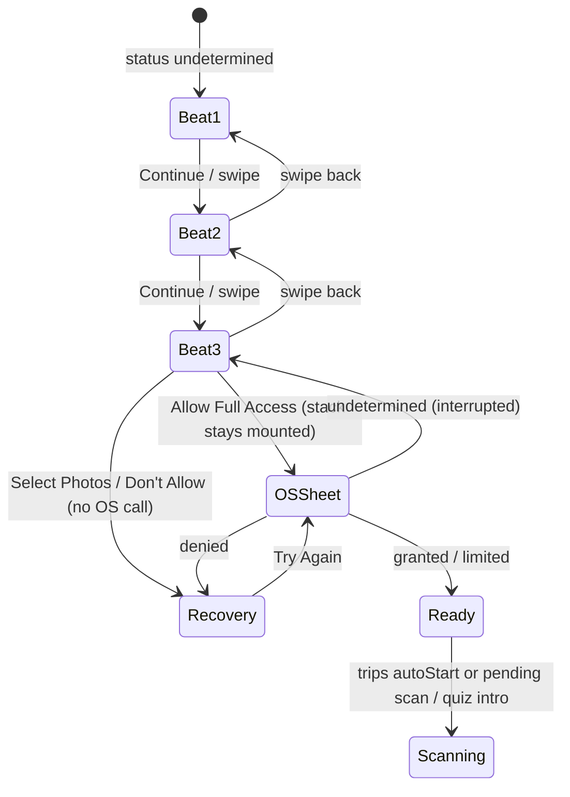
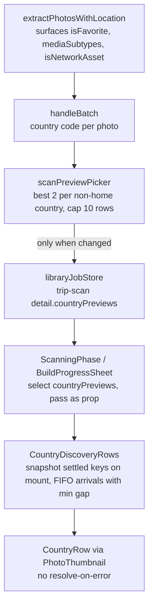

# Photo Permission Carousel and Live Country Pull-In - Plan

## Goal Capsule

- **Objective:** A first-time user who opens Guess Where or a trip scan understands, before iOS asks, what the library scan does with their photos, why it stays on their device, and what they get out of it (trips in their passport and Guess Where challenges); once they grant access, they watch their own photos gather into countries while the scan runs instead of staring at a spinner.
- **Means:** A three-beat Reanimated carousel that ends on the existing OS-shaped permission stack (KD1, KTD1, KTD4), plus country preview rows fed by a scan-time picker (KTD5, KTD6, KTD7), drawn with the same row primitive beat 3 uses so the promise and the payoff look alike (KTD14).
- **Authority hierarchy:** Requirements (R-IDs) win on product behavior; Key Technical Decisions (KTD-IDs) win on mechanism within their cited Rs; Implementation Units override neither. `mobile/src/constants/scanCopy.ts` and its test own every user-facing sentence about the scan.
- **Stop conditions:** Stop and report if beat 3's Full Access button cannot be placed within the alignment tolerance (R9) on both iPhone SE and iPhone 16 Pro Max at either door; if any new string fails the banned-phrase test and cannot be reworded inside the locked vocabulary (R21); if the trip-scan job slice would need to carry more than the caps in R16.
- **Execution profile:** Interactive, review-gated. Two PRs stacked on `photo-onboarding`: first U10 alone (analytics single-emit, KD10), then the carousel and pull-in. This is a UI change on the merged permission program (PR #127); the operator reviews screenshots and a short video before merging the second PR.
- **Who finishes and ships:** The implementing agent lands units in dependency order and stops at merge-ready; the operator merges.

---

## Product Contract

### Summary

Replace the current Photos preheat title and body at both doors (Guess Where creation and trip scan) with a three-beat animated carousel — find your trips in your photos, your phone reads where each one was taken on your device, every trip lands in your passport and powers Guess Where — over a persistent privacy footer with a custom lock glyph, ending on the existing OS-shaped Select Photos / Allow Full Access / Don't Allow stack. After a grant, the live scan surfaces (trip `ScanningPhase`, quiz `BuildProgressSheet`) show real thumbnails from the user's library flying into country rows as each non-home country is discovered. Copy stays inside `SCAN_COPY`'s locked vocabulary. A user-produced asset brief (Appendix A) lists every still and glyph the beats need.

### Problem Frame

The permission program merged in PR #127 fixed the mechanics of the Photos ask — honest copy, a recovery sheet, an OS-shaped preheat whose blue Full Access button bleeds under the real sheet, an autoStart gate — but the preheat itself is a title, a paragraph, and three buttons. It asks for the most sensitive permission in the app with the least persuasive surface. The reference onboarding the operator supplied (a wardrobe app's "we built onboarding around our biggest weakness" flow, see Sources) shows what the same moment looks like when the product demonstrates the scan instead of describing it: a grid where the right photos get checked, a single photo the phone reads, and items landing on their shelves. Atlasi has an equally visual story — travel photos, location data, passport stamps, Guess Where — and already ships onboarding video loops, Reanimated entrance choreography, and a live country-discovery feed during the scan. That feed is text only: "Found photos from Portugal", five lines, for the longest wait in the app.

### Key Decisions

- KD1. **Beat 3's action is the existing OS-shaped three-button stack, not a single CTA.** (session-settled: user-directed — chosen over an aesty-style single "Find my trips" button that fires the OS sheet directly: the system-blue bleed under the real sheet is the conversion mechanic the permission program settled on.) Governs R4, R8, R9.
- KD2. **The privacy footer carries a custom lock glyph.** (session-settled: user-approved — chosen over a text-only notice: the operator approved the glyph as an exception to the no-new-icons rule.) Governs R4, R26.
- KD3. **Both doors get the live pull-in.** (session-settled: user-approved — chosen over trips-only: one scan, one story; the quiz build is where a first-time user most often meets the scan.) Governs R13, R19. Conflict note from research: the quiz refresh loop forwards only `current`/`total` and has no country channel, and its scan step exists only on a first or stale build, so the quiz side costs more and shows less often than the trips side. It is sequenced last (U7) so the trips side can ship first.
- KD4. **The carousel lives at the two existing doors, not inside core signup onboarding.** Inherited from the permission program (`docs/plans/2026-08-31-001-feat-photo-library-permission-preheat-plan.md`, Appendix B: "Move the ask into core onboarding before account. Rejected."). Governs R1.
- KD5. **The home country is excluded from rows, previews, and the discovery feed.** Segmentation already drops home-country photos; animating them "landing in your passport" seconds before a "No Trips Found" failure would be a lie. Governs R14.
- KD6. **Carousel beat visuals are code-driven over user-produced stills, not pre-rendered video.** Product consequence: the operator produces stills and one glyph, not three mp4 loops. Mechanism and rationale on KTD1. Governs R6, R23, R26.
- KD7. **The ship gate is non-regression on Full Access grant rate, not a lift target or a comprehension study.** (session-settled: user-directed, at review — the carousel is a design call on a surface the operator judged weak, not an experiment; reviewers asked for a target and a comprehension gate and the operator declined both.) Governs Success Criteria.
- KD8. **Beat copy and the footer make only claims that are true of the scan step.** (session-settled: user-directed, at review — the shipped sentence "Nothing is uploaded until you save a place or share a challenge" is not reworded elsewhere, but the carousel does not repeat it, because the suggestions step sends resized photos for vision before anything is saved.) Governs R7, R21, Appendix B.
- KD9. **Beat 1's check badge is drawn in code: black circle, white check, as in the reference.** (session-settled: user-approved, at review — approval under the no-new-icons rule; no custom SVG.) Governs R2, Appendix A.
- KD10. **The analytics single-emit fix (U10) ships first as its own PR** so a clean two-week per-door baseline exists before the carousel lands. (session-settled: user-directed, at review.) Governs Success Criteria, Sequencing.
- KD11. **Beat 3's trips title keeps "Every trip lands in your passport."** (session-settled: user-directed, at review — it describes what the scan finds; the free tier's one-photo-import-trip limit applies to saving and is not the carousel's subject.) Governs R22.

### Requirements

**Carousel**

- R1. When Photos status is `undetermined` at either door (quiz `permission-request` phase; trips `permissionUi === 'preheat'`, including the autoStart path from the passport card), the user sees a three-beat carousel; the OS sheet is never requested before beat 3.
- R2. The beats are, in order: (1) *find your trips in your photos* — a photo grid where check badges pop sequentially onto the travel photos; (2) *your phone reads where each photo was taken, on your device* — one photo with pill callouts popping in (place, country, "location data only"); (3) *every trip lands in your passport and powers Guess Where* — photos fly from center into country rows carrying the country's stamp.
- R3. Every beat shows a title, a subtitle, its animated visual, and three pagination dots indicating the active beat.
- R4. A persistent bottom container shows the lock glyph and the privacy notice on every beat; on beats 1–2 its primary action is *Continue* (advances one beat); on beat 3 the action area is the OS-shaped stack (Select Photos / Allow Full Access / Don't Allow).
- R5. The user can advance by tapping Continue or swiping, and can swipe back; beat index is local UI state and changes nothing in permission state.
- R6. A beat's visual loops while that beat is active and holds still when it is not.
- R7. Every beat's subtitle carries its privacy point: beat 1 — only where a photo was taken is read, and photos without a location are skipped; beat 2 — the reading happens on your device; beat 3 — your photos stay on your device during the scan. Beat copy and the footer describe the scan step only (KD8); it makes no claim about what later steps (place suggestions, saving) do with photos, because the vision step does send resized photos to `/photos/suggest-places` after the scan.

**Permission mechanics**

- R8. Beat 3's stack behaves exactly as today's preheat: Allow Full Access calls the OS while the stack stays mounted; Select Photos and Don't Allow open the existing recovery sheet without an OS call.
- R9. On beat 3, the fake Allow Full Access button's center lies within 24pt of the real iOS sheet's Allow Full Access control on iPhone SE and iPhone 16 Pro Max at both doors, and the blue bleed remains visible under the translucent sheet.
- R10. An `undetermined` result from the OS sheet (interrupted prompt) leaves the user on beat 3 with the stack still available; it does not route to recovery.
- R11. The quiz door's denied recovery sheet offers *Try Again* (parity with the trips door), and a second tap on Allow Full Access while a request is in flight is ignored.
- R12. Users whose status is already `granted`, `limited`, or `denied` never see the carousel (existing routing is unchanged).

**Live pull-in during the scan**

- R13. During a trip scan, as each country other than the home country is discovered, a row appears with the country's stamp and name, and up to two thumbnails from that country fly into it.
- R14. The home country never appears as a row, a preview, or a `discoveredCountries` feed entry.
- R15. Preview candidates exclude screenshots and network (iCloud-offloaded) assets; among the rest the picker prefers favorites, then higher pixel count, then dimensions that are not common social-save sizes, then newer capture time. Selection uses only metadata already in hand during extraction — no vision, no tag database.
- R16. The trip-scan job slice carries at most 10 country rows and 2 previews per row; a row in the slice is never removed by later discoveries; arrivals animate through a queue with a minimum gap so a burst of discoveries does not land at once, and any arrivals still queued when the scan completes settle immediately so the completion screen is never delayed by choreography. The rows region on each surface has a fixed height (KTD7); when more rows exist than fit, the most recent rows are visible and earlier ones scroll out of the region while staying in the slice.
- R17. Remounting the scanning screen renders already-known rows settled, without replaying their arrival; only rows discovered after mount animate. The existing reset on suspend/resume (job detail wiped on `onStart`) is accepted and rows rebuild from zero.
- R18. A thumbnail that fails to load is dropped from its slot silently; the scan never triggers an iCloud download to render a preview.
- R19. On the quiz door, the same rows render inside `BuildProgressSheet` while the build's step is `scanning`; a fresh-cache build has no scan step and shows nothing new.
- R20. Incremental checks show rows for countries discovered in that pass, using the same rules.

**Copy and privacy**

- R21. Every new user-facing string lives under `SCAN_COPY.permission`, is registered in the copy test's `allStrings()`, and passes the banned-phrase list (no "background", "import", "GPS", "camera roll", "offline", "examine", "never upload").
- R22. Beat 3's title leads with the door's feature: trips door leads with the passport (KD11), quiz door leads with Guess Where; each door's beat-3 subtitle names both payoffs.
- R22a. The trips-door header above the carousel reads from `SCAN_COPY` and no longer says "Import Photos" (a retired word in the locked vocabulary).

**Accessibility and motion**

- R23. With Reduce Motion on, each beat renders its final frame statically, thumbnails appear by opacity only, and nothing loops.
- R24. With VoiceOver on, decorative visuals are hidden from the accessibility tree, a beat change announces "Step n of 3." followed by the new beat's title (a `SCAN_COPY` template, R21 — focus stays on Continue after a tap, so without the title the story is inaudible), pagination dots are not focusable, and each newly discovered country name is announced on both platforms (React Native's `accessibilityLiveRegion` is Android-only, so iOS needs an explicit announcement per arrival).

**Analytics**

- R25. `photo_permission_soft_ask_shown` keeps firing once when the carousel mounts; a new step event fires once per beat per mount with `door`, `step`, and how the beat was reached (`initial` / `tap` / `swipe`); a new left event fires when the carousel unmounts before any OS request, with `door` and the last `step`.

**Assets**

- R26. The beats use the user-produced stills and glyph specified in Appendix A; until they are delivered, tinted placeholder tiles stand in so code can land independently of asset delivery.

### Success Criteria

- Full Access grant rate on `undetermined` (`photo_permission_os_result` status `granted` over `photo_permission_soft_ask_shown`, per door) does not drop below the pre-carousel baseline in the first two weeks after the carousel ships; the carousel step funnel reports what share of mounts reach beat 3. Non-regression is the gate by decision (KD7). The baseline is the two weeks after U10 ships and before the carousel ships (KD10), because before U10 every scan start re-emits `photo_permission_os_result` with `door: 'trips'` (double-counting trips grants and adding phantom trips grants to quiz scans).
- Time from Allow Full Access tap to OS sheet visible stays within 150ms of the current preheat (the permission program's rule).
- The per-batch preview picker is cheap by construction: 10,000 synthetic photos across 15 countries pass through it in under 50ms on the Jest host (U5 benchmark). A wall-clock delta on a real scan is not asserted; it is below run-to-run noise.
- No dropped-frame regression on the scanning screen during a burst of six discoveries in one batch: the candidate build's dropped-frame count and longest JS frame on an iPhone SE simulator are no worse than a current-build capture of the same fixture, and the longest JS frame stays under 100ms.

### Scope Boundaries

- The denied/limited recovery sheet keeps its current look; only the quiz door's missing *Try Again* is added (R11).
- No change to `PhotoLibraryEnableModal` / profile settings ask; that door stays on its current content.
- No change to the OS purpose strings, the limited picker wiring, or the analytics funnel already merged in PR #127, except the single-emit fix in U10 that the per-door success criterion depends on.
- No vision or tag-database ranking at scan time (R15); the quality signal layer stays a post-scan consumer.
- No backend changes.
- The free tier's one-photo-import-trip limit is unchanged and not mentioned in the carousel (KD11).

#### Deferred to Follow-Up Work

- The shipped sentence "Nothing is uploaded until you save a place or share a challenge" remains in four places in `scanCopy.ts` (footer, two recovery bodies, one purpose string). The carousel does not repeat it (KD8); rewording the shipped occurrences is a separate copy change.
- Filter incremental-check rows to countries not already in the passport (would need `useUserCountries` in the scan surface).
- A neutral holding view for the one-frame `IdlePhase` flash between grant and autoStart on the trips door (M1 in research); revisit if it is visible on device after U4.

### Acceptance Examples

- AE1. **Covers R1, R4, R8.** Given a fresh install with Photos `undetermined`, when the user opens Guess Where creation, then beat 1 renders with Continue and no OS sheet appears; when they reach beat 3 and tap Allow Full Access, then the iOS sheet appears over the still-mounted stack.
- AE2. **Covers R10.** Given the user is on beat 3 and the OS sheet is interrupted (app backgrounded), when the app returns with status still `undetermined`, then beat 3 is still showing with the stack enabled.
- AE3. **Covers R13, R14.** Given home country United States and a library with photos from the US, Portugal, and Japan, when the scan runs, then rows for Portugal and Japan appear with thumbnails and no US row ever appears.
- AE4. **Covers R16.** Given six countries discovered in one 50-photo batch, when the rows render, then they arrive one at a time with the minimum gap, and the slice holds at most 10 rows.
- AE5. **Covers R17.** Given three rows already in the slice, when the user navigates away and back to the scanning screen, then those three render settled and only a fourth, later discovery animates.
- AE6. **Covers R23.** Given Reduce Motion on, when beat 1 mounts, then all check badges are already visible and nothing animates.
- AE7. **Covers R19.** Given a first-ever quiz build, when the build step is `scanning`, then the same country rows appear in the build sheet; given a fresh cache, then the build sheet is unchanged.
- AE8. **Covers R16.** Given a trips scan that discovers twelve countries, when the rows render on iPhone SE, then the Cancel button is still on screen, the four most recent rows are visible, and the slice holds ten.

### Sources

- Reference flow: `~/Downloads/Nadia_Zueva_-_WE_BUILT_ONBOARDING_AROUND_OUR_BIGGEST_WEAKNESS_nobody_wants_to_phot_obUbcD.mp4` (13.5s, 1080×1080). Key frames at 0:01 (grid + checks), 0:05–0:07 (single photo + pills), 0:10–0:13 (shelves filling). Not committed to the repo.
- Merged permission program and its alignment rule: `docs/plans/2026-08-31-001-feat-photo-library-permission-preheat-plan.md` (photo-perm-03 lanes 8–10).
- Existing carousel mechanics: `mobile/src/screens/onboarding/OnboardingSliderScreen.tsx` (FlatList paging, dots, persistent CTA).
- Reanimated conventions: `mobile/src/screens/quiz/components/GuessOption.tsx`, `mobile/src/screens/quiz/creation/BuildProgressSheet.tsx`, `mobile/src/screens/quiz/components/motionTokens.ts`, `mobile/src/hooks/useReducedMotion.ts`.
- Video discipline (why not mp4): `mobile/src/__tests__/screens/onboarding/videoDecoderLifecycle.test.tsx`, `videoSourceSwap.test.tsx`.
- Scan data path: `mobile/src/services/photoImport/photoImportService.ts` (`extractPhotosWithLocation`), `photoScanSteps.ts` (`handleBatch`), `types.ts` (`DiscoveredCountry`, `ScanProgress`), `mobile/src/stores/libraryJobStore.ts`.
- Quiz refresh path: `mobile/src/services/photoImport/photoBackgroundSync.ts` (`runExtractLoop`, `RefreshProgress`), `mobile/src/services/quiz/quizPoolSetup.ts` (`ensureFreshLibrary` caller).
- Thumbnail rendering and URI volatility: `mobile/src/screens/photos/components/PhotoThumbnail.tsx`, `mobile/src/services/photoImport/resolveLoadableUri.ts`.
- Copy law: `mobile/src/constants/scanCopy.ts`, `mobile/src/__tests__/constants/scanCopy.test.ts`.
- Analytics conventions: `mobile/src/services/analytics.ts`, `docs/analytics.md`.
- Design tokens: `docs/STYLEGUIDE.md`, `mobile/src/constants/colors.ts`, `mobile/src/constants/typography.ts`.

---

## Planning Contract

### Key Technical Decisions

- KTD1. **Beat visuals are Reanimated sequences over still assets, not `expo-video` loops.** Three players inside a sheet would break the repo's one-active-decoder rule, need poster fallbacks for Reduce Motion, and need host-screen blur wiring because the carousel is a phase of a screen, not a navigation screen. Reanimated gets Reduce Motion from the shared hook, is testable with the existing mock, and a beat is one component, so swapping any single beat to video later is local. This did not warrant a bake-off: the evidence already in the repo decides it, and the choice is cheap to reverse per beat. Instantiates KD6.
- KTD2. **The pager is a horizontal `FlatList` with `pagingEnabled`, a controlled index, and `onViewableItemsChanged` at 50% coverage, mirroring `OnboardingSliderScreen`.** The pager pages copy only (title and subtitle); the beat visual is a sibling `PermissionBeatVisual` that cross-fades between beats on step change, so both doors get the same swipe surface whether the visual sits above the pager (trips) or in the host's hero region (quiz). Dots, the action band, and the footer live in the shell outside the list so they persist across beats. Continue calls `scrollToIndex` with `animated: !reduceMotion`; the list supplies `getItemLayout` so `scrollToIndex` works without a measured layout (Jest has none). The shell reports `onBeatChange(step, via)` so analytics and dedupe live in the door hooks.
- KTD3. **The OS-shaped stack is extracted from `PhotoPermissionPreheat` into its own component and reused as beat 3's action area.** Existing testIDs (`photo-permission-preheat-full-access` etc.) and the `PhotoPermissionPreheatChoice` type are preserved so `usePhotoImportWorkflow` and `useQuizCreationFlow` keep their handlers unchanged. U2 leaves `PhotoPermissionPreheat` as a thin wrapper over the stack so both doors keep compiling; U4 deletes the wrapper and its test once neither door imports it.
- KTD4. **Layout per door: on the quiz door `PermissionBeatVisual` occupies `heroRegion` (replacing the poster during `permission-request`) and the sheet holds the copy pager, dots, action band, and footer; on the trips door the carousel owns the whole body below the header with the visual above the pager.** The action band has one fixed height on every beat, equal to the stack's height, with Continue centered inside it on beats 1–2, so advancing to beat 3 swaps the band's contents without moving the copy, dots, or footer. On beat 3 the stack is positioned so its Allow Full Access center matches where today's preheat places it, measured on SE and Pro Max, and the visual shrinks to make room rather than pushing the stack down. This is what keeps R9 true; the tolerance is asserted live, not assumed.
- KTD5. **Preview selection is a pure function computed inside `handleBatch`, over fields surfaced onto `PhotoWithLocation` only.** `asset.mediaSubtypes`, `info.isFavorite`, and `info.isNetworkAsset` are already fetched by `extractPhotosWithLocation` and discarded; carrying them on the in-memory `PhotoWithLocation` costs nothing and needs no `CachedPhoto` column or migration. The picker returns the best two per country per R15 and is unit-tested with fixtures.
- KTD6. **The trip-scan job slice gains `countryPreviews` (an immutable array of `{code, name, previews: [{assetId, uri}]}` records, up to two previews each), capped per R16 and replaced with a new array only when the picker reports a change.** The store's header allows scalar/JSON-friendly, non-persisted state and already holds a bounded string array (`QuizBuildDetail.pickUris`, at most 10); `countryPreviews` follows that precedent at 10×2. The host surface subscribes with a selector on that field alone, not on `progress`, because progress is patched every 50 assets with no throttle.
- KTD7. **Arrival choreography is owned by the rows component, driven by props, not by a store subscription or a private sticky set.** The host (`ScanningPhase`, `BuildProgressSheet`) selects `countryPreviews` and passes it down; the component renders exactly the rows it is given, so the store's never-remove rule (R16) and the suspend/resume reset (R17) hold in one place. On mount it snapshots the current row keys as settled; subsequent keys enter a FIFO that dequeues one arrival per minimum gap (`DURATION_SLOW`-scaled, from `motionTokens`) and drains instantly when the host reports the scan complete. The rows region is a fixed-height, non-interactive viewport (four rows on the trips screen; the slot grid's height on the quiz sheet) that keeps the newest rows visible, so Cancel and the sheet's footer never move as rows accumulate. An empty preview slot renders nothing — no placeholder frame — so a row with one preview reads as one photo, not as a broken grid.
- KTD8. **Thumbnails render through `PhotoThumbnail` with error-recovery disabled during the scan.** `PhotoThumbnail`'s on-error path calls `resolveLoadableUri`, which forces an iCloud download; a prop turns that off so a failed `ph://` preview drops out per R18 instead of competing with the scan for network.
- KTD9. **Reduce Motion comes from `@hooks/useReducedMotion`, the repo's shared `AccessibilityInfo` subscription, not Reanimated's hook.** Every beat and the rows component take `reduceMotion` and, when true, start shared values at their final state (the `GuessOption` pattern).
- KTD10. **Analytics keep `photo_permission_soft_ask_shown` at carousel mount and add `photo_permission_carousel_step` and `photo_permission_carousel_left`.** Same helper shape as the existing `photoPermission*` events: snake_case props, scalars only, `door` typed as `PhotoPermissionDoor`. Dedupe (once per step per mount) lives in the door hooks that own the mount lifecycle.
- KTD11. **The quiz door reuses the trips picker and rows component by threading `onBatch` through `runExtractLoop` → `ensureFreshLibrary` → `RefreshProgress` → the quiz build job → `QuizBuildDetail.countryPreviews`.** Same cap and same emit-on-change rule as KTD6. The rows render inside `BuildProgressSheet` only while `step === 'scanning'` (R19). Instantiates KD3.
- KTD12. **`mobile/jest.setup.js`'s Reanimated mock is extended before any beat uses `withSequence`, `withRepeat`, `Easing.inOut`, or `Animated.Image`.** None are defined today; adding them is a prerequisite unit-local change, not a test shortcut.
- KTD13. **Asset placeholders are first-class.** Beat components accept an asset map; a tinted-tile default lets U3 land and be tested before Appendix A assets arrive (R26). Every tile has a fixed frame and renders its image with `contentFit="cover"`, so a delivered still's dimensions or aspect ratio cannot move the layout the R9 alignment check was made against.
- KTD14. **One `CountryRow` primitive, owned by U9, draws both beat 3's demonstration rows and the live rows during the scan.** The primitive is presentational (stamp, name, two fixed-size thumbnail slots, an `entering` flag) and owns nothing about data or timing; `scanMotion.ts` beside it holds the shared row-arrival and fly-in timings derived from `motionTokens`. U3 and U6 both depend on U9 and neither depends on the other, which is what lets Phase A and Phase B land independently. Beat 3's `PassportBeat` takes the user's home country and skips it among its configured demo countries (KD5 applies to the demonstration too), so a Portuguese user never watches Portugal "land in their passport" as a promise.

### High-Level Technical Design

Carousel and permission outcomes (both doors share this shape; the door hook owns `permissionUi`/`phase` and `step`; the shell is controlled and only reports step changes):

Preview data path (trips door; the quiz door joins at the picker via KTD11):

Layout composition (prose, both doors, top to bottom): the beat visual, sized to what remains after everything below it is placed; the copy pager (title and subtitle); the three pagination dots; the action band, a fixed-height region equal to the stack's height that holds Continue on beats 1–2 and the OS-shaped stack on beat 3, occupying the same vertical band the current preheat's stack occupies; the lock-glyph footer. Because the band's height does not change between beats, nothing below the visual moves when the user reaches beat 3; only the band's contents swap.

### Assumptions

- The wardrobe reference's dot-and-footer composition transfers to a bottom-sheet (quiz) and a full-body (trips) host without a new navigation screen.
- `info.isNetworkAsset` is populated by `MediaLibrary.getAssetInfoAsync` on iOS for offloaded assets (verified in the installed `expo-media-library` 18.2.1 type definitions); the picker excludes on that field directly.
- Two previews per country is enough to read as "photos gathering"; more per row was judged noise on a phone-width row.

### Sequencing

U10 (analytics single-emit) first, as its own PR against `photo-onboarding`, merged and shipped before any carousel unit lands so the per-door baseline accumulates for two weeks (KD10); it has no dependencies. Then U9 (shared row primitive), also dependency-free. Phase A (carousel): U1 → (U2 ∥ U3) → U4, with U3 also needing U9. Phase B (trips pull-in): U5 → U6, with U6 also needing U9; Phase B is independent of Phase A. Phase C (quiz pull-in): U7 after U5 and U6. Phase D: U8 after everything.

---

## Implementation Units

### U1. Carousel and pull-in copy in `SCAN_COPY`

- **Goal:** Every new sentence exists, is per-door where R22 requires, and is under the banned-phrase test before any UI consumes it.
- **Requirements:** R7, R21, R22, R22a
- **Dependencies:** none
- **Files:** `mobile/src/constants/scanCopy.ts`, `mobile/src/__tests__/constants/scanCopy.test.ts`
- **Approach:**
  1. Add a `permission.carousel` block: three beat titles, three subtitles, the Continue label, pill labels for beat 2, the footer notice, a beat-3 title and subtitle function taking the door, a `stepAnnouncement(step, total, title)` template for the VoiceOver announcement (R24), and the trips-door header title (R22a).
  2. The footer notice is a new string that describes the scan only (KD8): direction in Appendix B. Do not reuse `preheatFooter`, whose "until you choose to upload" clause is the claim KD8 retires from the carousel.
  3. Register every new leaf in `allStrings()`. The existing test joins `Object.values(permission)` directly, which stringifies a nested block to `[object Object]`; flatten `carousel` (and call its functions for both doors) before joining so every leaf is actually audited.
  4. Add assertions that the beat-3 title for `trips` mentions the passport before Guess Where and for `quiz` the reverse, and that each door's beat-3 subtitle names both payoffs (R22).
- **Patterns to follow:** `purposeTrips` / `purposeQuiz` pair and the "leads with the feature the user asked for" test.
- **Test scenarios:**
  - Every new string passes every `BANNED` regex, including the flattened `carousel` leaves and both door variants of the beat-3 functions.
  - Beat-3 title for door `trips` leads with passport/trips; for `quiz` leads with Guess Where; each door's beat-3 subtitle names both payoffs.
  - Beat 2 subtitle contains "on your device" and "location data" and not "GPS".
  - No carousel string uses "never", "upload", or refers to "the picture" / "the photo itself" (R7, KD8: beat copy describes the scan only, and the vision step does upload resized photos later).
  - `stepAnnouncement(2, 3, title)` yields "Step 2 of 3. " followed by the title.
  - The trips-door header string does not match `/import/i`.
  - `permission.*` joined still does not match `/never upload/i`.
- **Verification:** Copy test passes with the new leaves counted in `allStrings()`.

### U2. Carousel shell, footer, and stack extraction

- **Goal:** A reusable `PhotoPermissionCarousel` that pages three beats, persists the lock-glyph footer, hosts the extracted OS-shaped stack on beat 3, reports step changes, and honors Reduce Motion and VoiceOver.
- **Requirements:** R1, R3, R4, R5, R8, R23, R24, R25
- **Dependencies:** U1
- **Files:** create `mobile/src/components/photos/PhotoPermissionCarousel.tsx`, `mobile/src/components/photos/PhotoPermissionPreheatStack.tsx`, `mobile/src/components/photos/PrivacyLockGlyph.tsx`; modify `mobile/src/components/photos/PhotoPermissionPreheat.tsx` (thin wrapper over the stack per KTD3; U4 deletes it), `mobile/src/services/analytics.ts`; tests `mobile/src/__tests__/components/photos/PhotoPermissionCarousel.test.tsx`, update `mobile/src/__tests__/components/photos/PhotoPermissionPreheat.test.tsx` to target the stack
- **Approach:**
  1. Move the three-button stack and its styles/testIDs into `PhotoPermissionPreheatStack`; keep `PhotoPermissionPreheatChoice` exported from its current module path.
  2. Build the shell per KTD2: controlled `step`, `onBeatChange(step, via)`, `onChoose` forwarded from the stack, a `door` prop for R22 copy, and an optional `visual` slot rendered above the pager (the trips door fills it; the quiz door renders the visual in its hero region instead and passes nothing). The pager pages copy only; `getItemLayout` is supplied; Continue scrolls with `animated: !reduceMotion`.
  3. Action band per KTD4: a fixed-height region sized to the stack, holding Continue centered on steps 1–2 and the stack on step 3. Footer: `PrivacyLockGlyph` (react-native-svg, single color, placeholder path until the Appendix A glyph arrives) + notice text.
  4. Add `photoPermissionCarouselStep` and `photoPermissionCarouselLeft` helpers per KTD10; the shell does not call them — door hooks do (U4).
  5. Accessibility per R24: `accessibilityElementsHidden` on the visual slot, `AccessibilityInfo.announceForAccessibility(SCAN_COPY.permission.carousel.stepAnnouncement(step, 3, title))` on step change with the new beat's title, dots `importantForAccessibility="no"`.
- **Patterns to follow:** `OnboardingSliderScreen` paging and dot styles; `Button` component for Continue; `@hooks/useReducedMotion`.
- **Test scenarios:**
  - Renders beat 1 title and Continue on mount; the stack's three testIDs are absent.
  - Tapping Continue twice reaches beat 3; `onBeatChange` receives `(2, 'tap')` then `(3, 'tap')`; the stack's three testIDs are present.
  - Simulated viewability change to index 1 reports `(2, 'swipe')`; swiping back to index 0 reports `(1, 'swipe')`.
  - Pressing Allow Full Access on beat 3 forwards `'full-access'`; Select Photos forwards `'select-photos'`; Don't Allow forwards `'dont-allow'`; none fire before beat 3.
  - Footer notice text and lock glyph testID are present on all three beats.
  - The action band's `onLayout` height is identical on beat 1 and beat 3 (fixed band, KTD4).
  - With `reduceMotion` true, Continue calls `scrollToIndex` with `animated: false`; with it false, `animated: true`.
  - Step announcement is called with the `SCAN_COPY` template's output for step 2 and beat 2's title when advancing.
  - `PhotoPermissionPreheat.test.tsx` still passes against the extracted stack (labels and testIDs unchanged).
- **Verification:** New and updated component tests pass; the extracted stack is the only place the three permission buttons are defined.

### U3. Beat visuals and Reanimated mock additions

- **Goal:** Three looping, Reduce-Motion-aware beat visuals that read as the reference's grid-with-checks, photo-with-pills, and photos-into-rows, driven by an asset map with tinted placeholders.
- **Requirements:** R2, R6, R23, R26
- **Dependencies:** U1, U9
- **Files:** create `mobile/src/components/photos/permissionBeats/PermissionBeatVisual.tsx` (exhaustive switch over the three beats with a `never` default, cross-fade on step change), `TripsFoundBeat.tsx`, `OnDeviceBeat.tsx`, `PassportBeat.tsx`, `permissionMotion.ts`, `permissionBeatAssets.ts`; create `mobile/assets/permission-carousel/` (Appendix A drops); modify `mobile/jest.setup.js`; tests `mobile/src/__tests__/components/photos/permissionBeats.test.tsx`
- **Approach:**
  1. Extend the Reanimated mock per KTD12 first.
  2. `permissionMotion.ts`: beat loop length, per-item stagger, check-pop spring, pill spring, all derived from `motionTokens` and `SPRING_CONFIG_BOUNCY`. Row-arrival and fly-in timings come from U9's `scanMotion.ts`, not here.
  3. Beat 1: 4×3 grid of stills; code-drawn check badges (black circle, white check, KD9) pop on the travel tiles in sequence, hold, then reset for the loop. Beat 2: one 3:4 still; three pills pop in at fixed anchor points. Beat 3: three `CountryRow`s (KTD14) chosen from four configured demo countries minus the user's `homeCountry`; six photo tiles fly from center to their row slots.
  4. Each beat takes `isActive` (loop only when active, R6) and `reduceMotion` (final frame, R23) and an asset map defaulting to tinted placeholders (KTD13). Every tile has a fixed frame and cover-fits its image so asset dimensions cannot move layout.
  5. `PermissionBeatVisual` takes `step`, `reduceMotion`, `homeCountry`, and the asset map; it marks only the active beat `isActive` and cross-fades on step change (`FadeIn`/`FadeOut` at `DURATION_FAST`, instant under Reduce Motion).
- **Patterns to follow:** `GuessOption` entrance pattern; `BuildProgressSheet` `FadeIn` gating; `stampImages[code]` lookup.
- **Execution note:** These are visual; prove them on the simulator with the verify-atlasi skill and screenshots per beat, in addition to the render tests below.
- **Test scenarios:**
  - Each beat renders its expected tile count (12, 1, 6) with placeholders when no asset map is given.
  - With `reduceMotion` true, beat 1 renders all check badges visible on first render; beat 2 renders all three pills; beat 3 renders all six tiles in their row slots.
  - With `isActive` false, no animation is started (mocked `withRepeat` not invoked).
  - Beat 3 with `homeCountry: 'PT'` and demo countries PT, JP, MX, IT renders rows for JP, MX, IT and no PT stamp; with a home country outside the demo set it renders the first three.
  - `PermissionBeatVisual` renders exactly one beat's content per step and passes `isActive` only to that beat.
- **Verification:** Tests pass; simulator screenshots of each beat at mid-loop and at rest, with and without Reduce Motion, attached to the PR.

### U4. Door integration and alignment

- **Goal:** Both doors render the carousel in place of the old preheat, with the layouts in KTD4, the OS-result handling in R10–R11, per-step analytics, and the R9 alignment verified live.
- **Requirements:** R1, R9, R10, R11, R12, R22, R22a, R25
- **Dependencies:** U2, U3
- **Files:** modify `mobile/src/screens/quiz/QuizCreationScreen.tsx`, `mobile/src/screens/quiz/creation/quizCreationStyles.ts`, `mobile/src/screens/quiz/creation/useQuizCreationFlow.ts`, `mobile/src/screens/photos/PhotoImportScreen.tsx`, `mobile/src/screens/photos/styles/screenStyles.ts`, `mobile/src/screens/photos/usePhotoImportWorkflow.ts`; delete `mobile/src/components/photos/PhotoPermissionPreheat.tsx` and `mobile/src/__tests__/components/photos/PhotoPermissionPreheat.test.tsx` once neither door imports the wrapper (KTD3; the stack's own test from U2 keeps the coverage); tests update `mobile/src/__tests__/screens/QuizCreationScreen.test.tsx`, `mobile/src/__tests__/screens/photos/useAutoStartWorkflow.test.ts`, add `mobile/src/__tests__/screens/photos/usePhotoImportWorkflow.permission.test.ts`
- **Approach:**
  1. Quiz: during `permission-request`, `heroRegion` hosts `PermissionBeatVisual` for the hook's `step` instead of `posterHero`; the sheet hosts the shell (copy pager, dots, action band, footer) with no `visual` slot. `handleRequestPermission` treats `undetermined` as stay-on-beat-3 (R10); pass `onRetry` to the denied sheet (R11); guard double taps.
  2. Trips: the `idleContainer` preheat branch renders the shell full-body with `PermissionBeatVisual` in its `visual` slot; the same `undetermined` and in-flight guard rules apply in `handlePermissionPreheatChoice`. The screen header reads the U1 title instead of "Import Photos" (R22a).
  3. Both hooks own `step` and fire the step/left events once per step per mount (KTD10); `soft_ask_shown` placement is unchanged.
  4. Measure the current stack's Allow Full Access center on SE and Pro Max before changing layout; place beat 3's stack to match (KTD4).
  5. Update `QuizCreationScreen.test.tsx` to assert beat 1 content on first render and the stack after advancing to beat 3, instead of the stack on first render.
- **Patterns to follow:** existing `permissionUi` / `phase` state machines; `useAutoStartWorkflow.test.ts` "permissionReady gate" test.
- **Execution note:** The alignment rule is proven only on device or simulator: capture the OS sheet over beat 3 on SE and Pro Max at both doors and mark centers; this is the review gate for the PR.
- **Test scenarios:**
  - Quiz: `permission-request` renders beat 1 text with `/Guess Where/` and no OS call; advancing to beat 3 shows Allow Full Access; pressing it calls `requestPermissionsAsync` once even when pressed twice quickly.
  - Quiz: OS returns `undetermined` → phase stays `permission-request` and the stack is still rendered; returns `denied` → `permission-denied` with a Try Again button that re-requests.
  - Trips manual: `startScan` on `undetermined` shows the carousel and sets the pending flag; grant on beat 3 starts the scan (existing behavior preserved).
  - Trips autoStart: `permissionReady` stays false through beats 1–3 and flips only after grant (existing gate test extended to the carousel).
  - Analytics: step event fires once for beat 1 on mount, once on reaching beat 2, not again on swiping back to 1; left event fires on unmount from beat 2 without an OS request and not after a request.
  - Returning `granted` user at either door never mounts the carousel.
  - The trips screen header text does not match `/import/i`.
- **Verification:** Screen tests pass; simulator captures show the OS Allow Full Access control over the fake button within 24pt on SE and Pro Max at both doors, blue bleed visible; 30–60s video of beat 1 → OS grant on the quiz door for the review gate.

### U5. Scan-time preview picker and job-slice field

- **Goal:** Each non-home discovered country carries up to two cheap, well-chosen preview assets in the trip-scan job slice, emitted only when the set changes and bounded per R16.
- **Requirements:** R14, R15, R16, R20
- **Dependencies:** none (parallel with Phase A)
- **Files:** create `mobile/src/services/photoImport/scanPreviewPicker.ts`; modify `mobile/src/services/photoImport/types.ts`, `photoImportService.ts`, `photoScanSteps.ts`, `mobile/src/services/photoSignals/captureContext.ts` (export `SOCIAL_SAVE_DIMENSIONS`, currently module-private), `mobile/src/stores/libraryJobStore.ts`; tests `mobile/src/__tests__/services/photoImport/scanPreviewPicker.test.ts`, extend `mobile/src/__tests__/services/photoImport/photoScanService.test.ts`
- **Approach:**
  1. Surface `isFavorite`, `isScreenshot` (from `mediaSubtypes`), and `isNetworkAsset` onto `PhotoWithLocation` in `extractPhotosWithLocation` (KTD5); leave `CachedPhoto` untouched.
  2. `scanPreviewPicker`: pure, takes current per-country previews plus a batch of `(photo, code)`, returns the updated map under R15 ordering and R16 caps; excludes `opts.homeCountry`.
  3. In `handleBatch`, run the picker after country coding, exclude the home country from `discoveredCountries` too (R14), and emit the detail only when the picker reports a change (KTD6).
  4. Add `countryPreviews` to `TripScanDetail` (KTD6 shape) and a narrow selector.
- **Patterns to follow:** `photoSignals/captureContext.ts` `SOCIAL_SAVE_DIMENSIONS` (exported in this unit) for the social-save tiebreak; `libraryJobStore` header rules (no persist; scalar/JSON-friendly, bounded state) and the `pickUris` precedent for a bounded array in a job detail.
- **Execution note:** Implement the picker test-first; its ordering rules are the whole behavior.
- **Test scenarios:**
  - Two favorites and three non-favorites from one country → the two favorites are picked.
  - Screenshot and network assets are never picked even when they are the only candidates (row has fewer than two previews).
  - Ties on favorite → higher pixel count wins; ties on pixels → non-social-save dimensions win; then newer `creationTime`.
  - An eleventh country does not add a row; existing ten rows are unchanged.
  - Home country photos produce no row, no preview, and no `discoveredCountries` entry.
  - A batch that changes nothing about the preview set does not trigger a detail emit; one that adds a preview does.
  - A later, better candidate for a country that already has two previews does not evict them mid-run (rows are stable, R16).
  - An incremental pass (`since` set) over a fixture with two new non-home countries produces rows and previews under the same caps and ordering as a first scan (R20).
- **Verification:** Picker tests pass, including a benchmark test that runs 10,000 synthetic photos across 15 countries through the picker in under 50ms on the Jest host (the scan-cost gate for the Verification Contract); scan service test asserts the slice never exceeds 10×2 across a burst fixture and that home-country rows are absent.

### U6. Country discovery rows on the trips scanning screen

- **Goal:** `ScanningPhase` shows stamp-and-name rows with thumbnails flying in as previews land, sticky and replay-free, honoring Reduce Motion and keeping the live-region announcements.
- **Requirements:** R13, R16, R17, R18, R23, R24
- **Dependencies:** U5, U9
- **Files:** create `mobile/src/components/photos/CountryDiscoveryRows.tsx`; modify `mobile/src/screens/photos/components/ScanningPhase.tsx`, `mobile/src/screens/photos/photoImportStyles.ts`, `mobile/src/screens/photos/components/PhotoThumbnail.tsx` (error-recovery prop, KTD8); tests `mobile/src/__tests__/components/photos/CountryDiscoveryRows.test.tsx`, extend `mobile/src/__tests__/screens/photos/` ScanningPhase coverage
- **Approach:**
  1. `CountryDiscoveryRows` takes `rows` (the KTD6 records), `isComplete`, and `reduceMotion` as props; it renders exactly the rows it is given (KTD7), snapshots keys on mount as settled, feeds new keys into a FIFO with the minimum gap from U9's `scanMotion.ts`, and drains the queue instantly when `isComplete` flips true.
  2. Each row is a `CountryRow` (U9); arrival = row fades/slides in, then each thumbnail flies from the row's leading edge into its slot. An empty slot renders nothing.
  3. The rows region is a fixed-height viewport four rows tall, `pointerEvents="none"`, pinned to show the newest rows (older rows translate up and out); it never grows, so Cancel stays where it is today (R16, AE8).
  4. `PhotoThumbnail` gets a prop that disables the `resolveLoadableUri` retry; on error the slot empties (R18).
  5. `ScanningPhase` selects `countryPreviews` from the store and passes it down; it replaces the text-only `discoveryFeed`, keeping progress bar, title, hint, and Cancel unchanged.
  6. Announcements per R24: keep `accessibilityLiveRegion="polite"` on the country-name text (Android) and call `AccessibilityInfo.announceForAccessibility(SCAN_COPY.trips.discovery(name))` as each arrival dequeues (iOS); thumbnails are hidden from the a11y tree.
- **Patterns to follow:** `PhotoThumbnail` usage in `PhotoTripCard`; `SCAN_COPY.trips.discovery` for the announced name; `@hooks/useReducedMotion`.
- **Test scenarios:**
  - Rendering with two countries shows two rows with the right names and stamp images.
  - Rendering with six countries at once dequeues arrivals one per gap (fake timers) rather than all in one tick; flipping `isComplete` mid-queue settles the rest in the same tick.
  - Mounting with three rows renders them settled (no entering animation started); a fourth added later animates.
  - Twelve rows render inside the fixed-height region with the four most recent visible (translated positions asserted) and the region's `onLayout` height unchanged from the two-row case.
  - A row with one preview renders one thumbnail and no placeholder in the second slot.
  - A thumbnail `onError` empties the slot and does not call `resolveLoadableUri`.
  - With Reduce Motion, thumbnails render at full opacity with no transform animation.
  - Each arrival calls `announceForAccessibility` once with the country name; live-region text contains the name for each row.
  - `ScanningPhase` re-renders when `countryPreviews` changes and not when only `progress.current` changes.
- **Verification:** Tests pass; simulator video of a scan over a multi-country fixture library shows rows arriving in sequence with Cancel fixed; Reduce Motion toggle shows static rows.

### U7. Quiz door: country previews through the refresh loop into the build sheet

- **Goal:** A first-ever or stale quiz build shows the same country rows while its step is `scanning`, using the trips picker and rows component.
- **Requirements:** R19, R14, R16, R17
- **Dependencies:** U5, U6
- **Files:** modify `mobile/src/services/photoImport/photoBackgroundSync.ts` (`runExtractLoop`, `RefreshProgress`), `mobile/src/services/quiz/quizPoolSetup.ts` (the `ensureFreshLibrary` caller), the quiz build job's detail publishing, `mobile/src/stores/libraryJobStore.ts` (`QuizBuildDetail.countryPreviews`), `mobile/src/screens/quiz/creation/BuildProgressSheet.tsx`; tests extend `mobile/src/__tests__/screens/QuizCreationScreen.test.tsx` and the quiz job tests
- **Approach:**
  1. Thread an `onBatch` callback through `runExtractLoop` → `ensureFreshLibrary` and carry the picker's map on `RefreshProgress` (KTD11). The quiz build currently reads the home country after `ensureFreshLibrary` returns; hoist that read ahead of the scan so the picker's `homeCountry` option is populated on the first pass (R14).
  2. Publish to `QuizBuildDetail.countryPreviews` with the same cap and emit-on-change rule.
  3. `BuildProgressSheet` renders `CountryDiscoveryRows` in place of the empty slot grid while `step === 'scanning'`, in a region sized to the grid's height (KTD7); at `checking` the rows cross-fade out and the slot grid cross-fades in (`FadeOut`/`FadeIn` at `DURATION_FAST`, instant under Reduce Motion), so the sheet's height never changes across the handover.
- **Patterns to follow:** existing `pickUris` append-only publishing in the quiz job; `patchJobSlice('quiz-build', …)` test driving in `QuizCreationScreen.test.tsx`.
- **Test scenarios:**
  - Driving the store with `step: 'scanning'` and two `countryPreviews` renders two rows in the build sheet.
  - Moving to `step: 'checking'` hides the rows and shows the slot grid; the sheet's content region reports the same `onLayout` height before and after.
  - The picker receives the home country on the first batch of a first-ever build (home-country row absent).
  - A fresh-cache build (no `scanning` step) renders the sheet exactly as before.
  - `RefreshProgress` carries previews only when `onBatch` produced a change; the quiz job never exceeds the caps.
- **Verification:** Tests pass; simulator video of a first quiz build on a multi-country fixture shows rows during the scan step.

### U8. Documentation and asset drop-in

- **Goal:** Docs reflect the new events, fields, and the picker; Appendix A assets replace placeholders.
- **Requirements:** R25, R26
- **Dependencies:** U4, U6, U7, U10
- **Files:** modify `docs/analytics.md`, `docs/photo-import.md`; add assets under `mobile/assets/permission-carousel/`; modify `mobile/src/components/photos/permissionBeats/permissionBeatAssets.ts` to reference them
- **Approach:**
  1. `docs/analytics.md`: add the two carousel events with props and the once-per-mount rule; note that `photo_permission_os_result` is single-emit per request as of U10.
  2. `docs/photo-import.md`: add a short "Scan-time country previews" subsection covering the picker rules, the slice cap, and the fact that it is tag-free by design.
  3. Wire the delivered assets into the asset map; confirm bundle size delta against the Appendix A budget.
- **Test expectation:** none -- documentation and asset wiring; U3's tests cover the asset map contract.
- **Verification:** Docs updated; `npx expo export` bundle size delta under the budget in Appendix A; beat screenshots refreshed with real assets for the PR.

### U9. Shared `CountryRow` primitive and scan motion tokens

- **Goal:** One presentational row — stamp, country name, two fixed-size thumbnail slots — that beat 3 and the live scan both render, plus the shared arrival and fly-in timings, so the promise in the carousel and the payoff during the scan are visibly the same thing.
- **Requirements:** R2, R13, R23
- **Dependencies:** none
- **Files:** create `mobile/src/components/photos/CountryRow.tsx`, `mobile/src/components/photos/scanMotion.ts`; tests `mobile/src/__tests__/components/photos/CountryRow.test.tsx`
- **Approach:**
  1. `CountryRow` props: `code`, `name`, `slots` (0–2 render functions or image sources), `entering` (drives the row's own fade/slide), `reduceMotion`. It owns layout and the fly-in transform for each slot's content; it owns no data fetching, no queueing, and no store access.
  2. `scanMotion.ts`: row-arrival duration, per-slot fly-in duration and curve, and the minimum arrival gap, all derived from `motionTokens` (`DURATION_SLOW`, `SPRING_CONFIG_BOUNCY`).
  3. Slot frames are fixed (56pt square) and empty slots render nothing (KTD7).
- **Patterns to follow:** `GuessOption` entrance pattern; `stampImages[code]` lookup; `getCountryName`.
- **Test scenarios:**
  - Renders the stamp for `code` and the name text; with one slot renders one child and no placeholder frame.
  - With `reduceMotion` true, slot content mounts at final transform and full opacity with no animation started.
  - With `entering` true and `reduceMotion` false, the row's entering animation starts (mocked Reanimated).
- **Verification:** Tests pass; the component is imported by both `PassportBeat` (U3) and `CountryDiscoveryRows` (U6) and defined nowhere else.

### U10. Single `photo_permission_os_result` per request

- **Goal:** `photo_permission_os_result` fires exactly once per real OS ask, with the asking door, so the per-door grant-rate criterion can be read.
- **Requirements:** R25 (funnel integrity for the Success Criteria)
- **Dependencies:** none; lands first (Sequencing)
- **Files:** modify `mobile/src/services/photoImport/photoImportService.ts` (`requestPhotoPermissions`); tests extend `mobile/src/__tests__/services/photoImport/photoImportService.test.ts`, `mobile/src/__tests__/services/photoPermissionAnalytics.test.ts`
- **Approach:**
  1. The door hooks already emit at the real OS ask (`usePhotoImportWorkflow` with `door: 'trips'`, `useQuizCreationAnalytics` with `door: 'quiz'`). The duplicate is `requestPhotoPermissions`, which `extractPhotosWithLocation` calls at the start of every scan and which emits `door: 'trips'` unconditionally — so every trips scan double-counts and every quiz scan adds a phantom `trips` grant. Remove the emit from `requestPhotoPermissions`; it keeps requesting (a no-op when already granted) and returns the flags.
  2. Leave both door-hook emits as they are.
- **Patterns to follow:** existing `photoPermissionOsResult` helper in `analytics.ts`.
- **Test scenarios:**
  - `requestPhotoPermissions` resolves `{granted, limited}` and does not call `photoPermissionOsResult`.
  - A full quiz grant-then-scan path calls `photoPermissionOsResult` exactly once with `door: 'quiz'`; a trips grant-then-scan path exactly once with `door: 'trips'`.
- **Verification:** Tests pass; this unit ships ahead of the carousel so the pre-carousel baseline in the Success Criteria counts clean events (KD10).

---

## Verification Contract

| Check | Command / method | Applies to |
|---|---|---|
| Lint | `cd mobile && npm run lint` | all units |
| Format | `cd mobile && npm run format:check` | all units |
| Copy law | `cd mobile && npm test -- scanCopy` | U1 |
| Carousel + beats + row primitive | `cd mobile && npm test -- PhotoPermissionCarousel permissionBeats PhotoPermissionPreheat CountryRow` (Jest ORs positional path patterns; no shell-escaped pipes) | U2, U3, U9 |
| Doors | `cd mobile && npm test -- QuizCreationScreen useAutoStartWorkflow usePhotoImportWorkflow` | U4 |
| Analytics single-emit | `cd mobile && npm test -- photoImportService photoPermissionAnalytics` | U10 |
| Picker + slice | `cd mobile && npm test -- scanPreviewPicker photoScanService` (includes the 10k-photo picker benchmark, under 50ms) | U5 |
| Rows | `cd mobile && npm test -- CountryDiscoveryRows ScanningPhase` | U6 |
| Quiz previews | `cd mobile && npm test -- QuizCreationScreen quizBuild` | U7 |
| Full suite | `cd mobile && npm test` | before PR |
| Alignment gate (R9) | Simulator via the `verify-atlasi` skill: iPhone SE and iPhone 16 Pro Max, both doors, screenshot of OS sheet over beat 3; Allow Full Access centers within 24pt; blue bleed visible. Repeat once with the delivered Appendix A assets wired in (U8) | U4, U8 |
| Layout gates (R16, KTD4) | Simulator on SE: twelve-country fixture scan keeps Cancel on screen with the rows region at fixed height; advancing beat 1 → 3 at both doors moves nothing below the visual (action band fixed) | U4, U6 |
| Motion gates (R23, R24) | Simulator with Reduce Motion on and VoiceOver on: beats static, rows fade-only, "Step n of 3." plus the beat title announced, each new country name announced on iOS | U3, U4, U6 |
| Perf gates | Stopwatch: Full Access tap → OS sheet within 150ms of current preheat. Picker cost is the Jest benchmark above (a wall-clock delta on a real 10k scan is below run-to-run noise and is not asserted). Frame profile: capture dropped frames and longest JS frame on the current build during a six-country burst fixture on SE *before* U6 lands, then the same on the candidate; candidate is no worse on either and longest JS frame stays under 100ms | U4, U5, U6 |

---

## Definition of Done

- Every unit's test scenarios exist as tests and pass; `npm run lint`, `npm run format:check`, and `npm test` pass in `mobile/`.
- R9 alignment captures for SE and Pro Max at both doors, the Reduce Motion / VoiceOver captures, and the beat-1-to-grant video are attached to the PR and reviewed by the operator before merge.
- `PhotoPermissionPreheat.tsx` and its test are deleted; the stack exists in exactly one component; `CountryRow` is the only place a stamp-name-thumbnails row is drawn.
- `requestPhotoPermissions` no longer emits `photo_permission_os_result`.
- No new string outside `SCAN_COPY.permission`; `allStrings()` includes every new leaf.
- No abandoned experiments remain in the diff (mp4 players, unused beat variants, debug logging).
- Appendix A assets are wired in, or the PR states explicitly which placeholders remain and why.
- `docs/analytics.md` and `docs/photo-import.md` updated.

---

## Risks & Dependencies

- **Beat 3 placement vs. the OS sheet.** Adding a visual above the stack is the most likely way to break the 24pt rule on iPhone SE. Mitigation: KTD4 measures first and shrinks the visual, and R9 is a stop condition.
- **Quiz sheet height.** The quiz sheet is content-sized with the hero as the flex child; a tall beat 3 on SE can push the stack under the fold with no scroll. Mitigation: KTD4 puts the visual in the hero region so the sheet gains only copy, dots, and footer; verify on SE before widening.
- **Test coupling.** `QuizCreationScreen.test.tsx` asserts the stack on first render of `permission-request`; U4 changes that assertion deliberately.
- **Store growth.** Unthrottled per-batch patches plus a new array field can re-render the scanning screen 200 times on a 10k library. Mitigation: KTD6 emit-on-change and a dedicated selector; perf gate in the Verification Contract.
- **Asset delivery.** The beats depend on operator-produced stills; KTD13 placeholders keep the code path unblocked.
- **Home-country exclusion changes an existing feed.** Removing the home country from `discoveredCountries` alters the text feed users see today; it was already misleading (research C2), and the change is covered by U5 tests.
- **Quiz threading blast radius.** U7 touches the refresh loop shared by trips freshness checks; keep `onBatch` optional so trips-side callers are unaffected.
- **Two privacy sentences side by side.** The carousel says "Your photos stay on your device during the scan" (KD8) while the recovery sheet the user may reach seconds later still says "Nothing is uploaded until you save a place or share a challenge" (shipped copy, deferred). The two are compatible but differently scoped; if a reviewer reads them as a contradiction, the follow-up copy change in Deferred is the fix, not a change to the carousel.

---

## Alternative Approaches Considered

- **Pre-rendered mp4 loops per beat (operator-produced).** Matches the existing onboarding-video pattern but puts three decoders in a sheet, needs posters for Reduce Motion, and needs blur handling the carousel cannot get from navigation. Rejected per KTD1; any single beat can still be swapped to video later.
- **Lottie.** Not installed; adds a native dependency and a new build for a visual that Reanimated over stills already covers.
- **Single "Find my trips" CTA on beat 3.** Faithful to the reference; drops the bleed mechanic. Rejected per KD1.
- **Trips-only pull-in.** Half the cost; leaves the quiz build sheet — where most first scans happen — with a bare slot grid. Rejected per KD3, but sequenced last.
- **Vision or tag-based preview ranking.** Higher quality picks, but the tag database is populated only after the first scan completes, and vision runs post-scan. Rejected per R15.

---

## Appendix

### A. Asset brief (operator-produced)

Every asset is a still or a vector; no video. Target formats: photos as `.webp` quality 80, glyphs as `.svg`. Total added bundle weight under 1.5 MB. Drop everything into `mobile/assets/permission-carousel/` with the filenames below; U3's asset map references them by name. Photos must be the operator's own or licensed, with no identifiable faces unless consented; they ship in the app binary and on public review screenshots.

| Asset | Count | Format and size | Used in | Direction |
|---|---|---|---|---|
| `lock.svg` | 1 | 24×24 viewBox, single path, `currentColor`, 1.75 stroke, rounded joins | Footer (R4) | Padlock in the Atlasi line weight; reads at 16pt on `midnightNavy`. Approved glyph per KD2. |
| `beat1/travel-01..08.webp` | 8 | 3:4 portrait, 600×800 | Beat 1 grid tiles that get checked | Clearly "somewhere": landmarks, streets abroad, coastlines, food on a terrace. Varied palettes. |
| `beat1/other-01..04.webp` | 4 | 3:4 portrait, 600×800 | Beat 1 grid tiles that stay unchecked | Everyday non-travel: a receipt, a whiteboard, a pet on a couch, a parking spot. The contrast is the point. |
| `beat2/hero.webp` | 1 | 3:4 portrait, 900×1200 | Beat 2 single photo | One unmistakable place (a tram in Lisbon, a torii gate, a Mexico City street). Pills will name its city and country; choose a place whose stamp exists in `mobile/assets/stamps/processed/`. |
| `beat3/{CC}-01.webp`, `beat3/{CC}-02.webp` for four country codes | 8 | 1:1, 400×400 | Beat 3 tiles flying into rows | Two per country, four countries (suggest PT, JP, MX, IT); the beat shows three and skips the user's home country if it is one of them (KTD14). Square crops that read at 56pt. Country codes must match `stampImages`. |

Not an asset: the beat 1 check badge is drawn in code (black circle, white check, KD9). Motion the operator does not need to produce: check pops, pill pops, fly-ins, dots, and the footer are all code (U3, U6, U9). Country stamps already exist in `mobile/assets/stamps/processed/{CC}.webp`.

Reference timestamps in the source video for framing: 0:01–0:03 grid with checks (4 columns, checks land top-left to bottom-right over ~2s), 0:05–0:08 single photo with three pills anchored to body regions, 0:10–0:13 three shelves filling left to right.

### B. Copy direction for U1

Beat titles and subtitles are drafted here for U1 to finalize inside the locked vocabulary; they are direction, not final strings.

- Beat 1 — title: *We find your trips in your photos.* Subtitle: *The scan reads only where each photo was taken. Photos without a location are skipped.*
- Beat 2 — title: *Your phone reads where each photo was taken.* Subtitle: *It happens on your device. The scan uses location data only.* (Not "never the picture itself": the vision step after the scan does send resized photos for place suggestions, so beat copy stays on what the scan does — R7.)
- Beat 3 (trips door) — title: *Every trip lands in your passport.* (KD11) Subtitle: *Trips build from where your photos were taken, and unlock Guess Where challenges. Your photos stay on your device during the scan.*
- Beat 3 (quiz door) — title: *Your photos become Guess Where challenges.* Subtitle: *The same scan builds your trips, too. Your photos stay on your device during the scan.*
- Footer notice (new string, KD8): *The scan runs on your device · Full Access finds more trips*.
- Trips-door header (R22a): *Find Your Trips* — or any title inside the locked vocabulary that does not use "import".
- Beat 2 pills: the hero photo's city, its country, *Location data only*.
- VoiceOver step template: *Step {n} of 3. {title}*.
