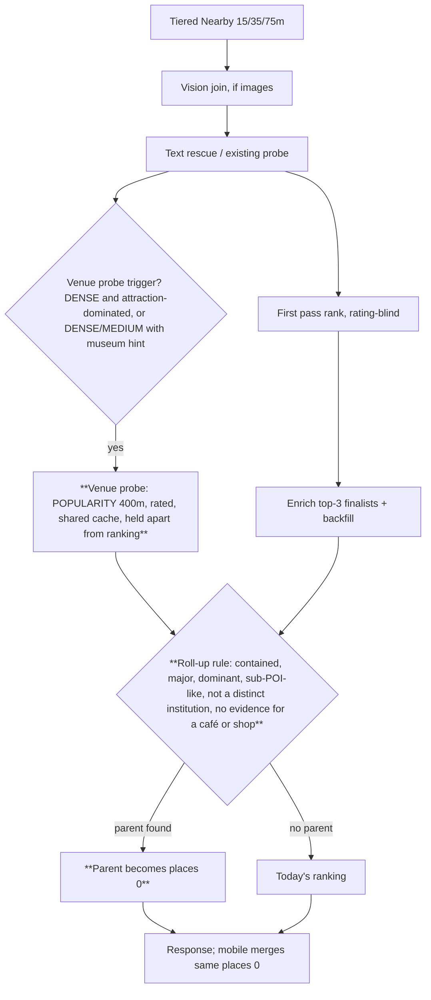
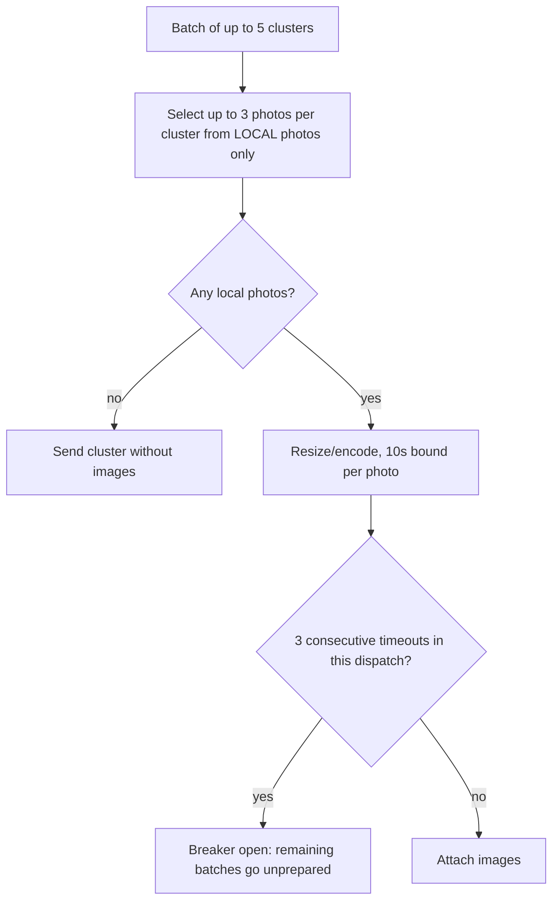

# Photo Place Matching Speed and Major-Venue Roll-Up - Plan

## Goal Capsule

- **Objective:** A traveler importing a big trip sees place suggestions arrive quickly, without waiting on photos that live only in iCloud. Photos taken in or around a major sight (the Louvre, the Eiffel Tower) show that sight as the first option and collapse into one card, instead of scattering across the exhibits and kiosks inside it.
- **Means:** Skip iCloud-only photos during vision prep (KTD1). Fetch a nearby major venue with a cheap, shared popularity lookup and promote it over the minor places inside it (KTD3, KTD4). Feed free on-device scene labels and signage text to the matcher (KTD6).
- **Authority:** Product behavior lives on R-IDs; implementation mechanism lives on KTDs; units cite both and override neither. The CLAUDE.md bug workflow is binding: each defect gets a failing reproduction test before its fix.
- **Stop conditions:** Stop and ask if U4's live evidence shows that major venues cannot be fetched at all by a popularity Nearby within ~400m of interior clusters. Stop and ask if any ranking change drops the eval gate below top1=1.0 on the pre-existing sample rows.
- **Execution profile:** Deep, 13 units across mobile JS (OTA-shippable), backend Python, and one native Swift change (needs `eas build`).
- **Who finishes:** An implementing agent through all units and local gates. Emerson owns the on-device Paris re-import, the backend deploy, the OTA publish, and the `eas build` for U10.

---

## Product Contract

### Summary

Vision image prep on the phone stops touching photos whose pixels are only in iCloud, so batches go out in about a second instead of about twenty. The matcher gains a vision-independent parent-venue roll-up. When a cluster sits inside or beside a major, heavily reviewed venue and its nearby candidates are minor points of interest, that venue becomes the first suggestion. Existing card merging then collapses those clusters into one card. Free on-device scene labels and signage text give the matcher extra hints, and stale cached suggestions on the phone are invalidated so the fix is visible.

### Problem Frame

On a September 2026 Paris import, the backend finished each 5-cluster request in 2 to 5 seconds, but requests arrived only about every 20 seconds, almost always one at a time. Every request carried zero vision images. The phone was downloading full-resolution originals of iCloud-offloaded photos to make 768px vision thumbnails. Each download hit a 10-second timeout and returned nothing. The user paid the delay and got no vision signal in return.

Clusters inside the Louvre got individual artworks, galleries, and kiosks as suggestions, with the museum itself rarely first or even in the top three. This has two causes, and neither depends on vision:
- The dense-area search stops at 75m and never fetches the Louvre's single map point, often 100 to 400m away.
- Even when fetched, a rating-blind first pass ranks by distance, and the scoring formula lets a 20-review exhibit 10m away beat a 300,000-review museum once the museum is more than ~140m away.

The July 2026 Louvre fixes (landmark boost, landmark text rescue, popularity probe) all require vision, so they were dead on this import.

### Requirements

**Matching speed**
- R1. Vision prep never waits on a network download of a photo's original; iCloud-only photos are excluded from vision selection.
- R2. When a cluster has no locally available photo, it still goes to the matcher on its coordinates, with no added delay.
- R3. With preparation no longer the bottleneck, suggestion requests overlap up to the existing dispatch concurrency, so matching time tracks backend time.
- R4. Production telemetry shows, per import, preparation time and how many vision images were attempted, produced, timed out, and skipped as offloaded. A silent drop to zero images is visible without a debug build.

**Major-venue roll-up**
- R5. When a photo cluster lies inside or beside a major venue and its nearby candidates are minor points of interest (exhibits, galleries, attractions within that venue), the major venue is the first suggestion.
- R6. The roll-up does not override a distinct venue the photos are actually of. A restaurant, café, shop, or hotel inside or beside the parent wins only on positive evidence: an on-device food hint, a vision category or business name pointing to it, or a strong signage-text match to its name. Without that evidence, the parent comes first and the nearby venue stays in the remaining options. A separate institution with popularity comparable to the parent keeps its place regardless.
- R7. The roll-up works without vision, in any country Google covers with review counts, and adds bounded API cost: at most one shared lookup per ~110m area, cached across users.
- R8. Clusters rolled up to the same venue collapse into one card on the suggestions screen with no mobile merge change.

**On-device hints**
- R9. The phone sends free on-device hints per cluster: dominant scene labels such as museum interior, artwork, or food, and signage text read from photos. The matcher uses them to trigger or veto the roll-up and to match names. Missing hints never degrade matching.

**Freshness and hygiene**
- R10. After the ranking change ships, a re-scan of an already-scanned trip shows fresh suggestions. Clusters the user already confirmed, hid, or split are untouched.
- R11. HEAD requests to the backend no longer raise "Response content shorter than Content-Length".

### Success Criteria

- On the real Paris trip, wall-clock matching time drops by at least 60% against the September 27 baseline of ~20s per 5-cluster batch.
- On the real Paris trip, every cluster inside the Louvre shows Musée du Louvre first, and they merge into one card.
- The eval harness, with the new two-pass simulation, scores top1=1.0 on all sample rows, including the new no-vision Louvre-interior rows and two Café-Marly-style rows: one with food evidence (expects the café) and one without (expects the Louvre, café still in the top 3).
- `place_matcher_phase_metrics` on a re-import shows vision images attempted for most clusters that have local photos.

### Scope Boundaries

- Clustering changes, new suggestion UI, free-tier limits, and card-merge logic are unchanged.
- Vision thumbnails for iCloud-only photos are not produced. Those clusters match on location and on-device hints only.

#### Deferred to Follow-Up Work

- A native local-thumbnail preparer that renders small previews of offloaded photos without downloading originals.
- Claiming clusters before preparing them in `suggestionDispatch.ts`, so dedup happens before prep cost.
- Removing the serial `prepareTail` chain between batches. Revisit only if U3 telemetry shows preparation still dominates after U2.
- Adopting Apple Foundation Models or Private Cloud Compute for vision or candidate reasoning (see the Apple assessment in the Appendix).
- The known residuals in `docs/photo-match-quality-diagnostic.md` and the share-page residuals.

### Key Decisions

- **Skip vision for iCloud-only photos rather than download or natively re-render them.** It ships over the air and removes the stall entirely. Governs R1, R2.
- **The free popularity rule is the core parent detector; Google's containment data is an optional tie-breaker.** It covers every region with review data and stays cheap. Governs R5, R7.
- **Apple Foundation Models and Private Cloud Compute are assessed, not built.** Neither names landmarks or artworks. Gemini must remain for devices older than iPhone 15 Pro, and the Gemini cost it would save is small. Governs R9.

---

## Planning Contract

### Key Technical Decisions

- KTD1. **Offloaded-photo detection uses signals already stored, with no schema migration.** A photo counts as offloaded when its cached URI is a `ph://` identifier or its `photo_ml_tags` row has status `no-local-image`. The scan stores `localUri ?? uri`, so `ph://` means `localUri` was null. Vision selection draws only from the rest. (session-settled: user-approved — chosen over a native local-thumbnail preparer: ships OTA now; those clusters match on location.)
- KTD2. **A dispatch-level circuit breaker backs up KTD1.** After 3 consecutive per-photo prep timeouts in one dispatch, remaining batches go out without vision images. Timed-out native tasks are not cancelled by the JS timeout and would otherwise pile up.
- KTD3. **The parent-venue lookup is a new "venue probe": one POPULARITY-ranked Nearby call per ~110m area.**
  - **Shape:** radius `places_venue_probe_radius_m` (default 400), restricted to major-venue types. The field mask adds `rating`, `userRatingCount`, and `viewport`, so parents arrive rated without a separate enrichment call.
  - **Cache:** keyed on coordinates rounded to 3 decimals plus a mask/version token, stored in the existing L1/L2 search caches (60-day L2), so neighboring clusters and later users share it.
  - **Trigger:** vision-independent. It fires when either holds:
    - the area is DENSE and the local candidates are dominated by landmark-family or attraction types;
    - the area is DENSE or MEDIUM and on-device hints say `museum_interior` or `artwork`.

    SPARSE clusters never trigger. If U4 finds Louvre-interior or Eiffel-base clusters classified MEDIUM, the attraction-dominated branch extends to MEDIUM before U6 is built.
  - **Isolation:** probe results are held in a separate per-cluster map. They never join the first-pass candidate list or the backfill and filler pool; only the KTD4 roll-up reads them. This keeps ranking byte-identical to `main` whenever the roll-up does not fire.
  - **Why not the existing popularity probe:** that probe is vision-gated, unquantized, and rating-blind.
  - **Rollback:** `places_venue_probe=False` restores today's behavior.
  - (session-settled: user-approved — chosen over Google `containingPlaces` as the primary detector: works in every region with review data, at lower cost.)
- KTD4. **The roll-up is a deterministic post-rank step in a new `venue_rollup.py` module.** It is not a `sort_key` weight change, because linear distance against log-scaled fame cannot be tuned to fix this without breaking ordinary clusters. After finalist enrichment, a venue-probe result becomes the parent when all of these hold:
  - It is contained: the cluster centroid is inside the parent's viewport, or within `places_rollup_max_distance_m` (default 250).
  - It is major: `userRatingCount >= places_rollup_min_parent_reviews` (default 2000).
  - It dominates: its reviews are at least `places_rollup_dominance_ratio` (default 10) times the top finalist's. The ratio is tuned against the highest-review exhibit rows from U4 (Mona Lisa room, Pyramid). If no single ratio satisfies both those rows and the Tuileries row, the ratio is waived for exhibit-type finalists (tourist attraction, artwork, gallery) when the centroid is inside the parent's viewport.
  - The top finalist is sub-POI-like: attraction, gallery, or landmark-family primary type. A food, drink, lodging, or retail finalist also counts as sub-POI-like unless the cluster carries evidence for it (below).
  - The top finalist is not a distinct institution: a finalist whose primary type is `museum` with its own `userRatingCount >= places_rollup_min_parent_reviews` keeps its place (for example, the Musée des Arts Décoratifs inside the Louvre palace). This guards R6.
  - No evidence for a food, drink, lodging, or retail finalist: no on-device `food` hint, no vision category or business name matching it, and no strong sign-text match to its name. With such evidence, that finalist keeps first place (R6).

  When the parent wins over a food, drink, lodging, or retail finalist, that finalist stays in slot 2 or 3 so the user can still pick it.

  The parent is inserted as `places[0]` and the remaining two slots keep the best finalists. Every threshold is a guarded setting with a no-op value. Defaults are tuned against U5's eval rows, not guessed.
- KTD5. **Eval gains a two-pass simulation before any ranking change lands.** It mirrors production: a rating-blind first pass, top-3 finalists, enrichment of only those, then re-rank, backfill, and venue probe plus roll-up. Today's single-pass eval would score the Louvre green while production fails.
- KTD6. **On-device hints travel as two optional request fields** on each cluster: `scene_hints` (a small list of normalized label names with weights) and `sign_text` (at most 5 short strings).
  - Scene hints come from existing `photo_ml_tags.labels_json`, so they are JS-only and ship OTA.
  - Signage text needs `VNRecognizeTextRequest` in the photo-tagger module (native, `eas build`).
  - The backend treats both as optional. Older clients omit them, and absence means today's behavior.
  - Sign text feeds the existing `name_match_strength` path the same way a vision business name does, capped at weak strength unless the match is strong.
  - A strong sign-text match never sets the name-match lock when the matched finalist is sub-POI-like (KTD4's type set). It adds only its ranking bonus, so museum wall placards naming an artwork cannot block the roll-up.
- KTD7. **Stale suggestions are invalidated by a mobile suggestion-cache version,** not by clearing the whole cache. Bumping it discards non-empty `cached_place_suggestions` rows written under an older version. Processed-cluster state (confirmed, hidden, split) lives in a separate table and is untouched. The version bump ships only after the backend roll-up is deployed.
- KTD8. **The HEAD fix keeps GET semantics without mutating the shared ASGI scope's method.** The HEAD response then carries a zero-length body with a matching or absent `content-length`. This is a pure-ASGI or restore-method change in `HeadAsGetMiddleware`.
- KTD9. **`containingPlaces` is adopted only if U4 proves it populated for Paris sub-POIs.** Then it is fetched only for the top finalist, cached in `cached_google_place`, and used as a tie-breaker: a finalist whose containing place is the parent satisfies containment and sub-POI-likeness outright. If it is not populated, U8 is skipped and recorded as not applicable.

### High-Level Technical Design

Per-cluster flow after this plan (new steps in bold):

Mobile vision prep after U2:

### Assumptions

- Offloaded photos are stored as `ph://` URIs. `photoImportService.ts` stores `localUri ?? uri`, and `localUri` is null for offloaded assets. U1 characterizes this.
- Google returns Musée du Louvre in a POPULARITY Nearby within 400m of interior clusters, restricted to museum and landmark types. U4 verifies this before U6 is built.
- A place's `viewport` roughly covers a large venue's footprint. If U4 shows otherwise, containment falls back to distance only.
- Cost estimate: for a 100-cluster city trip, roughly 20 to 40 clusters trigger the venue probe. Neighbors share rounded keys, so this means a few dozen Enterprise-SKU Nearby calls for the first visitor to an area, around $0.50 to $1.50, and near zero once cached for 60 days.

### Sequencing

Four tracks:
- **Speed (U1 to U3):** independent of the rest; ships OTA first.
- **Roll-up (U4 to U8):** U4 evidence, then U5 eval, then U6 and U7, with U8 conditional.
- **Hints (U9, U10):** U9 depends on U7's consumption point. U10 ships with the next `eas build`.
- **Cleanup (U11 to U13):** U11 ships after the roll-up backend deploy. U12 is independent.

---

## Implementation Units

| U-ID | Title | Key files | Depends on |
|---|---|---|---|
| U1 | Reproduce the iCloud prep stall | `mobile/src/__tests__/services/photoImport/visionPhoto.test.ts`, `suggestionDispatch.test.ts` | — |
| U2 | Local-only vision selection + circuit breaker | `mobile/src/services/photoImport/visionPhoto.ts`, new `visionPrepBreaker.ts` | U1 |
| U3 | Preparation and vision-coverage telemetry | new `mobile/src/services/photoImport/prepTelemetry.ts`, `backend/app/services/photo_vision/classifier.py` | U2 |
| U4 | Capture live Louvre evidence | `backend/docs/place_matcher_eval_dataset.sample.json`, `docs/photo-import.md` | — |
| U5 | Two-pass eval + Louvre regression rows | `backend/scripts/eval_place_matcher.py`, `backend/tests/scripts/test_eval_place_matcher.py` | U4 |
| U6 | Venue probe | `backend/app/services/place_matcher/_venue_probe.py`, `constants.py`, `config.py` | U5 |
| U7 | Roll-up rule and orchestration | new `backend/app/services/place_matcher/venue_rollup.py`, `_matcher_cluster_processing.py` | U6 |
| U8 | containingPlaces tie-breaker (conditional) | `venue_rollup.py`, `_matcher_search.py` | U4, U7 |
| U9 | Scene hints from on-device labels | new `mobile/src/services/photoImport/sceneHints.ts`, `backend/app/schemas/photos.py` | U7 |
| U10 | Signage text via on-device OCR | `mobile/modules/photo-tagger/ios/PhotoTaggerModule.swift`, `photoTagDb.ts` | U9 |
| U11 | Suggestion-cache version bump | `mobile/src/services/photoImport/photoCacheDbSuggestions.ts` | U7 deployed |
| U12 | HEAD Content-Length fix | `backend/app/main.py` | — |
| U13 | Docs and Apple assessment | `docs/photo-import.md` | U2, U7, U9 |

### U1. Reproduce the iCloud prep stall

**Goal:** Failing tests that pin today's defect: offloaded photos are handed to the image manipulator, a fully offloaded batch takes ~20s, and posts carry no images.

**Requirements:** R1, R2, R3

**Dependencies:** none

**Files:**
- `mobile/src/__tests__/services/photoImport/visionPhoto.test.ts`
- `mobile/src/__tests__/services/photoImport/suggestionDispatch.test.ts`
- `mobile/src/__tests__/screens/photos/suggestionDispatchCharacterization.test.tsx`

**Approach:**
- Mock `manipulateAsync` to never settle for `ph://` URIs and resolve instantly for `file://`.
- Assert the desired behavior, not today's: a `ph://`-only cluster never reaches `manipulateAsync`, and a mixed cluster selects only `file://` photos.
- At the dispatch level, a trip of offloaded clusters must post each batch without waiting on preparation.

**Execution note:** Tests are written first and must fail against current `main` for the stated reason before U2 starts. Use fake timers with `doNotFake: ['setImmediate']` (see the jest fake-timers gotcha).

**Patterns to follow:** existing "stalled native calls" tests in `visionPhoto.test.ts` and "batch ramp and pipelined preparation (U5)" in `suggestionDispatch.test.ts`.

**Test scenarios:**
- A cluster whose 3 representative photos are all `ph://`: `manipulateAsync` is never called, and the result is an empty image list in under 50ms of fake time. Fails today, with a 10s wait and 3 calls.
- A cluster with 2 `ph://` and 2 `file://` photos: only `file://` photos are selected; the anchor falls back to the closest local photo.
- A cluster whose photos all carry `photo_ml_tags.status = 'no-local-image'` but `file://` URIs: no manipulator calls.
- A 12-cluster fully offloaded dispatch: all batches post within one second of fake time, and no posted cluster carries `vision_images_base64`.
- Characterization kept green: a fully local dispatch still attaches up to 3 images per cluster.

**Verification:** New tests fail on `main` with timing or selection assertions, not with setup errors.

### U2. Local-only vision selection + circuit breaker

**Goal:** Make U1 pass by selecting vision photos only from locally available photos and by opening a dispatch-level breaker after repeated timeouts.

**Requirements:** R1, R2, R3

**Dependencies:** U1

**Files:**
- `mobile/src/services/photoImport/visionPhoto.ts`
- `mobile/src/services/photoImport/visionPrepBreaker.ts` (new)
- `mobile/src/screens/photos/usePlaceSuggestions.ts` (wiring only)
- `mobile/src/__tests__/services/photoImport/visionPrepBreaker.test.ts` (new)

**Approach:**
- Add a local-availability predicate per KTD1. `loadClusterQualityScores` already reads the tag rows it needs.
- Filter candidates by that predicate before `selectRepresentativePhotos`, keeping the closest-local-photo-first anchor rule.
- Put the KTD2 breaker in its own module, scoped to one dispatch and reset per dispatch. It is consulted by `createVisionPrepareBatch`.
- Keep `suggestionDispatch.ts` and `usePlaceSuggestions.ts` growth to wiring only; both already exceed the 500-line standard.

**Patterns to follow:** `withNativeTimeout`. OTA-tunable module constants as in `visionPhoto.ts`.

**Test scenarios:**
- All U1 scenarios pass.
- The breaker opens after exactly 3 consecutive timeouts; a success in between resets the count.
- After the breaker opens, later batches post with no images and no manipulator calls.
- A new dispatch starts with the breaker closed.
- Edge: a cluster with zero photos still returns an empty list without throwing.

**Verification:** U1 green. The full mobile suite, lint, and `tsc` are clean. The dispatch characterization tests are unchanged apart from intended assertions.

### U3. Preparation and vision-coverage telemetry

**Goal:** Make preparation cost and vision coverage visible in production, on both sides.

**Requirements:** R4

**Dependencies:** U2

**Files:**
- `mobile/src/services/photoImport/prepTelemetry.ts` (new)
- `mobile/src/services/analytics.ts` (event field types)
- `mobile/src/screens/photos/usePlaceSuggestions.ts` (wiring)
- `backend/app/services/photo_vision/classifier.py`
- `backend/app/services/place_matcher/instrumentation.py`
- `mobile/src/__tests__/services/photoImport/prepTelemetry.test.ts` (new)
- `backend/tests/services/test_photo_vision.py`

**Approach:**
1. Mobile: accumulate per-dispatch `prepareMsTotal`, `prepareMsMax`, `visionImagesAttempted`, `visionImagesProduced`, `visionImagesTimedOut`, `visionPhotosSkippedOffloaded`, and `breakerOpened`. Attach them to `photo_import_suggestions_completed` and to `photo_import_workflow_exited`, so abandoned imports report too.
2. Backend: always record `clusters_with_images`, including 0, instead of returning early in `classify_cluster_photos`. Emit one `logger.warning` per request when a request of 3 or more clusters carries zero images.

**Patterns to follow:** `DispatchTelemetry` fields and existing `Analytics.photoImportSuggestionsCompleted`. Use `console.warn`, not `console.log`, for anything that must survive production stripping.

**Test scenarios:**
- A dispatch with 2 produced images, 1 timeout, and 4 offloaded skips reports exactly those counts.
- An abandoned dispatch still emits the counters on the exit event.
- Backend: a 5-cluster request with no images records `clusters_with_images=0` and logs the warning once.
- Backend: a 2-cluster request with no images does not warn.

**Verification:** Mobile and backend suites green. A local run shows the new fields in the phase-metrics log line.

### U4. Capture live Louvre evidence

**Goal:** Replace estimates with real Google data before any ranking code is written.

**Requirements:** R5, R7

**Dependencies:** none

**Files:**
- `backend/docs/place_matcher_eval_dataset.sample.json` (new real rows)
- `docs/photo-import.md` (findings subsection)

**Approach:**
1. Run the matcher with `PLACES_DIAGNOSTICS=true` against the Paris trip, or replay its cluster centroids, and capture `raw_candidates` for at least 4 Louvre-interior clusters (including the Mona Lisa room and the Pyramid / Cour Napoléon), one Musée des Arts Décoratifs cluster, one Tuileries cluster, one Café Marly or Louvre café cluster, and one Eiffel Tower base cluster. Record each cluster's density level (DENSE, MEDIUM, SPARSE) and the top finalists' real `userRatingCount`.
2. For those locations, issue one POPULARITY Nearby at 400m with museum and landmark types. Record whether Musée du Louvre appears, its rating, review count, and viewport, and whether the viewport contains the interior centroids.
3. Fetch `containingPlaces` on 3 Louvre sub-POIs and record whether it names the Louvre. This decides KTD9.
4. Follow `backend/docs/how-to-label-place-matcher-dataset.md` to add the rows with real ids and ratings.

**Execution note:** Needs a live Google key. Evidence-only unit: no production code changes.

**Test expectation:** none -- data capture. U5 consumes the rows.

**Verification:** New rows exist with real place ids. `docs/photo-import.md` records the four answers: probe recall, viewport containment, containingPlaces coverage, and the density level of each captured interior cluster.

### U5. Two-pass eval + Louvre regression rows

**Goal:** Make the eval harness reproduce the production failure, so the roll-up is tuned against it (KTD5).

**Requirements:** R5, R6, R7

**Dependencies:** U4

**Files:**
- `backend/scripts/eval_place_matcher.py` (new simulation in a helper module if the script would pass 500 lines, e.g. `backend/scripts/eval_two_pass.py`)
- `backend/tests/scripts/test_eval_place_matcher.py`
- `backend/docs/place_matcher_eval_dataset.sample.json`

**Approach:**
- Add a `--two-pass` mode. Rank with ratings stripped, take the top 3, restore ratings only for those, re-rank and backfill as production does, and optionally simulate the venue probe from rows' `probe_places`. Like production (KTD3 isolation), `probe_places` never enter the first pass; only the roll-up step reads them.
- Add hand-shaped rows alongside U4's real rows:
  - a no-vision Louvre interior (expected: the Louvre);
  - a café inside a landmark with a food hint (expected: the café, which guards R6);
  - the same café location with no hints and no vision (expected: the Louvre, with the café in the top 3);
  - a Tuileries garden cluster (expected: Tuileries);
  - a small-town church with a 300-review parent (expected: no roll-up);
  - U4's real Mona Lisa room and Pyramid clusters (expected: the Louvre);
  - U4's real Musée des Arts Décoratifs cluster (expected: that museum, not the Louvre).
- Update the dataset-shape assertions at `test_eval_place_matcher.py` (recall, text-search count) deliberately. Do not weaken them.

**Execution note:** The Louvre rows must fail under `--two-pass` on `main` before U6/U7.

**Patterns to follow:** existing `--pipeline` and `--simulate-text-rescue` simulations.

**Test scenarios:**
- Two-pass mode on a row where the correct place is 4th by distance but top by ratings returns the wrong top 1. This proves the simulation is rating-blind like production.
- Existing sample rows keep top1=1.0 under `--two-pass`.
- The new Louvre-interior rows score top1=0 on `main`.

**Verification:** Tests green, with Louvre rows recorded as the known failing set.

### U6. Venue probe

**Goal:** A shared, rated, vision-independent lookup that brings nearby major venues into the candidate world (KTD3).

**Requirements:** R5, R7

**Dependencies:** U5

**Files:**
- `backend/app/services/place_matcher/_venue_probe.py` (new; SearchMixin-side helper, since `_matcher_search.py` is 1159 lines)
- `backend/app/services/place_matcher/constants.py` (major-venue type set, probe mask)
- `backend/app/core/config.py` (`places_venue_probe`, `places_venue_probe_radius_m`)
- `backend/app/services/place_matcher/_matcher_cluster_processing.py` (trigger call site only)
- `backend/tests/services/test_venue_probe.py` (new)
- `backend/tests/test_config.py`

**Approach:**
- Reuse `with_google_retry`, the L1/L2 cache helpers, single-flight, and `METHOD_*` instrumentation. Add a new `METHOD_VENUE_PROBE`.
- Round coordinates to 3 decimals and include a version token in the key.
- Probe results go into a separate per-cluster map, not the first-pass list or backfill pool (KTD3 isolation).
- A failed probe returns `[]` and never fails the cluster.

**Execution note:** Implement test-first.

**Patterns to follow:** `_execute_popularity_probe` and its tests (`TestPopularityProbe`). `_guarded_setting` for knobs.

**Test scenarios:**
- A DENSE cluster whose local candidates are 4 attraction or gallery types triggers exactly one probe call.
- A DENSE cluster dominated by restaurants does not trigger.
- A SPARSE cluster does not trigger, even with a museum hint.
- With the probe on, a cluster whose roll-up does not fire returns exactly the same `places` as with the probe off; probe venues never appear as finalists or filler.
- Two clusters 60m apart in the same rounded cell make one Google call; the second is a cache hit.
- The key differs from the legacy `pop_` key and from nearby keys, so there is no stale-row collision.
- Timeout or 5xx: an empty result, a recorded retry, and the cluster still returns suggestions.
- With `places_venue_probe=False`, no call is made and behavior is identical to `main`.
- Config: default, env override, and bounds for both knobs.

**Verification:** New tests green. Existing `test_place_matcher.py` passes unchanged. Phase metrics show `venue_probe` calls.

### U7. Roll-up rule and orchestration

**Goal:** Promote the qualifying parent to `places[0]` per KTD4, deterministically per cluster, so mobile merges cards (R8).

**Requirements:** R5, R6, R8

**Dependencies:** U6

**Files:**
- `backend/app/services/place_matcher/venue_rollup.py` (new; pure functions)
- `backend/app/services/place_matcher/_matcher_cluster_processing.py` (one call after re-rank and backfill)
- `backend/app/core/config.py` (`places_rollup_max_distance_m`, `places_rollup_min_parent_reviews`, `places_rollup_dominance_ratio`)
- `backend/app/services/place_matcher/constants.py` (sub-POI-like and non-rollable type sets)
- `backend/tests/services/test_venue_rollup.py` (new)
- `backend/tests/test_config.py`

**Approach:**
- Keep the rule pure so it runs identically in eval (U5 simulation calls it) and production.
- Skip the rule when a strong name match already locked the cluster.
- When `PLACES_DIAGNOSTICS` is on, record the decision reason in the diagnostics trace.
- Tune defaults with `--two-pass` until all rows hold top1=1.0, then record the chosen values in `docs/photo-import.md`.

**Execution note:** Implement test-first against the U5 rows.

**Test scenarios:**
- Louvre interior: finalists are 3 galleries with 20 to 2,500 reviews, and the parent has 300k reviews at 180m inside its viewport. Result: the parent first, then the two best finalists.
- Pyramid exterior: the top finalist is a 20k-review tourist attraction and the parent has 300k. The dominance ratio is met, so it rolls up.
- Café inside the landmark with a food hint: the top finalist is a restaurant with 5k reviews. No roll-up (R6).
- Café inside the landmark with no hints, no vision, no sign text: rolls up to the Louvre, and the restaurant stays in slot 2.
- Café inside the landmark whose vision business name matches the café: no roll-up.
- Distinct institution: the top finalist is a `museum` with 40k reviews inside the parent's viewport (Musée des Arts Décoratifs). No roll-up (R6).
- Famous exhibit: the top finalist is a tourist-attraction exhibit with 60k reviews inside the parent's viewport (Mona Lisa). Rolls up to the Louvre.
- Tuileries: the top finalist is a 60k-review park and the Louvre has 300k, so the ratio is under 10. No roll-up.
- The parent is beyond 250m and outside its viewport: no roll-up.
- The parent has 1,500 reviews, below the minimum: no roll-up.
- A strong name-match lock is present: no roll-up.
- The parent is already a finalist: it moves to first with no duplicate entry.
- Setting the rule to its no-op values gives output identical to `main`.
- Integration: 3 interior clusters in one request each return the Louvre as `places[0]` with the same `place_id`.

**Verification:** Eval `--two-pass` gives top1=1.0 on all rows. Backend suite and ruff clean.

### U8. containingPlaces tie-breaker (conditional)

**Goal:** Use Google's containment data where it exists (KTD9).

**Requirements:** R5, R6

**Dependencies:** U4, U7

**Files:**
- `backend/app/services/place_matcher/venue_rollup.py`
- `backend/app/services/place_matcher/_matcher_search.py` (details field and cache-hit condition only)
- `backend/tests/services/test_venue_rollup.py`

**Approach:**
- Execute only if U4 recorded populated `containingPlaces` for Paris sub-POIs. Otherwise record "not applicable" in `docs/photo-import.md` and skip.
- Fetch the field for the top finalist only.
- Extend the `cached_google_place` hit condition so old rows without the field refetch once.

**Test scenarios:**
- The top finalist's `containingPlaces` names the parent: roll-up applies even when the dominance ratio is not met.
- `containingPlaces` names a different place: the rule falls back to KTD4.
- The field is absent: behavior is identical to U7.
- A cached details row without the field is refetched once, then served from cache.

**Verification:** Either tests green, or a documented skip.

### U9. Scene hints from on-device labels

**Goal:** Send free per-cluster scene hints and use them in the roll-up trigger and veto (KTD6, R9).

**Requirements:** R6, R9

**Dependencies:** U7

**Files:**
- `mobile/src/services/photoImport/sceneHints.ts` (new; label-to-hint mapping and thresholds in TS)
- `mobile/src/screens/photos/photoImportUtils.ts` (payload field)
- `mobile/src/services/photoImport/types.ts`
- `backend/app/schemas/photos.py` (optional `scene_hints`, bounded)
- `backend/app/services/place_matcher/venue_rollup.py` and `_venue_probe.py` (consume hints)
- `mobile/src/__tests__/services/photoImport/sceneHints.test.ts` (new)
- `backend/tests/api/test_photos.py`
- `backend/tests/services/test_venue_rollup.py`

**Approach:**
- Aggregate `labels_json` across the cluster's tagged photos, including offloaded ones that have tags.
- Map Apple classifier identifiers to a small vocabulary: `museum_interior`, `artwork`, `food`, `outdoor_landmark`. Keep the mapping in TS so it tunes OTA.
- The backend treats `food` as the evidence that lets a food or drink finalist keep first place (KTD4), and `museum_interior` or `artwork` as a probe trigger.

**Patterns to follow:** `mobile/src/services/quiz/tagSignals.ts` "raw signals in Swift, thresholds in TS" rule. Existing schema caps on `vision_images_base64`.

**Test scenarios:**
- A cluster whose tagged photos are 70% painting and gallery labels emits `artwork`.
- A cluster with no tags emits no field, and the payload omits the key.
- The backend rejects more than the capped hint count and accepts a missing field.
- A food hint keeps a café finalist first where the roll-up would otherwise apply.
- A food hint on a cluster whose top finalist is a gallery does not block the roll-up.
- A museum-interior hint triggers the probe on a MEDIUM-density cluster.

**Verification:** Mobile and backend suites green. The payload shape is covered by `test_photos.py`.

### U10. Signage text via on-device OCR

**Goal:** Add signage text reading to the existing photo tagger and feed it to name matching (KTD6).

**Requirements:** R9

**Dependencies:** U9

**Files:**
- `mobile/modules/photo-tagger/ios/PhotoTaggerModule.swift`
- `mobile/modules/photo-tagger/src/PhotoTagger.types.ts`
- `mobile/src/services/photoImport/photoTagDb.ts` (new column via `addColumnIfMissing`)
- `mobile/src/services/photoImport/sceneHints.ts`
- `backend/app/schemas/photos.py` (optional `sign_text`)
- `backend/app/services/place_matcher/_matcher_cluster_processing.py` (treat as a name signal)
- `mobile/src/__tests__/services/photoImport/sceneHints.test.ts`
- `backend/tests/services/test_venue_rollup.py`, or a new name-signal test file

**Approach:**
- Add `VNRecognizeTextRequest` on the same handler and decode, with fast recognition level and local thumbnails only, following the module's existing pattern.
- Store the top strings per photo. Send up to 5 per cluster, deduped and length-capped.
- Gate the Swift change behind the module's capability flag so the OTA JS runs safely on older builds.
- Do not bump `TAGGER_VERSION` unconditionally. The effective tagger version is `TAGGER_VERSION + 1` only when `capabilities()` reports text recognition. Old binaries then neither re-tag nor stamp rows as OCR'd, and the first run on a new binary re-tags existing rows once.
- Sign text never sets the name-match lock on a sub-POI-like finalist (KTD6).

**Execution note:** Native change: needs an `eas build`. The JS side must tolerate the capability being absent.

**Test scenarios:**
- JS: with the native capability absent, no `sign_text` is sent and nothing throws.
- JS: strings are deduped, trimmed, and capped at 5.
- Backend: a sign text strongly matching a candidate name promotes that candidate, as a vision business name would.
- Backend: a sign text that only weakly matches never overrides a strong name lock.
- Backend: a Louvre-interior cluster whose sign text strongly matches a gallery finalist still returns the Louvre as `places[0]`.
- Backend: a café cluster whose sign text strongly matches the café keeps the café first.
- JS: with the capability absent, `getUntaggedIds` returns no already-tagged ids.

**Verification:** JS and backend suites green. On a device build, run the tagger over the Paris trip's local photos and record the yield: the share of storefront or signage photos that produce a usable string. If the yield is near zero at 512px fast recognition, report it rather than shipping the payload field.

### U11. Suggestion-cache version bump

**Goal:** Users who already scanned see post-fix suggestions (KTD7, R10).

**Requirements:** R10

**Dependencies:** U7 deployed to production

**Files:**
- `mobile/src/services/photoImport/photoCacheDbSuggestions.ts`
- `mobile/src/services/photoImport/photoCacheDb.ts` (column add via `addColumnIfMissing`)
- `mobile/src/__tests__/services/photoImport/photoCacheDbSuggestions.test.ts`

**Approach:** Add a `suggestion_version` column and a module constant. Reads ignore rows with an older version, and writes stamp the current one. Processed-cluster rows are untouched.

**Test scenarios:**
- A pre-existing row without a version is ignored on read and refetched.
- A row stamped with the current version is served.
- Confirmed, hidden, and split clusters stay processed after the bump.
- Empty-result rows keep their 24h TTL behavior.

**Verification:** Suite green. Ship the OTA only after the backend roll-up is live.

### U12. HEAD Content-Length fix

**Goal:** Stop the uvicorn RuntimeError on HEAD requests (KTD8, R11).

**Requirements:** R11

**Dependencies:** none

**Files:**
- `backend/app/main.py`
- `backend/tests/test_public_endpoints.py`

**Approach:** Reproduce first. TestClient does not enforce Content-Length, so assert on the ASGI messages directly: the method seen by the outer stack after the middleware, and the `content-length` header against body size.

**Execution note:** Failing test first.

**Test scenarios:**
- A HEAD on a public page returns 200, an empty body, and a `content-length` that is absent or equals 0, or the scope method is `HEAD` when it reaches the server's send.
- GET behavior and headers are unchanged.
- A HEAD on a redirecting path keeps the redirect.

**Verification:** Test fails on `main` and passes after the fix. No other endpoint test changes.

### U13. Docs and Apple assessment

**Goal:** Record the new pipeline behavior, tuned defaults, U4 findings, and the Apple model assessment where future work will find them.

**Requirements:** R4, R7, R9

**Dependencies:** U2, U7, U9

**Files:**
- `docs/photo-import.md`
- `docs/place-extraction-algorithm.md` (no change unless the name-signal path is shared)

**Approach:** Add sections on offloaded-photo handling, the venue probe and roll-up (triggers, knobs, rollback values, cost), scene and sign hints, and the Appendix's Apple assessment in brief.

**Test expectation:** none -- documentation.

**Verification:** The docs describe every new knob with its default and no-op value.

---

## Verification Contract

| Gate | Command | Applies to |
|---|---|---|
| Mobile lint | `cd mobile && npm run lint` | U1-U3, U9-U11 |
| Mobile format | `cd mobile && npm run format:check` | U1-U3, U9-U11 |
| Mobile types | `cd mobile && npx tsc --noEmit` | U1-U3, U9-U11 |
| Mobile tests | `cd mobile && npm test` (also run under Node 20, as CI does) | U1-U3, U9-U11 |
| Backend lint | `cd backend && poetry run ruff check .` | U3, U5-U10, U12 |
| Backend format | `cd backend && poetry run ruff format --check .` | same |
| Backend tests | `cd backend && poetry run pytest` | same |
| Eval gate | `cd backend && poetry run python scripts/eval_place_matcher.py --dataset docs/place_matcher_eval_dataset.sample.json --two-pass --no-search`; the `Baseline:` line must report top1=1.0 | U5-U9 |
| Legacy eval | same command with `--no-search` but without `--two-pass`, plus `--pipeline`: no regression from the pre-change numbers | U6-U9 |
| Device check | Re-import the Paris trip on a production-like build. Compare the phase-metrics log and PostHog prep fields against the Sept 27 baseline | End of plan |

Backend tests that read `PUBLIC_WEB_BASE_URL` must run with it overridden to localhost (known canonical failures). Run ruff only through `poetry run`.

---

## Definition of Done

- Every unit's verification is met; U8 is either done or recorded as not applicable with U4's evidence.
- Each defect fixed by U2, U7, and U12 has a test that failed before the fix.
- Eval `--two-pass` holds top1=1.0 on all rows, including the new Louvre, both café, Tuileries, and small-church rows.
- The Paris re-import meets the Success Criteria, or the gap is reported with numbers.
- New knobs ship with rollback values documented in `docs/photo-import.md`.
- No new source file exceeds 500 lines, and existing oversized files grow by wiring only.
- Abandoned experimental code, such as unused weight tweaks and dead flags from tuning, is removed from the diff.

---

## Risks

| Risk | Mitigation |
|---|---|
| The roll-up overrides a legitimate small venue near a landmark | Evidence-gated R6 (food hint, vision, sign text), distinct-institution guard, dominance ratio, both café eval rows, the displaced venue kept in slots 2-3, and no-op defaults for rollback |
| `viewport` is a display box, not a footprint, and over-contains | U4 measures it. The distance cap still applies. Viewport can be dropped from the rule |
| Venue-probe cost grows in dense cities | The trigger requires DENSE plus attraction-dominated or a museum hint. Rounded keys with 60-day sharing. A metrics field makes spend visible |
| Offloaded clusters lose vision entirely | Accepted (Key Decisions). The tagger also skips offloaded photos, so hints are often absent there too; the DENSE, attraction-dominated probe trigger and the roll-up carry R5 without either |
| The suggestion-cache bump ships before the backend deploy and refetches old rankings | U11 sequencing gate |
| New cache keys collide with 60-day L2 rows | Version token in the venue-probe key. Existing keys are unchanged because their masks are unchanged |

---

## Alternatives Considered

- **Tune `sort_key` weights (more fame, less distance) instead of a roll-up.** Rejected. Linear distance against log-compressed fame breaks ordinary clusters before it fixes 150m-away parents, and it cannot help when the parent is never fetched.
- **`containingPlaces` as the primary detector.** Deferred to a tie-breaker (KTD9). The fields cost more per request, and coverage outside a few regions is unconfirmed.
- **Native local-thumbnail preparer for offloaded photos.** Deferred. It needs an `eas build` and keeps vision cost for photos the on-device hints partly cover.
- **Apple Private Cloud Compute replacing Gemini.** Not adopted (Appendix).

---

## Appendix

### Apple Foundation Models and Private Cloud Compute assessment (September 2026)

- **Available:** the Foundation Models framework on iOS 27 exposes both the on-device model (8K context) and a `PrivateCloudComputeLanguageModel` (32K context). Both accept image attachments and support guided generation and tool calling, including a system `OCRTool`. PCC is free to apps under ~2M downloads with a per-user daily quota. The download threshold comes from secondary coverage of WWDC26 session 319; confirm it in the developer account before relying on it.
- **Not a fit for identification:** Apple states the model is not designed for general world knowledge, and no public API returns a landmark or artwork name from pixels. Visual Look Up resolves identity server-side and exposes it only through Apple's UI.
- **Why not now:**
  - It runs only on Apple Intelligence devices, so Gemini stays as the fallback.
  - The Gemini Flash Lite spend it would replace is small.
  - It faces the same iCloud-offloaded pixel constraint.
  - Candidate-list reasoning ("pick the parent venue") is covered by U7's deterministic rule, which also runs identically in eval.
- **Where it could help later:** a single on-device multimodal call that reads signage (via `OCRTool`) and names the business in one step, on eligible devices. Revisit if U10's plain OCR proves too noisy. If adopted, prefer a small first-party Expo module mirroring `mobile/modules/photo-tagger/` over young community packages.

### Sources

- `backend/app/services/place_matcher/_matcher_search.py` (tiered search 418-516, popularity probe 750-844, enrichment cache hit 887-893)
- `backend/app/services/place_matcher/_matcher_ranking.py` (`sort_key` 272-341, `_type_prior` 227-270)
- `backend/app/services/place_matcher/_matcher_cluster_processing.py` (two-pass flow 741-980)
- `backend/app/services/place_matcher/constants.py` (radii 148-152, `WIDE_FIELD_MASK` 526-536)
- `backend/app/services/photo_vision/classifier.py` (early return 420-432)
- `backend/app/main.py` (`HeadAsGetMiddleware` 382-406)
- `mobile/src/services/photoImport/visionPhoto.ts`, `suggestionDispatch.ts` (prep chain 1585-1638), `photoImportService.ts` (URI capture 135-160)
- `node_modules/expo-image-manipulator/ios/ImageManipulatorUtils.swift` 42-63 (full-resolution `ph://` load with network access)
- `mobile/src/screens/photos/useClusterItems.ts` 151-163 (merge key `places[0].place_id`)
- `mobile/modules/photo-tagger/ios/PhotoTaggerModule.swift` (local-only Vision pass)
- WWDC26 sessions 241 and 319; Apple ML Research foundation-model posts (2025); Google Places API (New) data-fields docs
- Prior plans: `docs/plans/2026-06-10-001-fix-photo-match-quality-remediation-plan.md`, `docs/plans/2026-08-15-001-perf-photo-match-progressive-loading-plan.md`
