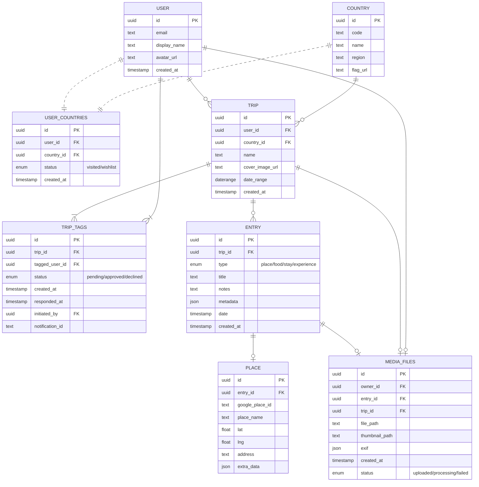

# Travel Logging MVP Technical Design Document

## Product Overview

The Travel Logging MVP is a purpose-built mobile application (React Native for iOS/Android) for structured travel memory keeping, employing a country-first ("passport grid") interface. All user data—countries, trips, trip participants (with consent logic), and granular entries (places, experiences, food, stays)—is managed through a normalized cloud backend (Supabase) designed to maximize privacy and extensibility for future social functionality.

Key product flows leverage a visual grid to promote country-level exploration. Trips are strictly compartmentalized under countries and require explicit participant approval before surfacing on any profile. All photos/media leverage secure cloud storage with granular linking to entries and EXIF-support. The architecture is built for real-time sync, offline robustness, and future extensibility in sharing, comments, and privacy control.

---

## Core Features

### 1\. Passport Grid (Country Logging)

- **Country Grid Home:** An interactive global grid, visualizing all countries, their flags, and visitation status.

- **Filtering & Feedback:** Supports regional/alpha filtering, animated indicators, badge unlocks.

- **Country Detail View:** Shows user's trips for the country and entry-points to add new trips.

### 2\. Onboarding & Motivation

- **Micro-Quiz:** Captures user travel style, influences future recommendations.

- **Country Selection:** Batch marking visited/wishlist countries.

- **Visual Momentum:** Animated feedback boosts engagement.

- **Account/Cloud Migration:** Device-local data with optional, immediate cloud/sync via Supabase Auth.

### 3\. Trip Management per Country

- **Multiple Trips per Country:** Trips feature name (required), cover image (optional), dates (optional), tagged companions.

- **Companion Tagging/Consent:** Tag friends on trip creation. Consent required per PRD-compliant workflow.

- **Visbility Logic:** Trips protected by per-user approval states.

### 4\. Entry Logging Within Trips

- **Hierarchical Structure:** All entries attach to a specific trip (never global or direct to country).

- **Entry Types:** Place (Google Places), Food, Stay, Experience—each supporting notes, photos, and trip-wide tagging.

- **Media:** Uploads managed via Supabase Storage; client provides EXIF-based sorting if available.

### 5\. Synchronization and Device-to-Cloud Migration

- **Offline-First:** Local queue, background sync on connectivity.

- **Conflict Handling:** Last-write-wins with clear UI feedback.

- **Guest Mode:** Full functionality offline; sync to cloud/user account optional.

### 6\. Social Consent Protocol

- **Trip Tagging Only:** Tagging at trip-level, never at entry-level (MVP).

- **Consent Flow:** Approval requests per friend with notification/email delivery; only approved trips appear cross-profile.

- **Notifications:** Configurable by user preferences.

### 7\. Extensibility

- **Forward-Ready Models:** All schema/linkages enable future social features, sharing, and comment layers with minimal revision.

---

## Architectural Overview

### Supabase Component Roles

### Data, Consent, and File Flow

- **RESTful routes:** Expose CRUD operations, gated via RLS and augmented through Supabase Functions where cross-object updates (e.g., consent triggers or bulk media associations) are required.

- **Consent/Notifications:** Consent requests and trip sharing logic reside in trips/trip_tags, with webhooks/Functions triggering notifications as part of approval flow.

- **Uploads:** File uploads are handled in Storage, linked to trips or entries via foreign keys; special upload status management for error/duplication/edge-case handling.

- **RLS:** All data access is filtered such that only the owner, or specifically approved friends (via explicit consent), may read/update associated trips or entries.

---

## Full Data Model (ERD + Tables)

### Visual ERD (Mermaid)



### Entity Definitions & Indices

**1. user**

**2. country**

**3. user_countries**

**4. trip**

**5. trip_tags** (Consent Workflow)

**6. entry**

**7. place**

**8. media_files**

---

## System Interfaces

### Authentication

- **/auth/signup** (`POST`)
  - **Purpose:** Registers new user; initiates verification.

  - **Auth:** None required

  - **Params:** `{ email, password, display_name }`

  - **Request:**

    ```json
    {
      "email": "test@demo.com",
      "password": "xxxx",
      "display_name": "Chris Traveler"
    }
    ```

````

  * **Response:**

    ```json
    { "id": "uuid", "status": "pending_verification" }

````

- **Errors:** 409 email exists, 400 validation error

- **/auth/login** (`POST`)
  - **Purpose:** User login

  - **Params:** `{ email, password }`

  - **Response:** `{ "access_token": "JWT", "user": {...} }`

  - **Errors:** 401, 400

### Country Model

- **/countries** (`GET`)
  - **Returns:** All countries

  - **Auth:** Optional

  - **Params:** `?filter=visited` (future), `?search=`, `?region=`

  - **Response:**

    ```json
    \[ { "id": "...", "code": "FR", "name": "France", "region": "Europe", "flag_url": "..." }, ... \]

    ```

````

  * **Errors:** —

* **/user_countries** (`GET`)

  * **Returns:** Countries linked to current user (with status)

  * **Auth:** Required

  * **Response:**

    ```json
    \[ { "country_id": "...", "status": "visited" }, ... \]

````

- **/user_countries** (`POST`)
  - **Sets status:** Mark country as visited/wishlist.

  - **Body:**

    ```json
    { "country_id": "...", "status": "visited" }
    ```

````

  * **Response:** 204, 409 duplicate

### Trips

* **/trips** (`POST`)

  * **Purpose:** Create trip under a country.

  * **Auth:** Required

  * **Body:**

    ```json
    {
      "country_id": "uuid_country",
      "name": "Spring in Kyoto",
      "cover_image_url": "storage-path.jpg",
      "date_range": \["2023-04-01","2023-04-07"\],
      "tagged_user_ids": \["friend-uuid", ...\]
    }

````

- **Logic:** For each tagged user (if any), create trip_tags as 'pending' and trigger notification function.

- **Response:**

  ```json
  { "id": "uuid", "status": "pending", "trip_tags": \[ { "tagged_user_id": "...", "status": "pending" } \] }

  ```

````

  * **Error Cases:** 409 duplicate, 400 invalid country, 422 missing consent

  * **Notification:** Notification function is invoked for each tagged user with trip/context data.

  * **Edge Notes:** If tagging self only, trip auto-approves.

* **/trips/:id** (`GET`)

  * **Returns:** Trip detail, filtered by viewer—but only if trip is owned by or approved for the current user.

  * **Response:**

    ```json
    { "id": "...", "country_id": "...", "name": "...", "trip_tags": \[ ... \], "entries": \[ ... \] }

````

- **Errors:** 403 if unauthorized, 404 not found

- **/trips/:id/approve** (`POST`)
  - **Purpose:** Approve trip invitation as tagged user.

  - **Auth:** Required

  - **Body:** None

  - **Response:**

    ```json
    { "status": "approved" }
    ```

````

  * **Notification:** Notifies initiator (typically via webhook).

  * **Errors:** 404 not tagged, 409 already actioned

* **/trips/:id/decline** (`POST`)

  * **Purpose:** Decline tagging. Trip is not shown in user’s passport grid.

  * **Body:** None

  * **Response:**

    ```json
    { "status": "declined" }

````

- **Errors:** 404 not tagged, 409 already actioned

### Entries

- **/trips/:trip_id/entries** (`GET`)
  - **Purpose:** List entries under a trip.

  - **Auth:** Required (must own/approved)

  - **Response:**

    ```json
    \[
      { "id": "entry-uuid", "type": "place", "title": "...", "date": "...", "notes": "...", "metadata": {...},
        "media_files": \[ ... \] }
      ...
    \]

    ```

````

* **/trips/:trip_id/entries** (`POST`)

  * **Purpose:** Add entry (place/food/stay/experience) to a trip.

  * **Auth:** Required

  * **Body:**

    ```json
    {
      "type": "place",
      "title": "Osaka Castle",
      "date": "2023-04-03",
      "notes": "...",
      "metadata": {"google_place_id": "...", "lat": ..., "lng": ...}
    }

````

- **Response:** `{ "id": "..." }`

- **Errors:** 400 bad data, 403 not permitted to add (not member/approved)

- **/entries/:id** (`PATCH`)
  - **Purpose:** Update entry fields/notes.

  - **Body:**

    ```json
    { "title": "...", "notes": "..." }
    ```

````

  * **Errors:** 404, 403

* **/entries/:id/delete** (`POST` or `DELETE`)

  * **Purpose:** Delete entry (soft/hard); removes attached media.

  * **Response:** 204

### Places

* **/places/:id** (`GET`)

  * **Fetch:** Place metadata for entry with Google Place integration.

  * **Response:**

    ```json
    { "id": "...", "google_place_id": "...", "place_name": "...", "lat": ..., "lng": ..., "address": "...", "extra_data": {...} }

````

### Media Files (Photo/Attachment Uploads)

- **/media/files/signed-url** (`POST`)
  - **Purpose:** Get presigned URL for upload to Supabase Storage.

  - **Auth:** Required

  - **Body:**

    ```json
    { "entry_id": "...", "type": "image/jpeg", "size": 204800 }
    ```

````

  * **Response:**

    ```json
    { "url": "https://storage.supabase.io/bucket/path", "media_id": "uuid" }

````

- **Error Cases:** 413 file too large, 403 not permitted, 400 invalid type

- **Notes:** Client uploads file via this URL. Status field in media_files is 'processing' until upload complete and backend validates.

- **/media/files/:id** (`GET`)
  - **Returns:** Media file metadata, with secure access path (if owner/approved).

  - **Edge Cases:** Stale/failed files can be retried via new signed-url endpoint.

- **/media/files/:id/delete** (`DELETE`)
  - **Purpose:** Remove file (if owner; marks for purge in Storage).

### Consent/Notification Flows

- **Consent State Machine**
  - **Initial:** Trip_tags rows default to 'pending'.

  - **Approval:** Endpoint sets to 'approved', updates responded_at.

  - **Decline:** Sets to 'declined', excludes from profile views.

  - **Notification Triggering:** Each tagging event posts a payload to either Supabase Functions (for app push) or to an external email/webhook; IDs tracked in trip_tags.notification_id.

  - **Edge Cases:** Tagging a user already tagged on trip yields 409, updating a handled consent returns 409, self-tag always auto-approves.

### General API Error Format

```json
{
  "error": "InvalidInput",
  "message": "Country not found",
  "details": { "field": "country_id" }
}
```

- Consistent for all endpoints; error key, user-safe message, optional details per field.

### Notification Flow Notes

- **Triggers:** Creating a trip with tagged friends or actions on trip_tags table

- **Delivery Options:**
  - In-app push (via Supabase Realtime + custom functions)

  - Configurable email (template data available via user record)

- **Status:** Each trip_tags row updated for tracking

- **Failures:** On notification delivery error (bounce, device unreachable), status and re-alert are logged to notification_id/aux fields

### File Upload Handling

- **Upload Status Management:**
  - File initially 'processing'

  - On successful Storage upload + confirmation, set to 'uploaded'

  - If upload fails or is incomplete after timeout, set to 'failed'; app can retry or prompt user

  - Stale/abandon files subject to nightly cleanup (future)

- **Edge Cases:** Duplicate hash (same file via different entries) can be deduped/future-linkable; orphaned files are sweeped

---

## Core User Flows (API/Backend-First Perspective)

### Onboarding & Registration (Data/Backend)

1. **/auth/signup** — New account row created.

2. **/user_countries (POST)** — Batch mark visited/wishlist countries.

3. **/trips (POST)** — Create first trip(s), begin consent flows if tagging.

4. **/trips/:id/entries (POST)** — Begin creating initial entries with or without photos.

### Exploring Countries & Managing Trips

- **GET /user_countries** — Populate grid status

- **GET /trips** — List per-country trips (ownership or approved)

- **/trips/:id/approve/decline** — Update consent; notification flow updates/prunes

### Trip Consent Workflow

- **POST /trips (with tagged_user_ids)** — Each tagged friend gets pending row + notification

- **POST /trips/:id/approve** — Tagged user accepts, triggers notification back to creator

- **Only trips with all tags approved show on user profiles.**

### Entry Logging

- **POST /trips/:trip_id/entries** — Add places/food/stays/experiences

- **POST /media/files/signed-url** — Attach/upload photos

- **GET /trips/:trip_id/entries** — List and display structured entries

### File Upload Handling

1. User requests signed URL; uploads file directly to Storage

2. File row in media_files set to 'processing'

3. On upload confirm, marked 'uploaded' (else 'failed')

---

## Extensibility & Social Protocol

- **Trip Consent Core:** All trip shares are gated by explicit trip_tags row (per friend), supporting extension to comment, share, or privacy layer in future.

- **Tagging Architecture:** Simple to expand beyond trip (e.g., entry-level, post-MVP).

- **Notification Handling:** Notification metadata in trip_tags allows future addition of delivery status, read/receipt, or escalation flows.

- **RLS Policies:** All data scoped to owner or explicitly approved/trusted friends, supporting granular sharing/role rights.

---

## Analytics, Storage & Scalability

### Analytics

- All trackable events (trip creation, entry types, tagging actions) are event-driven, user-triggered only—no passive or location surveillance.

- Optional event logging (via Supabase Functions or in-app tracking) for feature adoption, onboarding conversion, and sync/migration rates.

### Storage & Scale

- **Supabase Infrastructure:** Data and media at global scale; media auto-compressed, Storage enforces per-user/trip access controls.

- **Indices/Query Planning:** Fast lookups for UX through indices on core foreign keys, status enums, composite (user, trip, status).

- **Offline/Sync:** Local-first support with robust sync/merge flows, instant feedback on device; eventual/write-wins on cloud.

### Security & Permissions

- **Supabase Auth + RLS:** All create/read/update operations subject to strict RLS policies locking data to its owner or tagged/consenting users.

- **End-to-End Encryption:** TLS in transit, project-level storage AES at rest.

- **Privacy/Rights Model:** Users have full control over data visibility; future-ready schema for extensible sharing/role models.

---

## MVP Scalability Considerations

- **Optimized Lookups:** Indexed per country, trip, status for instant country/trip/entry grid rendering.

- **Rich Client State:** Minimal backend round-trips; state caches/invalidations planned for visual UX.

- **File/Upload Robustness:** Uploads handle retry, network failure, deduplication, and clean-up edge cases to avoid broken app paths.

---

## Conclusion

This MVP delivers a robust, country-centric travel memory application with strong privacy, intuitive trip consent, and a forward-ready, normalized data schema. Supabase’s platform (DB, Storage, RLS, Functions) enables seamless, secure, and instantly extensible product experiences around travel logging and future social sharing. All backend components, API contracts, and data models are optimized for clarity, performance, and future growth.
