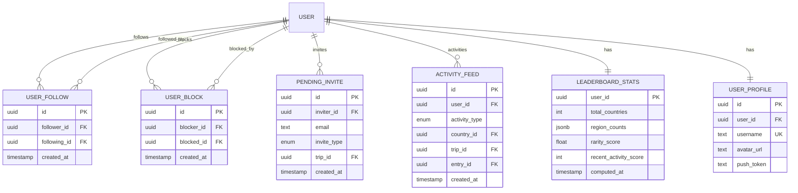

# PRD: Friends & Social System

## Version

- **Version**: 1.0
- **Created**: 2025-12-26
- **Status**: Draft

---

## 1. Introduction/Overview

Atlasi's social layer enables users to connect with friends, see where they've traveled, and compare their travel achievements. This feature transforms the app from a personal travel diary into a social platform where users can discover destinations through friends' experiences and engage in friendly competition via rankings among friends.

### Problem Statement

Currently, Atlasi lacks any social connectivity between users. While trip tagging exists conceptually in the schema, there's no way to:

- Find and connect with other users
- See where friends have traveled
- Compare travel statistics
- Build a social feed of friends' activities

### Solution Summary

Implement an **asymmetric follow model** (similar to Instagram) where users can follow others to see their travel activity. This creates a lightweight, low-friction social experience that encourages discovery and engagement while respecting user autonomy.

---

## 2. Goals

### Business Goals

- **Increase retention**: Friends who see each other's travels are more likely to return to the app
- **Drive viral growth**: Email invites to non-users create new user acquisition channel
- **Increase engagement**: Friend rankings and feeds give users reasons to log more trips
- **K-factor improvement**: Target K-factor of 0.5+ through friend invites

### User Goals

- Easily find and follow friends on the platform
- See where friends have traveled and what they recommend
- Compare travel achievements with friends (friendly competition)
- Share travel experiences with a trusted network

### Success Metrics

- **Follow rate**: 50%+ of active users follow at least 3 people within 30 days
- **Feed engagement**: 40%+ of users with followers check feed weekly
- **Invite conversion**: 15%+ of email invites result in new signups
- **Friends tab engagement**: 30%+ weekly active users visit Friends tab

---

## 3. User Stories

### Following & Discovery

**US-F01: Search for users by username**

> As a user, I want to search for friends by their username so that I can follow them and see their travels.

- **Acceptance Criteria**:
  - Search input with real-time results as user types
  - Results show username, avatar, and country count
  - "Follow" button on each result
  - Debounced search (300ms) to reduce API calls

**US-F02: Search for users by email**

> As a user, I want to search for friends by email so that I can find people I know even if I don't know their username.

- **Acceptance Criteria**:
  - Email search returns exact matches only (privacy)
  - If user found, show profile with follow button
  - If user not found, offer to send email invite
  - Email addresses are not displayed in search results (privacy)

**US-F03: Invite non-users via email**

> As a user, I want to invite friends who aren't on the app yet so we can connect when they join.

- **Acceptance Criteria**:
  - When email search returns no results, show "Invite" option
  - Invitation creates a pending follow relationship
  - Invited user receives branded email with signup link
  - When invited user signs up, pending follow auto-activates
  - Inviter can see pending invites in their following list

**US-F04: Follow another user**

> As a user, I want to follow another user so that I can see their travel activity in my feed.

- **Acceptance Criteria**:
  - One-tap follow from search results, profiles, or suggested users
  - Following is asymmetric (they don't need to follow back)
  - Followed user receives notification of new follower
  - Follower immediately sees followed user's activity in feed

**US-F05: Unfollow a user**

> As a user, I want to unfollow someone so I stop seeing their activity in my feed.

- **Acceptance Criteria**:
  - Unfollow available from their profile or following list
  - No notification sent to unfollowed user
  - Their content immediately removed from feed
  - Historical data (joint trips) remains intact

**US-F06: View my followers and following lists**

> As a user, I want to see who follows me and who I follow so I can manage my social network.

- **Acceptance Criteria**:
  - Two tabs: "Following" and "Followers"
  - Each shows avatar, username, country count
  - Quick follow/unfollow toggle
  - Pending email invites shown in Following list with "Pending" badge

### Blocking

**US-F07: Block a user**

> As a user, I want to block someone so they can't follow me or see my content.

- **Acceptance Criteria**:
  - Block option available from user profile (overflow menu)
  - Blocking removes any existing follow relationship (both directions)
  - Blocked user cannot find blocker in search
  - Blocked user cannot see blocker's profile or content
  - Blocker can manage blocked list in settings

**US-F08: Unblock a user**

> As a user, I want to unblock someone I previously blocked.

- **Acceptance Criteria**:
  - Blocked users list in settings
  - Unblock removes block but doesn't restore follows
  - No notification sent to unblocked user

### Profile & Visibility

**US-F09: View another user's profile**

> As a user, I want to view someone's profile to see their travels before following them.

- **Acceptance Criteria**:
  - Profile shows: avatar, username
  - Stats: countries visited, trips count, follower/following counts
  - Passport grid showing visited countries
  - List of their trips (name, country, cover photo)
  - Follow/Unfollow button
  - All content visible regardless of follow status (public profiles)

**US-F10: View trip details from a friend's profile**

> As a user, I want to tap on a friend's trip to see the full details including entries and photos.

- **Acceptance Criteria**:
  - Tap trip card to view full trip detail
  - Shows all entries (places, food, stays, experiences)
  - Shows all photos
  - Read-only view (cannot edit friend's content)

### Username System

**US-F11: Set my username**

> As a user, I want to set a unique username so friends can find me easily.

- **Acceptance Criteria**:
  - Username required during onboarding (update `NameEntryScreen` to collect username)
  - Username must be unique (case-insensitive), 3-30 characters
  - Allowed characters: letters, numbers, underscores only
  - **No spaces allowed**
  - Real-time availability check as user types
  - Case-insensitive uniqueness (e.g., "EmersonTaylor" and "emersontaylor" are the same)
  - Replaces legacy `display_name` field

**US-F12: Change my username**

> As a user, I want to change my username if I want a different one.

- **Acceptance Criteria**:
  - Editable in profile settings
  - Same validation rules as creation
  - Old username released immediately (no reservation period for MVP)
  - Warning that existing links/shares may break
  - Real-time uniqueness check on edit

### Trip Tagging Integration

**US-F13: Auto-follow on trip tag acceptance**

> As a user who accepts a trip tag, I want to automatically follow the tagger so we stay connected.

- **Acceptance Criteria**:
  - When user accepts trip tag:
    - Tagged user auto-follows the tagger (one-way, not mutual)
  - Tagged user notified that they now follow the tagger
  - Works even if tagged user was invited via email

**US-F14: Tag a non-user on a trip via email**

> As a user, I want to tag someone on a trip even if they're not on the app yet.

- **Acceptance Criteria**:
  - Trip tagging allows email input for non-users
  - Creates pending trip tag + pending follow relationship
  - Non-user receives email invite to join and see the trip
  - Upon signup, trip tag becomes active (still needs approval)
  - Upon trip approval, auto-follow logic applies

### Feed

**US-F15: View friends' activity feed**

> As a user, I want to see a feed of my friends' travel activities so I stay updated on their adventures.

- **Acceptance Criteria**:
  - Feed shows activities from users I follow
  - Activity types:
    - "{username} visited {country}" - when marking country as visited
    - "{username} added a {entry_type} in {location}" - individual entry cards
  - **Rich entry cards** showing:
    - User avatar and username (small, at top)
    - Entry photo (large, prominent)
    - Entry name/title
    - Location details
    - Entry type indicator (place, food, stay, experience)
  - Each feed item is tappable to view full entry/trip detail
  - Infinite scroll with pagination
  - Pull-to-refresh
  - Empty state when following nobody or no recent activity

### Friends Stats (Rankings)

**US-F17: View my rank among friends**

> As a user, I want to see how I rank among people I follow at the top of the Friends screen.

- **Acceptance Criteria**:
  - Stats displayed at top of Friends tab (like PassportScreen stats pattern)
  - Show my rank among users I follow (e.g., "#3 of 12 friends")
  - Stats include: total countries, rarity score
  - Tapping stats could show breakdown or friends list sorted by stat
  - Empty state if following nobody

### Notifications

**US-F20: Receive notification when someone follows me**

> As a user, I want to be notified when someone new follows me.

- **Acceptance Criteria**:
  - Push notification: "{username} started following you"
  - In-app notification in notification center
  - Tap notification opens follower's profile

**US-F21: Receive notification when tagged on a trip**

> As a user, I want to be notified when someone tags me on their trip.

- **Acceptance Criteria**:
  - Push notification: "{username} tagged you on their trip to {country}"
  - In-app notification with approve/decline actions
  - Tap opens trip preview with action buttons

---

## 4. Functional Requirements

### 4.1 Data Model

#### New Tables

**FR-01: Create `user_follow` table**

```
user_follow
- id: UUID (PK)
- follower_id: UUID (FK to auth.users) -- who is following
- following_id: UUID (FK to auth.users) -- who is being followed
- created_at: TIMESTAMPTZ
- UNIQUE(follower_id, following_id)
```

**FR-02: Create `user_block` table**

```
user_block
- id: UUID (PK)
- blocker_id: UUID (FK to auth.users) -- who blocked
- blocked_id: UUID (FK to auth.users) -- who is blocked
- created_at: TIMESTAMPTZ
- UNIQUE(blocker_id, blocked_id)
```

**FR-03: Create `pending_invite` table**

```
pending_invite
- id: UUID (PK)
- inviter_id: UUID (FK to auth.users)
- email: TEXT (normalized, lowercase)
- invite_type: ENUM ('follow', 'trip_tag')
- trip_id: UUID (FK to trip, nullable) -- only for trip_tag type
- created_at: TIMESTAMPTZ
- accepted_at: TIMESTAMPTZ (nullable)
- UNIQUE(inviter_id, email, invite_type, COALESCE(trip_id, '00000000-0000-0000-0000-000000000000'))
```

Note: COALESCE handles NULL trip_id for 'follow' type invites in uniqueness check

**FR-04: Create `activity_feed` table (materialized/denormalized)**

```
activity_feed
- id: UUID (PK)
- user_id: UUID (FK to auth.users) -- whose activity
- activity_type: ENUM ('country_visited', 'entry_added')
- country_id: UUID (FK to country, nullable)
- trip_id: UUID (FK to trip, nullable)
- entry_id: UUID (FK to entry, nullable) -- for entry_added type (individual entries)
- created_at: TIMESTAMPTZ
```

**FR-05: Create `leaderboard_stats` table (cached/computed)**

```
leaderboard_stats
- user_id: UUID (PK, FK to auth.users)
- total_countries: INT
- region_counts: JSONB -- {"Europe": 12, "Asia": 5, ...}
- rarity_score: FLOAT
- recent_activity_score: INT -- countries + entries in last 90 days
- computed_at: TIMESTAMPTZ
```

#### Modifications to Existing Tables

**FR-06: Add `username` to `user_profile` (replaces legacy `display_name`)**

```sql
-- Add username column with unique constraint
ALTER TABLE user_profile ADD COLUMN username TEXT;

-- Add case-insensitive unique index
CREATE UNIQUE INDEX idx_user_profile_username_lower ON user_profile(LOWER(username));

-- Add validation constraint (letters, numbers, underscores only - NO SPACES)
ALTER TABLE user_profile ADD CONSTRAINT chk_username_format
  CHECK (username ~ '^[a-zA-Z0-9_]{3,30}$');

-- Make username NOT NULL after migration (fresh launch, so immediate)
ALTER TABLE user_profile ALTER COLUMN username SET NOT NULL;

-- Optional: Drop legacy display_name column after migration
-- ALTER TABLE user_profile DROP COLUMN display_name;
```

- Note: `username` replaces the legacy `display_name` field
- Validation: 3-30 characters, letters/numbers/underscores only, NO SPACES
- Case-insensitive uniqueness enforced at database level

**FR-07: Remove date_range from trip table**

```sql
ALTER TABLE trip DROP COLUMN date_range;
```

- Note: This simplifies the data model per user request

### 4.2 API Endpoints

#### Follow System

**FR-08: POST /follows/{user_id}**

- Follow a user
- Creates user_follow record
- Triggers notification to followed user
- Returns: 201 Created, or 409 if already following

**FR-09: DELETE /follows/{user_id}**

- Unfollow a user
- Deletes user_follow record
- No notification sent
- Returns: 204 No Content

**FR-10: GET /follows/following**

- List users the current user follows
- Includes pending email invites
- Pagination: limit/offset
- Returns: Array of UserSummary objects

**FR-11: GET /follows/followers**

- List users who follow the current user
- Pagination: limit/offset
- Returns: Array of UserSummary objects

**FR-12: GET /follows/stats**

- Get follow counts for current user
- Returns: { following_count, followers_count }

#### User Discovery

**FR-13: GET /users/search?q={query}**

- Search users by username (prefix match) or exact email
- Excludes blocked users and users who blocked searcher
- Returns: Array of UserSummary objects
- Rate limited: 30/minute

**FR-14: GET /users/{username}/profile**

- Get public profile for a user
- Returns: Full profile with stats, countries, trips
- Excludes if blocked relationship exists (404)

#### Invites

**FR-15: POST /invites**

- Create email invite for non-user
- Body: { email, invite_type: 'follow' | 'trip_tag', trip_id? }
- Sends invitation email
- Creates pending_invite record
- Rate limited: 10/hour

**FR-16: GET /invites/pending**

- List pending invites sent by current user
- Returns: Array of pending invites with status

#### Blocking

**FR-17: POST /blocks/{user_id}**

- Block a user
- Removes any follow relationships (both directions)
- Returns: 201 Created

**FR-18: DELETE /blocks/{user_id}**

- Unblock a user
- Returns: 204 No Content

**FR-19: GET /blocks**

- List blocked users
- Returns: Array of UserSummary objects

#### Feed

**FR-20: GET /feed**

- Get activity feed from followed users
- Pagination: cursor-based (before timestamp)
- Returns: Array of FeedItem objects
- Excludes activity from blocked users

#### Friends Stats

**FR-21: GET /stats/friends-ranking**

- Get current user's rank among users they follow
- Returns: { rank, total_friends, total_countries, rarity_score }
- Used for stats display at top of Friends screen

### 4.3 RLS Policies

**FR-22: user_follow policies**

- Users can view follows where they are follower or following
- Users can insert where they are the follower
- Users can delete where they are the follower
- Block check: prevent follow if block exists either direction

**FR-23: user_block policies**

- Users can only see their own blocks
- Users can insert where they are the blocker
- Users can delete where they are the blocker

**FR-24: user_profile visibility**

- All profiles publicly readable (except blocked)
- Users can only update their own profile

**FR-25: trip visibility update**

- Trips are visible to owner, approved tagged users, AND any follower
- Entries visible under same rules

### 4.4 Notifications

**FR-26: Push notification integration**

- Integrate with Expo Push Notifications
- Store push tokens in user_profile
- Send notifications for: new follower, trip tag

**FR-27: Email notification for invites**

- Branded email template for friend invites
- Includes: inviter name, CTA to download/signup
- Deep link to auto-connect on signup

### 4.5 Background Jobs

**FR-28: Stats computation (simplified)**

- **Trigger**: When any user adds a country to their visited list
- **Scope**: Recompute stats for that user only
- **Implementation**:
  - Database trigger on `user_countries` INSERT updates `leaderboard_stats` for that user
  - Simple SQL trigger (no Edge Function needed for MVP)
- **Friends ranking**: Computed on-demand when user views Friends tab
  - Query: Compare user's `total_countries` to users they follow
  - No pre-computation needed for followers
- Rarity score = sum of (1 / visitor_count) for each country

**FR-29: Activity feed generation**

- Triggered when: country marked visited, entries added to trip
- Creates activity_feed record
- Old activities pruned after 90 days

**FR-30: Pending invite processing**

- On user signup, check for pending invites by email
- Auto-create follow relationships
- Activate pending trip tags (still need approval)

**FR-31: Notification delivery**

- Individual notifications (not batched) for launch
- Push via Expo Push Notifications
- Email via Resend (already integrated with Supabase)

---

## 5. Non-Goals (Out of Scope)

1. **Direct messaging** - No chat/DM functionality
2. **Comments on trips/entries** - No commenting system
3. **Reactions (likes)** - No like/heart functionality
4. **Stories/ephemeral content** - No disappearing posts
5. **Groups** - No group functionality
6. **Privacy settings** - All profiles are public (no private accounts)
7. **Granular visibility controls** - No per-trip or per-country privacy
8. **Phone contacts sync** - Not in initial release (privacy complexity)
9. **Social login friend finding** - Not syncing Facebook/Google contacts
10. **Suggested friends algorithm** - No ML-based suggestions (manual search only)

---

## 6. Design Considerations

### Navigation Structure

The Friends tab becomes the social hub with a unified screen design (similar to PassportScreen pattern):

**Screen Layout (top to bottom):**

1. **Friends Ranking Stats** (top section) - Stats showing rank among friends (like `PassportStatsGrid`)
2. **Search Bar** - Find and follow users (like `PassportSearchBar` pattern)
3. **Activity Feed** (main content) - Scrollable list of friend activity

**Key UI Patterns to Reuse:**

- `PassportStatsGrid` / `StatBox` for friends ranking display at top
- `PassportSearchBar` for user search functionality
- Entry card components for rich feed items

**Profile** remains accessible from existing header icon in settings

### UI Components Needed

- **UserCard** - Avatar, username, country count, follow button
- **FeedItem** - Rich entry card with user info, photo, entry details, location
- **FriendsRankingStats** - Stats grid showing rank among friends (reuse `StatBox` pattern)
- **ProfileHeader** - Large avatar, stats, follow/block actions
- **UserSearchBar** - Search input (reuse `PassportSearchBar` pattern)
- **FollowButton** - Toggle follow/following state
- **EmptyState** - For empty feed, no followers, etc.

### Visual Design

- Follow button: Primary action (blue/accent color)
- Following state: Outlined/secondary button "Following" with checkmark
- Block: Red destructive action, hidden in overflow menu
- Feed items: Card-based, consistent with existing trip cards
- Stats: Similar to PassportStatsGrid with colored stat boxes

---

## 7. Technical Considerations

### Database Architecture

**Indexing Strategy**

```sql
-- Follow queries
CREATE INDEX idx_user_follow_follower ON user_follow(follower_id);
CREATE INDEX idx_user_follow_following ON user_follow(following_id);

-- Block checks (frequent)
CREATE INDEX idx_user_block_both ON user_block(blocker_id, blocked_id);
CREATE INDEX idx_user_block_reverse ON user_block(blocked_id, blocker_id);

-- Feed queries (by followed users, sorted by time)
CREATE INDEX idx_activity_feed_user_time ON activity_feed(user_id, created_at DESC);

-- Stats queries (for ranking among friends)
CREATE INDEX idx_leaderboard_total ON leaderboard_stats(total_countries DESC);
CREATE INDEX idx_leaderboard_rarity ON leaderboard_stats(rarity_score DESC);
```

**Scalability Considerations**

- Activity feed uses fan-out-on-read (simpler, works for MVP scale)
- Stats are precomputed and cached per user
- Consider fan-out-on-write for feed if >100k users

### API Rate Limiting

- Search: 30/minute (prevent scraping)
- Follow/Unfollow: 60/minute
- Invites: 10/hour (prevent spam)
- Feed: 120/minute

### Email Integration

- **Provider**: Resend (already integrated with Supabase)
- **Delivery**: Via Supabase Edge Functions calling Resend API
- **Templates**: Friend invite, trip tag notification
- Unsubscribe link required
- Track delivery/open rates via Resend dashboard

### Migration Path

1. **Phase 1**: Username system (required before launch)

   - Add `username` column (replaces legacy `display_name`)
   - Update onboarding to collect username with uniqueness check
   - Update profile settings for username editing

2. **Phase 2**: Follow system

   - user_follow table + APIs
   - User search + profile view
   - Follow/unfollow functionality

3. **Phase 3**: Feed

   - activity_feed table
   - Feed generation on actions
   - Feed display UI

4. **Phase 4**: Friends Ranking Stats

   - leaderboard_stats computation for friends ranking
   - Stats display at top of Friends screen

5. **Phase 5**: Blocking + Invites
   - Block functionality
   - Email invite system
   - Pending invite processing

---

## 8. Success Metrics

### Acquisition Metrics

- Email invite send rate (invites per user per month)
- Invite-to-signup conversion rate
- Time from invite to signup

### Engagement Metrics

- Average follows per user
- Feed scroll depth (how far users scroll)
- Feed return rate (% returning to feed within 7 days)
- Friends tab visit frequency

### Retention Metrics

- D7, D30, D90 retention for users with 3+ follows vs without
- Churn rate comparison: social users vs non-social users

### Health Metrics

- Block rate (high block rate may indicate problems)
- Unfollow rate
- Report rate (when implemented)

---

## 9. Decisions Made

The following questions have been resolved:

| Question                      | Decision                                                                                  |
| ----------------------------- | ----------------------------------------------------------------------------------------- |
| Username field                | New `username` column replaces legacy `display_name`                                      |
| Username format               | No spaces allowed - letters, numbers, underscores only (3-30 chars)                       |
| Username uniqueness           | Required - case-insensitive unique constraint                                             |
| User migration                | Not needed - fresh launch, no existing users to migrate                                   |
| Notification frequency        | Individual notifications (not batched) for launch                                         |
| Email provider                | Resend (integrated via Supabase, not directly in codebase)                                |
| Stats refresh                 | Simple SQL trigger updates user's stats; friends ranking computed on-demand               |
| Push notifications            | Expo Push Notifications (native to Expo/React Native stack)                               |
| Feed algorithm                | Pure chronological (no ranking/relevance for MVP)                                         |
| Feed item display             | Rich entry cards with photo, name, location (not aggregated counts)                       |
| Rarity score formula          | Linear `1/visitor_count` - rewards truly rare destinations dramatically                   |
| Profile photos                | Tap avatar icon in profile to upload (existing pattern)                                   |
| Background job infrastructure | Simple SQL triggers for stats; Edge Functions only for email/push/pruning                 |
| Friends tab UI                | Friends ranking stats at top (like PassportScreen), search like existing explore          |
| Leaderboard scope             | Friends only - no global leaderboard, just rank among people you follow                   |
| Visitor count                 | Visited countries only (not wishlist) for rarity calculation                              |

---

## 10. Technical Details: Rarity Score

The rarity score rewards users who visit uncommon destinations.

**Formula:**

```
rarity_score = Σ (1 / visitor_count) for each visited country
```

**Example:**
| User | Countries Visited | Calculation | Score |
|------|-------------------|-------------|-------|
| Alice | France (10k), Spain (8k), Japan (5k) | 1/10000 + 1/8000 + 1/5000 | 0.000425 |
| Bob | Bhutan (200), Turkmenistan (100), Mongolia (500) | 1/200 + 1/100 + 1/500 | 0.017 |

Bob scores 40x higher despite fewer countries — visiting rare places is rewarded.

**Implementation notes:**

- `visitor_count` comes from aggregating `user_countries` table
- Precompute visitor counts nightly or on-demand
- Store in `leaderboard_stats.rarity_score`

---

## 11. Technical Details: Background Jobs

**Architecture: Simple SQL Triggers (MVP)**

```
user_countries INSERT (database trigger)
        ↓
SQL trigger function updates leaderboard_stats for that user only
```

**What gets computed:**
- `total_countries`: COUNT of user's visited countries
- `rarity_score`: SUM of (1/visitor_count) for each visited country

**Friends ranking:** Computed on-demand (not pre-computed)
- When user views Friends tab, query compares their stats to users they follow
- Simple JOIN: `leaderboard_stats` + `user_follow` + comparison

**Why this approach:**

- Simplest possible implementation
- No Edge Functions needed for stats
- No fan-out to followers (their ranking computed when they view it)
- Works at any scale (ranking is always O(following_count))

**Edge Functions still used for:**

- Email invites via Resend
- Push notifications
- Activity feed pruning (scheduled job)

---

## 12. Appendix

### A. Schema Diagram (Mermaid)



### B. API Response Examples

**UserSummary**

```json
{
  "id": "uuid",
  "username": "wanderlust_ava",
  "avatar_url": "https://...",
  "country_count": 42,
  "is_following": true
}
```

**FeedItem**

```json
{
  "id": "uuid",
  "user": {
    /* UserSummary */
  },
  "activity_type": "country_visited",
  "country": { "code": "JP", "name": "Japan", "flag_url": "..." },
  "trip_id": null,
  "entry_count": null,
  "created_at": "2025-01-15T10:30:00Z"
}
```

**FriendsRanking**

```json
{
  "rank": 3,
  "total_friends": 12,
  "total_countries": 42,
  "rarity_score": 0.0125
}
```

### C. Notification Templates

**New Follower (Push)**

```
{avatar} {username} started following you
Tap to view their profile
```

**Trip Tag (Push)**

```
{avatar} {username} tagged you on their trip to {country}
Tap to approve or decline
```

**Friend Invite (Email)**

```
Subject: {inviter_name} wants to connect on Atlasi!

Hey there!

{inviter_name} invited you to join Atlasi - the app for tracking
your travels and seeing where your friends have been.

They've visited {country_count} countries and want to share their
adventures with you!

[Download the App]

See you on the other side of the border,
The Atlasi Team
```
