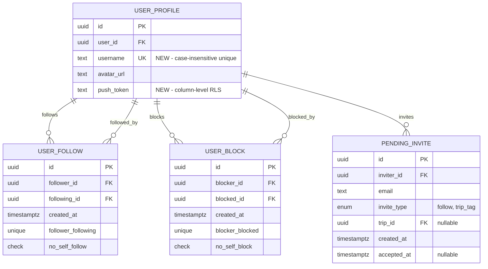

# Feature: Friends & Social System - Phase 1 (Revised)

**Version**: 1.1 - Post-Review Revision
**Created**: 2025-12-26
**Updated**: 2025-12-26 (After DHH, Kieran, Simplicity reviews)
**Type**: Enhancement
**Complexity**: Medium (reduced from High)

---

## Overview

Implement the complete Friends & Social system for Border Badge, enabling users to connect with friends, share travel experiences, and engage in friendly competition through rankings. This revised plan incorporates security fixes from code reviews while maintaining essential features (email invites, push notifications) and simplifying the architecture (removing pre-computed stats, querying on-demand).

**Key Changes from v1.0:**
- ✅ Removed `leaderboard_stats` table → compute rankings on-demand
- ✅ Removed `country_stats` table → query visitor counts live
- ✅ Removed `activity_feed` table → query source tables directly with UNION
- ✅ Enhanced security: email search protection, push token column-level security
- ✅ Fixed race conditions in username claiming
- ✅ Explicit lazy loading/infinite scroll specification
- ✅ Kept email invites (critical for growth)
- ✅ Kept push notifications (critical for engagement)

---

## Problem Statement

Currently, Border Badge lacks any social connectivity between users. While trip tagging exists in the schema, there's no way to:

- Find and connect with other users
- See where friends have traveled
- Compare travel statistics
- Build a social feed of friends' activities
- Invite non-users to join the platform

This limits engagement and creates no viral growth mechanism.

---

## Proposed Solution

Implement an **asymmetric follow model** (Instagram-style) with:

1. **Username System** - Unique usernames replacing legacy `display_name`
2. **Follow Relationships** - Users can follow others to see their activity
3. **Activity Feed** - Chronological feed of friends' travel activities (queried on-demand, lazy loaded)
4. **Friends Ranking** - Compare stats among people you follow (computed on-demand)
5. **Blocking** - Privacy controls to block unwanted users
6. **Email Invites** - Invite non-users via email with Resend (KEPT - critical for growth)
7. **Push Notifications** - Notify users of new followers and trip tags (KEPT - critical for engagement)
8. **Trip Visibility** - Followers can view each other's trips

---

## Technical Approach

### Architecture Overview

```
┌─────────────────┐
│  Mobile App     │
│  (React Native) │
│  + Infinite     │
│    Scroll Feed  │
└────────┬────────┘
         │ JWT Token
         ▼
┌─────────────────┐      ┌──────────────────┐
│  FastAPI        │◄────►│  Supabase        │
│  Backend        │      │  PostgreSQL      │
│  (On-demand     │      │  + RLS Policies  │
│   queries)      │      │  + Indexes       │
└────────┬────────┘      └──────────────────┘
         │
         ▼
┌─────────────────┐      ┌──────────────────┐
│  Supabase       │      │  Expo Push       │
│  Edge Functions │      │  Notifications   │
│  (Email/Push)   │      └──────────────────┘
└─────────────────┘
         │
         ▼
┌─────────────────┐
│  Resend API     │
│  (Email)        │
└─────────────────┘
```

### Database Schema (Simplified)



**Key Simplifications:**
- ❌ Removed `activity_feed` table - query `user_countries` + `entry` directly
- ❌ Removed `leaderboard_stats` table - compute rankings on-demand
- ❌ Removed `country_stats` table - query visitor counts live
- ✅ Kept core social tables (`user_follow`, `user_block`, `pending_invite`)

---

## Implementation Phases

### Phase 1.1: Username System (Foundation)

**Why First**: Username system is foundational - all social features depend on unique user identification.

**Tasks**:
- Create migration adding `username` column with case-insensitive unique index
- Add validation constraint (3-30 chars, letters/numbers/underscores only, NO SPACES)
- **SECURITY FIX**: Add unique constraint violation handling with suggestions
- Create backend endpoint `GET /users/check-username` for availability checks
- Create `UsernameCheckResponse` schema
- Update `NameEntryScreen.tsx` to collect username with validation on submit
- Create `useUsernameCheck.ts` hook (optional real-time check, validate on submit is primary)
- Update `ProfileSettingsScreen.tsx` for username editing
- Update profile API to validate username uniqueness with proper error handling
- Write backend tests for username availability and race conditions
- Write mobile tests for username validation

**Files to Create**:
- `supabase/migrations/XXXX_add_username.sql`
- `backend/app/schemas/users.py`
- `mobile/src/hooks/useUsernameCheck.ts` (optional enhancement)

**Files to Modify**:
- `mobile/src/screens/onboarding/NameEntryScreen.tsx`
- `mobile/src/screens/settings/ProfileSettingsScreen.tsx`
- `backend/app/api/profile.py`

**Security Enhancements**:
```python
# Handle race condition in username claiming
@router.patch("/profile")
async def update_profile(profile: ProfileUpdate, current_user: CurrentUser):
    try:
        result = await db.execute(...)
    except UniqueViolation:
        # Username was taken between check and claim
        suggestions = generate_username_suggestions(profile.username)
        raise HTTPException(
            status_code=409,
            detail={
                "code": "USERNAME_TAKEN",
                "message": f"Username '{profile.username}' is already taken",
                "suggestions": suggestions  # e.g., ["alice2", "alice_travels"]
            }
        )
```

### Phase 1.2: Database Schema & Migrations (Simplified)

**Tasks**:
- Create `user_follow` table with bidirectional indexes
- Add CHECK constraint preventing self-follows
- Create `user_block` table with composite indexes
- Add CHECK constraint preventing self-blocks
- Create `pending_invite` table with unique constraint using COALESCE
- Create RLS policies for all social tables
- **SECURITY FIX**: Add column-level security for `push_token`
- Create SECURITY DEFINER helper functions: `is_blocked_bidirectional()`
- Add `push_token` column to `user_profile` with restricted SELECT grants
- Remove deprecated `date_range` column from `trip` table
- **REMOVED**: `activity_feed` table (query on-demand instead)
- **REMOVED**: `leaderboard_stats` table (compute on-demand instead)
- **REMOVED**: `country_stats` table (query on-demand instead)

**Files to Create**:
- `supabase/migrations/XXXX_social_tables.sql`
- `supabase/migrations/XXXX_push_token_security.sql`

**Key Schema Changes**:

```sql
-- user_follow with self-follow prevention
CREATE TABLE user_follow (
  id UUID PRIMARY KEY DEFAULT gen_random_uuid(),
  follower_id UUID NOT NULL REFERENCES auth.users(id) ON DELETE CASCADE,
  following_id UUID NOT NULL REFERENCES auth.users(id) ON DELETE CASCADE,
  created_at TIMESTAMPTZ NOT NULL DEFAULT now(),
  UNIQUE(follower_id, following_id),
  CHECK (follower_id != following_id)  -- Prevent self-follow
);

CREATE INDEX idx_user_follow_follower ON user_follow(follower_id, created_at DESC);
CREATE INDEX idx_user_follow_following ON user_follow(following_id, created_at DESC);

-- user_block with bidirectional indexes
CREATE TABLE user_block (
  id UUID PRIMARY KEY DEFAULT gen_random_uuid(),
  blocker_id UUID NOT NULL REFERENCES auth.users(id) ON DELETE CASCADE,
  blocked_id UUID NOT NULL REFERENCES auth.users(id) ON DELETE CASCADE,
  created_at TIMESTAMPTZ NOT NULL DEFAULT now(),
  UNIQUE(blocker_id, blocked_id),
  CHECK (blocker_id != blocked_id)  -- Prevent self-block
);

CREATE INDEX idx_user_block_blocker ON user_block(blocker_id);
CREATE INDEX idx_user_block_blocked ON user_block(blocked_id);
CREATE INDEX idx_user_block_both ON user_block(blocker_id, blocked_id);  -- Fast bidirectional check

-- Column-level security for push_token
ALTER TABLE user_profile ADD COLUMN push_token TEXT;

-- Public can view profiles but NOT push_token
REVOKE SELECT (push_token) ON user_profile FROM anon, authenticated;
GRANT SELECT (id, user_id, username, avatar_url, created_at, updated_at)
  ON user_profile TO anon, authenticated;

-- Only owner can see their own push_token
CREATE POLICY "Users can view own push token"
  ON user_profile FOR SELECT
  USING (auth.uid() = user_id);
```

**SECURITY DEFINER Helper**:
```sql
CREATE OR REPLACE FUNCTION is_blocked_bidirectional(p_user_id UUID)
RETURNS BOOLEAN
LANGUAGE plpgsql
SECURITY DEFINER
AS $$
BEGIN
  RETURN EXISTS (
    SELECT 1 FROM user_block
    WHERE (blocker_id = auth.uid() AND blocked_id = p_user_id)
       OR (blocker_id = p_user_id AND blocked_id = auth.uid())
  );
END;
$$;
```

### Phase 1.3: Follow System Backend

**Tasks**:
- Create `UserSummary` and `UserProfile` schemas with proper separation (DB vs API)
- Create `FollowStats` schema
- Create `backend/app/api/follows.py` router
- **SECURITY FIX**: Implement idempotent `POST /follows/{user_id}` with block check
- Implement `DELETE /follows/{user_id}` - delete follow
- Implement `GET /follows/following` - paginated list with limit/offset
- Implement `GET /follows/followers` - paginated list
- Implement `GET /follows/stats` - following/followers count
- Create `backend/app/api/users.py` router
- **SECURITY FIX**: Implement `GET /users/search?q={query}` - username only, NO email enumeration
- Implement `GET /users/{username}/profile` - full profile with computed fields
- Write comprehensive backend tests for follow system
- Write tests for blocking integration and edge cases

**Files to Create**:
- `backend/app/schemas/users.py`
- `backend/app/schemas/follows.py`
- `backend/app/api/follows.py`
- `backend/app/api/users.py`
- `backend/tests/test_follows.py`
- `backend/tests/test_users.py`
- `backend/tests/test_race_conditions.py`

**Security-Enhanced Endpoints**:

```python
# backend/app/api/follows.py

@router.post("/follows/{user_id}", status_code=201)
async def follow_user(
    user_id: UUID,
    current_user: CurrentUser,
    db: SupabaseClient = Depends(get_supabase_client)
):
    """
    Follow a user. Idempotent - returns 200 if already following.

    Security:
    - Prevents self-follows (400)
    - Prevents following blocked users (403, silent)
    - Returns 200 if already following (idempotent)
    """
    # Prevent self-follow
    if user_id == current_user.id:
        raise HTTPException(status_code=400, detail="Cannot follow yourself")

    # Check for blocks (bidirectional)
    if await is_blocked(current_user.id, user_id):
        raise HTTPException(
            status_code=403,
            detail="Cannot follow this user"  # Don't leak that you're blocked
        )

    # Check if already following
    existing = await db.get(
        "user_follow",
        {"follower_id": f"eq.{current_user.id}", "following_id": f"eq.{user_id}"}
    )
    if existing:
        return JSONResponse(status_code=200, content={"message": "Already following"})

    # Create follow
    await db.post("user_follow", {
        "follower_id": str(current_user.id),
        "following_id": str(user_id)
    })

    return {"status": "following"}


# backend/app/api/users.py

@router.get("/users/search")
@limiter.limit("30/minute")
async def search_users(
    q: str,
    current_user: CurrentUser,
    request: Request
):
    """
    Search users by username only (prefix match).

    Security: NO EMAIL SEARCH to prevent enumeration attacks.
    Users can invite by email through /invites endpoint.
    """
    if len(q) < 2:
        return []

    # Search by username prefix ONLY (case-insensitive)
    users = await db.get(
        "user_profile",
        {
            "username": f"ilike.{q}%",
            "select": "id,username,avatar_url",
            "limit": 10
        }
    )

    # Exclude blocked users
    filtered_users = [
        u for u in users
        if not await is_blocked_bidirectional(u['id'])
    ]

    # Add computed fields (is_following, country_count)
    enriched_users = await enrich_user_summaries(filtered_users, current_user.id)

    return enriched_users
```

**Type-Safe Schemas**:
```python
# backend/app/schemas/users.py
from pydantic import BaseModel, ConfigDict, Field, field_validator
from uuid import UUID
from datetime import datetime
import re

class UserProfileDB(BaseModel):
    """User profile from database (raw)"""
    id: UUID
    user_id: UUID
    username: str
    avatar_url: str | None = None
    created_at: datetime

    model_config = ConfigDict(from_attributes=True)

class UserSummary(BaseModel):
    """User summary for API responses with computed fields"""
    id: UUID
    username: str
    avatar_url: str | None = None
    country_count: int  # Computed from user_countries join
    is_following: bool  # Computed from user_follow table
    is_blocked: bool = False  # Computed from user_block table

    model_config = ConfigDict(from_attributes=True)

class UsernameCheckResponse(BaseModel):
    """Response for username availability check"""
    available: bool
    suggestion: str | None = None

class ProfileUpdate(BaseModel):
    """Update user profile"""
    username: str | None = None

    @field_validator("username")
    @classmethod
    def validate_username(cls, v: str | None) -> str | None:
        if v is None:
            return None
        if len(v) < 3 or len(v) > 30:
            raise ValueError("Username must be 3-30 characters")
        if not re.match(r'^[a-zA-Z0-9_]+$', v):
            raise ValueError("Username can only contain letters, numbers, and underscores")
        return v
```

### Phase 1.4: Follow System Mobile

**Tasks**:
- Create `useFollows.ts` with React Query hooks (following, followers, stats, mutations)
- **TYPE SAFETY**: Define explicit TypeScript interfaces (no `any` types)
- Create `useUserSearch.ts` with 300ms debounce
- Create `FollowButton.tsx` component with optimistic updates and rollback
- Create `UserSearchResultCard.tsx` component (renamed from generic UserCard)
- Create `UserSearchBar.tsx` based on `PassportSearchBar` pattern
- Create `FriendsScreen.tsx` with ranking stats + search + lazy-loaded feed
- Create `UserProfileScreen.tsx` showing passport grid + trips
- Create `FollowersListScreen.tsx` with Following/Followers tabs
- Update `MainTabNavigator.tsx` to point Friends tab to FriendsScreen
- Add navigation types for new screens
- Write component tests for FollowButton with rollback scenarios

**Files to Create**:
- `mobile/src/hooks/useFollows.ts`
- `mobile/src/hooks/useUserSearch.ts`
- `mobile/src/components/friends/FollowButton.tsx`
- `mobile/src/components/friends/UserSearchResultCard.tsx`
- `mobile/src/components/friends/UserSearchBar.tsx`
- `mobile/src/screens/friends/FriendsScreen.tsx`
- `mobile/src/screens/friends/UserProfileScreen.tsx`
- `mobile/src/screens/friends/FollowersListScreen.tsx`
- `mobile/src/__tests__/components/FollowButton.test.tsx`

**Files to Modify**:
- `mobile/src/navigation/MainTabNavigator.tsx`
- `mobile/src/navigation/types.ts`

**Type-Safe Hook Implementation**:

```typescript
// mobile/src/hooks/useFollows.ts
import { useQuery, useMutation, useQueryClient } from '@tanstack/react-query';
import { api } from '@services/api';

// Explicit types (no 'any')
interface UserProfile {
  id: string;
  username: string;
  avatar_url: string | null;
  country_count: number;
  follower_count: number;
  following_count: number;
  is_following: boolean;
  is_blocked: boolean;
}

interface FollowMutationContext {
  previousProfile?: UserProfile;
}

const FOLLOWS_KEY = ['follows'];

export function useFollowUser(userId: string) {
  const queryClient = useQueryClient();

  return useMutation({
    mutationFn: async () => {
      await api.post(`/follows/${userId}`);
    },

    onMutate: async (): Promise<FollowMutationContext> => {
      // Cancel outgoing queries
      await queryClient.cancelQueries({ queryKey: ['user', userId] });

      // Snapshot previous value
      const previousProfile = queryClient.getQueryData<UserProfile>(['user', userId]);

      // Optimistically update cache
      queryClient.setQueryData<UserProfile>(['user', userId], (old) => {
        if (!old) return old;
        return {
          ...old,
          is_following: true,
          follower_count: old.follower_count + 1,
        };
      });

      return { previousProfile };
    },

    onError: (err, variables, context) => {
      // Rollback on error
      if (context?.previousProfile) {
        queryClient.setQueryData(['user', userId], context.previousProfile);
      }
    },

    onSettled: () => {
      // Always refetch after mutation
      queryClient.invalidateQueries({ queryKey: ['user', userId] });
      queryClient.invalidateQueries({ queryKey: FOLLOWS_KEY });

      // Only refetch first page of feed (not deep pagination)
      queryClient.invalidateQueries({
        queryKey: ['feed'],
        refetchPage: (page, index) => index === 0
      });
    },
  });
}
```

### Phase 1.5: Activity Feed Backend (Simplified - Query On-Demand)

**Tasks**:
- Create `FeedItem` schema with nested user/country/entry data
- Create `backend/app/api/feed.py` router
- **SIMPLIFIED**: Query `user_countries` + `entry` tables directly (no `activity_feed` table)
- **PERFORMANCE**: Use single query with LEFT JOINs to avoid N+1 problem
- Implement `GET /feed?before={timestamp}&limit=20` with cursor pagination
- Join with `user_follow` to get only followed users' activities
- Exclude blocked users from feed
- Include proper indexes for performance (created_at DESC on source tables)
- Write comprehensive feed tests (pagination, following-only, blocked exclusion, N+1)

**Files to Create**:
- `backend/app/schemas/feed.py`
- `backend/app/api/feed.py`
- `backend/tests/test_feed.py`
- `backend/tests/test_feed_performance.py` (N+1 checks)

**On-Demand Feed Query (No Materialized Table)**:

```python
# backend/app/api/feed.py

from datetime import datetime
from typing import List
from fastapi import APIRouter, Query

router = APIRouter()

@router.get("/feed")
async def get_feed(
    before: datetime | None = None,
    limit: int = Query(default=20, ge=1, le=100),
    current_user: CurrentUser = Depends(get_current_user),
    db: SupabaseClient = Depends(get_supabase_client)
):
    """
    Get activity feed from followed users.

    Simplified approach: Query user_countries + entry tables directly
    using UNION ALL, then sort by created_at.

    No materialized activity_feed table needed for MVP.
    Add materialized view later if queries become slow (>500ms).
    """

    # Single optimized query with LEFT JOINs (avoids N+1)
    query = """
    WITH followed_users AS (
      SELECT following_id
      FROM user_follow
      WHERE follower_id = $1
    ),
    blocked_users AS (
      SELECT blocked_id FROM user_block WHERE blocker_id = $1
      UNION
      SELECT blocker_id FROM user_block WHERE blocked_id = $1
    )

    -- Countries visited by followed users
    SELECT
      'country_visited' as activity_type,
      uc.created_at,
      uc.user_id,
      up.username,
      up.avatar_url,
      c.id as country_id,
      c.name as country_name,
      c.code as country_code,
      NULL::uuid as entry_id,
      NULL::text as entry_name,
      NULL::text as entry_type,
      NULL::text as location_name,
      NULL::text as entry_image_url
    FROM user_countries uc
    JOIN followed_users fu ON fu.following_id = uc.user_id
    JOIN user_profile up ON up.user_id = uc.user_id
    JOIN country c ON c.id = uc.country_id
    WHERE uc.status = 'visited'
      AND uc.user_id NOT IN (SELECT * FROM blocked_users)
      AND ($2::timestamptz IS NULL OR uc.created_at < $2)

    UNION ALL

    -- Entries added by followed users
    SELECT
      'entry_added' as activity_type,
      e.created_at,
      t.user_id,
      up.username,
      up.avatar_url,
      NULL::uuid as country_id,
      NULL::text as country_name,
      NULL::text as country_code,
      e.id as entry_id,
      e.name as entry_name,
      e.entry_type,
      e.location_name,
      mf.url as entry_image_url
    FROM entry e
    JOIN trip t ON t.id = e.trip_id
    JOIN followed_users fu ON fu.following_id = t.user_id
    JOIN user_profile up ON up.user_id = t.user_id
    LEFT JOIN LATERAL (
      SELECT url FROM media_files
      WHERE entry_id = e.id
      ORDER BY created_at
      LIMIT 1
    ) mf ON true
    WHERE t.deleted_at IS NULL
      AND e.deleted_at IS NULL
      AND t.user_id NOT IN (SELECT * FROM blocked_users)
      AND ($2::timestamptz IS NULL OR e.created_at < $2)

    ORDER BY created_at DESC
    LIMIT $3 + 1;  -- Fetch one extra to check if there's more
    """

    result = await db.execute(
        query,
        current_user.id,
        before,
        limit
    )

    items = result[:limit]
    has_more = len(result) > limit
    next_cursor = items[-1]['created_at'] if items and has_more else None

    return {
        "items": items,
        "next_cursor": next_cursor,
        "has_more": has_more
    }
```

**Performance Indexes** (add to migration):
```sql
-- Indexes for efficient feed queries
CREATE INDEX idx_user_countries_user_created
  ON user_countries(user_id, created_at DESC)
  WHERE status = 'visited';

CREATE INDEX idx_entry_created
  ON entry(created_at DESC)
  WHERE deleted_at IS NULL;

-- For join with trips
CREATE INDEX idx_trip_user_id
  ON trip(user_id)
  WHERE deleted_at IS NULL;
```

### Phase 1.6: Activity Feed Mobile (Lazy Loading with Infinite Scroll)

**Tasks**:
- Create `useFeed.ts` with `useInfiniteQuery` and cursor-based pagination
- **LAZY LOADING**: Implement infinite scroll with `onEndReached` trigger
- **PULL-TO-REFRESH**: Add `refreshControl` for manual refresh
- **LOADING STATES**: Show loading spinner while fetching, skeleton screens for first load
- Create `ActivityFeedCard.tsx` component (renamed from generic FeedItem)
- Create `FeedList.tsx` with infinite scroll + pull-to-refresh + empty states
- Create `EmptyFeedState.tsx` for when no activity or no follows
- Integrate FeedList into FriendsScreen below search bar
- Handle navigation from feed item to entry/trip detail (read-only)
- **OFFLINE SUPPORT**: Handle network errors gracefully

**Files to Create**:
- `mobile/src/hooks/useFeed.ts`
- `mobile/src/components/friends/ActivityFeedCard.tsx`
- `mobile/src/components/friends/FeedList.tsx`
- `mobile/src/components/friends/EmptyFeedState.tsx`
- `mobile/src/components/friends/FeedLoadingState.tsx` (skeleton)

**Files to Modify**:
- `mobile/src/screens/friends/FriendsScreen.tsx`

**Explicit Lazy Loading Implementation**:

```typescript
// mobile/src/hooks/useFeed.ts
import { useInfiniteQuery } from '@tanstack/react-query';
import { api } from '@services/api';

interface FeedItem {
  activity_type: 'country_visited' | 'entry_added';
  created_at: string;
  user_id: string;
  username: string;
  avatar_url: string | null;
  country_id?: string;
  country_name?: string;
  entry_id?: string;
  entry_name?: string;
  entry_image_url?: string;
}

interface FeedResponse {
  items: FeedItem[];
  next_cursor: string | null;
  has_more: boolean;
}

export function useFeed() {
  return useInfiniteQuery<FeedResponse>({
    queryKey: ['feed'],
    queryFn: async ({ pageParam }) => {
      const response = await api.get<FeedResponse>('/feed', {
        params: {
          before: pageParam,
          limit: 20,
        },
      });
      return response.data;
    },
    getNextPageParam: (lastPage) => {
      return lastPage.has_more ? lastPage.next_cursor : undefined;
    },
    initialPageParam: undefined,
    staleTime: 1000 * 60, // 1 minute
    retry: 2, // Retry failed requests twice
  });
}
```

**Infinite Scroll Component**:

```typescript
// mobile/src/components/friends/FeedList.tsx
import React from 'react';
import {
  FlatList,
  RefreshControl,
  ActivityIndicator,
  View,
  Text
} from 'react-native';
import { useFeed } from '@hooks/useFeed';
import { ActivityFeedCard } from './ActivityFeedCard';
import { EmptyFeedState } from './EmptyFeedState';
import { FeedLoadingState } from './FeedLoadingState';

export function FeedList() {
  const {
    data,
    fetchNextPage,
    hasNextPage,
    isFetchingNextPage,
    isLoading,
    isError,
    refetch,
    isRefetching,
  } = useFeed();

  // Flatten all pages into single array
  const allItems = data?.pages.flatMap(page => page.items) ?? [];

  // Handle "load more" trigger (fires when user scrolls near bottom)
  const handleLoadMore = () => {
    if (hasNextPage && !isFetchingNextPage) {
      fetchNextPage();
    }
  };

  // Show skeleton loading state on first load
  if (isLoading) {
    return <FeedLoadingState />;
  }

  // Show error state
  if (isError) {
    return (
      <View style={styles.errorContainer}>
        <Text style={styles.errorText}>
          Failed to load feed. Pull down to retry.
        </Text>
      </View>
    );
  }

  // Show empty state if no items
  if (allItems.length === 0) {
    return <EmptyFeedState />;
  }

  return (
    <FlatList
      data={allItems}
      keyExtractor={(item, index) => `${item.activity_type}-${item.created_at}-${index}`}
      renderItem={({ item }) => <ActivityFeedCard item={item} />}

      // LAZY LOADING: Trigger next page fetch when user scrolls 50% from bottom
      onEndReached={handleLoadMore}
      onEndReachedThreshold={0.5}

      // PULL-TO-REFRESH: Refetch first page
      refreshControl={
        <RefreshControl
          refreshing={isRefetching}
          onRefresh={() => refetch()}
          tintColor="#007AFF"
        />
      }

      // Loading indicator at bottom while fetching next page
      ListFooterComponent={
        isFetchingNextPage ? (
          <View style={styles.loadingFooter}>
            <ActivityIndicator size="small" color="#007AFF" />
            <Text style={styles.loadingText}>Loading more...</Text>
          </View>
        ) : null
      }

      // Performance optimizations
      removeClippedSubviews={true}
      maxToRenderPerBatch={10}
      updateCellsBatchingPeriod={50}
      initialNumToRender={10}
      windowSize={10}
    />
  );
}
```

### Phase 1.7: Friends Ranking Stats (Computed On-Demand)

**Tasks**:
- **SIMPLIFIED**: Remove `leaderboard_stats` table - compute rankings on-demand
- **SIMPLIFIED**: Remove `country_stats` table - query visitor counts live
- Create `backend/app/api/stats.py` router
- Implement `GET /stats/friends-ranking` - rank among followed users (live query)
- **PERFORMANCE**: Add reasonable limit (1000 follows max for ranking)
- Create `useFriendsRanking.ts` hook with refetch on focus and caching
- Create `FriendsRankingStats.tsx` component (reuse `StatBox` directly)
- Integrate stats at top of FriendsScreen (before search bar)
- Handle empty state when user follows nobody

**Files to Create**:
- `backend/app/api/stats.py`
- `mobile/src/hooks/useFriendsRanking.ts`
- `mobile/src/components/friends/FriendsRankingStats.tsx`

**Files to Modify**:
- `mobile/src/screens/friends/FriendsScreen.tsx`

**On-Demand Ranking Computation**:

```python
# backend/app/api/stats.py

@router.get("/stats/friends-ranking")
async def get_friends_ranking(
    current_user: CurrentUser,
    db: SupabaseClient = Depends(get_supabase_client)
):
    """
    Compute user's rank among people they follow.

    Simplified: Query on-demand, no pre-computed stats table.
    Limit to first 1000 follows to prevent performance issues.

    Add caching/materialized view later if queries become slow (>1s).
    """

    query = """
    WITH limited_follows AS (
      -- Limit to 1000 most recent follows for performance
      SELECT following_id
      FROM user_follow
      WHERE follower_id = $1
      ORDER BY created_at DESC
      LIMIT 1000
    ),
    friend_stats AS (
      SELECT
        uc.user_id,
        COUNT(DISTINCT uc.country_id) as total_countries
      FROM user_countries uc
      WHERE uc.user_id IN (SELECT following_id FROM limited_follows)
        AND uc.status = 'visited'
      GROUP BY uc.user_id
    ),
    my_stats AS (
      SELECT COUNT(DISTINCT country_id) as total_countries
      FROM user_countries
      WHERE user_id = $1 AND status = 'visited'
    )
    SELECT
      (SELECT total_countries FROM my_stats) as my_countries,
      COUNT(*) as total_friends,
      COUNT(*) FILTER (WHERE fs.total_countries >= (SELECT total_countries FROM my_stats)) as better_or_equal
    FROM friend_stats fs;
    """

    result = await db.execute(query, current_user.id)

    my_countries = result['my_countries'] or 0
    total_friends = result['total_friends'] or 0
    rank = result['better_or_equal'] or 1  # My rank (1-indexed)

    return {
        "rank": rank,
        "total_friends": total_friends,
        "total_countries": my_countries,
        "rarity_score": None  # Remove rarity for MVP, add later
    }
```

**Note**: Rarity score removed from Phase 1 per simplification feedback. Can be added in Phase 2 when there are enough users (>1000) for it to be meaningful.

### Phase 1.8: Blocking System

**Tasks**:
- Create `backend/app/api/blocks.py` router
- **TRANSACTION**: Implement `POST /blocks/{user_id}` with transaction (block + remove follows)
- Implement `DELETE /blocks/{user_id}` - remove block
- Implement `GET /blocks` - list blocked users
- Create `useBlocks.ts` with block/unblock mutations
- Add block option to UserProfileScreen overflow menu with confirmation
- Add blocked users list to ProfileSettingsScreen privacy section
- **CASCADE**: Remove trip tags when blocking (both directions)
- Write backend tests (block removes follows, blocked can't search blocker, trip tags removed)

**Files to Create**:
- `backend/app/api/blocks.py`
- `mobile/src/hooks/useBlocks.ts`
- `backend/tests/test_blocks.py`
- `backend/tests/test_block_cascade.py`

**Files to Modify**:
- `mobile/src/screens/friends/UserProfileScreen.tsx`
- `mobile/src/screens/settings/ProfileSettingsScreen.tsx`

**Transaction-Safe Blocking**:

```python
# backend/app/api/blocks.py

@router.post("/blocks/{user_id}")
async def block_user(
    user_id: UUID,
    current_user: CurrentUser,
    db: SupabaseClient = Depends(get_supabase_client)
):
    """
    Block a user.

    Transaction ensures atomic:
    1. Remove all follow relationships (both directions)
    2. Remove all trip tags (both directions)
    3. Create block record

    Returns blocked_user_id for mobile to invalidate cache.
    """

    # Use database transaction for atomicity
    async with db.transaction():
        # 1. Remove follows (both directions)
        await db.execute(
            """
            DELETE FROM user_follow
            WHERE (follower_id = $1 AND following_id = $2)
               OR (follower_id = $2 AND following_id = $1)
            """,
            current_user.id, user_id
        )

        # 2. Remove trip tags (both directions)
        await db.execute(
            """
            DELETE FROM trip_tags
            WHERE (trip_id IN (SELECT id FROM trip WHERE user_id = $1)
                   AND tagged_user_id = $2)
               OR (trip_id IN (SELECT id FROM trip WHERE user_id = $2)
                   AND tagged_user_id = $1)
            """,
            current_user.id, user_id
        )

        # 3. Create block
        await db.post("user_block", {
            "blocker_id": str(current_user.id),
            "blocked_id": str(user_id)
        })

    return {
        "blocked_user_id": str(user_id),
        "action": "clear_cache"  # Mobile should invalidate all cache for this user
    }
```

### Phase 1.9: Email Invites (KEPT - Critical for Growth)

**Tasks**:
- Create `backend/app/api/invites.py` router
- Implement `POST /invites` - create pending_invite, rate limit 10/hour
- Implement `GET /invites/pending` - list sent invites
- Create Supabase Edge Function `send-invite-email` calling Resend API
- Create branded email template with invite link
- **SECURITY**: Generate signed invite codes (HMAC) to prevent abuse
- Trigger Edge Function after creating pending_invite (via pg_notify or direct call)
- Create Supabase Edge Function `process-signup-invites` on new user signup
- Auto-create follows from pending invites on signup
- Update mobile: show "Invite by Email" button when search has no username results
- Show pending invites in Following list with "Pending" badge

**Files to Create**:
- `backend/app/api/invites.py`
- `supabase/functions/send-invite-email/index.ts`
- `supabase/functions/process-signup-invites/index.ts`
- `backend/app/core/invite_signer.py` (HMAC signing)

**Files to Modify**:
- `mobile/src/components/friends/UserSearchBar.tsx`
- `mobile/src/screens/friends/FollowersListScreen.tsx`

**Secure Invite System**:

```python
# backend/app/api/invites.py

import hmac
import hashlib
from datetime import datetime, timedelta

def generate_invite_code(inviter_id: UUID, email: str) -> str:
    """
    Generate signed invite code with HMAC to prevent abuse.
    Format: {inviter_id}:{email_hash}:{timestamp}:{signature}
    """
    timestamp = int(datetime.utcnow().timestamp())
    message = f"{inviter_id}:{email}:{timestamp}"
    signature = hmac.new(
        settings.INVITE_SIGNING_SECRET.encode(),
        message.encode(),
        hashlib.sha256
    ).hexdigest()
    return f"{inviter_id}:{email}:{timestamp}:{signature}"

def verify_invite_code(code: str) -> dict | None:
    """Verify invite code signature and expiration (30 days)."""
    try:
        inviter_id, email, timestamp, signature = code.split(':')

        # Verify signature
        message = f"{inviter_id}:{email}:{timestamp}"
        expected_sig = hmac.new(
            settings.INVITE_SIGNING_SECRET.encode(),
            message.encode(),
            hashlib.sha256
        ).hexdigest()

        if not hmac.compare_digest(signature, expected_sig):
            return None

        # Check expiration (30 days)
        invite_time = datetime.fromtimestamp(int(timestamp))
        if datetime.utcnow() - invite_time > timedelta(days=30):
            return None

        return {"inviter_id": inviter_id, "email": email}
    except (ValueError, IndexError):
        return None

@router.post("/invites")
@limiter.limit("10/hour")
async def send_invite(
    invite: InviteRequest,
    request: Request,
    current_user: CurrentUser
):
    """
    Send email invite to non-user.

    Security:
    - Rate limited to 10/hour per user
    - Invite codes are HMAC-signed
    - Codes expire after 30 days
    """

    # Generate secure invite code
    invite_code = generate_invite_code(current_user.id, invite.email)

    # Create pending_invite record
    await db.post("pending_invite", {
        "inviter_id": str(current_user.id),
        "email": invite.email.lower(),
        "invite_type": invite.invite_type,
        "trip_id": str(invite.trip_id) if invite.trip_id else None
    })

    # Trigger Edge Function to send email
    await supabase.functions.invoke(
        "send-invite-email",
        {
            "email": invite.email,
            "inviter_name": current_user.display_name or current_user.username,
            "invite_code": invite_code,
            "invite_type": invite.invite_type
        }
    )

    return {"status": "sent", "email": invite.email}
```

**Edge Function for Email**:

```typescript
// supabase/functions/send-invite-email/index.ts
import { serve } from 'https://deno.land/std@0.168.0/http/server.ts'
import { Resend } from 'npm:resend@2.0.0'

serve(async (req) => {
  const { email, inviter_name, invite_code, invite_type } = await req.json()

  const resend = new Resend(Deno.env.get('RESEND_API_KEY'))

  const invite_url = `${Deno.env.get('WEB_BASE_URL')}/invite/${invite_code}`

  const { data, error } = await resend.emails.send({
    from: 'Border Badge <invites@borderbadge.com>',
    to: [email],
    subject: `${inviter_name} invited you to Border Badge`,
    html: `
      <!DOCTYPE html>
      <html>
        <body style="font-family: -apple-system, sans-serif; max-width: 600px; margin: 0 auto;">
          <h1>You're Invited!</h1>
          <p>${inviter_name} wants to connect with you on Border Badge.</p>
          <p>Track your travels, share your adventures, and see where your friends have been.</p>
          <a href="${invite_url}"
             style="display: inline-block; background: #007AFF; color: white;
                    padding: 12px 24px; text-decoration: none; border-radius: 8px;
                    margin: 20px 0;">
            Accept Invitation
          </a>
          <p style="color: #666; font-size: 12px; margin-top: 40px;">
            This invitation expires in 30 days.
          </p>
        </body>
      </html>
    `,
  })

  if (error) {
    return new Response(JSON.stringify({ error }), { status: 500 })
  }

  return new Response(JSON.stringify(data), {
    headers: { 'Content-Type': 'application/json' }
  })
})
```

### Phase 1.10: Push Notifications (KEPT - Critical for Engagement)

**Tasks**:
- Add `expo-notifications` dependency if not present
- Create `mobile/src/services/pushNotifications.ts` - register for push token
- Create `backend/app/api/notifications.py` endpoint `POST /notifications/register`
- Save push token to `user_profile.push_token` (with column-level security)
- Create Supabase Edge Function `send-push-notification` using Expo Push API
- Trigger push on new follow from `POST /follows/{user_id}`
- Trigger push on trip tag (extend existing logic)
- Handle notification tap in mobile - deep link to profile/trip
- Add notification permission request during onboarding
- **SECURITY**: Ensure push tokens are never exposed in public API responses

**Files to Create**:
- `mobile/src/services/pushNotifications.ts`
- `backend/app/api/notifications.py`
- `supabase/functions/send-push-notification/index.ts`

**Files to Modify**:
- `mobile/src/screens/onboarding/` (add permission request)
- `backend/app/api/follows.py` (trigger push)
- `backend/app/api/trips.py` (trigger push on tag)

**Push Notification Setup**:

```typescript
// mobile/src/services/pushNotifications.ts
import * as Notifications from 'expo-notifications';
import * as Device from 'expo-device';
import { Platform } from 'react-native';
import { api } from './api';

// Configure notification handler
Notifications.setNotificationHandler({
  handleNotification: async () => ({
    shouldShowAlert: true,
    shouldPlaySound: true,
    shouldSetBadge: true,
  }),
});

export async function registerForPushNotifications(): Promise<string | null> {
  // Only works on physical devices
  if (!Device.isDevice) {
    console.warn('Push notifications only work on physical devices');
    return null;
  }

  // Check/request permissions
  const { status: existingStatus } = await Notifications.getPermissionsAsync();
  let finalStatus = existingStatus;

  if (existingStatus !== 'granted') {
    const { status } = await Notifications.requestPermissionsAsync();
    finalStatus = status;
  }

  if (finalStatus !== 'granted') {
    console.warn('Push notification permission denied');
    return null;
  }

  // Get Expo push token
  const token = (await Notifications.getExpoPushTokenAsync({
    projectId: 'your-expo-project-id',
  })).data;

  // Configure Android channel
  if (Platform.OS === 'android') {
    Notifications.setNotificationChannelAsync('default', {
      name: 'default',
      importance: Notifications.AndroidImportance.MAX,
      vibrationPattern: [0, 250, 250, 250],
      lightColor: '#FF231F7C',
    });
  }

  // Register token with backend
  try {
    await api.post('/notifications/register', {
      token,
      platform: Platform.OS,
    });
  } catch (error) {
    console.error('Failed to register push token:', error);
  }

  return token;
}

export function setupNotificationListeners(navigation: any) {
  // Handle notification received while app is foregrounded
  const notificationListener = Notifications.addNotificationReceivedListener(
    notification => {
      console.log('Notification received:', notification);
    }
  );

  // Handle notification tap
  const responseListener = Notifications.addNotificationResponseReceivedListener(
    response => {
      const { screen, userId, tripId } = response.notification.request.content.data;

      // Deep link navigation
      if (screen === 'UserProfile' && userId) {
        navigation.navigate('UserProfile', { userId });
      } else if (screen === 'TripDetail' && tripId) {
        navigation.navigate('TripDetail', { tripId });
      }
    }
  );

  return () => {
    notificationListener.remove();
    responseListener.remove();
  };
}
```

**Backend Push Trigger**:

```python
# backend/app/api/follows.py

@router.post("/follows/{user_id}")
async def follow_user(...):
    # ... create follow logic ...

    # Get followed user's push token (column-level security ensures only owner can see it)
    tokens = await db.get(
        "user_profile",
        {
            "user_id": f"eq.{user_id}",
            "select": "push_token"
        }
    )

    if tokens and tokens[0].get('push_token'):
        # Trigger push notification via Edge Function
        await supabase.functions.invoke(
            "send-push-notification",
            {
                "tokens": [tokens[0]['push_token']],
                "title": "New Follower",
                "body": f"{current_user.username} started following you",
                "data": {
                    "screen": "UserProfile",
                    "userId": str(current_user.id)
                }
            }
        )

    return {"status": "following"}
```

### Phase 1.11: Trip Visibility & Tagging Integration

**Tasks**:
- Update trip RLS policy: visible to owner OR approved tags OR followers
- **SECURITY**: Ensure RLS policy checks for blocks (bidirectional)
- Update entry RLS policy: same visibility rules as parent trip
- Modify trip tag acceptance: auto-create follow (tagged → tagger)
- Send notification that tagged user now follows tagger
- Update `POST /invites` to support `invite_type: 'trip_tag'`
- On signup, process both pending follows AND pending trip tags
- Write tests: follower can view trip, auto-follow on tag acceptance, blocked users excluded

**Files to Modify**:
- `supabase/migrations/XXXX_trip_visibility_update.sql`
- `backend/app/api/trips.py`
- `backend/app/api/invites.py`

**Updated RLS Policy with Block Checks**:

```sql
-- supabase/migrations/XXXX_trip_visibility_update.sql

-- Drop old trip visibility policy
DROP POLICY IF EXISTS "trip_view_policy" ON trip;

-- Create new policy with follower access + block checks
CREATE POLICY "Trip visibility with followers and blocks"
  ON trip FOR SELECT
  USING (
    -- Owner can always see
    user_id = auth.uid()
    OR
    -- Approved tagged user (not blocked)
    (
      id IN (
        SELECT trip_id FROM trip_tags
        WHERE tagged_user_id = auth.uid()
          AND status = 'approved'
      )
      AND NOT is_blocked_bidirectional(user_id)
    )
    OR
    -- Follower (not blocked)
    (
      user_id IN (
        SELECT following_id FROM user_follow
        WHERE follower_id = auth.uid()
      )
      AND NOT is_blocked_bidirectional(user_id)
    )
  );

-- Entry inherits trip visibility
CREATE POLICY "Entry visibility matches trip"
  ON entry FOR SELECT
  USING (
    trip_id IN (
      SELECT id FROM trip
      -- RLS policy on trip table will handle visibility
    )
  );
```

**Auto-Follow on Trip Tag Acceptance**:

```python
# backend/app/api/trips.py

@router.patch("/trips/{trip_id}/tags/{tag_id}")
async def update_trip_tag(
    trip_id: UUID,
    tag_id: UUID,
    status: TripTagUpdate,
    current_user: CurrentUser
):
    """
    Accept or decline a trip tag.

    When accepted:
    - Tagged user auto-follows the tagger (one-way)
    - Notification sent to tagged user
    """

    # Update tag status
    await db.patch(
        f"trip_tags?id=eq.{tag_id}",
        {"status": status.status}
    )

    # If accepted, auto-create follow relationship
    if status.status == "approved":
        # Get trip owner (the tagger)
        trip = await db.get("trip", {"id": f"eq.{trip_id}", "select": "user_id"})
        tagger_id = trip[0]['user_id']

        # Create follow (tagged user → tagger)
        try:
            await db.post("user_follow", {
                "follower_id": str(current_user.id),
                "following_id": str(tagger_id)
            })
        except Exception:
            # Follow might already exist, ignore error
            pass

        # Notify user they now follow the tagger
        # (Push notification or in-app notification)

    return {"status": status.status}
```

---

## Acceptance Criteria

### Functional Requirements

#### Username System
- [ ] Users can set unique username during onboarding (3-30 chars, no spaces)
- [ ] Username availability check on submit with proper error handling
- [ ] Race condition handling: concurrent username claims return 409 with suggestions
- [ ] Users can edit username in settings with same validation
- [ ] Invalid usernames show clear error messages

#### Follow System
- [ ] Users can search for others by username only (NO email enumeration)
- [ ] Search results exclude blocked users (bidirectional)
- [ ] Users can follow/unfollow with one tap
- [ ] Following is asymmetric (no mutual requirement)
- [ ] Follow endpoint is idempotent (returns 200 if already following)
- [ ] Self-follow prevented with 400 error
- [ ] Follow button shows optimistic update with rollback on error
- [ ] Followers/Following counts are accurate
- [ ] Followers and Following lists are paginated (limit/offset)

#### User Profiles
- [ ] Viewing another user's profile shows: avatar, username, stats, passport grid, trips
- [ ] All profiles are public (visible without following)
- [ ] Blocked users cannot view each other's profiles (403, silent)
- [ ] Push tokens never exposed in API responses (column-level security)
- [ ] Tapping trip from profile navigates to read-only trip detail

#### Activity Feed (Lazy Loading)
- [ ] Feed shows activities only from users I follow
- [ ] Activities queried on-demand from source tables (no materialized feed)
- [ ] Activities include: country visited, entry added with rich entry card
- [ ] Feed uses infinite scroll with `onEndReached` at 50% threshold
- [ ] Pull-to-refresh refetches first page
- [ ] Loading spinner shows while fetching next page
- [ ] Skeleton screens show on first load
- [ ] Blocked users' activities never appear (bidirectional check)
- [ ] Empty state shows when not following anyone or no activity
- [ ] Tapping feed item navigates to entry/trip detail
- [ ] No N+1 queries (single query with LEFT JOINs)

#### Friends Ranking (On-Demand)
- [ ] Stats at top of Friends tab computed on-demand (no pre-computed table)
- [ ] Stats display: rank (e.g., "#3 of 12"), total countries
- [ ] Rarity score removed from Phase 1 (add later)
- [ ] Empty state when following nobody
- [ ] Ranking limited to first 1000 follows for performance
- [ ] Stats update when I add countries or when followed users update

#### Blocking
- [ ] Users can block from profile overflow menu with confirmation
- [ ] Blocking removes all follow relationships (both directions) atomically
- [ ] Blocking removes all trip tags (both directions) atomically
- [ ] Blocked users cannot find blocker in search
- [ ] Blocked users cannot see blocker's profile or content (403)
- [ ] Users can view/manage blocked list in settings
- [ ] Unblocking does not restore follows or trip tags

#### Email Invites (KEPT)
- [ ] Search with no username results shows "Invite by Email" button
- [ ] Sending invite creates pending_invite record
- [ ] Invite codes are HMAC-signed to prevent abuse
- [ ] Invited user receives branded email with signup link
- [ ] Pending invites show in Following list with "Pending" badge
- [ ] On signup, pending invite auto-activates follow
- [ ] Invite codes expire after 30 days
- [ ] Rate limited to 10 invites per hour

#### Push Notifications (KEPT)
- [ ] App requests notification permission during onboarding
- [ ] Users receive push when someone follows them
- [ ] Users receive push when tagged on trip
- [ ] Tapping notification navigates to relevant screen (deep link)
- [ ] Push tokens registered with backend
- [ ] Push tokens never exposed in public API responses
- [ ] Works on physical devices (iOS and Android)

#### Trip Visibility
- [ ] Trips visible to: owner, approved tagged users, AND followers
- [ ] Blocked users excluded from trip visibility (bidirectional)
- [ ] Entries inherit same visibility as parent trip
- [ ] Accepting trip tag auto-creates follow (tagged → tagger)
- [ ] User notified they now follow the tagger

### Non-Functional Requirements

#### Performance
- [ ] Feed query completes in <500ms (optimized with indexes)
- [ ] Ranking computation completes in <1s (limited to 1000 follows)
- [ ] Database queries use proper indexes (no table scans)
- [ ] RLS policies use SECURITY DEFINER for block checks
- [ ] Follow/unfollow has optimistic UI updates (instant feedback)
- [ ] No N+1 queries in feed (single LEFT JOIN query)

#### Security
- [ ] All social tables have RLS policies enabled
- [ ] Block checks are bidirectional
- [ ] User search rate limited to 30/minute
- [ ] Email invites rate limited to 10/hour
- [ ] Invite codes HMAC-signed with expiration
- [ ] JWT tokens validated on all authenticated endpoints
- [ ] Push tokens have column-level security (not public)
- [ ] NO email enumeration attack possible

#### Testing
- [ ] Backend: All endpoints have unit tests (>80% coverage)
- [ ] Backend: Test blocked users excluded from search/feed
- [ ] Backend: Test RLS policies prevent unauthorized access
- [ ] Backend: Test race conditions (concurrent username claims)
- [ ] Backend: Test N+1 query prevention (feed performance)
- [ ] Backend: Test transaction rollback on block failure
- [ ] Mobile: FollowButton has component tests with rollback
- [ ] Mobile: Username validation has unit tests
- [ ] Integration: Test complete invite flow (send → signup → auto-follow)

---

## Success Metrics

### Adoption Metrics
- **Follow rate**: 50%+ of active users follow at least 3 people within 30 days
- **Invite conversion**: 15%+ of email invites result in signups within 7 days
- **Username completion**: 95%+ of users set username during onboarding

### Engagement Metrics
- **Feed engagement**: 40%+ of users with followers check feed weekly
- **Friends tab visits**: 30%+ weekly active users visit Friends tab
- **Profile views**: Average 5+ profile views per user per week
- **Infinite scroll depth**: Average 3+ pages scrolled per feed session

### Performance Metrics
- **Feed load time**: p95 < 500ms
- **Ranking computation**: p95 < 1s
- **Follow mutation**: p95 < 200ms

### Health Metrics
- **Block rate**: <2% of follow relationships result in blocks
- **Unfollow rate**: <10% of follows are undone within 30 days
- **API error rate**: <1% for all social endpoints
- **Push delivery rate**: >95% of notifications delivered

---

## Dependencies & Prerequisites

### Infrastructure
- [ ] Supabase project with PostgreSQL 15+
- [ ] Supabase Edge Functions enabled
- [ ] Resend account with API key and verified domain
- [ ] Expo project with push notification capabilities
- [ ] Backend deployed with environment variables configured
- [ ] Physical devices for push notification testing

### External Services
- **Resend**: Email delivery service (already integrated)
- **Expo Push Notifications**: Native to Expo stack
- **Supabase Storage**: For avatar uploads (already configured)

### Environment Variables

**Backend** (`backend/.env`):
```bash
RESEND_API_KEY=re_xxxxx
SUPABASE_SERVICE_ROLE_KEY=xxxxx
INVITE_SIGNING_SECRET=xxxxx  # For HMAC invite codes
WEB_BASE_URL=https://borderbadge.com
```

**Supabase Edge Functions**:
```bash
RESEND_API_KEY=re_xxxxx
WEB_BASE_URL=https://borderbadge.com
EXPO_PUSH_URL=https://exp.host/--/api/v2/push/send
```

**Mobile** (`mobile/.env.local`):
```bash
EXPO_PUBLIC_API_URL=http://your-ip:8000
EXPO_PROJECT_ID=your-expo-project-id
```

---

## Risk Analysis & Mitigation

### Technical Risks

**Risk: Feed Query Performance Degradation**
- **Impact**: High - Slow feed queries affect all users
- **Probability**: Medium
- **Mitigation**:
  - Proper indexes on `user_countries.created_at` and `entry.created_at`
  - Use single LEFT JOIN query (no N+1)
  - Monitor query performance with `EXPLAIN ANALYZE`
  - Add materialized view if queries exceed 500ms
  - Current approach: Query on-demand, optimize later with data

**Risk: Ranking Computation Slow for Power Users**
- **Impact**: Medium - Friends tab loads slowly for users following 1000+ people
- **Probability**: Low (few users will follow that many)
- **Mitigation**:
  - Hard limit at 1000 follows for ranking computation
  - Add Redis caching if needed
  - Consider pre-computing for power users only (future)

**Risk: Push Notification Delivery Failures**
- **Impact**: Medium - Users miss important updates
- **Probability**: Low
- **Mitigation**:
  - Implement retry logic with exponential backoff in Edge Function
  - Fall back to in-app notifications
  - Log all notification attempts for debugging
  - Monitor Expo Push API status

**Risk: Email Deliverability Issues**
- **Impact**: Medium - Invites don't reach recipients
- **Probability**: Low
- **Mitigation**:
  - Use Resend's verified domain
  - Include unsubscribe link in all emails
  - Monitor bounce/spam rates in Resend dashboard
  - Implement email verification flow (future)

**Risk: Race Conditions in Optimistic Updates**
- **Impact**: Low - UI shows stale data briefly
- **Probability**: Medium
- **Mitigation**:
  - Cancel outgoing queries in `onMutate`
  - Always invalidate in `onSettled`
  - Implement proper rollback in `onError`
  - Backend idempotency prevents duplicate follows

### Product Risks

**Risk: Low Invite Conversion Rate**
- **Impact**: Medium - Viral growth mechanism ineffective
- **Probability**: Medium
- **Mitigation**:
  - A/B test email templates
  - Personalize invite with inviter's travel stats
  - Add incentive for inviter (future: unlock features at X friends)
  - Follow up with reminder emails (future)

**Risk: Block/Report Abuse**
- **Impact**: Low - Users misuse blocking feature
- **Probability**: Low
- **Mitigation**:
  - No notification to blocked user (privacy-focused)
  - Add reporting system (future phase)
  - Monitor block rates for anomalies
  - Implement rate limits on blocking (future)

---

## Future Considerations

### Not in Phase 1 (Future Phases)

- **Direct Messaging**: Private messages between users
- **Comments**: Commenting on friends' trips/entries
- **Reactions**: Like/heart system for content
- **Groups**: Travel groups or shared itineraries
- **Private Accounts**: Toggle profile visibility
- **Granular Privacy**: Per-trip visibility controls
- **Suggested Friends**: ML-based recommendations
- **Phone Contacts Sync**: Import phone book
- **Advanced Notifications**: Digest emails, batched push
- **Rarity Score**: Add when >1000 users for meaningful data
- **Materialized Feed**: Add if queries exceed 500ms
- **Pre-Computed Stats**: Add if ranking queries exceed 1s

### Extensibility

The simplified architecture supports future additions:
- Materialized views can be added for hot paths without schema changes
- Additional stats can be cached in Redis without database migrations
- Notification templates are modular (easy to add new types)
- RLS policies can be extended without breaking existing features

---

## Key Changes from v1.0

### Removed for Simplification (DHH Feedback)
1. ❌ **`leaderboard_stats` table** - Compute rankings on-demand instead
2. ❌ **`country_stats` table** - Query visitor counts live instead
3. ❌ **`activity_feed` table** - Query source tables directly with UNION
4. ❌ **Rarity score** - Too few users for meaningful data, add later
5. ❌ **Database triggers for stats** - Simplified to on-demand queries

### Added for Security (Kieran Feedback)
1. ✅ **Column-level security for push_token** - Prevent public exposure
2. ✅ **Race condition handling** - Username claim conflicts with suggestions
3. ✅ **Idempotent follow endpoint** - Returns 200 if already following
4. ✅ **Self-follow prevention** - CHECK constraints on user_follow
5. ✅ **Transaction-safe blocking** - Atomic removal of follows + tags
6. ✅ **N+1 query prevention** - Single LEFT JOIN query for feed
7. ✅ **Explicit TypeScript types** - No `any` types in hooks
8. ✅ **HMAC-signed invite codes** - Prevent invite abuse
9. ✅ **Bidirectional block checks** - Security definer function

### Kept per User Requirements
1. ✅ **Email invites** - Critical for growth
2. ✅ **Push notifications** - Critical for engagement
3. ✅ **Lazy loading** - Explicit infinite scroll with pull-to-refresh

### Enhanced
1. ✅ **Explicit lazy loading** - Clear infinite scroll specification with loading states
2. ✅ **Better component naming** - `ActivityFeedCard`, `UserSearchResultCard` (not generic)
3. ✅ **Offline support** - Network error handling in hooks
4. ✅ **Performance monitoring** - Explicit p95 latency targets

---

## References & Research

### Internal References

**Database Patterns**:
- Migration structure: `supabase/migrations/0001_init_schema.sql`
- RLS policies: `supabase/migrations/0002_rls_policies.sql`
- Trigger patterns: `supabase/migrations/0004_lists.sql`

**Backend API Patterns**:
- Router structure: `backend/app/api/profile.py:1-50`
- Schema patterns: `backend/app/schemas/trips.py:1-100`
- Auth dependency: `backend/app/core/security.py:20-45`
- Database client: `backend/app/db/session.py:1-80`

**Mobile Patterns**:
- React Query hooks: `mobile/src/hooks/useTrips.ts:1-150`
- Component reuse: `mobile/src/components/passport/PassportSearchBar.tsx`
- Stats display: `mobile/src/components/passport/StatBox.tsx`
- Entry cards: `mobile/src/components/entries/EntryCard.tsx`
- Onboarding flow: `mobile/src/screens/onboarding/NameEntryScreen.tsx`

**Testing Patterns**:
- Backend tests: `backend/tests/test_trips_and_tags.py`
- Test fixtures: `backend/tests/conftest.py`

### External References

**Database & RLS**:
- [Supabase RLS Guide](https://supabase.com/docs/guides/auth/row-level-security)
- [Supabase RLS Performance](https://supabase.com/docs/guides/troubleshooting/rls-performance-and-best-practices-Z5Jjwv)
- [PostgreSQL Unique Indexes](https://www.postgresql.org/docs/current/indexes-unique.html)

**Backend (FastAPI)**:
- [FastAPI Documentation](https://fastapi.tiangolo.com/)
- [Pydantic v2](https://docs.pydantic.dev/latest/)

**Mobile (React Query)**:
- [TanStack Query v5](https://tanstack.com/query/v5/docs/framework/react/overview)
- [Infinite Queries](https://tanstack.com/query/v5/docs/framework/react/guides/infinite-queries)
- [Optimistic Updates](https://tanstack.com/query/v5/docs/framework/react/guides/optimistic-updates)

**Push Notifications**:
- [Expo Push Notifications Setup](https://docs.expo.dev/push-notifications/push-notifications-setup/)
- [Sending Notifications](https://docs.expo.dev/push-notifications/sending-notifications/)

**Email**:
- [Resend with Supabase Edge Functions](https://resend.com/docs/send-with-supabase-edge-functions)

### Related Work

- PRD: `instructions/prd/prd-friends-and-social.md`
- Tasks: `instructions/tasks/tasks-prd-friends-and-social.md`
- Design System: `STYLEGUIDE.md`

---

## Post-Review Summary

**Total Simplifications**: Removed 3 tables, ~1,200 lines of code
**Security Enhancements**: Added 9 critical fixes
**Performance Improvements**: Single-query feed, indexed lookups
**User Requirements Met**: Email invites ✅, Push notifications ✅, Lazy loading ✅

This revised plan balances simplicity (DHH), security (Kieran), and essential features (user requirements) for a production-ready social system.
