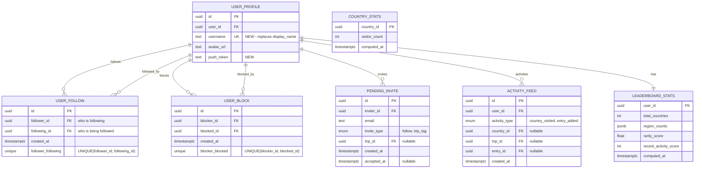

# Feature: Friends & Social System - Phase 1

**Version**: 1.0
**Created**: 2025-12-26
**Type**: Enhancement
**Complexity**: High

---

## Overview

Implement the complete Friends & Social system for Border Badge, enabling users to connect with friends, share travel experiences, and engage in friendly competition through rankings. This phase includes the username system, follow relationships, activity feed, friend rankings, blocking, email invites, push notifications, and trip visibility updates.

This transforms Border Badge from a personal travel diary into a social platform where users can discover destinations through friends' experiences.

---

## Problem Statement

Currently, Border Badge lacks any social connectivity between users. While trip tagging exists in the schema, there's no way to:

- Find and connect with other users
- See where friends have traveled
- Compare travel statistics
- Build a social feed of friends' activities
- Invite non-users to join the platform

This limits engagement and creates no viral growth mechanism.

---

## Proposed Solution

Implement an **asymmetric follow model** (Instagram-style) with:

1. **Username System** - Unique usernames replacing legacy `display_name`
2. **Follow Relationships** - Users can follow others to see their activity
3. **Activity Feed** - Chronological feed of friends' travel activities
4. **Friends Ranking** - Compare stats among people you follow
5. **Blocking** - Privacy controls to block unwanted users
6. **Email Invites** - Invite non-users via email with Resend
7. **Push Notifications** - Notify users of new followers and trip tags
8. **Trip Visibility** - Followers can view each other's trips

---

## Technical Approach

### Architecture Overview

```
┌─────────────────┐
│  Mobile App     │
│  (React Native) │
└────────┬────────┘
         │ JWT Token
         ▼
┌─────────────────┐      ┌──────────────────┐
│  FastAPI        │◄────►│  Supabase        │
│  Backend        │      │  PostgreSQL      │
└────────┬────────┘      │  + RLS Policies  │
         │               └──────────────────┘
         ▼
┌─────────────────┐      ┌──────────────────┐
│  Supabase       │      │  Expo Push       │
│  Edge Functions │      │  Notifications   │
│  (Email/Push)   │      └──────────────────┘
└─────────────────┘
         │
         ▼
┌─────────────────┐
│  Resend API     │
│  (Email)        │
└─────────────────┘
```

### Database Schema



---

## Implementation Phases

### Phase 1.1: Username System (Foundation)

**Why First**: Username system is foundational - all social features depend on unique user identification.

**Tasks**:
- Create migration adding `username` column with case-insensitive unique index
- Add validation constraint (3-30 chars, letters/numbers/underscores only, NO SPACES)
- Create backend endpoint `GET /users/check-username` for availability checks
- Create `UsernameCheckResponse` schema
- Update `NameEntryScreen.tsx` to collect username with real-time validation
- Create `useUsernameCheck.ts` hook with 300ms debounce
- Update `ProfileSettingsScreen.tsx` for username editing
- Update profile API to validate username uniqueness
- Write backend tests for username availability
- Write mobile tests for username validation

**Files to Create**:
- `supabase/migrations/XXXX_add_username.sql`
- `backend/app/schemas/users.py`
- `mobile/src/hooks/useUsernameCheck.ts`

**Files to Modify**:
- `mobile/src/screens/onboarding/NameEntryScreen.tsx`
- `mobile/src/screens/settings/ProfileSettingsScreen.tsx`
- `backend/app/api/profile.py`

### Phase 1.2: Database Schema & Migrations

**Tasks**:
- Create `user_follow` table with bidirectional indexes
- Create `user_block` table with composite indexes
- Create `pending_invite` table with unique constraint using COALESCE
- Create RLS policies for all social tables
- Create SECURITY DEFINER helper functions: `is_blocked()`, `is_following()`
- Create `activity_feed` table with composite index on (user_id, created_at)
- Create triggers for activity feed generation (country visited, entry added)
- Create `leaderboard_stats` table for cached stats
- Create `country_stats` table for rarity calculation
- Create triggers to update stats on user_countries changes
- Add `push_token` column to `user_profile`
- Remove deprecated `date_range` column from `trip` table

**Files to Create**:
- `supabase/migrations/XXXX_social_tables.sql`
- `supabase/migrations/XXXX_activity_feed.sql`
- `supabase/migrations/XXXX_leaderboard_stats.sql`

### Phase 1.3: Follow System Backend

**Tasks**:
- Create `UserSummary` and `UserProfile` schemas
- Create `FollowStats` schema
- Create `backend/app/api/follows.py` router
- Implement `POST /follows/{user_id}` - create follow, check block first
- Implement `DELETE /follows/{user_id}` - delete follow
- Implement `GET /follows/following` - paginated list of users I follow
- Implement `GET /follows/followers` - paginated list of my followers
- Implement `GET /follows/stats` - following/followers count
- Create `backend/app/api/users.py` router
- Implement `GET /users/search?q={query}` - username/email search, exclude blocked
- Implement `GET /users/{username}/profile` - full profile with stats
- Write comprehensive backend tests for follow system
- Write tests for user search and blocking integration

**Files to Create**:
- `backend/app/schemas/users.py`
- `backend/app/schemas/follows.py`
- `backend/app/api/follows.py`
- `backend/app/api/users.py`
- `backend/tests/test_follows.py`
- `backend/tests/test_users.py`

### Phase 1.4: Follow System Mobile

**Tasks**:
- Create `useFollows.ts` with React Query hooks (following, followers, stats, mutations)
- Create `useUserSearch.ts` with 300ms debounce
- Create `FollowButton.tsx` component with optimistic updates
- Create `UserCard.tsx` component (reuse avatar patterns)
- Create `UserSearchBar.tsx` based on `PassportSearchBar` pattern
- Create `FriendsScreen.tsx` with ranking stats + search + feed layout
- Create `UserProfileScreen.tsx` showing passport grid + trips
- Create `FollowersListScreen.tsx` with Following/Followers tabs
- Update `MainTabNavigator.tsx` to point Friends tab to FriendsScreen
- Add navigation types for new screens
- Write component tests for FollowButton

**Files to Create**:
- `mobile/src/hooks/useFollows.ts`
- `mobile/src/hooks/useUserSearch.ts`
- `mobile/src/components/friends/FollowButton.tsx`
- `mobile/src/components/friends/UserCard.tsx`
- `mobile/src/components/friends/UserSearchBar.tsx`
- `mobile/src/screens/friends/FriendsScreen.tsx`
- `mobile/src/screens/friends/UserProfileScreen.tsx`
- `mobile/src/screens/friends/FollowersListScreen.tsx`
- `mobile/src/__tests__/components/FollowButton.test.tsx`

**Files to Modify**:
- `mobile/src/navigation/MainTabNavigator.tsx`
- `mobile/src/navigation/types.ts`

### Phase 1.5: Activity Feed Backend

**Tasks**:
- Create `FeedItem` schema with nested user/country/entry data
- Create `backend/app/api/feed.py` router
- Implement `GET /feed?before={timestamp}&limit=20` with cursor pagination
- Join with `user_follow` to get only followed users' activities
- Exclude blocked users from feed
- Join with `entry` table for `entry_added` activities
- Join with `country` table for `country_visited` activities
- Write comprehensive feed tests (pagination, following-only, blocked exclusion)

**Files to Create**:
- `backend/app/schemas/feed.py`
- `backend/app/api/feed.py`
- `backend/tests/test_feed.py`

### Phase 1.6: Activity Feed Mobile

**Tasks**:
- Create `useFeed.ts` with `useInfiniteQuery` and cursor-based pagination
- Create `FeedItem.tsx` component (reuse `EntryCard` patterns)
- Create `FeedList.tsx` with infinite scroll + pull-to-refresh
- Create `EmptyFeedState.tsx` for when no activity or no follows
- Integrate FeedList into FriendsScreen below search bar
- Handle navigation from feed item to entry/trip detail (read-only)

**Files to Create**:
- `mobile/src/hooks/useFeed.ts`
- `mobile/src/components/friends/FeedItem.tsx`
- `mobile/src/components/friends/FeedList.tsx`
- `mobile/src/components/friends/EmptyFeedState.tsx`

**Files to Modify**:
- `mobile/src/screens/friends/FriendsScreen.tsx`

### Phase 1.7: Friends Ranking Stats

**Tasks**:
- Verify trigger from Phase 1.2 correctly computes `total_countries`
- Implement rarity score computation: `SUM(1.0 / NULLIF(cs.visitor_count, 0))`
- Create `backend/app/api/stats.py` router
- Implement `GET /stats/friends-ranking` - rank among followed users
- Create `useFriendsRanking.ts` hook with refetch on focus
- Create `FriendsRankingStats.tsx` component (reuse `StatBox` directly)
- Integrate stats at top of FriendsScreen (before search bar)
- Handle empty state when user follows nobody

**Files to Create**:
- `backend/app/api/stats.py`
- `mobile/src/hooks/useFriendsRanking.ts`
- `mobile/src/components/friends/FriendsRankingStats.tsx`

**Files to Modify**:
- `mobile/src/screens/friends/FriendsScreen.tsx`

### Phase 1.8: Blocking System

**Tasks**:
- Create `backend/app/api/blocks.py` router
- Implement `POST /blocks/{user_id}` - create block, remove follows
- Implement `DELETE /blocks/{user_id}` - remove block
- Implement `GET /blocks` - list blocked users
- Create `useBlocks.ts` with block/unblock mutations
- Add block option to UserProfileScreen overflow menu with confirmation
- Add blocked users list to ProfileSettingsScreen privacy section
- Write backend tests (block removes follows, blocked can't search blocker)

**Files to Create**:
- `backend/app/api/blocks.py`
- `mobile/src/hooks/useBlocks.ts`
- `backend/tests/test_blocks.py`

**Files to Modify**:
- `mobile/src/screens/friends/UserProfileScreen.tsx`
- `mobile/src/screens/settings/ProfileSettingsScreen.tsx`

### Phase 1.9: Email Invites

**Tasks**:
- Create `backend/app/api/invites.py` router
- Implement `POST /invites` - create pending_invite, rate limit 10/hour
- Implement `GET /invites/pending` - list sent invites
- Create Supabase Edge Function `send-invite-email` calling Resend API
- Create branded email template with invite link
- Trigger Edge Function after creating pending_invite
- Create Edge Function `process-signup-invites` on new user signup
- Auto-create follows from pending invites on signup
- Update mobile: show "Invite" button when email search returns no user
- Show pending invites in Following list with "Pending" badge

**Files to Create**:
- `backend/app/api/invites.py`
- `supabase/functions/send-invite-email/index.ts`
- `supabase/functions/process-signup-invites/index.ts`

**Files to Modify**:
- `mobile/src/components/friends/UserSearchBar.tsx`
- `mobile/src/screens/friends/FollowersListScreen.tsx`

### Phase 1.10: Push Notifications

**Tasks**:
- Add `expo-notifications` dependency if not present
- Create `mobile/src/services/pushNotifications.ts` - register for push token
- Create `backend/app/api/notifications.py` endpoint `POST /notifications/register`
- Save push token to `user_profile.push_token`
- Create Supabase Edge Function `send-push-notification` using Expo Push API
- Trigger push on new follow from `POST /follows/{user_id}`
- Trigger push on trip tag (extend existing logic)
- Handle notification tap in mobile - deep link to profile/trip
- Add notification permission request during onboarding

**Files to Create**:
- `mobile/src/services/pushNotifications.ts`
- `backend/app/api/notifications.py`
- `supabase/functions/send-push-notification/index.ts`

**Files to Modify**:
- `mobile/src/screens/onboarding/` (add permission request)
- `backend/app/api/follows.py` (trigger push)
- `backend/app/api/trips.py` (trigger push on tag)

### Phase 1.11: Trip Visibility & Tagging Integration

**Tasks**:
- Update trip RLS policy: visible to owner OR approved tags OR followers
- Update entry RLS policy: same as parent trip
- Modify trip tag acceptance: auto-create follow (tagged → tagger)
- Send notification that tagged user now follows tagger
- Update `POST /invites` to support `invite_type: 'trip_tag'`
- On signup, process both pending follows AND pending trip tags
- Write tests: follower can view trip, auto-follow on tag acceptance

**Files to Modify**:
- `supabase/migrations/XXXX_trip_visibility_update.sql`
- `backend/app/api/trips.py`
- `backend/app/api/invites.py`

---

## Acceptance Criteria

### Functional Requirements

#### Username System
- [ ] Users can set unique username during onboarding (3-30 chars, no spaces)
- [ ] Real-time availability check shows if username is taken (case-insensitive)
- [ ] Users can edit username in settings with same validation
- [ ] Invalid usernames show clear error messages

#### Follow System
- [ ] Users can search for others by username or email
- [ ] Search results exclude blocked users
- [ ] Users can follow/unfollow with one tap
- [ ] Following is asymmetric (no mutual requirement)
- [ ] Follow button shows optimistic update (instant feedback)
- [ ] Followers/Following counts are accurate
- [ ] Followers and Following lists are paginated

#### User Profiles
- [ ] Viewing another user's profile shows: avatar, username, stats, passport grid, trips
- [ ] All profiles are public (visible without following)
- [ ] Blocked users cannot view each other's profiles (404)
- [ ] Tapping trip from profile navigates to read-only trip detail

#### Activity Feed
- [ ] Feed shows activities only from users I follow
- [ ] Activities include: country visited, entry added with rich entry card
- [ ] Feed uses infinite scroll with pull-to-refresh
- [ ] Blocked users' activities never appear in feed
- [ ] Empty state shows when not following anyone or no activity
- [ ] Tapping feed item navigates to entry/trip detail

#### Friends Ranking
- [ ] Stats at top of Friends tab show my rank among people I follow
- [ ] Stats display: rank (e.g., "#3 of 12"), total countries, rarity score
- [ ] Empty state when following nobody
- [ ] Stats update when I add countries or when followed users update

#### Blocking
- [ ] Users can block from profile overflow menu with confirmation
- [ ] Blocking removes all follow relationships (both directions)
- [ ] Blocked users cannot find blocker in search
- [ ] Blocked users cannot see blocker's profile or content
- [ ] Users can view/manage blocked list in settings
- [ ] Unblocking does not restore follows

#### Email Invites
- [ ] Email search with no results shows "Invite" button
- [ ] Sending invite creates pending_invite record
- [ ] Invited user receives branded email with signup link
- [ ] Pending invites show in Following list with "Pending" badge
- [ ] On signup, pending invite auto-activates follow
- [ ] Rate limited to 10 invites per hour

#### Push Notifications
- [ ] App requests notification permission during onboarding
- [ ] Users receive push when someone follows them
- [ ] Users receive push when tagged on trip
- [ ] Tapping notification navigates to relevant screen
- [ ] Push tokens are registered with backend

#### Trip Visibility
- [ ] Trips are visible to: owner, approved tagged users, AND followers
- [ ] Entries inherit same visibility as parent trip
- [ ] Accepting trip tag auto-creates follow (tagged → tagger)
- [ ] User is notified they now follow the tagger

### Non-Functional Requirements

#### Performance
- [ ] Username availability check debounced to 300ms
- [ ] Feed infinite scroll triggers at 50% from bottom
- [ ] Database queries use proper indexes (no table scans)
- [ ] RLS policies use SECURITY DEFINER functions for complex checks
- [ ] Follow/unfollow has optimistic UI updates (instant feedback)

#### Security
- [ ] All social tables have RLS policies enabled
- [ ] Block checks prevent follows in both directions
- [ ] User search rate limited to 30/minute
- [ ] Email invites rate limited to 10/hour
- [ ] JWT tokens validated on all authenticated endpoints
- [ ] Push tokens stored securely, never exposed in API responses

#### Testing
- [ ] Backend: All endpoints have unit tests (>80% coverage)
- [ ] Backend: Test blocked users excluded from search/feed
- [ ] Backend: Test RLS policies prevent unauthorized access
- [ ] Mobile: FollowButton has component tests
- [ ] Mobile: Username validation has unit tests
- [ ] Integration: Test complete invite flow (send → signup → auto-follow)

---

## Success Metrics

### Adoption Metrics
- **Follow rate**: 50%+ of active users follow at least 3 people within 30 days
- **Invite conversion**: 15%+ of email invites result in signups within 7 days
- **Username completion**: 95%+ of users set username during onboarding

### Engagement Metrics
- **Feed engagement**: 40%+ of users with followers check feed weekly
- **Friends tab visits**: 30%+ weekly active users visit Friends tab
- **Profile views**: Average 5+ profile views per user per week

### Health Metrics
- **Block rate**: <2% of follow relationships result in blocks
- **Unfollow rate**: <10% of follows are undone within 30 days
- **API error rate**: <1% for all social endpoints

---

## Dependencies & Prerequisites

### Infrastructure
- [ ] Supabase project with PostgreSQL 15+
- [ ] Supabase Edge Functions enabled
- [ ] Resend account with API key
- [ ] Expo project with push notification capabilities
- [ ] Backend deployed with environment variables configured

### External Services
- **Resend**: Email delivery service (already integrated)
- **Expo Push Notifications**: Native to Expo stack
- **Supabase Storage**: For avatar uploads (already configured)

### Environment Variables

**Backend** (`backend/.env`):
```bash
RESEND_API_KEY=re_xxxxx
SUPABASE_SERVICE_ROLE_KEY=xxxxx
WEB_BASE_URL=https://borderbadge.com
```

**Supabase Edge Functions**:
```bash
RESEND_API_KEY=re_xxxxx
WEB_BASE_URL=https://borderbadge.com
EXPO_PUSH_URL=https://exp.host/--/api/v2/push/send
```

**Mobile** (`mobile/.env.local`):
```bash
EXPO_PUBLIC_API_URL=http://your-ip:8000
EXPO_PROJECT_ID=your-expo-project-id
```

---

## Risk Analysis & Mitigation

### Technical Risks

**Risk: RLS Performance Degradation**
- **Impact**: High - Slow queries affect all social features
- **Probability**: Medium
- **Mitigation**:
  - Use SECURITY DEFINER functions for complex permission checks
  - Create composite indexes on all foreign keys used in RLS
  - Monitor query performance with `EXPLAIN ANALYZE`
  - Add query caching layer if needed

**Risk: Push Notification Delivery Failures**
- **Impact**: Medium - Users miss important updates
- **Probability**: Low
- **Mitigation**:
  - Implement retry logic with exponential backoff
  - Fall back to in-app notifications
  - Log all notification attempts for debugging
  - Monitor Expo Push API status

**Risk: Email Deliverability Issues**
- **Impact**: Medium - Invites don't reach recipients
- **Probability**: Low
- **Mitigation**:
  - Use Resend's verified domain
  - Include unsubscribe link in all emails
  - Monitor bounce/spam rates
  - Implement email verification flow

**Risk: Race Conditions in Optimistic Updates**
- **Impact**: Low - UI shows stale data briefly
- **Probability**: Medium
- **Mitigation**:
  - Cancel outgoing queries in `onMutate`
  - Always invalidate in `onSettled`
  - Implement rollback in `onError`
  - Use unique request IDs to detect duplicates

### Product Risks

**Risk: Low Follow-Through on Invites**
- **Impact**: Medium - Viral growth mechanism ineffective
- **Probability**: Medium
- **Mitigation**:
  - A/B test email templates
  - Add incentive for inviter (future: unlock features at X friends)
  - Personalize invite with inviter's travel stats
  - Follow up with reminder emails (future)

**Risk: Block/Report Abuse**
- **Impact**: Low - Users misuse blocking feature
- **Probability**: Low
- **Mitigation**:
  - No notification to blocked user (privacy-focused)
  - Add reporting system (future phase)
  - Monitor block rates for anomalies
  - Implement rate limits on blocking (future)

---

## Future Considerations

### Not in Phase 1 (Future Phases)

- **Direct Messaging**: Private messages between users
- **Comments**: Commenting on friends' trips/entries
- **Reactions**: Like/heart system for content
- **Groups**: Travel groups or shared itineraries
- **Private Accounts**: Toggle profile visibility
- **Granular Privacy**: Per-trip visibility controls
- **Suggested Friends**: ML-based recommendations
- **Phone Contacts Sync**: Import phone book
- **Advanced Notifications**: Digest emails, batched push

### Extensibility

The architecture supports future additions:
- New activity types can be added to `activity_feed` enum
- Additional stats can be computed in `leaderboard_stats.region_counts` JSONB
- Notification templates are modular (easy to add new types)
- RLS policies can be extended without breaking existing features

---

## References & Research

### Internal References

**Database Patterns**:
- Migration structure: `supabase/migrations/0001_init_schema.sql`
- RLS policies: `supabase/migrations/0002_rls_policies.sql`
- Trigger patterns: `supabase/migrations/0004_lists.sql`

**Backend API Patterns**:
- Router structure: `backend/app/api/profile.py:1-50`
- Schema patterns: `backend/app/schemas/trips.py:1-100`
- Auth dependency: `backend/app/core/security.py:20-45`
- Database client: `backend/app/db/session.py:1-80`

**Mobile Patterns**:
- React Query hooks: `mobile/src/hooks/useTrips.ts:1-150`
- Component reuse: `mobile/src/components/passport/PassportSearchBar.tsx`
- Stats display: `mobile/src/components/passport/StatBox.tsx`
- Entry cards: `mobile/src/components/entries/EntryCard.tsx`
- Onboarding flow: `mobile/src/screens/onboarding/NameEntryScreen.tsx`

**Testing Patterns**:
- Backend tests: `backend/tests/test_trips_and_tags.py`
- Test fixtures: `backend/tests/conftest.py`

### External References

**Database & RLS**:
- [Supabase RLS Guide](https://supabase.com/docs/guides/auth/row-level-security)
- [Supabase RLS Performance](https://supabase.com/docs/guides/troubleshooting/rls-performance-and-best-practices-Z5Jjwv)
- [PostgreSQL Unique Indexes](https://www.postgresql.org/docs/current/indexes-unique.html)
- [Many-to-Many Relationships](https://www.beekeeperstudio.io/blog/many-to-many-database-relationships-complete-guide)

**Backend (FastAPI)**:
- [FastAPI Documentation](https://fastapi.tiangolo.com/)
- [Pydantic v2](https://docs.pydantic.dev/latest/)
- [Dependency Injection](https://fastapi.tiangolo.com/tutorial/dependencies/)

**Mobile (React Query)**:
- [TanStack Query v5](https://tanstack.com/query/v5/docs/framework/react/overview)
- [Infinite Queries](https://tanstack.com/query/v5/docs/framework/react/guides/infinite-queries)
- [Optimistic Updates](https://tanstack.com/query/v5/docs/framework/react/guides/optimistic-updates)

**Push Notifications**:
- [Expo Push Notifications Setup](https://docs.expo.dev/push-notifications/push-notifications-setup/)
- [Sending Notifications](https://docs.expo.dev/push-notifications/sending-notifications/)
- [Expo Notifications API](https://docs.expo.dev/versions/latest/sdk/notifications/)

**Email**:
- [Resend with Supabase Edge Functions](https://resend.com/docs/send-with-supabase-edge-functions)
- [Supabase Sending Emails](https://supabase.com/docs/guides/functions/examples/send-emails)
- [Transactional Email Best Practices](https://postmarkapp.com/guides/transactional-email-best-practices)

### Related Work

- PRD: `instructions/prd/prd-friends-and-social.md`
- Tasks: `instructions/tasks/tasks-prd-friends-and-social.md`
- Design System: `STYLEGUIDE.md`
- Technical Design: `docs/travel-technical-design.md`

---

## Code Examples

### Database Migration Example

```sql
-- supabase/migrations/XXXX_add_username.sql

-- Add username column
ALTER TABLE user_profile ADD COLUMN username TEXT;

-- Case-insensitive unique index
CREATE UNIQUE INDEX idx_user_profile_username_lower
  ON user_profile(LOWER(username));

-- Validation constraint (letters, numbers, underscores only - NO SPACES)
ALTER TABLE user_profile ADD CONSTRAINT chk_username_format
  CHECK (username ~ '^[a-zA-Z0-9_]{3,30}$');

-- Make NOT NULL (safe for fresh launch)
ALTER TABLE user_profile ALTER COLUMN username SET NOT NULL;

-- Index for fast lookups
CREATE INDEX idx_user_profile_username ON user_profile(username);
```

### Backend Schema Example

```python
# backend/app/schemas/users.py
from pydantic import BaseModel, Field, field_validator
from uuid import UUID
import re

class UsernameCheckResponse(BaseModel):
    """Response for username availability check"""
    available: bool
    suggestion: str | None = None

class UserSummary(BaseModel):
    """Minimal user info for lists"""
    id: UUID
    username: str
    avatar_url: str | None = None
    country_count: int
    is_following: bool

    model_config = ConfigDict(from_attributes=True)

class ProfileUpdate(BaseModel):
    """Update user profile"""
    username: str | None = None

    @field_validator("username")
    @classmethod
    def validate_username(cls, v: str | None) -> str | None:
        if v is None:
            return None
        if not re.match(r'^[a-zA-Z0-9_]{3,30}$', v):
            raise ValueError(
                "Username must be 3-30 characters, "
                "letters/numbers/underscores only"
            )
        return v
```

### Mobile Hook Example

```typescript
// mobile/src/hooks/useFollows.ts
import { useQuery, useMutation, useQueryClient } from '@tanstack/react-query';
import { api } from '@services/api';

const FOLLOWS_KEY = ['follows'];

export function useFollowUser(userId: string) {
  const queryClient = useQueryClient();

  return useMutation({
    mutationFn: async () => {
      await api.post(`/follows/${userId}`);
    },

    onMutate: async () => {
      await queryClient.cancelQueries({ queryKey: ['user', userId] });

      const previous = queryClient.getQueryData(['user', userId]);

      queryClient.setQueryData(['user', userId], (old: any) => ({
        ...old,
        is_following: true,
        follower_count: old.follower_count + 1,
      }));

      return { previous };
    },

    onError: (err, variables, context) => {
      if (context?.previous) {
        queryClient.setQueryData(['user', userId], context.previous);
      }
    },

    onSettled: () => {
      queryClient.invalidateQueries({ queryKey: ['user', userId] });
      queryClient.invalidateQueries({ queryKey: FOLLOWS_KEY });
      queryClient.invalidateQueries({ queryKey: ['feed'] });
    },
  });
}
```

---

## Documentation Plan

### Code Documentation
- [ ] Add JSDoc comments to all new React hooks
- [ ] Add docstrings to all Python functions/classes
- [ ] Document complex RLS policies with inline SQL comments
- [ ] Add README to `mobile/src/screens/friends/` explaining navigation

### API Documentation
- [ ] Update OpenAPI schema with new endpoints
- [ ] Add request/response examples to FastAPI docstrings
- [ ] Document rate limits for each endpoint
- [ ] Create Postman collection for social endpoints (future)

### User Documentation
- [ ] Update onboarding help text for username screen
- [ ] Add tooltip explaining "Following" vs "Followers"
- [ ] Create help article on blocking users
- [ ] Document email invite flow for support team

---

## Pre-Implementation Checklist

- [ ] All environment variables configured (backend, Edge Functions, mobile)
- [ ] Supabase project has Edge Functions enabled
- [ ] Resend account created and API key obtained
- [ ] Expo project configured with push notification credentials
- [ ] Database backups configured before schema changes
- [ ] Staging environment available for testing
- [ ] Design mockups reviewed (if available)
- [ ] Product requirements approved by stakeholders

---

## Post-Implementation Checklist

- [ ] All migrations applied to production database
- [ ] All Edge Functions deployed to production
- [ ] Mobile app submitted to TestFlight/Play Store beta
- [ ] Backend tests passing (>80% coverage)
- [ ] Mobile linting passing (`npm run lint`)
- [ ] Backend linting passing (`poetry run ruff check .`)
- [ ] Load testing completed (100+ concurrent users)
- [ ] Security review completed (RLS policies, auth)
- [ ] Analytics events instrumented (PostHog)
- [ ] Error monitoring configured (Sentry/similar)
- [ ] Documentation updated
- [ ] Team training completed
