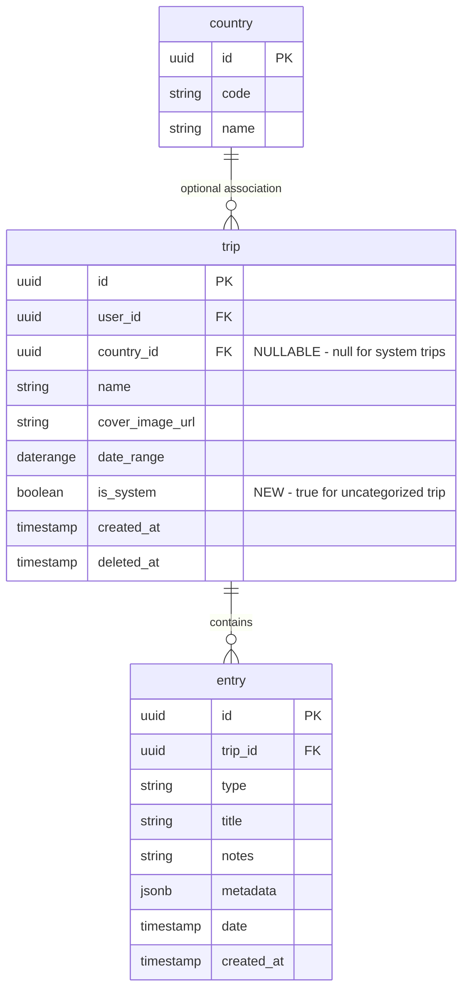

# feat: Add Uncategorized Trip as Entry Holding Area

## Overview

Add an "Uncategorized" trip that serves as a holding area for entries when:
1. No trip exists for the country where the location is detected
2. No country is detected for the location

Users can later categorize these entries into specific trips. This feature improves the share extension UX by eliminating friction when users want to save a place but don't have the right trip set up yet.

---

## Problem Statement

**Current Pain Point:**

When a user shares a TikTok/Instagram link and the detected location is in a country for which they have no trips, the current flow forces them to create a new trip before saving. This adds friction to what should be a quick "save for later" action.

**Example Scenario:**

1. User sees a cool restaurant in Tokyo on TikTok
2. User shares to Atlasi via Share Extension
3. Backend detects location is in Japan
4. User has no Japan trips
5. **Current:** User must create a Japan trip before saving (friction!)
6. **Proposed:** User can save to "Uncategorized" and organize later

**User Research Insight:**

From GTD methodology and apps like Todoist/Things 3: The Inbox pattern allows quick capture without requiring organization decisions upfront. Users can batch their organization during dedicated review sessions.

---

## Proposed Solution

### High-Level Approach

1. Create a special "system" trip per user called "Saved Places" that has no country association
2. When saving a place with no matching trip, offer "Save to Saved Places" as an option
3. Add a dedicated view to see and manage uncategorized entries
4. Allow moving entries from "Saved Places" to any regular trip

### Database Strategy

**Option Chosen: Nullable `country_id` with `is_system` flag**

This is cleaner than creating a sentinel country and provides explicit differentiation between system and user-created trips.

```sql
-- Migration: Make country_id nullable, add is_system flag
ALTER TABLE trip ALTER COLUMN country_id DROP NOT NULL;
ALTER TABLE trip ADD COLUMN is_system BOOLEAN NOT NULL DEFAULT false;

-- Unique constraint: Only one system trip per user
CREATE UNIQUE INDEX idx_trip_unique_system
  ON trip(user_id)
  WHERE is_system = true AND deleted_at IS NULL;
```

---

## Technical Approach

### Architecture Diagram

```
┌─────────────────────────────────────────────────────────────────────────┐
│                           SHARE EXTENSION                                │
│  ┌─────────────────────┐    ┌─────────────────────┐                     │
│  │ ShareCaptureView    │───▶│ ShareCaptureVM      │                     │
│  │ (SwiftUI)           │    │ (Swift)             │                     │
│  └─────────────────────┘    └──────────┬──────────┘                     │
│                                        │                                 │
│                            ┌───────────▼───────────┐                    │
│                            │ TripSelector          │                    │
│                            │ + "Saved Places" opt  │                    │
│                            └───────────────────────┘                    │
└─────────────────────────────────────────────────────────────────────────┘
                                        │
                                        ▼
┌─────────────────────────────────────────────────────────────────────────┐
│                              BACKEND API                                 │
│  ┌─────────────────────┐    ┌─────────────────────┐                     │
│  │ GET /trips          │    │ GET/POST            │                     │
│  │ + is_system filter  │    │ /trips/uncategorized│                     │
│  └─────────────────────┘    └─────────────────────┘                     │
│                                                                          │
│  ┌─────────────────────┐    ┌─────────────────────┐                     │
│  │ PATCH /entries/{id} │    │ POST /entries/      │                     │
│  │ + trip_id update    │    │ bulk-move           │                     │
│  └─────────────────────┘    └─────────────────────┘                     │
└─────────────────────────────────────────────────────────────────────────┘
                                        │
                                        ▼
┌─────────────────────────────────────────────────────────────────────────┐
│                              DATABASE                                    │
│  ┌─────────────────────────────────────────────────────────────────┐    │
│  │ trip                                                             │    │
│  │ + country_id UUID NULL (nullable for system trips)              │    │
│  │ + is_system BOOLEAN DEFAULT false                               │    │
│  └─────────────────────────────────────────────────────────────────┘    │
└─────────────────────────────────────────────────────────────────────────┘
                                        │
                                        ▼
┌─────────────────────────────────────────────────────────────────────────┐
│                           REACT NATIVE APP                               │
│  ┌─────────────────────┐    ┌─────────────────────┐                     │
│  │ TripsListScreen     │    │ SavedPlacesScreen   │                     │
│  │ + "Saved Places"    │───▶│ (new)               │                     │
│  │   card at top       │    │                     │                     │
│  └─────────────────────┘    └──────────┬──────────┘                     │
│                                        │                                 │
│                            ┌───────────▼───────────┐                    │
│                            │ MoveToTripSheet       │                    │
│                            │ (new component)       │                    │
│                            └───────────────────────┘                    │
└─────────────────────────────────────────────────────────────────────────┘
```

### ERD - Schema Changes



---

## Acceptance Criteria

### Functional Requirements

- [ ] User can save an entry to "Saved Places" when no matching trip exists for the detected country
- [ ] User can save an entry to "Saved Places" when no country is detected
- [ ] "Saved Places" trip is automatically created on first use (lazy creation)
- [ ] User can view all uncategorized entries in a dedicated screen
- [ ] User can move a single entry from "Saved Places" to any existing trip
- [ ] User can move multiple entries at once (bulk move)
- [ ] User can create a new trip during the move flow
- [ ] "Saved Places" appears prominently in the trips list with a badge showing count
- [ ] Empty state shown when no uncategorized entries exist
- [ ] iOS Share Extension supports saving to "Saved Places"

### Non-Functional Requirements

- [ ] "Saved Places" trip cannot be deleted by user (protected system trip)
- [ ] "Saved Places" trip cannot be shared or have tags
- [ ] Moving entries updates React Query cache immediately (optimistic update)
- [ ] Entry movement is atomic (all or nothing for bulk moves)
- [ ] Analytics events tracked for save and move actions

---

## Implementation Phases

### Phase 1: Database & Backend Foundation

**Tasks:**

1. **Create database migration** `0033_add_uncategorized_trip.sql`
   - Make `country_id` nullable
   - Add `is_system` column
   - Add unique constraint for system trips
   - Update RLS policies

2. **Update Trip schemas** `backend/app/schemas/trips.py`
   - Add `is_system: bool` field
   - Make `country_code` optional

3. **Add uncategorized trip endpoint** `backend/app/api/trips.py`
   - `GET /trips/uncategorized` - Get or create user's uncategorized trip
   - Filter system trips from regular trip list queries

4. **Add entry move endpoint** `backend/app/api/entries.py`
   - `PATCH /entries/{id}` - Allow `trip_id` update
   - `POST /entries/bulk-move` - Move multiple entries

**Files:**

| File | Changes |
|------|---------|
| `supabase/migrations/0033_add_uncategorized_trip.sql` | New migration |
| `backend/app/schemas/trips.py` | Add is_system, make country optional |
| `backend/app/api/trips.py` | Add uncategorized endpoint, filter system trips |
| `backend/app/api/entries.py` | Add move functionality |

### Phase 2: React Native App Integration

**Tasks:**

1. **Add React Query hooks** `mobile/src/hooks/useUncategorizedTrip.ts`
   - `useUncategorizedTrip()` - Fetch/create uncategorized trip
   - `useMoveEntry()` - Move single entry
   - `useBulkMoveEntries()` - Move multiple entries

2. **Create SavedPlacesScreen** `mobile/src/screens/trips/SavedPlacesScreen.tsx`
   - List uncategorized entries with selection mode
   - Empty state when no entries
   - Navigation to entry details

3. **Create MoveToTripSheet** `mobile/src/components/trips/MoveToTripSheet.tsx`
   - Bottom sheet with trip selection
   - Option to create new trip
   - Optimistic update on selection

4. **Update TripsListScreen** `mobile/src/screens/trips/TripsListScreen.tsx`
   - Add "Saved Places" card at top with badge
   - Navigate to SavedPlacesScreen on tap

5. **Update TripSelector** `mobile/src/components/share/TripSelector.tsx`
   - Add "Saved Places" option when no matching trips
   - Handle uncategorized trip selection

6. **Update useShareCapture** `mobile/src/screens/share/useShareCapture.ts`
   - Add fallback to uncategorized trip
   - Update save flow

**Files:**

| File | Changes |
|------|---------|
| `mobile/src/hooks/useUncategorizedTrip.ts` | New hook file |
| `mobile/src/screens/trips/SavedPlacesScreen.tsx` | New screen |
| `mobile/src/components/trips/MoveToTripSheet.tsx` | New component |
| `mobile/src/screens/trips/TripsListScreen.tsx` | Add uncategorized card |
| `mobile/src/components/share/TripSelector.tsx` | Add uncategorized option |
| `mobile/src/screens/share/useShareCapture.ts` | Update save flow |
| `mobile/src/navigation/types.ts` | Add SavedPlaces screen type |
| `mobile/src/navigation/TripsNavigator.tsx` | Add screen route |

### Phase 3: iOS Share Extension

**Tasks:**

1. **Update ShareCaptureViewModel** `mobile/ios/ShareExtension/ViewModels/ShareCaptureViewModel.swift`
   - Add uncategorized trip support
   - Update TripSelector display logic

2. **Update TripSelector (Swift)** `mobile/ios/ShareExtension/Views/TripSelector.swift`
   - Add "Save to Saved Places" option
   - Handle no-country scenarios

3. **Update APIClient** `mobile/ios/ShareExtension/Services/APIClient.swift`
   - Add endpoint for uncategorized trip

**Files:**

| File | Changes |
|------|---------|
| `mobile/ios/ShareExtension/ViewModels/ShareCaptureViewModel.swift` | Update state handling |
| `mobile/ios/ShareExtension/Views/TripSelector.swift` | Add uncategorized option |
| `mobile/ios/ShareExtension/Services/APIClient.swift` | Add uncategorized endpoint |

### Phase 4: Polish & Testing

**Tasks:**

1. Add analytics events
2. Add unit tests for new hooks
3. Add E2E tests for save/move flows
4. Update empty states with illustrations
5. Add "Saved Places" badge to navigation

---

## UI Specifications

### Saved Places Card (TripsListScreen)

```
┌────────────────────────────────────────────────────────────────┐
│ ┌──────┐                                                       │
│ │  📥  │  Saved Places                              [5 places] │
│ │      │  Quick saves waiting to be organized          →       │
│ └──────┘                                                       │
└────────────────────────────────────────────────────────────────┘
```

- Position: Top of trips list, before "My Adventures" section
- Icon: Inbox/tray icon in `sunsetGold`
- Badge: Entry count in `mossGreen`
- Only visible when count > 0 (or always visible with "All organized!" empty state)

### SavedPlacesScreen Layout

```
┌────────────────────────────────────────────────────────────────┐
│  ←  Saved Places                                    [Select]   │
├────────────────────────────────────────────────────────────────┤
│                                                                │
│  These places are waiting to be organized into trips.          │
│                                                                │
│  ┌──────────────────────────────────────────────────────────┐  │
│  │ ☐  Sushi Dai                                             │  │
│  │     Tokyo, Japan • Restaurant                            │  │
│  │     Saved 2 days ago                                     │  │
│  └──────────────────────────────────────────────────────────┘  │
│                                                                │
│  ┌──────────────────────────────────────────────────────────┐  │
│  │ ☐  Blue Bottle Coffee                                    │  │
│  │     Unknown location • Cafe                              │  │
│  │     Saved yesterday                                      │  │
│  └──────────────────────────────────────────────────────────┘  │
│                                                                │
└────────────────────────────────────────────────────────────────┘
│                                                                │
│            [ Move Selected (2) to Trip ]                       │
│                                                                │
└────────────────────────────────────────────────────────────────┘
```

### MoveToTripSheet

```
┌────────────────────────────────────────────────────────────────┐
│                        ─────                                    │
│                                                                │
│  Move to Trip                                                  │
│                                                                │
│  ┌──────────────────────────────────────────────────────────┐  │
│  │  + Create New Trip                                    →  │  │
│  └──────────────────────────────────────────────────────────┘  │
│                                                                │
│  RECENT TRIPS                                                  │
│                                                                │
│  ┌──────────────────────────────────────────────────────────┐  │
│  │  🇯🇵  Japan 2024                                         │  │
│  └──────────────────────────────────────────────────────────┘  │
│                                                                │
│  ┌──────────────────────────────────────────────────────────┐  │
│  │  🇫🇷  Paris Weekend                                       │  │
│  └──────────────────────────────────────────────────────────┘  │
│                                                                │
│  ALL TRIPS                                                     │
│  ...                                                           │
│                                                                │
└────────────────────────────────────────────────────────────────┘
```

### Empty State (SavedPlacesScreen)

```
┌────────────────────────────────────────────────────────────────┐
│                                                                │
│                          ✨                                    │
│                                                                │
│                    All Organized!                              │
│                                                                │
│        You've sorted all your saved places.                    │
│        Share more places to see them here.                     │
│                                                                │
└────────────────────────────────────────────────────────────────┘
```

---

## Edge Cases & Error Handling

| Scenario | Handling |
|----------|----------|
| Moving entry creates duplicate in target trip | Block with error: "This place already exists in [Trip Name]" |
| Network error during move | Show error toast, entry stays in Saved Places |
| Bulk move partial failure | Rollback entire batch, show error for first failing entry |
| User deletes target trip during move | Refresh trip list, show error if trip no longer exists |
| Entry has no place data | Allow move to any trip (no country constraint) |
| Uncategorized trip accidentally deleted | Re-create on next access (lazy creation) |

---

## API Specifications

### GET /trips/uncategorized

Returns the user's uncategorized trip, creating it if it doesn't exist.

**Response:**
```json
{
  "id": "uuid",
  "name": "Saved Places",
  "is_system": true,
  "country_id": null,
  "country_code": null,
  "entry_count": 5,
  "created_at": "2024-01-15T10:00:00Z"
}
```

### PATCH /entries/{entry_id}

Update entry, including moving to different trip.

**Request:**
```json
{
  "trip_id": "uuid-of-target-trip"
}
```

**Response:** Updated entry object

**Errors:**
- 400: Duplicate place in target trip
- 404: Entry or trip not found
- 403: Not authorized (entry or trip belongs to different user)

### POST /entries/bulk-move

Move multiple entries to a target trip.

**Request:**
```json
{
  "entry_ids": ["uuid1", "uuid2", "uuid3"],
  "target_trip_id": "uuid"
}
```

**Response:**
```json
{
  "moved_count": 3,
  "entries": [...]
}
```

**Errors:**
- 400: One or more entries would create duplicates
- 404: Entries or trip not found

---

## Analytics Events

| Event | Properties | When |
|-------|------------|------|
| `entry_saved_uncategorized` | `source: share_extension\|clipboard`, `has_country: bool` | Entry saved to Saved Places |
| `uncategorized_entries_viewed` | `entry_count: number` | User opens SavedPlacesScreen |
| `entry_moved_from_uncategorized` | `target_trip_id`, `bulk: bool`, `count: number` | Entry moved to regular trip |
| `uncategorized_trip_created` | - | System trip created for user |

---

## Testing Plan

### Unit Tests

- [ ] `useUncategorizedTrip` hook - fetch, create, cache behavior
- [ ] `useMoveEntry` - optimistic updates, error handling
- [ ] `useBulkMoveEntries` - batch processing, rollback
- [ ] TripSelector - uncategorized option display logic

### Integration Tests

- [ ] Save to uncategorized from ShareCaptureScreen
- [ ] Move single entry flow
- [ ] Bulk move flow
- [ ] Create trip during move flow

### E2E Tests

- [ ] Full flow: Share → Save to uncategorized → View → Move to new trip
- [ ] iOS Share Extension: Save to uncategorized

---

## Dependencies & Risks

### Dependencies

- Database migration must be deployed before API changes
- React Native changes require new build (EAS Update won't work for navigation changes)
- iOS Share Extension changes require new TestFlight build

### Risks

| Risk | Likelihood | Impact | Mitigation |
|------|------------|--------|------------|
| Migration breaks existing trip queries | Medium | High | Test migration on staging first, add backward-compatible defaults |
| Share Extension complexity increases | Low | Medium | Keep extension logic minimal, defer to main app |
| Users don't discover Saved Places | Medium | Medium | Add badge/notification, prominent placement |

---

## Future Considerations

1. **Smart Categorization**: Suggest target trip based on entry's detected country
2. **Auto-organization**: "Organize all Japan entries into Japan 2024 trip" action
3. **Saved Places Widget**: iOS home screen widget showing uncategorized count
4. **Reminder Notifications**: "You have 5 places to organize" weekly nudge

---

## References

### Internal Files

| File | Relevance |
|------|-----------|
| [supabase/migrations/0001_init_schema.sql](supabase/migrations/0001_init_schema.sql) | Current trip/entry schema |
| [mobile/src/components/share/TripSelector.tsx](mobile/src/components/share/TripSelector.tsx) | Trip selection component |
| [mobile/src/screens/share/useShareCapture.ts](mobile/src/screens/share/useShareCapture.ts) | Share capture logic |
| [mobile/src/screens/trips/TripsListScreen.tsx](mobile/src/screens/trips/TripsListScreen.tsx) | Trips list display |
| [mobile/ios/ShareExtension/ViewModels/ShareCaptureViewModel.swift](mobile/ios/ShareExtension/ViewModels/ShareCaptureViewModel.swift) | iOS Share Extension |

### External References

- [Todoist Inbox Pattern](https://www.todoist.com/inspiration/how-to-use-todoist-effectively) - GTD inbox methodology
- [Things 3 Inbox Guide](https://culturedcode.com/things/guide/) - Quick capture patterns
- [PatternFly Bulk Selection](https://www.patternfly.org/patterns/bulk-selection/) - Bulk action UX
- [Supabase RLS Guide](https://supabase.com/docs/guides/auth/row-level-security) - Policy patterns
