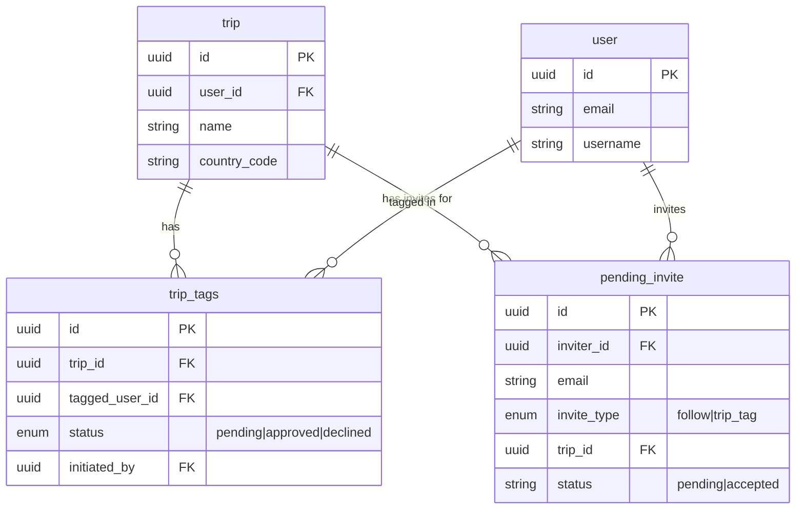

# feat: Universal Travel Companions - Search All Users & Email Invites

## Overview

Expand the Travel Companions tagging feature to support:
1. **All platform users** - not just people you follow
2. **Email invites** - invite non-users to join as trip companions
3. **Seamless flow** - single unified autocomplete input

Currently `TravelCompanionsSection.tsx` only searches users the current user is following, showing an empty state for users with no followers. This creates friction and limits the feature's usefulness.

## Problem Statement

Users cannot:
- Tag friends who are on the platform but not yet followed
- Invite people who aren't on the platform yet
- Create trips with companions when they have no followers

The backend already supports this functionality via:
- `POST /users/search` - searches all users by username
- `POST /invites` with `invite_type: 'trip_tag'` and `trip_id`
- `pending_invite` table for email invites
- Supabase Edge Function that auto-converts invites when user signs up

## Proposed Solution

### User Experience Flow

```
User clicks "Tag friends who traveled with you"
         │
         ▼
┌─────────────────────────────────────────────┐
│  🔍 Search friends or enter email...        │
└─────────────────────────────────────────────┘
         │
         ├── Type nothing: Show followed users as suggestions
         │
         ├── Type "jo":
         │   ├── Followed users matching "jo" appear first
         │   └── Other platform users matching "jo" appear below
         │
         └── Type "friend@email.com":
             ├── If user exists with that email → show user
             └── If no match → show "Invite friend@email.com" option
```

### UI States

| Selection Type | Chip Display | Saved As |
|---------------|--------------|----------|
| Existing user (followed) | Avatar + @username | `tagged_user_ids[]` → `trip_tag` |
| Existing user (not followed) | Avatar + @username | `tagged_user_ids[]` → `trip_tag` |
| Email invite | 📧 email@domain.com [Pending] | `invited_emails[]` → `pending_invite` |

## Technical Approach

### Files to Create/Modify

| File | Action | Purpose |
|------|--------|---------|
| `mobile/src/hooks/useDebounce.ts` | Create | Debounce hook for search input |
| `mobile/src/components/trips/TravelCompanionsSection.tsx` | Modify | Add user search + email invite |
| `mobile/src/screens/trips/TripFormScreen.tsx` | Modify | Pass `tripId` for invites, handle `invitedEmails` state |
| `backend/app/api/trips.py` | Verify | Ensure invite creation happens on trip save |

### Implementation Phases

#### Phase 1: Add useDebounce Hook

Create `/Users/emerson/Sites/border-badge/mobile/src/hooks/useDebounce.ts`:

```typescript
import { useEffect, useState } from 'react';

export function useDebounce<T>(value: T, delay: number = 300): T {
  const [debouncedValue, setDebouncedValue] = useState<T>(value);

  useEffect(() => {
    const timer = setTimeout(() => {
      setDebouncedValue(value);
    }, delay);

    return () => clearTimeout(timer);
  }, [value, delay]);

  return debouncedValue;
}
```

#### Phase 2: Enhance TravelCompanionsSection

Update the component to:

1. **Use both `useFollowing` AND `useUserSearch`**
   - When search is empty: show followed users as suggestions
   - When searching: query all users, show followed first

2. **Add email detection and invite UI**
   - Detect valid email format
   - Show "Invite [email]" option when no user found

3. **Track two selection types**
   - `selectedUserIds: Set<string>` - existing users
   - `invitedEmails: Set<string>` - email invites

4. **Display email chips with Pending badge**
   - Use existing `CompanionChip` with email display
   - Add "Pending" badge for email invites

Key code changes:

```typescript
// Add imports
import { useUserSearch } from '@hooks/useUserSearch';
import { useDebounce } from '@hooks/useDebounce';

// Props update
interface TravelCompanionsSectionProps {
  selectedIds: Set<string>;
  invitedEmails: Set<string>;
  onToggleSelection: (userId: string) => void;
  onToggleEmailInvite: (email: string) => void;
  disabled?: boolean;
}

// Inside component
const debouncedSearch = useDebounce(search, 300);
const isEmail = /^[^\s@]+@[^\s@]+\.[^\s@]+$/.test(search.trim());

// Use both hooks
const { data: following = [], isLoading: loadingFollowing } = useFollowing({ limit: 100 });
const { data: searchResults = [], isLoading: searchLoading } = useUserSearch(debouncedSearch, {
  enabled: debouncedSearch.length >= 2,
});

// Combine results: followed users first, then others
const combinedUsers = useMemo(() => {
  if (!debouncedSearch || debouncedSearch.length < 2) {
    return following; // Show all followed when not searching
  }

  const query = debouncedSearch.toLowerCase();
  const matchingFollowed = following.filter(
    (u) => u.username.toLowerCase().includes(query) || u.display_name.toLowerCase().includes(query)
  );

  const followedIds = new Set(matchingFollowed.map((u) => u.id));
  const otherUsers = searchResults.filter((u) => !followedIds.has(u.id));

  return [...matchingFollowed, ...otherUsers];
}, [following, searchResults, debouncedSearch]);

// Show invite option when email entered and no match
const showInviteOption = isEmail && combinedUsers.length === 0 && !searchLoading;
```

#### Phase 3: Update TripFormScreen

Update the screen to:

1. **Track invited emails state**
   ```typescript
   const [invitedEmails, setInvitedEmails] = useState<Set<string>>(new Set());
   ```

2. **Pass to TravelCompanionsSection**
   ```typescript
   <TravelCompanionsSection
     selectedIds={selectedCompanionIds}
     invitedEmails={invitedEmails}
     onToggleSelection={handleToggleCompanion}
     onToggleEmailInvite={handleToggleEmailInvite}
     disabled={isLoading}
   />
   ```

3. **Handle email invites on save**
   ```typescript
   // In handleSave, after trip creation succeeds:
   if (invitedEmails.size > 0 && newTrip) {
     for (const email of invitedEmails) {
       await sendInvite.mutateAsync({
         email,
         invite_type: 'trip_tag',
         trip_id: newTrip.id,
       });
     }
   }
   ```

#### Phase 4: Add Email Invite Chip Variant

Update `CompanionChip.tsx` to support email display:

```typescript
interface CompanionChipProps {
  user?: {
    id: string;
    username: string;
    avatar_url: string | null;
  };
  email?: string; // New: for email invites
  status?: CompanionStatus;
  onRemove?: () => void;
}

// Render email variant
{email && !user && (
  <View style={styles.emailIcon}>
    <Ionicons name="mail-outline" size={16} color={colors.mossGreen} />
  </View>
)}
<Text style={styles.username} numberOfLines={1}>
  {user ? `@${user.username}` : email}
</Text>
```

## Acceptance Criteria

### Functional Requirements

- [ ] User can search for any platform user by username (not just followed)
- [ ] Followed users appear first in search results
- [ ] User can enter an email address to invite a non-user
- [ ] Email invites display as chips with "Pending" badge
- [ ] Email invites are created via `POST /invites` with `trip_tag` type when trip saves
- [ ] User can remove email invites before saving
- [ ] Empty state shows followed users as suggestions (no more "go to Friends tab")

### Edge Cases

- [ ] Duplicate email prevention (same email can't be invited twice)
- [ ] Self-tagging prevention (current user filtered from results)
- [ ] Email validation (must be valid format before showing invite option)
- [ ] Blocked user filtering (blocked users don't appear in search)

### UX Requirements

- [ ] 300ms debounce on search input
- [ ] Minimum 2 characters to trigger search
- [ ] Loading indicator while searching
- [ ] Clear visual distinction between user chips and email chips

## References

### Similar Patterns in Codebase

- `mobile/src/components/friends/UserSearchBar.tsx:78-120` - Email invite pattern
- `mobile/src/hooks/useUserSearch.ts` - User search API hook
- `mobile/src/hooks/useInvites.ts` - `useSendInvite` mutation

### Backend APIs

- `backend/app/api/users.py:search_users` - User search endpoint
- `backend/app/api/invites.py:send_invite` - Invite creation endpoint
- `backend/app/schemas/invites.py` - Invite schemas with `trip_tag` type

### Database

- `supabase/migrations/0033_social_tables.sql` - `pending_invite` table
- `supabase/functions/process-signup-invites/index.ts` - Auto-conversion on signup

## ERD: Invite Flow



## Open Questions (Resolved)

| Question | Answer |
|----------|--------|
| Should emails match existing users? | No - search by username only. Email → invite. |
| Max companions per trip? | No hard limit, UI handles overflow with scrolling |
| Self-tagging prevention? | Filter current user from all search results |
| Blocked user handling? | Backend already filters blocked users from search |
| Email normalization? | Backend lowercases and trims emails |

## Testing Notes

1. Create trip with mix of followed users, unfollowed users, and email invites
2. Verify email invites show "Pending" badge
3. Verify email invite is created in `pending_invite` table with correct `trip_id`
4. Test invite flow by signing up with invited email (should auto-approve trip_tag)
5. Test duplicate email prevention
6. Test removing email invite before save
