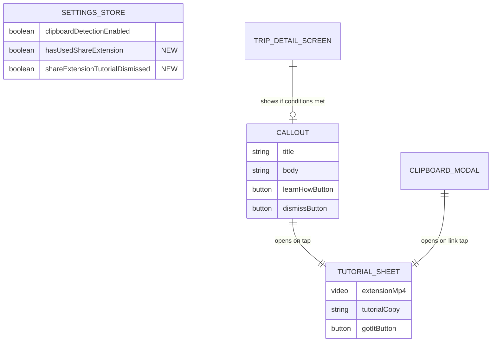

# Share Extension Tutorial System

**Created:** 2025-01-14
**Status:** Ready for Review
**Complexity:** Medium
**Type:** Enhancement

---

## Overview

Add an instructional tutorial system to help users discover and learn how to use the share extension feature for saving travel ideas from TikTok and Instagram. The feature includes:

1. **Callout Box**: A persistent prompt at the bottom of trip screens for users who haven't used the share extension
2. **Tutorial Drawer**: A slide-up drawer with video tutorial and explanatory text
3. **Paste Modal Integration**: Alternative access point from the clipboard paste overlay

---

## Problem Statement

Users may not discover or understand how to use the iOS share extension feature that allows them to save travel content directly from TikTok and Instagram. This feature is powerful but hidden - users need to know it exists and how to use it.

**Current state:** No in-app education about the share extension
**Desired state:** Contextual prompts guide users to discover and use the feature

---

## Proposed Solution

### 1. Callout Box on Trip Screens

A small, non-intrusive callout at the bottom of `TripDetailScreen` that appears for users who haven't yet used the share extension.

**Copy:**
> **Need Inspiration?**
> Save ideas from TikTok and Instagram directly to your trips.
> [Learn How]

**Behavior:**
- Appears on ALL trip detail screens (visited or dream trips)
- Positioned as FlatList footer to avoid blocking FAB
- Tapping anywhere on callout opens tutorial drawer
- **Dismissal logic:** Never shows again after user saves content via share extension

### 2. Tutorial Drawer (Bottom Sheet)

A slide-up drawer styled like `ExploreFilterSheet` containing:

1. **Video tutorial** (`extension.mp4`) playing full-width, auto-looping, muted
2. **Explanatory text** below video with step-by-step instructions
3. **"Got It" button** to dismiss

**Tutorial Copy (below video):**
> **Save Any Travel Inspiration**
>
> 1. Find a video or post on TikTok or Instagram
> 2. Tap the share button
> 3. Select **Border Badge** from the share menu
> 4. Choose which trip to save it to
>
> Your saves appear in your trip's log alongside your own memories.

### 3. Paste Modal Integration

Add a "How does this work?" link to `ClipboardPasteModal` that opens the same tutorial drawer.

---

## Technical Approach

### State Management

Add two flags to `settingsStore.ts`:

```typescript
// settingsStore.ts additions
interface SettingsState {
  // ... existing
  hasUsedShareExtension: boolean;
  shareExtensionTutorialDismissed: boolean; // For manual "x" dismissal

  setHasUsedShareExtension: (used: boolean) => void;
  setShareExtensionTutorialDismissed: (dismissed: boolean) => void;
}
```

### Share Extension Detection

The iOS share extension should write to shared AsyncStorage via App Groups when a save completes:

```swift
// In share extension's success handler
UserDefaults(suiteName: "group.com.borderbadge")?.set(true, forKey: "hasUsedShareExtension")
```

Main app reads this on launch:

```typescript
// In App.tsx or auth initialization
import SharedGroupPreferences from 'react-native-shared-group-preferences';

const checkShareExtensionUsage = async () => {
  try {
    const hasUsed = await SharedGroupPreferences.getItem('hasUsedShareExtension', 'group.com.borderbadge');
    if (hasUsed) {
      useSettingsStore.getState().setHasUsedShareExtension(true);
    }
  } catch (error) {
    // App Groups not available, ignore
  }
};
```

**Alternative (simpler):** Check if any entries have `source: 'share_extension'` on app launch.

### Component Structure

```
mobile/src/components/share/
├── ShareExtensionTutorialSheet.tsx   # New - Bottom sheet with video + text
├── ShareExtensionCallout.tsx         # New - Callout box for TripDetailScreen
├── ClipboardPasteModal.tsx           # Modified - Add tutorial link
└── ClipboardPasteButton.tsx          # Existing
```

---

## Acceptance Criteria

### Functional Requirements

- [ ] Callout box appears at bottom of TripDetailScreen for users who haven't used share extension
- [ ] Callout box disappears permanently after user saves content via share extension
- [ ] Callout box has manual dismiss (X) that hides it for current session only
- [ ] Tapping callout opens tutorial drawer with slide-up animation
- [ ] Tutorial drawer displays extension.mp4 video full-width, auto-playing, muted, looped
- [ ] Tutorial drawer displays explanatory text below video
- [ ] Tutorial drawer can be dismissed via: tap outside, swipe down, "Got It" button
- [ ] ClipboardPasteModal includes "How does this work?" link opening tutorial drawer
- [ ] Tutorial drawer accessible from both entry points (callout + paste modal)

### Non-Functional Requirements

- [ ] Video loads within 500ms (bundled locally, not remote)
- [ ] Drawer animation matches ExploreFilterSheet (spring physics)
- [ ] Respects reduced motion accessibility setting
- [ ] All interactive elements have accessibility labels
- [ ] Callout doesn't block FAB or entry grid interaction

### Quality Gates

- [ ] Callout positioning tested on various device sizes
- [ ] Video playback tested on iOS simulator and physical device
- [ ] Drawer dismissal gestures work consistently
- [ ] State persistence verified across app restarts

---

## Implementation Plan

### Phase 1: Foundation (State + Tutorial Sheet)

**Files to create:**

1. `mobile/src/components/share/ShareExtensionTutorialSheet.tsx`
   - Slide-up drawer using Modal + Animated
   - VideoView with expo-video for playback
   - Explanatory text section
   - "Got It" dismiss button
   - Pan gesture for swipe-down dismissal

**Files to modify:**

2. `mobile/src/stores/settingsStore.ts`
   - Add `hasUsedShareExtension` boolean
   - Add `shareExtensionTutorialDismissed` boolean
   - Add selector functions

### Phase 2: Trip Screen Integration (Callout)

**Files to create:**

3. `mobile/src/components/share/ShareExtensionCallout.tsx`
   - Styled callout box component
   - Manual dismiss (X) button
   - "Learn How" button
   - Conditional rendering based on settingsStore

**Files to modify:**

4. `mobile/src/screens/trips/TripDetailScreen.tsx`
   - Import ShareExtensionCallout and ShareExtensionTutorialSheet
   - Add callout as FlatList ListFooterComponent
   - Add tutorial sheet modal state
   - Wire up open/close handlers

### Phase 3: Paste Modal Integration

**Files to modify:**

5. `mobile/src/components/share/ClipboardPasteModal.tsx`
   - Add "How does this work?" link below auto-detect section
   - Wire up to open tutorial sheet
   - Handle modal stacking (paste modal stays open behind sheet)

### Phase 4: Share Extension Detection (iOS)

**Files to modify:**

6. `mobile/plugins/share-extension/` (iOS native code)
   - Write to App Groups UserDefaults on successful save

7. `mobile/src/App.tsx` or initialization code
   - Read App Groups flag on app launch
   - Sync to settingsStore

---

## UI/UX Specifications

### Callout Box

```
┌─────────────────────────────────────────────────┐
│  [X]                                            │
│                                                 │
│  Need Inspiration?                              │
│  Save ideas from TikTok and Instagram           │
│  directly to your trips.                        │
│                                                 │
│              [ Learn How ]                      │
│                                                 │
└─────────────────────────────────────────────────┘
```

**Styling:**
- Background: `paperBeige` (#F5ECE0)
- Border: 1px `rgba(0,0,0,0.08)`
- Border radius: 16px
- Shadow: subtle (matching luggage tag)
- Title: Playfair Bold, 18px, `midnightNavy`
- Body: Open Sans Regular, 14px, `stormGray`
- Button: `sunsetGold` background, `midnightNavy` text
- Dismiss X: top-right corner, `stormGray`
- Margin: 16px horizontal, positioned as FlatList footer

### Tutorial Drawer

```
┌─────────────────────────────────────────────────┐
│                    ───                          │  ← Handle bar
│                                                 │
│  ┌─────────────────────────────────────────┐   │
│  │                                         │   │
│  │           [VIDEO PLAYER]                │   │
│  │           extension.mp4                 │   │
│  │           (full width, 16:9)            │   │
│  │                                         │   │
│  └─────────────────────────────────────────┘   │
│                                                 │
│  Save Any Travel Inspiration                    │
│                                                 │
│  1. Find a video or post on TikTok or Instagram │
│  2. Tap the share button                        │
│  3. Select Border Badge from the share menu     │
│  4. Choose which trip to save it to             │
│                                                 │
│  Your saves appear in your trip's log           │
│  alongside your own memories.                   │
│                                                 │
│                                                 │
│  ┌─────────────────────────────────────────┐   │
│  │              Got It                     │   │
│  └─────────────────────────────────────────┘   │
│                                                 │
└─────────────────────────────────────────────────┘
```

**Styling:**
- Height: ~65% of screen (dynamic based on content)
- Background: `warmCream`
- Border radius: 24px (top corners)
- Handle bar: 36x4px, `stormGray` 40% opacity
- Video: Full width minus 24px padding, aspect ratio from video
- Title: Playfair Bold, 22px, `midnightNavy`
- Steps: Open Sans Regular, 15px, `midnightNavy`, numbered list
- Footer text: Open Sans Regular, 14px, `stormGray`, italic
- Button: Full width, `mossGreen` background, `cloudWhite` text

---

## File Changes Summary

| File | Action | Description |
|------|--------|-------------|
| `components/share/ShareExtensionTutorialSheet.tsx` | Create | Bottom sheet with video + tutorial text |
| `components/share/ShareExtensionCallout.tsx` | Create | Callout box component |
| `stores/settingsStore.ts` | Modify | Add tutorial-related flags |
| `screens/trips/TripDetailScreen.tsx` | Modify | Add callout + sheet integration |
| `components/share/ClipboardPasteModal.tsx` | Modify | Add tutorial link |
| `plugins/share-extension/ShareViewController.swift` | Modify | Write to App Groups on success |
| `App.tsx` | Modify | Read App Groups flag on launch |

---

## ERD (State Changes)



---

## Edge Cases & Error Handling

### Video Loading Failure

If video fails to load (corrupted bundle, codec issue):
- Show fallback static image with share extension icon
- Display tutorial text without video
- Log error to analytics for debugging

### Pre-Existing Users (Migration)

For users who used share extension before this feature:
- **Simple approach:** Show callout once, they'll use extension again → dismissed
- **Better approach:** Check for entries with `source: share_extension` on first launch of new version, set flag if found

### Android Users

- Share extension is iOS-only
- Callout still shows (feature discovery for when/if Android support added)
- Or: Hide callout entirely on Android via `Platform.OS` check

### Reduced Motion

- Disable spring animations, use fade only
- Video still plays (not considered "animation" for accessibility)

---

## Analytics Events (Optional)

| Event | Trigger | Properties |
|-------|---------|------------|
| `tutorial_callout_shown` | Callout renders on screen | `trip_id`, `screen` |
| `tutorial_callout_tapped` | User taps "Learn How" | `trip_id` |
| `tutorial_callout_dismissed` | User taps X | `trip_id` |
| `tutorial_sheet_opened` | Sheet opens | `entry_point` (callout/paste_modal) |
| `tutorial_sheet_dismissed` | Sheet closes | `method` (button/gesture/backdrop) |
| `share_extension_used` | User saves via extension | `trip_id`, `content_type` |

---

## Dependencies

### Required Packages (Already Installed)
- `expo-video` - Video playback
- `expo-haptics` - Feedback on interactions
- `react-native-gesture-handler` - Swipe gestures
- `@react-native-async-storage/async-storage` - State persistence

### Optional (For App Groups Detection)
- `react-native-shared-group-preferences` - Read iOS App Groups data

---

## Testing Plan

### Manual Testing

1. **Fresh install:** Verify callout appears on trip screens
2. **After extension use:** Verify callout disappears permanently
3. **Manual dismiss:** Verify X hides callout for session only
4. **Tutorial drawer:** Verify video plays, gestures work
5. **Paste modal:** Verify link opens tutorial
6. **App restart:** Verify flag persistence
7. **Multiple devices:** Document expected behavior (flags are local)

### Automated Testing

- Unit test: settingsStore flag updates
- Unit test: Callout conditional rendering logic
- E2E test: Callout → tutorial flow (if Detox configured)

---

## Open Questions (Resolved)

| Question | Decision |
|----------|----------|
| Manual dismissal? | Yes - X button, session-only (shows again next launch) |
| Video auto-play? | Yes, muted, looped |
| Callout frequency? | Show on every trip until extension used |
| Pre-existing users? | Accept false positive, they'll use again quickly |
| Android behavior? | Hide callout (iOS-only feature) |

---

## References

### Internal Files
- [TripDetailScreen.tsx](mobile/src/screens/trips/TripDetailScreen.tsx) - Target integration point
- [ExploreFilterSheet.tsx](mobile/src/components/ui/ExploreFilterSheet.tsx) - Reference for drawer pattern
- [ClipboardPasteModal.tsx](mobile/src/components/share/ClipboardPasteModal.tsx) - Second integration point
- [settingsStore.ts](mobile/src/stores/settingsStore.ts) - State management pattern
- [STYLEGUIDE.md](docs/STYLEGUIDE.md) - Design system reference

### Assets
- [extension.mp4](mobile/assets/extension.mp4) - Tutorial video (1.2MB, bundled)

### External Documentation
- [expo-video API](https://docs.expo.dev/versions/latest/sdk/video/)
- [React Native Modal](https://reactnative.dev/docs/modal)
- [Zustand persist middleware](https://github.com/pmndrs/zustand#persist-middleware)
